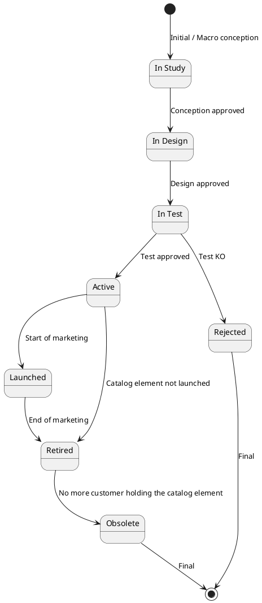
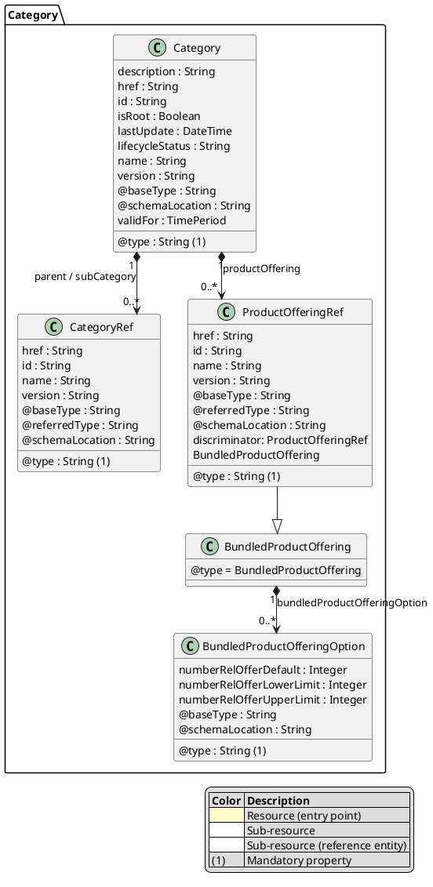
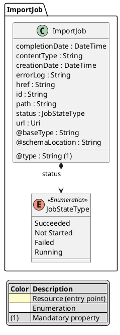
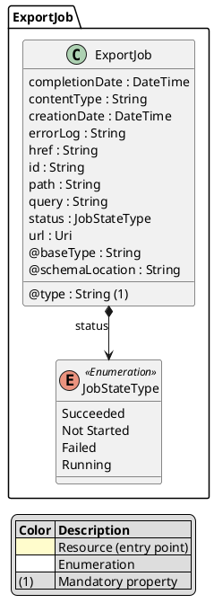
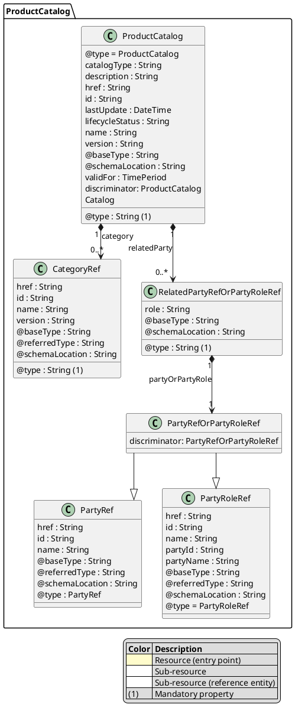
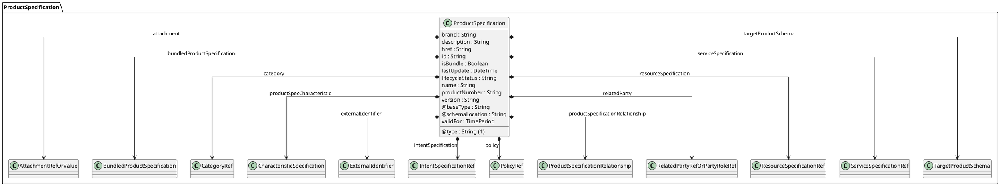
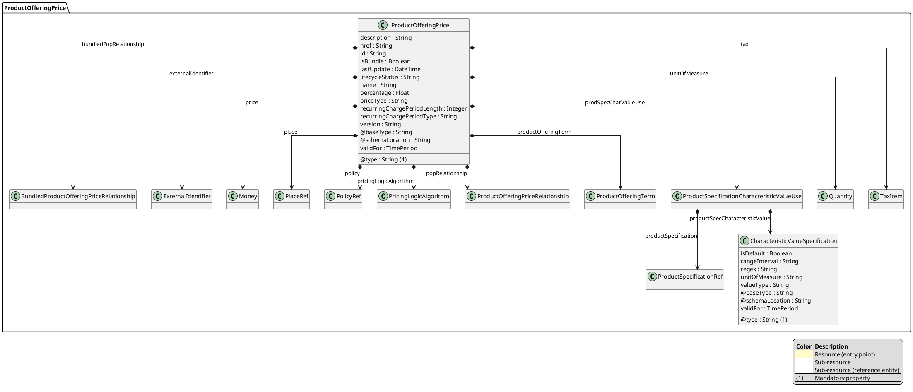

[Image: TM Forum logo]

# TM Forum Specification

## Product Catalog Management

**TMF620**

|                     |                           |
| :------------------ | :------------------------ |
| **Maturity Level:** | General availability      |
| **Release Status:** | Production                |
| **Version 5.0.0**   |                           |
| **Team Approved Date:** | 29-09-2023                |
| **Approval Status:**  | Team Approved             |
| **IPR Mode:**         | RAND                      |

© TM Forum 2023. All Rights Reserved.

tmforum.org

[Image: TM Forum logo]

# NOTICE

Copyright © TM Forum 2023. All Rights Reserved.

This document and translations of it may be copied and furnished to others, and derivative works that comment on or otherwise explain it or assist in its implementation may be prepared, copied, published, and distributed, in whole or in part, without restriction of any kind, provided that the above copyright notice and this section are included on all such copies and derivative works. However, this document itself may not be modified in any way, including by removing the copyright notice or references to TM FORUM, except as needed for the purpose of developing any document or deliverable produced by a TM FORUM Collaboration Project Team (in which case the rules applicable to copyrights, as set forth in the TM FORUM IPR Policy, must be followed) or as required to translate it into languages other than English.

The limited permissions granted above are perpetual and will not be revoked by TM FORUM or its successors or assigns.

This document and the information contained herein is provided on an "AS IS" basis and TM FORUM DISCLAIMS ALL WARRANTIES, EXPRESS OR IMPLIED, INCLUDING BUT NOT LIMITED TO ANY WARRANTY THAT THE USE OF THE INFORMATION HEREIN WILL NOT INFRINGE ANY OWNERSHIP RIGHTS OR ANY IMPLIED WARRANTIES OF MERCHANTABILITY OR FITNESS FOR A PARTICULAR PURPOSE.

Direct inquiries to the TM Forum office:

181 New Road, Suite 304
Parsippany, NJ 07054, USA
Tel No. +1 862 227 1648
TM Forum Web Page: www.tmforum.org

# Table of Contents

*   NOTICE . . . . . . . . . . . . . . . . . . . . . . . . . . . . . . . . . . . . . . . . . . . . . . . . . . . . . . . . . . . . . . . . . . i
*   Introduction . . . . . . . . . . . . . . . . . . . . . . . . . . . . . . . . . . . . . . . . . . . . . . . . . . . . . . . . . . . . . . . 3
*   Characteristics and Features . . . . . . . . . . . . . . . . . . . . . . . . . . . . . . . . . . . . . . . . . . . . . . . . . 4
    *   Characteristics. . . . . . . . . . . . . . . . . . . . . . . . . . . . . . . . . . . . . . . . . . . . . . . . . . . . . . . . . . . 4
    *   Characteristic-Based or Schema-Based. . . . . . . . . . . . . . . . . . . . . . . . . . . . . . . . . . . . . . . . . 5
        *   Characteristic-Based. . . . . . . . . . . . . . . . . . . . . . . . . . . . . . . . . . . . . . . . . . . . . . . . . . . . . . 5
        *   Schema-Based . . . . . . . . . . . . . . . . . . . . . . . . . . . . . . . . . . . . . . . . . . . . . . . . . . . . . . . . . 5
    *   Multiple Catalogs. . . . . . . . . . . . . . . . . . . . . . . . . . . . . . . . . . . . . . . . . . . . . . . . . . . . . . . . . . . 7
    *   Lifecycle Management Extensions to Catalog . . . . . . . . . . . . . . . . . . . . . . . . . . . . . . . . . . . . 8
        *   Query all versioned catalog resources . . . . . . . . . . . . . . . . . . . . . . . . . . . . . . . . . . . . . . . . 8
        *   Query a specific versioned catalog resource . . . . . . . . . . . . . . . . . . . . . . . . . . . . . . . . . . . 9
        *   Retrieve current version of a catalog resource . . . . . . . . . . . . . . . . . . . . . . . . . . . . . . . . . 10
        *   Create new version of a catalog resource. . . . . . . . . . . . . . . . . . . . . . . . . . . . . . . . . . . . . 10
        *   Modify an existing version of a catalog resource . . . . . . . . . . . . . . . . . . . . . . . . . . . . . . . 11
    *   Role based Access Control . . . . . . . . . . . . . . . . . . . . . . . . . . . . . . . . . . . . . . . . . . . . . . . . . . 13
*   Sample Use Cases . . . . . . . . . . . . . . . . . . . . . . . . . . . . . . . . . . . . . . . . . . . . . . . . . . . . . . . . 14
    *   Lifecycle Management Use Case . . . . . . . . . . . . . . . . . . . . . . . . . . . . . . . . . . . . . . . . . . . 14
    *   Order Management Use Case . . . . . . . . . . . . . . . . . . . . . . . . . . . . . . . . . . . . . . . . . . . . . 15
    *   Entity Lifecycle States . . . . . . . . . . . . . . . . . . . . . . . . . . . . . . . . . . . . . . . . . . . . . . . . . . . . 15
*   Support of polymorphism and extension patterns. . . . . . . . . . . . . . . . . . . . . . . . . . . . . . . . . 18
*   RESOURCE MODEL . . . . . . . . . . . . . . . . . . . . . . . . . . . . . . . . . . . . . . . . . . . . . . . . . . . . . . 19
    *   Managed Entity and Task Resource Models. . . . . . . . . . . . . . . . . . . . . . . . . . . . . . . . . . . 19
        *   Category resource. . . . . . . . . . . . . . . . . . . . . . . . . . . . . . . . . . . . . . . . . . . . . . . . . . . . . 19
        *   ImportJob resource . . . . . . . . . . . . . . . . . . . . . . . . . . . . . . . . . . . . . . . . . . . . . . . . . . . . 24
        *   ExportJob resource . . . . . . . . . . . . . . . . . . . . . . . . . . . . . . . . . . . . . . . . . . . . . . . . . . . . 25
        *   ProductCatalog resource. . . . . . . . . . . . . . . . . . . . . . . . . . . . . . . . . . . . . . . . . . . . . . . . 26
        *   ProductOffering resource . . . . . . . . . . . . . . . . . . . . . . . . . . . . . . . . . . . . . . . . . . . . . . . 31
        *   ProductSpecification resource. . . . . . . . . . . . . . . . . . . . . . . . . . . . . . . . . . . . . . . . . . . . 59
        *   ProductOfferingPrice resource . . . . . . . . . . . . . . . . . . . . . . . . . . . . . . . . . . . . . . . . . . . 79
    *   Notification Resource Models . . . . . . . . . . . . . . . . . . . . . . . . . . . . . . . . . . . . . . . . . . . . . . 95
        *   Category State Change Event. . . . . . . . . . . . . . . . . . . . . . . . . . . . . . . . . . . . . . . . . . . . 97
        *   Category Delete Event . . . . . . . . . . . . . . . . . . . . . . . . . . . . . . . . . . . . . . . . . . . . . . . . . 98
        *   Category Create Event . . . . . . . . . . . . . . . . . . . . . . . . . . . . . . . . . . . . . . . . . . . . . . . . . 98
        *   Category Attribute Value Change Event . . . . . . . . . . . . . . . . . . . . . . . . . . . . . . . . . . . . 99
        *   Import Job Create Event . . . . . . . . . . . . . . . . . . . . . . . . . . . . . . . . . . . . . . . . . . . . . . . 100
        *   Import Job State Change Event . . . . . . . . . . . . . . . . . . . . . . . . . . . . . . . . . . . . . . . . . 101
        *   Export Job Create Event . . . . . . . . . . . . . . . . . . . . . . . . . . . . . . . . . . . . . . . . . . . . . . . 102
        *   Export Job State Change Event . . . . . . . . . . . . . . . . . . . . . . . . . . . . . . . . . . . . . . . . . 102
        *   Product Catalog State Change Event . . . . . . . . . . . . . . . . . . . . . . . . . . . . . . . . . . . . . 103
        *   Product Catalog Attribute Value Change Event. . . . . . . . . . . . . . . . . . . . . . . . . . . . . . 104
        *   Product Catalog Create Event. . . . . . . . . . . . . . . . . . . . . . . . . . . . . . . . . . . . . . . . . . . 105
        *   Product Catalog Delete Event. . . . . . . . . . . . . . . . . . . . . . . . . . . . . . . . . . . . . . . . . . . 106
        *   Product Offering Attribute Value Change Event . . . . . . . . . . . . . . . . . . . . . . . . . . . . . 106
        *   Product Offering State Change Event. . . . . . . . . . . . . . . . . . . . . . . . . . . . . . . . . . . . . 107
        *   Product Offering Delete Event. . . . . . . . . . . . . . . . . . . . . . . . . . . . . . . . . . . . . . . . . . . 108
        *   Product Offering Create Event . . . . . . . . . . . . . . . . . . . . . . . . . . . . . . . . . . . . . . . . . . 109
        *   Product Specification Attribute Value Change Event. . . . . . . . . . . . . . . . . . . . . . . . . . 114
        *   Product Specification Create Event. . . . . . . . . . . . . . . . . . . . . . . . . . . . . . . . . . . . . . . 115
        *   Product Specification Delete Event . . . . . . . . . . . . . . . . . . . . . . . . . . . . . . . . . . . . . . . 119
        *   Product Specification State Change Event . . . . . . . . . . . . . . . . . . . . . . . . . . . . . . . . . 119
        *   Product Offering Price State Change Event . . . . . . . . . . . . . . . . . . . . . . . . . . . . . . . . 120
        *   Product Offering Price Create Event. . . . . . . . . . . . . . . . . . . . . . . . . . . . . . . . . . . . . . 121
        *   Product Offering Price Attribute Value Change Event. . . . . . . . . . . . . . . . . . . . . . . . . 123
        *   Product Offering Price Delete Event . . . . . . . . . . . . . . . . . . . . . . . . . . . . . . . . . . . . . . 124
*   API OPERATIONS . . . . . . . . . . . . . . . . . . . . . . . . . . . . . . . . . . . . . . . . . . . . . . . . . . . . . . . 126
    *   Operations on Category . . . . . . . . . . . . . . . . . . . . . . . . . . . . . . . . . . . . . . . . . . . . . . . . . 126
        *   Retrieves a Category by ID . . . . . . . . . . . . . . . . . . . . . . . . . . . . . . . . . . . . . . . . . . . . . 126
        *   List or find Category objects . . . . . . . . . . . . . . . . . . . . . . . . . . . . . . . . . . . . . . . . . . . . 127
        *   Creates a Category . . . . . . . . . . . . . . . . . . . . . . . . . . . . . . . . . . . . . . . . . . . . . . . . . . . 129
        *   Updates partially a Category. . . . . . . . . . . . . . . . . . . . . . . . . . . . . . . . . . . . . . . . . . . . 131
        *   Deletes a Category . . . . . . . . . . . . . . . . . . . . . . . . . . . . . . . . . . . . . . . . . . . . . . . . . . . 137
    *   Operations on ImportJob. . . . . . . . . . . . . . . . . . . . . . . . . . . . . . . . . . . . . . . . . . . . . . . . . 137
        *   List or find ImportJob objects . . . . . . . . . . . . . . . . . . . . . . . . . . . . . . . . . . . . . . . . . . . 137
        *   Retrieves a ImportJob by ID . . . . . . . . . . . . . . . . . . . . . . . . . . . . . . . . . . . . . . . . . . . . 138
        *   Creates a ImportJob . . . . . . . . . . . . . . . . . . . . . . . . . . . . . . . . . . . . . . . . . . . . . . . . . . 139
        *   Deletes a ImportJob . . . . . . . . . . . . . . . . . . . . . . . . . . . . . . . . . . . . . . . . . . . . . . . . . . 140
    *   Operations on ExportJob . . . . . . . . . . . . . . . . . . . . . . . . . . . . . . . . . . . . . . . . . . . . . . . . 140
        *   List or find ExportJob objects . . . . . . . . . . . . . . . . . . . . . . . . . . . . . . . . . . . . . . . . . . . 140
        *   Retrieves a ExportJob by ID . . . . . . . . . . . . . . . . . . . . . . . . . . . . . . . . . . . . . . . . . . . . 141
        *   Creates a ExportJob . . . . . . . . . . . . . . . . . . . . . . . . . . . . . . . . . . . . . . . . . . . . . . . . . . 142
        *   Deletes a ExportJob . . . . . . . . . . . . . . . . . . . . . . . . . . . . . . . . . . . . . . . . . . . . . . . . . . 143
    *   Operations on ProductCatalog . . . . . . . . . . . . . . . . . . . . . . . . . . . . . . . . . . . . . . . . . . . . 143
        *   Retrieves a ProductCatalog by ID. . . . . . . . . . . . . . . . . . . . . . . . . . . . . . . . . . . . . . . . 143
        *   List or find ProductCatalog objects . . . . . . . . . . . . . . . . . . . . . . . . . . . . . . . . . . . . . . . 145
        *   Creates a ProductCatalog. . . . . . . . . . . . . . . . . . . . . . . . . . . . . . . . . . . . . . . . . . . . . . 147
        *   Updates partially a ProductCatalog. . . . . . . . . . . . . . . . . . . . . . . . . . . . . . . . . . . . . . . 149
        *   Deletes a ProductCatalog . . . . . . . . . . . . . . . . . . . . . . . . . . . . . . . . . . . . . . . . . . . . . . 154
    *   Operations on ProductOffering . . . . . . . . . . . . . . . . . . . . . . . . . . . . . . . . . . . . . . . . . . . . 155
        *   Retrieves a ProductOffering by ID. . . . . . . . . . . . . . . . . . . . . . . . . . . . . . . . . . . . . . . . 155
        *   List or find ProductOffering objects . . . . . . . . . . . . . . . . . . . . . . . . . . . . . . . . . . . . . . . 159
        *   Creates a ProductOffering. . . . . . . . . . . . . . . . . . . . . . . . . . . . . . . . . . . . . . . . . . . . . . 165
        *   Updates partially a ProductOffering . . . . . . . . . . . . . . . . . . . . . . . . . . . . . . . . . . . . . . 172
        *   Deletes a ProductOffering . . . . . . . . . . . . . . . . . . . . . . . . . . . . . . . . . . . . . . . . . . . . . . 189
    *   Operations on ProductSpecification . . . . . . . . . . . . . . . . . . . . . . . . . . . . . . . . . . . . . . . . 189
        *   Retrieves a ProductSpecification by ID. . . . . . . . . . . . . . . . . . . . . . . . . . . . . . . . . . . . 190
        *   List or find ProductSpecification objects . . . . . . . . . . . . . . . . . . . . . . . . . . . . . . . . . . . 193
        *   Creates a ProductSpecification. . . . . . . . . . . . . . . . . . . . . . . . . . . . . . . . . . . . . . . . . . 199
        *   Updates partially a ProductSpecification. . . . . . . . . . . . . . . . . . . . . . . . . . . . . . . . . . . 211
        *   Deletes a ProductSpecification . . . . . . . . . . . . . . . . . . . . . . . . . . . . . . . . . . . . . . . . . . 227
    *   Operations on ProductOfferingPrice . . . . . . . . . . . . . . . . . . . . . . . . . . . . . . . . . . . . . . . . 228
        *   List or find ProductOfferingPrice objects . . . . . . . . . . . . . . . . . . . . . . . . . . . . . . . . . . . 228
        *   Retrieves a ProductOfferingPrice by ID . . . . . . . . . . . . . . . . . . . . . . . . . . . . . . . . . . . 231
        *   Creates a ProductOfferingPrice . . . . . . . . . . . . . . . . . . . . . . . . . . . . . . . . . . . . . . . . . 233
        *   Updates partially a ProductOfferingPrice . . . . . . . . . . . . . . . . . . . . . . . . . . . . . . . . . . 237
        *   Deletes a ProductOfferingPrice. . . . . . . . . . . . . . . . . . . . . . . . . . . . . . . . . . . . . . . . . . 247
*   API NOTIFICATIONS . . . . . . . . . . . . . . . . . . . . . . . . . . . . . . . . . . . . . . . . . . . . . . . . . . . . . 249
    *   Register listener . . . . . . . . . . . . . . . . . . . . . . . . . . . . . . . . . . . . . . . . . . . . . . . . . . . . . . . 249
    *   Unregister listener . . . . . . . . . . . . . . . . . . . . . . . . . . . . . . . . . . . . . . . . . . . . . . . . . . . . . . 250
    *   Publish Event to listener . . . . . . . . . . . . . . . . . . . . . . . . . . . . . . . . . . . . . . . . . . . . . . . . . 250
*   Acknowledgements . . . . . . . . . . . . . . . . . . . . . . . . . . . . . . . . . . . . . . . . . . . . . . . . . . . . . . . 252
    *   Release History. . . . . . . . . . . . . . . . . . . . . . . . . . . . . . . . . . . . . . . . . . . . . . . . . . . . . . . . 252
    *   Contributors to Document . . . . . . . . . . . . . . . . . . . . . . . . . . . . . . . . . . . . . . . . . . . . . . . . 252

# Introduction

The catalog management API allows the management of the entire lifecycle of the catalog elements (product offerings, product offering prices, product specifications), the consultation of catalog elements during several processes such as ordering process, campaign management, sales management.

# Characteristics and Features

The Product Catalog model allows a specification to be described by characteristics. Contrast with the other catalogs (Service and Resource), where specifications can be defined by characteristics and/or by features.

## Characteristics

A characteristic is a name-value pair defining an aspect of the instantiated entity. The corresponding characteristic specification includes metadata such as:

*   The name of the characteristic
*   The value (data) type of the characteristic (could be simple or complex)
*   Whether or not the value can be set at instantiation
*   Whether or not the value must be supplied at instantiation, and the cardinality (how many values are allowed)
*   List or range of allowed values

For example, a virtual firewall can run on multiple operating systems. This could be implemented as a characteristic describing the operating system hosting the firewall.

*   The name of the characteristic could be **Host Operating System**
*   The value type would be **string**
*   It is a configurable characteristic
*   The value must be supplied
*   The valid values could be **RH Linux, Ubuntu, Oracle Linux**

The onus is on the consumer of the instance APIs (Product Order, Product Inventory) to set characteristic values explicitly according to the metadata provided by the corresponding catalog API.

# Characteristic-Based or Schema-Based

The Open API Catalog models, Product Catalog included, present two complementary methods for defining how entities can be instantiated:

*   Characteristic-based
*   Schema-based

These approaches will be compared using an example of a Virtual Storage resource, which has a characteristic Maximum Storage.

## Characteristic-Based

In this approach, the characteristics of the entity are specified dynamically, using the CharacteristicSpecification to define the behavior of the characteristic. A JSON fragment might appear as follows:

```json
 {
  "@type": "ProductSpecification",
  "name": "Virtual Storage Medium",
  "description": "This product specification defines the virtual storage medium",
  "productSpecCharacteristic": [
   {
    "@type": "CharacteristicSpecification",
    "name": "Maximum Allowed Storage",
    "description": "The storage limit in the virtual storage medium",
    "valueType": "number",
    "configurable": true,
    "minCardinality": 1,
    "maxCardinality": 1,
    "isUnique": true,
    "characteristicValueSpecification": [
     {
      "@type": "IntegerCharacteristicValueSpecification",
      "valueType": "number",
      "value": 1024000
     },
     {
      "@type": "IntegerCharacteristicValueSpecification",
      "valueType": "number",
      "value": 2048000
     }
    ]
   }
  ]
 }
```

This fragment shows that the characteristic is named Maximum Allowed Storage, and has valid values 1G and 2G, one of which must be chosen when instantiating a particular storage.

## Schema-Based

In this approach, the characteristics of the entity are specified in a strongly-typed schema, and the specification points to the schema. A JSON fragment might appear as follows:

```json
 {
  "@type": "VirtualStorageMedium",
  "name": "Virtual Storage Medium",
  "description": "This product specification defines the virtual storage medium",
  "targetProductSchema": {
   "@type": "TargetProductSchema",
   "@schemaLocation": "https://mycsp.com:8080/tmf-api/schema/Product/VirtualStorage.schema.json"
  }
 }
```

And the referred schema file might appear as follows:

```json
 {
  "$schema": "http://json-schema.org/draft-07/schema#",
  "$id": "VirtualStorage.schema.json",
  "title": "VirtualStorage",
  "definitions": {
   "VirtualStorage": {
    "$id": "#VirtualStorage",
    "description": "This product specification defines the virtual storage medium.",
    "type": "object",
    "properties": {
     "Maximum Allowed Storage": {
      "type": "number",
      "description": "The storage limit in the virtual storage medium",
      "enum": [
       1024000,
       2048000
      ]
     }
    },
    "required": [
     "Maximum Allowed Storage"
    ],
    "allOf": [
     {
      "$ref": "Product.schema.json#Product"
     }
    ]
   }
  }
 }
```

This fragment shows that Virtual Storage has a strongly typed attribute named Maximum Allowed Storage, with valid values 1G and 2G, one of which must be chosen when instantiating a particular storage.

**Note:** in this paradigm the metadata describing the attribute is limited by the semantics of json schema. Additional metadata, that is part of the Characteristic Specification model, is not represented in the schema file.

# Multiple Catalogs

The Product Catalog Management API model supports multiple catalogs. This allows service providers to expose multiple catalogs, for example for different sub-markets. Each catalog can have a different category tree, so that the service provider can arrange the catalog elements by categories in a way that meets the business needs of the specific catalog.

The underlying catalog elements (Product Offering, Product Offering Price, Product Specification) exist independently of the catalog(s) through which they are exposed. Thus, a direct search on any of these entities, without specifying a catalog, will retrieve the entities irrespective of the catalog(s).

**Note:** Use of the Catalog entity is optional. A product catalog software system that does not support multiple catalogs does not need to expose the Catalog entity at all.

# Lifecycle Management Extensions to Catalog

In Product Lifecycle Management (PLM), there is a requirement to distinguish between entities existing with different life cycle version numbers and accessible via different ACL mechanisms. For example, the same Product Offerings may exist in a Catalog but with different version numbers.

It may be possible for an administrator to see all the existing versions or for a partner to see only a subset of all the existing versions.

The entity version number is not dependent on the version number of the API. For example, in PLM the same API (running at a specific version number) may be used to retrieve entities with different PLM version numbers.

In order to distinguish resources representing entities running with different version numbers and accessible though the same API version, the following directive can be used /id:(version=x) and the version attribute is added to each entity.

```json
 {
  "id": "42",
  "href": "http://serverlocation:port/catalogManagement/productOffering/42",
  "version": "1.0",
  "lastUpdate": "2020-09-23T16:42:23-04:00",
  "name": "Virtual Storage Medium",
  "description": "Virtual Storage Medium",
  "isBundle": "true",
  "lifecycleStatus": "Active"
 }
```

Note that the catalog resources in this case may have the same ID (42) but may be distinguished by the inclusion of the version number in their ID i.e. /42:(version=1.0), /42:(version=2.0).

In the following examples, we will assume that two versions of the Virtual Storage Product Offering exist in the Product Catalog. The Inactive and Active versions respectively version 1.0 and version 2.0.

## Query all versioned catalog resources

Users with different roles may have access to different versions of the entities in the catalog. For example, user A may have access to only the version 1.0 of the entities while user B may have access to version 1.0 and version 2.0.

Catalog users with administrative permissions have access to all the versions of the resources while non-administrative users have by default access to only the latest version of the entities in the Catalog.

For example, the following request for a user with administration permissions will return all the versioned resources matching a specific ID.

**Note:** Distinguish between this request, which uses the filter syntax and is defined to return an array, as against the retrieve by ID syntax GET productOffering/42, which is defined to return a single entity.

**REQUEST**

```
GET productOffering?id=42
Accept: application/json
```

**RESPONSE**

```json
 200
 Content-Type: application/json
 [
  {
   "id": "42",
   "href": "http://serverlocation:port/catalogManagement/productOffering/42?version=1.0",
   "version": "1.0",
   "lastUpdate": "2020-09-22T16:42:23-04:00",
   "name": "Virtual Storage Medium",
   "description": "Virtual Storage Medium",
   "isBundle": "true",
   "lifecycleStatus": "Inactive"
  },
  {
   "id": "42",
   "href": "http://serverlocation:port/catalogManagement/productOffering/42?version=2.0",
   "version": "2.0",
   "lastUpdate": "2020-09-23T16:42:23-05:00",
   "name": "Virtual Storage Medium",
   "description": "Virtual Storage Medium",
   "isBundle": "true",
   "lifecycleStatus": "Active"
  }
 ]
```

## Query a specific versioned catalog resource

In general, a non-admin API user only has visibility to the latest version number or visibility to a subset of versioned catalog resources.

It may be possible for an admin API user to retrieve a resource with a specific version number by using an ID and versioning filtering criteria.

**REQUEST**

```
GET productOffering?id=42&version=1.0
Accept: application/json
```

**RESPONSE**

```json
 200
 Content-Type: application/json
 [
  {
   "id": "42",
   "href": "http://serverlocation:port/catalogManagement/productOffering/42?version=1.0",
   "version": "1.0",
   "lastUpdate": "2020-09-22T16:42:23-04:00",
   "name": "Virtual Storage Medium",
   "description": "Virtual Storage Medium",
   "isBundle": "true",
   "lifecycleStatus": "Active"
  }
 ]
```

## Retrieve current version of a catalog resource

Only the most current version is returned (for admin and non-admin).

**REQUEST**

```
GET productOffering/42
Accept: application/json
```

**RESPONSE**

```json
 200
 Content-Type: application/json
 {
  "id": "42",
  "href": "http://serverlocation:port/catalogManagement/productOffering/42",
  "version": "2.0",
  "lastUpdate": "2020-09-23T16:42:23-04:00",
  "name": "Virtual Storage Medium",
  "description": "Virtual Storage Medium",
  "isBundle": "true",
  "lifecycleStatus": "Active"
 }
```

## Create new version of a catalog resource

POST is used to create a new version of a catalog resource.
The constraint is that the version numbers for the resource having the same ID must differ.

**REQUEST**

```
POST productOffering
Content-type: application/json
```

```json
 {
  "id": "42",
  "version": "3.0",
  "name": "Virtual Storage Medium",
  "description": "Virtual Storage Medium",
  "isBundle": "true",
  "lifecycleStatus": "Active",
  "validFor": {
   "startDateTime": "2020-11-06T16:42:23-04:00",
   "endDateTime": "2022-06-19T00:00:00-04:00"
  }
 }
```

**RESPONSE**

```json
 Content-Type: application/json
 {
  "id": "42",
  "href": "http://serverlocation:port/catalogManagement/productOffering/42?version=3.0",
  "version": "3.0",
  "lastUpdate": "2020-09-23T16:42:23-04:00",
  "name": "Virtual Storage Medium",
  "description": "Virtual Storage Medium",
  "isBundle": "true",
  "lifecycleStatus": "Active",
  "validFor": {
   "startDateTime": "2020-11-06T16:42:23-04:00",
   "endDateTime": "2022-06-19T00:00:00-04:00"
  }
 }
```

## Modify an existing version of a catalog resource

By default, PATCH will be acting only on the latest version of a catalog resource. For example, PATCH /…/productOffering/42 will only update the Virtual Storage ProductOffering at Version 2.0 (which is the most current).

To update a specific version of an entity the (Version=X) directive is added to the ID (i.e. /id:(version=x).

Note that this capability is only available to API users having the proper authorizations to change the catalog entities with specific version numbers.

For example, to change the Virtual Storage versioned at 1.0 we could use: /productOffering/42:(Version=1.0)

**REQUEST**

```
PATCH productOffering/42:(version=1.0)
Content-type: application/json-patch+json
```

```json
 {
  "lifecycleStatus": "Active"
 }
```

**RESPONSE**

```json
 200
 Content-Type: application/json
 {
  "id": "42",
  "href": "http://serverlocation:port/catalogManagement/productOffering/42?version=1.0",
  "version": "1.0",
  "lifecycleStatus": "Active"
 }
```

# Role based Access Control

The user presents their credentials for authentication
If the credentials are valid

*   The user is given access to the catalog
*   As defined by their role(s)
*   As defined by their access rights
*   As defined by the access type: CRUD, discover
*   As defined by the pre-defined filter

For example, if they issue a get on a catalog that a party has no access they get an error response.

Or if they try to modify an area of the catalog but do not have Write Access they get an error response.

Normally we anticipate that the OAUTH2 or Open ID Connect are used as the authorization APIs and that ACL are established between authorized parties with regards to the content of the Catalog (i.e. GET but also enable of update operations on specific entities).

# Sample Use Cases

## Lifecycle Management Use Case

The catalog management API allows the management of the entire lifecycle of the catalog elements.

**UC1:** A partner updates his catalog. He notifies his distributor the catalog change. The distributor requests a catalog export. Then, he retrieves the catalog at the provided URL.

[Figure: Interaction diagram showing UC1. A 'Partner' sends a 'Catalog change notification()' message to a 'Distributor'. The 'Distributor' sends a 'POST /exportJob(catalog id)' message with a URL to the 'Partner'. The 'Partner' sends an 'Updates catalog()' message to a 'URL' entity. The 'Distributor' then sends a 'Retrieves catalog()' message to the 'URL'.]

**UC2:** A partner updates his catalog. He notifies all catalog changes in detail to his distributor. This one updates his catalog copy.

[Figure: Interaction diagram showing UC2. A 'Partner' sends a 'Catalog change batch notification()' message to a 'Distributor'. The 'Distributor' sends an 'Updates catalog()' message back to the 'Partner'.]

**UC3:** A catalog administrator wants to retrieve effective duration of a product offering based on product offering identifier or other search criteria (GET /productOffering/{ID}).

**UC4:** A catalog administrator wants to retrieve all the bundled product offerings included in a product offering bundle (GET/productOffering).

**UC5:** A catalog administrator wants to update the lifecycle status (from Launched to retired for example) of a product offering (PATCH/productOffering).

## Order Management Use Case

The catalog management API allows the lookup of the catalog elements during order capture.

**UC1:** A distributor wants to browse product offerings during order capture and to retrieve product offerings belonging to a given category, for a given channel and a given place. He gets all details on product offerings, product offering prices, product specifications and its characteristics (GET/depth).

**UC2:** A distributor wants to retrieve the characteristics including prices of a given product offering (GET/productOffering).

**UC3:** A distributor wants to know if a product offering is available at customer’s location (GET/productOffering).

**UC4:** A distributor wants to know which SLA applies on a given product offering (GET/productOffering).

**UC5:** A distributor wants to retrieve all product offerings belonging to a partner (GET/productOffering).

## Entity Lifecycle States

Resource Lifecycle Management is responsible for managing the entire lifecycle of the catalog element and its underlying components. This include all the processes required to design, build, deploy, maintain and ultimately retire the catalog element.



When the macro conception of a catalog element is started the first status of the later is “In Study”.

When the conception of the catalog element is accepted, its status is changed to “In Design”.

If the design is approved its status is changed to “In Test”.

Then either the test is OK and then its status is changed to “Active” or the test is KO (failed) and its status is changed to “Rejected”. The Rejected status is a final status.

When a catalog element is in a “Active” status it means, it has been validated and tested, but it is still not available for customers.

When the beginning of marketing is reached, its status is changed to “Launched”. At this moment, customers can buy it.
If the catalog element is not launched, its status is changed to “Retired”.

The same status is achieved when a catalog element reaches the end of marketing.

The “Retired” status means it cannot be sold to any new customers, but previous customers can still have it.

When no more customer holds the catalog element, its status is changed to “Obsolete” meaning it can be removed from the catalog.

# Support of polymorphism and extension patterns

Support of polymorphic collections and types and schema-based extension is provided by means of a list of generic meta-attributes that we describe below. Polymorphism in collections occurs when entities inherit from base entities, for instance a TypeAProductSpecification and TypeBProductSpecification inheriting properties from the base ProductSpecification entity.

Generic support of polymorphism and pattern extensions is described in the TMF630 (TMF API Guidelines) document.

The **@type** attribute provides a way to represent the actual class type of an entity. For example, within a list of ProductSpecification instances some may be instances of TypeAProductSpecification where other could be instances of TypeBProductSpecification. The @type gives this information. All resources and sub-resources of this API have a @type attributes that can be provided when this is useful.

The **@referredType** can be used within reference entities (like for instance a RelatedParty object) to explicitly denote the actual entity type of the referred class. Notice that in reference entities the @type, when used, denotes the class type of the reference itself, such as RelatedParty, and not the class type of the referred object. However, since reference classes are rarely sub-classed, @type is generally not useful in reference objects.

The **@schemaLocation** property can be used in resources to allow specifying user-defined properties of an Entity or to specify the expected *characteristics* of an entity.

The **@baseType** attribute gives a way to provide explicitly the base of class of a given resource that has been extended.

# RESOURCE MODEL

## Managed Entity and Task Resource Models

### Category resource

The category resource is used to group product offerings, service and resource candidates in logical containers. Categories can contain other categories and/or product offerings, resource or service candidates.

#### Resource model



[Figure: UML Class diagram showing the Category resource and its relationships. Category has associations to CategoryRef (parent/subCategory) and ProductOfferingRef. ProductOfferingRef is specialized by BundledProductOffering, which has an association to BundledProductOfferingOption.]

#### Field descriptions

##### Category fields

| Field           | Description                                                                                                                                                           |
| :-------------- | :-------------------------------------------------------------------------------------------------------------------------------------------------------------------- |
| description     | A String. Description of the category.                                                                                                                                |
| href            | A String. Hyperlink reference.                                                                                                                                        |
| id              | A String. Unique identifier.                                                                                                                                          |
| isRoot          | A Boolean. If true, this Boolean indicates that the category is a root of categories.                                                                                 |
| lastUpdate      | A DateTime. Date and time of the last update.                                                                                                                         |
| lifecycleStatus | A String. Used to indicate the current lifecycle status.                                                                                                              |
| name            | A String. Name of the category.                                                                                                                                       |
| parent          | A CategoryRef. Reference to a category in the catalog.                                                                                                                |
| productOffering | A ProductOfferingRef. List of product offerings that are referred to by the category.                                                                                 |
| subCategory     | A CategoryRef. The category resource is used to group product offerings, service and resource candidates in logical containers. Categories can contain other (sub-)categories and/or product offerings. |
| validFor        | A TimePeriod. A period of time, either as a deadline (endDateTime only) a startDateTime only, or both.                                                                |
| version         | A String. Category version.                                                                                                                                           |
| @baseType       | A String. When sub-classing, this defines the super-class.                                                                                                            |
| @schemaLocation | A String. A URI to a JSON-Schema file that defines additional attributes and relationships.                                                                           |
| @type           | A String. When sub-classing, this defines the sub-class Extensible name.                                                                                              |

##### BundledProductOffering sub-resource fields

| Field                         | Description                                                                                                                                                                                                                                                                  |
| :---------------------------- | :--------------------------------------------------------------------------------------------------------------------------------------------------------------------------------------------------------------------------------------------------------------------------- |
| bundledProductOfferingOption  | A BundledProductOfferingOption. A set of numbers that specifies the lower and upper limits for a ProductOffering that can be procured as part of the related BundledProductOffering. Values can range from 0 to unbounded.                                                |
| href                          | A String. Hyperlink reference.                                                                                                                                                                                                                                               |
| id                            | A String. Unique identifier.                                                                                                                                                                                                                                                 |
| name                          | A String. Name of the referred entity.                                                                                                                                                                                                                                       |
| version                       | A String. Version of the product offering.                                                                                                                                                                                                                                   |
| @baseType                     | A String. When sub-classing, this defines the super-class.                                                                                                                                                                                                                   |
| @referredType                 | A String. The actual type of the target instance when needed for disambiguation.                                                                                                                                                                                             |
| @schemaLocation               | A String. A URI to a JSON-Schema file that defines additional attributes and relationships.                                                                                                                                                                                  |
| @type                         | A String. When sub-classing, this defines the sub-class Extensible name.                                                                                                                                                                                                     |

##### BundledProductOfferingOption sub-resource fields

| Field                       | Description                                                                                                                  |
| :-------------------------- | :--------------------------------------------------------------------------------------------------------------------------- |
| numberRelOfferDefault       | An Integer. Default number of produc offereings that should be procured as part of the related BundledProductOffering.        |
| numberRelOfferLowerLimit    | An Integer. Lower limit for a product offering that can be procured as part of the related BundledProductOffering.           |
| numberRelOfferUpperLimit    | An Integer. Upper limit for a product offering that can be procured as part of the related BundledProductOffering.           |
| @baseType                   | A String. When sub-classing, this defines the super-class.                                                                   |
| @schemaLocation             | A String. A URI to a JSON-Schema file that defines additional attributes and relationships.                                  |
| @type                       | A String. When sub-classing, this defines the sub-class Extensible name.                                                     |

##### CategoryRef sub-resource fields

| Field           | Description                                                                             |
| :-------------- | :-------------------------------------------------------------------------------------- |
| href            | A String. Hyperlink reference.                                                          |
| id              | A String. Unique identifier.                                                            |
| name            | A String. Name of the referred entity.                                                  |
| version         | A String. Version of the category.                                                      |
| @baseType       | A String. When sub-classing, this defines the super-class.                              |
| @referredType   | A String. The actual type of the target instance when needed for disambiguation.        |
| @schemaLocation | A String. A URI to a JSON-Schema file that defines additional attributes and relationships. |
| @type           | A String. When sub-classing, this defines the sub-class Extensible name.                |

##### ProductOfferingRef sub-resource fields

| Field           | Description                                                                             |
| :-------------- | :-------------------------------------------------------------------------------------- |
| href            | A String. Hyperlink reference.                                                          |
| id              | A String. Unique identifier.                                                            |
| name            | A String. Name of the referred entity.                                                  |
| version         | A String. Version of the product offering.                                              |
| @baseType       | A String. When sub-classing, this defines the super-class.                              |
| @referredType   | A String. The actual type of the target instance when needed for disambiguation.        |
| @schemaLocation | A String. A URI to a JSON-Schema file that defines additional attributes and relationships. |
| @type           | A String. When sub-classing, this defines the sub-class Extensible name.                |

#### Json representation sample(s)

We provide below a JSON representation as example of the 'Category' resource object.

```json
 {
  "id": "1708",
  "href": "https://mycsp.com:8080/tmf-api/productCatalogManagement/v5/Category/1708",
  "name": "Cloud Services",
  "description": "A category to hold all available cloud service offers",
  "version": "1.0",
  "validFor": {
   "startDateTime": "2020-08-24T00:00:00Z",
   "endDateTime": "2024-03-25T00:00:00Z"
  },
  "lifecycleStatus": "Active",
  "lastUpdate": "2020-08-27T00:00:00Z",
  "isRoot": true,
  "subCategory": [
   {
    "href": "https://mycsp.com:8080/tmf-api/productCatalogManagement/v5/category/6086",
    "id": "6086",
    "name": "Cloud Storage",
    "version": "1.0",
    "@referredType": "Category",
    "@type": "CategoryRef"
   },
   {
    "href": "https://mycsp.com:8080/tmf-api/productCatalogManagement/v5/category/6087",
    "id": "6087",
    "name": "Software as a Service",
    "version": "2.0",
    "@referredType": "Category",
    "@type": "CategoryRef"
   }
  ],
  "productOffering": [
   {
    "id": "7655",
    "href": "https://mycsp.com:8080/tmf-api/productCatalogManagement/v5/productOffering/7655",
    "name": "Hosted Basic Firewall for business",
    "@referredType": "ProductOffering",
    "@type": "ProductOfferingRef"
   }
  ],
  "@type": "Category"
 }
```

### ImportJob resource

Represents a task used to import resources from a file.

#### Resource model



[Figure: UML Class diagram showing the ImportJob resource. It has attributes like completionDate, contentType, creationDate, errorLog, href, id, path, status, url, @baseType, @schemaLocation, @type. The status attribute refers to the JobStateType enumeration.]

#### Field descriptions

##### ImportJob fields

| Field           | Description                                                                                                              |
| :-------------- | :----------------------------------------------------------------------------------------------------------------------- |
| completionDate  | A DateTime. Date at which the job was completed.                                                                         |
| contentType     | A String. Indicates the format of the imported data.                                                                     |
| creationDate    | A DateTime. Date at which the job was created.                                                                           |
| errorLog        | A String. Path to file or stream where errors encountered during the job processing can be written.                      |
| href            | A String. Hyperlink reference.                                                                                           |
| id              | A String. Unique identifier.                                                                                             |
| path            | A String. URL of the root resource where the content of the file specified by the import job must be applied.              |
| status          | A JobStateType. Valid values for the state of a batch job (e.g. catalog import).                                         |
| url             | A Uri. URL of the file containing the data to be imported.                                                               |
| @baseType       | A String. When sub-classing, this defines the super-class.                                                               |
| @schemaLocation | A String. A URI to a JSON-Schema file that defines additional attributes and relationships.                              |
| @type           | A String. When sub-classing, this defines the sub-class Extensible name.                                                 |

#### Json representation sample(s)

We provide below a JSON representation as example of the 'ImportJob' resource object.

```json
 {
  "id": "2341",
  "href": "https://mycsp.com:8080/tmf-api/productCatalogManagement/v5/importJob/2341",
  "contentType": "application/json",
  "creationDate": "2020-08-25T00:00:00Z",
  "completionDate": "2020-08-25T00:01:31Z",
  "path": "https://mycsp.com:8080/tmf-api/productCatalogManagement/v5/",
  "status": "Succeeded",
  "url": "ftp://ftp.mycsp.com/productCatalogManagement/1866.json",
  "errorLog": "http://my-platform/logging/errors.log",
  "@type": "ImportJob"
 }
```

### ExportJob resource

Represents a task used to export resources to a file.

#### Resource model



[Figure: UML Class diagram showing the ExportJob resource. It has attributes like completionDate, contentType, creationDate, errorLog, href, id, path, query, status, url, @baseType, @schemaLocation, @type. The status attribute refers to the JobStateType enumeration.]

#### Field descriptions

##### ExportJob fields

| Field           | Description                                                                                                                  |
| :-------------- | :--------------------------------------------------------------------------------------------------------------------------- |
| completionDate  | A DateTime. Data at which the job was completed.                                                                             |
| contentType     | A String. The format of the exported data.                                                                                   |
| creationDate    | A DateTime. Date at which the job was created.                                                                               |
| errorLog        | A String. Path to file or stream where errors encountered during the job processing can be written.                          |
| href            | A String. Hyperlink reference.                                                                                               |
| id              | A String. Unique identifier.                                                                                                 |
| path            | A String. URL of the root resource acting as the source for streaming content to the file specified by the export job.         |
| query           | A String. Used to scope the exported data.                                                                                   |
| status          | A JobStateType. Valid values for the state of a batch job (e.g. catalog import).                                             |
| url             | A Uri. URL of the file containing the data to be exported.                                                                   |
| @baseType       | A String. When sub-classing, this defines the super-class.                                                                   |
| @schemaLocation | A String. A URI to a JSON-Schema file that defines additional attributes and relationships.                                  |
| @type           | A String. When sub-classing, this defines the sub-class Extensible name.                                                     |

#### Json representation sample(s)

We provide below a JSON representation as example of the 'ExportJob' resource object.

```json
 {
  "id": "5435",
  "href": "https://mycsp.com:8080/tmf-api/productCatalogManagement/v5/exportJob/5435",
  "contentType": "application/json",
  "creationDate": "2020-09-23T00:00:00Z",
  "path": "https://mycsp.com:8080/tmf-api/productCatalogManagement/v5/category",
  "query": "category.id=7757",
  "status": "Running",
  "url": "ftp://ftp.mycsp.com/productCatalogManagement/1866.json",
  "errorLog": "http://my-platform/logging/errors.log",
  "@type": "ExportJob"
 }
```

### ProductCatalog resource

A collection of Product Offerings, intended for a specific DistributionChannel, enhanced with additional information such as SLA parameters, invoicing and shipping details.

#### Resource model



[Figure: UML Class diagram showing the ProductCatalog resource. It inherits from Catalog and has associations to CategoryRef and RelatedPartyRefOrPartyRoleRef. RelatedPartyRefOrPartyRoleRef links to PartyRefOrPartyRoleRef, which is a discriminator for PartyRef and PartyRoleRef.]

#### Field descriptions

##### ProductCatalog fields

| Field           | Description                                                                                       |
| :-------------- | :------------------------------------------------------------------------------------------------ |
| catalogType     | A String. Type of this Catalog, like Product, Service, Resource etc.                              |
| category        | A CategoryRef. List of root categories contained in this catalog.                                 |
| description     | A String. Description of this catalog.                                                            |
| href            | A String. Hyperlink reference.                                                                    |
| id              | A String. Unique identifier.                                                                      |
| lastUpdate      | A DateTime. Date and time of the last update.                                                     |
| lifecycleStatus | A String. Used to indicate the current lifecycle status.                                          |
| name            | A String. Name of the catalog.                                                                    |
| relatedParty    | A RelatedPartyRefOrPartyRoleRef. List of parties involved in this catalog.                        |
| validFor        | A TimePeriod. A period of time, either as a deadline (endDateTime only) a startDateTime only, or both. |
| version         | A String. Catalog version.                                                                        |
| @baseType       | A String. When sub-classing, this defines the super-class.                                        |
| @schemaLocation | A String. A URI to a JSON-Schema file that defines additional attributes and relationships.       |
| @type           | A String. When sub-classing, this defines the sub-class Extensible name.                          |

##### Catalog sub-resource fields

| Field           | Description                                                                                       |
| :-------------- | :------------------------------------------------------------------------------------------------ |
| catalogType     | A String. Type of this Catalog, like Product, Service, Resource etc.                              |
| description     | A String. Description of this catalog.                                                            |
| href            | A String. Hyperlink reference.                                                                    |
| id              | A String. Unique identifier.                                                                      |
| lastUpdate      | A DateTime. Date and time of the last update.                                                     |
| lifecycleStatus | A String. Used to indicate the current lifecycle status.                                          |
| name            | A String. Name of the catalog.                                                                    |
| relatedParty    | A RelatedPartyRefOrPartyRoleRef. List of parties involved in this catalog.                        |
| validFor        | A TimePeriod. A period of time, either as a deadline (endDateTime only) a startDateTime only, or both. |
| version         | A String. Catalog version.                                                                        |
| @baseType       | A String. When sub-classing, this defines the super-class.                                        |
| @schemaLocation | A String. A URI to a JSON-Schema file that defines additional attributes and relationships.       |
| @type           | A String. When sub-classing, this defines the sub-class Extensible name.                          |

##### CategoryRef sub-resource fields

| Field           | Description                                                                             |
| :-------------- | :-------------------------------------------------------------------------------------- |
| href            | A String. Hyperlink reference.                                                          |
| id              | A String. Unique identifier.                                                            |
| name            | A String. Name of the referred entity.                                                  |
| version         | A String. Version of the category.                                                      |
| @baseType       | A String. When sub-classing, this defines the super-class.                              |
| @referredType   | A String. The actual type of the target instance when needed for disambiguation.        |
| @schemaLocation | A String. A URI to a JSON-Schema file that defines additional attributes and relationships. |
| @type           | A String. When sub-classing, this defines the sub-class Extensible name.                |

##### PartyRef sub-resource fields

| Field           | Description                                                                             |
| :-------------- | :-------------------------------------------------------------------------------------- |
| href            | A String. Hyperlink reference.                                                          |
| id              | A String. Unique identifier.                                                            |
| name            | A String. Name of the referred entity.                                                  |
| @baseType       | A String. When sub-classing, this defines the super-class.                              |
| @referredType   | A String. The actual type of the target instance when needed for disambiguation.        |
| @schemaLocation | A String. A URI to a JSON-Schema file that defines additional attributes and relationships. |
| @type           | A String. When sub-classing, this defines the sub-class Extensible name.                |

##### PartyRoleRef sub-resource fields

| Field           | Description                                                                             |
| :-------------- | :-------------------------------------------------------------------------------------- |
| href            | A String. Hyperlink reference.                                                          |
| id              | A String. Unique identifier.                                                            |
| name            | A String. Name of the referred entity.                                                  |
| partyId         | A String. The identifier of the engaged party that is linked to the PartyRole object.   |
| partyName       | A String. The name of the engaged party that is linked to the PartyRole object.         |
| @baseType       | A String. When sub-classing, this defines the super-class.                              |
| @referredType   | A String. The actual type of the target instance when needed for disambiguation.        |
| @schemaLocation | A String. A URI to a JSON-Schema file that defines additional attributes and relationships. |
| @type           | A String. When sub-classing, this defines the sub-class Extensible name.                |

##### RelatedPartyRefOrPartyRoleRef sub-resource fields

| Field            | Description                                                                                                                                                           |
| :--------------- | :-------------------------------------------------------------------------------------------------------------------------------------------------------------------- |
| partyOrPartyRole | A PartyRefOrPartyRoleRef.                                                                                                                                             |
| role             | A String. Role played by the related party or party role in the context of the specific entity it is linked to. Such as 'initiator', 'customer', 'salesAgent', 'user'. |
| @baseType        | A String. When sub-classing, this defines the super-class.                                                                                                            |
| @schemaLocation  | A String. A URI to a JSON-Schema file that defines additional attributes and relationships.                                                                           |
| @type            | A String. When sub-classing, this defines the sub-class Extensible name.                                                                                              |

#### Json representation sample(s)

We provide below a JSON representation as example of the 'ProductCatalog' resource object.

```json
 {
  "id": "3830",
  "href": "https://mycsp.com:8080/tmf-api/productCatalogManagement/v5/Catalog/3830",
  "name": "Catalog Wholesale Business",
  "description": "This catalog describes Product Offerings and technical specifications intended to address the wholesale business segment.",
  "catalogType": "ProductCatalog",
  "version": "1.0",
  "validFor": {
   "startDateTime": "2020-08-29T00:00:00Z",
   "endDateTime": "2024-03-25T00:00:00Z"
  },
  "lastUpdate": "2020-08-27T00:00:00Z",
  "lifecycleStatus": "Active",
  "relatedParty": [
   {
    "role": "vendor",
    "@type": "RelatedPartyRefOrPartyRoleRef",
    "partyOrPartyRole": {
     "id": "3426",
     "href": "https://mycsp.com:8080/tmf-api/partyManagement/v5/organization/3426",
     "name": "Broadly Broad Ltd",
     "@type": "PartyRef",
     "@referredType": "Organization"
    }
   },
   {
    "role": "Reviser",
    "@type": "RelatedPartyRefOrPartyRoleRef",
    "partyOrPartyRole": {
     "id": "115566",
     "href": "https://mycsp.com:8080/tmf-api/partyManagement/v5/individual/115566",
     "name": "Roger Collins",
     "@type": "PartyRef",
     "@referredType": "Individual"
    }
   }
  ],
  "category": [
   {
    "href": "https://mycsp.com:8080/tmf-api/productCatalogManagement/v5/category/7757",
    "id": "7757",
    "name": "business",
    "version": "1.0",
    "@referredType": "Category",
    "@type": "CategoryRef"
   }
  ],
  "@type": "Catalog"
 }
```

### ProductOffering resource

Represents entities that are orderable from the provider of the catalog, this resource includes pricing information.

#### Resource model



```plantuml
 @startuml
 skinparam linetype ortho
 package ProductOffering {
  class ProductOffering {
   description : String
   href : String
   id : String
   isBundle : Boolean
   isSellable : Boolean
   lastUpdate : DateTime
   lifecycleStatus : String
   name : String
   statusReason : String
   version : String
   @baseType : String
   @schemaLocation : String
   @type : String (1)
   validFor : TimePeriod
  }
  class AgreementRef {}
  class AllowedProductAction {}
  class AttachmentRefOrValue {}
  class BundledGroupProductOffering {}
  class BundledProductOffering {}
  class CategoryRef {}
  class ChannelRef {}
  class CharacteristicSpecification {}
  class ExternalIdentifier {}
  class MarketSegmentRef {}
  class PlaceRef {}
  class PolicyRef {}
  class ProductOfferingPriceRefOrValue {}
  class ProductOfferingRelationship {}
  class ProductOfferingTerm {}
  class ProductSpecificationCharacteristicValueUse {}
  class ProductSpecificationRef {}
  class ResourceCandidateRef {}
  class ServiceCandidateRef {}
  class SLARef {}

  ProductOffering *--> AgreementRef : agreement
  ProductOffering *--> AllowedProductAction : allowedAction
  ProductOffering *--> AttachmentRefOrValue : attachment
  ProductOffering *--> BundledGroupProductOffering : bundledGroupProductOffering
  ProductOffering *--> BundledProductOffering : bundledProductOffering
  ProductOffering *--> CategoryRef : category
  ProductOffering *--> ChannelRef : channel
  ProductOffering *--> CharacteristicSpecification : productOfferingCharacteristic
  ProductOffering *--> ExternalIdentifier : externalIdentifier
  ProductOffering *--> MarketSegmentRef : marketSegment
  ProductOffering *--> PlaceRef : place
  ProductOffering *--> PolicyRef : policy
  ProductOffering *--> ProductOfferingPriceRefOrValue : productOfferingPrice
  ProductOffering *--> ProductOfferingRelationship : productOfferingRelationship
  ProductOffering *--> ProductOfferingTerm : productOfferingTerm
  ProductOffering *--> ProductSpecificationCharacteristicValueUse : prodSpecCharValueUse
  ProductOffering *--> ProductSpecificationRef : productSpecification
  ProductOffering *--> ResourceCandidateRef : resourceCandidate
  ProductOffering *--> ServiceCandidateRef : serviceCandidate
  ProductOffering *--> SLARef : serviceLevelAgreement
 }
 @enduml
```

[Figure: UML Class diagram showing the ProductOffering resource and its numerous associations to other reference or value classes like AgreementRef, AllowedProductAction, AttachmentRefOrValue, BundledGroupProductOffering, BundledProductOffering, CategoryRef, ChannelRef, CharacteristicSpecification, ExternalIdentifier, MarketSegmentRef, PlaceRef, PolicyRef, ProductOfferingPriceRefOrValue, ProductOfferingRelationship, ProductOfferingTerm, ProductSpecificationCharacteristicValueUse, ProductSpecificationRef, ResourceCandidateRef, ServiceCandidateRef, and SLARef.]

```plantuml
 @startuml
 skinparam linetype ortho
 package CharacteristicValueSpecification {
  class CharacteristicValueSpecification {
   isDefault : Boolean
   rangeInterval : String
   regex : String
   unitOfMeasure : String
   valueType : String
   @baseType : String
   @schemaLocation : String
   @type : String (1)
   validFor : TimePeriod
  }
  class IntegerCharacteristicValueSpecification <<valueType="integer">> { value : Integer; valueFrom : Integer; valueTo : Integer }
  class NumberCharacteristicValueSpecification <<valueType="number">> { value : Number; valueFrom : Number; valueTo : Number }
  class StringCharacteristicValueSpecification <<valueType="string">> { value : String; valueFrom : String; valueTo : String }
  class ObjectCharacteristicValueSpecification <<valueType="object">> { value : Object; valueFrom : Object; valueTo : Object }
  class MapCharacteristicValueSpecification <<valueType="map">> { value : Map }
  class IntegerArrayCharacteristicValueSpecification <<valueType="array<integer>">> { value : Integer[]; valueFrom : Integer; valueTo : Integer }
  class NumberArrayCharacteristicValueSpecification <<valueType="array<number">> { value : Number[]; valueFrom : Number; valueTo : Number }
  class StringArrayCharacteristicValueSpecification <<valueType="array<string">> { value : String[]; valueFrom : String; valueTo : String }
  class ObjectArrayCharacteristicValueSpecification <<valueType="array<object>">> { value : Object[]; valueFrom : Object; valueTo : Object }
  class MapArrayCharacteristicValueSpecification <<valueType="array<map>">> { value : Map[] }

  CharacteristicValueSpecification <|-- IntegerCharacteristicValueSpecification
  CharacteristicValueSpecification <|-- NumberCharacteristicValueSpecification
  CharacteristicValueSpecification <|-- StringCharacteristicValueSpecification
  CharacteristicValueSpecification <|-- ObjectCharacteristicValueSpecification
  CharacteristicValueSpecification <|-- MapCharacteristicValueSpecification
  CharacteristicValueSpecification <|-- IntegerArrayCharacteristicValueSpecification
  CharacteristicValueSpecification <|-- NumberArrayCharacteristicValueSpecification
  CharacteristicValueSpecification <|-- StringArrayCharacteristicValueSpecification
  CharacteristicValueSpecification <|-- ObjectArrayCharacteristicValueSpecification
  CharacteristicValueSpecification <|-- MapArrayCharacteristicValueSpecification
 }

 legend right
  |= Color |= Description |
  |<#FFFFFF>| Sub-resource |
  |<#E6E6FA>| Type specific sub-resource |
  | (1) | Mandatory property |
 endlegend
 @enduml
```

[Figure: UML Class diagram showing the CharacteristicValueSpecification and its specializations based on valueType (Integer, Number, String, Object, Map, and array versions of each).]

#### Field descriptions

##### ProductOffering fields

| Field                           | Description                                                                                                                                                                                                                                                                                                                                                                                                                                                                                                                                                                                                                                                                                                                                               |
| :------------------------------ | :-------------------------------------------------------------------------------------------------------------------------------------------------------------------------------------------------------------------------------------------------------------------------------------------------------------------------------------------------------------------------------------------------------------------------------------------------------------------------------------------------------------------------------------------------------------------------------------------------------------------------------------------------------------------------------------------------------------------------------------------------------- |
| agreement                       | An AgreementRef. An agreement represents a contract or arrangement, either written or verbal and sometimes enforceable by law, such as a service level agreement or a customer price agreement. An agreement involves a number of other business entities, such as products, services, and resources and/or their specifications.                                                                                                                                                                                                                                                                                                                                                                                                                    |
| allowedAction                   | An AllowedProductAction. List of actions that can be executed (in context of a product order) on products instantiated from this offering.                                                                                                                                                                                                                                                                                                                                                                                                                                                                                                                                                                                                              |
| attachment                      | An AttachmentRefOrValue. Complements the description of an element (for instance a product) through video, pictures…                                                                                                                                                                                                                                                                                                                                                                                                                                                                                                                                                                                                                                     |
| bundledGroupProductOffering     | A BundledGroupProductOffering. A group of ProductOfferings that can be selected for instantiation, e.g. between 2 and 7 from a list of 15 channel packs.                                                                                                                                                                                                                                                                                                                                                                                                                                                                                                                                                                                                  |
| bundledProductOffering          | A BundledProductOffering. A type of ProductOffering that belongs to a grouping of ProductOfferings made available to the market. It inherits of all attributes of ProductOffering.                                                                                                                                                                                                                                                                                                                                                                                                                                                                                                                                                                      |
| category                        | A CategoryRef. The category resource is used to group product offerings, service and resource candidates in logical containers. Categories can contain other categories and/or product offerings, resource or service candidates.                                                                                                                                                                                                                                                                                                                                                                                                                                                                                                                         |
| channel                         | A ChannelRef. The channel defines the channel for selling product offerings.                                                                                                                                                                                                                                                                                                                                                                                                                                                                                                                                                                                                                                                                             |
| description                     | A String. Description of the productOffering.                                                                                                                                                                                                                                                                                                                                                                                                                                                                                                                                                                                                                                                                                                            |
| externalIdentifier              | An ExternalIdentifier. List of external identifieers for the offering, e.g. identifier in source catalog.                                                                                                                                                                                                                                                                                                                                                                                                                                                                                                                                                                                                                                                |
| href                            | A String. Hyperlink reference.                                                                                                                                                                                                                                                                                                                                                                                                                                                                                                                                                                                                                                                                                                                           |
| id                              | A String. Unique identifier.                                                                                                                                                                                                                                                                                                                                                                                                                                                                                                                                                                                                                                                                                                                             |
| isBundle                        | A Boolean. IsBundle determines whether a productOffering represents a single productOffering (false), or a bundle of productOfferings (true).                                                                                                                                                                                                                                                                                                                                                                                                                                                                                                                                                                                                            |
| isSellable                      | A Boolean. A flag indicating if this product offer can be sold stand-alone for sale or not. If this flag is false it indicates that the offer can only be sold within a bundle.                                                                                                                                                                                                                                                                                                                                                                                                                                                                                                                                                                          |
| lastUpdate                      | A DateTime. Date and time of the last update.                                                                                                                                                                                                                                                                                                                                                                                                                                                                                                                                                                                                                                                                                                            |
| lifecycleStatus                 | A String. Used to indicate the current lifecycle status.                                                                                                                                                                                                                                                                                                                                                                                                                                                                                                                                                                                                                                                                                                 |
| marketSegment                   | A MarketSegmentRef. Provides references to the corresponding market segment as target of product offerings. A market segment is grouping of Parties, GeographicAreas, SalesChannels, and so forth.                                                                                                                                                                                                                                                                                                                                                                                                                                                                                                                                                       |
| name                            | A String. Name of the productOffering.                                                                                                                                                                                                                                                                                                                                                                                                                                                                                                                                                                                                                                                                                                                   |
| place                           | A PlaceRef. Place defines the places where the products are sold or delivered.                                                                                                                                                                                                                                                                                                                                                                                                                                                                                                                                                                                                                                                                           |
| policy                          | A PolicyRef. The Policy resource represents a policy/rule applied to ProductOffering.                                                                                                                                                                                                                                                                                                                                                                                                                                                                                                                                                                                                                                                                     |
| prodSpecCharValueUse            | A ProductSpecificationCharacteristicValueUse. A use of the ProductSpecificationCharacteristicValue by a ProductOffering to which additional properties (attributes) apply or override the properties of similar properties contained in ProductSpecificationCharacteristicValue. It should be noted that characteristics which their value(s) addressed by this object must exist in corresponding product specification. The available characteristic values for a ProductSpecificationCharacteristic in a Product specification can be modified at the ProductOffering level. For example, a characteristic 'Color' might have values White, Blue, Green, and Red. But, the list of values can be restricted to e.g. White and Blue in an associated product offering. It should be noted that the list of values in 'ProductSpecificationCharacteristicValueUse' is a strict subset of the list of values as defined in the corresponding product specification characteristics. |
| productOfferingCharacteristic   | A CharacteristicSpecification. A characteristic quality or distinctive feature of a ProductOffering. The characteristic can take on a discrete value fixed at design (catalog authoring) time, such as Mobile Plan Rank, and is not generally modifiable at inventory level.                                                                                                                                                                                                                                                                                                                                                                                                                                                                           |
| productOfferingPrice            | A ProductOfferingPriceRefOrValue. An amount, usually of money, that is asked for or allowed when a ProductOffering is bought, rented, or leased. The price is valid for a defined period of time and may not represent the actual price paid by a customer.                                                                                                                                                                                                                                                                                                                                                                                                                                                                                              |
| productOfferingRelationship     | A ProductOfferingRelationship. A relationship between this product offering and other product offerings.                                                                                                                                                                                                                                                                                                                                                                                                                                                                                                                                                                                                                                              |
| productOfferingTerm             | A ProductOfferingTerm. A condition under which a ProductOffering is made available to Customers. For instance, a productOffering can be offered with multiple commitment periods.                                                                                                                                                                                                                                                                                                                                                                                                                                                                                                                                                                    |
| productSpecification            | A ProductSpecificationRef. ProductSpecification reference. A product Specification represents entities that are orderable from the provider of the catalog.                                                                                                                                                                                                                                                                                                                                                                                                                                                                                                                                                                                            |
| resourceCandidate               | A ResourceCandidateRef. ResourceCandidate is an entity that makes a resource specification available to a catalog. A ResourceCandidate and its associated resource specification may be published - made visible - in any number of resource catalogs, or in none.                                                                                                                                                                                                                                                                                                                                                                                                                                                                                      |
| serviceCandidate                | A ServiceCandidateRef. ServiceCandidate reference. ServiceCandidate is an entity that makes a ServiceSpecification available to a catalog.                                                                                                                                                                                                                                                                                                                                                                                                                                                                                                                                                                                                             |
| serviceLevelAgreement           | A SLARef. ServiceLevelAgreement reference: A service level agreement (SLA) is a type of agreement that represents a formal negotiated agreement between two parties designed to create a common understanding about products, services, priorities, responsibilities, and so forth. The SLA is a set of appropriate procedures and targets formally or informally agreed between parties in order to achieve and maintain specified Quality of Service.                                                                                                                                                                                                                                                                                          |
| statusReason                    | A String. A string providing a complementary information on the value of the lifecycle status attribute.                                                                                                                                                                                                                                                                                                                                                                                                                                                                                                                                                                                                                                            |
| validFor                        | A TimePeriod. A period of time, either as a deadline (endDateTime only) a startDateTime only, or both.                                                                                                                                                                                                                                                                                                                                                                                                                                                                                                                                                                                                                                               |
| version                         | A String. ProductOffering version.                                                                                                                                                                                                                                                                                                                                                                                                                                                                                                                                                                                                                                                                                                                      |
| @baseType                       | A String. When sub-classing, this defines the super-class.                                                                                                                                                                                                                                                                                                                                                                                                                                                                                                                                                                                                                                                                                            |
| @schemaLocation                 | A String. A URI to a JSON-Schema file that defines additional attributes and relationships.                                                                                                                                                                                                                                                                                                                                                                                                                                                                                                                                                                                                                                                           |
| @type                           | A String. When sub-classing, this defines the sub-class Extensible name.                                                                                                                                                                                                                                                                                                                                                                                                                                                                                                                                                                                                                                                                              |

##### AgreementRef sub-resource fields

| Field           | Description                                                                             |
| :-------------- | :-------------------------------------------------------------------------------------- |
| href            | A String. Hyperlink reference.                                                          |
| id              | A String. Unique identifier.                                                            |
| name            | A String. Name of the referred entity.                                                  |
| @baseType       | A String. When sub-classing, this defines the super-class.                              |
| @referredType   | A String. The actual type of the target instance when needed for disambiguation.        |
| @schemaLocation | A String. A URI to a JSON-Schema file that defines additional attributes and relationships. |
| @type           | A String. When sub-classing, this defines the sub-class Extensible name.                |

##### AllowedProductAction sub-resource fields

| Field           | Description                                                                                                                                                                                                                           |
| :-------------- | :------------------------------------------------------------------------------------------------------------------------------------------------------------------------------------------------------------------------------------ |
| action          | A String. The name of the action.                                                                                                                                                                                                     |
| channel         | A ChannelRef. A list of sales channels in which this action is allowed; for instance Remove might be allowed only in an assisted channel not in a self-service channel.                                                               |
| validFor        | A TimePeriod. A period of time, either as a deadline (endDateTime only) a startDateTime only, or both.                                                                                                                                |
| @baseType       | A String. When sub-classing, this defines the super-class.                                                                                                                                                                            |
| @schemaLocation | A String. A URI to a JSON-Schema file that defines additional attributes and relationships.                                                                                                                                           |
| @type           | A String. When sub-classing, this defines the sub-class Extensible name.                                                                                                                                                              |

##### Attachment sub-resource fields

| Field          | Description                                                                                                                                                           |
| :------------- | :-------------------------------------------------------------------------------------------------------------------------------------------------------------------- |
| attachmentType | A String. A business characterization of the purpose of the attachment, for example logo, instructionManual, contractCopy.                                            |
| content        | A Base64. The actual contents of the attachment object, if embedded, encoded as base64.                                                                               |
| description    | A String. A narrative text describing the content of the attachment.                                                                                                  |
| href           | A String. Hyperlink reference.                                                                                                                                        |
| id             | A String. Unique identifier.                                                                                                                                          |
| mimeType       | A String. A technical characterization of the attachment content format using IETF Mime Types.                                                                        |
| name           | A String. The name of the attachment.                                                                                                                                 |
| size           | A Quantity. An amount in a given unit.                                                                                                                                |
| url            | A String. Uniform Resource Locator, is a web page address (a subset of URI).                                                                                          |
| validFor       | A TimePeriod. A period of time, either as a deadline (endDateTime only) a startDateTime only, or both.                                                                |
| @baseType      | A String. When sub-classing, this defines the super-class.                                                                                                            |
| @schemaLocation | A String. A URI to a JSON-Schema file that defines additional attributes and relationships.                                                                           |
| @type          | A String. When sub-classing, this defines the sub-class Extensible name.                                                                                              |

##### AttachmentRef sub-resource fields

| Field           | Description                                                                             |
| :-------------- | :-------------------------------------------------------------------------------------- |
| description     | A String. A narrative text describing the content of the attachment.                    |
| href            | A String. Hyperlink reference.                                                          |
| id              | A String. Unique identifier.                                                            |
| name            | A String. Name of the referred entity.                                                  |
| url             | A String. Link to the attachment media/content.                                         |
| @baseType       | A String. When sub-classing, this defines the super-class.                              |
| @referredType   | A String. The actual type of the target instance when needed for disambiguation.        |
| @schemaLocation | A String. A URI to a JSON-Schema file that defines additional attributes and relationships. |
| @type           | A String. When sub-classing, this defines the sub-class Extensible name.                |

##### BundledGroupProductOffering sub-resource fields

| Field                           | Description                                                                                                                                                                                                                                                                  |
| :------------------------------ | :--------------------------------------------------------------------------------------------------------------------------------------------------------------------------------------------------------------------------------------------------------------------------- |
| bundledGroupProductOffering     | A BundledGroupProductOffering. Child groups of product offerings, to enable hierarchical sub-grouping.                                                                                                                                                                         |
| bundledGroupProductOfferingOption | A BundledGroupProductOfferingOption. Defines for a BundledProductOfferingGroup (i.e. a group of multiple child offerings of a parent product offering), how many instances from the child offerings can be chosen in total. For example facilitate the choice of between 2 and 7 channel packs from a list, and cause certain items to be selected by default. |
| bundledProductOffering          | A BundledProductOffering. Child offerings, from which instances can be created as direct or hierarchically indirect children of the parent offering.                                                                                                                          |
| id                              | A String. Locally unique identifier of the group, useful in case the parent product offering or group includes multiple groups.                                                                                                                                                |
| name                            | A String. The name of the group of child offerings. Required to distinguish several choice groups.                                                                                                                                                                             |
| @baseType                       | A String. When sub-classing, this defines the super-class.                                                                                                                                                                                                                   |
| @schemaLocation                 | A String. A URI to a JSON-Schema file that defines additional attributes and relationships.                                                                                                                                                                                  |
| @type                           | A String. When sub-classing, this defines the sub-class Extensible name.                                                                                                                                                                                                     |

##### BundledGroupProductOfferingOption sub-resource fields

| Field                      | Description                                                                                                                                             |
| :------------------------- | :------------------------------------------------------------------------------------------------------------------------------------------------------ |
| numberRelOfferLowerLimit   | An Integer. The minimum total number of instances of the child offerings directly of hierarchically in the group that should be instantiated.         |
| numberRelOfferUpperLimit   | An Integer. The maximum total number of instances of the child offerings directly of hierarchically in the group that should be instantiated.         |
| @baseType                  | A String. When sub-classing, this defines the super-class.                                                                                              |
| @schemaLocation            | A String. A URI to a JSON-Schema file that defines additional attributes and relationships.                                                             |
| @type                      | A String. When sub-classing, this defines the sub-class Extensible name.                                                                                |

##### BundledProductOffering sub-resource fields

| Field                       | Description                                                                                                                                                                                                                                                                  |
| :-------------------------- | :--------------------------------------------------------------------------------------------------------------------------------------------------------------------------------------------------------------------------------------------------------------------------- |
| bundledProductOfferingOption| A BundledProductOfferingOption. A set of numbers that specifies the lower and upper limits for a ProductOffering that can be procured as part of the related BundledProductOffering. Values can range from 0 to unbounded.                                                |
| href                        | A String. Hyperlink reference.                                                                                                                                                                                                                                               |
| id                          | A String. Unique identifier.                                                                                                                                                                                                                                                 |
| name                        | A String. Name of the referred entity.                                                                                                                                                                                                                                       |
| version                     | A String. Version of the product offering.                                                                                                                                                                                                                                   |
| @baseType                   | A String. When sub-classing, this defines the super-class.                                                                                                                                                                                                                   |
| @referredType               | A String. The actual type of the target instance when needed for disambiguation.                                                                                                                                                                                             |
| @schemaLocation             | A String. A URI to a JSON-Schema file that defines additional attributes and relationships.                                                                                                                                                                                  |
| @type                       | A String. When sub-classing, this defines the sub-class Extensible name.                                                                                                                                                                                                     |

##### BundledProductOfferingOption sub-resource fields

| Field                       | Description                                                                                                                  |
| :-------------------------- | :--------------------------------------------------------------------------------------------------------------------------- |
| numberRelOfferDefault       | An Integer. Default number of produc offereings that should be procured as part of the related BundledProductOffering.        |
| numberRelOfferLowerLimit    | An Integer. Lower limit for a product offering that can be procured as part of the related BundledProductOffering.           |
| numberRelOfferUpperLimit    | An Integer. Upper limit for a product offering that can be procured as part of the related BundledProductOffering.           |
| @baseType                   | A String. When sub-classing, this defines the super-class.                                                                   |
| @schemaLocation             | A String. A URI to a JSON-Schema file that defines additional attributes and relationships.                                  |
| @type                       | A String. When sub-classing, this defines the sub-class Extensible name.                                                     |

##### BundledProductOfferingPriceRelationship sub-resource fields

| Field           | Description                                                                             |
| :-------------- | :-------------------------------------------------------------------------------------- |
| href            | A String. Hyperlink reference.                                                          |
| id              | A String. Unique identifier.                                                            |
| name            | A String. Name of the referred entity.                                                  |
| version         | A String. Version of the referred product offering price.                               |
| @baseType       | A String. When sub-classing, this defines the super-class.                              |
| @referredType   | A String. The actual type of the target instance when needed for disambiguation.        |
| @schemaLocation | A String. A URI to a JSON-Schema file that defines additional attributes and relationships. |
| @type           | A String. When sub-classing, this defines the sub-class Extensible name.                |

##### CategoryRef sub-resource fields

| Field           | Description                                                                             |
| :-------------- | :-------------------------------------------------------------------------------------- |
| href            | A String. Hyperlink reference.                                                          |
| id              | A String. Unique identifier.                                                            |
| name            | A String. Name of the referred entity.                                                  |
| version         | A String. Version of the category.                                                      |
| @baseType       | A String. When sub-classing, this defines the super-class.                              |
| @referredType   | A String. The actual type of the target instance when needed for disambiguation.        |
| @schemaLocation | A String. A URI to a JSON-Schema file that defines additional attributes and relationships. |
| @type           | A String. When sub-classing, this defines the sub-class Extensible name.                |

##### ChannelRef sub-resource fields

| Field           | Description                                                                             |
| :-------------- | :-------------------------------------------------------------------------------------- |
| href            | A String. Hyperlink reference.                                                          |
| id              | A String. Unique identifier.                                                            |
| name            | A String. Name of the referred entity.                                                  |
| @baseType       | A String. When sub-classing, this defines the super-class.                              |
| @referredType   | A String. The actual type of the target instance when needed for disambiguation.        |
| @schemaLocation | A String. A URI to a JSON-Schema file that defines additional attributes and relationships. |
| @type           | A String. When sub-classing, this defines the sub-class Extensible name.                |

##### CharacteristicSpecification sub-resource fields

| Field                             | Description                                                                                                                                                                                                                                                                                                                                                                                                                                                                                                                                                                                                                                                                                                                                                                                                                                                                                                                                        |
| :-------------------------------- | :----------------------------------------------------------------------------------------------------------------------------------------------------------------------------------------------------------------------------------------------------------------------------------------------------------------------------------------------------------------------------------------------------------------------------------------------------------------------------------------------------------------------------------------------------------------------------------------------------------------------------------------------------------------------------------------------------------------------------------------------------------------------------------------------------------------------------------------------------------------------------------------------------------------------------------------------- |
| charSpecRelationship              | A CharacteristicSpecificationRelationship. An aggregation, migration, substitution, dependency or exclusivity relationship between/among Specification Characteristics.                                                                                                                                                                                                                                                                                                                                                                                                                                                                                                                                                                                                                                                                                                                                                                               |
| characteristicValueSpecification  | A CharacteristicValueSpecification. A CharacteristicValueSpecification object is used to define a set of attributes, each of which can be assigned to a corresponding set of attributes in a CharacteristicSpecification object. The values of the attributes in the CharacteristicValueSpecification object describe the values of the attributes that a corresponding Characteristic object can take on.                                                                                                                                                                                                                                                                                                                                                                                                                                                                                                                                                           |
| configurable                      | A Boolean. If true, the Boolean indicates that the target Characteristic is configurable.                                                                                                                                                                                                                                                                                                                                                                                                                                                                                                                                                                                                                                                                                                                                                                                                                                                          |
| description                       | A String. A narrative that explains the CharacteristicSpecification.                                                                                                                                                                                                                                                                                                                                                                                                                                                                                                                                                                                                                                                                                                                                                                                                                                                                             |
| extensible                        | A Boolean. An indicator that specifies that the values for the characteristic can be extended by adding new values when instantiating a characteristic for a resource.                                                                                                                                                                                                                                                                                                                                                                                                                                                                                                                                                                                                                                                                                                                                                                                |
| id                                | A String. Unique ID for the characteristic.                                                                                                                                                                                                                                                                                                                                                                                                                                                                                                                                                                                                                                                                                                                                                                                                                                                                                                      |
| isUnique                          | A Boolean. Specifies if the value of this characteristic is unique across all entities instantiated from the specification that uses this characteristc. For example, consider a ProductSpecification for a set-top box, with a CharacteristicSpecification cardID. Each set-top box must have a different value for cardID, so this isUnique attribute would be set to true for the characteristic.                                                                                                                                                                                                                                                                                                                                                                                                                                                                                                                                                |
| maxCardinality                    | An Integer. The maximum number of instances a CharacteristicValue can take on. For example, zero to five phone numbers in a group calling plan, where five is the value for the maxCardinality.                                                                                                                                                                                                                                                                                                                                                                                                                                                                                                                                                                                                                                                                                                                                                     |
| minCardinality                    | An Integer. The minimum number of instances a CharacteristicValue can take on. For example, zero to five phone numbers in a group calling plan, where zero is the value for the minCardinality.                                                                                                                                                                                                                                                                                                                                                                                                                                                                                                                                                                                                                                                                                                                                                     |
| name                              | A String. A word, term, or phrase by which this characteristic specification is known and distinguished from other characteristic specifications.                                                                                                                                                                                                                                                                                                                                                                                                                                                                                                                                                                                                                                                                                                                                                                                                   |
| regex                             | A String. A rule or principle represented in regular expression used to derive the value of a characteristic value.                                                                                                                                                                                                                                                                                                                                                                                                                                                                                                                                                                                                                                                                                                                                                                                                                              |
| validFor                          | A TimePeriod. A period of time, either as a deadline (endDateTime only) a startDateTime only, or both.                                                                                                                                                                                                                                                                                                                                                                                                                                                                                                                                                                                                                                                                                                                                                                                                                                            |
| valueType                         | A String. A kind of value that the characteristic can take on, such as numeric, text and so forth.                                                                                                                                                                                                                                                                                                                                                                                                                                                                                                                                                                                                                                                                                                                                                                                                                                               |
| @baseType                         | A String. When sub-classing, this defines the super-class.                                                                                                                                                                                                                                                                                                                                                                                                                                                                                                                                                                                                                                                                                                                                                                                                                                                                                         |
| @schemaLocation                   | A String. A URI to a JSON-Schema file that defines additional attributes and relationships.                                                                                                                                                                                                                                                                                                                                                                                                                                                                                                                                                                                                                                                                                                                                                                                                                                                        |
| @type                             | A String. When sub-classing, this defines the sub-class Extensible name.                                                                                                                                                                                                                                                                                                                                                                                                                                                                                                                                                                                                                                                                                                                                                                                                                                                                           |
| @valueSchemaLocation              | A String. This (optional) field provides a link to the schema describing the value type.                                                                                                                                                                                                                                                                                                                                                                                                                                                                                                                                                                                                                                                                                                                                                                                                                                                           |

##### CharacteristicSpecificationRelationship sub-resource fields

| Field                       | Description                                                                                             |
| :-------------------------- | :------------------------------------------------------------------------------------------------------ |
| characteristicSpecificationId | A String. Unique identifier of the characteristic within the specification.                               |
| name                        | A String. Name of the target characteristic within the specification.                                     |
| parentSpecificationHref     | A Uri. Hyperlink reference to the parent specification containing the target characteristic.            |
| parentSpecificationId       | A String. Unique identifier of the parent specification containing the target characteristic.             |
| relationshipType            | A String. Type of relationship such as aggregation, migration, substitution, dependency, exclusivity. |
| validFor                    | A TimePeriod. A period of time, either as a deadline (endDateTime only) a startDateTime only, or both.    |
| @baseType                   | A String. When sub-classing, this defines the super-class.                                              |
| @schemaLocation             | A String. A URI to a JSON-Schema file that defines additional attributes and relationships.             |
| @type                       | A String. When sub-classing, this defines the sub-class Extensible name.                                |

##### CharacteristicValueSpecification sub-resource fields

| Field           | Description                                                                                                                                                                                                                                                                                                                                                                                                                                                                                                                     |
| :-------------- | :------------------------------------------------------------------------------------------------------------------------------------------------------------------------------------------------------------------------------------------------------------------------------------------------------------------------------------------------------------------------------------------------------------------------------------------------------------------------------------------------------------------------------ |
| isDefault       | A Boolean. If true, the Boolean Indicates if the value is the default value for a characteristic.                                                                                                                                                                                                                                                                                                                                                                                                                                 |
| rangeInterval   | A String. An indicator that specifies the inclusion or exclusion of the valueFrom and valueTo attributes. If applicable, possible values are "open", "closed", "closedBottom" and "closedTop".                                                                                                                                                                                                                                                                                                                                     |
| regex           | A String. A regular expression constraint for given value.                                                                                                                                                                                                                                                                                                                                                                                                                                                                      |
| unitOfMeasure   | A String. A length, surface, volume, dry measure, liquid measure, money, weight, time, and the like. In general, a determinate quantity or magnitude of the kind designated, taken as a standard of comparison for others of the same kind, in assigning to them numerical values, as 1 foot, 1 yard, 1 mile, 1 square foot.                                                                                                                                                                                                      |
| validFor        | A TimePeriod. A period of time, either as a deadline (endDateTime only) a startDateTime only, or both.                                                                                                                                                                                                                                                                                                                                                                                                                         |
| valueFrom       | An Integer. The low range value that a characteristic can take on.                                                                                                                                                                                                                                                                                                                                                                                                                                                              |
| valueTo         | An Integer. The upper range value that a characteristic can take on.                                                                                                                                                                                                                                                                                                                                                                                                                                                            |
| valueType       | A String. A kind of value that the characteristic value can take on, such as numeric, text and so forth.                                                                                                                                                                                                                                                                                                                                                                                                                         |
| @baseType       | A String. When sub-classing, this defines the super-class.                                                                                                                                                                                                                                                                                                                                                                                                                                                                      |
| @schemaLocation | A String. A URI to a JSON-Schema file that defines additional attributes and relationships.                                                                                                                                                                                                                                                                                                                                                                                                                                     |
| @type           | A String. When sub-classing, this defines the sub-class Extensible name.                                                                                                                                                                                                                                                                                                                                                                                                                                                        |

##### Duration sub-resource fields

| Field  | Description                                                  |
| :----- | :----------------------------------------------------------- |
| amount | An Integer. Time interval (number of seconds, minutes, hours, etc.). |
| units  | A String. Unit of time (seconds, minutes, hours, etc.).       |

##### ExternalIdentifier sub-resource fields

| Field                  | Description                                                                                   |
| :--------------------- | :-------------------------------------------------------------------------------------------- |
| externalIdentifierType | A String. Type of the identification, typically would be the type of the entity within the external system. |
| id                     | A String. Identification of the entity within the external system.                            |
| owner                  | A String. Name of the external system that owns the entity.                                   |
| @baseType              | A String. When sub-classing, this defines the super-class.                                    |
| @schemaLocation        | A String. A URI to a JSON-Schema file that defines additional attributes and relationships.   |
| @type                  | A String. When sub-classing, this defines the sub-class Extensible name.                      |

##### IntegerArrayCharacteristicValueSpecification sub-resource fields

| Field           | Description                                                                                                                                                                                                                                                                                                                                                                                                                                                                                                                     |
| :-------------- | :------------------------------------------------------------------------------------------------------------------------------------------------------------------------------------------------------------------------------------------------------------------------------------------------------------------------------------------------------------------------------------------------------------------------------------------------------------------------------------------------------------------------------ |
| isDefault       | A Boolean. If true, the Boolean Indicates if the value is the default value for a characteristic.                                                                                                                                                                                                                                                                                                                                                                                                                                 |
| rangeInterval   | A String. An indicator that specifies the inclusion or exclusion of the valueFrom and valueTo attributes. If applicable, possible values are "open", "closed", "closedBottom" and "closedTop".                                                                                                                                                                                                                                                                                                                                     |
| regex           | A String. A regular expression constraint for given value.                                                                                                                                                                                                                                                                                                                                                                                                                                                                      |
| unitOfMeasure   | A String. A length, surface, volume, dry measure, liquid measure, money, weight, time, and the like. In general, a determinate quantity or magnitude of the kind designated, taken as a standard of comparison for others of the same kind, in assigning to them numerical values, as 1 foot, 1 yard, 1 mile, 1 square foot.                                                                                                                                                                                                      |
| validFor        | A TimePeriod. A period of time, either as a deadline (endDateTime only) a startDateTime only, or both.                                                                                                                                                                                                                                                                                                                                                                                                                         |
| value           | An Integer.                                                                                                                                                                                                                                                                                                                                                                                                                                                                                                                    |
| valueFrom       | An Integer. The low range value that a characteristic can take on.                                                                                                                                                                                                                                                                                                                                                                                                                                                              |
| valueTo         | An Integer. The upper range value that a characteristic can take on.                                                                                                                                                                                                                                                                                                                                                                                                                                                            |
| valueType       | A String. A kind of value that the characteristic value can take on, such as numeric, text and so forth.                                                                                                                                                                                                                                                                                                                                                                                                                         |
| @baseType       | A String. When sub-classing, this defines the super-class.                                                                                                                                                                                                                                                                                                                                                                                                                                                                      |
| @schemaLocation | A String. A URI to a JSON-Schema file that defines additional attributes and relationships.                                                                                                                                                                                                                                                                                                                                                                                                                                     |
| @type           | A String. When sub-classing, this defines the sub-class Extensible name.                                                                                                                                                                                                                                                                                                                                                                                                                                                        |

##### IntegerCharacteristicValueSpecification sub-resource fields

| Field           | Description                                                                                                                                                                                                                                                                                                                                                                                                                                                                                                                     |
| :-------------- | :------------------------------------------------------------------------------------------------------------------------------------------------------------------------------------------------------------------------------------------------------------------------------------------------------------------------------------------------------------------------------------------------------------------------------------------------------------------------------------------------------------------------------ |
| isDefault       | A Boolean. If true, the Boolean Indicates if the value is the default value for a characteristic.                                                                                                                                                                                                                                                                                                                                                                                                                                 |
| rangeInterval   | A String. An indicator that specifies the inclusion or exclusion of the valueFrom and valueTo attributes. If applicable, possible values are "open", "closed", "closedBottom" and "closedTop".                                                                                                                                                                                                                                                                                                                                     |
| regex           | A String. A regular expression constraint for given value.                                                                                                                                                                                                                                                                                                                                                                                                                                                                      |
| unitOfMeasure   | A String. A length, surface, volume, dry measure, liquid measure, money, weight, time, and the like. In general, a determinate quantity or magnitude of the kind designated, taken as a standard of comparison for others of the same kind, in assigning to them numerical values, as 1 foot, 1 yard, 1 mile, 1 square foot.                                                                                                                                                                                                      |
| validFor        | A TimePeriod. A period of time, either as a deadline (endDateTime only) a startDateTime only, or both.                                                                                                                                                                                                                                                                                                                                                                                                                         |
| value           | An Integer. Value of the characteristic.                                                                                                                                                                                                                                                                                                                                                                                                                                                                                        |
| valueFrom       | An Integer. The low range value that a characteristic can take on.                                                                                                                                                                                                                                                                                                                                                                                                                                                              |
| valueTo         | An Integer. The upper range value that a characteristic can take on.                                                                                                                                                                                                                                                                                                                                                                                                                                                            |
| valueType       | A String. A kind of value that the characteristic value can take on, such as numeric, text and so forth.                                                                                                                                                                                                                                                                                                                                                                                                                         |
| @baseType       | A String. When sub-classing, this defines the super-class.                                                                                                                                                                                                                                                                                                                                                                                                                                                                      |
| @schemaLocation | A String. A URI to a JSON-Schema file that defines additional attributes and relationships.                                                                                                                                                                                                                                                                                                                                                                                                                                     |
| @type           | A String. When sub-classing, this defines the sub-class Extensible name.                                                                                                                                                                                                                                                                                                                                                                                                                                                        |

##### MapArrayCharacteristicValueSpecification sub-resource fields

| Field           | Description                                                                                                                                                                                                                                                                                                                                                                                                                                                                                                                     |
| :-------------- | :------------------------------------------------------------------------------------------------------------------------------------------------------------------------------------------------------------------------------------------------------------------------------------------------------------------------------------------------------------------------------------------------------------------------------------------------------------------------------------------------------------------------------ |
| isDefault       | A Boolean. If true, the Boolean Indicates if the value is the default value for a characteristic.                                                                                                                                                                                                                                                                                                                                                                                                                                 |
| rangeInterval   | A String. An indicator that specifies the inclusion or exclusion of the valueFrom and valueTo attributes. If applicable, possible values are "open", "closed", "closedBottom" and "closedTop".                                                                                                                                                                                                                                                                                                                                     |
| regex           | A String. A regular expression constraint for given value.                                                                                                                                                                                                                                                                                                                                                                                                                                                                      |
| unitOfMeasure   | A String. A length, surface, volume, dry measure, liquid measure, money, weight, time, and the like. In general, a determinate quantity or magnitude of the kind designated, taken as a standard of comparison for others of the same kind, in assigning to them numerical values, as 1 foot, 1 yard, 1 mile, 1 square foot.                                                                                                                                                                                                      |
| validFor        | A TimePeriod. A period of time, either as a deadline (endDateTime only) a startDateTime only, or both.                                                                                                                                                                                                                                                                                                                                                                                                                         |
| value           | An object.                                                                                                                                                                                                                                                                                                                                                                                                                                                                                                                     |
| valueFrom       | An Integer. The low range value that a characteristic can take on.                                                                                                                                                                                                                                                                                                                                                                                                                                                              |
| valueTo         | An Integer. The upper range value that a characteristic can take on.                                                                                                                                                                                                                                                                                                                                                                                                                                                            |
| valueType       | A String. A kind of value that the characteristic value can take on, such as numeric, text and so forth.                                                                                                                                                                                                                                                                                                                                                                                                                         |
| @baseType       | A String. When sub-classing, this defines the super-class.                                                                                                                                                                                                                                                                                                                                                                                                                                                                      |
| @schemaLocation | A String. A URI to a JSON-Schema file that defines additional attributes and relationships.                                                                                                                                                                                                                                                                                                                                                                                                                                     |
| @type           | A String. When sub-classing, this defines the sub-class Extensible name.                                                                                                                                                                                                                                                                                                                                                                                                                                                        |

##### MapCharacteristicValueSpecification sub-resource fields

| Field           | Description                                                                                                                                                                                                                                                                                                                                                                                                                                                                                                                     |
| :-------------- | :------------------------------------------------------------------------------------------------------------------------------------------------------------------------------------------------------------------------------------------------------------------------------------------------------------------------------------------------------------------------------------------------------------------------------------------------------------------------------------------------------------------------------ |
| isDefault       | A Boolean. If true, the Boolean Indicates if the value is the default value for a characteristic.                                                                                                                                                                                                                                                                                                                                                                                                                                 |
| rangeInterval   | A String. An indicator that specifies the inclusion or exclusion of the valueFrom and valueTo attributes. If applicable, possible values are "open", "closed", "closedBottom" and "closedTop".                                                                                                                                                                                                                                                                                                                                     |
| regex           | A String. A regular expression constraint for given value.                                                                                                                                                                                                                                                                                                                                                                                                                                                                      |
| unitOfMeasure   | A String. A length, surface, volume, dry measure, liquid measure, money, weight, time, and the like. In general, a determinate quantity or magnitude of the kind designated, taken as a standard of comparison for others of the same kind, in assigning to them numerical values, as 1 foot, 1 yard, 1 mile, 1 square foot.                                                                                                                                                                                                      |
| validFor        | A TimePeriod. A period of time, either as a deadline (endDateTime only) a startDateTime only, or both.                                                                                                                                                                                                                                                                                                                                                                                                                         |
| value           | An object. Value of the characteristic.                                                                                                                                                                                                                                                                                                                                                                                                                                                                                         |
| valueFrom       | An Integer. The low range value that a characteristic can take on.                                                                                                                                                                                                                                                                                                                                                                                                                                                              |
| valueTo         | An Integer. The upper range value that a characteristic can take on.                                                                                                                                                                                                                                                                                                                                                                                                                                                            |
| valueType       | A String. A kind of value that the characteristic value can take on, such as numeric, text and so forth.                                                                                                                                                                                                                                                                                                                                                                                                                         |
| @baseType       | A String. When sub-classing, this defines the super-class.                                                                                                                                                                                                                                                                                                                                                                                                                                                                      |
| @schemaLocation | A String. A URI to a JSON-Schema file that defines additional attributes and relationships.                                                                                                                                                                                                                                                                                                                                                                                                                                     |
| @type           | A String. When sub-classing, this defines the sub-class Extensible name.                                                                                                                                                                                                                                                                                                                                                                                                                                                        |

##### MarketSegmentRef sub-resource fields

| Field           | Description                                                                             |
| :-------------- | :-------------------------------------------------------------------------------------- |
| href            | A String. Hyperlink reference.                                                          |
| id              | A String. Unique identifier.                                                            |
| name            | A String. Name of the referred entity.                                                  |
| @baseType       | A String. When sub-classing, this defines the super-class.                              |
| @referredType   | A String. The actual type of the target instance when needed for disambiguation.        |
| @schemaLocation | A String. A URI to a JSON-Schema file that defines additional attributes and relationships. |
| @type           | A String. When sub-classing, this defines the sub-class Extensible name.                |

##### NumberArrayCharacteristicValueSpecification sub-resource fields

| Field           | Description                                                                                                                                                                                                                                                                                                                                                                                                                                                                                                                     |
| :-------------- | :------------------------------------------------------------------------------------------------------------------------------------------------------------------------------------------------------------------------------------------------------------------------------------------------------------------------------------------------------------------------------------------------------------------------------------------------------------------------------------------------------------------------------ |
| isDefault       | A Boolean. If true, the Boolean Indicates if the value is the default value for a characteristic.                                                                                                                                                                                                                                                                                                                                                                                                                                 |
| rangeInterval   | A String. An indicator that specifies the inclusion or exclusion of the valueFrom and valueTo attributes. If applicable, possible values are "open", "closed", "closedBottom" and "closedTop".                                                                                                                                                                                                                                                                                                                                     |
| regex           | A String. A regular expression constraint for given value.                                                                                                                                                                                                                                                                                                                                                                                                                                                                      |
| unitOfMeasure   | A String. A length, surface, volume, dry measure, liquid measure, money, weight, time, and the like. In general, a determinate quantity or magnitude of the kind designated, taken as a standard of comparison for others of the same kind, in assigning to them numerical values, as 1 foot, 1 yard, 1 mile, 1 square foot.                                                                                                                                                                                                      |
| validFor        | A TimePeriod. A period of time, either as a deadline (endDateTime only) a startDateTime only, or both.                                                                                                                                                                                                                                                                                                                                                                                                                         |
| value           | A Number.                                                                                                                                                                                                                                                                                                                                                                                                                                                                                                                      |
| valueFrom       | An Integer. The low range value that a characteristic can take on.                                                                                                                                                                                                                                                                                                                                                                                                                                                              |
| valueTo         | An Integer. The upper range value that a characteristic can take on.                                                                                                                                                                                                                                                                                                                                                                                                                                                            |
| valueType       | A String. A kind of value that the characteristic value can take on, such as numeric, text and so forth.                                                                                                                                                                                                                                                                                                                                                                                                                         |
| @baseType       | A String. When sub-classing, this defines the super-class.                                                                                                                                                                                                                                                                                                                                                                                                                                                                      |
| @schemaLocation | A String. A URI to a JSON-Schema file that defines additional attributes and relationships.                                                                                                                                                                                                                                                                                                                                                                                                                                     |
| @type           | A String. When sub-classing, this defines the sub-class Extensible name.                                                                                                                                                                                                                                                                                                                                                                                                                                                        |

##### NumberCharacteristicValueSpecification sub-resource fields

| Field           | Description                                                                                                                                                                                                                                                                                                                                                                                                                                                                                                                     |
| :-------------- | :------------------------------------------------------------------------------------------------------------------------------------------------------------------------------------------------------------------------------------------------------------------------------------------------------------------------------------------------------------------------------------------------------------------------------------------------------------------------------------------------------------------------------ |
| isDefault       | A Boolean. If true, the Boolean Indicates if the value is the default value for a characteristic.                                                                                                                                                                                                                                                                                                                                                                                                                                 |
| rangeInterval   | A String. An indicator that specifies the inclusion or exclusion of the valueFrom and valueTo attributes. If applicable, possible values are "open", "closed", "closedBottom" and "closedTop".                                                                                                                                                                                                                                                                                                                                     |
| regex           | A String. A regular expression constraint for given value.                                                                                                                                                                                                                                                                                                                                                                                                                                                                      |
| unitOfMeasure   | A String. A length, surface, volume, dry measure, liquid measure, money, weight, time, and the like. In general, a determinate quantity or magnitude of the kind designated, taken as a standard of comparison for others of the same kind, in assigning to them numerical values, as 1 foot, 1 yard, 1 mile, 1 square foot.                                                                                                                                                                                                      |
| validFor        | A TimePeriod. A period of time, either as a deadline (endDateTime only) a startDateTime only, or both.                                                                                                                                                                                                                                                                                                                                                                                                                         |
| value           | A Number. Value of the characteristic.                                                                                                                                                                                                                                                                                                                                                                                                                                                                                          |
| valueFrom       | An Integer. The low range value that a characteristic can take on.                                                                                                                                                                                                                                                                                                                                                                                                                                                              |
| valueTo         | An Integer. The upper range value that a characteristic can take on.                                                                                                                                                                                                                                                                                                                                                                                                                                                            |
| valueType       | A String. A kind of value that the characteristic value can take on, such as numeric, text and so forth.                                                                                                                                                                                                                                                                                                                                                                                                                         |
| @baseType       | A String. When sub-classing, this defines the super-class.                                                                                                                                                                                                                                                                                                                                                                                                                                                                      |
| @schemaLocation | A String. A URI to a JSON-Schema file that defines additional attributes and relationships.                                                                                                                                                                                                                                                                                                                                                                                                                                     |
| @type           | A String. When sub-classing, this defines the sub-class Extensible name.                                                                                                                                                                                                                                                                                                                                                                                                                                                        |

##### ObjectArrayCharacteristicValueSpecification sub-resource fields

| Field           | Description                                                                                                                                                                                                                                                                                                                                                                                                                                                                                                                     |
| :-------------- | :------------------------------------------------------------------------------------------------------------------------------------------------------------------------------------------------------------------------------------------------------------------------------------------------------------------------------------------------------------------------------------------------------------------------------------------------------------------------------------------------------------------------------ |
| isDefault       | A Boolean. If true, the Boolean Indicates if the value is the default value for a characteristic.                                                                                                                                                                                                                                                                                                                                                                                                                                 |
| rangeInterval   | A String. An indicator that specifies the inclusion or exclusion of the valueFrom and valueTo attributes. If applicable, possible values are "open", "closed", "closedBottom" and "closedTop".                                                                                                                                                                                                                                                                                                                                     |
| regex           | A String. A regular expression constraint for given value.                                                                                                                                                                                                                                                                                                                                                                                                                                                                      |
| unitOfMeasure   | A String. A length, surface, volume, dry measure, liquid measure, money, weight, time, and the like. In general, a determinate quantity or magnitude of the kind designated, taken as a standard of comparison for others of the same kind, in assigning to them numerical values, as 1 foot, 1 yard, 1 mile, 1 square foot.                                                                                                                                                                                                      |
| validFor        | A TimePeriod. A period of time, either as a deadline (endDateTime only) a startDateTime only, or both.                                                                                                                                                                                                                                                                                                                                                                                                                         |
| value           | An object.                                                                                                                                                                                                                                                                                                                                                                                                                                                                                                                     |
| valueFrom       | An Integer. The low range value that a characteristic can take on.                                                                                                                                                                                                                                                                                                                                                                                                                                                              |
| valueTo         | An Integer. The upper range value that a characteristic can take on.                                                                                                                                                                                                                                                                                                                                                                                                                                                            |
| valueType       | A String. A kind of value that the characteristic value can take on, such as numeric, text and so forth.                                                                                                                                                                                                                                                                                                                                                                                                                         |
| @baseType       | A String. When sub-classing, this defines the super-class.                                                                                                                                                                                                                                                                                                                                                                                                                                                                      |
| @schemaLocation | A String. A URI to a JSON-Schema file that defines additional attributes and relationships.                                                                                                                                                                                                                                                                                                                                                                                                                                     |
| @type           | A String. When sub-classing, this defines the sub-class Extensible name.                                                                                                                                                                                                                                                                                                                                                                                                                                                        |

##### ObjectCharacteristicValueSpecification sub-resource fields

| Field           | Description                                                                                                                                                                                                                                                                                                                                                                                                                                                                                                                     |
| :-------------- | :------------------------------------------------------------------------------------------------------------------------------------------------------------------------------------------------------------------------------------------------------------------------------------------------------------------------------------------------------------------------------------------------------------------------------------------------------------------------------------------------------------------------------ |
| isDefault       | A Boolean. If true, the Boolean Indicates if the value is the default value for a characteristic.                                                                                                                                                                                                                                                                                                                                                                                                                                 |
| rangeInterval   | A String. An indicator that specifies the inclusion or exclusion of the valueFrom and valueTo attributes. If applicable, possible values are "open", "closed", "closedBottom" and "closedTop".                                                                                                                                                                                                                                                                                                                                     |
| regex           | A String. A regular expression constraint for given value.                                                                                                                                                                                                                                                                                                                                                                                                                                                                      |
| unitOfMeasure   | A String. A length, surface, volume, dry measure, liquid measure, money, weight, time, and the like. In general, a determinate quantity or magnitude of the kind designated, taken as a standard of comparison for others of the same kind, in assigning to them numerical values, as 1 foot, 1 yard, 1 mile, 1 square foot.                                                                                                                                                                                                      |
| validFor        | A TimePeriod. A period of time, either as a deadline (endDateTime only) a startDateTime only, or both.                                                                                                                                                                                                                                                                                                                                                                                                                         |
| value           | An object. Value of the characteristic.                                                                                                                                                                                                                                                                                                                                                                                                                                                                                         |
| valueFrom       | An Integer. The low range value that a characteristic can take on.                                                                                                                                                                                                                                                                                                                                                                                                                                                              |
| valueTo         | An Integer. The upper range value that a characteristic can take on.                                                                                                                                                                                                                                                                                                                                                                                                                                                            |
| valueType       | A String. A kind of value that the characteristic value can take on, such as numeric, text and so forth.                                                                                                                                                                                                                                                                                                                                                                                                                         |
| @baseType       | A String. When sub-classing, this defines the super-class.                                                                                                                                                                                                                                                                                                                                                                                                                                                                      |
| @schemaLocation | A String. A URI to a JSON-Schema file that defines additional attributes and relationships.                                                                                                                                                                                                                                                                                                                                                                                                                                     |
| @type           | A String. When sub-classing, this defines the sub-class Extensible name.                                                                                                                                                                                                                                                                                                                                                                                                                                                        |

##### PlaceRef sub-resource fields

| Field           | Description                                                                             |
| :-------------- | :-------------------------------------------------------------------------------------- |
| href            | A String. Hyperlink reference.                                                          |
| id              | A String. Unique identifier.                                                            |
| name            | A String. Name of the referred entity.                                                  |
| @baseType       | A String. When sub-classing, this defines the super-class.                              |
| @referredType   | A String. The actual type of the target instance when needed for disambiguation.        |
| @schemaLocation | A String. A URI to a JSON-Schema file that defines additional attributes and relationships. |
| @type           | A String. When sub-classing, this defines the sub-class Extensible name.                |

##### PolicyRef sub-resource fields

| Field           | Description                                                                             |
| :-------------- | :-------------------------------------------------------------------------------------- |
| href            | A String. Hyperlink reference.                                                          |
| id              | A String. Unique identifier.                                                            |
| name            | A String. Name of the referred entity.                                                  |
| version         | A String.                                                                               |
| @baseType       | A String. When sub-classing, this defines the super-class.                              |
| @referredType   | A String. The actual type of the target instance when needed for disambiguation.        |
| @schemaLocation | A String. A URI to a JSON-Schema file that defines additional attributes and relationships. |
| @type           | A String. When sub-classing, this defines the sub-class Extensible name.                |

##### PricingLogicAlgorithm sub-resource fields

| Field           | Description                                                                                   |
| :-------------- | :-------------------------------------------------------------------------------------------- |
| description     | A String. Description of the PricingLogicAlgorithm.                                           |
| href            | A String. Hyperlink reference.                                                                |
| id              | A String. Unique identifier.                                                                  |
| name            | A String. Name given to the PricingLogicAlgorithm.                                            |
| plaSpecId       | A String. Id of corresponding PricingLogicAlgorithm specification.                            |
| validFor        | A TimePeriod. A period of time, either as a deadline (endDateTime only) a startDateTime only, or both. |
| @baseType       | A String. When sub-classing, this defines the super-class.                                    |
| @schemaLocation | A String. A URI to a JSON-Schema file that defines additional attributes and relationships.   |
| @type           | A String. When sub-classing, this defines the sub-class Extensible name.                      |

##### ProductOfferingPrice sub-resource fields

| Field                       | Description                                                                                                                                                                                                                                                                                                                                                                                                                                                                                                                                                                                                                                                                                                                                                                                                                                                                                                                                                                                                                                                                                                                                                                                                                                                                                                                                   |
| :-------------------------- | :-------------------------------------------------------------------------------------------------------------------------------------------------------------------------------------------------------------------------------------------------------------------------------------------------------------------------------------------------------------------------------------------------------------------------------------------------------------------------------------------------------------------------------------------------------------------------------------------------------------------------------------------------------------------------------------------------------------------------------------------------------------------------------------------------------------------------------------------------------------------------------------------------------------------------------------------------------------------------------------------------------------------------------------------------------------------------------------------------------------------------------------------------------------------------------------------------------------------------------------------------------------------------------------------------------------------------------------------- |
| bundledPopRelationship      | A BundledProductOfferingPriceRelationship. This object represents a bundle relationship from a bundle product offering price (parent) to a simple product offering price (child). A simple product offering price may participate in more than one bundle relationship.                                                                                                                                                                                                                                                                                                                                                                                                                                                                                                                                                                                                                                                                                                                                                                                                                                                                                                                                                                                                                                                                  |
| description                 | A String. Description of the productOfferingPrice.                                                                                                                                                                                                                                                                                                                                                                                                                                                                                                                                                                                                                                                                                                                                                                                                                                                                                                                                                                                                                                                                                                                                                                                                                                                                                             |
| externalIdentifier          | An ExternalIdentifier. List of external identifieers for the offering price, e.g. identifier in source catalog.                                                                                                                                                                                                                                                                                                                                                                                                                                                                                                                                                                                                                                                                                                                                                                                                                                                                                                                                                                                                                                                                                                                                                                                                                              |
| href                        | A String. Hyperlink reference.                                                                                                                                                                                                                                                                                                                                                                                                                                                                                                                                                                                                                                                                                                                                                                                                                                                                                                                                                                                                                                                                                                                                                                                                                                                                                                                 |
| id                          | A String. Unique identifier.                                                                                                                                                                                                                                                                                                                                                                                                                                                                                                                                                                                                                                                                                                                                                                                                                                                                                                                                                                                                                                                                                                                                                                                                                                                                                                                   |
| isBundle                    | A Boolean. A flag indicating if this ProductOfferingPrice is composite (bundle) or not.                                                                                                                                                                                                                                                                                                                                                                                                                                                                                                                                                                                                                                                                                                                                                                                                                                                                                                                                                                                                                                                                                                                                                                                                                                                        |
| lastUpdate                  | A DateTime. The last update time of this ProductOfferingPrice.                                                                                                                                                                                                                                                                                                                                                                                                                                                                                                                                                                                                                                                                                                                                                                                                                                                                                                                                                                                                                                                                                                                                                                                                                                                                                |
| lifecycleStatus             | A String. The lifecycle status of this ProductOfferingPrice.                                                                                                                                                                                                                                                                                                                                                                                                                                                                                                                                                                                                                                                                                                                                                                                                                                                                                                                                                                                                                                                                                                                                                                                                                                                                                   |
| name                        | A String. Name of the productOfferingPrice.                                                                                                                                                                                                                                                                                                                                                                                                                                                                                                                                                                                                                                                                                                                                                                                                                                                                                                                                                                                                                                                                                                                                                                                                                                                                                                    |
| percentage                  | A Float. Percentage to apply if this Product Offering Price is an Alteration (such as a Discount).                                                                                                                                                                                                                                                                                                                                                                                                                                                                                                                                                                                                                                                                                                                                                                                                                                                                                                                                                                                                                                                                                                                                                                                                                                             |
| place                       | A PlaceRef. Place defines the places where the products are sold or delivered.                                                                                                                                                                                                                                                                                                                                                                                                                                                                                                                                                                                                                                                                                                                                                                                                                                                                                                                                                                                                                                                                                                                                                                                                                                                                 |
| policy                      | A PolicyRef. The Policy resource represents a policy/rule applied to ProductOfferingPrice.                                                                                                                                                                                                                                                                                                                                                                                                                                                                                                                                                                                                                                                                                                                                                                                                                                                                                                                                                                                                                                                                                                                                                                                                                                                      |
| popRelationship             | A ProductOfferingPriceRelationship. Product Offering Prices related to this Product Offering Price, for example a price alteration such as allowance or discount.                                                                                                                                                                                                                                                                                                                                                                                                                                                                                                                                                                                                                                                                                                                                                                                                                                                                                                                                                                                                                                                                                                                                                                              |
| price                       | A Money. A base / value business entity used to represent money.                                                                                                                                                                                                                                                                                                                                                                                                                                                                                                                                                                                                                                                                                                                                                                                                                                                                                                                                                                                                                                                                                                                                                                                                                                                                                |
| priceType                   | A String. A category that describes the price, such as recurring, discount, allowance, penalty, and so forth.                                                                                                                                                                                                                                                                                                                                                                                                                                                                                                                                                                                                                                                                                                                                                                                                                                                                                                                                                                                                                                                                                                                                                                                                                                 |
| pricingLogicAlgorithm       | A PricingLogicAlgorithm. The PricingLogicAlgorithm entity represents an instantiation of an interface specification to external rating function (without a modeled behavior in SID). Some of the parameters of the interface definition may be already set (such as price per unit) and some may be gathered during the rating process from the event (such as call duration) or from ProductCharacteristicValues (such as assigned bandwidth).                                                                               |
| prodSpecCharValueUse        | A ProductSpecificationCharacteristicValueUse. A use of the ProductSpecificationCharacteristicValue by a ProductOfferingPrice to which additional properties (attributes) apply or override the properties of similar properties contained in ProductSpecificationCharacteristicValue. It should be noted that characteristics which their value(s) addressed by this object must exist in corresponding product specification. The available characteristic values for a ProductSpecificationCharacteristic in a Product specification can be modified at the ProductOffering and ProcuctOfferingPrice level. The list of values in ProductSpecificationCharacteristicValueUse is a strict subset of the list of values as defined in the corresponding product specification characteristics. |
| productOfferingTerm         | A ProductOfferingTerm. A list of conditions under which a ProductOfferingPrice is made available to Customers. For instance, a Product Offering Price can be offered with multiple commitment periods.                                                                                                                                                                                                                                                                                                                                                                                                                                                                                                                                                                                                                                                                                                                                                                                                                                                                                                                                                                                                                                                                                                                                     |
| recurringChargePeriodLength | An Integer. The period of the recurring charge: 1, 2, … .It sets to zero if it is not applicable.                                                                                                                                                                                                                                                                                                                                                                                                                                                                                                                                                                                                                                                                                                                                                                                                                                                                                                                                                                                                                                                                                                                                                                                                                                           |
| recurringChargePeriodType   | A String. The period to repeat the application of the price Could be month, week…                                                                                                                                                                                                                                                                                                                                                                                                                                                                                                                                                                                                                                                                                                                                                                                                                                                                                                                                                                                                                                                                                                                                                                                                                                                           |
| tax                         | A TaxItem. An amount of money levied on the price of a Product by a legislative body.                                                                                                                                                                                                                                                                                                                                                                                                                                                                                                                                                                                                                                                                                                                                                                                                                                                                                                                                                                                                                                                                                                                                                                                                                                                           |
| unitOfMeasure               | A Quantity. An amount in a given unit.                                                                                                                                                                                                                                                                                                                                                                                                                                                                                                                                                                                                                                                                                                                                                                                                                                                                                                                                                                                                                                                                                                                                                                                                                                                                                                        |
| validFor                    | A TimePeriod. A period of time, either as a deadline (endDateTime only) a startDateTime only, or both.                                                                                                                                                                                                                                                                                                                                                                                                                                                                                                                                                                                                                                                                                                                                                                                                                                                                                                                                                                                                                                                                                                                                                                                                                                     |
| version                     | A String. ProductOfferingPrice version.                                                                                                                                                                                                                                                                                                                                                                                                                                                                                                                                                                                                                                                                                                                                                                                                                                                                                                                                                                                                                                                                                                                                                                                                                                                                                                       |
| @baseType                   | A String. When sub-classing, this defines the super-class.                                                                                                                                                                                                                                                                                                                                                                                                                                                                                                                                                                                                                                                                                                                                                                                                                                                                                                                                                                                                                                                                                                                                                                                                                                                                                    |
| @schemaLocation             | A String. A URI to a JSON-Schema file that defines additional attributes and relationships.                                                                                                                                                                                                                                                                                                                                                                                                                                                                                                                                                                                                                                                                                                                                                                                                                                                                                                                                                                                                                                                                                                                                                                                                                                                   |
| @type                       | A String. When sub-classing, this defines the sub-class Extensible name.                                                                                                                                                                                                                                                                                                                                                                                                                                                                                                                                                                                                                                                                                                                                                                                                                                                                                                                                                                                                                                                                                                                                                                                                                                                                        |

##### ProductOfferingPriceRef sub-resource fields

| Field           | Description                                                                             |
| :-------------- | :-------------------------------------------------------------------------------------- |
| href            | A String. Hyperlink reference.                                                          |
| id              | A String. Unique identifier.                                                            |
| name            | A String. Name of the referred entity.                                                  |
| version         | A String. Version of the product offering price.                                        |
| @baseType       | A String. When sub-classing, this defines the super-class.                              |
| @referredType   | A String. The actual type of the target instance when needed for disambiguation.        |
| @schemaLocation | A String. A URI to a JSON-Schema file that defines additional attributes and relationships. |
| @type           | A String. When sub-classing, this defines the sub-class Extensible name.                |

##### ProductOfferingPriceRelationship sub-resource fields

| Field            | Description                                                                                 |
| :--------------- | :------------------------------------------------------------------------------------------ |
| href             | A String. Hyperlink reference.                                                              |
| id               | A String. Unique identifier.                                                                |
| name             | A String. Name of the referred entity.                                                      |
| relationshipType | A String. Type of the relationship, for example override, discount, etc.                    |
| role             | A String. The association role for the source product offering price.                       |
| version          | A String. Version of the referred product offering price.                                   |
| @baseType        | A String. When sub-classing, this defines the super-class.                                  |
| @referredType    | A String. The actual type of the target instance when needed for disambiguation.            |
| @schemaLocation  | A String. A URI to a JSON-Schema file that defines additional attributes and relationships. |
| @type            | A String. When sub-classing, this defines the sub-class Extensible name.                    |

##### ProductOfferingRef sub-resource fields

| Field           | Description                                                                             |
| :-------------- | :-------------------------------------------------------------------------------------- |
| href            | A String. Hyperlink reference.                                                          |
| id              | A String. Unique identifier.                                                            |
| name            | A String. Name of the referred entity.                                                  |
| version         | A String. Version of the product offering.                                              |
| @baseType       | A String. When sub-classing, this defines the super-class.                              |
| @referredType   | A String. The actual type of the target instance when needed for disambiguation.        |
| @schemaLocation | A String. A URI to a JSON-Schema file that defines additional attributes and relationships. |
| @type           | A String. When sub-classing, this defines the sub-class Extensible name.                |

##### ProductOfferingRelationship sub-resource fields

| Field            | Description                                                                                    |
| :--------------- | :--------------------------------------------------------------------------------------------- |
| href             | A String. Hyperlink reference.                                                                 |
| id               | A String. Unique identifier.                                                                   |
| name             | A String. Name of the referred entity.                                                         |
| relationshipType | A String. Type of relationship between product offerings such as requires, exchangableTo, optionalFor. |
| role             | A String. The association role for the source product offering.                                |
| validFor         | A TimePeriod. A period of time, either as a deadline (endDateTime only) a startDateTime only, or both. |
| version          | A String. Version of the referred product offering.                                            |
| @baseType        | A String. When sub-classing, this defines the super-class.                                     |
| @referredType    | A String. The actual type of the target instance when needed for disambiguation.               |
| @schemaLocation  | A String. A URI to a JSON-Schema file that defines additional attributes and relationships.    |
| @type            | A String. When sub-classing, this defines the sub-class Extensible name.                       |

##### ProductOfferingTerm sub-resource fields

| Field           | Description                                                                                   |
| :-------------- | :-------------------------------------------------------------------------------------------- |
| description     | A String. Description of the productOfferingTerm.                                             |
| duration        | A Duration. A time interval in a given unit of time.                                          |
| name            | A String. Name of the productOfferingTerm.                                                    |
| validFor        | A TimePeriod. A period of time, either as a deadline (endDateTime only) a startDateTime only, or both. |
| @baseType       | A String. When sub-classing, this defines the super-class.                                    |
| @schemaLocation | A String. A URI to a JSON-Schema file that defines additional attributes and relationships.   |
| @type           | A String. When sub-classing, this defines the sub-class Extensible name.                      |

##### ProductSpecificationCharacteristicValueUse sub-resource fields

| Field                            | Description                                                                                                                                                                                                                                                                                                                                                                                                                                                                                                                                                                                                                                                                                                                                                                                                                                                                                                                                                                                                                                                                                                                                                                                                                                                                                                                                        |
| :------------------------------- | :----------------------------------------------------------------------------------------------------------------------------------------------------------------------------------------------------------------------------------------------------------------------------------------------------------------------------------------------------------------------------------------------------------------------------------------------------------------------------------------------------------------------------------------------------------------------------------------------------------------------------------------------------------------------------------------------------------------------------------------------------------------------------------------------------------------------------------------------------------------------------------------------------------------------------------------------------------------------------------------------------------------------------------------------------------------------------------------------------------------------------------------------------------------------------------------------------------------------------------------------------------------------------------------------------------------------------------------------- |
| description                      | A String. A narrative that explains in detail what the productSpecificationCharacteristic is.                                                                                                                                                                                                                                                                                                                                                                                                                                                                                                                                                                                                                                                                                                                                                                                                                                                                                                                                                                                                                                                                                                                                                                                                                                                       |
| id                               | A String. Unique ID for the characteristic.                                                                                                                                                                                                                                                                                                                                                                                                                                                                                                                                                                                                                                                                                                                                                                                                                                                                                                                                                                                                                                                                                                                                                                                                                                                                                                       |
| maxCardinality                   | An Integer. The maximum number of instances a CharacteristicValue can take on. For example, zero to five phone numbers in a group calling plan, where five is the value for the maxCardinality.                                                                                                                                                                                                                                                                                                                                                                                                                                                                                                                                                                                                                                                                                                                                                                                                                                                                                                                                                                                                                                                                                                                                                      |
| minCardinality                   | An Integer. The minimum number of instances a CharacteristicValue can take on. For example, zero to five phone numbers in a group calling plan, where zero is the value for the minCardinality.                                                                                                                                                                                                                                                                                                                                                                                                                                                                                                                                                                                                                                                                                                                                                                                                                                                                                                                                                                                                                                                                                                                                                      |
| name                             | A String. Name of the associated productSpecificationCharacteristic.                                                                                                                                                                                                                                                                                                                                                                                                                                                                                                                                                                                                                                                                                                                                                                                                                                                                                                                                                                                                                                                                                                                                                                                                                                                                                |
| productSpecCharacteristicValue   | A CharacteristicValueSpecification. A number or text that can be assigned to a ProductSpecificationCharacteristic.                                                                                                                                                                                                                                                                                                                                                                                                                                                                                                                                                                                                                                                                                                                                                                                                                                                                                                                                                                                                                                                                                                                                                                                                                                    |
| productSpecification             | A ProductSpecificationRef. ProductSpecification reference. A product Specification represents entities that are orderable from the provider of the catalog.                                                                                                                                                                                                                                                                                                                                                                                                                                                                                                                                                                                                                                                                                                                                                                                                                                                                                                                                                                                                                                                                                                                                                                                         |
| validFor                         | A TimePeriod. A period of time, either as a deadline (endDateTime only) a startDateTime only, or both.                                                                                                                                                                                                                                                                                                                                                                                                                                                                                                                                                                                                                                                                                                                                                                                                                                                                                                                                                                                                                                                                                                                                                                                                                                            |
| valueType                        | A String. A kind of value that the characteristic can take on, such as numeric, text and so forth.                                                                                                                                                                                                                                                                                                                                                                                                                                                                                                                                                                                                                                                                                                                                                                                                                                                                                                                                                                                                                                                                                                                                                                                                                                                |
| @baseType                        | A String. When sub-classing, this defines the super-class.                                                                                                                                                                                                                                                                                                                                                                                                                                                                                                                                                                                                                                                                                                                                                                                                                                                                                                                                                                                                                                                                                                                                                                                                                                                                                        |
| @schemaLocation                  | A String. A URI to a JSON-Schema file that defines additional attributes and relationships.                                                                                                                                                                                                                                                                                                                                                                                                                                                                                                                                                                                                                                                                                                                                                                                                                                                                                                                                                                                                                                                                                                                                                                                                                                                       |
| @type                            | A String. When sub-classing, this defines the sub-class Extensible name.                                                                                                                                                                                                                                                                                                                                                                                                                                                                                                                                                                                                                                                                                                                                                                                                                                                                                                                                                                                                                                                                                                                                                                                                                                                                          |

##### ProductSpecificationRef sub-resource fields

| Field                 | Description                                                                                                                                                                                                                                                                                                                                                                                                                                                                                                                                                                                                                                                                                                                                                                                                                                                                                                                                                                                                                                                                                                                                                                                                                                                                                                                                                          |
| :-------------------- | :------------------------------------------------------------------------------------------------------------------------------------------------------------------------------------------------------------------------------------------------------------------------------------------------------------------------------------------------------------------------------------------------------------------------------------------------------------------------------------------------------------------------------------------------------------------------------------------------------------------------------------------------------------------------------------------------------------------------------------------------------------------------------------------------------------------------------------------------------------------------------------------------------------------------------------------------------------------------------------------------------------------------------------------------------------------------------------------------------------------------------------------------------------------------------------------------------------------------------------------------------------------------------------------------------------------------------------------------------------------- |
| href                  | A String. Hyperlink reference.                                                                                                                                                                                                                                                                                                                                                                                                                                                                                                                                                                                                                                                                                                                                                                                                                                                                                                                                                                                                                                                                                                                                                                                                                                                                                                                                      |
| id                    | A String. Unique identifier.                                                                                                                                                                                                                                                                                                                                                                                                                                                                                                                                                                                                                                                                                                                                                                                                                                                                                                                                                                                                                                                                                                                                                                                                                                                                                                                                        |
| name                  | A String. Name of the referred entity.                                                                                                                                                                                                                                                                                                                                                                                                                                                                                                                                                                                                                                                                                                                                                                                                                                                                                                                                                                                                                                                                                                                                                                                                                                                                                                                              |
| targetProductSchema | A TargetProductSchema. The reference object to the schema and type of target product which is described by product specification.                                                                                                                                                                                                                                                                                                                                                                                                                                                                                                                                                                                                                                                                                                                                                                                                                                                                                                                                                                                                                                                                                                                                                                                                                                     |
| version               | A String. Version of the product specification.                                                                                                                                                                                                                                                                                                                                                                                                                                                                                                                                                                                                                                                                                                                                                                                                                                                                                                                                                                                                                                                                                                                                                                                                                                                                                                                     |
| @baseType             | A String. When sub-classing, this defines the super-class.                                                                                                                                                                                                                                                                                                                                                                                                                                                                                                                                                                                                                                                                                                                                                                                                                                                                                                                                                                                                                                                                                                                                                                                                                                                                                                          |
| @referredType         | A String. The actual type of the target instance when needed for disambiguation.                                                                                                                                                                                                                                                                                                                                                                                                                                                                                                                                                                                                                                                                                                                                                                                                                                                                                                                                                                                                                                                                                                                                                                                                                                                                                      |
| @schemaLocation       | A String. A URI to a JSON-Schema file that defines additional attributes and relationships.                                                                                                                                                                                                                                                                                                                                                                                                                                                                                                                                                                                                                                                                                                                                                                                                                                                                                                                                                                                                                                                                                                                                                                                                                                                                           |
| @type                 | A String. When sub-classing, this defines the sub-class Extensible name.                                                                                                                                                                                                                                                                                                                                                                                                                                                                                                                                                                                                                                                                                                                                                                                                                                                                                                                                                                                                                                                                                                                                                                                                                                                                                              |

##### ResourceCandidateRef sub-resource fields

| Field           | Description                                                                             |
| :-------------- | :-------------------------------------------------------------------------------------- |
| href            | A String. Hyperlink reference.                                                          |
| id              | A String. Unique identifier.                                                            |
| name            | A String. Name of the referred entity.                                                  |
| version         | A String. The version of resource candidate.                                            |
| @baseType       | A String. When sub-classing, this defines the super-class.                              |
| @referredType   | A String. The actual type of the target instance when needed for disambiguation.        |
| @schemaLocation | A String. A URI to a JSON-Schema file that defines additional attributes and relationships. |
| @type           | A String. When sub-classing, this defines the sub-class Extensible name.                |

##### SLARef sub-resource fields

| Field           | Description                                                                             |
| :-------------- | :-------------------------------------------------------------------------------------- |
| href            | A String. Hyperlink reference.                                                          |
| id              | A String. Unique identifier.                                                            |
| name            | A String. Name of the referred entity.                                                  |
| @baseType       | A String. When sub-classing, this defines the super-class.                              |
| @referredType   | A String. The actual type of the target instance when needed for disambiguation.        |
| @schemaLocation | A String. A URI to a JSON-Schema file that defines additional attributes and relationships. |
| @type           | A String. When sub-classing, this defines the sub-class Extensible name.                |

##### ServiceCandidateRef sub-resource fields

| Field           | Description                                                                             |
| :-------------- | :-------------------------------------------------------------------------------------- |
| href            | A String. Hyperlink reference.                                                          |
| id              | A String. Unique identifier.                                                            |
| name            | A String. Name of the referred entity.                                                  |
| version         | A String. Version of the service candidate.                                             |
| @baseType       | A String. When sub-classing, this defines the super-class.                              |
| @referredType   | A String. The actual type of the target instance when needed for disambiguation.        |
| @schemaLocation | A String. A URI to a JSON-Schema file that defines additional attributes and relationships. |
| @type           | A String. When sub-classing, this defines the sub-class Extensible name.                |

##### StringArrayCharacteristicValueSpecification sub-resource fields

| Field           | Description                                                                                                                                                                                                                                                                                                                                                                                                                                                                                                                     |
| :-------------- | :------------------------------------------------------------------------------------------------------------------------------------------------------------------------------------------------------------------------------------------------------------------------------------------------------------------------------------------------------------------------------------------------------------------------------------------------------------------------------------------------------------------------------ |
| isDefault       | A Boolean. If true, the Boolean Indicates if the value is the default value for a characteristic.                                                                                                                                                                                                                                                                                                                                                                                                                                 |
| rangeInterval   | A String. An indicator that specifies the inclusion or exclusion of the valueFrom and valueTo attributes. If applicable, possible values are "open", "closed", "closedBottom" and "closedTop".                                                                                                                                                                                                                                                                                                                                     |
| regex           | A String. A regular expression constraint for given value.                                                                                                                                                                                                                                                                                                                                                                                                                                                                      |
| unitOfMeasure   | A String. A length, surface, volume, dry measure, liquid measure, money, weight, time, and the like. In general, a determinate quantity or magnitude of the kind designated, taken as a standard of comparison for others of the same kind, in assigning to them numerical values, as 1 foot, 1 yard, 1 mile, 1 square foot.                                                                                                                                                                                                      |
| validFor        | A TimePeriod. A period of time, either as a deadline (endDateTime only) a startDateTime only, or both.                                                                                                                                                                                                                                                                                                                                                                                                                         |
| value           | A String.                                                                                                                                                                                                                                                                                                                                                                                                                                                                                                                      |
| valueFrom       | An Integer. The low range value that a characteristic can take on.                                                                                                                                                                                                                                                                                                                                                                                                                                                              |
| valueTo         | An Integer. The upper range value that a characteristic can take on.                                                                                                                                                                                                                                                                                                                                                                                                                                                            |
| valueType       | A String. A kind of value that the characteristic value can take on, such as numeric, text and so forth.                                                                                                                                                                                                                                                                                                                                                                                                                         |
| @baseType       | A String. When sub-classing, this defines the super-class.                                                                                                                                                                                                                                                                                                                                                                                                                                                                      |
| @schemaLocation | A String. A URI to a JSON-Schema file that defines additional attributes and relationships.                                                                                                                                                                                                                                                                                                                                                                                                                                     |
| @type           | A String. When sub-classing, this defines the sub-class Extensible name.                                                                                                                                                                                                                                                                                                                                                                                                                                                        |

##### StringCharacteristicValueSpecification sub-resource fields

| Field           | Description                                                                                                                                                                                                                                                                                                                                                                                                                                                                                                                     |
| :-------------- | :------------------------------------------------------------------------------------------------------------------------------------------------------------------------------------------------------------------------------------------------------------------------------------------------------------------------------------------------------------------------------------------------------------------------------------------------------------------------------------------------------------------------------ |
| isDefault       | A Boolean. If true, the Boolean Indicates if the value is the default value for a characteristic.                                                                                                                                                                                                                                                                                                                                                                                                                                 |
| rangeInterval   | A String. An indicator that specifies the inclusion or exclusion of the valueFrom and valueTo attributes. If applicable, possible values are "open", "closed", "closedBottom" and "closedTop".                                                                                                                                                                                                                                                                                                                                     |
| regex           | A String. A regular expression constraint for given value.                                                                                                                                                                                                                                                                                                                                                                                                                                                                      |
| unitOfMeasure   | A String. A length, surface, volume, dry measure, liquid measure, money, weight, time, and the like. In general, a determinate quantity or magnitude of the kind designated, taken as a standard of comparison for others of the same kind, in assigning to them numerical values, as 1 foot, 1 yard, 1 mile, 1 square foot.                                                                                                                                                                                                      |
| validFor        | A TimePeriod. A period of time, either as a deadline (endDateTime only) a startDateTime only, or both.                                                                                                                                                                                                                                                                                                                                                                                                                         |
| value           | A String. Value of the characteristic.                                                                                                                                                                                                                                                                                                                                                                                                                                                                                          |
| valueFrom       | An Integer. The low range value that a characteristic can take on.                                                                                                                                                                                                                                                                                                                                                                                                                                                              |
| valueTo         | An Integer. The upper range value that a characteristic can take on.                                                                                                                                                                                                                                                                                                                                                                                                                                                            |
| valueType       | A String. A kind of value that the characteristic value can take on, such as numeric, text and so forth.                                                                                                                                                                                                                                                                                                                                                                                                                         |
| @baseType       | A String. When sub-classing, this defines the super-class.                                                                                                                                                                                                                                                                                                                                                                                                                                                                      |
| @schemaLocation | A String. A URI to a JSON-Schema file that defines additional attributes and relationships.                                                                                                                                                                                                                                                                                                                                                                                                                                     |
| @type           | A String. When sub-classing, this defines the sub-class Extensible name.                                                                                                                                                                                                                                                                                                                                                                                                                                                        |

##### TargetProductSchema sub-resource fields

| Field           | Description                                                                                   |
| :-------------- | :-------------------------------------------------------------------------------------------- |
| @schemaLocation | A Uri. This field provides a link to the schema describing the target product.                |
| @type           | A String. Class type of the target product.                                                   |

##### TaxItem sub-resource fields

| Field           | Description                                                                                   |
| :-------------- | :-------------------------------------------------------------------------------------------- |
| taxAmount       | A Money. A base / value business entity used to represent money.                              |
| taxCategory     | A String. Tax category.                                                                       |
| taxRate         | A Float. Applied rate of the tax.                                                             |
| @baseType       | A String. When sub-classing, this defines the super-class.                                    |
| @schemaLocation | A String. A URI to a JSON-Schema file that defines additional attributes and relationships.   |
| @type           | A String. When sub-classing, this defines the sub-class Extensible name.                      |

#### Json representation sample(s)

We provide below a JSON representation as example of the 'ProductOffering' resource object.

```json
 {
  "id": "7655",
  "href": "https://mycsp.com:8080/tmf-api/productCatalogManagement/v5/productOffering/7655",
  "name": "Basic Firewall for Business",
  "description": "This product offering suggests a firewall service that can be deployed in business customer premise.",
  "version": "2.1",
  "validFor": {
   "startDateTime": "2020-09-23T00:00:00Z",
   "endDateTime": "2021-08-25T00:00:00Z"
  },
  "lastUpdate": "2020-09-27T00:00:00Z",
  "lifecycleStatus": "Active",
  "isBundle": false,
  "isSellable": true,
  "statusReason": "Released for sale",
  "place": [
   {
    "id": "9979",
    "href": "https://mycsp.com:8080/tmf-api/geographicAddressManagement/v5/geographicAddress/9979",
    "name": "San Francisco Bay Area",
    "@referredType": "GeographicAddress",
    "@type": "PlaceRef"
   }
  ],
  "productOfferingCharacteristic": [
   {
    "name": "complexityRank",
    "description": "Gives an indication of how complex this is to deploy",
    "valueType": "number",
    "configurable": false,
    "productOfferingCharacteristicValue": [
     {
      "valueType": "number",
      "value": 8,
      "@type": "NumberCharacteristicValueSpecification"
     }
    ],
    "@type": "ProductOfferingCharacteristic"
   }
  ],
  "allowedAction": [
   {
    "action": "add",
    "validFor": {
     "startDateTime": "2020-09-23T00:00:00Z",
     "endDateTime": "2021-08-25T00:00:00Z"
    },
    "channel": [
     {
      "id": "4407",
      "href": "https://mycsp.com:8080/tmf-api/salesChannelManagement/v5/channel/4407",
      "name": "Assisted Channel",
      "@referredType": "SalesChannel",
      "@type": "ChannelRef"
     },
     {
      "id": "4406",
      "href": "https://mycsp.com:8080/tmf-api/salesChannelManagement/v5/channel/4406",
      "name": "Online Channel",
      "@referredType": "SalesChannel",
      "@type": "ChannelRef"
     }
    ],
    "@type": "AllowedProductAction"
   },
   {
    "action": "remove",
    "validFor": {
     "startDateTime": "2020-09-23T00:00:00Z",
     "endDateTime": "2023-08-25T00:00:00Z"
    },
    "channel": [
     {
      "id": "4407",
      "href": "https://mycsp.com:8080/tmf-api/salesChannelManagement/v5/channel/4407",
      "name": "Assisted Channel",
      "@referredType": "SalesChannel",
      "@type": "ChannelRef"
     }
    ],
    "@type": "AllowedProductAction"
   }
  ],
  "bundledGroupProductOfferingOption": [
   {
    "id": "1",
    "name": "Software Add-ons",
    "numberRelOfferLowerLimit": 1,
    "numberRelOfferUpperLimit": 2,
    "productOffering": [
     {
      "id": "7688",
      "href": "https://mycsp.com:8080/tmf-api/productCatalogManagement/v5/productOffering/7688",
      "name": "Reporting Widget",
      "isDefault": false,
      "@referredType": "ProductOffering",
      "@type": "BundledGroupProductOffering"
     },
     {
      "id": "7689",
      "href": "https://mycsp.com:8080/tmf-api/productCatalogManagement/v5/productOffering/7689",
      "name": "Deep Packet Inspector",
      "isDefault": false,
      "@referredType": "ProductOffering",
      "@type": "BundledGroupProductOffering"
     }
    ],
    "@type": "BundledGroupProductOfferingOption"
   }
  ],
  "serviceLevelAgreement": {
   "id": "8082",
   "href": "https://mycsp.com:8080/tmf-api/slaManagement/v5/sla/8082",
   "name": "Gold SLA for Business",
   "@referredType": "ServiceLevelAgreement",
   "@type": "ServiceLevelAgreementRef"
  },
  "productSpecification": {
   "id": "9881",
   "href": "https://mycsp.com:8080/tmf-api/productCatalogManagement/v5/productSpecification/9881",
   "version": "1.1",
   "name": "Robotics999",
   "@referredType": "ProductSpecification",
   "@type": "ProductSpecificationRef"
  },
  "channel": [
   {
    "id": "4406",
    "href": "https://mycsp.com:8080/tmf-api/salesChannelManagement/v5/channel/4406",
    "name": "Online Channel",
    "@referredType": "SalesChannel",
    "@type": "ChannelRef"
   }
  ],
  "serviceCandidate": {
   "id": "8167",
   "href": "https://mycsp.com:8080/tmf-api/serviceCatalogManagement/v5/serviceCandidate/8167",
   "version": "1.0",
   "name": "Mega Max",
   "@referredType": "ServiceCandidate",
   "@type": "ServiceCandidateRef"
  },
  "category": [
   {
    "id": "2646",
    "href": "https://mycsp.com:8080/tmf-api/productCatalogManagement/v5/category/2646",
    "version": "2.0",
    "name": "Cloud",
    "@referredType": "Category",
    "@type": "CategoryRef"
   }
  ],
  "resourceCandidate": {
   "id": "8937",
   "href": "https://mycsp.com:8080/tmf-api/resourceCatalogManagement/v5/resourceCandidate/8937",
   "name": "Mega Band",
   "@referredType": "ResourceCandidate",
   "@type": "ResourceCandidateRef"
  },
  "productOfferingTerm": [
   {
    "name": "New Client Condition",
    "description": "This product offering term is for new client at fix duration of less than a year",
    "duration": {
     "amount": 12,
     "units": "Month"
    },
    "validFor": {
     "startDateTime": "2020-09-23T00:00:00Z",
     "endDateTime": "2021-09-23T00:00:00Z"
    },
    "@type": "ProductOfferingTerm"
   }
  ],
  "productOfferingPrice": [
   {
    "id": "1747",
    "href": "https://mycsp.com:8080/tmf-api/productCatalogManagement/v5/productOfferingPrice/1747",
    "name": "Recurring Monthly Price for Business Firewall",
    "@referredType": "ProductOfferingPrice",
    "@type": "ProductOfferingPrice"
   }
  ],
  "agreement": [
   {
    "id": "5537",
    "href": "https://mycsp.com:8080/tmf-api/agreementManagement/v5/agreement/5537",
    "name": "Moon",
    "@referredType": "Agreement",
    "@type": "AgreementRef"
   }
  ],
  "attachment": [
   {
    "description": "This attachment gives a block diagram of the firewall.",
    "href": "https://mycsp.com:8080/tmf-api/documentManagement/v5/attachment/22",
    "mimeType": "image/jpeg",
    "id": "22",
    "url": "https://mycsp.com:7070/docloader?docnum=3534536",
    "@referredType": "Attachment",
    "@type": "AttachmentRefOrValue"
   }
  ],
  "marketSegment": [
   {
    "id": "1266",
    "href": "https://mycsp.com:8080/tmf-api/productOfferingReferences/v5/marketSegment/1266",
    "name": "North Region",
    "@referredType": "MarketSegment",
    "@type": "MarketSegmentRef"
   }
  ],
  "bundledProductOffering": [],
  "productOfferingRelationship": [
   {
    "id": "331",
    "href": "https://mycsp.com:8080/tmf-api/productCatalogManagement/v5/productOffering/331",
    "relationshipType": "DependsOn",
    "validFor": {
     "startDateTime": "2020-09-23T16:42:23Z"
    },
    "role": "A-Role",
    "name": "Carrier Grade NAT",
    "@referredType": "ProductOffering",
    "@type": "ProductOfferingRelationship"
   }
  ],
  "prodSpecCharValueUse": [
   {
    "name": "Number of Ports",
    "id": "3331",
    "description": "The total Number of Ports for this product",
    "valueType": "number",
    "minCardinality": 1,
    "maxCardinality": 1,
    "validFor": {
     "startDateTime": "2020-09-23T00:00:00Z",
     "endDateTime": "2021-09-23T00:00:00Z"
    },
    "@type": "ProductSpecificationCharacteristicValueUse",
    "productSpecCharacteristicValue": [
     {
      "isDefault": true,
      "valueType": "number",
      "validFor": {
       "startDateTime": "2020-09-23T00:00:00Z",
       "endDateTime": "2021-09-23T00:00:00Z"
      },
      "value": 8,
      "@type": "NumberCharacteristicValueSpecification"
     },
     {
      "isDefault": false,
      "valueType": "number",
      "validFor": {
       "startDateTime": "2020-09-23T00:00:00Z",
       "endDateTime": "2021-09-23T00:00:00Z"
      },
      "value": 16,
      "@type": "NumberCharacteristicValueSpecification"
     }
    ],
    "productSpecification": {
     "id": "9881",
     "href": "https://mycsp.com:8080/tmf-api/productCatalogManagement/v5/productSpecification/9881",
     "version": "1.1",
     "name": "Robotics999",
     "@referredType": "ProductSpecification",
     "@type": "ProductSpecificationRef"
    }
   }
  ],
  "@type": "ProductOffering"
 }
```

### ProductSpecification resource

Is a detailed description of a tangible or intangible object made available externally in the form of a ProductOffering to customers or other parties playing a party role.

#### Resource model



[Figure: UML Class diagram showing the ProductSpecification resource and its associations to AttachmentRefOrValue, BundledProductSpecification, CategoryRef, CharacteristicSpecification, ExternalIdentifier, IntentSpecificationRef, PolicyRef, ProductSpecificationRelationship, RelatedPartyRefOrPartyRoleRef, ResourceSpecificationRef, ServiceSpecificationRef, and TargetProductSchema.]

```plantuml
 @startuml
 skinparam linetype ortho
 package CharacteristicValueSpecification {
  class CharacteristicValueSpecification {
   isDefault : Boolean
   rangeInterval : String
   regex : String
   unitOfMeasure : String
   valueType : String
   @baseType : String
   @schemaLocation : String
   @type : String (1)
   validFor : TimePeriod
  }
  class IntegerCharacteristicValueSpecification <<valueType="integer">> { value : Integer; valueFrom : Integer; valueTo : Integer }
  class NumberCharacteristicValueSpecification <<valueType="number">> { value : Number; valueFrom : Number; valueTo : Number }
  class StringCharacteristicValueSpecification <<valueType="string">> { value : String; valueFrom : String; valueTo : String }
  class ObjectCharacteristicValueSpecification <<valueType="object">> { value : Object; valueFrom : Object; valueTo : Object }
  class MapCharacteristicValueSpecification <<valueType="map">> { value : Map }
  class IntegerArrayCharacteristicValueSpecification <<valueType="array<integer>">> { value : Integer[]; valueFrom : Integer; valueTo : Integer }
  class NumberArrayCharacteristicValueSpecification <<valueType="array<number">> { value : Number[]; valueFrom : Number; valueTo : Number }
  class StringArrayCharacteristicValueSpecification <<valueType="array<string">> { value : String[]; valueFrom : String; valueTo : String }
  class ObjectArrayCharacteristicValueSpecification <<valueType="array<object>">> { value : Object[]; valueFrom : Object; valueTo : Object }
  class MapArrayCharacteristicValueSpecification <<valueType="array<map>">> { value : Map[] }

  CharacteristicValueSpecification <|-- IntegerCharacteristicValueSpecification
  CharacteristicValueSpecification <|-- NumberCharacteristicValueSpecification
  CharacteristicValueSpecification <|-- StringCharacteristicValueSpecification
  CharacteristicValueSpecification <|-- ObjectCharacteristicValueSpecification
  CharacteristicValueSpecification <|-- MapCharacteristicValueSpecification
  CharacteristicValueSpecification <|-- IntegerArrayCharacteristicValueSpecification
  CharacteristicValueSpecification <|-- NumberArrayCharacteristicValueSpecification
  CharacteristicValueSpecification <|-- StringArrayCharacteristicValueSpecification
  CharacteristicValueSpecification <|-- ObjectArrayCharacteristicValueSpecification
  CharacteristicValueSpecification <|-- MapArrayCharacteristicValueSpecification
 }

 legend right
  |= Color |= Description |
  |<#FFFFFF>| Sub-resource |
  |<#E6E6FA>| Type specific sub-resource |
  | (1) | Mandatory property |
 endlegend
 @enduml

```

[Figure: UML Class diagram showing the CharacteristicValueSpecification and its specializations based on valueType (Integer, Number, String, Object, Map, and array versions of each).]

#### Field descriptions

##### ProductSpecification fields

| Field                           | Description                                                                                                                                                                                                                                                                                                                                                                                                                                                                                                                                                                                                                                                                                                                                                                                                                |
| :------------------------------ | :----------------------------------------------------------------------------------------------------------------------------------------------------------------------------------------------------------------------------------------------------------------------------------------------------------------------------------------------------------------------------------------------------------------------------------------------------------------------------------------------------------------------------------------------------------------------------------------------------------------------------------------------------------------------------------------------------------------------------------------------------------- |
| attachment                      | An AttachmentRefOrValue. Complements the description of an element (for instance a product) through video, pictures…                                                                                                                                                                                                                                                                                                                                                                                                                                                                                                                                                                                                                                          |
| brand                           | A String. The manufacturer or trademark of the specification.                                                                                                                                                                                                                                                                                                                                                                                                                                                                                                                                                                                                                                                                                                   |
| bundledProductSpecification     | A BundledProductSpecification. A type of ProductSpecification that belongs to a grouping of ProductSpecifications made available to the market. It inherits of all attributes of ProductSpecification.                                                                                                                                                                                                                                                                                                                                                                                                                                                                                                                                                        |
| category                        | A CategoryRef. The category resource is used to group product specifications in logical containers. Categories can contain other categories and/or other catalog entries.                                                                                                                                                                                                                                                                                                                                                                                                                                                                                                                                                                                   |
| description                     | A String. A narrative that explains in detail what the product specification is.                                                                                                                                                                                                                                                                                                                                                                                                                                                                                                                                                                                                                                                                            |
| externalIdentifier              | An ExternalIdentifier. List of external identifieers for the specification, e.g. identifier in source catalog.                                                                                                                                                                                                                                                                                                                                                                                                                                                                                                                                                                                                                                             |
| href                            | A String. Hyperlink reference.                                                                                                                                                                                                                                                                                                                                                                                                                                                                                                                                                                                                                                                                                                                              |
| id                              | A String. Unique identifier.                                                                                                                                                                                                                                                                                                                                                                                                                                                                                                                                                                                                                                                                                                                                |
| intentSpecification             | An IntentSpecificationRef.                                                                                                                                                                                                                                                                                                                                                                                                                                                                                                                                                                                                                                                                                                                                   |
| isBundle                        | A Boolean. IsBundle determines whether a productSpecification represents a single productSpecification (false), or a bundle of productSpecification (true).                                                                                                                                                                                                                                                                                                                                                                                                                                                                                                                                                                                                 |
| lastUpdate                      | A DateTime. Date and time of the last update.                                                                                                                                                                                                                                                                                                                                                                                                                                                                                                                                                                                                                                                                                                               |
| lifecycleStatus                 | A String. Used to indicate the current lifecycle status.                                                                                                                                                                                                                                                                                                                                                                                                                                                                                                                                                                                                                                                                                                    |
| name                            | A String. Name of the product specification.                                                                                                                                                                                                                                                                                                                                                                                                                                                                                                                                                                                                                                                                                                                |
| policy                          | A PolicyRef. The Policy resource represents a policy/rule applied to ProductSpecification.                                                                                                                                                                                                                                                                                                                                                                                                                                                                                                                                                                                                                                                                |
| productNumber                   | A String. An identification number assigned to uniquely identity the specification.                                                                                                                                                                                                                                                                                                                                                                                                                                                                                                                                                                                                                                                                         |
| productSpecCharacteristic       | A CharacteristicSpecification. A characteristic quality or distinctive feature of a ProductSpecification. The characteristic can be take on a discrete value, such as color, can take on a range of values, (for example, sensitivity of 100-240 mV), or can be derived from a formula (for example, usage time (hrs) = 30 - talk time \* 3). Certain characteristics, such as color, may be configured during the ordering or some other process.                                                               |
| productSpecificationRelationship | A ProductSpecificationRelationship. A migration, substitution, dependency or exclusivity relationship between/among product specifications.                                                                                                                                                                                                                                                                                                                                                                                                                                                                                                                                                                                                             |
| relatedParty                    | A RelatedPartyRefOrPartyRoleRef. A related party defines party or party role linked to a specific entity.                                                                                                                                                                                                                                                                                                                                                                                                                                       |
| resourceSpecification           | A ResourceSpecificationRef. The ResourceSpecification is required to realize a ProductSpecification.                                                                                                                                                                                                                                                                                                                                                                                                                                          |
| serviceSpecification            | A ServiceSpecificationRef. ServiceSpecification(s) required to realize a ProductSpecification.                                                                                                                                                                                                                                                                                                                                                                                                                                                  |
| targetProductSchema             | A TargetProductSchema. The reference object to the schema and type of target product which is described by product specification.                                                                                                                                                                                                                                                                                                                                                                                                             |
| validFor                        | A TimePeriod. A period of time, either as a deadline (endDateTime only) a startDateTime only, or both.                                                                                                                                                                                                                                                                                                                                                                                                                                       |
| version                         | A String. Product specification version.                                                                                                                                                                                                                                                                                                                                                                                                                                                                                                        |
| @baseType                       | A String. When sub-classing, this defines the super-class.                                                                                                                                                                                                                                                                                                                                                                                                                                                                                    |
| @schemaLocation                 | A String. A URI to a JSON-Schema file that defines additional attributes and relationships.                                                                                                                                                                                                                                                                                                                                                                                                                                                   |
| @type                           | A String. When sub-classing, this defines the sub-class Extensible name.                                                                                                                                                                                                                                                                                                                                                                                                                                                                      |

##### Attachment sub-resource fields

| Field          | Description                                                                                                                                                           |
| :------------- | :-------------------------------------------------------------------------------------------------------------------------------------------------------------------- |
| attachmentType | A String. A business characterization of the purpose of the attachment, for example logo, instructionManual, contractCopy.                                            |
| content        | A Base64. The actual contents of the attachment object, if embedded, encoded as base64.                                                                               |
| description    | A String. A narrative text describing the content of the attachment.                                                                                                  |
| href           | A String. Hyperlink reference.                                                                                                                                        |
| id             | A String. Unique identifier.                                                                                                                                          |
| mimeType       | A String. A technical characterization of the attachment content format using IETF Mime Types.                                                                        |
| name           | A String. The name of the attachment.                                                                                                                                 |
| size           | A Quantity. An amount in a given unit.                                                                                                                                |
| url            | A String. Uniform Resource Locator, is a web page address (a subset of URI).                                                                                          |
| validFor       | A TimePeriod. A period of time, either as a deadline (endDateTime only) a startDateTime only, or both.                                                                |
| @baseType      | A String. When sub-classing, this defines the super-class.                                                                                                            |
| @schemaLocation | A String. A URI to a JSON-Schema file that defines additional attributes and relationships.                                                                           |
| @type          | A String. When sub-classing, this defines the sub-class Extensible name.                                                                                              |

##### AttachmentRef sub-resource fields

| Field           | Description                                                                             |
| :-------------- | :-------------------------------------------------------------------------------------- |
| description     | A String. A narrative text describing the content of the attachment.                    |
| href            | A String. Hyperlink reference.                                                          |
| id              | A String. Unique identifier.                                                            |
| name            | A String. Name of the referred entity.                                                  |
| url             | A String. Link to the attachment media/content.                                         |
| @baseType       | A String. When sub-classing, this defines the super-class.                              |
| @referredType   | A String. The actual type of the target instance when needed for disambiguation.        |
| @schemaLocation | A String. A URI to a JSON-Schema file that defines additional attributes and relationships. |
| @type           | A String. When sub-classing, this defines the sub-class Extensible name.                |

##### BundledProductSpecification sub-resource fields

| Field           | Description                                                                             |
| :-------------- | :-------------------------------------------------------------------------------------- |
| href            | A String. Reference of the product specification.                                       |
| id              | A String. Unique identifier of the product specification.                               |
| lifecycleStatus | A String. Used to indicate the current lifecycle status.                                |
| name            | A String. Name of the product specification.                                            |
| version         | A String. Version of the product specification.                                         |
| @baseType       | A String. When sub-classing, this defines the super-class.                              |
| @schemaLocation | A String. A URI to a JSON-Schema file that defines additional attributes and relationships. |
| @type           | A String. When sub-classing, this defines the sub-class Extensible name.                |

##### CategoryRef sub-resource fields

| Field           | Description                                                                             |
| :-------------- | :-------------------------------------------------------------------------------------- |
| href            | A String. Hyperlink reference.                                                          |
| id              | A String. Unique identifier.                                                            |
| name            | A String. Name of the referred entity.                                                  |
| version         | A String. Version of the category.                                                      |
| @baseType       | A String. When sub-classing, this defines the super-class.                              |
| @referredType   | A String. The actual type of the target instance when needed for disambiguation.        |
| @schemaLocation | A String. A URI to a JSON-Schema file that defines additional attributes and relationships. |
| @type           | A String. When sub-classing, this defines the sub-class Extensible name.                |

##### CharacteristicSpecification sub-resource fields

| Field                             | Description                                                                                                                                                                                                                                                                                                                                                                                                                                                                                                                                                                                                                                                                                                                                                                                                                                                                                                                                        |
| :-------------------------------- | :----------------------------------------------------------------------------------------------------------------------------------------------------------------------------------------------------------------------------------------------------------------------------------------------------------------------------------------------------------------------------------------------------------------------------------------------------------------------------------------------------------------------------------------------------------------------------------------------------------------------------------------------------------------------------------------------------------------------------------------------------------------------------------------------------------------------------------------------------------------------------------------------------------------------------------------------- |
| charSpecRelationship              | A CharacteristicSpecificationRelationship. An aggregation, migration, substitution, dependency or exclusivity relationship between/among Specification Characteristics.                                                                                                                                                                                                                                                                                                                                                                                                                                                                                                                                                                                                                                                                                                                                                                               |
| characteristicValueSpecification  | A CharacteristicValueSpecification. A CharacteristicValueSpecification object is used to define a set of attributes, each of which can be assigned to a corresponding set of attributes in a CharacteristicSpecification object. The values of the attributes in the CharacteristicValueSpecification object describe the values of the attributes that a corresponding Characteristic object can take on.                                                                                                                                                                                                                                                                                                                                                                                                                                                                                                                                                           |
| configurable                      | A Boolean. If true, the Boolean indicates that the target Characteristic is configurable.                                                                                                                                                                                                                                                                                                                                                                                                                                                                                                                                                                                                                                                                                                                                                                                                                                                          |
| description                       | A String. A narrative that explains the CharacteristicSpecification.                                                                                                                                                                                                                                                                                                                                                                                                                                                                                                                                                                                                                                                                                                                                                                                                                                                                             |
| extensible                        | A Boolean. An indicator that specifies that the values for the characteristic can be extended by adding new values when instantiating a characteristic for a resource.                                                                                                                                                                                                                                                                                                                                                                                                                                                                                                                                                                                                                                                                                                                                                                                |
| id                                | A String. Unique ID for the characteristic.                                                                                                                                                                                                                                                                                                                                                                                                                                                                                                                                                                                                                                                                                                                                                                                                                                                                                                      |
| isUnique                          | A Boolean. Specifies if the value of this characteristic is unique across all entities instantiated from the specification that uses this characteristc. For example, consider a ProductSpecification for a set-top box, with a CharacteristicSpecification cardID. Each set-top box must have a different value for cardID, so this isUnique attribute would be set to true for the characteristic.                                                                                                                                                                                                                                                                                                                                                                                                                                                                                                                                                |
| maxCardinality                    | An Integer. The maximum number of instances a CharacteristicValue can take on. For example, zero to five phone numbers in a group calling plan, where five is the value for the maxCardinality.                                                                                                                                                                                                                                                                                                                                                                                                                                                                                                                                                                                                                                                                                                                                                     |
| minCardinality                    | An Integer. The minimum number of instances a CharacteristicValue can take on. For example, zero to five phone numbers in a group calling plan, where zero is the value for the minCardinality.                                                                                                                                                                                                                                                                                                                                                                                                                                                                                                                                                                                                                                                                                                                                                     |
| name                              | A String. A word, term, or phrase by which this characteristic specification is known and distinguished from other characteristic specifications.                                                                                                                                                                                                                                                                                                                                                                                                                                                                                                                                                                                                                                                                                                                                                                                                   |
| regex                             | A String. A rule or principle represented in regular expression used to derive the value of a characteristic value.                                                                                                                                                                                                                                                                                                                                                                                                                                                                                                                                                                                                                                                                                                                                                                                                                              |
| validFor                          | A TimePeriod. A period of time, either as a deadline (endDateTime only) a startDateTime only, or both.                                                                                                                                                                                                                                                                                                                                                                                                                                                                                                                                                                                                                                                                                                                                                                                                                                            |
| valueType                         | A String. A kind of value that the characteristic can take on, such as numeric, text and so forth.                                                                                                                                                                                                                                                                                                                                                                                                                                                                                                                                                                                                                                                                                                                                                                                                                                               |
| @baseType                         | A String. When sub-classing, this defines the super-class.                                                                                                                                                                                                                                                                                                                                                                                                                                                                                                                                                                                                                                                                                                                                                                                                                                                                                         |
| @schemaLocation                   | A String. A URI to a JSON-Schema file that defines additional attributes and relationships.                                                                                                                                                                                                                                                                                                                                                                                                                                                                                                                                                                                                                                                                                                                                                                                                                                                        |
| @type                             | A String. When sub-classing, this defines the sub-class Extensible name.                                                                                                                                                                                                                                                                                                                                                                                                                                                                                                                                                                                                                                                                                                                                                                                                                                                                           |
| @valueSchemaLocation              | A String. This (optional) field provides a link to the schema describing the value type.                                                                                                                                                                                                                                                                                                                                                                                                                                                                                                                                                                                                                                                                                                                                                                                                                                                           |

##### CharacteristicSpecificationRelationship sub-resource fields

| Field                       | Description                                                                                             |
| :-------------------------- | :------------------------------------------------------------------------------------------------------ |
| characteristicSpecificationId | A String. Unique identifier of the characteristic within the specification.                               |
| name                        | A String. Name of the target characteristic within the specification.                                     |
| parentSpecificationHref     | A Uri. Hyperlink reference to the parent specification containing the target characteristic.            |
| parentSpecificationId       | A String. Unique identifier of the parent specification containing the target characteristic.             |
| relationshipType            | A String. Type of relationship such as aggregation, migration, substitution, dependency, exclusivity. |
| validFor                    | A TimePeriod. A period of time, either as a deadline (endDateTime only) a startDateTime only, or both.    |
| @baseType                   | A String. When sub-classing, this defines the super-class.                                              |
| @schemaLocation             | A String. A URI to a JSON-Schema file that defines additional attributes and relationships.             |
| @type                       | A String. When sub-classing, this defines the sub-class Extensible name.                                |

##### CharacteristicValueSpecification sub-resource fields

| Field           | Description                                                                                                                                                                                                                                                                                                                                                                                                                                                                                                                     |
| :-------------- | :------------------------------------------------------------------------------------------------------------------------------------------------------------------------------------------------------------------------------------------------------------------------------------------------------------------------------------------------------------------------------------------------------------------------------------------------------------------------------------------------------------------------------ |
| isDefault       | A Boolean. If true, the Boolean Indicates if the value is the default value for a characteristic.                                                                                                                                                                                                                                                                                                                                                                                                                                 |
| rangeInterval   | A String. An indicator that specifies the inclusion or exclusion of the valueFrom and valueTo attributes. If applicable, possible values are "open", "closed", "closedBottom" and "closedTop".                                                                                                                                                                                                                                                                                                                                     |
| regex           | A String. A regular expression constraint for given value.                                                                                                                                                                                                                                                                                                                                                                                                                                                                      |
| unitOfMeasure   | A String. A length, surface, volume, dry measure, liquid measure, money, weight, time, and the like. In general, a determinate quantity or magnitude of the kind designated, taken as a standard of comparison for others of the same kind, in assigning to them numerical values, as 1 foot, 1 yard, 1 mile, 1 square foot.                                                                                                                                                                                                      |
| validFor        | A TimePeriod. A period of time, either as a deadline (endDateTime only) a startDateTime only, or both.                                                                                                                                                                                                                                                                                                                                                                                                                         |
| valueFrom       | An Integer. The low range value that a characteristic can take on.                                                                                                                                                                                                                                                                                                                                                                                                                                                              |
| valueTo         | An Integer. The upper range value that a characteristic can take on.                                                                                                                                                                                                                                                                                                                                                                                                                                                            |
| valueType       | A String. A kind of value that the characteristic value can take on, such as numeric, text and so forth.                                                                                                                                                                                                                                                                                                                                                                                                                         |
| @baseType       | A String. When sub-classing, this defines the super-class.                                                                                                                                                                                                                                                                                                                                                                                                                                                                      |
| @schemaLocation | A String. A URI to a JSON-Schema file that defines additional attributes and relationships.                                                                                                                                                                                                                                                                                                                                                                                                                                     |
| @type           | A String. When sub-classing, this defines the sub-class Extensible name.                                                                                                                                                                                                                                                                                                                                                                                                                                                        |

##### ExternalIdentifier sub-resource fields

| Field                  | Description                                                                                   |
| :--------------------- | :-------------------------------------------------------------------------------------------- |
| externalIdentifierType | A String. Type of the identification, typically would be the type of the entity within the external system. |
| id                     | A String. Identification of the entity within the external system.                            |
| owner                  | A String. Name of the external system that owns the entity.                                   |
| @baseType              | A String. When sub-classing, this defines the super-class.                                    |
| @schemaLocation        | A String. A URI to a JSON-Schema file that defines additional attributes and relationships.   |
| @type                  | A String. When sub-classing, this defines the sub-class Extensible name.                      |

##### IntegerArrayCharacteristicValueSpecification sub-resource fields

| Field           | Description                                                                                                                                                                                                                                                                                                                                                                                                                                                                                                                     |
| :-------------- | :------------------------------------------------------------------------------------------------------------------------------------------------------------------------------------------------------------------------------------------------------------------------------------------------------------------------------------------------------------------------------------------------------------------------------------------------------------------------------------------------------------------------------ |
| isDefault       | A Boolean. If true, the Boolean Indicates if the value is the default value for a characteristic.                                                                                                                                                                                                                                                                                                                                                                                                                                 |
| rangeInterval   | A String. An indicator that specifies the inclusion or exclusion of the valueFrom and valueTo attributes. If applicable, possible values are "open", "closed", "closedBottom" and "closedTop".                                                                                                                                                                                                                                                                                                                                     |
| regex           | A String. A regular expression constraint for given value.                                                                                                                                                                                                                                                                                                                                                                                                                                                                      |
| unitOfMeasure   | A String. A length, surface, volume, dry measure, liquid measure, money, weight, time, and the like. In general, a determinate quantity or magnitude of the kind designated, taken as a standard of comparison for others of the same kind, in assigning to them numerical values, as 1 foot, 1 yard, 1 mile, 1 square foot.                                                                                                                                                                                                      |
| validFor        | A TimePeriod. A period of time, either as a deadline (endDateTime only) a startDateTime only, or both.                                                                                                                                                                                                                                                                                                                                                                                                                         |
| value           | An Integer.                                                                                                                                                                                                                                                                                                                                                                                                                                                                                                                    |
| valueFrom       | An Integer. The low range value that a characteristic can take on.                                                                                                                                                                                                                                                                                                                                                                                                                                                              |
| valueTo         | An Integer. The upper range value that a characteristic can take on.                                                                                                                                                                                                                                                                                                                                                                                                                                                            |
| valueType       | A String. A kind of value that the characteristic value can take on, such as numeric, text and so forth.                                                                                                                                                                                                                                                                                                                                                                                                                         |
| @baseType       | A String. When sub-classing, this defines the super-class.                                                                                                                                                                                                                                                                                                                                                                                                                                                                      |
| @schemaLocation | A String. A URI to a JSON-Schema file that defines additional attributes and relationships.                                                                                                                                                                                                                                                                                                                                                                                                                                     |
| @type           | A String. When sub-classing, this defines the sub-class Extensible name.                                                                                                                                                                                                                                                                                                                                                                                                                                                        |

##### IntegerCharacteristicValueSpecification sub-resource fields

| Field           | Description                                                                                                                                                                                                                                                                                                                                                                                                                                                                                                                     |
| :-------------- | :------------------------------------------------------------------------------------------------------------------------------------------------------------------------------------------------------------------------------------------------------------------------------------------------------------------------------------------------------------------------------------------------------------------------------------------------------------------------------------------------------------------------------ |
| isDefault       | A Boolean. If true, the Boolean Indicates if the value is the default value for a characteristic.                                                                                                                                                                                                                                                                                                                                                                                                                                 |
| rangeInterval   | A String. An indicator that specifies the inclusion or exclusion of the valueFrom and valueTo attributes. If applicable, possible values are "open", "closed", "closedBottom" and "closedTop".                                                                                                                                                                                                                                                                                                                                     |
| regex           | A String. A regular expression constraint for given value.                                                                                                                                                                                                                                                                                                                                                                                                                                                                      |
| unitOfMeasure   | A String. A length, surface, volume, dry measure, liquid measure, money, weight, time, and the like. In general, a determinate quantity or magnitude of the kind designated, taken as a standard of comparison for others of the same kind, in assigning to them numerical values, as 1 foot, 1 yard, 1 mile, 1 square foot.                                                                                                                                                                                                      |
| validFor        | A TimePeriod. A period of time, either as a deadline (endDateTime only) a startDateTime only, or both.                                                                                                                                                                                                                                                                                                                                                                                                                         |
| value           | An Integer. Value of the characteristic.                                                                                                                                                                                                                                                                                                                                                                                                                                                                                        |
| valueFrom       | An Integer. The low range value that a characteristic can take on.                                                                                                                                                                                                                                                                                                                                                                                                                                                              |
| valueTo         | An Integer. The upper range value that a characteristic can take on.                                                                                                                                                                                                                                                                                                                                                                                                                                                            |
| valueType       | A String. A kind of value that the characteristic value can take on, such as numeric, text and so forth.                                                                                                                                                                                                                                                                                                                                                                                                                         |
| @baseType       | A String. When sub-classing, this defines the super-class.                                                                                                                                                                                                                                                                                                                                                                                                                                                                      |
| @schemaLocation | A String. A URI to a JSON-Schema file that defines additional attributes and relationships.                                                                                                                                                                                                                                                                                                                                                                                                                                     |
| @type           | A String. When sub-classing, this defines the sub-class Extensible name.                                                                                                                                                                                                                                                                                                                                                                                                                                                        |

##### IntentSpecificationRef sub-resource fields

| Field           | Description                                                                             |
| :-------------- | :-------------------------------------------------------------------------------------- |
| href            | A String. Hyperlink reference.                                                          |
| id              | A String. Unique identifier.                                                            |
| name            | A String. Name of the referred entity.                                                  |
| @baseType       | A String. When sub-classing, this defines the super-class.                              |
| @referredType   | A String. The actual type of the target instance when needed for disambiguation.        |
| @schemaLocation | A String. A URI to a JSON-Schema file that defines additional attributes and relationships. |
| @type           | A String. When sub-classing, this defines the sub-class Extensible name.                |

##### MapArrayCharacteristicValueSpecification sub-resource fields

| Field           | Description                                                                                                                                                                                                                                                                                                                                                                                                                                                                                                                     |
| :-------------- | :------------------------------------------------------------------------------------------------------------------------------------------------------------------------------------------------------------------------------------------------------------------------------------------------------------------------------------------------------------------------------------------------------------------------------------------------------------------------------------------------------------------------------ |
| isDefault       | A Boolean. If true, the Boolean Indicates if the value is the default value for a characteristic.                                                                                                                                                                                                                                                                                                                                                                                                                                 |
| rangeInterval   | A String. An indicator that specifies the inclusion or exclusion of the valueFrom and valueTo attributes. If applicable, possible values are "open", "closed", "closedBottom" and "closedTop".                                                                                                                                                                                                                                                                                                                                     |
| regex           | A String. A regular expression constraint for given value.                                                                                                                                                                                                                                                                                                                                                                                                                                                                      |
| unitOfMeasure   | A String. A length, surface, volume, dry measure, liquid measure, money, weight, time, and the like. In general, a determinate quantity or magnitude of the kind designated, taken as a standard of comparison for others of the same kind, in assigning to them numerical values, as 1 foot, 1 yard, 1 mile, 1 square foot.                                                                                                                                                                                                      |
| validFor        | A TimePeriod. A period of time, either as a deadline (endDateTime only) a startDateTime only, or both.                                                                                                                                                                                                                                                                                                                                                                                                                         |
| value           | An object.                                                                                                                                                                                                                                                                                                                                                                                                                                                                                                                     |
| valueFrom       | An Integer. The low range value that a characteristic can take on.                                                                                                                                                                                                                                                                                                                                                                                                                                                              |
| valueTo         | An Integer. The upper range value that a characteristic can take on.                                                                                                                                                                                                                                                                                                                                                                                                                                                            |
| valueType       | A String. A kind of value that the characteristic value can take on, such as numeric, text and so forth.                                                                                                                                                                                                                                                                                                                                                                                                                         |
| @baseType       | A String. When sub-classing, this defines the super-class.                                                                                                                                                                                                                                                                                                                                                                                                                                                                      |
| @schemaLocation | A String. A URI to a JSON-Schema file that defines additional attributes and relationships.                                                                                                                                                                                                                                                                                                                                                                                                                                     |
| @type           | A String. When sub-classing, this defines the sub-class Extensible name.                                                                                                                                                                                                                                                                                                                                                                                                                                                        |

##### MapCharacteristicValueSpecification sub-resource fields

| Field           | Description                                                                                                                                                                                                                                                                                                                                                                                                                                                                                                                     |
| :-------------- | :------------------------------------------------------------------------------------------------------------------------------------------------------------------------------------------------------------------------------------------------------------------------------------------------------------------------------------------------------------------------------------------------------------------------------------------------------------------------------------------------------------------------------ |
| isDefault       | A Boolean. If true, the Boolean Indicates if the value is the default value for a characteristic.                                                                                                                                                                                                                                                                                                                                                                                                                                 |
| rangeInterval   | A String. An indicator that specifies the inclusion or exclusion of the valueFrom and valueTo attributes. If applicable, possible values are "open", "closed", "closedBottom" and "closedTop".                                                                                                                                                                                                                                                                                                                                     |
| regex           | A String. A regular expression constraint for given value.                                                                                                                                                                                                                                                                                                                                                                                                                                                                      |
| unitOfMeasure   | A String. A length, surface, volume, dry measure, liquid measure, money, weight, time, and the like. In general, a determinate quantity or magnitude of the kind designated, taken as a standard of comparison for others of the same kind, in assigning to them numerical values, as 1 foot, 1 yard, 1 mile, 1 square foot.                                                                                                                                                                                                      |
| validFor        | A TimePeriod. A period of time, either as a deadline (endDateTime only) a startDateTime only, or both.                                                                                                                                                                                                                                                                                                                                                                                                                         |
| value           | An object. Value of the characteristic.                                                                                                                                                                                                                                                                                                                                                                                                                                                                                         |
| valueFrom       | An Integer. The low range value that a characteristic can take on.                                                                                                                                                                                                                                                                                                                                                                                                                                                              |
| valueTo         | An Integer. The upper range value that a characteristic can take on.                                                                                                                                                                                                                                                                                                                                                                                                                                                            |
| valueType       | A String. A kind of value that the characteristic value can take on, such as numeric, text and so forth.                                                                                                                                                                                                                                                                                                                                                                                                                         |
| @baseType       | A String. When sub-classing, this defines the super-class.                                                                                                                                                                                                                                                                                                                                                                                                                                                                      |
| @schemaLocation | A String. A URI to a JSON-Schema file that defines additional attributes and relationships.                                                                                                                                                                                                                                                                                                                                                                                                                                     |
| @type           | A String. When sub-classing, this defines the sub-class Extensible name.                                                                                                                                                                                                                                                                                                                                                                                                                                                        |

##### NumberArrayCharacteristicValueSpecification sub-resource fields

| Field           | Description                                                                                                                                                                                                                                                                                                                                                                                                                                                                                                                     |
| :-------------- | :------------------------------------------------------------------------------------------------------------------------------------------------------------------------------------------------------------------------------------------------------------------------------------------------------------------------------------------------------------------------------------------------------------------------------------------------------------------------------------------------------------------------------ |
| isDefault       | A Boolean. If true, the Boolean Indicates if the value is the default value for a characteristic.                                                                                                                                                                                                                                                                                                                                                                                                                                 |
| rangeInterval   | A String. An indicator that specifies the inclusion or exclusion of the valueFrom and valueTo attributes. If applicable, possible values are "open", "closed", "closedBottom" and "closedTop".                                                                                                                                                                                                                                                                                                                                     |
| regex           | A String. A regular expression constraint for given value.                                                                                                                                                                                                                                                                                                                                                                                                                                                                      |
| unitOfMeasure   | A String. A length, surface, volume, dry measure, liquid measure, money, weight, time, and the like. In general, a determinate quantity or magnitude of the kind designated, taken as a standard of comparison for others of the same kind, in assigning to them numerical values, as 1 foot, 1 yard, 1 mile, 1 square foot.                                                                                                                                                                                                      |
| validFor        | A TimePeriod. A period of time, either as a deadline (endDateTime only) a startDateTime only, or both.                                                                                                                                                                                                                                                                                                                                                                                                                         |
| value           | A Number.                                                                                                                                                                                                                                                                                                                                                                                                                                                                                                                      |
| valueFrom       | An Integer. The low range value that a characteristic can take on.                                                                                                                                                                                                                                                                                                                                                                                                                                                              |
| valueTo         | An Integer. The upper range value that a characteristic can take on.                                                                                                                                                                                                                                                                                                                                                                                                                                                            |
| valueType       | A String. A kind of value that the characteristic value can take on, such as numeric, text and so forth.                                                                                                                                                                                                                                                                                                                                                                                                                         |
| @baseType       | A String. When sub-classing, this defines the super-class.                                                                                                                                                                                                                                                                                                                                                                                                                                                                      |
| @schemaLocation | A String. A URI to a JSON-Schema file that defines additional attributes and relationships.                                                                                                                                                                                                                                                                                                                                                                                                                                     |
| @type           | A String. When sub-classing, this defines the sub-class Extensible name.                                                                                                                                                                                                                                                                                                                                                                                                                                                        |

##### NumberCharacteristicValueSpecification sub-resource fields

| Field           | Description                                                                                                                                                                                                                                                                                                                                                                                                                                                                                                                     |
| :-------------- | :------------------------------------------------------------------------------------------------------------------------------------------------------------------------------------------------------------------------------------------------------------------------------------------------------------------------------------------------------------------------------------------------------------------------------------------------------------------------------------------------------------------------------ |
| isDefault       | A Boolean. If true, the Boolean Indicates if the value is the default value for a characteristic.                                                                                                                                                                                                                                                                                                                                                                                                                                 |
| rangeInterval   | A String. An indicator that specifies the inclusion or exclusion of the valueFrom and valueTo attributes. If applicable, possible values are "open", "closed", "closedBottom" and "closedTop".                                                                                                                                                                                                                                                                                                                                     |
| regex           | A String. A regular expression constraint for given value.                                                                                                                                                                                                                                                                                                                                                                                                                                                                      |
| unitOfMeasure   | A String. A length, surface, volume, dry measure, liquid measure, money, weight, time, and the like. In general, a determinate quantity or magnitude of the kind designated, taken as a standard of comparison for others of the same kind, in assigning to them numerical values, as 1 foot, 1 yard, 1 mile, 1 square foot.                                                                                                                                                                                                      |
| validFor        | A TimePeriod. A period of time, either as a deadline (endDateTime only) a startDateTime only, or both.                                                                                                                                                                                                                                                                                                                                                                                                                         |
| value           | A Number. Value of the characteristic.                                                                                                                                                                                                                                                                                                                                                                                                                                                                                          |
| valueFrom       | An Integer. The low range value that a characteristic can take on.                                                                                                                                                                                                                                                                                                                                                                                                                                                              |
| valueTo         | An Integer. The upper range value that a characteristic can take on.                                                                                                                                                                                                                                                                                                                                                                                                                                                            |
| valueType       | A String. A kind of value that the characteristic value can take on, such as numeric, text and so forth.                                                                                                                                                                                                                                                                                                                                                                                                                         |
| @baseType       | A String. When sub-classing, this defines the super-class.                                                                                                                                                                                                                                                                                                                                                                                                                                                                      |
| @schemaLocation | A String. A URI to a JSON-Schema file that defines additional attributes and relationships.                                                                                                                                                                                                                                                                                                                                                                                                                                     |
| @type           | A String. When sub-classing, this defines the sub-class Extensible name.                                                                                                                                                                                                                                                                                                                                                                                                                                                        |

##### ObjectArrayCharacteristicValueSpecification sub-resource fields

| Field           | Description                                                                                                                                                                                                                                                                                                                                                                                                                                                                                                                     |
| :-------------- | :------------------------------------------------------------------------------------------------------------------------------------------------------------------------------------------------------------------------------------------------------------------------------------------------------------------------------------------------------------------------------------------------------------------------------------------------------------------------------------------------------------------------------ |
| isDefault       | A Boolean. If true, the Boolean Indicates if the value is the default value for a characteristic.                                                                                                                                                                                                                                                                                                                                                                                                                                 |
| rangeInterval   | A String. An indicator that specifies the inclusion or exclusion of the valueFrom and valueTo attributes. If applicable, possible values are "open", "closed", "closedBottom" and "closedTop".                                                                                                                                                                                                                                                                                                                                     |
| regex           | A String. A regular expression constraint for given value.                                                                                                                                                                                                                                                                                                                                                                                                                                                                      |
| unitOfMeasure   | A String. A length, surface, volume, dry measure, liquid measure, money, weight, time, and the like. In general, a determinate quantity or magnitude of the kind designated, taken as a standard of comparison for others of the same kind, in assigning to them numerical values, as 1 foot, 1 yard, 1 mile, 1 square foot.                                                                                                                                                                                                      |
| validFor        | A TimePeriod. A period of time, either as a deadline (endDateTime only) a startDateTime only, or both.                                                                                                                                                                                                                                                                                                                                                                                                                         |
| value           | An object.                                                                                                                                                                                                                                                                                                                                                                                                                                                                                                                     |
| valueFrom       | An Integer. The low range value that a characteristic can take on.                                                                                                                                                                                                                                                                                                                                                                                                                                                              |
| valueTo         | An Integer. The upper range value that a characteristic can take on.                                                                                                                                                                                                                                                                                                                                                                                                                                                            |
| valueType       | A String. A kind of value that the characteristic value can take on, such as numeric, text and so forth.                                                                                                                                                                                                                                                                                                                                                                                                                         |
| @baseType       | A String. When sub-classing, this defines the super-class.                                                                                                                                                                                                                                                                                                                                                                                                                                                                      |
| @schemaLocation | A String. A URI to a JSON-Schema file that defines additional attributes and relationships.                                                                                                                                                                                                                                                                                                                                                                                                                                     |
| @type           | A String. When sub-classing, this defines the sub-class Extensible name.                                                                                                                                                                                                                                                                                                                                                                                                                                                        |

##### ObjectCharacteristicValueSpecification sub-resource fields

| Field           | Description                                                                                                                                                                                                                                                                                                                                                                                                                                                                                                                     |
| :-------------- | :------------------------------------------------------------------------------------------------------------------------------------------------------------------------------------------------------------------------------------------------------------------------------------------------------------------------------------------------------------------------------------------------------------------------------------------------------------------------------------------------------------------------------ |
| isDefault       | A Boolean. If true, the Boolean Indicates if the value is the default value for a characteristic.                                                                                                                                                                                                                                                                                                                                                                                                                                 |
| rangeInterval   | A String. An indicator that specifies the inclusion or exclusion of the valueFrom and valueTo attributes. If applicable, possible values are "open", "closed", "closedBottom" and "closedTop".                                                                                                                                                                                                                                                                                                                                     |
| regex           | A String. A regular expression constraint for given value.                                                                                                                                                                                                                                                                                                                                                                                                                                                                      |
| unitOfMeasure   | A String. A length, surface, volume, dry measure, liquid measure, money, weight, time, and the like. In general, a determinate quantity or magnitude of the kind designated, taken as a standard of comparison for others of the same kind, in assigning to them numerical values, as 1 foot, 1 yard, 1 mile, 1 square foot.                                                                                                                                                                                                      |
| validFor        | A TimePeriod. A period of time, either as a deadline (endDateTime only) a startDateTime only, or both.                                                                                                                                                                                                                                                                                                                                                                                                                         |
| value           | An object. Value of the characteristic.                                                                                                                                                                                                                                                                                                                                                                                                                                                                                         |
| valueFrom       | An Integer. The low range value that a characteristic can take on.                                                                                                                                                                                                                                                                                                                                                                                                                                                              |
| valueTo         | An Integer. The upper range value that a characteristic can take on.                                                                                                                                                                                                                                                                                                                                                                                                                                                            |
| valueType       | A String. A kind of value that the characteristic value can take on, such as numeric, text and so forth.                                                                                                                                                                                                                                                                                                                                                                                                                         |
| @baseType       | A String. When sub-classing, this defines the super-class.                                                                                                                                                                                                                                                                                                                                                                                                                                                                      |
| @schemaLocation | A String. A URI to a JSON-Schema file that defines additional attributes and relationships.                                                                                                                                                                                                                                                                                                                                                                                                                                     |
| @type           | A String. When sub-classing, this defines the sub-class Extensible name.                                                                                                                                                                                                                                                                                                                                                                                                                                                        |

##### PartyRef sub-resource fields

| Field           | Description                                                                             |
| :-------------- | :-------------------------------------------------------------------------------------- |
| href            | A String. Hyperlink reference.                                                          |
| id              | A String. Unique identifier.                                                            |
| name            | A String. Name of the referred entity.                                                  |
| @baseType       | A String. When sub-classing, this defines the super-class.                              |
| @referredType   | A String. The actual type of the target instance when needed for disambiguation.        |
| @schemaLocation | A String. A URI to a JSON-Schema file that defines additional attributes and relationships. |
| @type           | A String. When sub-classing, this defines the sub-class Extensible name.                |

##### PartyRoleRef sub-resource fields

| Field           | Description                                                                             |
| :-------------- | :-------------------------------------------------------------------------------------- |
| href            | A String. Hyperlink reference.                                                          |
| id              | A String. Unique identifier.                                                            |
| name            | A String. Name of the referred entity.                                                  |
| partyId         | A String. The identifier of the engaged party that is linked to the PartyRole object.   |
| partyName       | A String. The name of the engaged party that is linked to the PartyRole object.         |
| @baseType       | A String. When sub-classing, this defines the super-class.                              |
| @referredType   | A String. The actual type of the target instance when needed for disambiguation.        |
| @schemaLocation | A String. A URI to a JSON-Schema file that defines additional attributes and relationships. |
| @type           | A String. When sub-classing, this defines the sub-class Extensible name.                |

##### PolicyRef sub-resource fields

| Field           | Description                                                                             |
| :-------------- | :-------------------------------------------------------------------------------------- |
| href            | A String. Hyperlink reference.                                                          |
| id              | A String. Unique identifier.                                                            |
| name            | A String. Name of the referred entity.                                                  |
| version         | A String.                                                                               |
| @baseType       | A String. When sub-classing, this defines the super-class.                              |
| @referredType   | A String. The actual type of the target instance when needed for disambiguation.        |
| @schemaLocation | A String. A URI to a JSON-Schema file that defines additional attributes and relationships. |
| @type           | A String. When sub-classing, this defines the sub-class Extensible name.                |

##### ProductSpecificationRelationship sub-resource fields

| Field            | Description                                                                                                                                                                                                                                                                                                                                                                                                                                                                                                                                                                                                                                                                                                             |
| :--------------- | :---------------------------------------------------------------------------------------------------------------------------------------------------------------------------------------------------------------------------------------------------------------------------------------------------------------------------------------------------------------------------------------------------------------------------------------------------------------------------------------------------------------------------- |
| characteristic   | A CharacteristicSpecification. A characteristic that refines the relationship. For example, consider the relationship between broadband and TV. For a 4k TV it is important to know the minimum bandwidth to support 4k, so a characteristic Resolution might be defined on the relationship to allow capturing of this in the inventory.                                                                                                                                                                                   |
| href             | A String. Hyperlink reference.                                                                                                                                                                                                                                                                                                                                                                                                                                                                                                |
| id               | A String. Unique identifier.                                                                                                                                                                                                                                                                                                                                                                                                                                                                                                  |
| name             | A String. Name of the referred entity.                                                                                                                                                                                                                                                                                                                                                                                                                                                                                        |
| relationshipType | A String. Type of the relationship, for example override, discount, etc.                                                                                                                                                                                                                                                                                                                                                                                                                                                      |
| validFor         | A TimePeriod. A period of time, either as a deadline (endDateTime only) a startDateTime only, or both.                                                                                                                                                                                                                                                                                                                                                                                                                        |
| version          | A String. Version of the referred product specification.                                                                                                                                                                                                                                                                                                                                                                                                                                                                     |
| @baseType        | A String. When sub-classing, this defines the super-class.                                                                                                                                                                                                                                                                                                                                                                                                                                                                    |
| @referredType    | A String. The actual type of the target instance when needed for disambiguation.                                                                                                                                                                                                                                                                                                                                                                                                                                             |
| @schemaLocation  | A String. A URI to a JSON-Schema file that defines additional attributes and relationships.                                                                                                                                                                                                                                                                                                                                                                                                                                    |
| @type            | A String. When sub-classing, this defines the sub-class Extensible name.                                                                                                                                                                                                                                                                                                                                                                                                                                                       |

##### RelatedPartyRefOrPartyRoleRef sub-resource fields

| Field            | Description                                                                                                                                                           |
| :--------------- | :-------------------------------------------------------------------------------------------------------------------------------------------------------------------- |
| partyOrPartyRole | A PartyRefOrPartyRoleRef.                                                                                                                                             |
| role             | A String. Role played by the related party or party role in the context of the specific entity it is linked to. Such as 'initiator', 'customer', 'salesAgent', 'user'. |
| @baseType        | A String. When sub-classing, this defines the super-class.                                                                                                            |
| @schemaLocation  | A String. A URI to a JSON-Schema file that defines additional attributes and relationships.                                                                           |
| @type            | A String. When sub-classing, this defines the sub-class Extensible name.                                                                                              |

##### ResourceSpecificationRef sub-resource fields

| Field           | Description                                                                             |
| :-------------- | :-------------------------------------------------------------------------------------- |
| href            | A String. Hyperlink reference.                                                          |
| id              | A String. Unique identifier.                                                            |
| name            | A String. Name of the referred entity.                                                  |
| version         | A String. Resource Specification version.                                               |
| @baseType       | A String. When sub-classing, this defines the super-class.                              |
| @referredType   | A String. The actual type of the target instance when needed for disambiguation.        |
| @schemaLocation | A String. A URI to a JSON-Schema file that defines additional attributes and relationships. |
| @type           | A String. When sub-classing, this defines the sub-class Extensible name.                |

##### ServiceSpecificationRef sub-resource fields

| Field           | Description                                                                             |
| :-------------- | :-------------------------------------------------------------------------------------- |
| href            | A String. Hyperlink reference.                                                          |
| id              | A String. Unique identifier.                                                            |
| name            | A String. Name of the referred entity.                                                  |
| version         | A String. Service specification version.                                                |
| @baseType       | A String. When sub-classing, this defines the super-class.                              |
| @referredType   | A String. The actual type of the target instance when needed for disambiguation.        |
| @schemaLocation | A String. A URI to a JSON-Schema file that defines additional attributes and relationships. |
| @type           | A String. When sub-classing, this defines the sub-class Extensible name.                |

##### StringArrayCharacteristicValueSpecification sub-resource fields

| Field           | Description                                                                                                                                                                                                                                                                                                                                                                                                                                                                                                                     |
| :-------------- | :------------------------------------------------------------------------------------------------------------------------------------------------------------------------------------------------------------------------------------------------------------------------------------------------------------------------------------------------------------------------------------------------------------------------------------------------------------------------------------------------------------------------------ |
| isDefault       | A Boolean. If true, the Boolean Indicates if the value is the default value for a characteristic.                                                                                                                                                                                                                                                                                                                                                                                                                                 |
| rangeInterval   | A String. An indicator that specifies the inclusion or exclusion of the valueFrom and valueTo attributes. If applicable, possible values are "open", "closed", "closedBottom" and "closedTop".                                                                                                                                                                                                                                                                                                                                     |
| regex           | A String. A regular expression constraint for given value.                                                                                                                                                                                                                                                                                                                                                                                                                                                                      |
| unitOfMeasure   | A String. A length, surface, volume, dry measure, liquid measure, money, weight, time, and the like. In general, a determinate quantity or magnitude of the kind designated, taken as a standard of comparison for others of the same kind, in assigning to them numerical values, as 1 foot, 1 yard, 1 mile, 1 square foot.                                                                                                                                                                                                      |
| validFor        | A TimePeriod. A period of time, either as a deadline (endDateTime only) a startDateTime only, or both.                                                                                                                                                                                                                                                                                                                                                                                                                         |
| value           | A String.                                                                                                                                                                                                                                                                                                                                                                                                                                                                                                                      |
| valueFrom       | An Integer. The low range value that a characteristic can take on.                                                                                                                                                                                                                                                                                                                                                                                                                                                              |
| valueTo         | An Integer. The upper range value that a characteristic can take on.                                                                                                                                                                                                                                                                                                                                                                                                                                                            |
| valueType       | A String. A kind of value that the characteristic value can take on, such as numeric, text and so forth.                                                                                                                                                                                                                                                                                                                                                                                                                         |
| @baseType       | A String. When sub-classing, this defines the super-class.                                                                                                                                                                                                                                                                                                                                                                                                                                                                      |
| @schemaLocation | A String. A URI to a JSON-Schema file that defines additional attributes and relationships.                                                                                                                                                                                                                                                                                                                                                                                                                                     |
| @type           | A String. When sub-classing, this defines the sub-class Extensible name.                                                                                                                                                                                                                                                                                                                                                                                                                                                        |

##### StringCharacteristicValueSpecification sub-resource fields

| Field           | Description                                                                                                                                                                                                                                                                                                                                                                                                                                                                                                                     |
| :-------------- | :------------------------------------------------------------------------------------------------------------------------------------------------------------------------------------------------------------------------------------------------------------------------------------------------------------------------------------------------------------------------------------------------------------------------------------------------------------------------------------------------------------------------------ |
| isDefault       | A Boolean. If true, the Boolean Indicates if the value is the default value for a characteristic.                                                                                                                                                                                                                                                                                                                                                                                                                                 |
| rangeInterval   | A String. An indicator that specifies the inclusion or exclusion of the valueFrom and valueTo attributes. If applicable, possible values are "open", "closed", "closedBottom" and "closedTop".                                                                                                                                                                                                                                                                                                                                     |
| regex           | A String. A regular expression constraint for given value.                                                                                                                                                                                                                                                                                                                                                                                                                                                                      |
| unitOfMeasure   | A String. A length, surface, volume, dry measure, liquid measure, money, weight, time, and the like. In general, a determinate quantity or magnitude of the kind designated, taken as a standard of comparison for others of the same kind, in assigning to them numerical values, as 1 foot, 1 yard, 1 mile, 1 square foot.                                                                                                                                                                                                      |
| validFor        | A TimePeriod. A period of time, either as a deadline (endDateTime only) a startDateTime only, or both.                                                                                                                                                                                                                                                                                                                                                                                                                         |
| value           | A String. Value of the characteristic.                                                                                                                                                                                                                                                                                                                                                                                                                                                                                          |
| valueFrom       | An Integer. The low range value that a characteristic can take on.                                                                                                                                                                                                                                                                                                                                                                                                                                                              |
| valueTo         | An Integer. The upper range value that a characteristic can take on.                                                                                                                                                                                                                                                                                                                                                                                                                                                            |
| valueType       | A String. A kind of value that the characteristic value can take on, such as numeric, text and so forth.                                                                                                                                                                                                                                                                                                                                                                                                                         |
| @baseType       | A String. When sub-classing, this defines the super-class.                                                                                                                                                                                                                                                                                                                                                                                                                                                                      |
| @schemaLocation | A String. A URI to a JSON-Schema file that defines additional attributes and relationships.                                                                                                                                                                                                                                                                                                                                                                                                                                     |
| @type           | A String. When sub-classing, this defines the sub-class Extensible name.                                                                                                                                                                                                                                                                                                                                                                                                                                                        |

##### TargetProductSchema sub-resource fields

| Field           | Description                                                                                   |
| :-------------- | :-------------------------------------------------------------------------------------------- |
| @schemaLocation | A Uri. This field provides a link to the schema describing the target product.                |
| @type           | A String. Class type of the target product.                                                   |

#### Json representation sample(s)

We provide below a JSON representation as example of the 'ProductSpecification' resource object.

```json
 {
  "id": "9881",
  "href": "https://mycsp.com:8080/tmf-api/productCatalogManagement/v5/productSpecification/9881",
  "name": "Cisco Firepower NGFW",
  "brand": "Cisco",
  "productNumber": "CSC-340-NGFW",
  "description": "Powerful product that integrates with a firewall, including intrusion prevention, advanced malware protection, cloud-based sandboxing, URL filtering, endpoint protection, web gateway, email security, network traffic analysis, network access control and CASB.",
  "isBundle": true,
  "lastUpdate": "2020-09-23T16:42:23Z",
  "lifecycleStatus": "Active",
  "validFor": {
   "startDateTime": "2020-09-23T00:00:00Z",
   "endDateTime": "2022-11-24T16:42:23Z"
  },
  "version": "2.0",
  "relatedParty": [
   {
    "role": "Owner",
    "@type": "RelatedPartyRefOrPartyRoleRef",
    "partyOrPartyRole": {
     "id": "1234",
     "href": "https://mycsp.com:8080/tmf-api/partyManagement/v5/partyRole/1234",
     "name": "Gustave Flaubert",
     "@type": "PartyRef",
     "@referredType": "Individual"
    }
   }
  ],
  "attachment": [
   {
    "id": "22",
    "href": "https://mycsp.com:8080/tmf-api/documentManagement/v5/attachment/22",
    "name": "Product Picture",
    "mimeType": "image/jpeg",
    "url": "https://mycsp.com:7070/docloader?docnum=774451234",
    "@referredType": "Attachment",
    "@type": "AttachmentRefOrValue"
   },
   {
    "id": "33",
    "href": "https://mycsp.com:8080/tmf-api/documentManagement/v5/attachment/22",
    "name": "Product Manual",
    "mimeType": "application/pdf",
    "url": "https://mycsp.com:7070/docloader?docnum=774454321",
    "@referredType": "Attachment",
    "@type": "AttachmentRefOrValue"
   }
  ],
  "bundledProductSpecification": [
   {
    "id": "15",
    "href": "https://mycsp.com:8080/tmf-api/productCatalogManagement/v5/productSpecification/15",
    "name": "URL Filter",
    "@type": "BundledProductSpecification",
    "@baseType": "",
    "lifecycleStatus": "Active"
   },
   {
    "id": "64",
    "href": "https://mycsp.com:8080/tmf-api/productCatalogManagement/v5/productSpecification/64",
    "name": "Malware Protector",
    "@type": "BundledProductSpecification",
    "@baseType": "",
    "lifecycleStatus": "Active"
   }
  ],
  "targetProductSchema": {
   "@type": "Firewall",
   "@schemaLocation": "https://mycsp.com:8080/tmf-api/schema/Product/Firewall.schema.json"
  },
  "productSpecificationRelationship": [
   {
    "id": "23",
    "href": "https://mycsp.com:8080/tmf-api/productCatalogManagement/v5/productSpecification/23",
    "relationshipType": "OptionalFor",
    "validFor": {
     "startDateTime": "2020-09-23T16:42:23Z"
    },
    "name": "DataPlan",
    "role": "A-Item",
    "@referredType": "ProductSpecification",
    "@type": "ProductSpecificationRelationship"
   }
  ],
  "serviceSpecification": [
   {
    "id": "22",
    "href": "https://mycsp.com:8080/tmf-api/serviceCatalogManagement/v5/serviceSpecification/22",
    "name": "Firewall",
    "version": "1.0",
    "@referredType": "ServiceSpecification",
    "@type": "ServiceSpecificationRef"
   }
  ],
  "resourceSpecification": [
   {
    "id": "63",
    "href": "https://mycsp.com:8080/tmf-api/resourceCatalogManagement/v5/resourceSpecification/63",
    "name": "Firewall Port",
    "version": "1.0",
    "@referredType": "PhysicalResourceSpecification",
    "@type": "ResourceSpecificationRef"
   }
  ],
  "productSpecCharacteristic": [
   {
    "name": "Number of Ports",
    "description": "The total Number of Ports for this product",
    "valueType": "number",
    "configurable": true,
    "minCardinality": 1,
    "maxCardinality": 1,
    "isUnique": true,
    "@type": "CharacteristicSpecification",
    "charSpecRelationship": [
     {
      "parentSpecificationId": "43",
      "parentSpecificationHref": "https://mycsp.com:8080/tmf-api/productCatalogManagement/v5/productSpecification/43",
      "characteristicSpecificationId": "2",
      "relationshipType": "Dependency",
      "name": "Bandwidth",
      "validFor": {
       "startDateTime": "2020-09-23T16:42:23-04:00"
      },
      "@type": "CharacteristicSpecificationRelationship"
     }
    ],
    "characteristicValueSpecification": [
     {
      "isDefault": true,
      "valueType": "number",
      "validFor": {
       "startDateTime": "2020-09-23T00:00:00Z",
       "endDateTime": "2022-11-24T00:00:00Z"
      },
      "value": 8,
      "@type": "NumberCharacteristicValueSpecification"
     },
     {
      "isDefault": false,
      "valueType": "number",
      "validFor": {
       "startDateTime": "2020-09-23T00:00:00Z",
       "endDateTime": "2022-11-24T00:00:00Z"
      },
      "value": 16,
      "@type": "NumberCharacteristicValueSpecification"
     },
     {
      "isDefault": false,
      "valueType": "number",
      "validFor": {
       "startDateTime": "2020-09-23T00:00:00Z",
       "endDateTime": "2022-11-24T00:00:00Z"
      },
      "value": 24,
      "@type": "NumberCharacteristicValueSpecification"
     }
    ],
    "validFor": {
     "startDateTime": "2020-09-23T16:42:23Z"
    }
   },
   {
    "name": "Color",
    "description": "Color of the Firewall housing",
    "valueType": "string",
    "configurable": true,
    "minCardinality": 1,
    "maxCardinality": 1,
    "extensible": true,
    "isUnique": true,
    "@type": "CharacteristicSpecification",
    "characteristicValueSpecification": [
     {
      "isDefault": true,
      "valueType": "string",
      "value": "Black",
      "@type": "StringCharacteristicValueSpecification"
     },
     {
      "isDefault": false,
      "valueType": "string",
      "value": "White",
      "@type": "StringCharacteristicValueSpecification"
     }
    ],
    "validFor": {
     "startDateTime": "2020-09-23T16:42:23Z"
    }
   }
  ],
  "@type": "ProductSpecification"
 }
```

### ProductOfferingPrice resource

Is based on both the basic cost to develop and produce products and the enterprises policy on revenue targets. This price may be further revised through discounting (a Product Offering Price that reflects an alteration). The price, applied for a productOffering may also be influenced by the productOfferingTerm, the customer selected, eg: a productOffering can be offered with multiple terms, like commitment periods for the contract. The price may be influenced by this productOfferingTerm. A productOffering may be cheaper with a 24 month commitment than with a 12 month commitment.

#### Resource model



[Figure: UML Class diagram showing the ProductOfferingPrice resource and its associations. It links to various entities like BundledProductOfferingPriceRelationship, ExternalIdentifier, Money (for price), PlaceRef, PolicyRef, PricingLogicAlgorithm, ProductOfferingPriceRelationship, ProductOfferingTerm, ProductSpecificationCharacteristicValueUse, Quantity (for unitOfMeasure), and TaxItem. ProductSpecificationCharacteristicValueUse further links to CharacteristicValueSpecification and ProductSpecificationRef.]

```plantuml
 @startuml
 skinparam linetype ortho
 package CharacteristicValueSpecification {
  class CharacteristicValueSpecification {
   isDefault : Boolean
   rangeInterval : String
   regex : String
   unitOfMeasure : String
   valueType : String
   @baseType : String
   @schemaLocation : String
   @type : String (1)
   validFor : TimePeriod
  }
  class IntegerCharacteristicValueSpecification <<valueType="integer">> { value : Integer; valueFrom : Integer; valueTo : Integer }
  class NumberCharacteristicValueSpecification <<valueType="number">> { value : Number; valueFrom : Number; valueTo : Number }
  class StringCharacteristicValueSpecification <<valueType="string">> { value : String; valueFrom : String; valueTo : String }
  class ObjectCharacteristicValueSpecification <<valueType="object">> { value : Object; valueFrom : Object; valueTo : Object }
  class MapCharacteristicValueSpecification <<valueType="map">> { value : Map }
  class IntegerArrayCharacteristicValueSpecification <<valueType="array<integer>">> { value : Integer[]; valueFrom : Integer; valueTo : Integer }
  class NumberArrayCharacteristicValueSpecification <<valueType="array<number">> { value : Number[]; valueFrom : Number; valueTo : Number }
  class StringArrayCharacteristicValueSpecification <<valueType="array<string">> { value : String[]; valueFrom : String; valueTo : String }
  class ObjectArrayCharacteristicValueSpecification <<valueType="array<object>">> { value : Object[]; valueFrom : Object; valueTo : Object }
  class MapArrayCharacteristicValueSpecification <<valueType="array<map>">> { value : Map[] }

  CharacteristicValueSpecification <|-- IntegerCharacteristicValueSpecification
  CharacteristicValueSpecification <|-- NumberCharacteristicValueSpecification
  CharacteristicValueSpecification <|-- StringCharacteristicValueSpecification
  CharacteristicValueSpecification <|-- ObjectCharacteristicValueSpecification
  CharacteristicValueSpecification <|-- MapCharacteristicValueSpecification
  CharacteristicValueSpecification <|-- IntegerArrayCharacteristicValueSpecification
  CharacteristicValueSpecification <|-- NumberArrayCharacteristicValueSpecification
  CharacteristicValueSpecification <|-- StringArrayCharacteristicValueSpecification
  CharacteristicValueSpecification <|-- ObjectArrayCharacteristicValueSpecification
  CharacteristicValueSpecification <|-- MapArrayCharacteristicValueSpecification
 }

 legend right
  |= Color |= Description |
  |<#FFFFFF>| Sub-resource |
  |<#E6E6FA>| Type specific sub-resource |
  | (1) | Mandatory property |
 endlegend
 @enduml

```

[Figure: UML Class diagram showing the CharacteristicValueSpecification and its specializations based on valueType (Integer, Number, String, Object, Map, and array versions of each).]

#### Field descriptions

##### ProductOfferingPrice fields

| Field                       | Description                                                                                                                                                                                                                                                                                                                                                                                                                                                                                                                                                                                                                                                                                                                                                                                                                                                                                                                                                                                                                                                                                                                                                                                                                                                                                                                                   |
| :-------------------------- | :-------------------------------------------------------------------------------------------------------------------------------------------------------------------------------------------------------------------------------------------------------------------------------------------------------------------------------------------------------------------------------------------------------------------------------------------------------------------------------------------------------------------------------------------------------------------------------------------------------------------------------------------------------------------------------------------------------------------------------------------------------------------------------------------------------------------------------------------------------------------------------------------------------------------------------------------------------------------------------------------------------------------------------------------------------------------------------------------------------------------------------------------------------------------------------------------------------------------------------------------------------------------------------------------------------------------------------------------- |
| bundledPopRelationship      | A BundledProductOfferingPriceRelationship. This object represents a bundle relationship from a bundle product offering price (parent) to a simple product offering price (child). A simple product offering price may participate in more than one bundle relationship.                                                                                                                                                                                                                                                                                                                                                                                                                                                                                                                                                                                                                                                                                                                                                                                                                                                                                                                                                                                                                                                                  |
| description                 | A String. Description of the productOfferingPrice.                                                                                                                                                                                                                                                                                                                                                                                                                                                                                                                                                                                                                                                                                                                                                                                                                                                                                                                                                                                                                                                                                                                                                                                                                                                                                             |
| externalIdentifier          | An ExternalIdentifier. List of external identifieers for the offering price, e.g. identifier in source catalog.                                                                                                                                                                                                                                                                                                                                                                                                                                                                                                                                                                                                                                                                                                                                                                                                                                                                                                                                                                                                                                                                                                                                                                                                                              |
| href                        | A String. Hyperlink reference.                                                                                                                                                                                                                                                                                                                                                                                                                                                                                                                                                                                                                                                                                                                                                                                                                                                                                                                                                                                                                                                                                                                                                                                                                                                                                                                 |
| id                          | A String. Unique identifier.                                                                                                                                                                                                                                                                                                                                                                                                                                                                                                                                                                                                                                                                                                                                                                                                                                                                                                                                                                                                                                                                                                                                                                                                                                                                                                                   |
| isBundle                    | A Boolean. A flag indicating if this ProductOfferingPrice is composite (bundle) or not.                                                                                                                                                                                                                                                                                                                                                                                                                                                                                                                                                                                                                                                                                                                                                                                                                                                                                                                                                                                                                                                                                                                                                                                                                                                        |
| lastUpdate                  | A DateTime. The last update time of this ProductOfferingPrice.                                                                                                                                                                                                                                                                                                                                                                                                                                                                                                                                                                                                                                                                                                                                                                                                                                                                                                                                                                                                                                                                                                                                                                                                                                                                                |
| lifecycleStatus             | A String. The lifecycle status of this ProductOfferingPrice.                                                                                                                                                                                                                                                                                                                                                                                                                                                                                                                                                                                                                                                                                                                                                                                                                                                                                                                                                                                                                                                                                                                                                                                                                                                                                   |
| name                        | A String. Name of the productOfferingPrice.                                                                                                                                                                                                                                                                                                                                                                                                                                                                                                                                                                                                                                                                                                                                                                                                                                                                                                                                                                                                                                                                                                                                                                                                                                                                                                    |
| percentage                  | A Float. Percentage to apply if this Product Offering Price is an Alteration (such as a Discount).                                                                                                                                                                                                                                                                                                                                                                                                                                                                                                                                                                                                                                                                                                                                                                                                                                                                                                                                                                                                                                                                                                                                                                                                                                             |
| place                       | A PlaceRef. Place defines the places where the products are sold or delivered.                                                                                                                                                                                                                                                                                                                                                                                                                                                                                                                                                                                                                                                                                                                                                                                                                                                                                                                                                                                                                                                                                                                                                                                                                                                                 |
| policy                      | A PolicyRef. The Policy resource represents a policy/rule applied to ProductOfferingPrice.                                                                                                                                                                                                                                                                                                                                                                                                                                                                                                                                                                                                                                                                                                                                                                                                                                                                                                                                                                                                                                                                                                                                                                                                                                                      |
| popRelationship             | A ProductOfferingPriceRelationship. Product Offering Prices related to this Product Offering Price, for example a price alteration such as allowance or discount.                                                                                                                                                                                                                                                                                                                                                                                                                                                                                                                                                                                                                                                                                                                                                                                                                                                                                                                                                                                                                                                                                                                                                                              |
| price                       | A Money. A base / value business entity used to represent money.                                                                                                                                                                                                                                                                                                                                                                                                                                                                                                                                                                                                                                                                                                                                                                                                                                                                                                                                                                                                                                                                                                                                                                                                                                                                                |
| priceType                   | A String. A category that describes the price, such as recurring, discount, allowance, penalty, and so forth.                                                                                                                                                                                                                                                                                                                                                                                                                                                                                                                                                                                                                                                                                                                                                                                                                                                                                                                                                                                                                                                                                                                                                                                                                                 |
| pricingLogicAlgorithm       | A PricingLogicAlgorithm. The PricingLogicAlgorithm entity represents an instantiation of an interface specification to external rating function (without a modeled behavior in SID). Some of the parameters of the interface definition may be already set (such as price per unit) and some may be gathered during the rating process from the event (such as call duration) or from ProductCharacteristicValues (such as assigned bandwidth).                                                                               |
| prodSpecCharValueUse        | A ProductSpecificationCharacteristicValueUse. A use of the ProductSpecificationCharacteristicValue by a ProductOfferingPrice to which additional properties (attributes) apply or override the properties of similar properties contained in ProductSpecificationCharacteristicValue. It should be noted that characteristics which their value(s) addressed by this object must exist in corresponding product specification. The available characteristic values for a ProductSpecificationCharacteristic in a Product specification can be modified at the ProductOffering and ProcuctOfferingPrice level. The list of values in ProductSpecificationCharacteristicValueUse is a strict subset of the list of values as defined in the corresponding product specification characteristics. |
| productOfferingTerm         | A ProductOfferingTerm. A list of conditions under which a ProductOfferingPrice is made available to Customers. For instance, a Product Offering Price can be offered with multiple commitment periods.                                                                                                                                                                                                                                                                                                                                                                                                                                                                                                                                                                                                                                                                                                                                                                                                                                                                                                                                                                                                                                                                                                                                     |
| recurringChargePeriodLength | An Integer. The period of the recurring charge: 1, 2, … .It sets to zero if it is not applicable.                                                                                                                                                                                                                                                                                                                                                                                                                                                                                                                                                                                                                                                                                                                                                                                                                                                                                                                                                                                                                                                                                                                                                                                                                                           |
| recurringChargePeriodType   | A String. The period to repeat the application of the price Could be month, week…                                                                                                                                                                                                                                                                                                                                                                                                                                                                                                                                                                                                                                                                                                                                                                                                                                                                                                                                                                                                                                                                                                                                                                                                                                                           |
| tax                         | A TaxItem. An amount of money levied on the price of a Product by a legislative body.                                                                                                                                                                                                                                                                                                                                                                                                                                                                                                                                                                                                                                                                                                                                                                                                                                                                                                                                                                                                                                                                                                                                                                                                                                                           |
| unitOfMeasure               | A Quantity. An amount in a given unit.                                                                                                                                                                                                                                                                                                                                                                                                                                                                                                                                                                                                                                                                                                                                                                                                                                                                                                                                                                                                                                                                                                                                                                                                                                                                                                        |
| validFor                    | A TimePeriod. A period of time, either as a deadline (endDateTime only) a startDateTime only, or both.                                                                                                                                                                                                                                                                                                                                                                                                                                                                                                                                                                                                                                                                                                                                                                                                                                                                                                                                                                                                                                                                                                                                                                                                                                     |
| version                     | A String. ProductOfferingPrice version.                                                                                                                                                                                                                                                                                                                                                                                                                                                                                                                                                                                                                                                                                                                                                                                                                                                                                                                                                                                                                                                                                                                                                                                                                                                                                                       |
| @baseType                   | A String. When sub-classing, this defines the super-class.                                                                                                                                                                                                                                                                                                                                                                                                                                                                                                                                                                                                                                                                                                                                                                                                                                                                                                                                                                                                                                                                                                                                                                                                                                                                                    |
| @schemaLocation             | A String. A URI to a JSON-Schema file that defines additional attributes and relationships.                                                                                                                                                                                                                                                                                                                                                                                                                                                                                                                                                                                                                                                                                                                                                                                                                                                                                                                                                                                                                                                                                                                                                                                                                                                   |
| @type                       | A String. When sub-classing, this defines the sub-class Extensible name.                                                                                                                                                                                                                                                                                                                                                                                                                                                                                                                                                                                                                                                                                                                                                                                                                                                                                                                                                                                                                                                                                                                                                                                                                                                                        |

##### BundledProductOfferingPriceRelationship sub-resource fields

| Field           | Description                                                                             |
| :-------------- | :-------------------------------------------------------------------------------------- |
| href            | A String. Hyperlink reference.                                                          |
| id              | A String. Unique identifier.                                                            |
| name            | A String. Name of the referred entity.                                                  |
| version         | A String. Version of the referred product offering price.                               |
| @baseType       | A String. When sub-classing, this defines the super-class.                              |
| @referredType   | A String. The actual type of the target instance when needed for disambiguation.        |
| @schemaLocation | A String. A URI to a JSON-Schema file that defines additional attributes and relationships. |
| @type           | A String. When sub-classing, this defines the sub-class Extensible name.                |

##### CharacteristicValueSpecification sub-resource fields

| Field           | Description                                                                                                                                                                                                                                                                                                                                                                                                                                                                                                                     |
| :-------------- | :------------------------------------------------------------------------------------------------------------------------------------------------------------------------------------------------------------------------------------------------------------------------------------------------------------------------------------------------------------------------------------------------------------------------------------------------------------------------------------------------------------------------------ |
| isDefault       | A Boolean. If true, the Boolean Indicates if the value is the default value for a characteristic.                                                                                                                                                                                                                                                                                                                                                                                                                                 |
| rangeInterval   | A String. An indicator that specifies the inclusion or exclusion of the valueFrom and valueTo attributes. If applicable, possible values are "open", "closed", "closedBottom" and "closedTop".                                                                                                                                                                                                                                                                                                                                     |
| regex           | A String. A regular expression constraint for given value.                                                                                                                                                                                                                                                                                                                                                                                                                                                                      |
| unitOfMeasure   | A String. A length, surface, volume, dry measure, liquid measure, money, weight, time, and the like. In general, a determinate quantity or magnitude of the kind designated, taken as a standard of comparison for others of the same kind, in assigning to them numerical values, as 1 foot, 1 yard, 1 mile, 1 square foot.                                                                                                                                                                                                      |
| validFor        | A TimePeriod. A period of time, either as a deadline (endDateTime only) a startDateTime only, or both.                                                                                                                                                                                                                                                                                                                                                                                                                         |
| valueFrom       | An Integer. The low range value that a characteristic can take on.                                                                                                                                                                                                                                                                                                                                                                                                                                                              |
| valueTo         | An Integer. The upper range value that a characteristic can take on.                                                                                                                                                                                                                                                                                                                                                                                                                                                            |
| valueType       | A String. A kind of value that the characteristic value can take on, such as numeric, text and so forth.                                                                                                                                                                                                                                                                                                                                                                                                                         |
| @baseType       | A String. When sub-classing, this defines the super-class.                                                                                                                                                                                                                                                                                                                                                                                                                                                                      |
| @schemaLocation | A String. A URI to a JSON-Schema file that defines additional attributes and relationships.                                                                                                                                                                                                                                                                                                                                                                                                                                     |
| @type           | A String. When sub-classing, this defines the sub-class Extensible name.                                                                                                                                                                                                                                                                                                                                                                                                                                                        |

##### Duration sub-resource fields

| Field  | Description                                                  |
| :----- | :----------------------------------------------------------- |
| amount | An Integer. Time interval (number of seconds, minutes, hours, etc.). |
| units  | A String. Unit of time (seconds, minutes, hours, etc.).       |

##### ExternalIdentifier sub-resource fields

| Field                  | Description                                                                                   |
| :--------------------- | :-------------------------------------------------------------------------------------------- |
| externalIdentifierType | A String. Type of the identification, typically would be the type of the entity within the external system. |
| id                     | A String. Identification of the entity within the external system.                            |
| owner                  | A String. Name of the external system that owns the entity.                                   |
| @baseType              | A String. When sub-classing, this defines the super-class.                                    |
| @schemaLocation        | A String. A URI to a JSON-Schema file that defines additional attributes and relationships.   |
| @type                  | A String. When sub-classing, this defines the sub-class Extensible name.                      |

##### IntegerArrayCharacteristicValueSpecification sub-resource fields

| Field           | Description                                                                                                                                                                                                                                                                                                                                                                                                                                                                                                                     |
| :-------------- | :------------------------------------------------------------------------------------------------------------------------------------------------------------------------------------------------------------------------------------------------------------------------------------------------------------------------------------------------------------------------------------------------------------------------------------------------------------------------------------------------------------------------------ |
| isDefault       | A Boolean. If true, the Boolean Indicates if the value is the default value for a characteristic.                                                                                                                                                                                                                                                                                                                                                                                                                                 |
| rangeInterval   | A String. An indicator that specifies the inclusion or exclusion of the valueFrom and valueTo attributes. If applicable, possible values are "open", "closed", "closedBottom" and "closedTop".                                                                                                                                                                                                                                                                                                                                     |
| regex           | A String. A regular expression constraint for given value.                                                                                                                                                                                                                                                                                                                                                                                                                                                                      |
| unitOfMeasure   | A String. A length, surface, volume, dry measure, liquid measure, money, weight, time, and the like. In general, a determinate quantity or magnitude of the kind designated, taken as a standard of comparison for others of the same kind, in assigning to them numerical values, as 1 foot, 1 yard, 1 mile, 1 square foot.                                                                                                                                                                                                      |
| validFor        | A TimePeriod. A period of time, either as a deadline (endDateTime only) a startDateTime only, or both.                                                                                                                                                                                                                                                                                                                                                                                                                         |
| value           | An Integer.                                                                                                                                                                                                                                                                                                                                                                                                                                                                                                                    |
| valueFrom       | An Integer. The low range value that a characteristic can take on.                                                                                                                                                                                                                                                                                                                                                                                                                                                              |
| valueTo         | An Integer. The upper range value that a characteristic can take on.                                                                                                                                                                                                                                                                                                                                                                                                                                                            |
| valueType       | A String. A kind of value that the characteristic value can take on, such as numeric, text and so forth.                                                                                                                                                                                                                                                                                                                                                                                                                         |
| @baseType       | A String. When sub-classing, this defines the super-class.                                                                                                                                                                                                                                                                                                                                                                                                                                                                      |
| @schemaLocation | A String. A URI to a JSON-Schema file that defines additional attributes and relationships.                                                                                                                                                                                                                                                                                                                                                                                                                                     |
| @type           | A String. When sub-classing, this defines the sub-class Extensible name.                                                                                                                                                                                                                                                                                                                                                                                                                                                        |

##### IntegerCharacteristicValueSpecification sub-resource fields

| Field           | Description                                                                                                                                                                                                                                                                                                                                                                                                                                                                                                                     |
| :-------------- | :------------------------------------------------------------------------------------------------------------------------------------------------------------------------------------------------------------------------------------------------------------------------------------------------------------------------------------------------------------------------------------------------------------------------------------------------------------------------------------------------------------------------------ |
| isDefault       | A Boolean. If true, the Boolean Indicates if the value is the default value for a characteristic.                                                                                                                                                                                                                                                                                                                                                                                                                                 |
| rangeInterval   | A String. An indicator that specifies the inclusion or exclusion of the valueFrom and valueTo attributes. If applicable, possible values are "open", "closed", "closedBottom" and "closedTop".                                                                                                                                                                                                                                                                                                                                     |
| regex           | A String. A regular expression constraint for given value.                                                                                                                                                                                                                                                                                                                                                                                                                                                                      |
| unitOfMeasure   | A String. A length, surface, volume, dry measure, liquid measure, money, weight, time, and the like. In general, a determinate quantity or magnitude of the kind designated, taken as a standard of comparison for others of the same kind, in assigning to them numerical values, as 1 foot, 1 yard, 1 mile, 1 square foot.                                                                                                                                                                                                      |
| validFor        | A TimePeriod. A period of time, either as a deadline (endDateTime only) a startDateTime only, or both.                                                                                                                                                                                                                                                                                                                                                                                                                         |
| value           | An Integer. Value of the characteristic.                                                                                                                                                                                                                                                                                                                                                                                                                                                                                        |
| valueFrom       | An Integer. The low range value that a characteristic can take on.                                                                                                                                                                                                                                                                                                                                                                                                                                                              |
| valueTo         | An Integer. The upper range value that a characteristic can take on.                                                                                                                                                                                                                                                                                                                                                                                                                                                            |
| valueType       | A String. A kind of value that the characteristic value can take on, such as numeric, text and so forth.                                                                                                                                                                                                                                                                                                                                                                                                                         |
| @baseType       | A String. When sub-classing, this defines the super-class.                                                                                                                                                                                                                                                                                                                                                                                                                                                                      |
| @schemaLocation | A String. A URI to a JSON-Schema file that defines additional attributes and relationships.                                                                                                                                                                                                                                                                                                                                                                                                                                     |
| @type           | A String. When sub-classing, this defines the sub-class Extensible name.                                                                                                                                                                                                                                                                                                                                                                                                                                                        |

##### MapArrayCharacteristicValueSpecification sub-resource fields

| Field           | Description                                                                                                                                                                                                                                                                                                                                                                                                                                                                                                                     |
| :-------------- | :------------------------------------------------------------------------------------------------------------------------------------------------------------------------------------------------------------------------------------------------------------------------------------------------------------------------------------------------------------------------------------------------------------------------------------------------------------------------------------------------------------------------------ |
| isDefault       | A Boolean. If true, the Boolean Indicates if the value is the default value for a characteristic.                                                                                                                                                                                                                                                                                                                                                                                                                                 |
| rangeInterval   | A String. An indicator that specifies the inclusion or exclusion of the valueFrom and valueTo attributes. If applicable, possible values are "open", "closed", "closedBottom" and "closedTop".                                                                                                                                                                                                                                                                                                                                     |
| regex           | A String. A regular expression constraint for given value.                                                                                                                                                                                                                                                                                                                                                                                                                                                                      |
| unitOfMeasure   | A String. A length, surface, volume, dry measure, liquid measure, money, weight, time, and the like. In general, a determinate quantity or magnitude of the kind designated, taken as a standard of comparison for others of the same kind, in assigning to them numerical values, as 1 foot, 1 yard, 1 mile, 1 square foot.                                                                                                                                                                                                      |
| validFor        | A TimePeriod. A period of time, either as a deadline (endDateTime only) a startDateTime only, or both.                                                                                                                                                                                                                                                                                                                                                                                                                         |
| value           | An object.                                                                                                                                                                                                                                                                                                                                                                                                                                                                                                                     |
| valueFrom       | An Integer. The low range value that a characteristic can take on.                                                                                                                                                                                                                                                                                                                                                                                                                                                              |
| valueTo         | An Integer. The upper range value that a characteristic can take on.                                                                                                                                                                                                                                                                                                                                                                                                                                                            |
| valueType       | A String. A kind of value that the characteristic value can take on, such as numeric, text and so forth.                                                                                                                                                                                                                                                                                                                                                                                                                         |
| @baseType       | A String. When sub-classing, this defines the super-class.                                                                                                                                                                                                                                                                                                                                                                                                                                                                      |
| @schemaLocation | A String. A URI to a JSON-Schema file that defines additional attributes and relationships.                                                                                                                                                                                                                                                                                                                                                                                                                                     |
| @type           | A String. When sub-classing, this defines the sub-class Extensible name.                                                                                                                                                                                                                                                                                                                                                                                                                                                        |

##### MapCharacteristicValueSpecification sub-resource fields

| Field           | Description                                                                                                                                                                                                                                                                                                                                                                                                                                                                                                                     |
| :-------------- | :------------------------------------------------------------------------------------------------------------------------------------------------------------------------------------------------------------------------------------------------------------------------------------------------------------------------------------------------------------------------------------------------------------------------------------------------------------------------------------------------------------------------------ |
| isDefault       | A Boolean. If true, the Boolean Indicates if the value is the default value for a characteristic.                                                                                                                                                                                                                                                                                                                                                                                                                                 |
| rangeInterval   | A String. An indicator that specifies the inclusion or exclusion of the valueFrom and valueTo attributes. If applicable, possible values are "open", "closed", "closedBottom" and "closedTop".                                                                                                                                                                                                                                                                                                                                     |
| regex           | A String. A regular expression constraint for given value.                                                                                                                                                                                                                                                                                                                                                                                                                                                                      |
| unitOfMeasure   | A String. A length, surface, volume, dry measure, liquid measure, money, weight, time, and the like. In general, a determinate quantity or magnitude of the kind designated, taken as a standard of comparison for others of the same kind, in assigning to them numerical values, as 1 foot, 1 yard, 1 mile, 1 square foot.                                                                                                                                                                                                      |
| validFor        | A TimePeriod. A period of time, either as a deadline (endDateTime only) a startDateTime only, or both.                                                                                                                                                                                                                                                                                                                                                                                                                         |
| value           | An object. Value of the characteristic.                                                                                                                                                                                                                                                                                                                                                                                                                                                                                         |
| valueFrom       | An Integer. The low range value that a characteristic can take on.                                                                                                                                                                                                                                                                                                                                                                                                                                                              |
| valueTo         | An Integer. The upper range value that a characteristic can take on.                                                                                                                                                                                                                                                                                                                                                                                                                                                            |
| valueType       | A String. A kind of value that the characteristic value can take on, such as numeric, text and so forth.                                                                                                                                                                                                                                                                                                                                                                                                                         |
| @baseType       | A String. When sub-classing, this defines the super-class.                                                                                                                                                                                                                                                                                                                                                                                                                                                                      |
| @schemaLocation | A String. A URI to a JSON-Schema file that defines additional attributes and relationships.                                                                                                                                                                                                                                                                                                                                                                                                                                     |
| @type           | A String. When sub-classing, this defines the sub-class Extensible name.                                                                                                                                                                                                                                                                                                                                                                                                                                                        |

##### NumberArrayCharacteristicValueSpecification sub-resource fields

| Field           | Description                                                                                                                                                                                                                                                                                                                                                                                                                                                                                                                     |
| :-------------- | :------------------------------------------------------------------------------------------------------------------------------------------------------------------------------------------------------------------------------------------------------------------------------------------------------------------------------------------------------------------------------------------------------------------------------------------------------------------------------------------------------------------------------ |
| isDefault       | A Boolean. If true, the Boolean Indicates if the value is the default value for a characteristic.                                                                                                                                                                                                                                                                                                                                                                                                                                 |
| rangeInterval   | A String. An indicator that specifies the inclusion or exclusion of the valueFrom and valueTo attributes. If applicable, possible values are "open", "closed", "closedBottom" and "closedTop".                                                                                                                                                                                                                                                                                                                                     |
| regex           | A String. A regular expression constraint for given value.                                                                                                                                                                                                                                                                                                                                                                                                                                                                      |
| unitOfMeasure   | A String. A length, surface, volume, dry measure, liquid measure, money, weight, time, and the like. In general, a determinate quantity or magnitude of the kind designated, taken as a standard of comparison for others of the same kind, in assigning to them numerical values, as 1 foot, 1 yard, 1 mile, 1 square foot.                                                                                                                                                                                                      |
| validFor        | A TimePeriod. A period of time, either as a deadline (endDateTime only) a startDateTime only, or both.                                                                                                                                                                                                                                                                                                                                                                                                                         |
| value           | A Number.                                                                                                                                                                                                                                                                                                                                                                                                                                                                                                                      |
| valueFrom       | An Integer. The low range value that a characteristic can take on.                                                                                                                                                                                                                                                                                                                                                                                                                                                              |
| valueTo         | An Integer. The upper range value that a characteristic can take on.                                                                                                                                                                                                                                                                                                                                                                                                                                                            |
| valueType       | A String. A kind of value that the characteristic value can take on, such as numeric, text and so forth.                                                                                                                                                                                                                                                                                                                                                                                                                         |
| @baseType       | A String. When sub-classing, this defines the super-class.                                                                                                                                                                                                                                                                                                                                                                                                                                                                      |
| @schemaLocation | A String. A URI to a JSON-Schema file that defines additional attributes and relationships.                                                                                                                                                                                                                                                                                                                                                                                                                                     |
| @type           | A String. When sub-classing, this defines the sub-class Extensible name.                                                                                                                                                                                                                                                                                                                                                                                                                                                        |

##### NumberCharacteristicValueSpecification sub-resource fields

| Field           | Description                                                                                                                                                                                                                                                                                                                                                                                                                                                                                                                     |
| :-------------- | :------------------------------------------------------------------------------------------------------------------------------------------------------------------------------------------------------------------------------------------------------------------------------------------------------------------------------------------------------------------------------------------------------------------------------------------------------------------------------------------------------------------------------ |
| isDefault       | A Boolean. If true, the Boolean Indicates if the value is the default value for a characteristic.                                                                                                                                                                                                                                                                                                                                                                                                                                 |
| rangeInterval   | A String. An indicator that specifies the inclusion or exclusion of the valueFrom and valueTo attributes. If applicable, possible values are "open", "closed", "closedBottom" and "closedTop".                                                                                                                                                                                                                                                                                                                                     |
| regex           | A String. A regular expression constraint for given value.                                                                                                                                                                                                                                                                                                                                                                                                                                                                      |
| unitOfMeasure   | A String. A length, surface, volume, dry measure, liquid measure, money, weight, time, and the like. In general, a determinate quantity or magnitude of the kind designated, taken as a standard of comparison for others of the same kind, in assigning to them numerical values, as 1 foot, 1 yard, 1 mile, 1 square foot.                                                                                                                                                                                                      |
| validFor        | A TimePeriod. A period of time, either as a deadline (endDateTime only) a startDateTime only, or both.                                                                                                                                                                                                                                                                                                                                                                                                                         |
| value           | A Number. Value of the characteristic.                                                                                                                                                                                                                                                                                                                                                                                                                                                                                          |
| valueFrom       | An Integer. The low range value that a characteristic can take on.                                                                                                                                                                                                                                                                                                                                                                                                                                                              |
| valueTo         | An Integer. The upper range value that a characteristic can take on.                                                                                                                                                                                                                                                                                                                                                                                                                                                            |
| valueType       | A String. A kind of value that the characteristic value can take on, such as numeric, text and so forth.                                                                                                                                                                                                                                                                                                                                                                                                                         |
| @baseType       | A String. When sub-classing, this defines the super-class.                                                                                                                                                                                                                                                                                                                                                                                                                                                                      |
| @schemaLocation | A String. A URI to a JSON-Schema file that defines additional attributes and relationships.                                                                                                                                                                                                                                                                                                                                                                                                                                     |
| @type           | A String. When sub-classing, this defines the sub-class Extensible name.                                                                                                                                                                                                                                                                                                                                                                                                                                                        |

##### ObjectArrayCharacteristicValueSpecification sub-resource fields

