```markdown
[Image: TM Forum Logo]

# TM Forum Specification

## ProductOrdering

**TMF622**

|                       |                 |
| :-------------------- | :-------------- |
| **Maturity Level:**   | TBD             |
| **Release Status:** | TBD             |
| **Version**           | TBD             |
| **Team Approved Date:** | TBD             |
| **Approval Status:**  | TBD             |
| **IPR Mode:**         | RAND            |

© TM Forum 2024. All Rights Reserved.

---

[Image: TM Forum Logo]

## NOTICE

Copyright © TM Forum 2024. All Rights Reserved.

This document and translations of it may be copied and furnished to others, and derivative works that comment on or otherwise explain it or assist in its implementation may be prepared, copied, published, and distributed, in whole or in part, without restriction of any kind, provided that the above copyright notice and this section are included on all such copies and derivative works. However, this document itself may not be modified in any way, including by removing the copyright notice or references to TM FORUM, except as needed for the purpose of developing any document or deliverable produced by a TM FORUM Collaboration Project Team (in which case the rules applicable to copyrights, as set forth in the TM FORUM IPR Policy, must be followed) or as required to translate it into languages other than English.

The limited permissions granted above are perpetual and will not be revoked by TM FORUM or its successors or assigns.

This document and the information contained herein is provided on an "AS IS" basis and TM FORUM DISCLAIMS ALL WARRANTIES, EXPRESS OR IMPLIED, INCLUDING BUT NOT LIMITED TO ANY WARRANTY THAT THE USE OF THE INFORMATION HEREIN WILL NOT INFRINGE ANY OWNERSHIP RIGHTS OR ANY IMPLIED WARRANTIES OF MERCHANTABILITY OR FITNESS FOR A PARTICULAR PURPOSE.

Direct inquiries to the TM Forum office:

181 New Road, Suite 304
Parsippany, NJ 07054, USA
Tel No. +1 862 227 1648
TM Forum Web Page: www.tmforum.org

*ProductOrdering*
© TM Forum 2024. All Rights Reserved. Page i

---

[Image: TM Forum Logo]

## Table of Contents

*   NOTICE . . . . . . . . . . . . . . . . . . . . . . . . . . . . . . . . . . . . . . . . . . . . . . . . . . . . . . . . . . . . . . . . . . i
*   Introduction . . . . . . . . . . . . . . . . . . . . . . . . . . . . . . . . . . . . . . . . . . . . . . . . . . . . . . . . . . . . . . . 2
    *   Product Order state lifecycle . . . . . . . . . . . . . . . . . . . . . . . . . . . . . . . . . . . . . . . . . . . . . . . . 3
    *   Cancel Product Order state lifecycle. . . . . . . . . . . . . . . . . . . . . . . . . . . . . . . . . . . . . . . . . . 6
*   Sample Use Cases . . . . . . . . . . . . . . . . . . . . . . . . . . . . . . . . . . . . . . . . . . . . . . . . . . . . . . . . . 7
    *   Use case 1 (UC1): Acquisition . . . . . . . . . . . . . . . . . . . . . . . . . . . . . . . . . . . . . . . . . . . . . . 7
    *   Use case 2 (UC2): Modification . . . . . . . . . . . . . . . . . . . . . . . . . . . . . . . . . . . . . . . . . . . . . 7
*   Support of polymorphism and extension patterns. . . . . . . . . . . . . . . . . . . . . . . . . . . . . . . . . . 9
*   RESOURCE MODEL . . . . . . . . . . . . . . . . . . . . . . . . . . . . . . . . . . . . . . . . . . . . . . . . . . . . . . 10
    *   Managed Entity and Task Resource Models. . . . . . . . . . . . . . . . . . . . . . . . . . . . . . . . . . . 10
        *   ProductOrder resource . . . . . . . . . . . . . . . . . . . . . . . . . . . . . . . . . . . . . . . . . . . . . . . . 10
        *   CancelProductOrder resource. . . . . . . . . . . . . . . . . . . . . . . . . . . . . . . . . . . . . . . . . . . 66
    *   Notification Resource Models . . . . . . . . . . . . . . . . . . . . . . . . . . . . . . . . . . . . . . . . . . . . . . 68
        *   Product Order Delete Event . . . . . . . . . . . . . . . . . . . . . . . . . . . . . . . . . . . . . . . . . . . . 70
        *   Product Order Information Required Event. . . . . . . . . . . . . . . . . . . . . . . . . . . . . . . . . . 71
        *   Product Order State Change Event. . . . . . . . . . . . . . . . . . . . . . . . . . . . . . . . . . . . . . . . 72
        *   Product Order Jeopardy Alert Event . . . . . . . . . . . . . . . . . . . . . . . . . . . . . . . . . . . . . . 72
        *   Product Order Create Event . . . . . . . . . . . . . . . . . . . . . . . . . . . . . . . . . . . . . . . . . . . . . 73
        *   Product Order Milestone Event . . . . . . . . . . . . . . . . . . . . . . . . . . . . . . . . . . . . . . . . . . . 79
        *   Product Order Attribute Value Change Event . . . . . . . . . . . . . . . . . . . . . . . . . . . . . . . . 80
        *   Product Order Error Message Event. . . . . . . . . . . . . . . . . . . . . . . . . . . . . . . . . . . . . . . 81
        *   Cancel Product Order State Change Event . . . . . . . . . . . . . . . . . . . . . . . . . . . . . . . . . 81
        *   Cancel Product Order Create Event . . . . . . . . . . . . . . . . . . . . . . . . . . . . . . . . . . . . . . . 83
        *   Cancel Product Order Information Required Event. . . . . . . . . . . . . . . . . . . . . . . . . . . . 84
*   API OPERATIONS . . . . . . . . . . . . . . . . . . . . . . . . . . . . . . . . . . . . . . . . . . . . . . . . . . . . . . . . 85
    *   Operations on ProductOrder. . . . . . . . . . . . . . . . . . . . . . . . . . . . . . . . . . . . . . . . . . . . . . . 85
        *   List or find ProductOrder objects. . . . . . . . . . . . . . . . . . . . . . . . . . . . . . . . . . . . . . . . . . 85
        *   Retrieves a ProductOrder by ID . . . . . . . . . . . . . . . . . . . . . . . . . . . . . . . . . . . . . . . . . . 92
        *   Creates a ProductOrder . . . . . . . . . . . . . . . . . . . . . . . . . . . . . . . . . . . . . . . . . . . . . . . 100
        *   Updates partially a ProductOrder . . . . . . . . . . . . . . . . . . . . . . . . . . . . . . . . . . . . . . . . 126
        *   Deletes a ProductOrder. . . . . . . . . . . . . . . . . . . . . . . . . . . . . . . . . . . . . . . . . . . . . . . . 148
    *   Operations on CancelProductOrder . . . . . . . . . . . . . . . . . . . . . . . . . . . . . . . . . . . . . . . . 148
        *   List or find CancelProductOrder objects . . . . . . . . . . . . . . . . . . . . . . . . . . . . . . . . . . . 148
        *   Retrieves a CancelProductOrder by ID. . . . . . . . . . . . . . . . . . . . . . . . . . . . . . . . . . . . 150
        *   Creates a CancelProductOrder. . . . . . . . . . . . . . . . . . . . . . . . . . . . . . . . . . . . . . . . . . 151
*   API NOTIFICATIONS . . . . . . . . . . . . . . . . . . . . . . . . . . . . . . . . . . . . . . . . . . . . . . . . . . . . . 153
    *   Register listener . . . . . . . . . . . . . . . . . . . . . . . . . . . . . . . . . . . . . . . . . . . . . . . . . . . . . . . 153
    *   Unregister listener . . . . . . . . . . . . . . . . . . . . . . . . . . . . . . . . . . . . . . . . . . . . . . . . . . . . . . 154
    *   Publish Event to listener . . . . . . . . . . . . . . . . . . . . . . . . . . . . . . . . . . . . . . . . . . . . . . . . . 154
*   Acknowledgements . . . . . . . . . . . . . . . . . . . . . . . . . . . . . . . . . . . . . . . . . . . . . . . . . . . . . . . 156

*ProductOrdering*
© TM Forum 2024. All Rights Reserved. Page ii

---

[Image: TM Forum Logo]

*   Release History. . . . . . . . . . . . . . . . . . . . . . . . . . . . . . . . . . . . . . . . . . . . . . . . . . . . . . . . 156
*   Contributors to Document . . . . . . . . . . . . . . . . . . . . . . . . . . . . . . . . . . . . . . . . . . . . . . . . 156

*ProductOrdering*
© TM Forum 2024. All Rights Reserved. Page 1

---

[Image: TM Forum Logo]

## Introduction

The following document is the user guide of the REST API for Product Ordering management. It includes the model definition as well as all available operations. Possible actions are creating, updating and retrieving Product Orders. The specification covers also a task-based resource to request Product Order Cancellation.

The Product Ordering API provides a standardized mechanism for placing a product order with all of the necessary order parameters. The API consists of a simple set of operations that interact with Customer Relationship Management / Order Negotiation systems in a consistent manner. A product order is created based on a product offer that is defined in a catalog. The product offer identifies the product or set of products that are available to a customer, and includes characteristics such as pricing, product options and market. The product order references the product offer and identifies any specific requests made by the customer.

Product Ordering API manages product order resource:

*   A Product Order is a type of order which can be used to place an order between a customer and a service provider or between a service provider and a partner and vice versa
*   Main Product Order attributes are its identifier, state, priority, category (mass market, enterprise, etc.), related dates (acknowledged, inProgress, completed…), related billing account, related parties and order items
*   Main Order Items (aka order lines) attributes are the ordered offering and product characteristics with the related action to be performed (e.g. add or delete the products), state, location information for delivery.

Product ordering API performs the following operations on Product Order:

*   Creation of a product order (including default values and creation rules)
*   Partial update of a product order (including updating rules)
*   Retrieval of a product order or a collection of product orders depending on filter criteria
*   Deletion of product order (for administration purposes)
*   Notification of events on product order
    *   Product Order creation
    *   Product Order removal
    *   Product Order state change
    *   Product Order value change used to notify that any data in an order has just changed
    *   Product Order information required used to notify that some data in the order need to be filled / are missing

Product ordering API performs the following operations on CancelProductorder:

*   Creation of a product order cancel request
*   Retrieval of a product order cancellation request or a collection of product order

*ProductOrdering*
© TM Forum 2024. All Rights Reserved. Page 2

---

[Image: TM Forum Logo]

cancellation requests depending on filter criteria
*   Notification of events on product order
    *   Cancel Product Order creation
    *   Cancel Product Order state change
    *   Order information required used to notify that some data in the cancel product order need to be filled / are missing

The following assumptions were considered in the development of this document:

*   The Order Management system has access to the commercial catalog system.
*   The Order Management system has the capability to assess product order cancellation request.

### Product Order state lifecycle

*ProductOrdering*
© TM Forum 2024. All Rights Reserved. Page 3

---

[Image: TM Forum Logo]

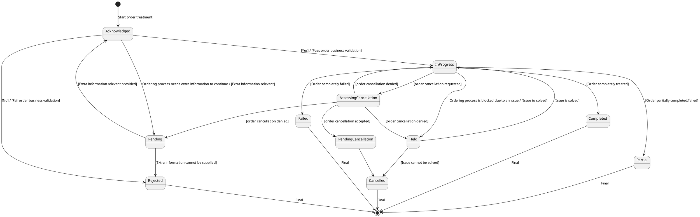

A Product Order is a type of order which can be used to place an order between a customer and a service provider or between a service provider and a partner.

| State       | Definition                                                                                                                                                           |
| :---------- | :------------------------------------------------------------------------------------------------------------------------------------------------------------------- |
| Acknowledged | The Acknowledged state is where an order/item has been received and has passed message and basic business validations.                                             |
| Rejected     | The Rejected state is where: An order failed the Order Feasibility check / Invalid information is provided through the order request / The order request fails to meet business rules for ordering Same rules applied for order item. |

*ProductOrdering*
© TM Forum 2024. All Rights Reserved. Page 4

---

[Image: TM Forum Logo]

| State                 | Definition                                                                                                                                                                                                                                                         |
| :-------------------- | :----------------------------------------------------------------------------------------------------------------------------------------------------------------------------------------------------------------------------------------------------------------- |
| Pending               | The Pending state is used when an order/item is currently in a waiting stage for an action/activity to be completed before the order/item can progress further, pending order amend or cancel assessment. In situations where Access Seeker action is required, an “information required” notification will be issued on transition into this state. A pending stage can lead into auto cancellation of an order/item, if no action is taken within the defined timeframes to be described under the Agreement. |
| InProgress            | The In Progress state is where an order Item has passed the Order Feasibility check successfully and product delivery has started. For the order at least one order item is inProgress                                                                         |
| Held                  | The Held state is used when an order/item cannot be progressed due to an issue. SP has temporarily delayed completing an order/item to resolve an infrastructure shortfall to facilitate supply of order. Upon resolution of the issue, the order/item will continue to progress. |
| AssessingCancellation | Following a cancel request, the SP is assessing if cancel can be done for the order/item (or if the PO has reached PONR). If cancellation request is not accepted after assessment the order will return in Held or Pending or InProgress state.                |
| PendingCancellation   | Once a cancel order has been accepted by SP, it could in some UC take time to effectively cancel the order/item. During this time when accepted cancellation is effectively processed we use Pending Cancellation.                                             |
| Cancelled             | The Cancelled state is where an In-Flight Order/item has been successfully cancelled.                                                                                                                                                                                 |
| Completed             | The Completed state is where an item has complete provision and the service is now active. For an order all order item are completed                                                                                                                                |
| Failed                | Order item as not a successful delivery completion. The product is not delivered and the order item failed. All Order items have failed which results in the entire Order has Failed.                                                                              |
| Partial               | Some Order items have failed and some have succeeded so the entire Order is in a Partial state. This provides support for partial Failure of an Order. This state is not available at item level                                                                       |

State engine comments:

*   The choice to accept order is done for the complete order and we cannot have a partial acceptance with some item in rejected and some other in acknowledged.

*ProductOrdering*
© TM Forum 2024. All Rights Reserved. Page 5

---

[Image: TM Forum Logo]

*   Consistence rules must be defined between order state & order item state (example: an order has a failed state if it has all order item state with Completed or Failed status with at least one Completed and one Failed)

### Cancel Product Order state lifecycle

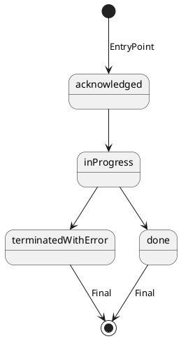

| State               | Definition                                                                                                      |
| :------------------ | :-------------------------------------------------------------------------------------------------------------- |
| Acknowledged        | The acknowledged state is where a cancellation request has been received and has passed message and basic business validations. |
| InProgress          | The In Progress state is when the cancel request is currently in the hands of the SP sales team to assess customer cancel request. |
| TerminatedWithErrors | The Cancellation Request could not be correctly completed by SP sales team. Cancel result is not available.          |
| Done                | Cancellation request has been assessed and result available.                                                   |

*ProductOrdering*
© TM Forum 2024. All Rights Reserved. Page 6

---

[Image: TM Forum Logo]

## Sample Use Cases

Reader will find examples of use cases using this API in “IG1228 How to use ODA” document.

To illustrate JSON representation of resources concerned by these APIs, we use the two use cases detailed below.

### Use case 1 (UC1): Acquisition

This use case illustrates the acquisition of a new mobile line featuring a mobile access, a tariff plan and a coverage options.

[Figure: UC1: Acquisition - Diagram illustrating the relationship between Catalog (ProductOffering, ProductSpecification), ProductOrder (relatedParty, orderItem, product, productOffering, billingAccount, payment), showing IDs and key attributes mapping from catalog offerings to ordered items for a new mobile line.]

### Use case 2 (UC2): Modification

This use case illustrates a modification of the coverage option.

*ProductOrdering*
© TM Forum 2024. All Rights Reserved. Page 7

---

[Image: TM Forum Logo]

[Figure: UC2: Change product ordering - Diagram showing the modification of an existing ProductOrder. It links Inventory (ProductOffering, ProductSpecification, product) to a ProductOrder, highlighting the change in a coverage-related orderItem from 'National' to 'International'.]

*ProductOrdering*
© TM Forum 2024. All Rights Reserved. Page 8

---

[Image: TM Forum Logo]

## Support of polymorphism and extension patterns

Support of polymorphic collections and types and schema based extension is provided by means of a list of generic meta-attributes that we describe below. Polymorphism in collections occurs when entities inherit from base entities, for instance a BillingAccount and SettlementAccount inheriting properties from the abstract Account entity.

Generic support of polymorphism and pattern extensions is described in the TMF API Guidelines v3.0 Part 2 document.

The `@type` attribute provides a way to represent the actual class type of an entity. For example, within a list of Account instances some may be instances of BillingAccount where other could be instances of SettlementAccount. The `@type` gives this information. All resources and sub-resources of this API have a `@type` attributes that can be provided when this is useful.

The `@referredType` can be used within reference entities (like for instance an AccountRef object) to explicitly denote the actual entity type of the referred class. Notice that in reference entities the `@type`, when used, denotes the class type of the reference itself, such as BillingAccountRef or SettlementAccountRef, and not the class type of the referred object. However since reference classes are rarely sub-classed, `@type` is generally not useful in reference objects.

The `@schemaLocation` property can be used in resources to allow specifying user-defined properties of an Entity or to specify the expected characteristics of an entity.

The `@baseType` attribute gives a way to provide explicitly the base of class of a given resource that has been extended.

*ProductOrdering*
© TM Forum 2024. All Rights Reserved. Page 9

---

[Image: TM Forum Logo]

## RESOURCE MODEL

### Managed Entity and Task Resource Models

#### ProductOrder resource

A Product Order is a type of order which can be used to place an order between a customer and a service provider or between a service provider and a partner and vice versa,.

**Resource model**

```plantuml
@startuml
class ProductOrder {
  externalId : ExternalIdentifier [*]
  href : String
  id : String
  note : Note [*]
  notificationContact : String
  priority : String
  state : ProductOrderStateType
  category : String
  completionDate : DateTime
  description : String
  expectedCompletionDate : DateTime
  orderDate : DateTime
  requestedCompletionDate : DateTime
  requestedStartDate : DateTime
  cancellationDate : DateTime
  cancellationReason : String
  creationDate : DateTime
  requestedInitialState : InitialProductOrderStateType
  @baseType : String
  @schemaLocation : String
  @type : String
}

class ProductOrderItem {
 action : ItemActionType
 id : String
 note : Note [*]
 quantity : Integer
 state : ProductOrderItemStateType
 @baseType : String
 @schemaLocation : String
 @type : String
}

class OrderTerm {
 description : String
 duration : Duration
 name : String
 @baseType : String
 @schemaLocation : String
 @type : String
}

class QuoteRef {
 href : String
 id : String
 name : String
 @baseType : String
 @referredType : String
 @schemaLocation : String
 @type : String
}

class PaymentRef {
 href : String
 id : String
 name : String
 @baseType : String
 @referredType : String
 @schemaLocation : String
 @type : String
}

class BillingAccountRef {
 href : String
 id : String
 name : String
 ratingType : String
 @baseType : String
 @referredType : String
 @schemaLocation : String
 @type : String
}

class ProductOfferingQualificationRef {
 href : String
 id : String
 name : String
 @baseType : String
 @referredType : String
 @schemaLocation : String
 @type : String
}

class RelatedPartyRefOrPartyRoleRef {
 role : String
 @baseType : String
 @referredType : String
 @schemaLocation : String
 @type : String
}

class ProductOrderErrorMessage {
 code : String
 message : String
 reason : String
 referenceError : String
 status : String
 timestamp : DateTime
 @baseType : String
 @schemaLocation : String
 @type : String
}

class ProductOrderJeopardyAlert {
 alertDate : DateTime
 exception : String
 id : String
 jeopardyType : String
 message : String
 name : String
 @baseType : String
 @schemaLocation : String
 @type : String
}

class ProductOrderMilestone {
 description : String
 id : String
 message : String
 milestoneDate : DateTime
 name : String
 status : String
 @baseType : String
 @schemaLocation : String
 @type : String
}

class RelatedChannel {
 role : String
 @baseType : String
 @schemaLocation : String
 @type : String
}

class OrderRelationship {
 href : String
 id : String
 name : String
 relationshipType : String
 @baseType : String
 @referredType : String
 @schemaLocation : String
 @type : String
}

class AgreementRef {
  href : String
  id : String
  name : String
  @baseType : String
  @referredType : String
  @schemaLocation : String
  @type : String
}

class OrderPrice {
  description : String
  name : String
  priceType : String
  recurringChargePeriod : String
  unitOfMeasure : String
  @baseType : String
  @schemaLocation : String
  @type : String
}

ProductOrder "1" *-- "0..*" ProductOrderItem : productOrderItem
ProductOrder "1" *-- "0..*" OrderTerm : itemTerm
ProductOrder "1" *-- "0..*" QuoteRef : quote
ProductOrder "1" *-- "0..*" PaymentRef : payment
ProductOrder "1" *-- "0..1" BillingAccountRef : billingAccount
ProductOrder "1" *-- "0..*" ProductOfferingQualificationRef : productOfferingQualification
ProductOrder "1" *-- "0..*" RelatedPartyRefOrPartyRoleRef : relatedParty
ProductOrder "1" *-- "0..*" ProductOrderErrorMessage : productOrderErrorMessage
ProductOrder "1" *-- "0..*" ProductOrderJeopardyAlert : productOrderJeopardyAlert
ProductOrder "1" *-- "0..*" ProductOrderMilestone : productOrderMilestone
ProductOrder "1" *-- "0..*" RelatedChannel : channel
ProductOrder "1" *-- "0..*" OrderRelationship : orderRelationship
ProductOrder "1" *-- "0..*" AgreementRef : agreement
ProductOrder "1" *-- "0..*" OrderPrice : orderTotalPrice

' Note: The relationship multiplicities might need adjustment based on the exact spec text, but this captures the main entities and links shown in the diagram.'
' The exact attributes within each class are simplified for brevity.'
@enduml
```

**Figure 1 - ProductOrder**

*ProductOrdering*
© TM Forum 2024. All Rights Reserved. Page 10

---

[Image: TM Forum Logo]

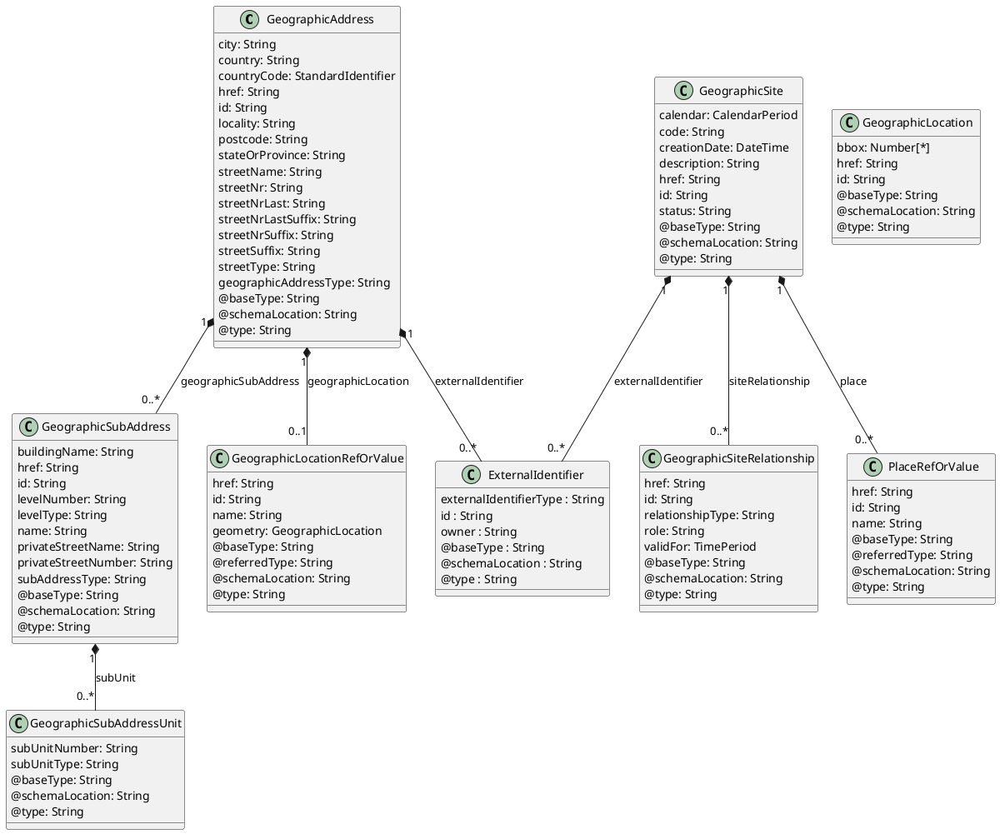

**Figure 2 - GeographicAddress**

*ProductOrdering*
© TM Forum 2024. All Rights Reserved. Page 11

---

[Image: TM Forum Logo]

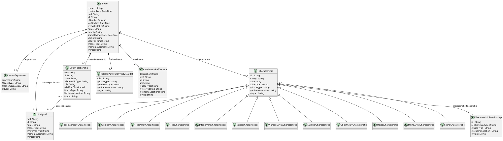

**Figure 3 - Intent**

*ProductOrdering*
© TM Forum 2024. All Rights Reserved. Page 12

---

[Image: TM Forum Logo]

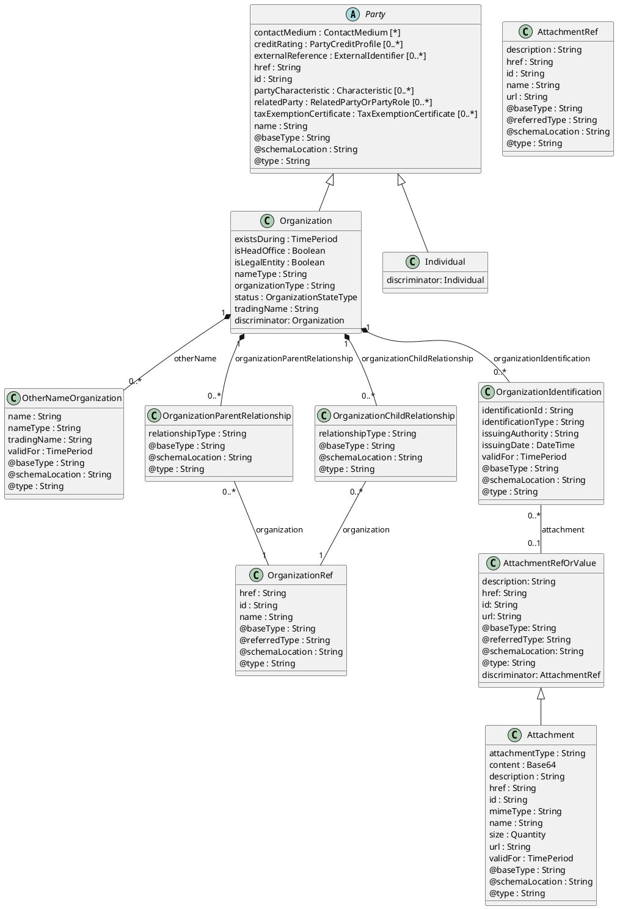

**Figure 4 - Organization**

*ProductOrdering*
© TM Forum 2024. All Rights Reserved. Page 13

---

[Image: TM Forum Logo]

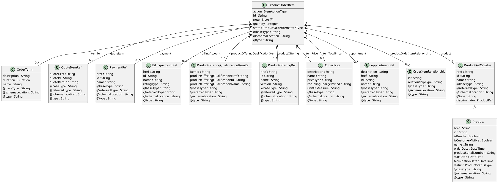

**Figure 5 - ProductOrderItem**

*ProductOrdering*
© TM Forum 2024. All Rights Reserved. Page 14

---

[Image: TM Forum Logo]

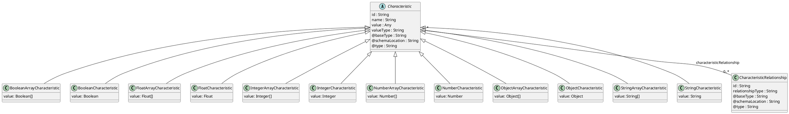

**Figure 6 - Characteristic**

*ProductOrdering*
© TM Forum 2024. All Rights Reserved. Page 15

---

[Image: TM Forum Logo]

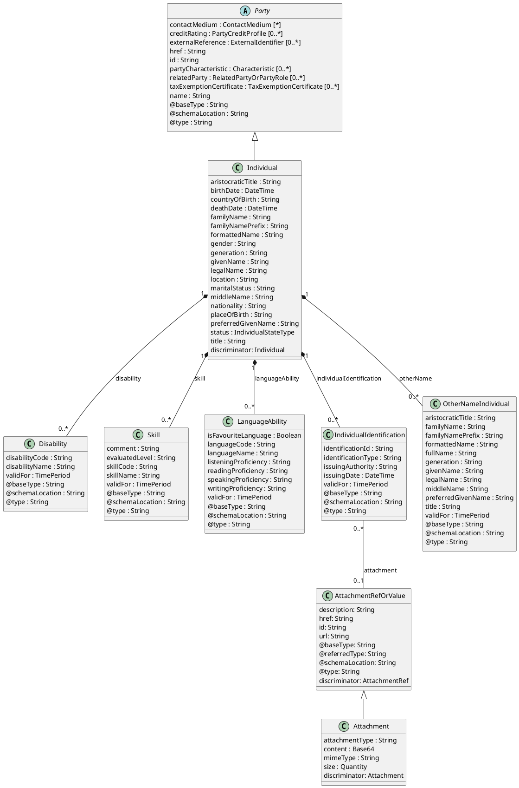

**Figure 7 - Individual**

*ProductOrdering*
© TM Forum 2024. All Rights Reserved. Page 16

---

[Image: TM Forum Logo]

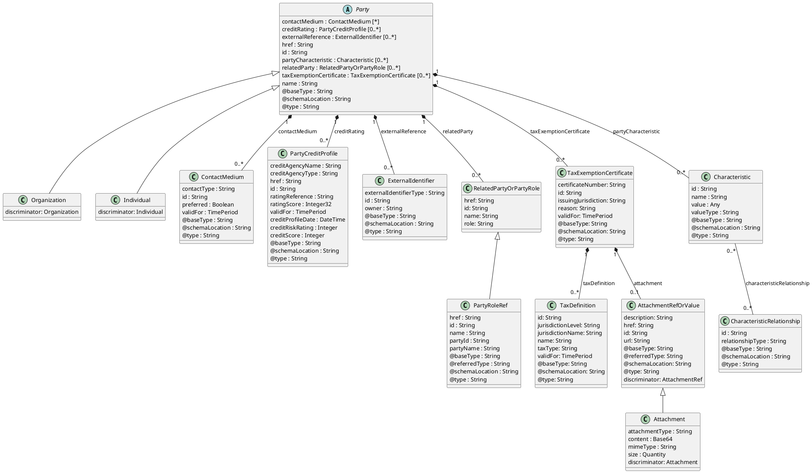

**Figure 8 - Party**

*ProductOrdering*
© TM Forum 2024. All Rights Reserved. Page 17

---

[Image: TM Forum Logo]

```plantuml
@startuml
class Product {
  href : String
  id : String
  isBundle : Boolean
  isCustomerVisible : Boolean
  name : String
  orderDate : DateTime
  productSerialNumber : String
  startDate : DateTime
  terminationDate : DateTime
  status : ProductStatusType
  @baseType : String
  @schemaLocation : String
  @type : String
}

class ProductRelationship {
 relationshipType : String
 @baseType : String
 @schemaLocation : String
 @type : String
}

class RelatedPlaceRefOrValue {
  href : String
  id : String
  name : String
  role : String
  @baseType : String
  @referredType : String
  @schemaLocation : String
  @type : String
}

class ProductRefOrValue {
 href : String
 id : String
 name : String
 @baseType : String
 @referredType : String
 @schemaLocation : String
 @type : String
 discriminator: ProductRef
}
ProductRefOrValue <|-- Product

class RelatedOrderItem {
  orderHref : String
  orderId : String
  orderItemAction : ItemActionType
  orderItemId : String
  role : String
  @baseType : String
  @referredType : String
  @schemaLocation : String
  @type : String
}

class ProductPrice {
 description : String
 name : String
 @baseType : String
 @schemaLocation : String
 @type : String
}

class ProductOfferingRef {
  href : String
  id : String
  name : String
  version : String
  @baseType : String
  @referredType : String
  @schemaLocation : String
  @type : String
}

class ProductSpecificationRef {
  href : String
  id : String
  name : String
  version : String
  targetProductSchema: TargetProductSchema
  @baseType : String
  @referredType : String
  @schemaLocation : String
  @type : String
}

class ProductTerm {
  description : String
  duration : Duration
  name : String
  validFor : TimePeriod
  @baseType : String
  @schemaLocation : String
  @type : String
}

class ResourceRef {
  href : String
  id : String
  name : String
  @baseType : String
  @referredType : String
  @schemaLocation : String
  @type : String
}

class ServiceRef {
  href : String
  id : String
  name : String
  @baseType : String
  @referredType : String
  @schemaLocation : String
  @type : String
}

class RelatedPartyOrPartyRole {
  href: String
  id: String
  name: String
  role: String
  '@baseType': String
  '@referredType': String
  '@schemaLocation': String
  '@type': String
}

class IntentRefOrValue {
  href : String
  id : String
  name : String
  @baseType : String
  @referredType : String
  @schemaLocation : String
  @type : String
}


Product "1" *-- "0..*" ProductRelationship : productRelationship
Product "1" *-- "0..*" RelatedPlaceRefOrValue : place
Product "1" *-- "0..*" ProductRefOrValue : product
Product "1" *-- "0..*" RelatedOrderItem : productOrderItem
Product "1" *-- "0..*" ProductPrice : productPrice
Product "1" *-- "0..1" ProductOfferingRef : productOffering
Product "1" *-- "0..1" ProductSpecificationRef : productSpecification
Product "1" *-- "0..*" ProductTerm : productTerm
Product "1" *-- "0..*" ResourceRef : realizingResource
Product "1" *-- "0..*" ServiceRef : realizingService
Product "1" *-- "0..*" RelatedPartyOrPartyRole : relatedParty
Product "1" *-- "0..*" IntentRefOrValue : intent
Product "1" *-- "0..*" Characteristic : productCharacteristic
@enduml
```

**Figure 9 - Product**

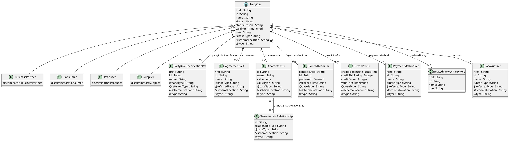

**Figure 10 - PartyRole**

*ProductOrdering*
© TM Forum 2024. All Rights Reserved. Page 18

---

[Image: TM Forum Logo]

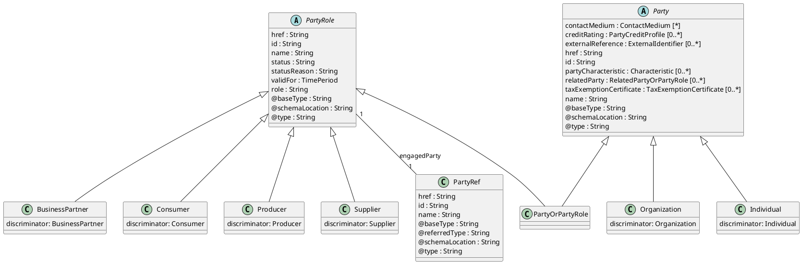

**Figure 11 - PartyOrPartyRole**

### Field descriptions

#### ProductOrder fields

| Field                     | Description                                                                                                                                                                                                                                                                                                                                                                                                                                                                                      |
| :------------------------ | :----------------------------------------------------------------------------------------------------------------------------------------------------------------------------------------------------------------------------------------------------------------------------------------------------------------------------------------------------------------------------------------------------------------------------------------------------------------------------------------------- |
| agreement                 | An AgreementRef. A reference to an agreement defined in the context of the product order.                                                                                                                                                                                                                                                                                                                                                                                                            |
| billingAccount            | A BillingAccountRef. BillingAccount reference. A BillingAccount is a detailed description of a bill structure.                                                                                                                                                                                                                                                                                                                                                                                     |
| cancellationDate          | A DateTime. Date when the order is cancelled. This is used when order is cancelled.                                                                                                                                                                                                                                                                                                                                                                                                              |
| cancellationReason        | A String. Reason why the order is cancelled. This is used when order is cancelled.                                                                                                                                                                                                                                                                                                                                                                                                               |
| category                  | A String. Used to categorize the order from a business perspective that can be useful for the OM system (e.g. "enterprise", "residential", …).                                                                                                                                                                                                                                                                                                                                                     |
| channel                   | A RelatedChannel. Related channel to another entity. May be online web, mobile app, social ,etc.                                                                                                                                                                                                                                                                                                                                                                                                  |
| completionDate            | A DateTime. Date when the ProductOrder was completed.                                                                                                                                                                                                                                                                                                                                                                                                                                           |
| creationDate              | A DateTime. Date and time when the ProductOrder was created.                                                                                                                                                                                                                                                                                                                                                                                                                                     |
| description               | A String. Description of the product order.                                                                                                                                                                                                                                                                                                                                                                                                                                                       |
| expectedCompletionDate    | A DateTime. Expected delivery date amended by the provider.                                                                                                                                                                                                                                                                                                                                                                                                                                       |
| externalId                | An ExternalIdentifier. An identification of an entity that is owned by or originates in a software system different from the current system, for example a ProductOrder handed off from a commerce platform into an order handling system. The structure identifies the system itself, the nature of the entity within the system (e.g. class name) and the unique ID of the entity within the system. It is anticipated that multiple external IDs can be held for a single entity, e.g. if the entity passed through multiple systems on the way to the current system. In this case the consumer is expected to sequence the IDs in the array in reverse order of provenance, i.e. most recent system first in the list. |
| href                      | A String. Hyperlink reference.                                                                                                                                                                                                                                                                                                                                                                                                                                                                    |
| id                        | A String. Unique identifier.                                                                                                                                                                                                                                                                                                                                                                                                                                                                      |
| note                      | A Note. Extra information about a given entity.                                                                                                                                                                                                                                                                                                                                                                                                                                                   |
| notificationContact       | A String. Contact attached to the order to send back information regarding this order.                                                                                                                                                                                                                                                                                                                                                                                                            |
| orderRelationship         | An OrderRelationship. Used to describe relationship between order.                                                                                                                                                                                                                                                                                                                                                                                                                               |
| orderTotalPrice           | An OrderPrice. An amount, usually of money, that represents the actual price paid by the Customer for this item or this order.                                                                                                                                                                                                                                                                                                                                                                   |
| payment                   | A PaymentRef. If an immediate payment has been done at the product order submission, the payment information are captured and stored (as a reference) in the order.                                                                                                                                                                                                                                                                                                                              |
| priority                  | A String. A way that can be used by consumers to prioritize orders in OM system (from 0 to 4 : 0 is the highest priority, and 4 the lowest).                                                                                                                                                                                                                                                                                                                                                     |
| productOfferingQualification | A ProductOfferingQualificationRef. A productOfferingQualification that has been executed previously.                                                                                                                                                                                                                                                                                                                                                                                             |
| productOrderErrorMessage  | A ProductOrderErrorMessage. A ProductOrderErrorMessage represents an error that causes a status change in a product order.                                                                                                                                                                                                                                                                                                                                                                        |
| productOrderItem          | A ProductOrderItem. An identified part of the order. A product order is decomposed into one or more order items.                                                                                                                                                                                                                                                                                                                                                                                 |
| productOrderJeopardyAlert | A ProductOrderJeopardyAlert. A ProductOrderJeopardyAlert represents a predicted exception during a product order processing that would brings risk to complete successfully the order.                                                                                                                                                                                                                                                                                                          |
| productOrderMilestone     | A ProductOrderMilestone. A ProductOrderMilestone represents an action or event marking a significant change or stage in processing of a product order.                                                                                                                                                                                                                                                                                                                                           |
| quote                     | A QuoteRef. Quote reference. It's a Quote that has been executed previously.                                                                                                                                                                                                                                                                                                                                                                                                                      |
| relatedParty              | A RelatedPartyRefOrPartyRoleRef. RelatedParty reference. A related party defines party or party role or its reference, linked to a specific entity.                                                                                                                                                                                                                                                                                                                                            |
| requestedCompletionDate   | A DateTime. Requested delivery date from the requestor perspective.                                                                                                                                                                                                                                                                                                                                                                                                                              |
| requestedInitialState     | An InitialProductOrderStateType. Possible values for the requested initial state of the order from client- by default acknowledged is considered.                                                                                                                                                                                                                                                                                                                                              |
| requestedStartDate        | A DateTime. Order fulfillment start date wished by the requestor. This is used when, for any reason, requestor cannot allow seller to begin to operationally begin the fulfillment before a date.                                                                                                                                                                                                                                                                                             |
| state                     | A ProductOrderStateType. Possible values for the state of the order.                                                                                                                                                                                                                                                                                                                                                                                                                            |
| @baseType                 | A String. When sub-classing, this defines the super-class.                                                                                                                                                                                                                                                                                                                                                                                                                                        |
| @schemaLocation           | A String. A URI to a JSON-Schema file that defines additional attributes and relationships.                                                                                                                                                                                                                                                                                                                                                                                                     |
| @type                     | A String. When sub-classing, this defines the sub-class Extensible name.                                                                                                                                                                                                                                                                                                                                                                                                                        |

#### AccountRef sub-resource fields

| Field           | Description                                                                     |
| :-------------- | :------------------------------------------------------------------------------ |
| href            | A String. Hyperlink reference.                                                  |
| id              | A String. Unique identifier.                                                    |
| name            | A String. Name of the referred entity.                                          |
| @baseType       | A String. When sub-classing, this defines the super-class.                      |
| @referredType   | A String. The actual type of the target instance when needed for disambiguation. |
| @schemaLocation | A String. A URI to a JSON-Schema file that defines additional attributes and relationships. |
| @type           | A String. When sub-classing, this defines the sub-class Extensible name.        |

#### AgreementItemRef sub-resource fields

| Field            | Description                                                                     |
| :--------------- | :------------------------------------------------------------------------------ |
| agreementHref    | A String. Reference of the related entity.                                      |
| agreementId      | A String. Unique identifier of a related entity.                                |
| agreementItemId  | A String. Id of an item of a Agreement.                                         |
| agreementName    | A String. Name of the related entity.                                           |
| @baseType        | A String. When sub-classing, this defines the super-class.                      |
| @referredType    | A String. The actual type of the target instance when needed for disambiguation. |
| @schemaLocation  | A String. A URI to a JSON-Schema file that defines additional attributes and relationships. |
| @type            | A String. When sub-classing, this defines the sub-class Extensible name.        |

*ProductOrdering*
© TM Forum 2024. All Rights Reserved. Page 21

---

[Image: TM Forum Logo]

#### AgreementRef sub-resource fields

| Field           | Description                                                                     |
| :-------------- | :------------------------------------------------------------------------------ |
| href            | A String. Hyperlink reference.                                                  |
| id              | A String. Unique identifier.                                                    |
| name            | A String. Name of the referred entity.                                          |
| @baseType       | A String. When sub-classing, this defines the super-class.                      |
| @referredType   | A String. The actual type of the target instance when needed for disambiguation. |
| @schemaLocation | A String. A URI to a JSON-Schema file that defines additional attributes and relationships. |
| @type           | A String. When sub-classing, this defines the sub-class Extensible name.        |

#### AppointmentRef sub-resource fields

| Field           | Description                                                                     |
| :-------------- | :------------------------------------------------------------------------------ |
| description     | A String. An explanatory text regarding the appointment made with a party.    |
| href            | A String. Hyperlink reference.                                                  |
| id              | A String. Unique identifier.                                                    |
| name            | A String. Name of the referred entity.                                          |
| @baseType       | A String. When sub-classing, this defines the super-class.                      |
| @referredType   | A String. The actual type of the target instance when needed for disambiguation. |
| @schemaLocation | A String. A URI to a JSON-Schema file that defines additional attributes and relationships. |
| @type           | A String. When sub-classing, this defines the sub-class Extensible name.        |

#### Attachment sub-resource fields

| Field          | Description                                                                     |
| :------------- | :------------------------------------------------------------------------------ |
| attachmentType | A String. A business characterization of the purpose of the attachment, for example logo, instructionManual, contractCopy. |
| content        | A Base64. The actual contents of the attachment object, if embedded, encoded as base64. |
| description    | A String. A narrative text describing the content of the attachment.           |
| href           | A String. Hyperlink reference.                                                  |
| id             | A String. Unique identifier.                                                    |
| mimeType       | A String. A technical characterization of the attachment content format using IETF Mime Types. |
| name           | A String. The name of the attachment.                                           |
| size           | A Quantity. An amount in a given unit.                                          |
| url            | A String. Uniform Resource Locator, is a web page address (a subset of URI).   |
| validFor       | A TimePeriod. A period of time, either as a deadline (endDateTime only) a startDateTime only, or both. |
| @baseType      | A String. When sub-classing, this defines the super-class.                      |
| @schemaLocation| A String. A URI to a JSON-Schema file that defines additional attributes and relationships. |
| @type          | A String. When sub-classing, this defines the sub-class Extensible name.        |

#### AttachmentRef sub-resource fields

| Field           | Description                                                                     |
| :-------------- | :------------------------------------------------------------------------------ |
| description     | A String. A narrative text describing the content of the attachment.           |
| href            | A String. Hyperlink reference.                                                  |
| id              | A String. Unique identifier.                                                    |
| name            | A String. Name of the referred entity.                                          |
| url             | A String. Link to the attachment media/content.                                |
| @baseType       | A String. When sub-classing, this defines the super-class.                      |
| @referredType   | A String. The actual type of the target instance when needed for disambiguation. |
| @schemaLocation | A String. A URI to a JSON-Schema file that defines additional attributes and relationships. |
| @type           | A String. When sub-classing, this defines the sub-class Extensible name.        |

#### BillingAccountRef sub-resource fields

| Field           | Description                                                                     |
| :-------------- | :------------------------------------------------------------------------------ |
| href            | A String. Hyperlink reference.                                                  |
| id              | A String. Unique identifier.                                                    |
| name            | A String. Name of the referred entity.                                          |
| ratingType      | A String. Indicates whether the account follows a specific payment option such as prepaid or postpaid. |
| @baseType       | A String. When sub-classing, this defines the super-class.                      |
| @referredType   | A String. The actual type of the target instance when needed for disambiguation. |
| @schemaLocation | A String. A URI to a JSON-Schema file that defines additional attributes and relationships. |
| @type           | A String. When sub-classing, this defines the sub-class Extensible name.        |

#### BooleanArrayCharacteristic sub-resource fields

| Field                       | Description                                                                     |
| :-------------------------- | :------------------------------------------------------------------------------ |
| characteristicRelationship | A CharacteristicRelationship. Another Characteristic that is related to the current Characteristic;. |
| id                          | A String. Unique identifier of the characteristic.                             |
| name                        | A String. Name of the characteristic.                                           |
| value                       | A Boolean.                                                                      |
| valueType                   | A String. Data type of the value of the characteristic.                         |
| @baseType                   | A String. When sub-classing, this defines the super-class.                      |
| @schemaLocation             | A String. A URI to a JSON-Schema file that defines additional attributes and relationships. |
| @type                       | A String. When sub-classing, this defines the sub-class Extensible name.        |

#### BooleanCharacteristic sub-resource fields

| Field                       | Description                                                                     |
| :-------------------------- | :------------------------------------------------------------------------------ |
| characteristicRelationship | A CharacteristicRelationship. Another Characteristic that is related to the current Characteristic;. |
| id                          | A String. Unique identifier of the characteristic.                             |
| name                        | A String. Name of the characteristic.                                           |
| value                       | A Boolean. Value of the characteristic.                                         |
| valueType                   | A String. Data type of the value of the characteristic.                         |
| @baseType                   | A String. When sub-classing, this defines the super-class.                      |
| @schemaLocation             | A String. A URI to a JSON-Schema file that defines additional attributes and relationships. |
| @type                       | A String. When sub-classing, this defines the sub-class Extensible name.        |

#### CalendarPeriod sub-resource fields

| Field           | Description                                                                     |
| :-------------- | :------------------------------------------------------------------------------ |
| day             | A String. Day where the calendar status applies (e.g.: monday, mon-to-fri, weekdays, weekend, all week, …). |
| hourPeriod      | A HourPeriod.                                                                   |
| status          | A String. Indication of the availability of the caledar period (e.g.: available, booked, etc.). |
| timeZone        | A String. Indication of the timezone applicable to the calendar information (e.g.: Paris, GMT+1). |
| @baseType       | A String. When sub-classing, this defines the super-class.                      |
| @schemaLocation | A String. A URI to a JSON-Schema file that defines additional attributes and relationships. |
| @type           | A String. When sub-classing, this defines the sub-class Extensible name.        |

#### ChannelRef sub-resource fields

| Field           | Description                                                                     |
| :-------------- | :------------------------------------------------------------------------------ |
| href            | A String. Hyperlink reference.                                                  |
| id              | A String. Unique identifier.                                                    |
| name            | A String. Name of the referred entity.                                          |
| @baseType       | A String. When sub-classing, this defines the super-class.                      |
| @referredType   | A String. The actual type of the target instance when needed for disambiguation. |
| @schemaLocation | A String. A URI to a JSON-Schema file that defines additional attributes and relationships. |
| @type           | A String. When sub-classing, this defines the sub-class Extensible name.        |

#### Characteristic sub-resource fields

| Field                       | Description                                                                     |
| :-------------------------- | :------------------------------------------------------------------------------ |
| characteristicRelationship | A CharacteristicRelationship. Another Characteristic that is related to the current Characteristic;. |
| id                          | A String. Unique identifier of the characteristic.                             |
| name                        | A String. Name of the characteristic.                                           |
| valueType                   | A String. Data type of the value of the characteristic.                         |
| @baseType                   | A String. When sub-classing, this defines the super-class.                      |
| @schemaLocation             | A String. A URI to a JSON-Schema file that defines additional attributes and relationships. |
| @type                       | A String. When sub-classing, this defines the sub-class Extensible name.        |

#### CharacteristicRelationship sub-resource fields

| Field            | Description                                                                     |
| :--------------- | :------------------------------------------------------------------------------ |
| id               | A String. Unique identifier of the characteristic.                             |
| relationshipType | A String. The type of relationship.                                             |
| @baseType        | A String. When sub-classing, this defines the super-class.                      |
| @schemaLocation  | A String. A URI to a JSON-Schema file that defines additional attributes and relationships. |
| @type            | A String. When sub-classing, this defines the sub-class Extensible name.        |

#### ContactMedium sub-resource fields

| Field       | Description                                                                     |
| :---------- | :------------------------------------------------------------------------------ |
| contactType | A String. Type of the contact medium to qualifiy it like pro email / personal email. This is not used to define the contact medium used. |
| id          | A String. Identifier for this contact medium.                                   |
| preferred   | A Boolean. If true, indicates that is the preferred contact medium.            |
| validFor    | A TimePeriod. A period of time, either as a deadline (endDateTime only) a startDateTime only, or both. |
| @baseType   | A String. When sub-classing, this defines the super-class.                      |
| @schemaLocation | A String. A URI to a JSON-Schema file that defines additional attributes and relationships. |
| @type       | A String. When sub-classing, this defines the sub-class Extensible name.        |

#### CreditProfile sub-resource fields

| Field            | Description                                                                     |
| :--------------- | :------------------------------------------------------------------------------ |
| creditProfileDate| A DateTime. The date the profile was established.                             |
| creditRiskRating | An Integer. This is an integer whose value is used to rate the risk.          |
| creditScore      | An Integer. A measure of a person or organizations creditworthiness calculated on the basis of a combination of factors such as their income and credit history. |
| href             | A String. Hyperlink reference.                                                  |
| id               | A String. Unique identifier.                                                    |
| validFor         | A TimePeriod. A period of time, either as a deadline (endDateTime only) a startDateTime only, or both. |
| @baseType        | A String. When sub-classing, this defines the super-class.                      |
| @schemaLocation  | A String. A URI to a JSON-Schema file that defines additional attributes and relationships. |
| @type            | A String. When sub-classing, this defines the sub-class Extensible name.        |

#### Disability sub-resource fields

| Field          | Description                                                                     |
| :------------- | :------------------------------------------------------------------------------ |
| disabilityCode | A String. Code of the disability.                                              |
| disabilityName | A String. Name of the disability.                                               |
| validFor       | A TimePeriod. A period of time, either as a deadline (endDateTime only) a startDateTime only, or both. |

#### Duration sub-resource fields

| Field  | Description                                                                     |
| :----- | :------------------------------------------------------------------------------ |
| amount | An Integer. Time interval (number of seconds, minutes, hours, etc.).          |
| units  | A String. Unit of time (seconds, minutes, hours, etc.).                         |

#### EntityRef sub-resource fields

| Field           | Description                                                                     |
| :-------------- | :------------------------------------------------------------------------------ |
| href            | A String. Hyperlink reference.                                                  |
| id              | A String. Unique identifier.                                                    |
| name            | A String. Name of the referred entity.                                          |
| @baseType       | A String. When sub-classing, this defines the super-class.                      |
| @referredType   | A String. The actual type of the target instance when needed for disambiguation. |
| @schemaLocation | A String. A URI to a JSON-Schema file that defines additional attributes and relationships. |
| @type           | A String. When sub-classing, this defines the sub-class Extensible name.        |

#### EntityRelationship sub-resource fields

| Field            | Description                                                                     |
| :--------------- | :------------------------------------------------------------------------------ |
| associationSpec  | An EntityRef. Entity reference schema to be use for all entityRef class.       |
| href             | A String.                                                                       |
| id               | A String.                                                                       |
| name             | A String.                                                                       |
| relationshipType | A String. Type of relationship such as migration, substitution, dependency, exclusivity. |
| role             | A String. The association role for this entity.                                |
| validFor         | A TimePeriod. A period of time, either as a deadline (endDateTime only) a startDateTime only, or both. |
| @baseType        | A String. When sub-classing, this defines the super-class.                      |
| @referredType    | A String.                                                                       |
| @schemaLocation  | A String. A URI to a JSON-Schema file that defines additional attributes and relationships. |
| @type            | A String.                                                                       |

#### ErrorMessage sub-resource fields

| Field           | Description                                                                     |
| :-------------- | :------------------------------------------------------------------------------ |
| code            | A String. Error code.                                                          |
| message         | A String. More details and corrective actions related to the error.           |
| reason          | A String. Explanation of the reason for the error.                             |
| referenceError  | A String. URI of documentation describing the error.                           |
| status          | A String. Error code extension like sys-ABC-2001.                               |
| @baseType       | A String. When sub-classing, this defines the super-class.                      |
| @schemaLocation | A String. A URI to a JSON-Schema file that defines additional attributes and relationships. |
| @type           | A String. When sub-classing, this defines the sub-class Extensible name.        |

#### ExternalIdentifier sub-resource fields

| Field                  | Description                                                                     |
| :--------------------- | :------------------------------------------------------------------------------ |
| externalIdentifierType | A String. Type of the identification, typically would be the type of the entity within the external system. |
| id                     | A String. Identification of the entity within the external system.              |
| owner                  | A String. Name of the external system that owns the entity.                    |
| @baseType              | A String. When sub-classing, this defines the super-class.                      |
| @schemaLocation        | A String. A URI to a JSON-Schema file that defines additional attributes and relationships. |
| @type                  | A String. When sub-classing, this defines the sub-class Extensible name.        |

#### FloatArrayCharacteristic sub-resource fields

| Field                       | Description                                                                     |
| :-------------------------- | :------------------------------------------------------------------------------ |
| characteristicRelationship | A CharacteristicRelationship. Another Characteristic that is related to the current Characteristic;. |
| id                          | A String. Unique identifier of the characteristic.                             |
| name                        | A String. Name of the characteristic.                                           |
| value                       | A Float.                                                                        |
| valueType                   | A String. Data type of the value of the characteristic.                         |
| @baseType                   | A String. When sub-classing, this defines the super-class.                      |
| @schemaLocation             | A String. A URI to a JSON-Schema file that defines additional attributes and relationships. |
| @type                       | A String. When sub-classing, this defines the sub-class Extensible name.        |

#### FloatCharacteristic sub-resource fields

| Field                       | Description                                                                     |
| :-------------------------- | :------------------------------------------------------------------------------ |
| characteristicRelationship | A CharacteristicRelationship. Another Characteristic that is related to the current Characteristic;. |
| id                          | A String. Unique identifier of the characteristic.                             |
| name                        | A String. Name of the characteristic.                                           |
| value                       | A Float. Value of the characteristic.                                           |
| valueType                   | A String. Data type of the value of the characteristic.                         |
| @baseType                   | A String. When sub-classing, this defines the super-class.                      |
| @schemaLocation             | A String. A URI to a JSON-Schema file that defines additional attributes and relationships. |
| @type                       | A String. When sub-classing, this defines the sub-class Extensible name.        |

#### GeographicAddress sub-resource fields

| Field                  | Description                                                                     |
| :--------------------- | :------------------------------------------------------------------------------ |
| city                   | A String. City that the address is in.                                          |
| country                | A String. Country that the address is in.                                       |
| countryCode            | A StandardIdentifier. Country codes are short alphabetic or numeric geographical codes (geocodes) developed to represent countries and dependent areas, for use in data processing and communications. Several different systems have been developed to do this. The term country code frequently refers to ISO 3166-1 alpha-2 or international dialing codes, the E.164 country calling codes. |
| externalIdentifier     | An ExternalIdentifier. An identification of an entity that is owned by or originates in a software system different from the current system, for example a ProductOrder handed off from a commerce platform into an order handling system. The structure identifies the system itself, the nature of the entity within the system (e.g. class name) and the unique ID of the entity within the system. It is anticipated that multiple external IDs can be held for a single entity, e.g. if the entity passed through multiple systems on the way to the current system. In this case the consumer is expected to sequence the IDs in the array in reverse order of provenance, i.e. most recent system first in the list. |
| geographicAddressType  | A String. Classification of the address, e.g., residential, industrial.       |
| geographicLocation     | A GeographicLocationRefOrValue. The polymorphic attributes @type, @schemaLocation & @referredType are related to the GeographicLocation entity and not the GeographicLocationRefOrValue class itself. |
| geographicSubAddress   | A GeographicSubAddress. Representation of a GeographicSubAddress It is used for addressing within a property in an urban area (country properties are often defined differently). It may refer to a building, a building cluster, or a floor of a multistory building. |
| href                   | A String. Hyperlink reference.                                                  |
| id                     | A String. Unique identifier.                                                    |
| locality               | A String. An area of defined or undefined boundaries within a local authority or other legislatively defined area, usually rural or semi rural in nature. [ANZLIC-STREET], or a suburb, a bounded locality within a city, town or shire principally of urban character [ANZLICSTREET]. |
| postcode               | A String. Descriptor for a postal delivery area, used to speed and simplify the delivery of mail (also know as zipcode). |
| stateOrProvince        | A String. The State or Province that the address is in.                         |
| streetName             | A String. Name of the street or other street type.                              |
| streetNr               | A String. Number identifying a specific property on a public street. It may be combined with streetNrLast for ranged addresses. |
| streetNrLast           | A String. Last number in a range of street numbers allocated to a property.    |
| streetNrLastSuffix     | A String. Last street number suffix for a ranged address.                       |
| streetNrSuffix         | A String. The first street number suffix.                                       |
| streetSuffix           | A String. A modifier denoting a relative direction.                            |
| streetType             | A String. Alley, avenue, boulevard, brae, crescent, drive, highway, lane, terrace, parade, place, tarn, way, wharf. |
| @baseType              | A String. When sub-classing, this defines the super-class.                      |
| @schemaLocation        | A String. A URI to a JSON-Schema file that defines additional attributes and relationships. |
| @type                  | A String. When sub-classing, this defines the sub-class Extensible name.        |

#### GeographicLocation sub-resource fields

| Field           | Description                                                                     |
| :-------------- | :------------------------------------------------------------------------------ |
| bbox            | A Number. A bounding box array that contains the geometry. The axes order follows the axes order of the geometry. |
| href            | A String. Hyperlink reference.                                                  |
| id              | A String. Unique identifier.                                                    |
| @baseType       | A String. When sub-classing, this defines the super-class.                      |
| @schemaLocation | A String. A URI to a JSON-Schema file that defines additional attributes and relationships. |
| @type           | A String. When sub-classing, this defines the sub-class Extensible name.        |

#### GeographicLocationRef sub-resource fields

| Field           | Description                                                                     |
| :-------------- | :------------------------------------------------------------------------------ |
| href            | A String. Hyperlink reference.                                                  |
| id              | A String. Unique identifier.                                                    |
| name            | A String. Name of the referred entity.                                          |
| @baseType       | A String. When sub-classing, this defines the super-class.                      |
| @referredType   | A String. The actual type of the target instance when needed for disambiguation. |
| @schemaLocation | A String. A URI to a JSON-Schema file that defines additional attributes and relationships. |
| @type           | A String. When sub-classing, this defines the sub-class Extensible name.        |

#### GeographicSite sub-resource fields

| Field              | Description                                                                     |
| :----------------- | :------------------------------------------------------------------------------ |
| calendar           | A CalendarPeriod.                                                               |
| code               | A String. A code that may be used for some addressing schemes eg: [ANSI T1.253-1999]. |
| creationDate       | A DateTime. Date and time when the GeographicSite was created.                |
| description        | A String. Text describing additional information regarding the site.          |
| externalIdentifier | An ExternalIdentifier. An identification of an entity that is owned by or originates in a software system different from the current system, for example a ProductOrder handed off from a commerce platform into an order handling system. The structure identifies the system itself, the nature of the entity within the system (e.g. class name) and the unique ID of the entity within the system. It is anticipated that multiple external IDs can be held for a single entity, e.g. if the entity passed through multiple systems on the way to the current system. In this case the consumer is expected to sequence the IDs in the array in reverse order of provenance, i.e. most recent system first in the list. |
| href               | A String. Hyperlink reference.                                                  |
| id                 | A String. Unique identifier.                                                    |
| place              | A PlaceRefOrValue. The polymorphic attributes @type, @schemaLocation & @referredType are related to the Place entity and not the PlaceRefOrValue class itself. |
| relatedParty       | A RelatedPartyRefOrPartyRoleRef. RelatedParty reference. A related party defines party or party role or its reference, linked to a specific entity. |
| siteRelationship   | A GeographicSiteRelationship.                                                   |
| status             | A String. The condition of the GeographicSite, such as planned, underConstruction, cancelled, active, inactive, former. |
| @baseType          | A String. When sub-classing, this defines the super-class.                      |
| @schemaLocation    | A String. A URI to a JSON-Schema file that defines additional attributes and relationships. |
| @type              | A String. When sub-classing, this defines the sub-class Extensible name.        |

#### GeographicSiteRelationship sub-resource fields

| Field            | Description                                                                     |
| :--------------- | :------------------------------------------------------------------------------ |
| href             | A String. Reference of the related geographic site.                            |
| id               | A String. Unique identifier of the related site entity within the server.      |
| relationshipType | A String. Type of relationship.                                                 |
| role             | A String. Role of the related site in the relationship.                        |
| validFor         | A TimePeriod. A period of time, either as a deadline (endDateTime only) a startDateTime only, or both. |
| @baseType        | A String. When sub-classing, this defines the super-class.                      |
| @schemaLocation  | A String. A URI to a JSON-Schema file that defines additional attributes and relationships. |
| @type            | A String. When sub-classing, this defines the sub-class Extensible name.        |

#### GeographicSubAddress sub-resource fields

| Field               | Description                                                                     |
| :------------------ | :------------------------------------------------------------------------------ |
| buildingName        | A String. Allows for buildings that have well-known names.                       |
| href                | A String. Hyperlink reference.                                                  |
| id                  | A String. Unique identifier.                                                    |
| levelNumber         | A String. Used where a level type may be repeated e.g. BASEMENT 1, BASEMENT 2. |
| levelType           | A String. Describes level types within a building.                             |
| name                | A String. Name of the subAddress to identify it with a meaningful identification. |
| privateStreetName   | A String. Private streets internal to a property (e.g. a university) may have internal names that are not recorded by the land title office. |
| privateStreetNumber | A String. Private streets numbers internal to a private street.                 |
| subAddressType      | A String. Type of subAddress : it can be a subunit or a private street.       |
| subUnit             | A GeographicSubAddressUnit. Representation of a SubUnit. It is used for describing subunit within a subAddress e.g. BERTH, FLAT, PIER, SUITE, SHOP, TOWER, UNIT, WHARF. |
| @baseType           | A String. When sub-classing, this defines the super-class.                      |
| @schemaLocation     | A String. A URI to a JSON-Schema file that defines additional attributes and relationships. |
| @type               | A String. When sub-classing, this defines the sub-class Extensible name.        |

#### GeographicSubAddressUnit sub-resource fields

| Field         | Description                                                                     |
| :------------ | :------------------------------------------------------------------------------ |
| subUnitNumber | A String. The discriminator used for the subunit, often just a simple number but may also be a range. |
| subUnitType   | A String. The type of subunit e.g.BERTH, FLAT, PIER, SUITE, SHOP, TOWER, UNIT, WHARF, RACK. |
| @baseType     | A String. When sub-classing, this defines the super-class.                      |
| @schemaLocation| A String. A URI to a JSON-Schema file that defines additional attributes and relationships. |
| @type         | A String. When sub-classing, this defines the sub-class Extensible name.        |

#### HourPeriod sub-resource fields

| Field           | Description                                                                     |
| :-------------- | :------------------------------------------------------------------------------ |
| endHour         | A String. The time when the status ends applying.                              |
| startHour       | A String. The time when the status starts applying.                            |
| @baseType       | A String. When sub-classing, this defines the super-class.                      |
| @schemaLocation | A String. A URI to a JSON-Schema file that defines additional attributes and relationships. |
| @type           | A String. When sub-classing, this defines the sub-class Extensible name.        |

#### Individual sub-resource fields

| Field                   | Description                                                                     |
| :---------------------- | :------------------------------------------------------------------------------ |
| aristocraticTitle       | A String. E.g. Baron, Graf, Earl.                                              |
| birthDate               | A DateTime. Birth date.                                                        |
| contactMedium           | A ContactMedium. List of means for contacting the party, e.g. mobile phone, email address. |
| countryOfBirth          | A String. Country where the individual was born.                                |
| creditRating            | A PartyCreditProfile. List of credit profiles and scores for the party, typically received from an external credit broker. |
| deathDate               | A DateTime. Date of death.                                                     |
| disability              | A Disability. List of disabilities suffered by the individual.                  |
| externalReference       | An ExternalIdentifier. List of identifiers of the Party in an external system, for example when party information is imported from a commerce system. |
| familyName              | A String. Contains the non-chosen or inherited name. Also known as last name in the Western context. |
| familyNamePrefix        | A String. Family name prefix.                                                  |
| formattedName           | A String. A fully formatted name in one string with all of its pieces in their proper place and all of the necessary punctuation. Useful for specific contexts (Chinese, Japanese, Korean). |
| gender                  | A String. Gender.                                                               |
| generation              | A String. E.g.. Sr, Jr, III (the third).                                       |
| givenName               | A String. First name of the individual.                                         |
| href                    | A String. Hyperlink reference.                                                  |
| id                      | A String. Unique identifier.                                                    |
| individualIdentification| An IndividualIdentification. List of official identifications issued to the individual, such as passport, driving licence, social security number. |
| languageAbility         | A LanguageAbility. List of national languages known by the individual.          |
| legalName               | A String. Legal name or birth name (name one has for official purposes).        |
| location                | A String. Temporary current location of the individual (may be used if the individual has approved its sharing). |
| maritalStatus           | A String. Marital status (married, divorced, widow …).                         |
| middleName              | A String. Middles name or initial.                                             |
| name                    | A String. Full name flatten (first, middle, and last names) - this is the name that is expected to be presented in reference data types such as PartyRef, RelatedParty, etc. that refer to Individual. |
| nationality             | A String. Nationality.                                                          |
| otherName               | An OtherNameIndividual. List of other names by which this individual is known.  |
| partyCharacteristic     | A Characteristic. List of additional characteristics that a Party can take on. |
| placeOfBirth            | A String. Reference to the place where the individual was born.                |
| preferredGivenName      | A String. Contains the chosen name by which the individual prefers to be addressed. Note: This name may be a name other than a given name, such as a nickname. |
| relatedParty            | A RelatedPartyOrPartyRole. List of parties and/or party roles related to this party. |
| skill                   | A Skill. List of skills exhibited by the individual.                           |
| status                  | An IndividualStateType. Valid values for the lifecycle state of the individual. |
| taxExemptionCertificate | A TaxExemptionCertificate. List of tax exemptions granted to the party. For example, a war veteran might have partial exemption from state tax and a full exemption from federal tax. |
| title                   | A String. Useful for titles (aristocratic, social,…) Pr, Dr, Sir, …              |
| @baseType               | A String. When sub-classing, this defines the super-class.                      |
| @schemaLocation         | A String. A URI to a JSON-Schema file that defines additional attributes and relationships. |
| @type                   | A String. When sub-classing, this defines the sub-class Extensible name.        |

#### IndividualIdentification sub-resource fields

| Field            | Description                                                                     |
| :--------------- | :------------------------------------------------------------------------------ |
| attachment       | An AttachmentRefOrValue. The polymorphic attributes @type, @schemaLocation & @referredType are related to the Attachment entity and not the AttachmentRefOrValue class itself. |
| identificationId | A String. Identifier.                                                          |
| identificationType| A String. Identification type (passport, national identity card, drivers license, social security number, birth certificate). |
| issuingAuthority | A String. Authority which has issued the identifier, such as: social security, town hall. |
| issuingDate      | A DateTime. Date at which the identifier was issued.                           |
| validFor         | A TimePeriod. A period of time, either as a deadline (endDateTime only) a startDateTime only, or both. |
| @baseType        | A String. When sub-classing, this defines the super-class.                      |
| @schemaLocation  | A String. A URI to a JSON-Schema file that defines additional attributes and relationships. |
| @type            | A String. When sub-classing, this defines the sub-class Extensible name.        |

#### IntegerArrayCharacteristic sub-resource fields

| Field                       | Description                                                                     |
| :-------------------------- | :------------------------------------------------------------------------------ |
| characteristicRelationship | A CharacteristicRelationship. Another Characteristic that is related to the current Characteristic;. |
| id                          | A String. Unique identifier of the characteristic.                             |
| name                        | A String. Name of the characteristic.                                           |
| value                       | An Integer.                                                                     |
| valueType                   | A String. Data type of the value of the characteristic.                         |
| @baseType                   | A String. When sub-classing, this defines the super-class.                      |
| @schemaLocation             | A String. A URI to a JSON-Schema file that defines additional attributes and relationships. |
| @type                       | A String. When sub-classing, this defines the sub-class Extensible name.        |

#### IntegerCharacteristic sub-resource fields

| Field                       | Description                                                                     |
| :-------------------------- | :------------------------------------------------------------------------------ |
| characteristicRelationship | A CharacteristicRelationship. Another Characteristic that is related to the current Characteristic;. |
| id                          | A String. Unique identifier of the characteristic.                             |
| name                        | A String. Name of the characteristic.                                           |
| value                       | An Integer. Value of the characteristic.                                        |
| valueType                   | A String. Data type of the value of the characteristic.                         |
| @baseType                   | A String. When sub-classing, this defines the super-class.                      |
| @schemaLocation             | A String. A URI to a JSON-Schema file that defines additional attributes and relationships. |
| @type                       | A String. When sub-classing, this defines the sub-class Extensible name.        |

#### Intent sub-resource fields

| Field            | Description                                                                     |
| :--------------- | :------------------------------------------------------------------------------ |
| attachment       | An AttachmentRefOrValue. Attachments that may be of relevance to this intent, such as picture, document, media. |
| characteristic   | A Characteristic. Describes a given characteristic of an object or entity through a name/value pair. |
| context          | A String. A string used to give a context to the intent.                       |
| creationDate     | A DateTime. Date and time of the creation of this REST resource.                |
| description      | A String. The description of the intent.                                        |
| expression       | An IntentExpression. An Intent expression.                                      |
| href             | A String. Hyperlink reference.                                                  |
| id               | A String. Unique identifier.                                                    |
| intentRelationship | An EntityRelationship. A list of intents related to this intent.                |
| intentSpecification | An EntityRef. Entity reference schema to be use for all entityRef class.       |
| isBundle         | A Boolean. IsBundle determines whether an intent represents a single intent (false), or a bundle of intents(true). |
| lastUpdate       | A DateTime. Date and time of the last update of this REST resource.             |
| lifecycleStatus  | A String. Used to indicate the current lifecycle status of this intent.         |
| name             | A String. The name of the intent.                                               |
| priority         | A String. Can be used by intent owner to prioritize intents in an intent management system. |
| relatedParty     | A RelatedPartyRefOrPartyRoleRef. RelatedParty reference. A related party defines party or party role or its reference, linked to a specific entity. |
| statusChangeDate | A DateTime. A date time( DateTime). The date that the entity status changed to the current one. |
| validFor         | A TimePeriod. A period of time, either as a deadline (endDateTime only) a startDateTime only, or both. |
| version          | A String. A field that identifies the specific version of an instance of an intent. |
| @baseType        | A String. When sub-classing, this defines the super-class.                      |
| @schemaLocation  | A String. A URI to a JSON-Schema file that defines additional attributes and relationships. |
| @type            | A String. When sub-classing, this defines the sub-class Extensible name.        |

#### IntentExpression sub-resource fields

| Field           | Description                                                                     |
| :-------------- | :------------------------------------------------------------------------------ |
| @baseType       | A String. When sub-classing, this defines the super-class.                      |
| @schemaLocation | A String. A URI to a JSON-Schema file that defines additional attributes and relationships. |
| @type           | A String. When sub-classing, this defines the sub-class Extensible name.        |

#### IntentRef sub-resource fields

| Field           | Description                                                                     |
| :-------------- | :------------------------------------------------------------------------------ |
| href            | A String. Hyperlink reference.                                                  |
| id              | A String. Unique identifier.                                                    |
| name            | A String. Name of the referred entity.                                          |
| @baseType       | A String. When sub-classing, this defines the super-class.                      |
| @referredType   | A String. The actual type of the target instance when needed for disambiguation. |
| @schemaLocation | A String. A URI to a JSON-Schema file that defines additional attributes and relationships. |
| @type           | A String. When sub-classing, this defines the sub-class Extensible name.        |

#### JeopardyAlert sub-resource fields

| Field           | Description                                                                     |
| :-------------- | :------------------------------------------------------------------------------ |
| alertDate       | A DateTime. A date time( DateTime). The date that the alert issued.             |
| exception       | A String. The exception associated with this jeopardy alert.                    |
| id              | A String. Identifier of the JeopardyAlert.                                      |
| jeopardyType    | A String. A string represents the type of jeopardy/risk like Normal, Hazard, Critical, … |
| message         | A String. A string represents the message of the alert.                         |
| name            | A String. A string used to give a name to the jeopardy alert.                  |
| @baseType       | A String. When sub-classing, this defines the super-class.                      |
| @schemaLocation | A String. A URI to a JSON-Schema file that defines additional attributes and relationships. |
| @type           | A String. When sub-classing, this defines the sub-class Extensible name.        |

#### LanguageAbility sub-resource fields

| Field               | Description                                                                     |
| :------------------ | :------------------------------------------------------------------------------ |
| isFavouriteLanguage | A Boolean. A ?true? value specifies whether the language is considered by the individual as his favourite one. |
| languageCode        | A String. Language code (RFC 5646).                                            |
| languageName        | A String. Language name.                                                        |
| listeningProficiency| A String. Listening proficiency evaluated for this language.                   |
| readingProficiency  | A String. Reading proficiency evaluated for this language.                     |
| speakingProficiency | A String. Speaking proficiency evaluated for this language.                    |
| validFor            | A TimePeriod. A period of time, either as a deadline (endDateTime only) a startDateTime only, or both. |
| writingProficiency  | A String. Writing proficiency evaluated for this language.                     |

#### Milestone sub-resource fields

| Field           | Description                                                                     |
| :-------------- | :------------------------------------------------------------------------------ |
| description     | A String. Free-text description of the Milestone.                              |
| id              | A String. Identifier of the Milestone.                                          |
| message         | A String. A string represents the message of the milestone.                    |
| milestoneDate   | A DateTime. A date time( DateTime). The date that the milestone happens.         |
| name            | A String. A string used to give a name to the milestone.                       |
| status          | A String. The milestone status.                                                 |
| @baseType       | A String. When sub-classing, this defines the super-class.                      |
| @schemaLocation | A String. A URI to a JSON-Schema file that defines additional attributes and relationships. |
| @type           | A String. When sub-classing, this defines the sub-class Extensible name.        |

#### Note sub-resource fields

| Field           | Description                                                                     |
| :-------------- | :------------------------------------------------------------------------------ |
| author          | A String. Author of the note.                                                   |
| date            | A DateTime. Date of the note.                                                   |
| id              | A String. Identifier of the note within its containing entity.                  |
| text            | A String. Text of the note.                                                     |
| @baseType       | A String. When sub-classing, this defines the super-class.                      |
| @schemaLocation | A String. A URI to a JSON-Schema file that defines additional attributes and relationships. |
| @type           | A String. When sub-classing, this defines the sub-class Extensible name.        |

#### NumberArrayCharacteristic sub-resource fields

| Field                       | Description                                                                     |
| :-------------------------- | :------------------------------------------------------------------------------ |
| characteristicRelationship | A CharacteristicRelationship. Another Characteristic that is related to the current Characteristic;. |
| id                          | A String. Unique identifier of the characteristic.                             |
| name                        | A String. Name of the characteristic.                                           |
| value                       | A Number.                                                                       |
| valueType                   | A String. Data type of the value of the characteristic.                         |
| @baseType                   | A String. When sub-classing, this defines the super-class.                      |
| @schemaLocation             | A String. A URI to a JSON-Schema file that defines additional attributes and relationships. |
| @type                       | A String. When sub-classing, this defines the sub-class Extensible name.        |

#### NumberCharacteristic sub-resource fields

| Field                       | Description                                                                     |
| :-------------------------- | :------------------------------------------------------------------------------ |
| characteristicRelationship | A CharacteristicRelationship. Another Characteristic that is related to the current Characteristic;. |
| id                          | A String. Unique identifier of the characteristic.                             |
| name                        | A String. Name of the characteristic.                                           |
| value                       | A Number. Value of the characteristic.                                          |
| valueType                   | A String. Data type of the value of the characteristic.                         |
| @baseType                   | A String. When sub-classing, this defines the super-class.                      |
| @schemaLocation             | A String. A URI to a JSON-Schema file that defines additional attributes and relationships. |
| @type                       | A String. When sub-classing, this defines the sub-class Extensible name.        |

#### ObjectArrayCharacteristic sub-resource fields

| Field                       | Description                                                                     |
| :-------------------------- | :------------------------------------------------------------------------------ |
| characteristicRelationship | A CharacteristicRelationship. Another Characteristic that is related to the current Characteristic;. |
| id                          | A String. Unique identifier of the characteristic.                             |
| name                        | A String. Name of the characteristic.                                           |
| value                       | An object.                                                                      |
| valueType                   | A String. Data type of the value of the characteristic.                         |
| @baseType                   | A String. When sub-classing, this defines the super-class.                      |
| @schemaLocation             | A String. A URI to a JSON-Schema file that defines additional attributes and relationships. |
| @type                       | A String. When sub-classing, this defines the sub-class Extensible name.        |

#### ObjectCharacteristic sub-resource fields

| Field                       | Description                                                                     |
| :-------------------------- | :------------------------------------------------------------------------------ |
| characteristicRelationship | A CharacteristicRelationship. Another Characteristic that is related to the current Characteristic;. |
| id                          | A String. Unique identifier of the characteristic.                             |
| name                        | A String. Name of the characteristic.                                           |
| value                       | An object. Value of the characteristic.                                         |
| valueType                   | A String. Data type of the value of the characteristic.                         |
| @baseType                   | A String. When sub-classing, this defines the super-class.                      |
| @schemaLocation             | A String. A URI to a JSON-Schema file that defines additional attributes and relationships. |
| @type                       | A String. When sub-classing, this defines the sub-class Extensible name.        |

#### OrderItemRelationship sub-resource fields

| Field            | Description                                                                     |
| :--------------- | :------------------------------------------------------------------------------ |
| id               | A String. Id of the related Order item (must be in the same Order).            |
| relationshipType | A String. Relationship type as relies on, bundles, etc…                        |
| @baseType        | A String. When sub-classing, this defines the super-class.                      |
| @schemaLocation  | A String. A URI to a JSON-Schema file that defines additional attributes and relationships. |
| @type            | A String. When sub-classing, this defines the sub-class Extensible name.        |

#### OrderPrice sub-resource fields

| Field                | Description                                                                     |
| :------------------- | :------------------------------------------------------------------------------ |
| billingAccount       | A BillingAccountRef. BillingAccount reference. A BillingAccount is a detailed description of a bill structure. |
| description          | A String. A narrative that explains in detail the semantics of this order item price. |
| name                 | A String. A short descriptive name such as "Subscription price".              |
| price                | A Price. Provides all amounts (tax included, duty free, tax rate), used currency and percentage to apply for Price and Price Alteration. |
| priceAlteration      | A PriceAlteration. A strucuture used to describe a price alteration.            |
| priceType            | A String. Indicate if the price is for recurrent or no-recurrent charge.     |
| productOfferingPrice | A ProductOfferingPriceRef. ProductPriceOffering reference. An amount, usually of money, that is asked for or allowed when a ProductOffering is bought, rented, or leased. |
| recurringChargePeriod| A String. Could be month, week…                                                |
| unitOfMeasure        | A String. Could be minutes, GB…                                                |
| @baseType            | A String. When sub-classing, this defines the super-class.                      |
| @schemaLocation      | A String. A URI to a JSON-Schema file that defines additional attributes and relationships. |
| @type                | A String. When sub-classing, this defines the sub-class Extensible name.        |

#### OrderRelationship sub-resource fields

| Field            | Description                                                                     |
| :--------------- | :------------------------------------------------------------------------------ |
| href             | A String. Hyperlink reference.                                                  |
| id               | A String. Unique identifier.                                                    |
| name             | A String. Name of the referred entity.                                          |
| relationshipType | A String. Relationship type as correlates, triggers, etc…                        |
| @baseType        | A String. When sub-classing, this defines the super-class.                      |
| @referredType    | A String. The actual type of the target instance when needed for disambiguation. |
| @schemaLocation  | A String. A URI to a JSON-Schema file that defines additional attributes and relationships. |
| @type            | A String. When sub-classing, this defines the sub-class Extensible name.        |

#### OrderTerm sub-resource fields

| Field           | Description                                                                     |
| :-------------- | :------------------------------------------------------------------------------ |
| description     | A String. Description of the productOrderTerm.                                 |
| duration        | A Duration. A time interval in a given unit of time.                            |
| name            | A String. Name of the productOrderTerm.                                         |
| @baseType       | A String. When sub-classing, this defines the super-class.                      |
| @schemaLocation | A String. A URI to a JSON-Schema file that defines additional attributes and relationships. |
| @type           | A String. When sub-classing, this defines the sub-class Extensible name.        |

#### Organization sub-resource fields

| Field                         | Description                                                                     |
| :---------------------------- | :------------------------------------------------------------------------------ |
| contactMedium                 | A ContactMedium. List of means for contacting the party, e.g. mobile phone, email address. |
| creditRating                  | A PartyCreditProfile. List of credit profiles and scores for the party, typically received from an external credit broker. |
| existsDuring                  | A TimePeriod. A period of time, either as a deadline (endDateTime only) a startDateTime only, or both. |
| externalReference             | An ExternalIdentifier. List of identifiers of the Party in an external system, for example when party information is imported from a commerce system. |
| href                          | A String. Hyperlink reference.                                                  |
| id                            | A String. Unique identifier.                                                    |
| isHeadOffice                  | A Boolean. If value is true, the organization is the head office.             |
| isLegalEntity                 | A Boolean. If value is true, the organization is a legal entity known by a national referential. |
| name                          | A String. Organization name (department name for example).                    |
| nameType                      | A String. Type of the name : Co, Inc, Ltd, etc.                                 |
| organizationChildRelationship | An OrganizationChildRelationship. List of organizations that are contained within this organization. For example if this organization is the Legal Department, the child organizations might include Claims, Courts, Contracts. |
| organizationIdentification    | An OrganizationIdentification. List of official identifiers given to the organization, for example company number in the registry of companies. |
| organizationParentRelationship| An OrganizationParentRelationship. Parent references of an organization in a structure of organizations. |
| organizationType              | A String. Type of Organization (company, department…).                        |
| otherName                     | An OtherNameOrganization. List of additional names by which the organization is known. |
| partyCharacteristic           | A Characteristic. List of additional characteristics that a Party can take on. |
| relatedParty                  | A RelatedPartyOrPartyRole. List of parties and/or party roles related to this party. |
| status                        | An OrganizationStateType. Valid values for the lifecycle state of the organization. |
| taxExemptionCertificate       | A TaxExemptionCertificate. List of tax exemptions granted to the party. For example, a war veteran might have partial exemption from state tax and a full exemption from federal tax. |
| tradingName                   | A String. Name that the organization (unit) trades under.                      |
| @baseType                     | A String. When sub-classing, this defines the super-class.                      |
| @schemaLocation               | A String. A URI to a JSON-Schema file that defines additional attributes and relationships. |
| @type                         | A String. When sub-classing, this defines the sub-class Extensible name.        |

#### OrganizationChildRelationship sub-resource fields

| Field            | Description                                                                     |
| :--------------- | :------------------------------------------------------------------------------ |
| organization     | An OrganizationRef.                                                            |
| relationshipType | A String. Type of the relationship. Could be juridical, hierarchical, geographical, functional for example. |
| @baseType        | A String. When sub-classing, this defines the super-class.                      |
| @schemaLocation  | A String. A URI to a JSON-Schema file that defines additional attributes and relationships. |
| @type            | A String. When sub-classing, this defines the sub-class Extensible name.        |

#### OrganizationIdentification sub-resource fields

| Field            | Description                                                                     |
| :--------------- | :------------------------------------------------------------------------------ |
| attachment       | An AttachmentRefOrValue. The polymorphic attributes @type, @schemaLocation & @referredType are related to the Attachment entity and not the AttachmentRefOrValue class itself. |
| identificationId | A String. Identifier.                                                          |
| identificationType| A String. Type of identification information used to identify the company in a country or internationally. |
| issuingAuthority | A String. Authority which has issued the identifier (chamber of commerce…).    |
| issuingDate      | A DateTime. Date at which the identifier was issued.                           |
| validFor         | A TimePeriod. A period of time, either as a deadline (endDateTime only) a startDateTime only, or both. |
| @baseType        | A String. When sub-classing, this defines the super-class.                      |
| @schemaLocation  | A String. A URI to a JSON-Schema file that defines additional attributes and relationships. |
| @type            | A String. When sub-classing, this defines the sub-class Extensible name.        |

#### OrganizationParentRelationship sub-resource fields

| Field            | Description                                                                     |
| :--------------- | :------------------------------------------------------------------------------ |
| organization     | An OrganizationRef.                                                            |
| relationshipType | A String. Type of the relationship. Could be juridical, hierarchical, geographical, functional for example. |
| @baseType        | A String. When sub-classing, this defines the super-class.                      |
| @schemaLocation  | A String. A URI to a JSON-Schema file that defines additional attributes and relationships. |
| @type            | A String. When sub-classing, this defines the sub-class Extensible name.        |

#### OrganizationRef sub-resource fields

| Field           | Description                                                                     |
| :-------------- | :------------------------------------------------------------------------------ |
| href            | A String. Hyperlink reference.                                                  |
| id              | A String. Unique identifier.                                                    |
| name            | A String. Name of the referred entity.                                          |
| @baseType       | A String. When sub-classing, this defines the super-class.                      |
| @referredType   | A String. The actual type of the target instance when needed for disambiguation. |
| @schemaLocation | A String. A URI to a JSON-Schema file that defines additional attributes and relationships. |
| @type           | A String. When sub-classing, this defines the sub-class Extensible name.        |

#### OtherNameIndividual sub-resource fields

| Field              | Description                                                                     |
| :----------------- | :------------------------------------------------------------------------------ |
| aristocraticTitle  | A String. E.g. Baron, Graf, Earl, etc.                                         |
| familyName         | A String. Contains the non-chosen or inherited name. Also known as last name in the Western context. |
| familyNamePrefix   | A String. Family name prefix.                                                  |
| formattedName      | A String. . A fully formatted name in one string with all of its pieces in their proper place and all of the necessary punctuation. Useful for specific contexts (Chinese, Japanese, Korean, etc.). |
| fullName           | A String. Full name flatten (first, middle, and last names).                   |
| generation         | A String. E.g. Sr, Jr, etc.                                                    |
| givenName          | A String. First name.                                                          |
| legalName          | A String. Legal name or birth name (name one has for official purposes).        |
| middleName         | A String. Middle name or initial.                                              |
| preferredGivenName | A String. Contains the chosen name by which the person prefers to be addressed. Note: This name may be a name other than a given name, such as a nickname. |
| title              | A String. Use for titles (aristrocatic, social, …): Pr, Dr, Sir,….             |
| validFor           | A TimePeriod. A period of time, either as a deadline (endDateTime only) a startDateTime only, or both. |

#### OtherNameOrganization sub-resource fields

| Field           | Description                                                                     |
| :-------------- | :------------------------------------------------------------------------------ |
| name            | A String. Organization name (department name for example).                    |
| nameType        | A String. Co. , Inc. , Ltd. , Pty Ltd. , Plc; , Gmbh.                            |
| tradingName     | A String. The name that the organization trades under.                         |
| validFor        | A TimePeriod. A period of time, either as a deadline (endDateTime only) a startDateTime only, or both. |
| @baseType       | A String. When sub-classing, this defines the super-class.                      |
| @schemaLocation | A String. A URI to a JSON-Schema file that defines additional attributes and relationships. |
| @type           | A String. When sub-classing, this defines the sub-class Extensible name.        |

#### Party sub-resource fields

| Field                   | Description                                                                     |
| :---------------------- | :------------------------------------------------------------------------------ |
| contactMedium           | A ContactMedium. List of means for contacting the party, e.g. mobile phone, email address. |
| creditRating            | A PartyCreditProfile. List of credit profiles and scores for the party, typically received from an external credit broker. |
| externalReference       | An ExternalIdentifier. List of identifiers of the Party in an external system, for example when party information is imported from a commerce system. |
| href                    | A String. Hyperlink reference.                                                  |
| id                      | A String. Unique identifier.                                                    |
| partyCharacteristic     | A Characteristic. List of additional characteristics that a Party can take on. |
| relatedParty            | A RelatedPartyOrPartyRole. List of parties and/or party roles related to this party. |
| taxExemptionCertificate | A TaxExemptionCertificate. List of tax exemptions granted to the party. For example, a war veteran might have partial exemption from state tax and a full exemption from federal tax. |
| @baseType               | A String. When sub-classing, this defines the super-class.                      |
| @schemaLocation         | A String. A URI to a JSON-Schema file that defines additional attributes and relationships. |
| @type                   | A String. When sub-classing, this defines the sub-class Extensible name.        |

#### PartyCreditProfile sub-resource fields

| Field            | Description                                                                     |
| :--------------- | :------------------------------------------------------------------------------ |
| creditAgencyName | A String. Name of the credit agency giving the score.                          |
| creditAgencyType | A String. Type of the credit agency giving the score.                           |
| href             | A String. Hyperlink reference.                                                  |
| id               | A String. Unique identifier.                                                    |
| ratingReference  | A String. Reference corresponding to the credit rating.                         |
| ratingScore      | An Integer32. A measure of a party's creditworthiness calculated on the basis of a combination of factors such as their income and credit history. |
| validFor         | A TimePeriod. A period of time, either as a deadline (endDateTime only) a startDateTime only, or both. |
| @baseType        | A String. When sub-classing, this defines the super-class.                      |
| @schemaLocation  | A String. A URI to a JSON-Schema file that defines additional attributes and relationships. |
| @type            | A String. When sub-classing, this defines the sub-class Extensible name.        |

#### PartyRef sub-resource fields

| Field           | Description                                                                     |
| :-------------- | :------------------------------------------------------------------------------ |
| href            | A String. Hyperlink reference.                                                  |
| id              | A String. Unique identifier.                                                    |
| name            | A String. Name of the referred entity.                                          |
| @baseType       | A String. When sub-classing, this defines the super-class.                      |
| @referredType   | A String. The actual type of the target instance when needed for disambiguation. |
| @schemaLocation | A String. A URI to a JSON-Schema file that defines additional attributes and relationships. |
| @type           | A String. When sub-classing, this defines the sub-class Extensible name.        |

#### PartyRole sub-resource fields

| Field                  | Description                                                                     |
| :--------------------- | :------------------------------------------------------------------------------ |
| account                | An AccountRef. Account reference. A account may be a party account or a financial account. |
| agreement              | An AgreementRef. Agreement reference. An agreement represents a contract or arrangement, either written or verbal and sometimes enforceable by law, such as a service level agreement or a customer price agreement. An agreement involves a number of other business entities, such as products, services, and resources and/or their specifications. |
| characteristic         | A Characteristic. Describes the characteristic of a party role.                 |
| contactMedium          | A ContactMedium. Indicates the contact medium that could be used to contact the party. |
| creditProfile          | A CreditProfile. Credit profile for the party (containing credit scoring, …). By default only the current credit profile is retrieved. It can be used as a list to give the party credit profiles history, the first one in the list will be the current one. |
| description            | A String. A description of the PartyRole.                                     |
| engagedParty           | A PartyRef. A Party reference.                                                  |
| href                   | A String. Hyperlink reference.                                                  |
| id                     | A String. Unique identifier.                                                    |
| name                   | A String. A word, term, or phrase by which the PartyRole is known and distinguished from other PartyRoles. It's the name of the PartyRole unique entity. |
| partyRoleSpecification | A PartyRoleSpecificationRef. Party role specification reference. A party role specification gives additional details on the part played by a party in a given context. |
| paymentMethod          | A PaymentMethodRef. PaymentMethod reference. A payment method defines a specific mean of payment (e.g direct debit). |
| relatedParty           | A RelatedPartyOrPartyRole. RelatedParty reference. A related party defines party or party role or its reference, linked to a specific entity. |
| role                   | A String. Role played by the engagedParty in this context. As role is defined by partyRoleSpecification, this role attribute can be used to precise the role defined by partyRoleSpecification, or it can be used to define the role in case there is no partyRoleSpecification. |
| status                 | A String. Used to track the lifecycle status of the party role.                |
| statusReason           | A String. A string providing an explanation on the value of the status lifecycle. For instance if the status is Rejected, statusReason will provide the reason for rejection. |
| validFor               | A TimePeriod. A period of time, either as a deadline (endDateTime only) a startDateTime only, or both. |
| @baseType              | A String. When sub-classing, this defines the super-class.                      |
| @schemaLocation        | A String. A URI to a JSON-Schema file that defines additional attributes and relationships. |
| @type                  | A String. When sub-classing, this defines the sub-class Extensible name.        |

#### PartyRoleRef sub-resource fields

| Field           | Description                                                                     |
| :-------------- | :------------------------------------------------------------------------------ |
| href            | A String. Hyperlink reference.                                                  |
| id              | A String. Unique identifier.                                                    |
| name            | A String. Name of the referred entity.                                          |
| partyId         | A String. The identifier of the engaged party that is linked to the PartyRole object. |
| partyName       | A String. The name of the engaged party that is linked to the PartyRole object. |
| @baseType       | A String. When sub-classing, this defines the super-class.                      |
| @referredType   | A String. The actual type of the target instance when needed for disambiguation. |
| @schemaLocation | A String. A URI to a JSON-Schema file that defines additional attributes and relationships. |
| @type           | A String. When sub-classing, this defines the sub-class Extensible name.        |

#### PartyRoleSpecificationRef sub-resource fields

| Field           | Description                                                                     |
| :-------------- | :------------------------------------------------------------------------------ |
| href            | A String. Hyperlink reference.                                                  |
| id              | A String. Unique identifier.                                                    |
| name            | A String. Name of the referred entity.                                          |
| @baseType       | A String. When sub-classing, this defines the super-class.                      |
| @referredType   | A String. The actual type of the target instance when needed for disambiguation. |
| @schemaLocation | A String. A URI to a JSON-Schema file that defines additional attributes and relationships. |
| @type           | A String. When sub-classing, this defines the sub-class Extensible name.        |

#### PaymentMethodRef sub-resource fields

| Field           | Description                                                                     |
| :-------------- | :------------------------------------------------------------------------------ |
| href            | A String. Hyperlink reference.                                                  |
| id              | A String. Unique identifier.                                                    |
| name            | A String. Name of the referred entity.                                          |
| @baseType       | A String. When sub-classing, this defines the super-class.                      |
| @referredType   | A String. The actual type of the target instance when needed for disambiguation. |
| @schemaLocation | A String. A URI to a JSON-Schema file that defines additional attributes and relationships. |
| @type           | A String. When sub-classing, this defines the sub-class Extensible name.        |

#### PaymentRef sub-resource fields

| Field           | Description                                                                     |
| :-------------- | :------------------------------------------------------------------------------ |
| href            | A String. Hyperlink reference.                                                  |
| id              | A String. Unique identifier.                                                    |
| name            | A String. Name of the referred entity.                                          |
| @baseType       | A String. When sub-classing, this defines the super-class.                      |
| @referredType   | A String. The actual type of the target instance when needed for disambiguation. |
| @schemaLocation | A String. A URI to a JSON-Schema file that defines additional attributes and relationships. |
| @type           | A String. When sub-classing, this defines the sub-class Extensible name.        |

#### Place sub-resource fields

| Field           | Description                                                                     |
| :-------------- | :------------------------------------------------------------------------------ |
| href            | A String. Hyperlink reference.                                                  |
| id              | A String. Unique identifier.                                                    |
| @baseType       | A String. When sub-classing, this defines the super-class.                      |
| @schemaLocation | A String. A URI to a JSON-Schema file that defines additional attributes and relationships. |
| @type           | A String. When sub-classing, this defines the sub-class Extensible name.        |

#### PlaceRef sub-resource fields

| Field           | Description                                                                     |
| :-------------- | :------------------------------------------------------------------------------ |
| href            | A String. Hyperlink reference.                                                  |
| id              | A String. Unique identifier.                                                    |
| name            | A String. Name of the referred entity.                                          |
| @baseType       | A String. When sub-classing, this defines the super-class.                      |
| @referredType   | A String. The actual type of the target instance when needed for disambiguation. |
| @schemaLocation | A String. A URI to a JSON-Schema file that defines additional attributes and relationships. |
| @type           | A String. When sub-classing, this defines the sub-class Extensible name.        |

#### Price sub-resource fields

| Field             | Description                                                                     |
| :---------------- | :------------------------------------------------------------------------------ |
| dutyFreeAmount    | A Money. A base / value business entity used to represent money.                |
| percentage        | A Float. Percentage to apply for ProdOfferPriceAlteration.                      |
| taxIncludedAmount | A Money. A base / value business entity used to represent money.                |
| taxRate           | A Float. Tax rate.                                                              |
| @baseType         | A String. When sub-classing, this defines the super-class.                      |
| @schemaLocation   | A String. A URI to a JSON-Schema file that defines additional attributes and relationships. |
| @type             | A String. When sub-classing, this defines the sub-class Extensible name.        |

#### PriceAlteration sub-resource fields

| Field                | Description                                                                     |
| :------------------- | :------------------------------------------------------------------------------ |
| applicationDuration  | An Integer. Duration during which the alteration applies on the order item price (for instance 2 months free of charge for the recurring charge). |
| description          | A String. A narrative that explains in detail the semantics of this order item price alteration. |
| name                 | A String. Name of the order item price alteration.                              |
| price                | A Price. Provides all amounts (tax included, duty free, tax rate), used currency and percentage to apply for Price and Price Alteration. |
| priceType            | A String. A category that describes the price such as recurring, one time and usage. |
| priority             | An Integer. Priority level for applying this alteration among all the defined alterations on the order item price. |
| productOfferingPrice | A ProductOfferingPriceRef. ProductPriceOffering reference. An amount, usually of money, that is asked for or allowed when a ProductOffering is bought, rented, or leased. |
| recurringChargePeriod| A String. Could be month, week…                                                |
| unitOfMeasure        | A String. Could be minutes, GB…                                                |
| @baseType            | A String. When sub-classing, this defines the super-class.                      |
| @schemaLocation      | A String. A URI to a JSON-Schema file that defines additional attributes and relationships. |
| @type                | A String. When sub-classing, this defines the sub-class Extensible name.        |

#### Product sub-resource fields

| Field                  | Description                                                                     |
| :--------------------- | :------------------------------------------------------------------------------ |
| agreementItem          | An AgreementItemRef. It's a Agreement item that has been executed previously.   |
| billingAccount         | A BillingAccountRef. BillingAccount reference. A BillingAccount is a detailed description of a bill structure. |
| creationDate           | A DateTime. Date and time when the product was created.                         |
| description            | A String. Is the description of the product. It could be copied from the description of the Product Offering. |
| href                   | A String. Hyperlink reference.                                                  |
| id                     | A String. Unique identifier.                                                    |
| intent                 | An IntentRefOrValue. Intent Ref (if Intent already exists) or Value (if Intent be created or its details be presented). |
| isBundle               | A Boolean. If true, the product is a ProductBundle which is an instantiation of a BundledProductOffering. If false, the product is a ProductComponent which is an instantiation of a SimpleProductOffering. |
| isCustomerVisible      | A Boolean. If true, the product is visible by the customer.                    |
| name                   | A String. Name of the product. It could be the same as the name of the product offering. |
| orderDate              | A DateTime. Is the date when the product was ordered.                           |
| place                  | A RelatedPlaceRefOrValue. Entity reference. The polymorphic attributes @type, @schemaLocation & @referredType are related to the RelatedPlace entity and not the RelatedPlaceRefOrValue class itself. |
| product                | A ProductRefOrValue. The polymorphic attributes @type, @schemaLocation & @referredType are related to the Product entity and not the ProductRefOrValue class itself. |
| productCharacteristic  | A Characteristic. Describes a given characteristic of an object or entity through a name/value pair. |
| productOffering        | A ProductOfferingRef. ProductOffering reference. A product offering represents entities that are orderable from the provider of the catalog, this resource includes pricing information. |
| productOrderItem       | A RelatedOrderItem. It's a Order item that has been executed previously.        |
| productPrice           | A ProductPrice. Description of price and discount awarded.                     |
| productRelationship    | A ProductRelationship. Used to describe relationship between product.           |
| productSerialNumber    | A String. Is the serial number for the product. This is typically applicable to tangible products e.g. Broadband Router. |
| productSpecification   | A ProductSpecificationRef. ProductSpecification reference. A product Specification represents entities that are orderable from the provider of the catalog. |
| productTerm            | A ProductTerm. Description of a productTerm linked to this product. This represent a commitment with a duration. |
| realizingResource      | A ResourceRef. Resource reference, for when Resource is used by other entities. |
| realizingService       | A ServiceRef. Service reference, for when Service is used by other entities.   |
| relatedParty           | A RelatedPartyOrPartyRole. RelatedParty reference. A related party defines party or party role or its reference, linked to a specific entity. |
| startDate              | A DateTime. Is the date from which the product starts.                         |
| status                 | A ProductStatusType. Possible values for the status of the product.            |
| terminationDate        | A DateTime. Is the date when the product was terminated.                       |
| @baseType              | A String. When sub-classing, this defines the super-class.                      |
| @schemaLocation        | A String. A URI to a JSON-Schema file that defines additional attributes and relationships. |
| @type                  | A String. When sub-classing, this defines the sub-class Extensible name.        |

#### ProductOfferingPriceRef sub-resource fields

| Field           | Description                                                                     |
| :-------------- | :------------------------------------------------------------------------------ |
| href            | A String. Hyperlink reference.                                                  |
| id              | A String. Unique identifier.                                                    |
| name            | A String. Name of the referred entity.                                          |
| version         | A String. Version of the product offering price.                               |
| @baseType       | A String. When sub-classing, this defines the super-class.                      |
| @referredType   | A String. The actual type of the target instance when needed for disambiguation. |
| @schemaLocation | A String. A URI to a JSON-Schema file that defines additional attributes and relationships. |
| @type           | A String. When sub-classing, this defines the sub-class Extensible name.        |

#### ProductOfferingQualificationItemRef sub-resource fields

| Field                           | Description                                                                     |
| :------------------------------ | :------------------------------------------------------------------------------ |
| itemId                          | A String. Id of an item of a product offering qualification.                   |
| productOfferingQualificationHref| A String. Reference of the related entity.                                      |
| productOfferingQualificationId  | A String. Unique identifier of a related entity.                                |
| productOfferingQualificationName| A String. Name of the related entity.                                           |
| @baseType                       | A String. When sub-classing, this defines the super-class.                      |
| @referredType                   | A String. The actual type of the target instance when needed for disambiguation. |
| @schemaLocation                 | A String. A URI to a JSON-Schema file that defines additional attributes and relationships. |
| @type                           | A String. When sub-classing, this defines the sub-class Extensible name.        |

#### ProductOfferingQualificationRef sub-resource fields

| Field           | Description                                                                     |
| :-------------- | :------------------------------------------------------------------------------ |
| href            | A String. Hyperlink reference.                                                  |
| id              | A String. Unique identifier.                                                    |
| name            | A String. Name of the referred entity.                                          |
| @baseType       | A String. When sub-classing, this defines the super-class.                      |
| @referredType   | A String. The actual type of the target instance when needed for disambiguation. |
| @schemaLocation | A String. A URI to a JSON-Schema file that defines additional attributes and relationships. |
| @type           | A String. When sub-classing, this defines the sub-class Extensible name.        |

#### ProductOfferingRef sub-resource fields

| Field           | Description                                                                     |
| :-------------- | :------------------------------------------------------------------------------ |
| href            | A String. Hyperlink reference.                                                  |
| id              | A String. Unique identifier.                                                    |
| name            | A String. Name of the referred entity.                                          |
| version         | A String. Version of the product offering.                                     |
| @baseType       | A String. When sub-classing, this defines the super-class.                      |
| @referredType   | A String. The actual type of the target instance when needed for disambiguation. |
| @schemaLocation | A String. A URI to a JSON-Schema file that defines additional attributes and relationships. |
| @type           | A String. When sub-classing, this defines the sub-class Extensible name.        |

#### ProductOrderErrorMessage sub-resource fields

| Field            | Description                                                                     |
| :--------------- | :------------------------------------------------------------------------------ |
| code             | A String. Error code.                                                          |
| message          | A String. More details and corrective actions related to the error.           |
| productOrderItem | A ProductOrderItemRef. A list of order item references corresponded to this error. |
| reason           | A String. Explanation of the reason for the error.                             |
| referenceError   | A String. URI of documentation describing the error.                           |
| status           | A String. Error code extension like sys-ABC-2001.                               |
| timestamp        | A DateTime. Date when the error happened.                                      |
| @baseType        | A String. When sub-classing, this defines the super-class.                      |
| @schemaLocation  | A String. A URI to a JSON-Schema file that defines additional attributes and relationships. |
| @type            | A String. When sub-classing, this defines the sub-class Extensible name.        |

#### ProductOrderItem sub-resource fields

| Field                            | Description                                                                     |
| :------------------------------- | :------------------------------------------------------------------------------ |
| action                           | An ItemActionType. Action to be performed on the entity managed by the item.    |
| appointment                      | An AppointmentRef. Refers an appointment, such as a Customer presentation or internal meeting or site visit. |
| billingAccount                   | A BillingAccountRef. BillingAccount reference. A BillingAccount is a detailed description of a bill structure. |
| id                               | A String. Identifier of the ProductOrder item (generally it is a sequence number 01, 02, 03, …). |
| itemPrice                        | An OrderPrice. An amount, usually of money, that represents the actual price paid by the Customer for this item or this order. |
| itemTerm                         | An OrderTerm. Description of a productTerm linked to this orderItem. This represent a commitment with a duration. |
| itemTotalPrice                   | An OrderPrice. An amount, usually of money, that represents the actual price paid by the Customer for this item or this order. |
| note                             | A Note. Extra information about a given entity.                                |
| payment                          | A PaymentRef. If an immediate payment has been done at the product order submission, the payment information are captured and stored (as a reference) in the order. |
| product                          | A ProductRefOrValue. The polymorphic attributes @type, @schemaLocation & @referredType are related to the Product entity and not the ProductRefOrValue class itself. |
| productOffering                  | A ProductOfferingRef. ProductOffering reference. A product offering represents entities that are orderable from the provider of the catalog, this resource includes pricing information. |
| productOfferingQualificationItem | A ProductOfferingQualificationItemRef. It's a productOfferingQualification item that has been executed previously. |
| productOrderItem                 | A ProductOrderItem. An identified part of the order. A product order is decomposed into one or more order items. |
| productOrderItemRelationship     | An OrderItemRelationship. Used to describe relationship between Order item. These relationship could have an impact on pricing and conditions. |
| qualification                    | A ProductOfferingQualificationRef. A productOfferingQualification that has been executed previously. |
| quantity                         | An Integer. Quantity ordered.                                                 |
| quoteItem                        | A QuoteItemRef. A reference to Quote item that has been executed previously.   |
| state                            | A ProductOrderItemStateType. Possible values for the state of the product order item. |
| @baseType                        | A String. When sub-classing, this defines the super-class.                      |
| @schemaLocation                  | A String. A URI to a JSON-Schema file that defines additional attributes and relationships. |
| @type                            | A String. When sub-classing, this defines the sub-class Extensible name.        |

#### ProductOrderItemRef sub-resource fields

| Field              | Description                                                                     |
| :----------------- | :------------------------------------------------------------------------------ |
| ProductOrderHref   | A String. Reference of the related ProductOrder.                                |
| productOrderId     | A String. Unique identifier of a refered product order.                         |
| productOrderItemId | A String. Identifier of a product order item.                                   |
| @baseType          | A String. When sub-classing, this defines the super-class.                      |
| @referredType      | A String. The actual type of the target instance when needed for disambiguation. |
| @schemaLocation    | A String. A URI to a JSON-Schema file that defines additional attributes and relationships. |
| @type              | A String. When sub-classing, this defines the sub-class Extensible name.        |

#### ProductOrderJeopardyAlert sub-resource fields

| Field            | Description                                                                     |
| :--------------- | :------------------------------------------------------------------------------ |
| alertDate        | A DateTime. A date time( DateTime). The date that the alert issued.             |
| exception        | A String. The exception associated with this jeopardy alert.                    |
| id               | A String. Identifier of the JeopardyAlert.                                      |
| jeopardyType     | A String. A string represents the type of jeopardy/risk like Normal, Hazard, Critical, … |
| message          | A String. A string represents the message of the alert.                         |
| name             | A String. A string used to give a name to the jeopardy alert.                  |
| productOrderItem | A ProductOrderItemRef. A list of order item references corresponded to this alert. |
| @baseType        | A String. When sub-classing, this defines the super-class.                      |
| @schemaLocation  | A String. A URI to a JSON-Schema file that defines additional attributes and relationships. |
| @type            | A String. When sub-classing, this defines the sub-class Extensible name.        |

#### ProductOrderMilestone sub-resource fields

| Field            | Description                                                                     |
| :--------------- | :------------------------------------------------------------------------------ |
| description      | A String. Free-text description of the Milestone.                              |
| id               | A String. Identifier of the Milestone.                                          |
| message          | A String. A string represents the message of the milestone.                    |
| milestoneDate    | A DateTime. A date time( DateTime). The date that the milestone happens.         |
| name             | A String. A string used to give a name to the milestone.                       |
| productOrderItem | A ProductOrderItemRef. A list of order item references corresponded to this alert. |
| status           | A String. The milestone status.                                                 |
| @baseType        | A String. When sub-classing, this defines the super-class.                      |
| @schemaLocation  | A String. A URI to a JSON-Schema file that defines additional attributes and relationships. |
| @type            | A String. When sub-classing, this defines the sub-class Extensible name.        |

#### ProductPrice sub-resource fields

| Field                 | Description                                                                     |
| :-------------------- | :------------------------------------------------------------------------------ |
| description           | A String. Description of the Product price.                                    |
| name                  | A String. Name of the Product price.                                           |
| price                 | A Price. Provides all amounts (tax included, duty free, tax rate), used currency and percentage to apply for Price and Price Alteration. |
| priceAlteration       | A PriceAlteration. Is an amount, usually of money, that modifies the price charged for an order item. |
| priceType             | A String. Indicate if the price is for recurrent or no-recurrent charge.     |
| productOfferingPrice  | A ProductOfferingPriceRef. ProductPriceOffering reference. An amount, usually of money, that is asked for or allowed when a ProductOffering is bought, rented, or leased. |
| recurringChargePeriod | A String. Used for recurring charge to indicate period (month, week, etc..).   |
| unitOfMeasure         | A String. Unit of Measure if price depending on it (Gb, SMS volume, etc..).   |
| @baseType             | A String. When sub-classing, this defines the super-class.                      |
| @schemaLocation       | A String. A URI to a JSON-Schema file that defines additional attributes and relationships. |
| @type                 | A String. When sub-classing, this defines the sub-class Extensible name.        |

#### ProductRef sub-resource fields

| Field           | Description                                                                     |
| :-------------- | :------------------------------------------------------------------------------ |
| href            | A String. Hyperlink reference.                                                  |
| id              | A String. Unique identifier.                                                    |
| name            | A String. Name of the referred entity.                                          |
| @baseType       | A String. When sub-classing, this defines the super-class.                      |
| @referredType   | A String. The actual type of the target instance when needed for disambiguation. |
| @schemaLocation | A String. A URI to a JSON-Schema file that defines additional attributes and relationships. |
| @type           | A String. When sub-classing, this defines the sub-class Extensible name.        |

#### ProductRelationship sub-resource fields

| Field            | Description                                                                     |
| :--------------- | :------------------------------------------------------------------------------ |
| href             | A String. Hyperlink reference.                                                  |
| id               | A String. Unique identifier.                                                    |
| name             | A String. Name of the referred entity.                                          |
| relationshipType | A String. Relationship type as relies on, bundles, etc…                        |
| @baseType        | A String. When sub-classing, this defines the super-class.                      |
| @referredType    | A String. The actual type of the target instance when needed for disambiguation. |
| @schemaLocation  | A String. A URI to a JSON-Schema file that defines additional attributes and relationships. |
| @type            | A String. When sub-classing, this defines the sub-class Extensible name.        |

#### ProductSpecificationRef sub-resource fields

| Field               | Description                                                                     |
| :------------------ | :------------------------------------------------------------------------------ |
| href                | A String. Hyperlink reference.                                                  |
| id                  | A String. Unique identifier.                                                    |
| name                | A String. Name of the referred entity.                                          |
| targetProductSchema | A TargetProductSchema. The reference object to the schema and type of target product which is described by product specification. |
| version             | A String. Version of the product specification.                                |
| @baseType           | A String. When sub-classing, this defines the super-class.                      |
| @referredType       | A String. The actual type of the target instance when needed for disambiguation. |
| @schemaLocation     | A String. A URI to a JSON-Schema file that defines additional attributes and relationships. |
| @type               | A String. When sub-classing, this defines the sub-class Extensible name.        |

#### ProductTerm sub-resource fields

| Field           | Description                                                                     |
| :-------------- | :------------------------------------------------------------------------------ |
| description     | A String. Description of the productTerm.                                      |
| duration        | A Duration. A time interval in a given unit of time.                            |
| name            | A String. Name of the productTerm.                                             |
| validFor        | A TimePeriod. A period of time, either as a deadline (endDateTime only) a startDateTime only, or both. |
| @baseType       | A String. When sub-classing, this defines the super-class.                      |
| @schemaLocation | A String. A URI to a JSON-Schema file that defines additional attributes and relationships. |
| @type           | A String. When sub-classing, this defines the sub-class Extensible name.        |

#### QuoteItemRef sub-resource fields

| Field           | Description                                                                     |
| :-------------- | :------------------------------------------------------------------------------ |
| quoteHref       | A String. Reference of the related quote.                                       |
| quoteId         | A String. Unique identifier of a refered quote.                                 |
| quoteItemId     | A String. Identifier of a quote item.                                           |
| @baseType       | A String. When sub-classing, this defines the super-class.                      |
| @referredType   | A String. The actual type of the target instance when needed for disambiguation. |
| @schemaLocation | A String. A URI to a JSON-Schema file that defines additional attributes and relationships. |
| @type           | A String. When sub-classing, this defines the sub-class Extensible name.        |

#### QuoteRef sub-resource fields

| Field           | Description                                                                     |
| :-------------- | :------------------------------------------------------------------------------ |
| href            | A String. Hyperlink reference.                                                  |
| id              | A String. Unique identifier.                                                    |
| name            | A String. Name of the referred entity.                                          |
| @baseType       | A String. When sub-classing, this defines the super-class.                      |
| @referredType   | A String. The actual type of the target instance when needed for disambiguation. |
| @schemaLocation | A String. A URI to a JSON-Schema file that defines additional attributes and relationships. |
| @type           | A String. When sub-classing, this defines the sub-class Extensible name.        |

#### RelatedChannel sub-resource fields

| Field           | Description                                                                     |
| :-------------- | :------------------------------------------------------------------------------ |
| channel         | A ChannelRef. The channel to which the resource reference to. e.g. channel for selling product offerings, channel for opening a trouble ticket etc.. |
| role            | A String.                                                                       |
| @baseType       | A String. When sub-classing, this defines the super-class.                      |
| @schemaLocation | A String. A URI to a JSON-Schema file that defines additional attributes and relationships. |
| @type           | A String. When sub-classing, this defines the sub-class Extensible name.        |

#### RelatedOrderItem sub-resource fields

| Field           | Description                                                                     |
| :-------------- | :------------------------------------------------------------------------------ |
| orderHref       | A String. Reference of the related entity.                                      |
| orderId         | A String. Unique identifier of a related Order.                                |
| orderItemAction | An ItemActionType. Action to be performed on the entity managed by the item.    |
| orderItemId     | A String. Id of an item of a prduct order.                                      |
| role            | A String. Role played by the Order.                                             |
| @baseType       | A String. When sub-classing, this defines the super-class.                      |
| @referredType   | A String. The actual type of the target instance when needed for disambiguation. |
| @schemaLocation | A String. A URI to a JSON-Schema file that defines additional attributes and relationships. |
| @type           | A String. When sub-classing, this defines the sub-class Extensible name.        |

#### RelatedPartyOrPartyRole sub-resource fields

| Field            | Description                                                                     |
| :--------------- | :------------------------------------------------------------------------------ |
| partyOrPartyRole | A PartyOrPartyRole.                                                            |
| role             | A String. Role played by the related party or party role in the context of the specific entity it is linked to. Such as 'initiator', 'customer', 'salesAgent', 'user'. |
| @baseType        | A String. When sub-classing, this defines the super-class.                      |
| @schemaLocation  | A String. A URI to a JSON-Schema file that defines additional attributes and relationships. |
| @type            | A String. When sub-classing, this defines the sub-class Extensible name.        |

#### RelatedPartyRefOrPartyRoleRef sub-resource fields

| Field            | Description                                                                     |
| :--------------- | :------------------------------------------------------------------------------ |
| partyOrPartyRole | A PartyRefOrPartyRoleRef.                                                      |
| role             | A String. Role played by the related party or party role in the context of the specific entity it is linked to. Such as 'initiator', 'customer', 'salesAgent', 'user'. |
| @baseType        | A String. When sub-classing, this defines the super-class.                      |
| @schemaLocation  | A String. A URI to a JSON-Schema file that defines additional attributes and relationships. |
| @type            | A String. When sub-classing, this defines the sub-class Extensible name.        |

#### RelatedPlaceRefOrValue sub-resource fields

| Field           | Description                                                                     |
| :-------------- | :------------------------------------------------------------------------------ |
| place           | A PlaceRefOrValue. The polymorphic attributes @type, @schemaLocation & @referredType are related to the Place entity and not the PlaceRefOrValue class itself. |
| role            | A String.                                                                       |
| @baseType       | A String. When sub-classing, this defines the super-class.                      |
| @schemaLocation | A String. A URI to a JSON-Schema file that defines additional attributes and relationships. |
| @type           | A String. When sub-classing, this defines the sub-class Extensible name.        |

#### ResourceRef sub-resource fields

| Field           | Description                                                                     |
| :-------------- | :------------------------------------------------------------------------------ |
| href            | A String. Hyperlink reference.                                                  |
| id              | A String. Unique identifier.                                                    |
| name            | A String. Name of the referred entity.                                          |
| @baseType       | A String. When sub-classing, this defines the super-class.                      |
| @referredType   | A String. The actual type of the target instance when needed for disambiguation. |
| @schemaLocation | A String. A URI to a JSON-Schema file that defines additional attributes and relationships. |
| @type           | A String. When sub-classing, this defines the sub-class Extensible name.        |

#### ServiceRef sub-resource fields

| Field           | Description                                                                     |
| :-------------- | :------------------------------------------------------------------------------ |
| href            | A String. Hyperlink reference.                                                  |
| id              | A String. Unique identifier.                                                    |
| name            | A String. Name of the referred entity.                                          |
| @baseType       | A String. When sub-classing, this defines the super-class.                      |
| @referredType   | A String. The actual type of the target instance when needed for disambiguation. |
| @schemaLocation | A String. A URI to a JSON-Schema file that defines additional attributes and relationships. |
| @type           | A String. When sub-classing, this defines the sub-class Extensible name.        |

#### Skill sub-resource fields

| Field          | Description                                                                     |
| :------------- | :------------------------------------------------------------------------------ |
| comment        | A String. A free text comment linked to the evaluation done.                   |
| evaluatedLevel | A String. Level of expertise in a skill evaluated for an individual.            |
| skillCode      | A String. Code of the skill.                                                    |
| skillName      | A String. Name of the skill, such as Java language.                             |
| validFor       | A TimePeriod. A period of time, either as a deadline (endDateTime only) a startDateTime only, or both. |

#### StandardIdentifier sub-resource fields

| Field           | Description                                                                     |
| :-------------- | :------------------------------------------------------------------------------ |
| format          | A String. Standard/Regulatory definition identifier. e.g., ISO 3166-1.         |
| href            | A String. Hyperlink reference.                                                  |
| id              | A String. Unique identifier.                                                    |
| value           | A String. The value of the resource in the corresponding standard.e.g., a country code value. |
| @baseType       | A String. When sub-classing, this defines the super-class.                      |
| @schemaLocation | A String. A URI to a JSON-Schema file that defines additional attributes and relationships. |
| @type           | A String. When sub-classing, this defines the sub-class Extensible name.        |

#### StringArrayCharacteristic sub-resource fields

| Field                       | Description                                                                     |
| :-------------------------- | :------------------------------------------------------------------------------ |
| characteristicRelationship | A CharacteristicRelationship. Another Characteristic that is related to the current Characteristic;. |
| id                          | A String. Unique identifier of the characteristic.                             |
| name                        | A String. Name of the characteristic.                                           |
| value                       | A String.                                                                       |
| valueType                   | A String. Data type of the value of the characteristic.                         |
| @baseType                   | A String. When sub-classing, this defines the super-class.                      |
| @schemaLocation             | A String. A URI to a JSON-Schema file that defines additional attributes and relationships. |
| @type                       | A String. When sub-classing, this defines the sub-class Extensible name.        |

#### StringCharacteristic sub-resource fields

| Field                       | Description                                                                     |
| :-------------------------- | :------------------------------------------------------------------------------ |
| characteristicRelationship | A CharacteristicRelationship. Another Characteristic that is related to the current Characteristic;. |
| id                          | A String. Unique identifier of the characteristic.                             |
| name                        | A String. Name of the characteristic.                                           |
| value                       | A String. Value of the characteristic.                                          |
| valueType                   | A String. Data type of the value of the characteristic.                         |
| @baseType                   | A String. When sub-classing, this defines the super-class.                      |
| @schemaLocation             | A String. A URI to a JSON-Schema file that defines additional attributes and relationships. |
| @type                       | A String. When sub-classing, this defines the sub-class Extensible name.        |

#### TargetProductSchema sub-resource fields

| Field           | Description                                                                     |
| :-------------- | :------------------------------------------------------------------------------ |
| @schemaLocation | A Uri. This field provides a link to the schema describing the target product.  |
| @type           | A String. Class type of the target product.                                    |

#### TaxDefinition sub-resource fields

| Field            | Description                                                                     |
| :--------------- | :------------------------------------------------------------------------------ |
| id               | A String. Unique identifier of the tax.                                        |
| jurisdictionLevel| A String. Level of the jurisdiction that levies the tax.                        |
| jurisdictionName | A String. Name of the jurisdiction that levies the tax.                         |
| name             | A String. Tax name.                                                             |
| taxType          | A String. Type of the tax.                                                      |
| validFor         | A TimePeriod. A period of time, either as a deadline (endDateTime only) a startDateTime only, or both. |
| @baseType        | A String. When sub-classing, this defines the super-class.                      |
| @schemaLocation  | A String. A URI to a JSON-Schema file that defines additional attributes and relationships. |
| @type            | A String. When sub-classing, this defines the sub-class Extensible name.        |

#### TaxExemptionCertificate sub-resource fields

| Field             | Description                                                                     |
| :---------------- | :------------------------------------------------------------------------------ |
| attachment        | An AttachmentRefOrValue. The polymorphic attributes @type, @schemaLocation & @referredType are related to the Attachment entity and not the AttachmentRefOrValue class itself. |
| certificateNumber | A String. Identifier of a document that shows proof of exemption from taxes for the taxing jurisdiction. |
| id                | A String. Identifier of the tax exemption within list of the exemptions.      |
| issuingJurisdiction | A String. Name of the jurisdiction that issued the exemption.                 |
| reason            | A String. Reason for the tax exemption.                                       |
| taxDefinition     | A TaxDefinition. A list of taxes that are covered by the exemption, e.g. City Tax, State Tax. The definition would include the exemption (e.g. for a rate exemption 0% would be a full exemption, 5% could be a partial exemption if the actual rate was 10%). |
| validFor          | A TimePeriod. A period of time, either as a deadline (endDateTime only) a startDateTime only, or both. |
| @baseType         | A String. When sub-classing, this defines the super-class.                      |
| @schemaLocation   | A String. A URI to a JSON-Schema file that defines additional attributes and relationships. |
| @type             | A String. When sub-classing, this defines the sub-class Extensible name.        |

### Json representation sample(s)

We provide below a JSON representation as example of the 'ProductOrder' resource object.

```json
{
  "note": [
    {
      "date": "2019-04-30T08:13:59.509Z",
      "author": "Jean Pontus",
      "@type": "Note",
      "id": "1",
      "text": "This is a TMF product order illustration"
    }
  ],
  "@type": "ProductOrder",
  "channel": [
    {
      "role": "Used channel for order capture",
      "@type": "RelatedChannel",
      "channel": {
        "@type": "ChannelRef",
        "name": "Online channel",
        "id": "1"
      }
    }
  ],
  "description": "Product Order illustration sample",
  "externalId": [
    {
      "owner": "TMF",
      "externalIdentifierType": "POnumber",
      "@type": "ExternalIdentifier",
      "id": "456"
    }
  ],
  "creationDate": "2019-04-30T08:13:59.506Z",
  "priority": "1",
  "productOrderItem": [
    {
      "quantity": 1,
      "productOffering": {
        "@type": "ProductOfferingRef",
        "name": "TMF25",
        "id": "14277",
        "href": "https://host:port/productCatalogManagement/v5/productOffering/14277"
      },
      "@type": "ProductOrderItem",
      "action": "add",
      "id": "100",
      "state": "completed",
      "productOrderItemRelationship": [
        {
          "relationshipType": "bundles",
          "@type": "OrderItemRelationship",
          "id": "110"
        },
        {
          "relationshipType": "bundles",
          "@type": "OrderItemRelationship",
          "id": "120"
        },
        {
          "relationshipType": "bundles",
          "@type": "OrderItemRelationship",
          "id": "130"
        }
      ]
    },
    {
      "product": {
        "isBundle": false,
        "productSpecification": {
          "@type": "ProductSpecificationRef",
          "name": "Mobile Telephony",
          "id": "14307",
          "href": "https://host:port/productCatalogManagement/v5/productSpecification/14307",
          "version": "1"
        },
        "@type": "Product",
        "productCharacteristic": [
          {
            "@type": "StringCharacteristic",
            "valueType": "string",
            "name": "TEL_MSISDN",
            "id": "Char6",
            "value": "415 279 7439"
          }
        ]
      },
      "quantity": 1,
      "productOffering": {
        "@type": "ProductOfferingRef",
        "name": "TMF Mobile Telephony",
        "id": "14305",
        "href": "https://host:port/productCatalogManagement/v5/productOffering/14305"
      },
      "@type": "ProductOrderItem",
      "action": "add",
      "itemPrice": [
        {
          "@type": "OrderPrice",
          "price": {
            "taxRate": 0,
            "@type": "Price",
            "taxIncludedAmount": {
              "unit": "EUT",
              "@type": "Money",
              "value": 0.99
            },
            "dutyFreeAmount": {
              "unit": "EUR",
              "@type": "Money",
              "value": 0.99
            }
          },
          "name": "Access Fee",
          "priceType": "nonRecurring",
          "description": "Access Fee"
        }
      ],
      "payment": [
        {
          "@referredType": "CashPayment",
          "@type": "PaymentRef",
          "name": "Cash payment for access fee",
          "id": "2365",
          "href": "https://host:port/paymentManagement/v5/cashPayment/2365"
        }
      ],
      "id": "110",
      "state": "completed"
    },
    {
      "itemTerm": [
        {
          "duration": {
            "amount": 12,
            "@type": "Duration",
            "units": "month"
          },
          "@type": "OrderTerm",
          "name": "12Months",
          "description": "Tariff plan 12 Months commitment"
        }
      ],
      "product": {
        "isBundle": false,
        "productSpecification": {
          "@type": "ProductSpecificationRef",
          "name": "TMF Tariff plan",
          "id": "14395",
          "href": "https://host:port/productCatalogManagement/v5/productSpecification/14395",
          "version": "1"
        },
        "@type": "Product"
      },
      "quantity": 1,
      "productOffering": {
        "@type": "ProductOfferingRef",
        "name": "TMF Tariff Plan",
        "id": "14344",
        "href": "https://host:port/productCatalogManagement/v5/productOffering/14344"
      },
      "@type": "ProductOrderItem",
      "action": "add",
      "itemPrice": [
        {
          "@type": "OrderPrice",
          "price": {
            "taxRate": 0,
            "@type": "Price",
            "taxIncludedAmount": {
              "unit": "EUR",
              "@type": "Money",
              "value": 20
            },
            "dutyFreeAmount": {
              "unit": "EUR",
              "@type": "Money",
              "value": 20
            }
          },
          "name": "MonthlyFee",
          "priceType": "recurring",
          "description": "Tariff plan monthly fee",
          "recurringChargePeriod": "month",
          "priceAlteration": [
            {
              "applicationDuration": 3,
              "@type": "PriceAlteration",
              "price": {
                "taxRate": 0,
                "@type": "Price",
                "percentage": 20
              },
              "name": "WelcomeDiscount",
              "priceType": "recurring",
              "description": "20% for first 3 months",
              "priority": 1,
              "recurringChargePeriod": "month"
            }
          ]
        }
      ],
      "id": "120",
      "state": "completed",
      "billingAccount": {
        "@type": "BillingAccountRef",
        "id": "1513",
        "href": "https://host:port/billingAccountManagement/v5/billingAccount/1513"
      },
      "productOrderItemRelationship": [
        {
          "relationshipType": "reliesOn",
          "@type": "OrderItemRelationship",
          "id": "110"
        }
      ]
    },
    {
      "product": {
        "isBundle": false,
        "productSpecification": {
          "@type": "ProductSpecificationRef",
          "name": "Coverage",
          "id": "14353",
          "href": "https://host:port/productCatalogManagement/v5/productSpecification/14353",
          "version": "1"
        },
        "@type": "Product",
        "productCharacteristic": [
          {
            "@type": "StringCharacteristic",
            "valueType": "string",
            "name": "CoverageOptions",
            "id": "Char7",
            "value": "National"
          }
        ]
      },
      "quantity": 1,
      "productOffering": {
        "@type": "ProductOfferingRef",
        "name": "Coverage Options",
        "id": "14354",
        "href": "https://host:port/productCatalogManagement/v5/productOffering/14354"
      },
      "@type": "ProductOrderItem",
      "action": "add",
      "id": "130",
      "state": "completed",
      "productOrderItemRelationship": [
        {
          "relationshipType": "reliesOn",
          "@type": "OrderItemRelationship",
          "id": "110"
        }
      ]
    }
  ],
  "relatedParty": [
    {
      "partyOrPartyRole": {
        "@referredType": "Individual",
        "@type": "PartyRef",
        "name": "Joe Doe",
        "id": "456-dd-df45",
        "href": "https://host:port/partyManagement/v5/individual/456-dd-df45"
      },
      "role": "Seller",
      "@type": "RelatedPartyRefOrPartyRoleRef"
    },
    {
      "partyOrPartyRole": {
        "@referredType": "Customer",
        "@type": "PartyRoleRef",
        "name": "Jean Pontus",
        "id": "ff55-hjy4",
        "href": "https://host:port/partyRoleManagement/v5/customer/ff55-hjy4"
      },
      "role": "Customer",
      "@type": "RelatedPartyRefOrPartyRoleRef"
    }
  ],
  "requestedStartDate": "2019-05-03T08:13:59.506Z",
  "completionDate": "2019-05-02T08:13:59.506Z",
  "expectedCompletionDate": "2019-05-02T08:13:59.506Z",
  "id": "30001",
  "href": "https://host:port/productOrderingManagement/v5/productOrder/30001",
  "state": "completed",
  "category": "B2C product order",
  "requestedCompletionDate": "2019-05-02T08:13:59.506Z"
}
```

#### CancelProductOrder resource

Request for cancellation an existing product order.

**Resource model**

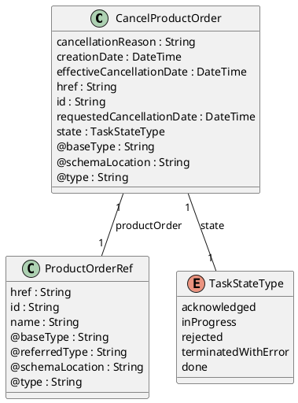

**Figure 12 - CancelProductOrder**

### Field descriptions

#### CancelProductOrder fields

| Field                     | Description                                                                     |
| :------------------------ | :------------------------------------------------------------------------------ |
| cancellationReason        | A String. Reason why the order is cancelled.                                   |
| creationDate              | A DateTime. Date and time when the CancelProductOrder was created.             |
| effectiveCancellationDate | A DateTime. Date when the order is cancelled.                                   |
| href                      | A String. Hyperlink reference.                                                  |
| id                        | A String. Unique identifier.                                                    |
| productOrder              | A ProductOrderRef. A reference to an existing Product Order.                   |
| requestedCancellationDate | A DateTime. Date when the submitter wants the order to be cancelled.            |
| state                     | A TaskStateType. Possible values for the state of a task.                     |
| @baseType                 | A String. When sub-classing, this defines the super-class.                      |
| @schemaLocation           | A String. A URI to a JSON-Schema file that defines additional attributes and relationships. |
| @type                     | A String. When sub-classing, this defines the sub-class Extensible name.        |

#### ProductOrderRef sub-resource fields

| Field           | Description                                                                     |
| :-------------- | :------------------------------------------------------------------------------ |
| href            | A String. Hyperlink reference.                                                  |
| id              | A String. Unique identifier.                                                    |
| name            | A String. Name of the referred entity.                                          |
| @baseType       | A String. When sub-classing, this defines the super-class.                      |
| @referredType   | A String. The actual type of the target instance when needed for disambiguation. |
| @schemaLocation | A String. A URI to a JSON-Schema file that defines additional attributes and relationships. |
| @type           | A String. When sub-classing, this defines the sub-class Extensible name.        |

### Json representation sample(s)

We provide below a JSON representation as example of the 'CancelProductOrder' resource object.

```json
{
  "requestedCancellationDate": "2021-08-30T09:14:46.145Z",
  "cancellationReason": "Duplicate order",
  "@type": "CancelProductOrder",
  "productOrder": {
    "@referredType": "ProductOrderRef",
    "@type": "ProductOrder",
    "id": "45f-98f-ss45",
    "href": "https://host:port/productOrderingManagement/v5/productOrder/45f-98f-ss45"
  },
  "id": "789-fsds5-kjp",
  "href": "https://host:port/productOrderingManagement/v5/cancelProductOrder/789-fsds5-kjp",
  "state": "done",
  "creationDate": "2019-04-30T08:13:59.506Z",
  "effectiveCancellationDate": "2021-08-30T11:14:46.145Z"
}
```

### Notification Resource Models

11 notifications are defined for this API.

Notifications related to ProductOrder:

*   Product Order Delete Event
*   Product Order Information Required Event
*   Product Order State Change Event
*   Product Order Jeopardy Alert Event
*   Product Order Create Event
*   Product Order Milestone Event
*   Product Order Attribute Value Change Event
*   Product Order Error Message Event

Notifications related to CancelProductOrder:

*   Cancel Product Order State Change Event
*   Cancel Product Order Create Event
*   Cancel Product Order Information Required Event

The notification structure for all notifications in this API follow the pattern depicted by the figure below. A notification event resource (depicted by "SpecificEvent" placeholder) is a sub class of a generic Event structure containing at least an id of the event occurrence (eventId), an event timestamp (eventTime), and the name of the resource (eventType). This notification structure owns an event payload structure ("SpecificEventPayload" placeholder) linked to the resource concerned by the notification using the resource name as access field ("resourceName" placeholder).

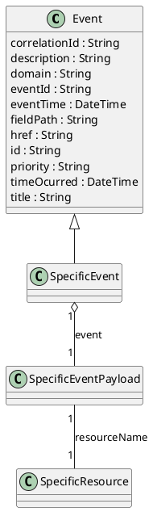

**Figure 13 Notification Pattern**

#### Product Order Delete Event

Message example for ProductOrderDeleteEvent event

```json
{
  "correlationId": "145d-8hh",
  "description": "ProductOrderDeleteEvent illustration",
  "domain": "Commercial",
  "eventId": "523",
  "eventTime": "2021-09-27T07:43:59.059Z",
  "eventType": "ProductOrderDeleteEvent",
  "priority": "3",
  "timeOcurred": "2021-09-27T07:43:59.059Z",
  "title": "ProductOrderDeleteEvent",
  "event": {
    "productOrder": {
      "id": "9693",
      "href": "https://host:port/productOrderingManagement/v5/productOrder/9693",
      "@type": "ProductOrder",
      "@referredType": "ProductOrderRef"
    }
  },
  "reportingSystem": {
    "id": "123",
    "name": "CRM app",
    "@type": "ReportingResource",
    "@referredType": "LogicalResource"
  },
  "source": {
    "id": "123",
    "name": "CRM app",
    "@type": "ReportingResource",
    "@referredType": "LogicalResource"
  },
  "@baseType": "Event",
  "@type": "ProductOrderDeleteEvent"
}
```

#### Product Order Information Required Event

Message example for ProductOrderInformationRequiredEvent event

```json
{
  "correlationId": "qs1-k33",
  "description": "ProductOrderInformationRequiredEvent illustration",
  "domain": "Commercial",
  "eventId": "966",
  "eventTime": "2021-09-27T07:43:59.059Z",
  "eventType": "ProductOrderInformationRequiredEvent",
  "priority": "1",
  "timeOcurred": "2021-09-27T07:43:59.059Z",
  "title": "ProductOrderInformationRequiredEvent",
  "event": {
    "productOrder": {
      "id": "30001",
      "href": "https://host:port/productOrderingManagement/v5/productOrder/30001",
      "@type": "ProductOrder",
      "@referredtype": "ProductOrderRef"
    },
    "informationRequired": {
      "op": "add",
      "path": "agreement.id"
    }
  },
  "reportingSystem": {
    "id": "123",
    "name": "CRM app",
    "@type": "ReportingResource",
    "@referredType": "LogicalResource"
  },
  "source": {
    "id": "123",
    "name": "CRM app",
    "@type": "ReportingResource",
    "@referredType": "LogicalResource"
  },
  "@baseType": "Event",
  "@type": "ProductOrderInformationRequiredEvent"
}
```

#### Product Order State Change Event

Message example for ProductOrderStateChangeEvent event

```json
{
  "correlationId": "333-fd6",
  "description": "ProductOrderStateChangeEvent illustration",
  "domain": "Commercial",
  "eventId": "569",
  "eventTime": "2021-09-27T07:43:59.059Z",
  "eventType": "ProductOrderStateChangeEvent",
  "priority": "1",
  "timeOcurred": "2021-09-27T07:43:59.059Z",
  "title": "ProductOrderStateChangeEvent",
  "event": {
    "productOrder": {
      "id": "9693",
      "href": "https://host:port/productOrderingManagement/v5/productOrder/9693",
      "@type": "ProductOrder",
      "state": "inProgress",
      "itemStateChange": [
        {
          "itemId": "1",
          "state": "inProgress"
        },
        {
          "itemId": "2",
          "state": "inProgress"
        }
      ]
    }
  },
  "reportingSystem": {
    "id": "123",
    "name": "CRM app",
    "@type": "ReportingResource",
    "@referredType": "LogicalResource"
  },
  "source": {
    "id": "123",
    "name": "CRM app",
    "@type": "ReportingResource",
    "@referredType": "LogicalResource"
  },
  "@baseType": "Event",
  "@type": "ProductOrderStateChangeEvent"
}
```

#### Product Order Jeopardy Alert Event

Message example for ProductOrderJeopardyAlertEvent event

```json
{
  "correlationId": "8a1d7f00-245b",
  "description": "ProductOrderJeopardyAlertEvent illustration",
  "domain": "Commercial",
  "eventId": "467c-937d-9afe827e85ee",
  "eventTime": "2022-09-14T12:14:28.774Z",
  "eventType": "ProductOrderJeopardyAlertEvent",
  "priority": "3",
  "timeOcurred": "2022-09-14T12:14:23.473Z",
  "title": "ProductOrderJeopardyAlertEvent",
  "event": {
    "productOrder": {
      "href": "http://servername/productOrder/30001",
      "id": "30001",
      "@type": "ProductOrder",
      "@referredtype": "ProductOrderRef",
      "productOrderJeopardyAlert": [
        {
          "id": "456-dd-df45",
          "message": "adress missing information",
          "alertDate": "2022-09-14T12:14:23.473Z",
          "jeopardyType": "AppointmentInformation",
          "@type": "JeopardyAlert"
        }
      ]
    }
  },
  "reportingSystem": {
    "id": "533",
    "name": "APP-963",
    "@type": "ReportingResource",
    "@referredType": "LogicalResource"
  },
  "source": {
    "id": "200",
    "name": "APP-893",
    "@type": "ReportingResource",
    "@referredType": "LogicalResource"
  },
  "@baseType": "Event",
  "@type": "ProductOrderJeopardyAlertEvent"
}
```

#### Product Order Create Event

Message example for ProductOrderCreateEvent event

```json
{
  "correlationId": "126-54f",
  "description": "ProductOrderCreateEvent illustration",
  "domain": "Commercial",
  "eventId": "125",
  "eventTime": "2021-09-27T07:43:59.059Z",
  "eventType": "ProductOrderCreateEvent",
  "priority": "1",
  "timeOcurred": "2021-09-27T07:43:59.059Z",
  "title": "ProductOrderCreateEvent",
  "event": {
    "productOrder": {
      "id": "30001",
      "href": "https://host:port/productOrderingManagement/v5/productOrder/30001",
      "category": "B2C product order",
      "description": "Product Order illustration sample",
      "expectedCompletionDate": "2019-05-02T08:13:59.506Z",
      "externalId": [
        {
          "@type": "ExternalIdentifierExternalIdentifier",
          "owner": "TMF",
          "externalIdentifierType": "POnumber",
          "id": "456"
        }
      ],
      "creationDate": "2019-04-30T08:13:59.506Z",
      "priority": "1",
      "requestedCompletionDate": "2019-05-02T08:13:59.506Z",
      "requestedStartDate": "2019-05-03T08:13:59.506Z",
      "channel": [
        {
          "role": "Used channel for order capture",
          "@type": "RelatedChannel",
          "channel": {
            "id": "1",
            "name": "Online channel",
            "@type": "ChannelRef"
          }
        }
      ],
      "note": [
        {
          "id": "1",
          "author": "Jean Pontus",
          "date": "2019-04-30T08:13:59.509Z",
          "text": "This is a TMF product order illustration",
          "@type": "Note"
        }
      ],
      "productOrderItem": [
        {
          "id": "100",
          "quantity": 1,
          "action": "add",
          "productOffering": {
            "id": "14277",
            "href": "https://host:port/productCatalogManagement/v5/productOffering/14277",
            "name": "TMF25",
            "@type": "ProductOfferingRef"
          },
          "productOrderItemRelationship": [
            {
              "id": "110",
              "relationshipType": "bundles",
              "@type": "OrderItemRelationship"
            },
            {
              "id": "120",
              "relationshipType": "bundles",
              "@type": "OrderItemRelationship"
            },
            {
              "id": "130",
              "relationshipType": "bundles",
              "@type": "OrderItemRelationship"
            }
          ],
          "state": "acknowledged",
          "@type": "ProductOrderItem"
        },
        {
          "id": "110",
          "quantity": 1,
          "action": "add",
          "itemPrice": [
            {
              "description": "Access Fee",
              "name": "Access Fee",
              "@type": "OrderPrice",
              "priceType": "nonRecurring",
              "price": {
                "taxRate": 0,
                "@type": "Price",
                "dutyFreeAmount": {
                  "unit": "EUR",
                  "value": 0.99,
                  "@type": "Money"
                },
                "taxIncludedAmount": {
                  "unit": "EUT",
                  "value": 0.99,
                  "@type": "Money"
                }
              }
            }
          ],
          "payment": [
            {
              "id": "2365",
              "href": "https://host:port/paymentManagement/v5/cashPayment/2365",
              "name": "Cash payment for access fee",
              "@type": "PaymentRef",
              "@referredType": "CashPayment"
            }
          ],
          "product": {
            "isBundle": false,
            "@type": "Product",
            "productCharacteristic": [
              {
                "name": "TEL_MSISDN",
                "id": "Char6",
                "@type": "StringCharacteristic",
                "valueType": "string",
                "value": "415 279 7439"
              }
            ],
            "productSpecification": {
              "id": "14307",
              "href": "https://host:port/productCatalogManagement/v5/productSpecification/14307",
              "name": "Mobile Telephony",
              "version": "1",
              "@type": "ProductSpecificationRef"
            }
          },
          "productOffering": {
            "id": "14305",
            "href": "https://host:port/productCatalogManagement/v5/productOffering/14305",
            "name": "TMF Mobile Telephony",
            "@type": "ProductOfferingRef"
          },
          "state": "acknowledged",
          "@type": "ProductOrderItem"
        },
        {
          "id": "120",
          "quantity": 1,
          "action": "add",
          "billingAccount": {
            "id": "1513",
            "href": "https://host:port/billingAccountManagement/v5/billingAccount/1513",
            "@type": "BillingAccountRef"
          },
          "itemPrice": [
            {
              "description": "Tariff plan monthly fee",
              "name": "MonthlyFee",
              "priceType": "recurring",
              "@type": "OrderPrice",
              "recurringChargePeriod": "month",
              "price": {
                "taxRate": 0,
                "@type": "Price",
                "dutyFreeAmount": {
                  "unit": "EUR",
                  "value": 20,
                  "@type": "Money"
                },
                "taxIncludedAmount": {
                  "unit": "EUR",
                  "value": 20,
                  "@type": "Money"
                }
              },
              "priceAlteration": [
                {
                  "applicationDuration": 3,
                  "description": "20% for first 3 months",
                  "name": "WelcomeDiscount",
                  "priceType": "recurring",
                  "priority": 1,
                  "recurringChargePeriod": "month",
                  "@type": "PriceAlteration",
                  "price": {
                    "percentage": 20,
                    "taxRate": 0,
                    "@type": "price"
                  }
                }
              ]
            }
          ],
          "itemTerm": [
            {
              "description": "Tariff plan 12 Months commitment",
              "name": "12Months",
              "@type": "OrderTerm",
              "duration": {
                "amount": 12,
                "units": "month",
                "@type": "Duration"
              }
            }
          ],
          "product": {
            "isBundle": false,
            "@type": "Product",
            "productSpecification": {
              "id": "14395",
              "href": "https://host:port/productCatalogManagement/v5/productSpecification/14395",
              "name": "TMF Tariff plan",
              "version": "1",
              "@type": "ProductSpecificationRef"
            }
          },
          "productOffering": {
            "id": "14344",
            "href": "https://host:port/productCatalogManagement/v5/productOffering/14344",
            "name": "TMF Tariff Plan",
            "@type": "ProductOfferingRef"
          },
          "productOrderItemRelationship": [
            {
              "id": "110",
              "relationshipType": "reliesOn",
              "@type": "OrderItemRelationship"
            }
          ],
          "state": "acknowledged",
          "@type": "ProductOrderItem"
        },
        {
          "id": "130",
          "quantity": 1,
          "action": "add",
          "product": {
            "isBundle": false,
            "@type": "Product",
            "productCharacteristic": [
              {
                "name": "CoverageOptions",
                "id": "Char7",
                "@type": "StringCharacteristic",
                "valueType": "string",
                "value": "National"
              }
            ],
            "productSpecification": {
              "id": "14353",
              "href": "https://host:port/productCatalogManagement/v5/productSpecification/14353",
              "name": "Coverage",
              "version": "1",
              "@type": "ProductSpecificationRef"
            }
          },
          "productOffering": {
            "id": "14354",
            "href": "https://host:port/productCatalogManagement/v5/productOffering/14354",
            "name": "Coverage Options",
            "@type": "ProductOfferingRef"
          },
          "productOrderItemRelationship": [
            {
              "id": "110",
              "relationshipType": "reliesOn",
              "@type": "OrderItemRelationship"
            }
          ],
          "state": "acknowledged",
          "@type": "ProductOrderItem"
        }
      ],
      "relatedParty": [
        {
          "role": "Seller",
          "partyOrPartyRole": {
            "id": "456-dd-df45",
            "href": "https://host:port/partyManagement/v5/individual/456-dd-df45",
            "name": "Joe Doe",
            "@type": "PartyRef",
            "@referredType": "Individual"
          },
          "@type": "RelatedPartyRefOrPartyRoleRef"
        },
        {
          "role": "Customer",
          "partyOrPartyRole": {
            "id": "ff55-hjy4",
            "href": "https://host:port/partyRoleManagement/v5/customer/ff55-hjy4",
            "name": "Jean Pontus",
            "@type": "PartyRoleRef",
            "@referredType": "Customer"
          },
          "@type": "RelatedPartyRefOrPartyRoleRef"
        }
      ],
      "state": "acknowledged",
      "@type": "ProductOrder"
    }
  },
  "relatedParty": [
    {
      "role": "Issuer",
      "partyOrPartyRole": {
        "id": "56d",
        "href": "https://host:port/partyManagement/v5/organization/56d",
        "name": "Joe Doe",
        "@type": "PartyRef",
        "@referredType": "Organization"
      },
      "@type": "RelatedPartyRefOrPartyRoleRef"
    }
  ],
  "reportingSystem": {
    "id": "123",
    "name": "CRM app",
    "@type": "ReportingResource",
    "@referredType": "LogicalResource"
  },
  "source": {
    "id": "123",
    "name": "CRM app",
    "@type": "ReportingResource",
    "@referredType": "LogicalResource"
  },
  "@baseType": "Event",
  "@type": "ProductOrderCreateEvent"
}
```

#### Product Order Milestone Event

Message example for ProductOrderMilestoneEvent event

```json
{
  "correlationId": "8a1d7f00-245b",
  "description": "ProductOrderMilestoneEvent illustration",
  "domain": "Commercial",
  "eventId": "467c-937d-9afe827e85ee",
  "eventTime": "2022-09-14T12:14:28.774Z",
  "eventType": "ProductOrderMilestoneEvent",
  "priority": "3",
  "timeOcurred": "2022-09-14T12:14:23.473Z",
  "title": "ProductOrderMilestoneEvent",
  "event": {
    "productOrder": {
      "href": "http://servername/productOrder/30001",
      "id": "30001",
      "@type": "ProductOrder",
      "@referredtype": "ProductOrderRef",
      "productOrderMilestone": [
        {
          "id": "456-dd-df45",
          "message": "ready to be submitted",
          "milestoneDate": "2022-09-14T12:14:23.473Z",
          "status": "Completed",
          "@type": "Milestone"
        }
      ]
    }
  },
  "reportingSystem": {
    "id": "533",
    "name": "APP-963",
    "@type": "ReportingResource",
    "@referredType": "LogicalResource"
  },
  "source": {
    "id": "200",
    "name": "APP-893",
    "@type": "ReportingResource",
    "@referredType": "LogicalResource"
  },
  "@baseType": "Event",
  "@type": "ProductOrderMilestoneEvent"
}
```

#### Product Order Attribute Value Change Event

Message example for ProductOrderAttributeValueChangeEvent event

```json
{
  "correlationId": "8a1d7f00-245b",
  "description": "ProductOrderAttributeValueChangeEvent illustration",
  "domain": "Commercial",
  "eventId": "467c-937d-9afe827e85ee",
  "eventTime": "2022-09-14T12:14:28.774Z",
  "eventType": "ProductOrderAttributeValueChangeEvent",
  "priority": "3",
  "timeOcurred": "2022-09-14T12:14:23.473Z",
  "title": "ProductOrderAttributeValueChangeEvent",
  "event": {
    "productOrder": {
      "href": "http://servername/productOrder/30001",
      "id": "30001",
      "@type": "ProductOrder",
      "relatedParty": [
        {
          "role": "Seller",
          "partyOrPartyRole": {
            "id": "456-dd-df45",
            "href": "https://host:port/partyManagement/v5/individual/456-dd-df45",
            "name": "Joe Doe",
            "@type": "PartyRef",
            "@referredType": "Individual"
          },
          "@type": "RelatedPartyRefOrPartyRoleRef"
        },
        {
          "role": "Customer",
          "partyOrPartyRole": {
            "id": "ff55-hjy4",
            "href": "https://host:port/partyRoleManagement/v5/customer/ff55-hjy4",
            "name": "Jean Pontus",
            "@type": "PartyRoleRef",
            "@referredType": "Customer"
          },
          "@type": "RelatedPartyRefOrPartyRoleRef"
        }
      ]
    }
  },
  "reportingSystem": {
    "id": "533",
    "name": "APP-963",
    "@type": "ReportingResource",
    "@referredType": "LogicalResource"
  },
  "source": {
    "id": "200",
    "name": "APP-893",
    "@type": "ReportingResource",
    "@referredType": "LogicalResource"
  },
  "@baseType": "Event",
  "@type": "ProductOrderAttributeValueChangeEvent"
}
```

#### Product Order Error Message Event

Message example for ProductOrderErrorMessageEvent event

```json
{
  "correlationId": "8a1d7f00-245b",
  "description": "ProductOrderErrorMessageEvent illustration",
  "domain": "Commercial",
  "eventId": "467c-937d-9afe827e85ee",
  "eventTime": "2022-09-14T12:14:28.774Z",
  "eventType": "ProductOrderErrorMessageEvent",
  "priority": "3",
  "timeOcurred": "2022-09-14T12:14:23.473Z",
  "title": "ProductOrderErrorMessageEvent",
  "event": {
    "productOrder": {
      "href": "http://servername/productOrder/30001",
      "id": "30001",
      "@type": "ProductOrder",
      "productOrderErrorMessage": [
        {
          "code": "456-dd-df45",
          "reason": "missing product configuration attribute",
          "message": "product characteristic information are not consistent",
          "timestamp": "2022-09-14T12:14:23.473Z",
          "@type": "ErrorMessage"
        }
      ]
    }
  },
  "reportingSystem": {
    "id": "533",
    "name": "APP-963",
    "@type": "ReportingResource",
    "@referredType": "LogicalResource"
  },
  "source": {
    "id": "200",
    "name": "APP-893",
    "@type": "ReportingResource",
    "@referredType": "LogicalResource"
  },
  "@baseType": "Event",
  "@type": "ProductOrderErrorMessageEvent"
}
```

#### Cancel Product Order State Change Event

Message example for CancelProductOrderStateChangeEvent event

```json
{
  "correlationId": "456-fff",
  "description": "CancelProductOrderStateChangeEvent illustration",
  "domain": "Commercial",
  "eventId": "129",
  "eventTime": "2021-09-28T07:43:59.059Z",
  "eventType": "CancelProductOrderStateChangeEvent",
  "priority": "1",
  "timeOcurred": "2021-09-28T07:43:59.059Z",
  "title": "CancelProductOrderStateChangeEvent",
  "event": {
    "cancelProductOrder": {
      "id": "789-fsds5-kjp",
      "href": "https://host:port/productOrderingManagement/v5/cancelProductOrder/789-fsds5-kjp",
      "cancellationReason": "Duplicate order",
      "creationDate": "2019-04-30T08:13:59.506Z",
      "requestedCancellationDate": "2021-08-30T09:14:46.145Z",
      "productOrder": {
        "id": "45f-98f-ss45",
        "href": "https://host:port/productOrderingManagement/v5/productOrder/45f-98f-ss45",
        "@referredType": "ProductOrder",
        "@type": "ProductOrderRef"
      },
      "state": "inProgress",
      "@type": "CancelProductOrder"
    }
  },
  "relatedParty": [
    {
      "role": "Issuer",
      "partyOrPartyRole": {
        "id": "56d",
        "href": "https://host:port/partyManagement/v5/organization/56d",
        "name": "Joe Doe",
        "@type": "PartyRef",
        "@referredType": "Organization"
      },
      "@type": "RelatedPartyRefOrPartyRoleRef"
    }
  ],
  "reportingSystem": {
    "id": "123",
    "name": "CRM app",
    "@type": "ReportingResource",
    "@referredType": "LogicalResource"
  },
  "source": {
    "id": "123",
    "name": "CRM app",
    "@type": "ReportingResource",
    "@referredType": "LogicalResource"
  },
  "@baseType": "Event",
  "@type": "CancelProductOrderStateChangeEvent"
}
```

#### Cancel Product Order Create Event

Message example for CancelProductOrderCreateEvent event

```json
 {
  "correlationId": "456-fff",
  "description": "CancelProductOrderCreateEvent illustration",
  "domain": "Commercial",
  "eventId": "129",
  "eventTime": "2021-09-28T07:43:59.059Z",
  "eventType": "CancelProductOrderCreateEvent",
  "priority": "1",
  "timeOcurred": "2021-09-28T07:43:59.059Z",
  "title": "CancelProductOrderCreateEvent",
  "event": {
    "cancelProductOrder": {
      "id": "789-fsds5-kjp",
      "href": "https://host:port/productOrderingManagement/v5/cancelProductOrder/789-fsds5-kjp",
      "cancellationReason": "Duplicate order",
      "creationDate": "2019-04-30T08:13:59.506Z",
      "requestedCancellationDate": "2021-08-30T09:14:46.145Z",
      "productOrder": {
        "id": "45f-98f-ss45",
        "href": "https://host:port/productOrderingManagement/v5/productOrder/45f-98f-ss45",
        "@referredType": "ProductOrder",
        "@type": "ProductOrderRef"
      },
      "state": "acknowledged",
      "@type": "CancelProductOrder"
    }
  },
  "relatedParty": [
    {
      "role": "Issuer",
      "partyOrPartyRole": {
        "id": "56d",
        "href": "https://host:port/partyManagement/v5/organization/56d",
        "name": "Joe Doe",
        "@type": "PartyRef",
        "@referredType": "Organization"
      },
      "@type": "RelatedPartyRefOrPartyRoleRef"
    }
  ],
  "reportingSystem": {
    "id": "123",
    "name": "CRM app",
    "@type": "ReportingResource",
    "@referredType": "LogicalResource"
  },
  "source": {
    "id": "123",
    "name": "CRM app",
    "@type": "ReportingResource",
    "@referredType": "LogicalResource"
  },
  "@baseType": "Event",
  "@type": "CancelCancelProductOrderCreateEvent"
}
```

#### Cancel Product Order Information Required Event

Message example for CancelProductOrderInformationRequiredEvent event

```json
{
  "correlationId": "d5894698-6801",
  "description": "CancelProductOrderInformationRequiredEvent illustration",
  "domain": "Commercial",
  "eventId": "408f-a88f-40f2ebbe8a06",
  "eventTime": "2022-09-14T12:14:28.790Z",
  "eventType": "CancelProductOrderInformationRequiredEvent",
  "priority": "4",
  "timeOcurred": "2022-09-14T12:14:21.843Z",
  "title": "CancelProductOrderInformationRequiredEvent",
  "event": {
    "cancelProductOrder": {
      "id": "789-fsds5-kjp",
      "href": "http://servername/cancelProductOrder/789-fsds5-kjp",
      "requestedCancellationDate": "2019-04-30T12:56:21.931Z",
      "productOrder": {
        "id": "45f-98f-ss45",
        "href": "https://host:port/productOrderingManagement/v4/productOrder/45f-98f-ss45",
        "@referredType": "ProductOrder",
        "@type": "ProductOrderRef"
      },
      "state": "acknowledged",
      "@type": "CancelProductOrder"
    },
    "informationRequired": {
      "op": "add",
      "path": "cancellationReason"
    }
  },
  "reportingSystem": {
    "id": "533",
    "name": "APP-963",
    "@type": "ReportingResource",
    "@referredType": "LogicalResource"
  },
  "source": {
    "id": "200",
    "name": "APP-893",
    "@type": "ReportingResource",
    "@referredType": "LogicalResource"
  },
  "@baseType": "Event",
  "@type": "CancelProductOrderInformationRequiredEvent"
}
```

## API OPERATIONS

Remember the following Uniform Contract:

| Operation on Entities    | Uniform API Operation | Description                                           |
| :----------------------- | :-------------------- | :---------------------------------------------------- |
| Query Entities           | GET Resource          | GET must be used to retrieve a representation of a resource. |
| Create Entity            | POST Resource         | POST must be used to create a new resource            |
| Partial Update of an Entity | PATCH Resource        | PATCH must be used to partially update a resource   |
| Remove an Entity         | DELETE Resource       | DELETE must be used to remove a resource            |
| Execute an Action on an Entity | POST on TASK Resource | POST must be used to execute Task Resources          |
| Other Request Methods    | POST on TASK Resource | GET and POST must not be used to tunnel other request methods. |

Filtering and attribute selection rules are described in the TMF REST Design Guidelines.

Notifications are also described in a subsequent section.

### Operations on ProductOrder

#### List or find ProductOrder objects

`GET /productOrder?fields=…`

**Description**

This operation list ProductOrder entities. Attribute selection is enabled for all first level attributes. Filtering may be available depending on the compliance level supported by an implementation.

**Usage samples**

Retrieve a list of ProductOrder(s).

**Request**

```
GET /productOrder
Content-Type: application/json
```

**Response**

```
200
```

```json
[
  {
    "id": "30001",
    "href": "https://host:port/productOrderingManagement/v5/productOrder/30001",
    "category": "B2C product order",
    "description": "Product Order illustration sample",
    "expectedCompletionDate": "2019-05-02T08:13:59.506Z",
    "externalId": [
      {
        "@type": "ExternalIdentifier",
        "owner": "TMF",
        "externalIdentifierType": "POnumber",
        "id": "456"
      }
    ],
    "creationDate": "2019-04-30T08:13:59.506Z",
    "priority": "1",
    "requestedCompletionDate": "2019-05-02T08:13:59.506Z",
    "requestedStartDate": "2019-05-03T08:13:59.506Z",
    "channel": [
      {
        "role": "Used channel for order capture",
        "@type": "RelatedChannel",
        "channel": {
          "id": "1",
          "name": "Online channel",
          "@type": "ChannelRef"
        }
      }
    ],
    "note": [
      {
        "id": "1",
        "author": "Jean Pontus",
        "date": "2019-04-30T08:13:59.509Z",
        "text": "This is a TMF product order illustration",
        "@type": "Note"
      }
    ],
    "productOrderItem": [
      {
        "id": "100",
        "quantity": 1,
        "action": "add",
        "productOffering": {
          "id": "14277",
          "href": "https://host:port/productCatalogManagement/v5/productOffering/14277",
          "name": "TMF25",
          "@type": "ProductOfferingRef"
        },
        "productOrderItemRelationship": [
          {
            "id": "110",
            "relationshipType": "bundles",
            "@type": "OrderItemRelationship"
          },
          {
            "id": "120",
            "relationshipType": "bundles",
            "@type": "OrderItemRelationship"
          },
          {
            "id": "130",
            "relationshipType": "bundles",
            "@type": "OrderItemRelationship"
          }
        ],
        "state": "acknowledged",
        "@type": "ProductOrderItem"
      },
      {
        "id": "110",
        "quantity": 1,
        "action": "add",
        "itemPrice": [
          {
            "description": "Access Fee",
            "name": "Access Fee",
            "@type": "OrderPrice",
            "priceType": "nonRecurring",
            "price": {
              "taxRate": 0,
              "@type": "Price",
              "dutyFreeAmount": {
                "unit": "EUR",
                "value": 0.99
              },
              "taxIncludedAmount": {
                "unit": "EUR",
                "value": 0.99
              }
            }
          }
        ],
        "payment": [
          {
            "id": "2365",
            "href": "https://host:port/paymentManagement/v5/cashPayment/2365",
            "name": "Cash payment for access fee",
            "@type": "PaymentRef",
            "@referredType": "CashPayment"
          }
        ],
        "product": {
          "isBundle": false,
          "@type": "Product",
          "productCharacteristic": [
            {
              "name": "TEL_MSISDN",
              "id": "Char6",
              "@type": "StringCharacteristic",
              "value": "415 279 7439",
              "valueType": "string"
            }
          ],
          "productSpecification": {
            "id": "14307",
            "href": "https://host:port/productCatalogManagement/v5/productSpecification/14307",
            "name": "Mobile Telephony",
            "version": "1",
            "@type": "ProductSpecificationRef"
          }
        },
        "productOffering": {
          "id": "14305",
          "href": "https://host:port/productCatalogManagement/v5/productOffering/14305",
          "name": "TMF Mobile Telephony",
          "@type": "ProductOfferingRef"
        },
        "state": "acknowledged",
        "@type": "ProductOrderItem"
      },
      {
        "id": "120",
        "quantity": 1,
        "action": "add",
        "billingAccount": {
          "id": "1513",
          "href": "https://host:port/billingAccountManagement/v5/billingAccount/1513",
          "@type": "BillingAccountRef"
        },
        "itemPrice": [
          {
            "description": "Tariff plan monthly fee",
            "name": "MonthlyFee",
            "priceType": "recurring",
            "@type": "OrderPrice",
            "recurringChargePeriod": "month",
            "price": {
              "taxRate": 0,
              "@type": "Price",
              "dutyFreeAmount": {
                "unit": "EUR",
                "value": 20
              },
              "taxIncludedAmount": {
                "unit": "EUR",
                "value": 20
              }
            },
            "priceAlteration": [
              {
                "applicationDuration": 3,
                "description": "20% for first 3 months",
                "name": "WelcomeDiscount",
                "priceType": "recurring",
                "priority": 1,
                "recurringChargePeriod": "month",
                "@type": "PriceAlteration",
                "price": {
                  "percentage": 20,
                  "taxRate": 0,
                  "@type": "Price"
                }
              }
            ]
          }
        ],
        "itemTerm": [
          {
            "description": "Tariff plan 12 Months commitment",
            "name": "12Months",
            "@type": "OrderTerm",
            "duration": {
              "amount": 12,
              "units": "month",
              "@type": "Duration"
            }
          }
        ],
        "product": {
          "isBundle": false,
          "@type": "Product",
          "productSpecification": {
            "id": "14395",
            "href": "https://host:port/productCatalogManagement/v5/productSpecification/14395",
            "name": "TMF Tariff plan",
            "version": "1",
            "@type": "ProductSpecificationRef"
          }
        },
        "productOffering": {
          "id": "14344",
          "href": "https://host:port/productCatalogManagement/v5/productOffering/14344",
          "name": "TMF Tariff Plan",
          "@type": "ProductOfferingRef"
        },
        "productOrderItemRelationship": [
          {
            "id": "110",
            "relationshipType": "reliesOn",
            "@type": "OrderItemRelationship"
          }
        ],
        "state": "acknowledged",
        "@type": "ProductOrderItem"
      },
      {
        "id": "130",
        "quantity": 1,
        "action": "add",
        "product": {
          "isBundle": false,
          "@type": "Product",
          "productCharacteristic": [
            {
              "name": "CoverageOptions",
              "id": "Char7",
              "@type": "StringCharacteristic",
              "value": "National",
              "valueType": "string"
            }
          ],
          "productSpecification": {
            "id": "14353",
            "href": "https://host:port/productCatalogManagement/v5/productSpecification/14353",
            "name": "Coverage",
            "version": "1",
            "@type": "ProductSpecificationRef"
          }
        },
        "productOffering": {
          "id": "14354",
          "href": "https://host:port/productCatalogManagement/v5/productOffering/14354",
          "name": "Coverage Options",
          "@type": "ProductOfferingRef"
        },
        "productOrderItemRelationship": [
          {
            "id": "110",
            "relationshipType": "reliesOn",
            "@type": "OrderItemRelationship"
          }
        ],
        "state": "acknowledged",
        "@type": "ProductOrderItem"
      }
    ],
    "relatedParty": [
      {
        "role": "Seller",
        "partyOrPartyRole": {
          "id": "456-dd-df45",
          "href": "https://host:port/partyManagement/v5/individual/456-dd-df45",
          "name": "Joe Doe",
          "@type": "PartyRef",
          "@referredType": "Individual"
        },
        "@type": "RelatedPartyRefOrPartyRoleRef"
      },
      {
        "role": "Customer",
        "partyOrPartyRole": {
          "id": "ff55-hjy4",
          "href": "https://host:port/partyRoleManagement/v5/customer/ff55-hjy4",
          "name": "Jean Pontus",
          "@type": "PartyRoleRef",
          "@referredType": "Customer"
        },
        "@type": "RelatedPartyRefOrPartyRoleRef"
      }
    ],
    "state": "acknowledged",
    "@type": "ProductOrder"
  },
  {
    "id": "30002",
    "href": "https://host:port/productOrderingManagement/v5/productOrder/30002",
    "category": "B2B product order",
    "description": "Product Order illustration sample",
    "expectedCompletionDate": "2019-05-02T08:13:59.506Z",
    "externalId": [
      {
        "@type": "ExternalIdentifier",
        "owner": "TMF",
        "externalIdentifierType": "POnumber",
        "id": "785"
      }
    ],
    "creationDate": "2019-04-30T08:13:59.506Z",
    "priority": "1",
    "requestedCompletionDate": "2019-05-02T08:13:59.506Z",
    "requestedStartDate": "2019-05-03T08:13:59.506Z",
    "productOrderItem": [
      {
        "id": "110",
        "quantity": 1,
        "action": "add",
        "product": {
          "isBundle": false,
          "@type": "UNI",
          "productSpecification": {
            "id": "dfg-56d",
            "href": "https://api.com/productSpec/dfg-56d",
            "version": "v2",
            "name": "UNI specification",
            "@type": "ProductSpecificationRef"
          },
          "productCharacteristic": [
            {
              "@type": "ObjectCharacteristic",
              "id": "UNI_Characteristic",
              "name": "UNI order configuration",
              "valueType": "Slice5G JSON descriptor",
              "value": {
                "@valueSchemaLocation": "https://github.com/productSpec/UNISpec.json",
                "@type": "UNI_json_Specification",
                "physicalLayer": "10BASE-T",
                "synchronousModeEnabled": true,
                "numberOfLinks": 1,
                "tokenShareEnabled": true,
                "uniResiliency": "NONE",
                "maxServiceFrameSize": 1256
              }
            }
          ]
        },
        "state": "acknowledged",
        "@type": "ProductOrderItem"
      }
    ],
    "relatedParty": [
      {
        "role": "Seller",
        "partyOrPartyRole": {
          "id": "456-dd-df45",
          "href": "https://host:port/partyManagement/v5/individual/456-dd-df45",
          "name": "Joe Doe",
          "@type": "PartyRef",
          "@referredType": "Individual"
        },
        "@type": "RelatedPartyRefOrPartyRoleRef"
      },
      {
        "role": "Customer",
        "partyOrPartyRole": {
          "id": "ff55-hjy4",
          "href": "https://host:port/partyRoleManagement/v5/customer/ff55-hjy4",
          "name": "Jean Pontus",
          "@type": "PartyRoleRef",
          "@referredType": "Customer"
        },
        "@type": "RelatedPartyRefOrPartyRoleRef"
      }
    ],
    "state": "acknowledged",
    "@type": "ProductOrder"
  }
]
```

Retrieve a list of ProductOrder(s) with filter selection.

**Request**

```
GET /productOrder?state=acknowledged&fields=@type,id,href,expectedCompletionDate,state
Content-Type: application/json
```

**Response**

```
200
```

```json
[
  {
    "id": "6987",
    "href": ".../productOrderingManagement/v5/productOrder/6987",
    "expectedCompletionDate": "2019-04-11T14:52:21.823Z",
    "@type": "ProductOrder",
    "state": "acknowledged"
  },
  {
    "id": "7412",
    "href": ".../productOrderingManagement/v5/productOrder/7412",
    "expectedCompletionDate": "2019-04-18T14:21:31.325Z",
    "@type": "ProductOrder",
    "state": "acknowledged"
  },
  {
    "id": "3214",
    "href": ".../productOrderingManagement/v5/productOrder/3214",
    "expectedCompletionDate": "2019-04-21T18:08:31.325Z",
    "@type": "ProductOrder",
    "state": "acknowledged"
  },
  {
    "id": "6547",
    "href": ".../productOrderingManagement/v5/productOrder/6547",
    "expectedCompletionDate": "2019-04-29T10:48:28.325Z",
    "@type": "ProductOrder",
    "state": "acknowledged"
  }
]
```

#### Retrieves a ProductOrder by ID

`GET /productOrder/{id}?fields=…`

**Description**

This operation retrieves a ProductOrder entity. Attribute selection is enabled for all first level attributes. Filtering may be available depending on the compliance level supported by an implementation.

**Usage samples**

Retrieve a Product Order from its identifier

**Request**

```
GET /productOrder/30001
Content-Type: application/json
```

**Response**

```
200
```

```json
{
  "id": "30001",
  "href": "https://host:port/productOrderingManagement/v5/productOrder/30001",
  "category": "B2C product order",
  "completionDate": "2019-05-02T08:13:59.506Z",
  "description": "Product Order illustration sample",
  "expectedCompletionDate": "2019-05-02T08:13:59.506Z",
  "externalId": [
    {
      "@type": "ExternalIdentifier",
      "owner": "TMF",
      "externalIdentifierType": "POnumber",
      "id": "456"
    }
  ],
  "creationDate": "2019-04-30T08:13:59.506Z",
  "priority": "1",
  "requestedCompletionDate": "2019-05-02T08:13:59.506Z",
  "requestedStartDate": "2019-05-03T08:13:59.506Z",
  "channel": [
    {
      "role": "Used channel for order capture",
      "@type": "RelatedChannel",
      "channel": {
        "id": "1",
        "name": "Online channel",
        "@type": "ChannelRef"
      }
    }
  ],
  "note": [
    {
      "id": "1",
      "author": "Jean Pontus",
      "date": "2019-04-30T08:13:59.509Z",
      "text": "This is a TMF product order illustration",
      "@type": "Note"
    }
  ],
  "productOrderItem": [
    {
      "id": "100",
      "quantity": 1,
      "action": "add",
      "productOffering": {
        "id": "14277",
        "href": "https://host:port/productCatalogManagement/v5/productOffering/14277",
        "name": "TMF25",
        "@type": "ProductOfferingRef"
      },
      "productOrderItemRelationship": [
        {
          "id": "110",
          "relationshipType": "bundles",
          "@type": "OrderItemRelationship"
        },
        {
          "id": "120",
          "relationshipType": "bundles",
          "@type": "OrderItemRelationship"
        },
        {
          "id": "130",
          "relationshipType": "bundles",
          "@type": "OrderItemRelationship"
        }
      ],
      "state": "completed",
      "@type": "ProductOrderItem"
    },
    {
      "id": "110",
      "quantity": 1,
      "action": "add",
      "itemPrice": [
        {
          "description": "Access Fee",
          "name": "Access Fee",
          "priceType": "nonRecurring",
          "@type": "OrderPrice",
          "price": {
            "taxRate": 0,
            "@type": "Price",
            "dutyFreeAmount": {
              "unit": "EUR",
              "value": 0.99
            },
            "taxIncludedAmount": {
              "unit": "EUR",
              "value": 0.99
            }
          }
        }
      ],
      "payment": [
        {
          "id": "2365",
          "href": "https://host:port/paymentManagement/v5/cashPayment/2365",
          "name": "Cash payment for access fee",
          "@type": "PaymentRef",
          "@referredType": "CashPayment"
        }
      ],
      "product": {
        "isBundle": false,
        "@type": "Product",
        "productCharacteristic": [
          {
            "name": "TEL_MSISDN",
            "id": "Char6",
            "@type": "StringCharacteristic",
            "value": "415 279 7439",
            "valueType": "string"
          }
        ],
        "productSpecification": {
          "id": "14307",
          "href": "https://host:port/productCatalogManagement/v5/productSpecification/14307",
          "name": "Mobile Telephony",
          "version": "1",
          "@type": "ProductSpecificationRef"
        }
      },
      "productOffering": {
        "id": "14305",
        "href": "https://host:port/productCatalogManagement/v5/productOffering/14305",
        "name": "TMF Mobile Telephony",
        "@type": "ProductOfferingRef"
      },
      "state": "completed",
      "@type": "ProductOrderItem"
    },
    {
      "id": "120",
      "quantity": 1,
      "action": "add",
      "billingAccount": {
        "id": "1513",
        "href": "https://host:port/billingAccountManagement/v5/billingAccount/1513",
        "@type": "BillingAccountRef"
      },
      "itemPrice": [
        {
          "description": "Tariff plan monthly fee",
          "name": "MonthlyFee",
          "priceType": "recurring",
          "@type": "OrderPrice",
          "recurringChargePeriod": "month",
          "price": {
            "taxRate": 0,
            "@type": "Price",
            "dutyFreeAmount": {
              "unit": "EUR",
              "value": 20
            },
            "taxIncludedAmount": {
              "unit": "EUR",
              "value": 20
            }
          },
          "priceAlteration": [
            {
              "applicationDuration": 3,
              "description": "20% for first 3 months",
              "name": "WelcomeDiscount",
              "priceType": "recurring",
              "priority": 1,
              "recurringChargePeriod": "month",
              "@type": "PriceAlteration",
              "price": {
                "percentage": 20,
                "taxRate": 0,
                "@type": "price"
              }
            }
          ]
        }
      ],
      "itemTerm": [
        {
          "description": "Tariff plan 12 Months commitment",
          "name": "12Months",
          "@type": "OrderTerm",
          "duration": {
            "amount": 12,
            "units": "month",
            "@type": "Duration"
          }
        }
      ],
      "product": {
        "isBundle": false,
        "@type": "Product",
        "productSpecification": {
          "id": "14395",
          "href": "https://host:port/productCatalogManagement/v5/productSpecification/14395",
          "name": "TMF Tariff plan",
          "version": "1",
          "@type": "ProductSpecificationRef"
        }
      },
      "productOffering": {
        "id": "14344",
        "href": "https://host:port/productCatalogManagement/v5/productOffering/14344",
        "name": "TMF Tariff Plan",
        "@type": "ProductOfferingRef"
      },
      "productOrderItemRelationship": [
        {
          "id": "110",
          "relationshipType": "reliesOn",
          "@type": "OrderItemRelationship"
        }
      ],
      "state": "completed",
      "@type": "ProductOrderItem"
    },
    {
      "id": "130",
      "quantity": 1,
      "action": "add",
      "product": {
        "isBundle": false,
        "@type": "Product",
        "productCharacteristic": [
          {
            "name": "CoverageOptions",
            "id": "Char7",
            "@type": "StringCharacteristic",
            "value": "National",
            "valueType": "string"
          }
        ],
        "productSpecification": {
          "id": "14353",
          "href": "https://host:port/productCatalogManagement/v5/productSpecification/14353",
          "name": "Coverage",
          "version": "1",
          "@type": "ProductSpecificationRef"
        }
      },
      "productOffering": {
        "id": "14354",
        "href": "https://host:port/productCatalogManagement/v5/productOffering/14354",
        "name": "Coverage Options",
        "@type": "ProductOfferingRef"
      },
      "productOrderItemRelationship": [
        {
          "id": "110",
          "relationshipType": "reliesOn",
          "@type": "OrderItemRelationship"
        }
      ],
      "state": "completed",
      "@type": "ProductOrderItem"
    }
  ],
  "relatedParty": [
    {
      "role": "Seller",
      "partyOrPartyRole": {
        "id": "456-dd-df45",
        "href": "https://host:port/partyManagement/v5/individual/456-dd-df45",
        "name": "Joe Doe",
        "@type": "PartyRef",
        "@referredType": "Individual"
      },
      "@type": "RelatedPartyRefOrPartyRoleRef"
    },
    {
      "role": "Customer",
      "partyOrPartyRole": {
        "id": "ff55-hjy4",
        "href": "https://host:port/partyRoleManagement/v5/customer/ff55-hjy4",
        "name": "Jean Pontus",
        "@type": "PartyRoleRef",
        "@referredType": "Customer"
      },
      "@type": "RelatedPartyRefOrPartyRoleRef"
    }
  ],
  "state": "completed",
  "@type": "ProductOrder"
}
```

Retrieve a Product Order from its identifier

**Request**

```
GET /productOrder/3774
Content-Type: application/json
```

**Response**

```
200
```

```json
{
  "id": "3774",
  "href": "https://host:port/productOrderingManagement/v5/productOrder/3774",
  "category": "B2C product order",
  "description": "Product Order change illustration sample",
  "expectedCompletionDate": "2019-05-22T08:13:59.506Z",
  "externalId": [
    {
      "@type": "ExternalIdentifier",
      "owner": "TMF",
      "externalIdentifierType": "POnumber",
      "id": "457"
    }
  ],
  "creationDate": "2019-04-30T08:13:59.506Z",
  "priority": "1",
  "requestedCompletionDate": "2019-05-22T08:13:59.506Z",
  "requestedStartDate": "2019-05-22T08:13:59.506Z",
  "channel": [
    {
      "role": "Used channel for order capture",
      "@type": "RelatedChannel",
      "channel": {
        "id": "1",
        "name": "Online channel",
        "@type": "ChannelRef"
      }
    }
  ],
  "note": [
    {
      "id": "1",
      "author": "Jean Pontus",
      "date": "2019-05-22T08:13:59.509Z",
      "text": "This is a TMF product order illustration to change existing product",
      "@type": "Note"
    }
  ],
  "productOrderItem": [
    {
      "id": "100",
      "quantity": 1,
      "action": "noChange",
      "product": {
        "id": "6000",
        "@type": "ProductRef",
        "href": "https://host:port/productInventoryManagement/v5/product/6000"
      },
      "productOrderItemRelationship": [
        {
          "id": "110",
          "relationshipType": "bundles",
          "@type": "OrderItemRelationship"
        }
      ],
      "state": "inProgress",
      "@type": "ProductOrderItem"
    },
    {
      "id": "110",
      "quantity": 1,
      "action": "add",
      "product": {
        "id": "6003",
        "href": "https://host:port/productInventoryManagement/v5/product/6003",
        "@type": "Product",
        "productCharacteristic": [
          {
            "name": "CoverageOptions",
            "id": "Char7",
            "@type": "StringCharacteristic",
            "valueType": "string",
            "value": "International"
          }
        ],
        "productRelationship": [
          {
            "relationshipType": "reliesOn",
            "product": {
              "id": "6001",
              "@type": "ProductRef",
              "href": "https://host:port/productInventoryManagement/v5/product/6001"
            },
            "@type": "ProductRelationship"
          }
        ]
      },
      "state": "inProgress",
      "@type": "ProductOrderItem"
    }
  ],
  "relatedParty": [
    {
      "role": "Seller",
      "partyOrPartyRole": {
        "id": "456-dd-df45",
        "href": "https://host:port/partyManagement/v5/individual/456-dd-df45",
        "name": "Joe Doe",
        "@type": "PartyRef",
        "@referredType": "Individual"
      },
      "@type": "RelatedPartyRefOrPartyRoleRef"
    },
    {
      "role": "Customer",
      "partyOrPartyRole": {
        "id": "ff55-hjy4",
        "href": "https://host:port/partyRoleManagement/v5/customer/ff55-hjy4",
        "name": "Jean Pontus",
        "@type": "PartyRoleRef",
        "@referredType": "Customer"
      },
      "@type": "RelatedPartyRefOrPartyRoleRef"
    }
  ],
  "state": "inProgress",
  "@type": "ProductOrder"
}
```

#### Creates a ProductOrder

`POST /productOrder?fields=…`

**Description**

This operation creates a ProductOrder entity.

**Mandatory Attributes**

| Mandatory Attributes                       | Rule |
| :----------------------------------------- | :--- |
| channel.channel                            |      |
| channel.role                               |      |
| orderRelationship.id                       |      |
| orderRelationship.relationshipType         |      |
| orderTotalPrice.price                      |      |
| orderTotalPrice.priceAlteration.price      |      |
| orderTotalPrice.priceAlteration.priceType |      |
| orderTotalPrice.priceType                  |      |
| productOrderItem                           |      |
| productOrderItem.@type                     |      |
| productOrderItem.action                    |      |
| productOrderItem.id                        |      |
| @type                                      |      |

**Usage samples**

Creation of a new Product Order with POST operation

**Request**

```
POST /productOrder
Content-Type: application/json
```

```json
{
  "category": "B2C product order",
  "description": "Product Order illustration sample",
  "externalId": [
    {
      "@type": "ExternalIdentifier",
      "owner": "TMF",
      "externalIdentifierType": "POnumber",
      "id": "456"
    }
  ],
  "priority": "1",
  "requestedCompletionDate": "2019-05-02T08:13:59.506Z",
  "requestedStartDate": "2019-05-03T08:13:59.506Z",
  "channel": [
    {
      "role": "Used channel for order capture",
      "@type": "RelatedChannel",
      "channel": {
        "id": "1",
        "name": "Online channel",
        "@type": "ChannelRef"
      }
    }
  ],
  "note": [
    {
      "id": "1",
      "author": "Jean Pontus",
      "date": "2019-04-30T08:13:59.509Z",
      "text": "This is a TMF product order illustration",
      "@type": "Note"
    }
  ],
  "productOrderItem": [
    {
      "id": "100",
      "quantity": 1,
      "action": "add",
      "productOffering": {
        "id": "14277",
        "name": "TMF25",
        "@type": "ProductOfferingRef"
      },
      "productOrderItemRelationship": [
        {
          "id": "110",
          "relationshipType": "bundles",
          "@type": "OrderItemRelationship"
        },
        {
          "id": "120",
          "relationshipType": "bundles",
          "@type": "OrderItemRelationship"
        },
        {
          "id": "130",
          "relationshipType": "bundles",
          "@type": "OrderItemRelationship"
        }
      ],
      "@type": "ProductOrderItem"
    },
    {
      "id": "110",
      "quantity": 1,
      "action": "add",
      "itemPrice": [
        {
          "description": "Access Fee",
          "name": "Access Fee",
          "@type": "OrderPrice",
          "priceType": "nonRecurring",
          "price": {
            "taxRate": 0,
            "@type": "Price",
            "dutyFreeAmount": {
              "unit": "EUR",
              "value": 0.99
            },
            "taxIncludedAmount": {
              "unit": "EUR",
              "value": 0.99
            }
          }
        }
      ],
      "payment": [
        {
          "id": "2365",
          "href": "https://host:port/paymentManagement/v5/cashPayment/2365",
          "name": "Cash payment for access fee",
          "@type": "PaymentRef",
          "@referredType": "CashPayment"
        }
      ],
      "product": {
        "isBundle": false,
        "@type": "Product",
        "productCharacteristic": [
          {
            "name": "TEL_MSISDN",
            "id": "Char6",
            "@type": "StringCharacteristic",
            "value": "415 279 7439",
            "valueType": "string"
          }
        ],
        "productSpecification": {
          "id": "14307",
          "name": "Mobile Telephony",
          "version": "1",
          "@type": "ProductSpecificationRef"
        }
      },
      "productOffering": {
        "id": "14305",
        "name": "TMF Mobile Telephony",
        "@type": "ProductOfferingRef"
      },
      "@type": "ProductOrderItem"
    },
    {
      "id": "120",
      "quantity": 1,
      "action": "add",
      "billingAccount": {
        "id": "1513",
        "@type": "BillingAccountRef"
      },
      "itemPrice": [
        {
          "description": "Tariff plan monthly fee",
          "name": "MonthlyFee",
          "priceType": "recurring",
          "@type": "OrderPrice",
          "recurringChargePeriod": "month",
          "price": {
            "taxRate": 0,
            "@type": "Price",
            "dutyFreeAmount": {
              "unit": "EUR",
              "value": 20
            },
            "taxIncludedAmount": {
              "unit": "EUR",
              "value": 20
            }
          },
          "priceAlteration": [
            {
              "applicationDuration": 3,
              "description": "20% for first 3 months",
              "name": "WelcomeDiscount",
              "priceType": "recurring",
              "priority": 1,
              "recurringChargePeriod": "month",
              "@type": "PriceAlteration",
              "price": {
                "percentage": 20,
                "taxRate": 0,
                "@type": "Price"
              }
            }
          ]
        }
      ],
      "itemTerm": [
        {
          "description": "Tariff plan 12 Months commitment",
          "name": "12Months",
          "@type": "OrderTerm",
          "duration": {
            "amount": 12,
            "units": "month",
            "@type": "Duration"
          }
        }
      ],
      "product": {
        "isBundle": false,
        "@type": "Product",
        "productSpecification": {
          "id": "14395",
          "href": "https://host:port/productCatalogManagement/v5/productSpecification/14395",
          "name": "TMF Tariff plan",
          "version": "1",
          "@type": "ProductSpecificationRef"
        }
      },
      "productOffering": {
        "id": "14344",
        "href": "https://host:port/productCatalogManagement/v5/productOffering/14344",
        "name": "TMF Tariff Plan",
        "@type": "ProductOfferingRef"
      },
      "productOrderItemRelationship": [
        {
          "id": "110",
          "relationshipType": "reliesOn",
          "@type": "OrderItemRelationship"
        }
      ],
      "@type": "ProductOrderItem"
    },
    {
      "id": "130",
      "quantity": 1,
      "action": "add",
      "product": {
        "isBundle": false,
        "@type": "Product",
        "productCharacteristic": [
          {
            "name": "CoverageOptions",
            "id": "Char7",
            "@type": "StringCharacteristic",
            "value": "National",
            "valueType": "string"
          }
        ],
        "productSpecification": {
          "id": "14353",
          "href": "https://host:port/productCatalogManagement/v5/productSpecification/14353",
          "name": "Coverage",
          "version": "1",
          "@type": "ProductSpecificationRef"
        }
      },
      "productOffering": {
        "id": "14354",
        "href": "https://host:port/productCatalogManagement/v5/productOffering/14354",
        "name": "Coverage Options",
        "@type": "ProductOfferingRef"
      },
      "productOrderItemRelationship": [
        {
          "id": "110",
          "relationshipType": "reliesOn",
          "@type": "OrderItemRelationship"
        }
      ],
      "@type": "ProductOrderItem"
    }
  ],
  "relatedParty": [
    {
      "role": "Seller",
      "partyOrPartyRole": {
        "id": "456-dd-df45",
        "href": "https://host:port/partyManagement/v5/individual/456-dd-df45",
        "name": "Joe Doe",
        "@type": "PartyRef",
        "@referredType": "Individual"
      },
      "@type": "RelatedPartyRefOrPartyRoleRef"
    },
    {
      "role": "Customer",
      "partyOrPartyRole": {
        "id": "ff55-hjy4",
        "href": "https://host:port/partyRoleManagement/v5/customer/ff55-hjy4",
        "name": "Jean Pontus",
        "@type": "PartyRoleRef",
        "@referredType": "Customer"
      },
      "@type": "RelatedPartyRefOrPartyRoleRef"
    }
  ],
  "@type": "ProductOrder"
}
```

**Response**

```
201
```

```json
{
  "id": "30001",
  "href": "https://host:port/productOrderingManagement/v5/productOrder/30001",
  "category": "B2C product order",
  "description": "Product Order illustration sample",
  "expectedCompletionDate": "2019-05-02T08:13:59.506Z",
  "externalId": [
    {
      "@type": "ExternalIdentifier",
      "owner": "TMF",
      "externalIdentifierType": "POnumber",
      "id": "456"
    }
  ],
  "creationDate": "2019-04-30T08:13:59.506Z",
  "priority": "1",
  "requestedCompletionDate": "2019-05-02T08:13:59.506Z",
  "requestedStartDate": "2019-05-03T08:13:59.506Z",
  "channel": [
    {
      "role": "Used channel for order capture",
      "@type": "RelatedChannel",
      "channel": {
        "id": "1",
        "name": "Online channel",
        "@type": "ChannelRef"
      }
    }
  ],
  "note": [
    {
      "id": "1",
      "author": "Jean Pontus",
      "date": "2019-04-30T08:13:59.509Z",
      "text": "This is a TMF product order illustration",
      "@type": "Note"
    }
  ],
  "productOrderItem": [
    {
      "id": "100",
      "quantity": 1,
      "action": "add",
      "productOffering": {
        "id": "14277",
        "href": "https://host:port/productCatalogManagement/v5/productOffering/14277",
        "name": "TMF25",
        "@type": "ProductOfferingRef"
      },
      "productOrderItemRelationship": [
        {
          "id": "110",
          "relationshipType": "bundles",
          "@type": "OrderItemRelationship"
        },
        {
          "id": "120",
          "relationshipType": "bundles",
          "@type": "OrderItemRelationship"
        },
        {
          "id": "130",
          "relationshipType": "bundles",
          "@type": "OrderItemRelationship"
        }
      ],
      "state": "acknowledged",
      "@type": "ProductOrderItem"
    },
    {
      "id": "110",
      "quantity": 1,
      "action": "add",
      "itemPrice": [
        {
          "description": "Access Fee",
          "name": "Access Fee",
          "@type": "OrderPrice",
          "priceType": "nonRecurring",
          "price": {
            "taxRate": 0,
            "@type": "Price",
            "dutyFreeAmount": {
              "unit": "EUR",
              "value": 0.99
            },
            "taxIncludedAmount": {
              "unit": "EUR",
              "value": 0.99
            }
          }
        }
      ],
      "payment": [
        {
          "id": "2365",
          "href": "https://host:port/paymentManagement/v5/cashPayment/2365",
          "name": "Cash payment for access fee",
          "@type": "PaymentRef",
          "@referredType": "CashPayment"
        }
      ],
      "product": {
        "isBundle": false,
        "@type": "Product",
        "productCharacteristic": [
          {
            "name": "TEL_MSISDN",
            "id": "Char6",
            "@type": "StringCharacteristic",
            "value": "415 279 7439",
            "valueType": "string"
          }
        ],
        "productSpecification": {
          "id": "14307",
          "href": "https://host:port/productCatalogManagement/v5/productSpecification/14307",
          "name": "Mobile Telephony",
          "version": "1",
          "@type": "ProductSpecificationRef"
        }
      },
      "productOffering": {
        "id": "14305",
        "href": "https://host:port/productCatalogManagement/v5/productOffering/14305",
        "name": "TMF Mobile Telephony",
        "@type": "ProductOfferingRef"
      },
      "state": "acknowledged",
      "@type": "ProductOrderItem"
    },
    {
      "id": "120",
      "quantity": 1,
      "action": "add",
      "billingAccount": {
        "id": "1513",
        "href": "https://host:port/billingAccountManagement/v5/billingAccount/1513",
        "@type": "BillingAccountRef"
      },
      "itemPrice": [
        {
          "description": "Tariff plan monthly fee",
          "name": "MonthlyFee",
          "priceType": "recurring",
          "@type": "OrderPrice",
          "recurringChargePeriod": "month",
          "price": {
            "taxRate": 0,
            "@type": "Price",
            "dutyFreeAmount": {
              "unit": "EUR",
              "value": 20
            },
            "taxIncludedAmount": {
              "unit": "EUR",
              "value": 20
            }
          },
          "priceAlteration": [
            {
              "applicationDuration": 3,
              "description": "20% for first 3 months",
              "name": "WelcomeDiscount",
              "priceType": "recurring",
              "priority": 1,
              "recurringChargePeriod": "month",
              "@type": "PriceAlteration",
              "price": {
                "percentage": 20,
                "taxRate": 0,
                "@type": "Price"
              }
            }
          ]
        }
      ],
      "itemTerm": [
        {
          "description": "Tariff plan 12 Months commitment",
          "name": "12Months",
          "@type": "OrderTerm",
          "duration": {
            "amount": 12,
            "units": "month",
            "@type": "Duration"
          }
        }
      ],
      "product": {
        "isBundle": false,
        "@type": "Product",
        "productSpecification": {
          "id": "14395",
          "href": "https://host:port/productCatalogManagement/v5/productSpecification/14395",
          "name": "TMF