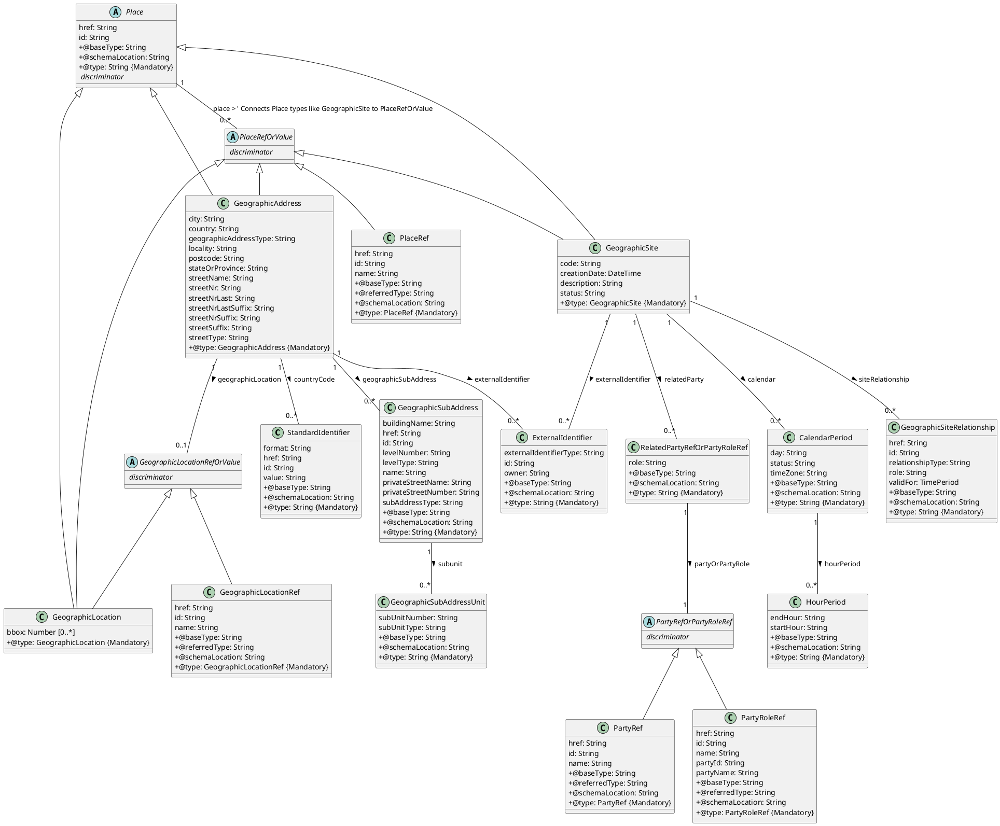
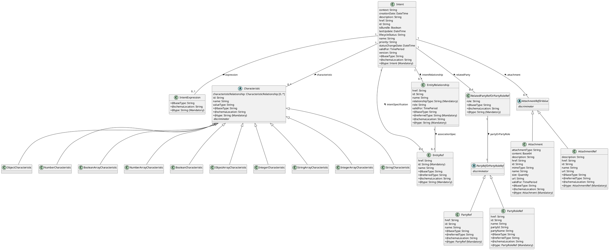

[Image: tmforum logo]

# TM Forum Specification

# ProductInventory

# TMF637

|                           |                                   |
| :------------------------ | :-------------------------------- |
| **Maturity Level:**       | General availability              |
| **Release Status:**       | Production                        |
| **Version 5.0.0**         |                                   |
| **Team Approved Date:**   | 29-09-2023                        |
| **Approval Status:**      | Team Approved                     |
| **IPR Mode:**             | RAND                              |

*TM Forum 2023. All Rights Reserved.*
*tmforum.org*

***

[Image: tmforum logo]

# NOTICE

Copyright © TM Forum 2023. All Rights Reserved.

This document and translations of it may be copied and furnished to others, and derivative works that comment on or otherwise explain it or assist in its implementation may be prepared, copied, published, and distributed, in whole or in part, without restriction of any kind, provided that the above copyright notice and this section are included on all such copies and derivative works. However, this document itself may not be modified in any way, including by removing the copyright notice or references to TM FORUM, except as needed for the purpose of developing any document or deliverable produced by a TM FORUM Collaboration Project Team (in which case the rules applicable to copyrights, as set forth in the TM FORUM IPR Policy, must be followed) or as required to translate it into languages other than English.

The limited permissions granted above are perpetual and will not be revoked by TM FORUM or its successors or assigns.

This document and the information contained herein is provided on an "AS IS" basis and TM FORUM DISCLAIMS ALL WARRANTIES, EXPRESS OR IMPLIED, INCLUDING BUT NOT LIMITED TO ANY WARRANTY THAT THE USE OF THE INFORMATION HEREIN WILL NOT INFRINGE ANY OWNERSHIP RIGHTS OR ANY IMPLIED WARRANTIES OF MERCHANTABILITY OR FITNESS FOR A PARTICULAR PURPOSE.

Direct inquiries to the TM Forum office:

181 New Road, Suite 304
Parsippany, NJ 07054, USA
Tel No. +1 862 227 1648
TM Forum Web Page: www.tmforum.org

*TM Forum 2023. All Rights Reserved.*
*Page i*
*tmforum.org*

***

[Image: tmforum logo]

# Table of Contents

*   NOTICE i
*   Introduction 1
*   Sample Use Cases 2
*   Support of polymorphism and extension patterns. 3
*   RESOURCE MODEL 4
    *   Managed Entity and Task Resource Models. 4
        *   Product resource 4
    *   Notification Resource Models 40
        *   Product Batch Event 41
        *   Product Attribute Value Change Event 43
        *   Product State Change Event.. 45
        *   Product Delete Event 45
        *   Product Create Event 46
*   API OPERATIONS 49
    *   Operations on Product 49
        *   Retrieves a Product by ID 49
        *   List or find Product objects 52
        *   Creates a Product 55
        *   Updates partially a Product. 64
        *   Deletes a Product. 72
*   API NOTIFICATIONS 73
    *   Register listener 73
    *   Unregister listener. 74
    *   Publish Event to listener 74
*   Acknowledgements. 76
*   Release History. 76
*   Contributors to Document. 76

*TM Forum 2023. All Rights Reserved.*
*Page ii*
*tmforum.org*

***

[Image: tmforum logo]

# Introduction

The following document is the user guide of the REST API for Any management. It includes the model definition as well as all available operations.

*TM Forum 2023. All Rights Reserved.*
*Page 1*
*tmforum.org*

***

[Image: tmforum logo]

# Sample Use Cases

Reader will find example of use cases using Usage API in "Open Digital Business Scenarios and Use Cases" document.

*TM Forum 2023. All Rights Reserved.*
*Page 2*
*tmforum.org*

***

[Image: tmforum logo]

# Support of polymorphism and extension patterns

Support of polymorphic collections and types and schema based extension is provided by means of a list of generic meta-attributes that we describe below. Polymorphism in collections occurs when entities inherit from base entities, for instance a BillingAccount and SettlementAccount inheriting properties from the abstract Account entity.

Generic support of polymorphism and pattern extensions is described in the TMF API Guidelines v3.0 Part 2 document.

The @type attribute provides a way to represent the actual class type of an entity. For example, within a list of Account instances some may be instances of BillingAccount where other could be instances of SettlementAccount. The @type gives this information. All resources and sub-resources of this API have a @type attributes that can be provided when this is useful.

The @referred Type can be used within reference entities (like for instance an AccountRef object) to explicitly denote the actual entity type of the referred class. Notice that in reference entities the @type, when used, denotes the class type of the reference itself, such as BillingAccountRef or SettlementAccountRef, and not the class type of the referred object. However since reference classes are rarely sub-classed, @type is generally not useful in reference objects.

The @schemaLocation property can be used in resources to allow specifying user-defined properties of an Entity or to specify the expected characteristics of an entity.

The @baseType attribute gives a way to provide explicitly the base of class of a given resource that has been extended.

*TM Forum 2023. All Rights Reserved.*
*Page 3*
*tmforum.org*

***

[Image: tmforum logo]

# RESOURCE MODEL

## Managed Entity and Task Resource Models

### Product resource

A product offering procured by a customer or other interested party playing a party role. A product is realized as one or more service(s) and / or resource(s).

### Resource model

```plantuml
@startuml
skinparam classAttributeIconSize 0

abstract class Characteristic {
  characteristicRelationship: CharacteristicRelationship [0..*]
  id: String
  name: String
  valueType: String
  +@baseType: String
  +@schemaLocation: String
  +@type: String {Mandatory}
}

abstract class ProductRefOrValue {
  {abstract} .. discriminator ..
}

class ProductRef {
  href: String
  id: String
  name: String
  +@baseType: String
  +@referredType: String
  +@schemaLocation: String
  +@type: String {Mandatory}
}
ProductRefOrValue <|-- ProductRef

class Product {
  creationDate: DateTime
  description: String
  href: String
  id: String
  isBundle: Boolean
  isCustomerVisible: Boolean
  name: String
  orderDate: DateTime
  productSerialNumber: String
  startDate: DateTime
  status: ProductStatusType
  terminationDate: DateTime
  +@baseType: String
  +@schemaLocation: String
  +@type: Product {Mandatory}
}
ProductRefOrValue <|-- Product

class AgreementItemRef {
  agreementHref: String
  agreementId: String
  agreementItemId: String
  agreementName: String
  +@baseType: String
  +@referredType: String
  +@schemaLocation: String
  +@type: String {Mandatory}
}

class ResourceRef {
  href: String
  id: String
  name: String
  +@baseType: String
  +@referredType: String
  +@schemaLocation: String
  +@type: String {Mandatory}
}

class ServiceRef {
  href: String
  id: String
  name: String
  +@baseType: String
  +@referredType: String
  +@schemaLocation: String
  +@type: String {Mandatory}
}

class ProductRelationship {
  href: String
  id: String
  name: String
  relationshipType: String
  +@baseType: String
  +@referredType: String
  +@schemaLocation: String
  +@type: String {Mandatory}
}

class BillingAccountRef {
  href: String
  id: String
  name: String
  ratingType: String
  +@baseType: String
  +@referredType: String
  +@schemaLocation: String
  +@type: String {Mandatory}
}

class ProductTerm {
  description: String
  duration: Duration
  name: String
  validFor: TimePeriod
  +@baseType: String
  +@schemaLocation: String
  +@type: String {Mandatory}
}

class ProductOfferingRef {
  href: String
  id: String
  name: String
  version: String
  +@baseType: String
  +@referredType: String
  +@schemaLocation: String
  +@type: String {Mandatory}
}

enum ProductStatusType <<Enumeration>> {
  pendingTerminate
  created
  cancelled
  active
  pendingActive
  aborted
  terminated
  suspended
}

class ProductOfferingPriceRef {
  href: String
  id: String
  name: String
  version: String
  +@baseType: String
  +@referredType: String
  +@schemaLocation: String
  +@type: String {Mandatory}
}

class ProductPrice {
  description: String
  name: String
  priceType: String
  recurringChargePeriod: String
  unitOfMeasure: String
  +@baseType: String
  +@schemaLocation: String
  +@type: String {Mandatory}
}

class RelatedOrderItem {
  orderHref: String
  orderId: String
  orderItemAction: ItemActionType
  orderItemId: String
  role: String
  +@baseType: String
  +@referredType: String
  +@schemaLocation: String
  +@type: String {Mandatory}
}

enum ItemActionType <<Enumeration>> {
 add
 modify
 noChange
 delete
}

class ProductSpecificationRef {
  href: String
  id: String
  name: String
  version: String
  +@baseType: String
  +@referredType: String
  +@schemaLocation: String
  +@type: String {Mandatory}
}

abstract class RelatedPartyOrPartyRole {
  role: String
  +@baseType: String
  +@schemaLocation: String
  +@type: String {Mandatory}
  {abstract} .. discriminator ..
}

class PartyRef {
  href: String
  id: String
  name: String
  +@baseType: String
  +@referredType: String
  +@schemaLocation: String
  +@type: PartyRef {Mandatory}
}
RelatedPartyOrPartyRole <|-- PartyRef

class PartyRoleRef {
  href: String
  id: String
  name: String
  partyId: String
  partyName: String
  +@baseType: String
  +@referredType: String
  +@schemaLocation: String
  +@type: PartyRoleRef {Mandatory}
}
RelatedPartyOrPartyRole <|-- PartyRoleRef

class TargetProductSchema {
  +@schemaLocation: Uri {Mandatory}
  +@type: String {Mandatory}
}

abstract class PartyOrPartyRole {
  {abstract} .. discriminator ..
}
PartyOrPartyRole <|-- PartyRef
PartyOrPartyRole <|-- PartyRoleRef
' Define Party Roles explicitly mentioned in the diagram as classes extending PartyRole or PartyOrPartyRole for clarity
class Organization extends PartyRef {}
class Consumer extends PartyRef {}
class Producer extends PartyRef {}
class Individual extends PartyRef {}
class BusinessPartner extends PartyRoleRef {}
class Supplier extends PartyRoleRef {}


abstract class IntentRefOrValue {
 {abstract} .. discriminator ..
}

class IntentRef {
  href : String
  id: String
  +@baseType: String
  +@referredType: String
  +@schemaLocation: String
  +@type: IntentRef {Mandatory}
}
IntentRefOrValue <|-- IntentRef

class Intent {
 attachment: AttachmentRefOrValue [0..*]
 characteristic: Characteristic [0..*]
 context: String
 creationDate: DateTime
 description: String
 expression: IntentExpression
 href : String
 id: String
 intentRelationship: EntityRelationship [0..*]
 intentSpecification: EntityRef
 isBundle: Boolean
 lastUpdate: DateTime
 lifecycleStatus: String
 name: String
 priority: String
 relatedParty: RelatedPartyRefOrPartyRoleRef [0..*]
 statusChangeDate: DateTime
 validFor: TimePeriod
 version: String
 +@baseType: String
 +@schemaLocation: String
 +@type: Intent {Mandatory}
}
IntentRefOrValue <|-- Intent

abstract class RelatedPlaceRefOrValue {
  role: String
  +@baseType: String
  +@schemaLocation: String
  +@type: String {Mandatory}
  {abstract} .. discriminator ..
}

abstract class PlaceRefOrValue {
 {abstract} .. discriminator ..
}
class PlaceRef {
  href: String
  id: String
  name: String
  +@baseType: String
  +@referredType: String
  +@schemaLocation: String
  +@type: PlaceRef {Mandatory}
}
PlaceRefOrValue <|-- PlaceRef
RelatedPlaceRefOrValue <|-- PlaceRefOrValue
' Define Place types explicitly mentioned in the diagram
class GeographicAddress {} ' Details in Figure 2
class GeographicLocation {} ' Details in Figure 2
class GeographicSite {} ' Details in Figure 2
PlaceRefOrValue <|-- GeographicAddress
PlaceRefOrValue <|-- GeographicLocation
PlaceRefOrValue <|-- GeographicSite


class PriceAlteration {
 applicationDuration: Integer
 description: String
 name: String
 priceType: String
 priority: Integer
 recurringChargePeriod: String
 unitOfMeasure: String
 +@baseType: String
 +@schemaLocation: String
 +@type: String {Mandatory}
}

class Price {
 dutyFreeAmount: Money
 percentage: Float
 taxIncludedAmount: Money
 taxRate: Float
 +@baseType: String
 +@schemaLocation: String
 +@type: String {Mandatory}
}

' Relationships
Product "0..*" -- "0..1" BillingAccountRef : billingAccount >
Product "0..*" -- "0..*" ProductRelationship : productRelationship >
Product "0..*" -- "0..*" ProductTerm : productTerm >
Product "0..*" -- "0..1" ProductOfferingRef : productOffering >
Product "0..*" -- "0..*" Characteristic : productCharacteristic >
Product "1" -- "0..*" AgreementItemRef : agreementItem >
Product "1" -- "0..*" ResourceRef : realizingResource >
Product "1" -- "0..*" ServiceRef : realizingService >
Product "1" -- "0..*" ProductOfferingPriceRef : productOfferingPrice >
Product "0..*" -- "0..*" RelatedOrderItem : productOrderItem >
Product "1" -- "0..1" ProductSpecificationRef : productSpecification >
Product "1" -- "0..*" RelatedPartyOrPartyRole : relatedParty >
Product "1" -- "0..1" TargetProductSchema : targetProductSchema >
Product "1" -- "0..1" IntentRefOrValue : intent >
Product "1" -- "0..*" RelatedPlaceRefOrValue : place >
Product "0..*" -- "0..*" ProductPrice : productPrice >
ProductPrice "0..*" -- "0..1" PriceAlteration : priceAlteration >
PriceAlteration "0..*" -- "0..1" Price : price >
ProductPrice "0..*" -- "0..1" ProductOfferingPriceRef : productOfferingPrice > ' Assuming this unlabeled line means association

' Note: Cardinalities like (1) mean Mandatory property, represented as {Mandatory} tag above
' Note: Full details of Characteristic, Place, Intent are in separate diagrams/figures
@enduml
```

***Figure 1 - Product***

*TM Forum 2023. All Rights Reserved.*
*Page 4*
*tmforum.org*

***

[Image: tmforum logo]



***Figure 2 - GeographicAddress***

*TM Forum 2023. All Rights Reserved.*
*Page 5*
*tmforum.org*

***

[Image: tmforum logo]



***Figure 3 - Intent***

*TM Forum 2023. All Rights Reserved.*
*Page 6*
*tmforum.org*

***

[Image: tmforum logo]



```plantuml
@startuml
skinparam classAttributeIconSize 0

abstract class Characteristic {
  id: String
  name: String
  valueType: String
  +@baseType: String
  +@schemaLocation: String
  +@type: String {Mandatory}
  {abstract} .. discriminator ..
}

class IntegerCharacteristic extends Characteristic {
  value: Integer
  +@type: IntegerCharacteristic {Mandatory}
}

class StringArrayCharacteristic extends Characteristic {
  value: String [0..*]
  +@type: StringArrayCharacteristic {Mandatory}
}

class IntegerArrayCharacteristic extends Characteristic {
  value: Integer [0..*]
  +@type: IntegerArrayCharacteristic {Mandatory}
}

class StringCharacteristic extends Characteristic {
  value: String
  +@type: StringCharacteristic {Mandatory}
}

class NumberCharacteristic extends Characteristic {
  value: Number
  +@type: NumberCharacteristic {Mandatory}
}

class ObjectCharacteristic extends Characteristic {
  value: object
  +@type: ObjectCharacteristic {Mandatory}
}

class CharacteristicRelationship {
  id: String
  relationshipType: String
  +@baseType: String
  +@schemaLocation: String
  +@type: String {Mandatory}
}

class BooleanArrayCharacteristic extends Characteristic {
  value: Boolean [0..*]
  +@type: BooleanArrayCharacteristic {Mandatory}
}

class NumberArrayCharacteristic extends Characteristic {
  value: Number [0..*]
  +@type: NumberArrayCharacteristic {Mandatory}
}

class BooleanCharacteristic extends Characteristic {
  value: Boolean
  +@type: BooleanCharacteristic {Mandatory}
}

class ObjectArrayCharacteristic extends Characteristic {
  value: object [0..*]
  +@type: ObjectArrayCharacteristic {Mandatory}
}

Characteristic "1" -- "0..*" CharacteristicRelationship : characteristicRelationship >

' Note: Cardinalities like (1) mean Mandatory property, represented as {Mandatory} tag above

@enduml
```

***Figure 4 - Characteristic***

## Field descriptions

### Product fields

| Field                 | Description                                                                                                                                                                |
| :-------------------- | :------------------------------------------------------------------------------------------------------------------------------------------------------------------------- |
| agreementItem         | An AgreementItemRef. It's a Agreement item that has been executed previously.                                                                                              |
| billingAccount        | A BillingAccountRef. BillingAccount reference. A BillingAccount is a detailed description of a bill structure.                                                              |
| creationDate          | A DateTime. Date and time when the product was created.                                                                                                                   |
| description           | A String. Is the description of the product. It could be copied from the description of the Product Offering.                                                             |
| href                  | A String. Hyperlink reference.                                                                                                                                            |
| id                    | A String. Unique identifier.                                                                                                                                              |
| intent                | An IntentRefOrValue. Intent Ref (if Intent already exists) or Value (if Intent be created or its details be presented).                                                    |
| isBundle              | A Boolean. If true, the product is a ProductBundle which is an instantiation of a BundledProductOffering. If false, the product is a ProductComponent which is an instantiation of a SimpleProductOffering. |
| isCustomerVisible     | A Boolean. If true, the product is visible by the customer.                                                                                                               |
| name                  | A String. Name of the product. It could be the same as the name of the product offering.                                                                                  |
| orderDate             | A DateTime. Is the date when the product was ordered.                                                                                                                     |
| place                 | A RelatedPlaceRefOrValue. Entity reference. The polymorphic attributes @type, @schemaLocation & @referredType are related to the Related Place entity and not the RelatedPlaceRefOrValue class itself. |
| product               | A ProductRefOrValue. The polymorphic attributes @type, @schemaLocation & @referredType are related to the Product entity and not the ProductRefOrValue class itself.       |
| productCharacteristic | A Characteristic. Describes a given characteristic of an object or entity through a name/value pair.                                                                      |
| productOffering       | A ProductOfferingRef. ProductOffering reference. A product offering represents entities that are orderable from the provider of the catalog, this resource includes pricing information. |
| productOrderItem      | A RelatedOrderItem. It's a Order item that has been executed previously.                                                                                                |
| productPrice          | A ProductPrice. Description of price and discount awarded.                                                                                                                |
| productRelationship   | A ProductRelationship. Used to describe relationship between product.                                                                                                       |
| productSerialNumber   | A String. Is the serial number for the product. This is typically applicable to tangible products e.g. Broadband Router.                                                    |
| productSpecification  | A ProductSpecificationRef. ProductSpecification reference. A product Specification represents entities that are orderable from the provider of the catalog.                 |
| productTerm           | A ProductTerm. Description of a productTerm linked to this product. This represent a commitment with a duration.                                                        |
| realizingResource     | A ResourceRef. Resource reference, for when Resource is used by other entities.                                                                                             |
| realizingService      | A ServiceRef. Service reference, for when Service is used by other entities.                                                                                              |
| relatedParty          | A RelatedPartyOrPartyRole. RelatedParty reference. A related party defines party or party role or its reference, linked to a specific entity.                                |
| startDate             | A DateTime. Is the date from which the product starts.                                                                                                                   |
| status                | A ProductStatusType. Possible values for the status of the product.                                                                                                       |
| terminationDate       | A DateTime. Is the date when the product was terminated.                                                                                                                 |
| @baseType             | A String. When sub-classing, this defines the super-class.                                                                                                                |
| @schemaLocation       | A String. A URI to a JSON-Schema file that defines additional attributes and relationships.                                                                                 |
| @type                 | A String. When sub-classing, this defines the sub-class Extensible name.                                                                                                  |

### AccountRef sub-resource fields

| Field           | Description                                                                                 |
| :-------------- | :------------------------------------------------------------------------------------------ |
| href            | A String. Hyperlink reference.                                                              |
| id              | A String. Unique identifier.                                                                |
| name            | A String. Name of the referred entity.                                                      |
| @baseType       | A String. When sub-classing, this defines the super-class.                                  |
| @referredType   | A String. The actual type of the target instance when needed for disambiguation.            |
| @schemaLocation | A String. A URI to a JSON-Schema file that defines additional attributes and relationships. |
| @type           | A String. When sub-classing, this defines the sub-class Extensible name.                    |

### AgreementItemRef sub-resource fields

| Field             | Description                                                                                 |
| :---------------- | :------------------------------------------------------------------------------------------ |
| agreementHref     | A String. Reference of the related entity.                                                  |
| agreementId       | A String. Unique identifier of a related entity.                                            |
| agreementItemId   | A String. Id of an item of a Agreement.                                                     |
| agreementName     | A String. Name of the related entity.                                                       |
| @baseType         | A String. When sub-classing, this defines the super-class.                                  |
| @referredType     | A String. The actual type of the target instance when needed for disambiguation.            |
| @schemaLocation   | A String. A URI to a JSON-Schema file that defines additional attributes and relationships. |
| @type             | A String. When sub-classing, this defines the sub-class Extensible name.                    |

### AgreementRef sub-resource fields

| Field           | Description                                                                                 |
| :-------------- | :------------------------------------------------------------------------------------------ |
| href            | A String. Hyperlink reference.                                                              |
| id              | A String. Unique identifier.                                                                |
| name            | A String. Name of the referred entity.                                                      |
| @baseType       | A String. When sub-classing, this defines the super-class.                                  |
| @referredType   | A String. The actual type of the target instance when needed for disambiguation.            |
| @schemaLocation | A String. A URI to a JSON-Schema file that defines additional attributes and relationships. |
| @type           | A String. When sub-classing, this defines the sub-class Extensible name.                    |

### Attachment sub-resource fields

| Field           | Description                                                                                     |
| :-------------- | :---------------------------------------------------------------------------------------------- |
| attachmentType  | A String. A business characterization of the purpose of the attachment, for example logo, instructionManual, contractCopy. |
| content         | A Base64. The actual contents of the attachment object, if embedded, encoded as base64.         |
| description     | A String. A narrative text describing the content of the attachment.                              |
| href            | A String. Hyperlink reference.                                                                  |
| id              | A String. Unique identifier.                                                                    |
| mimeType        | A String. A technical characterization of the attachment content format using IETF Mime Types. |
| name            | A String. The name of the attachment.                                                           |
| size            | A Quantity. An amount in a given unit.                                                          |
| url             | A String. Uniform Resource Locator, is a web page address (a subset of URI).                      |
| validFor        | A TimePeriod. A period of time, either as a deadline (endDateTime only) a startDateTime only, or both. |
| @baseType       | A String. When sub-classing, this defines the super-class.                                      |
| @schemaLocation | A String. A URI to a JSON-Schema file that defines additional attributes and relationships.     |
| @type           | A String. When sub-classing, this defines the sub-class Extensible name.                        |

### AttachmentRef sub-resource fields

| Field           | Description                                                                                 |
| :-------------- | :------------------------------------------------------------------------------------------ |
| description     | A String. A narrative text describing the content of the attachment.                          |
| href            | A String. Hyperlink reference.                                                              |
| id              | A String. Unique identifier.                                                                |
| name            | A String. Name of the referred entity.                                                      |
| url             | A String. Link to the attachment media/content.                                             |
| @baseType       | A String. When sub-classing, this defines the super-class.                                  |
| @referredType   | A String. The actual type of the target instance when needed for disambiguation.            |
| @schemaLocation | A String. A URI to a JSON-Schema file that defines additional attributes and relationships. |
| @type           | A String. When sub-classing, this defines the sub-class Extensible name.                    |

### BillingAccountRef sub-resource fields

| Field           | Description                                                                                 |
| :-------------- | :------------------------------------------------------------------------------------------ |
| href            | A String. Hyperlink reference.                                                              |
| id              | A String. Unique identifier.                                                                |
| name            | A String. Name of the referred entity.                                                      |
| ratingType      | A String. Indicates whether the account follows a specific payment option such as prepaid or postpaid. |
| @baseType       | A String. When sub-classing, this defines the super-class.                                  |
| @referredType   | A String. The actual type of the target instance when needed for disambiguation.            |
| @schemaLocation | A String. A URI to a JSON-Schema file that defines additional attributes and relationships. |
| @type           | A String. When sub-classing, this defines the sub-class Extensible name.                    |

### BooleanArrayCharacteristic sub-resource fields

| Field                    | Description                                                                                 |
| :----------------------- | :------------------------------------------------------------------------------------------ |
| characteristicRelationship | A CharacteristicRelationship. Another Characteristic that is related to the current Characteristic;. |
| id                       | A String. Unique identifier of the characteristic.                                        |
| name                     | A String. Name of the characteristic.                                                     |
| value                    | A Boolean.                                                                                |
| valueType                | A String. Data type of the value of the characteristic.                                   |
| @baseType                | A String. When sub-classing, this defines the super-class.                                  |
| @schemaLocation          | A String. A URI to a JSON-Schema file that defines additional attributes and relationships. |
| @type                    | A String. When sub-classing, this defines the sub-class Extensible name.                    |

### BooleanCharacteristic sub-resource fields

| Field                    | Description                                                                                 |
| :----------------------- | :------------------------------------------------------------------------------------------ |
| characteristicRelationship | A CharacteristicRelationship. Another Characteristic that is related to the current Characteristic;. |
| id                       | A String. Unique identifier of the characteristic.                                        |
| name                     | A String. Name of the characteristic.                                                     |
| value                    | A Boolean. Value of the characteristic.                                                   |
| valueType                | A String. Data type of the value of the characteristic.                                   |
| @baseType                | A String. When sub-classing, this defines the super-class.                                  |
| @schemaLocation          | A String. A URI to a JSON-Schema file that defines additional attributes and relationships. |
| @type                    | A String. When sub-classing, this defines the sub-class Extensible name.                    |

### CalendarPeriod sub-resource fields

| Field           | Description                                                                                     |
| :-------------- | :---------------------------------------------------------------------------------------------- |
| day             | A String. Day where the calendar status applies (e.g.: monday, mon-to-fri, weekdays, weekend, all week, ...). |
| hourPeriod      | A HourPeriod.                                                                                   |
| status          | A String. Indication of the availability of the caledar period (e.g.: available, booked, etc.). |
| timeZone        | A String. Indication of the timezone applicable to the calendar information (e.g.: Paris, GMT+1). |
| @baseType       | A String. When sub-classing, this defines the super-class.                                      |
| @schemaLocation | A String. A URI to a JSON-Schema file that defines additional attributes and relationships.     |
| @type           | A String. When sub-classing, this defines the sub-class Extensible name.                        |

### Characteristic sub-resource fields

| Field                    | Description                                                                                 |
| :----------------------- | :------------------------------------------------------------------------------------------ |
| characteristicRelationship | A CharacteristicRelationship. Another Characteristic that is related to the current Characteristic;. |
| id                       | A String. Unique identifier of the characteristic.                                        |
| name                     | A String. Name of the characteristic.                                                     |
| valueType                | A String. Data type of the value of the characteristic.                                   |
| @baseType                | A String. When sub-classing, this defines the super-class.                                  |
| @schemaLocation          | A String. A URI to a JSON-Schema file that defines additional attributes and relationships. |
| @type                    | A String. When sub-classing, this defines the sub-class Extensible name.                    |

### CharacteristicRelationship sub-resource fields

| Field            | Description                                                                                 |
| :--------------- | :------------------------------------------------------------------------------------------ |
| id               | A String. Unique identifier of the characteristic.                                        |
| relationshipType | A String. The type of relationship.                                                       |
| @baseType        | A String. When sub-classing, this defines the super-class.                                  |
| @schemaLocation  | A String. A URI to a JSON-Schema file that defines additional attributes and relationships. |
| @type            | A String. When sub-classing, this defines the sub-class Extensible name.                    |

### ContactMedium sub-resource fields

| Field       | Description                                                                                               |
| :---------- | :-------------------------------------------------------------------------------------------------------- |
| contactType | A String. Type of the contact medium to qualifiy it like pro email / personal email. This is not used to define the contact medium used. |
| id          | A String. Identifier for this contact medium.                                                           |
| preferred   | A Boolean. If true, indicates that is the preferred contact medium.                                       |
| validFor    | A TimePeriod. A period of time, either as a deadline (endDateTime only) a startDateTime only, or both.     |
| @baseType   | A String. When sub-classing, this defines the super-class.                                                |
| @schemaLocation | A String. A URI to a JSON-Schema file that defines additional attributes and relationships.           |
| @type       | A String. When sub-classing, this defines the sub-class Extensible name.                                  |

### CreditProfile sub-resource fields

| Field             | Description                                                                                 |
| :---------------- | :------------------------------------------------------------------------------------------ |
| creditProfileDate | A DateTime. The date the profile was established.                                         |
| creditRiskRating  | An Integer. This is an integer whose value is used to rate the risk.                          |
| creditScore       | An Integer. A measure of a person or organizations creditworthiness calculated on the basis of a combination of factors such as their income and credit history. |
| href              | A String. Hyperlink reference.                                                              |
| id                | A String. Unique identifier.                                                                |
| validFor          | A TimePeriod. A period of time, either as a deadline (endDateTime only) a startDateTime only, or both. |
| @baseType         | A String. When sub-classing, this defines the super-class.                                  |
| @schemaLocation   | A String. A URI to a JSON-Schema file that defines additional attributes and relationships. |
| @type             | A String. When sub-classing, this defines the sub-class Extensible name.                    |

### Disability sub-resource fields

| Field          | Description                                                                                   |
| :------------- | :-------------------------------------------------------------------------------------------- |
| disabilityCode | A String. Code of the disability.                                                           |
| disabilityName | A String. Name of the disability.                                                           |
| validFor       | A TimePeriod. A period of time, either as a deadline (endDateTime only) a startDateTime only, or both. |

### Duration sub-resource fields

| Field  | Description                                                          |
| :----- | :------------------------------------------------------------------- |
| amount | An Integer. Time interval (number of seconds, minutes, hours, etc.). |
| units  | A String. Unit of time (seconds, minutes, hours, etc.).              |

### EntityRef sub-resource fields

| Field           | Description                                                                                 |
| :-------------- | :------------------------------------------------------------------------------------------ |
| href            | A String. Hyperlink reference.                                                              |
| id              | A String. Unique identifier.                                                                |
| name            | A String. Name of the referred entity.                                                      |
| @baseType       | A String. When sub-classing, this defines the super-class.                                  |
| @referredType   | A String. The actual type of the target instance when needed for disambiguation.            |
| @schemaLocation | A String. A URI to a JSON-Schema file that defines additional attributes and relationships. |
| @type           | A String. When sub-classing, this defines the sub-class Extensible name.                    |

### EntityRelationship sub-resource fields

| Field            | Description                                                                                 |
| :--------------- | :------------------------------------------------------------------------------------------ |
| associationSpec  | An EntityRef. Entity reference schema to be use for all entityRef class.                    |
| href             | A String.                                                                                   |
| id               | A String.                                                                                   |
| name             | A String.                                                                                   |
| relationshipType | A String. Type of relationship such as migration, substitution, dependency, exclusivity.    |
| role             | A String. The association role for this entity.                                             |
| validFor         | A TimePeriod. A period of time, either as a deadline (endDateTime only) a startDateTime only, or both. |
| @baseType        | A String. When sub-classing, this defines the super-class.                                  |
| @referredType    | A String.                                                                                   |
| @schemaLocation  | A String. A URI to a JSON-Schema file that defines additional attributes and relationships. |
| @type            | A String.                                                                                   |

### ExternalIdentifier sub-resource fields

| Field                 | Description                                                                                 |
| :-------------------- | :------------------------------------------------------------------------------------------ |
| externalIdentifierType | A String. Type of the identification, typically would be the type of the entity within the external system. |
| id                    | A String. Identification of the entity within the external system.                            |
| owner                 | A String. Name of the external system that owns the entity.                                   |
| @baseType             | A String. When sub-classing, this defines the super-class.                                  |
| @schemaLocation       | A String. A URI to a JSON-Schema file that defines additional attributes and relationships. |
| @type                 | A String. When sub-classing, this defines the sub-class Extensible name.                    |

### GeographicAddress sub-resource fields

| Field                  | Description                                                                                                                                                                                                                                                                                                                                          |
| :--------------------- | :--------------------------------------------------------------------------------------------------------------------------------------------------------------------------------------------------------------------------------------------------------------------------------------------------------------------------------------------------- |
| city                   | A String. City that the address is in.                                                                                                                                                                                                                                                                                                             |
| country                | A String. Country that the address is in.                                                                                                                                                                                                                                                                                                          |
| countryCode            | A StandardIdentifier. Country codes are short alphabetic or numeric geographical codes (geocodes) developed to represent countries and dependent areas, for use in data processing and communications. Several different systems have been developed to do this. The term country code frequently refers to ISO 3166-1 alpha-2 or international dialing codes, the E.164 country calling codes. |
| externalIdentifier     | An ExternalIdentifier. An identification of an entity that is owned by or originates in a software system different from the current system, for example a ProductOrder handed off from a commerce platform into an order handling system. The structure identifies the system itself, the nature of the entity within the system (e.g. class name) and the unique ID of the entity within the system. It is anticipated that multiple external IDs can be held for a single entity, e.g. if the entity passed through multiple systems on the way to the current system. In this case the consumer is expected to sequence the IDs in the array in reverse order of provenance, i.e. most recent system first in the list. |
| geographicAddressType  | A String. Classification of the address, e.g., residential, industrial.                                                                                                                                                                                                                                                                          |
| geographicLocation     | A GeographicLocationRefOrValue. The polymorphic attributes @type, @schemaLocation & @referredType are related to the GeographicLocation entity and not the GeographicLocationRefOrValue class itself.                                                                                                                                              |
| geographicSubAddress | A GeographicSubAddress. Representation of a GeographicSubAddress It is used for addressing within a property in an urban area (country properties are often defined differently). It may refer to a building, a building cluster, or a floor of a multistory building.                                                                               |
| href                   | A String. Hyperlink reference.                                                                                                                                                                                                                                                                                                                     |
| id                     | A String. Unique identifier.                                                                                                                                                                                                                                                                                                                       |
| locality               | A String. An area of defined or undefined boundaries within a local authority or other legislatively defined area, usually rural or semi rural in nature. [ANZLIC-STREET], or a suburb, a bounded locality within a city, town or shire principally of urban character [ANZLICSTREET].                                                                   |
| postcode               | A String. Descriptor for a postal delivery area, used to speed and simplify the delivery of mail (also know as zipcode).                                                                                                                                                                                                                            |
| stateOrProvince        | A String. The State or Province that the address is in.                                                                                                                                                                                                                                                                                            |
| streetName             | A String. Name of the street or other street type.                                                                                                                                                                                                                                                                                                 |
| streetNr               | A String. Number identifying a specific property on a public street. It may be combined with streetNrLast for ranged addresses.                                                                                                                                                                                                                      |
| streetNrLast           | A String. Last number in a range of street numbers allocated to a property.                                                                                                                                                                                                                                                                         |
| streetNrLastSuffix     | A String. Last street number suffix for a ranged address.                                                                                                                                                                                                                                                                                           |
| streetNrSuffix         | A String. The first street number suffix.                                                                                                                                                                                                                                                                                                          |
| streetSuffix           | A String. A modifier denoting a relative direction.                                                                                                                                                                                                                                                                                                |
| streetType             | A String. Alley, avenue, boulevard, brae, crescent, drive, highway, lane, terrace, parade, place, tarn, way, wharf.                                                                                                                                                                                                                               |
| @baseType              | A String. When sub-classing, this defines the super-class.                                                                                                                                                                                                                                                                                         |
| @schemaLocation        | A String. A URI to a JSON-Schema file that defines additional attributes and relationships.                                                                                                                                                                                                                                                        |
| @type                  | A String. When sub-classing, this defines the sub-class Extensible name.                                                                                                                                                                                                                                                                             |

### GeographicLocation sub-resource fields

| Field           | Description                                                                                 |
| :-------------- | :------------------------------------------------------------------------------------------ |
| bbox            | A Number. A bounding box array that contains the geometry. The axes order follows the axes order of the geometry. |
| href            | A String. Hyperlink reference.                                                              |
| id              | A String. Unique identifier.                                                                |
| @baseType       | A String. When sub-classing, this defines the super-class.                                  |
| @schemaLocation | A String. A URI to a JSON-Schema file that defines additional attributes and relationships. |
| @type           | A String. When sub-classing, this defines the sub-class Extensible name.                    |

### GeographicLocationRef sub-resource fields

| Field           | Description                                                                                 |
| :-------------- | :------------------------------------------------------------------------------------------ |
| href            | A String. Hyperlink reference.                                                              |
| id              | A String. Unique identifier.                                                                |
| name            | A String. Name of the referred entity.                                                      |
| @baseType       | A String. When sub-classing, this defines the super-class.                                  |
| @referredType   | A String. The actual type of the target instance when needed for disambiguation.            |
| @schemaLocation | A String. A URI to a JSON-Schema file that defines additional attributes and relationships. |
| @type           | A String. When sub-classing, this defines the sub-class Extensible name.                    |

### GeographicSite sub-resource fields

| Field              | Description                                                                                                                                                                                                                                                                                                                                          |
| :----------------- | :--------------------------------------------------------------------------------------------------------------------------------------------------------------------------------------------------------------------------------------------------------------------------------------------------------------------------------------------------- |
| calendar           | A CalendarPeriod.                                                                                                                                                                                                                                                                                                                                    |
| code               | A String. A code that may be used for some addressing schemes eg: [ANSI T1.253-1999].                                                                                                                                                                                                                                                                 |
| creationDate       | A DateTime. Date and time when the GeographicSite was created.                                                                                                                                                                                                                                                                                       |
| description        | A String. Text describing additional information regarding the site.                                                                                                                                                                                                                                                                                 |
| externalIdentifier | An ExternalIdentifier. An identification of an entity that is owned by or originates in a software system different from the current system, for example a ProductOrder handed off from a commerce platform into an order handling system. The structure identifies the system itself, the nature of the entity within the system (e.g. class name) and the unique ID of the entity within the system. It is anticipated that multiple external IDs can be held for a single entity, e.g. if the entity passed through multiple systems on the way to the current system. In this case the consumer is expected to sequence the IDs in the array in reverse order of provenance, i.e. most recent system first in the list. |
| href               | A String. Hyperlink reference.                                                                                                                                                                                                                                                                                                                     |
| id                 | A String. Unique identifier.                                                                                                                                                                                                                                                                                                                       |
| place              | A PlaceRefOrValue. The polymorphic attributes @type, @schemaLocation & @referredType are related to the Place entity and not the PlaceRefOrValue class itself.                                                                                                                                                                                        |
| relatedParty       | A RelatedPartyRefOrPartyRoleRef. Related Party reference. A related party defines party or party role or its reference, linked to a specific entity.                                                                                                                                                                                                  |
| siteRelationship   | A GeographicSiteRelationship.                                                                                                                                                                                                                                                                                                                        |
| status             | A String. The condition of the GeographicSite, such as planned, underConstruction, cancelled, active, inactive, former.                                                                                                                                                                                                                             |
| @baseType          | A String. When sub-classing, this defines the super-class.                                                                                                                                                                                                                                                                                         |
| @schemaLocation    | A String. A URI to a JSON-Schema file that defines additional attributes and relationships.                                                                                                                                                                                                                                                        |
| @type              | A String. When sub-classing, this defines the sub-class Extensible name.                                                                                                                                                                                                                                                                             |

### GeographicSiteRelationship sub-resource fields

| Field            | Description                                                                                 |
| :--------------- | :------------------------------------------------------------------------------------------ |
| href             | A String. Reference of the related geographic site.                                         |
| id               | A String. Unique identifier of the related site entity within the server.                   |
| relationshipType | A String. Type of relationship.                                                           |
| role             | A String. Role of the related site in the relationship.                                     |
| validFor         | A TimePeriod. A period of time, either as a deadline (endDateTime only) a startDateTime only, or both. |
| @baseType        | A String. When sub-classing, this defines the super-class.                                  |
| @schemaLocation  | A String. A URI to a JSON-Schema file that defines additional attributes and relationships. |
| @type            | A String. When sub-classing, this defines the sub-class Extensible name.                    |

### GeographicSubAddress sub-resource fields

| Field               | Description                                                                                                                                                                                                   |
| :------------------ | :------------------------------------------------------------------------------------------------------------------------------------------------------------------------------------------------------------ |
| buildingName        | A String. Allows for buildings that have well-known names.                                                                                                                                                  |
| href                | A String. Hyperlink reference.                                                                                                                                                                                |
| id                  | A String. Unique identifier.                                                                                                                                                                                  |
| levelNumber         | A String. Used where a level type may be repeated e.g. BASEMENT 1, BASEMENT 2.                                                                                                                                |
| levelType           | A String. Describes level types within a building.                                                                                                                                                            |
| name                | A String. Name of the subAddress to identify it with a meaningful identification.                                                                                                                           |
| privateStreetName   | A String. Private streets internal to a property (e.g. a university) may have internal names that are not recorded by the land title office.                                                                  |
| privateStreetNumber | A String. Private streets numbers internal to a private street.                                                                                                                                               |
| subAddressType      | A String. Type of subAddress: it can be a subunit or a private street.                                                                                                                                        |
| subUnit             | A GeographicSubAddressUnit. Representation of a SubUnit. It is used for describing subunit within a subAddress e.g. BERTH, FLAT, PIER, SUITE, SHOP, TOWER, UNIT, WHARF.                                        |
| @baseType           | A String. When sub-classing, this defines the super-class.                                                                                                                                                    |
| @schemaLocation     | A String. A URI to a JSON-Schema file that defines additional attributes and relationships.                                                                                                                 |
| @type               | A String. When sub-classing, this defines the sub-class Extensible name.                                                                                                                                      |

### GeographicSubAddressUnit sub-resource fields

| Field           | Description                                                                                 |
| :-------------- | :------------------------------------------------------------------------------------------ |
| subUnitNumber   | A String. The discriminator used for the subunit, often just a simple number but may also be a range. |
| subUnitType     | A String. The type of subunit e.g.BERTH, FLAT, PIER, SUITE, SHOP, TOWER, UNIT, WHARF, RACK. |
| @baseType       | A String. When sub-classing, this defines the super-class.                                  |
| @schemaLocation | A String. A URI to a JSON-Schema file that defines additional attributes and relationships. |
| @type           | A String. When sub-classing, this defines the sub-class Extensible name.                    |

### HourPeriod sub-resource fields

| Field           | Description                                                                      |
| :-------------- | :------------------------------------------------------------------------------- |
| endHour         | A String. The time when the status ends applying.                              |
| startHour       | A String. The time when the status starts applying.                            |
| @baseType       | A String. When sub-classing, this defines the super-class.                       |
| @schemaLocation | A String. A URI to a JSON-Schema file that defines additional attributes and relationships. |
| @type           | A String. When sub-classing, this defines the sub-class Extensible name.         |

### Individual sub-resource fields

| Field                  | Description                                                                                                                                                           |
| :--------------------- | :-------------------------------------------------------------------------------------------------------------------------------------------------------------------- |
| aristocraticTitle      | A String. E.g. Baron, Graf, Earl.                                                                                                                                   |
| birthDate              | A DateTime. Birth date.                                                                                                                                             |
| contactMedium          | A ContactMedium. List of means for contacting the party, e.g. mobile phone, email address.                                                                          |
| countryOfBirth         | A String. Country where the individual was born.                                                                                                                      |
| creditRating           | A PartyCreditProfile. List of credit profiles and scores for the party, typically received from an external credit broker.                                          |
| deathDate              | A DateTime. Date of death.                                                                                                                                            |
| disability             | A Disability. List of disabilities suffered by the individual.                                                                                                      |
| externalReference      | An ExternalIdentifier. List of identifiers of the Party in an external system, for example when party information is imported from a commerce system.                 |
| familyName             | A String. Contains the non-chosen or inherited name. Also known as last name in the Western context.                                                                |
| familyNamePrefix       | A String. Family name prefix.                                                                                                                                       |
| formattedName          | A String. A fully formatted name in one string with all of its pieces in their proper place and all of the necessary punctuation. Useful for specific contexts (Chinese, Japanese, Korean). |
| gender                 | A String. Gender.                                                                                                                                                   |
| generation             | A String. E.g.. Sr, Jr, III (the third).                                                                                                                            |
| givenName              | A String. First name of the individual.                                                                                                                             |
| href                   | A String. Hyperlink reference.                                                                                                                                      |
| id                     | A String. Unique identifier.                                                                                                                                        |
| individualIdentification | An IndividualIdentification. List of official identifications issued to the individual, such as passport, driving licence, social security number.                   |
| languageAbility        | A LanguageAbility. List of national languages known by the individual.                                                                                              |
| legalName              | A String. Legal name or birth name (name one has for official purposes).                                                                                             |
| location               | A String. Temporary current location of the individual (may be used if the individual has approved its sharing).                                                    |
| maritalStatus          | A String. Marital status (married, divorced, widow ...).                                                                                                           |
| middleName             | A String. Middles name or initial.                                                                                                                                  |
| name                   | A String. Full name flatten (first, middle, and last names) - this is the name that is expected to be presented in reference data types such as PartyRef, RelatedParty, etc. that refer to Individual. |
| nationality            | A String. Nationality.                                                                                                                                              |
| otherName              | An OtherNameIndividual. List of other names by which this individual is known.                                                                                      |
| partyCharacteristic    | A Characteristic. List of additional characteristics that a Party can take on.                                                                                      |
| placeOfBirth           | A String. Reference to the place where the individual was born.                                                                                                       |
| preferredGivenName     | A String. Contains the chosen name by which the individual prefers to be addressed. Note: This name may be a name other than a given name, such as a nickname.         |
| relatedParty           | A RelatedPartyOrPartyRole. List of parties and/or party roles related to this party.                                                                                |
| skill                  | A Skill. List of skills exhibited by the individual.                                                                                                                |
| status                 | An IndividualStateType. Valid values for the lifecycle state of the individual.                                                                                     |
| taxExemptionCertificate | A TaxExemptionCertificate. List of tax exemptions granted to the party. For example, a war veteran might have partial exemption from state tax and a full exemption from federal tax. |
| title                  | A String. Useful for titles (aristocratic, social,...) Pr, Dr, Sir, ...                                                                                              |
| @baseType              | A String. When sub-classing, this defines the super-class.                                                                                                          |
| @schemaLocation        | A String. A URI to a JSON-Schema file that defines additional attributes and relationships.                                                                         |
| @type                  | A String. When sub-classing, this defines the sub-class Extensible name.                                                                                              |

### IndividualIdentification sub-resource fields

| Field             | Description                                                                                                                                                            |
| :---------------- | :--------------------------------------------------------------------------------------------------------------------------------------------------------------------- |
| attachment        | An AttachmentRefOrValue. The polymorphic attributes @type, @schemaLocation & @referredType are related to the Attachment entity and not the AttachmentRefOrValue class itself. |
| identificationId  | A String. Identifier.                                                                                                                                                |
| identificationType| A String. Identification type (passport, national identity card, drivers license, social security number, birth certificate).                                          |
| issuingAuthority  | A String. Authority which has issued the identifier, such as: social security, town hall.                                                                              |
| issuingDate       | A DateTime. Date at which the identifier was issued.                                                                                                                 |
| validFor          | A TimePeriod. A period of time, either as a deadline (endDateTime only) a startDateTime only, or both.                                                                 |
| @baseType         | A String. When sub-classing, this defines the super-class.                                                                                                           |
| @schemaLocation   | A String. A URI to a JSON-Schema file that defines additional attributes and relationships.                                                                          |
| @type             | A String. When sub-classing, this defines the sub-class Extensible name.                                                                                               |

### IntegerArrayCharacteristic sub-resource fields

| Field                    | Description                                                                                 |
| :----------------------- | :------------------------------------------------------------------------------------------ |
| characteristicRelationship | A CharacteristicRelationship. Another Characteristic that is related to the current Characteristic;. |
| id                       | A String. Unique identifier of the characteristic.                                        |
| name                     | A String. Name of the characteristic.                                                     |
| value                    | An Integer.                                                                               |
| valueType                | A String. Data type of the value of the characteristic.                                   |
| @baseType                | A String. When sub-classing, this defines the super-class.                                  |
| @schemaLocation          | A String. A URI to a JSON-Schema file that defines additional attributes and relationships. |
| @type                    | A String. When sub-classing, this defines the sub-class Extensible name.                    |

### IntegerCharacteristic sub-resource fields

| Field                    | Description                                                                                 |
| :----------------------- | :------------------------------------------------------------------------------------------ |
| characteristicRelationship | A CharacteristicRelationship. Another Characteristic that is related to the current Characteristic;. |
| id                       | A String. Unique identifier of the characteristic.                                        |
| name                     | A String. Name of the characteristic.                                                     |
| value                    | An Integer. Value of the characteristic.                                                  |
| valueType                | A String. Data type of the value of the characteristic.                                   |
| @baseType                | A String. When sub-classing, this defines the super-class.                                  |
| @schemaLocation          | A String. A URI to a JSON-Schema file that defines additional attributes and relationships. |
| @type                    | A String. When sub-classing, this defines the sub-class Extensible name.                    |

### Intent sub-resource fields

| Field                  | Description                                                                                 |
| :--------------------- | :------------------------------------------------------------------------------------------ |
| attachment             | An AttachmentRefOrValue. Attachments that may be of relevance to this intent, such as picture, document, media. |
| characteristic         | A Characteristic. Describes a given characteristic of an object or entity through a name/value pair. |
| context                | A String. A string used to give a context to the intent.                                    |
| creationDate           | A DateTime. Date and time of the creation of this REST resource.                            |
| description            | A String. The description of the intent.                                                    |
| expression             | An IntentExpression. An Intent expression.                                                  |
| href                   | A String. Hyperlink reference.                                                              |
| id                     | A String. Unique identifier.                                                                |
| intentRelationship     | An EntityRelationship. A list of intents related to this intent.                              |
| intentSpecification    | An EntityRef. Entity reference schema to be use for all entityRef class.                    |
| isBundle               | A Boolean. IsBundle determines whether an intent represents a single intent (false), or a bundle of intents(true). |
| lastUpdate             | A DateTime. Date and time of the last update of this REST resource.                         |
| lifecycleStatus        | A String. Used to indicate the current lifecycle status of this intent.                     |
| name                   | A String. The name of the intent.                                                           |
| priority               | A String. Can be used by intent owner to prioritize intents in an intent management system.   |
| relatedParty           | A RelatedPartyRefOrPartyRoleRef. Related Party reference. A related party defines party or party role or its reference, linked to a specific entity. |
| statusChangeDate       | A DateTime. A date time( DateTime). The date that the entity status changed to the current one. |
| validFor               | A TimePeriod. A period of time, either as a deadline (endDateTime only) a startDateTime only, or both. |
| version                | A String. A field that identifies the specific version of an instance of an intent.         |
| @baseType              | A String. When sub-classing, this defines the super-class.                                  |
| @schemaLocation        | A String. A URI to a JSON-Schema file that defines additional attributes and relationships. |
| @type                  | A String. When sub-classing, this defines the sub-class Extensible name.                    |

### IntentExpression sub-resource fields

| Field           | Description                                                                                 |
| :-------------- | :------------------------------------------------------------------------------------------ |
| @baseType       | A String. When sub-classing, this defines the super-class.                                  |
| @schemaLocation | A String. A URI to a JSON-Schema file that defines additional attributes and relationships. |
| @type           | A String. When sub-classing, this defines the sub-class Extensible name.                    |

### IntentRef sub-resource fields

| Field           | Description                                                                                 |
| :-------------- | :------------------------------------------------------------------------------------------ |
| href            | A String. Hyperlink reference.                                                              |
| id              | A String. Unique identifier.                                                                |
| name            | A String. Name of the referred entity.                                                      |
| @baseType       | A String. When sub-classing, this defines the super-class.                                  |
| @referredType   | A String. The actual type of the target instance when needed for disambiguation.            |
| @schemaLocation | A String. A URI to a JSON-Schema file that defines additional attributes and relationships. |
| @type           | A String. When sub-classing, this defines the sub-class Extensible name.                    |

### LanguageAbility sub-resource fields

| Field                | Description                                                                                 |
| :------------------- | :------------------------------------------------------------------------------------------ |
| isFavouriteLanguage  | A Boolean. A ?true? value specifies whether the language is considered by the individual as his favourite one. |
| languageCode         | A String. Language code (RFC 5646).                                                       |
| languageName         | A String. Language name.                                                                  |
| listeningProficiency | A String. Listening proficiency evaluated for this language.                                |
| readingProficiency   | A String. Reading proficiency evaluated for this language.                                  |
| speakingProficiency  | A String. Speaking proficiency evaluated for this language.                                 |
| validFor             | A TimePeriod. A period of time, either as a deadline (endDateTime only) a startDateTime only, or both. |
| writingProficiency   | A String. Writing proficiency evaluated for this language.                                  |

### NumberArrayCharacteristic sub-resource fields

| Field                    | Description                                                                                 |
| :----------------------- | :------------------------------------------------------------------------------------------ |
| characteristicRelationship | A CharacteristicRelationship. Another Characteristic that is related to the current Characteristic;. |
| id                       | A String. Unique identifier of the characteristic.                                        |
| name                     | A String. Name of the characteristic.                                                     |
| value                    | A Number.                                                                                 |
| valueType                | A String. Data type of the value of the characteristic.                                   |
| @baseType                | A String. When sub-classing, this defines the super-class.                                  |
| @schemaLocation          | A String. A URI to a JSON-Schema file that defines additional attributes and relationships. |
| @type                    | A String. When sub-classing, this defines the sub-class Extensible name.                    |

### NumberCharacteristic sub-resource fields

| Field                    | Description                                                                                 |
| :----------------------- | :------------------------------------------------------------------------------------------ |
| characteristicRelationship | A CharacteristicRelationship. Another Characteristic that is related to the current Characteristic;. |
| id                       | A String. Unique identifier of the characteristic.                                        |
| name                     | A String. Name of the characteristic.                                                     |
| value                    | A Number. Value of the characteristic.                                                    |
| valueType                | A String. Data type of the value of the characteristic.                                   |
| @baseType                | A String. When sub-classing, this defines the super-class.                                  |
| @schemaLocation          | A String. A URI to a JSON-Schema file that defines additional attributes and relationships. |
| @type                    | A String. When sub-classing, this defines the sub-class Extensible name.                    |

### ObjectArrayCharacteristic sub-resource fields

| Field                    | Description                                                                                 |
| :----------------------- | :------------------------------------------------------------------------------------------ |
| characteristicRelationship | A CharacteristicRelationship. Another Characteristic that is related to the current Characteristic;. |
| id                       | A String. Unique identifier of the characteristic.                                        |
| name                     | A String. Name of the characteristic.                                                     |
| value                    | An object.                                                                                |
| valueType                | A String. Data type of the value of the characteristic.                                   |
| @baseType                | A String. When sub-classing, this defines the super-class.                                  |
| @schemaLocation          | A String. A URI to a JSON-Schema file that defines additional attributes and relationships. |
| @type                    | A String. When sub-classing, this defines the sub-class Extensible name.                    |

### ObjectCharacteristic sub-resource fields

| Field                    | Description                                                                                 |
| :----------------------- | :------------------------------------------------------------------------------------------ |
| characteristicRelationship | A CharacteristicRelationship. Another Characteristic that is related to the current Characteristic;. |
| id                       | A String. Unique identifier of the characteristic.                                        |
| name                     | A String. Name of the characteristic.                                                     |
| value                    | An object. Value of the characteristic.                                                   |
| valueType                | A String. Data type of the value of the characteristic.                                   |
| @baseType                | A String. When sub-classing, this defines the super-class.                                  |
| @schemaLocation          | A String. A URI to a JSON-Schema file that defines additional attributes and relationships. |
| @type                    | A String. When sub-classing, this defines the sub-class Extensible name.                    |

### Organization sub-resource fields

| Field                       | Description                                                                                                                                                           |
| :-------------------------- | :-------------------------------------------------------------------------------------------------------------------------------------------------------------------- |
| contactMedium               | A ContactMedium. List of means for contacting the party, e.g. mobile phone, email address.                                                                          |
| creditRating                | A PartyCreditProfile. List of credit profiles and scores for the party, typically received from an external credit broker.                                          |
| existsDuring                | A TimePeriod. A period of time, either as a deadline (endDateTime only) a startDateTime only, or both.                                                               |
| externalReference           | An ExternalIdentifier. List of identifiers of the Party in an external system, for example when party information is imported from a commerce system.                 |
| href                        | A String. Hyperlink reference.                                                                                                                                      |
| id                          | A String. Unique identifier.                                                                                                                                        |
| isHeadOffice                | A Boolean. If value is true, the organization is the head office.                                                                                                   |
| isLegalEntity               | A Boolean. If value is true, the organization is a legal entity known by a national referential.                                                                    |
| name                        | A String. Organization name (department name for example).                                                                                                          |
| nameType                    | A String. Type of the name: Co, Inc, Ltd, etc.                                                                                                                    |
| organizationChildRelationship| An OrganizationChildRelationship. List of organizations that are contained within this organization. For example if this organization is the Legal Department, the child organizations might include Claims, Courts, Contracts. |
| organizationIdentification  | An OrganizationIdentification. List of official identifiers given to the organization, for example company number in the registry of companies.                     |
| organizationParentRelationship| An OrganizationParentRelationship. Parent references of an organization in a structure of organizations.                                                            |
| organizationType            | A String. Type of Organization (company, department...).                                                                                                            |
| otherName                   | An OtherNameOrganization. List of additional names by which the organization is known.                                                                            |
| partyCharacteristic         | A Characteristic. List of additional characteristics that a Party can take on.                                                                                      |
| relatedParty                | A RelatedPartyOrPartyRole. List of parties and/or party roles related to this party.                                                                                |
| status                      | An OrganizationStateType. Valid values for the lifecycle state of the organization.                                                                                 |
| taxExemptionCertificate     | A TaxExemptionCertificate. List of tax exemptions granted to the party. For example, a war veteran might have partial exemption from state tax and a full exemption from federal tax. |
| tradingName                 | A String. Name that the organization (unit) trades under.                                                                                                           |
| @baseType                   | A String. When sub-classing, this defines the super-class.                                                                                                          |
| @schemaLocation             | A String. A URI to a JSON-Schema file that defines additional attributes and relationships.                                                                         |
| @type                       | A String. When sub-classing, this defines the sub-class Extensible name.                                                                                              |

### OrganizationChildRelationship sub-resource fields

| Field            | Description                                                                                 |
| :--------------- | :------------------------------------------------------------------------------------------ |
| organization     | An OrganizationRef.                                                                         |
| relationshipType | A String. Type of the relationship. Could be juridical, hierarchical, geographical, functional for example. |
| @baseType        | A String. When sub-classing, this defines the super-class.                                  |
| @schemaLocation  | A String. A URI to a JSON-Schema file that defines additional attributes and relationships. |
| @type            | A String. When sub-classing, this defines the sub-class Extensible name.                    |

### OrganizationIdentification sub-resource fields

| Field             | Description                                                                                                                                                            |
| :---------------- | :--------------------------------------------------------------------------------------------------------------------------------------------------------------------- |
| attachment        | An AttachmentRefOrValue. The polymorphic attributes @type, @schemaLocation & @referredType are related to the Attachment entity and not the AttachmentRefOrValue class itself. |
| identificationId  | A String. Identifier.                                                                                                                                                |
| identificationType| A String. Type of identification information used to identify the company in a country or internationally.                                                           |
| issuingAuthority  | A String. Authority which has issued the identifier (chamber of commerce...).                                                                                         |
| issuingDate       | A DateTime. Date at which the identifier was issued.                                                                                                                 |
| validFor          | A TimePeriod. A period of time, either as a deadline (endDateTime only) a startDateTime only, or both.                                                                 |
| @baseType         | A String. When sub-classing, this defines the super-class.                                                                                                           |
| @schemaLocation   | A String. A URI to a JSON-Schema file that defines additional attributes and relationships.                                                                          |
| @type             | A String. When sub-classing, this defines the sub-class Extensible name.                                                                                               |

### OrganizationParentRelationship sub-resource fields

| Field            | Description                                                                                 |
| :--------------- | :------------------------------------------------------------------------------------------ |
| organization     | An OrganizationRef.                                                                         |
| relationshipType | A String. Type of the relationship. Could be juridical, hierarchical, geographical, functional for example. |
| @baseType        | A String. When sub-classing, this defines the super-class.                                  |
| @schemaLocation  | A String. A URI to a JSON-Schema file that defines additional attributes and relationships. |
| @type            | A String. When sub-classing, this defines the sub-class Extensible name.                    |

### OrganizationRef sub-resource fields

| Field           | Description                                                                                 |
| :-------------- | :------------------------------------------------------------------------------------------ |
| href            | A String. Hyperlink reference.                                                              |
| id              | A String. Unique identifier.                                                                |
| name            | A String. Name of the referred entity.                                                      |
| @baseType       | A String. When sub-classing, this defines the super-class.                                  |
| @referredType   | A String. The actual type of the target instance when needed for disambiguation.            |
| @schemaLocation | A String. A URI to a JSON-Schema file that defines additional attributes and relationships. |
| @type           | A String. When sub-classing, this defines the sub-class Extensible name.                    |

### OtherNameIndividual sub-resource fields

| Field              | Description                                                                                                                                                         |
| :----------------- | :------------------------------------------------------------------------------------------------------------------------------------------------------------------ |
| aristocraticTitle  | A String. E.g. Baron, Graf, Earl, etc.                                                                                                                            |
| familyName         | A String. Contains the non-chosen or inherited name. Also known as last name in the Western context.                                                                |
| familyNamePrefix   | A String. Family name prefix.                                                                                                                                       |
| formattedName      | A String.. A fully formatted name in one string with all of its pieces in their proper place and all of the necessary punctuation. Useful for specific contexts (Chinese, Japanese, Korean, etc.). |
| fullName           | A String. Full name flatten (first, middle, and last names).                                                                                                      |
| generation         | A String. E.g. Sr, Jr, etc.                                                                                                                                         |
| givenName          | A String. First name.                                                                                                                                             |
| legalName          | A String. Legal name or birth name (name one has for official purposes).                                                                                            |
| middleName         | A String. Middle name or initial.                                                                                                                                 |
| preferredGivenName | A String. Contains the chosen name by which the person prefers to be addressed. Note: This name may be a name other than a given name, such as a nickname.         |
| title              | A String. Use for titles (aristrocatic, social, ...): Pr, Dr, Sir,....                                                                                             |
| validFor           | A TimePeriod. A period of time, either as a deadline (endDateTime only) a startDateTime only, or both.                                                              |

### OtherNameOrganization sub-resource fields

| Field       | Description                                                                                   |
| :---------- | :-------------------------------------------------------------------------------------------- |
| name        | A String. Organization name (department name for example).                                    |
| nameType    | A String. Co., Inc., Ltd., Pty Ltd., Plc;, Gmbh.                                            |
| tradingName | A String. The name that the organization trades under.                                        |
| validFor    | A TimePeriod. A period of time, either as a deadline (endDateTime only) a startDateTime only, or both. |
| @baseType   | A String. When sub-classing, this defines the super-class.                                    |
| @schemaLocation | A String. A URI to a JSON-Schema file that defines additional attributes and relationships. |
| @type       | A String. When sub-classing, this defines the sub-class Extensible name.                      |

### Party sub-resource fields

| Field                  | Description                                                                                                                                                           |
| :--------------------- | :-------------------------------------------------------------------------------------------------------------------------------------------------------------------- |
| contactMedium          | A ContactMedium. List of means for contacting the party, e.g. mobile phone, email address.                                                                          |
| creditRating           | A PartyCreditProfile. List of credit profiles and scores for the party, typically received from an external credit broker.                                          |
| externalReference      | An ExternalIdentifier. List of identifiers of the Party in an external system, for example when party information is imported from a commerce system.                 |
| href                   | A String. Hyperlink reference.                                                                                                                                      |
| id                     | A String. Unique identifier.                                                                                                                                        |
| partyCharacteristic    | A Characteristic. List of additional characteristics that a Party can take on.                                                                                      |
| relatedParty           | A RelatedPartyOrPartyRole. List of parties and/or party roles related to this party.                                                                                |
| taxExemptionCertificate | A TaxExemptionCertificate. List of tax exemptions granted to the party. For example, a war veteran might have partial exemption from state tax and a full exemption from federal tax. |
| @baseType              | A String. When sub-classing, this defines the super-class.                                                                                                          |
| @schemaLocation        | A String. A URI to a JSON-Schema file that defines additional attributes and relationships.                                                                         |
| @type                  | A String. When sub-classing, this defines the sub-class Extensible name.                                                                                              |

### PartyCreditProfile sub-resource fields

| Field             | Description                                                                                 |
| :---------------- | :------------------------------------------------------------------------------------------ |
| creditAgencyName  | A String. Name of the credit agency giving the score.                                       |
| creditAgencyType  | A String. Type of the credit agency giving the score.                                       |
| href              | A String. Hyperlink reference.                                                              |
| id                | A String. Unique identifier.                                                                |
| ratingReference   | A String. Reference corresponding to the credit rating.                                    |
| ratingScore       | An Integer32. A measure of a party's creditworthiness calculated on the basis of a combination of factors such as their income and credit history. |
| validFor          | A TimePeriod. A period of time, either as a deadline (endDateTime only) a startDateTime only, or both. |
| @baseType         | A String. When sub-classing, this defines the super-class.                                  |
| @schemaLocation   | A String. A URI to a JSON-Schema file that defines additional attributes and relationships. |
| @type             | A String. When sub-classing, this defines the sub-class Extensible name.                    |

### PartyRef sub-resource fields

| Field           | Description                                                                                 |
| :-------------- | :------------------------------------------------------------------------------------------ |
| href            | A String. Hyperlink reference.                                                              |
| id              | A String. Unique identifier.                                                                |
| name            | A String. Name of the referred entity.                                                      |
| @baseType       | A String. When sub-classing, this defines the super-class.                                  |
| @referredType   | A String. The actual type of the target instance when needed for disambiguation.            |
| @schemaLocation | A String. A URI to a JSON-Schema file that defines additional attributes and relationships. |
| @type           | A String. When sub-classing, this defines the sub-class Extensible name.                    |

### PartyRole sub-resource fields

| Field                  | Description                                                                                                                                                                                                                                                                                                                                   |
| :--------------------- | :-------------------------------------------------------------------------------------------------------------------------------------------------------------------------------------------------------------------------------------------------------------------------------------------------------------------------------------------- |
| account                | An AccountRef. Account reference. A account may be a party account or a financial account.                                                                                                                                                                                                                                                      |
| agreement              | An AgreementRef. Agreement reference. An agreement represents a contract or arrangement, either written or verbal and sometimes enforceable by law, such as a service level agreement or a customer price agreement. An agreement involves a number of other business entities, such as products, services, and resources and/or their specifications. |
| characteristic         | A Characteristic. Describes the characteristic of a party role.                                                                                                                                                                                                                                                                               |
| contactMedium          | A ContactMedium. Indicates the contact medium that could be used to contact the party.                                                                                                                                                                                                                                                        |
| creditProfile          | A CreditProfile. Credit profile for the party (containing credit scoring, ...). By default only the current credit profile is retrieved. It can be used as a list to give the party credit profiles history, the first one in the list will be the current one.                                                                                    |
| description            | A String. A description of the PartyRole.                                                                                                                                                                                                                                                                                                     |
| engagedParty           | A PartyRef. A Party reference.                                                                                                                                                                                                                                                                                                                |
| href                   | A String. Hyperlink reference.                                                                                                                                                                                                                                                                                                                |
| id                     | A String. Unique identifier.                                                                                                                                                                                                                                                                                                                  |
| name                   | A String. A word, term, or phrase by which the PartyRole is known and distinguished from other PartyRoles. It's the name of the PartyRole unique entity.                                                                                                                                                                                         |
| partyRoleSpecification | A PartyRoleSpecificationRef. Party role specification reference. A party role specification gives additional details on the part played by a party in a given context.                                                                                                                                                                            |
| paymentMethod          | A PaymentMethodRef. PaymentMethod reference. A payment method defines a specific mean of payment (e.g direct debit).                                                                                                                                                                                                                            |
| relatedParty           | A RelatedPartyOrPartyRole. Related Party reference. A related party defines party or party role or its reference, linked to a specific entity.                                                                                                                                                                                                  |
| role                   | A String. Role played by the engagedParty in this context. As role is defined by partyRoleSpecification, this role attribute can be used to precise the role defined by partyRoleSpecification, or it can be used to define the role in case there is no partyRoleSpecification.                                                               |
| status                 | A String. Used to track the lifecycle status of the party role.                                                                                                                                                                                                                                                                               |
| statusReason           | A String. A string providing an explanation on the value of the status lifecycle. For instance if the status is Rejected, statusReason will provide the reason for rejection.                                                                                                                                                                  |
| validFor               | A TimePeriod. A period of time, either as a deadline (endDateTime only) a startDateTime only, or both.                                                                                                                                                                                                                                         |
| @baseType              | A String. When sub-classing, this defines the super-class.                                                                                                                                                                                                                                                                                    |
| @schemaLocation        | A String. A URI to a JSON-Schema file that defines additional attributes and relationships.                                                                                                                                                                                                                                                   |
| @type                  | A String. When sub-classing, this defines the sub-class Extensible name.                                                                                                                                                                                                                                                                        |

### PartyRoleRef sub-resource fields

| Field           | Description                                                                                 |
| :-------------- | :------------------------------------------------------------------------------------------ |
| href            | A String. Hyperlink reference.                                                              |
| id              | A String. Unique identifier.                                                                |
| name            | A String. Name of the referred entity.                                                      |
| partyId         | A String. The identifier of the engaged party that is linked to the PartyRole object.       |
| partyName       | A String. The name of the engaged party that is linked to the PartyRole object.             |
| @baseType       | A String. When sub-classing, this defines the super-class.                                  |
| @referredType   | A String. The actual type of the target instance when needed for disambiguation.            |
| @schemaLocation | A String. A URI to a JSON-Schema file that defines additional attributes and relationships. |
| @type           | A String. When sub-classing, this defines the sub-class Extensible name.                    |

### PartyRoleSpecificationRef sub-resource fields

| Field           | Description                                                                                 |
| :-------------- | :------------------------------------------------------------------------------------------ |
| href            | A String. Hyperlink reference.                                                              |
| id              | A String. Unique identifier.                                                                |
| name            | A String. Name of the referred entity.                                                      |
| @baseType       | A String. When sub-classing, this defines the super-class.                                  |
| @referredType   | A String. The actual type of the target instance when needed for disambiguation.            |
| @schemaLocation | A String. A URI to a JSON-Schema file that defines additional attributes and relationships. |
| @type           | A String. When sub-classing, this defines the sub-class Extensible name.                    |

### PaymentMethodRef sub-resource fields

| Field           | Description                                                                                 |
| :-------------- | :------------------------------------------------------------------------------------------ |
| href            | A String. Hyperlink reference.                                                              |
| id              | A String. Unique identifier.                                                                |
| name            | A String. Name of the referred entity.                                                      |
| @baseType       | A String. When sub-classing, this defines the super-class.                                  |
| @referredType   | A String. The actual type of the target instance when needed for disambiguation.            |
| @schemaLocation | A String. A URI to a JSON-Schema file that defines additional attributes and relationships. |
| @type           | A String. When sub-classing, this defines the sub-class Extensible name.                    |

### Place sub-resource fields

| Field           | Description                                                                                 |
| :-------------- | :------------------------------------------------------------------------------------------ |
| href            | A String. Hyperlink reference.                                                              |
| id              | A String. Unique identifier.                                                                |
| @baseType       | A String. When sub-classing, this defines the super-class.                                  |
| @schemaLocation | A String. A URI to a JSON-Schema file that defines additional attributes and relationships. |
| @type           | A String. When sub-classing, this defines the sub-class Extensible name.                    |

### PlaceRef sub-resource fields

| Field           | Description                                                                                 |
| :-------------- | :------------------------------------------------------------------------------------------ |
| href            | A String. Hyperlink reference.                                                              |
| id              | A String. Unique identifier.                                                                |
| name            | A String. Name of the referred entity.                                                      |
| @baseType       | A String. When sub-classing, this defines the super-class.                                  |
| @referredType   | A String. The actual type of the target instance when needed for disambiguation.            |
| @schemaLocation | A String. A URI to a JSON-Schema file that defines additional attributes and relationships. |
| @type           | A String. When sub-classing, this defines the sub-class Extensible name.                    |

### Price sub-resource fields

| Field            | Description                                                                                 |
| :--------------- | :------------------------------------------------------------------------------------------ |
| dutyFreeAmount   | A Money. A base / value business entity used to represent money.                              |
| percentage       | A Float. Percentage to apply for ProdOfferPriceAlteration.                                  |
| taxIncludedAmount| A Money. A base / value business entity used to represent money.                              |
| taxRate          | A Float. Tax rate.                                                                          |
| @baseType        | A String. When sub-classing, this defines the super-class.                                  |
| @schemaLocation  | A String. A URI to a JSON-Schema file that defines additional attributes and relationships. |
| @type            | A String. When sub-classing, this defines the sub-class Extensible name.                    |

### PriceAlteration sub-resource fields

| Field                 | Description                                                                                                                                                                    |
| :-------------------- | :----------------------------------------------------------------------------------------------------------------------------------------------------------------------------- |
| applicationDuration   | An Integer. Duration during which the alteration applies on the order item price (for instance 2 months free of charge for the recurring charge).                                |
| description           | A String. A narrative that explains in detail the semantics of this order item price alteration.                                                                                 |
| name                  | A String. Name of the order item price alteration.                                                                                                                             |
| price                 | A Price. Provides all amounts (tax included, duty free, tax rate), used currency and percentage to apply for Price and Price Alteration.                                         |
| priceType             | A String. A category that describes the price such as recurring, one time and usage.                                                                                           |
| priority              | An Integer. Priority level for applying this alteration among all the defined alterations on the order item price.                                                               |
| productOfferingPrice  | A ProductOfferingPriceRef. ProductPriceOffering reference. An amount, usually of money, that is asked for or allowed when a ProductOffering is bought, rented, or leased.     |
| recurringChargePeriod | A String. Could be month, week...                                                                                                                                            |
| unitOfMeasure         | A String. Could be minutes, GB...                                                                                                                                            |
| @baseType             | A String. When sub-classing, this defines the super-class.                                                                                                                     |
| @schemaLocation       | A String. A URI to a JSON-Schema file that defines additional attributes and relationships.                                                                                    |
| @type                 | A String. When sub-classing, this defines the sub-class Extensible name.                                                                                                       |

### ProductOfferingPriceRef sub-resource fields

| Field           | Description                                                                                 |
| :-------------- | :------------------------------------------------------------------------------------------ |
| href            | A String. Hyperlink reference.                                                              |
| id              | A String. Unique identifier.                                                                |
| name            | A String. Name of the referred entity.                                                      |
| version         | A String. Version of the product offering price.                                            |
| @baseType       | A String. When sub-classing, this defines the super-class.                                  |
| @referredType   | A String. The actual type of the target instance when needed for disambiguation.            |
| @schemaLocation | A String. A URI to a JSON-Schema file that defines additional attributes and relationships. |
| @type           | A String. When sub-classing, this defines the sub-class Extensible name.                    |

### ProductOfferingRef sub-resource fields

| Field           | Description                                                                                 |
| :-------------- | :------------------------------------------------------------------------------------------ |
| href            | A String. Hyperlink reference.                                                              |
| id              | A String. Unique identifier.                                                                |
| name            | A String. Name of the referred entity.                                                      |
| version         | A String. Version of the product offering.                                                  |
| @baseType       | A String. When sub-classing, this defines the super-class.                                  |
| @referredType   | A String. The actual type of the target instance when needed for disambiguation.            |
| @schemaLocation | A String. A URI to a JSON-Schema file that defines additional attributes and relationships. |
| @type           | A String. When sub-classing, this defines the sub-class Extensible name.                    |

### ProductPrice sub-resource fields

| Field                 | Description                                                                                                                                                                    |
| :-------------------- | :----------------------------------------------------------------------------------------------------------------------------------------------------------------------------- |
| description           | A String. Description of the Product price.                                                                                                                                  |
| name                  | A String. Name of the Product price.                                                                                                                                         |
| price                 | A Price. Provides all amounts (tax included, duty free, tax rate), used currency and percentage to apply for Price and Price Alteration.                                         |
| priceAlteration       | A PriceAlteration. Is an amount, usually of money, that modifies the price charged for an order item.                                                                          |
| priceType             | A String. Indicate if the price is for recurrent or no-recurrent charge.                                                                                                       |
| productOfferingPrice  | A ProductOfferingPriceRef. ProductPriceOffering reference. An amount, usually of money, that is asked for or allowed when a ProductOffering is bought, rented, or leased.     |
| recurringChargePeriod | A String. Used for recurring charge to indicate period (month, week, etc..).                                                                                                   |
| unitOfMeasure         | A String. Unit of Measure if price depending on it (Gb, SMS volume, etc..).                                                                                                    |
| @baseType             | A String. When sub-classing, this defines the super-class.                                                                                                                     |
| @schemaLocation       | A String. A URI to a JSON-Schema file that defines additional attributes and relationships.                                                                                    |
| @type                 | A String. When sub-classing, this defines the sub-class Extensible name.                                                                                                       |

### ProductRelationship sub-resource fields

| Field            | Description                                                                                 |
| :--------------- | :------------------------------------------------------------------------------------------ |
| href             | A String. Hyperlink reference.                                                              |
| id               | A String. Unique identifier.                                                                |
| name             | A String. Name of the referred entity.                                                      |
| relationshipType | A String. Relationship type as relies on, bundles, etc...                                 |
| @baseType        | A String. When sub-classing, this defines the super-class.                                  |
| @referredType    | A String. The actual type of the target instance when needed for disambiguation.            |
| @schemaLocation  | A String. A URI to a JSON-Schema file that defines additional attributes and relationships. |
| @type            | A String. When sub-classing, this defines the sub-class Extensible name.                    |

### ProductSpecificationRef sub-resource fields

| Field               | Description                                                                                 |
| :------------------ | :------------------------------------------------------------------------------------------ |
| href                | A String. Hyperlink reference.                                                              |
| id                  | A String. Unique identifier.                                                                |
| name                | A String. Name of the referred entity.                                                      |
| targetProductSchema | A TargetProductSchema. The reference object to the schema and type of target product which is described by product specification. |
| version             | A String. Version of the product specification.                                             |
| @baseType           | A String. When sub-classing, this defines the super-class.                                  |
| @referredType       | A String. The actual type of the target instance when needed for disambiguation.            |
| @schemaLocation     | A String. A URI to a JSON-Schema file that defines additional attributes and relationships. |
| @type               | A String. When sub-classing, this defines the sub-class Extensible name.                    |

### ProductTerm sub-resource fields

| Field           | Description                                                                                 |
| :-------------- | :------------------------------------------------------------------------------------------ |
| description     | A String. Description of the productTerm.                                                   |
| duration        | A Duration. A time interval in a given unit of time.                                        |
| name            | A String. Name of the productTerm.                                                          |
| validFor        | A TimePeriod. A period of time, either as a deadline (endDateTime only) a startDateTime only, or both. |
| @baseType       | A String. When sub-classing, this defines the super-class.                                  |
| @schemaLocation | A String. A URI to a JSON-Schema file that defines additional attributes and relationships. |
| @type           | A String. When sub-classing, this defines the sub-class Extensible name.                    |

### RelatedOrderItem sub-resource fields

| Field            | Description                                                                                 |
| :--------------- | :------------------------------------------------------------------------------------------ |
| orderHref        | A String. Reference of the related entity.                                                  |
| orderId          | A String. Unique identifier of a related Order.                                             |
| orderItemAction  | An ItemActionType. Action to be performed on the entity managed by the item.                |
| orderItemId      | A String. Id of an item of a prduct order.                                                  |
| role             | A String. Role played by the Order.                                                         |
| @baseType        | A String. When sub-classing, this defines the super-class.                                  |
| @referredType    | A String. The actual type of the target instance when needed for disambiguation.            |
| @schemaLocation  | A String. A URI to a JSON-Schema file that defines additional attributes and relationships. |
| @type            | A String. When sub-classing, this defines the sub-class Extensible name.                    |

### RelatedPartyOrPartyRole sub-resource fields

| Field            | Description                                                                                 |
| :--------------- | :------------------------------------------------------------------------------------------ |
| partyOrPartyRole | A PartyOrPartyRole.                                                                         |
| role             | A String. Role played by the related party or party role in the context of the specific entity it is linked to. Such as 'initiator', 'customer', 'salesAgent', 'user'. |
| @baseType        | A String. When sub-classing, this defines the super-class.                                  |
| @schemaLocation  | A String. A URI to a JSON-Schema file that defines additional attributes and relationships. |
| @type            | A String. When sub-classing, this defines the sub-class Extensible name.                    |

### RelatedPartyRefOrPartyRoleRef sub-resource fields

| Field            | Description                                                                                 |
| :--------------- | :------------------------------------------------------------------------------------------ |
| partyOrPartyRole | A PartyRefOrPartyRoleRef.                                                                   |
| role             | A String. Role played by the related party or party role in the context of the specific entity it is linked to. Such as 'initiator', 'customer', 'salesAgent', 'user'. |
| @baseType        | A String. When sub-classing, this defines the super-class.                                  |
| @schemaLocation  | A String. A URI to a JSON-Schema file that defines additional attributes and relationships. |
| @type            | A String. When sub-classing, this defines the sub-class Extensible name.                    |

### RelatedPlaceRefOrValue sub-resource fields

| Field           | Description                                                                                 |
| :-------------- | :------------------------------------------------------------------------------------------ |
| place           | A PlaceRefOrValue. The polymorphic attributes @type, @schemaLocation & @referredType are related to the Place entity and not the PlaceRefOrValue class itself. |
| role            | A String.                                                                                   |
| @baseType       | A String. When sub-classing, this defines the super-class.                                  |
| @schemaLocation | A String. A URI to a JSON-Schema file that defines additional attributes and relationships. |
| @type           | A String. When sub-classing, this defines the sub-class Extensible name.                    |

### ResourceRef sub-resource fields

| Field           | Description                                                                                 |
| :-------------- | :------------------------------------------------------------------------------------------ |
| href            | A String. Hyperlink reference.                                                              |
| id              | A String. Unique identifier.                                                                |
| name            | A String. Name of the referred entity.                                                      |
| @baseType       | A String. When sub-classing, this defines the super-class.                                  |
| @referredType   | A String. The actual type of the target instance when needed for disambiguation.            |
| @schemaLocation | A String. A URI to a JSON-Schema file that defines additional attributes and relationships. |
| @type           | A String. When sub-classing, this defines the sub-class Extensible name.                    |

### ServiceRef sub-resource fields

| Field           | Description                                                                                 |
| :-------------- | :------------------------------------------------------------------------------------------ |
| href            | A String. Hyperlink reference.                                                              |
| id              | A String. Unique identifier.                                                                |
| name            | A String. Name of the referred entity.                                                      |
| @baseType       | A String. When sub-classing, this defines the super-class.                                  |
| @referredType   | A String. The actual type of the target instance when needed for disambiguation.            |
| @schemaLocation | A String. A URI to a JSON-Schema file that defines additional attributes and relationships. |
| @type           | A String. When sub-classing, this defines the sub-class Extensible name.                    |

### Skill sub-resource fields

| Field          | Description                                                                                   |
| :------------- | :-------------------------------------------------------------------------------------------- |
| comment        | A String. A free text comment linked to the evaluation done.                                  |
| evaluatedLevel | A String. Level of expertise in a skill evaluated for an individual.                          |
| skillCode      | A String. Code of the skill.                                                                  |
| skillName      | A String. Name of the skill, such as Java language.                                           |
| validFor       | A TimePeriod. A period of time, either as a deadline (endDateTime only) a startDateTime only, or both. |

### StandardIdentifier sub-resource fields

| Field           | Description                                                                                 |
| :-------------- | :------------------------------------------------------------------------------------------ |
| format          | A String. Standard/Regulatory definition identifier. e.g., ISO 3166-1.                      |
| href            | A String. Hyperlink reference.                                                              |
| id              | A String. Unique identifier.                                                                |
| value           | A String. The value of the resource in the corresponding standard.e.g., a country code value. |
| @baseType       | A String. When sub-classing, this defines the super-class.                                  |
| @schemaLocation | A String. A URI to a JSON-Schema file that defines additional attributes and relationships. |
| @type           | A String. When sub-classing, this defines the sub-class Extensible name.                    |

### StringArrayCharacteristic sub-resource fields

| Field                    | Description                                                                                 |
| :----------------------- | :------------------------------------------------------------------------------------------ |
| characteristicRelationship | A CharacteristicRelationship. Another Characteristic that is related to the current Characteristic;. |
| id                       | A String. Unique identifier of the characteristic.                                        |
| name                     | A String. Name of the characteristic.                                                     |
| value                    | A String.                                                                                 |
| valueType                | A String. Data type of the value of the characteristic.                                   |
| @baseType                | A String. When sub-classing, this defines the super-class.                                  |
| @schemaLocation          | A String. A URI to a JSON-Schema file that defines additional attributes and relationships. |
| @type                    | A String. When sub-classing, this defines the sub-class Extensible name.                    |

### StringCharacteristic sub-resource fields

| Field                    | Description                                                                                 |
| :----------------------- | :------------------------------------------------------------------------------------------ |
| characteristicRelationship | A CharacteristicRelationship. Another Characteristic that is related to the current Characteristic;. |
| id                       | A String. Unique identifier of the characteristic.                                        |
| name                     | A String. Name of the characteristic.                                                     |
| value                    | A String. Value of the characteristic.                                                    |
| valueType                | A String. Data type of the value of the characteristic.                                   |
| @baseType                | A String. When sub-classing, this defines the super-class.                                  |
| @schemaLocation          | A String. A URI to a JSON-Schema file that defines additional attributes and relationships. |
| @type                    | A String. When sub-classing, this defines the sub-class Extensible name.                    |

### TargetProductSchema sub-resource fields

| Field           | Description                                                       |
| :-------------- | :---------------------------------------------------------------- |
| @schemaLocation | A Uri. This field provides a link to the schema describing the target product. |
| @type           | A String. Class type of the target product.                       |

### TaxDefinition sub-resource fields

| Field            | Description                                                                                 |
| :--------------- | :------------------------------------------------------------------------------------------ |
| id               | A String. Unique identifier of the tax.                                                     |
| jurisdictionLevel| A String. Level of the jurisdiction that levies the tax.                                    |
| jurisdictionName | A String. Name of the jurisdiction that levies the tax.                                     |
| name             | A String. Tax name.                                                                         |
| taxType          | A String. Type of the tax.                                                                  |
| validFor         | A TimePeriod. A period of time, either as a deadline (endDateTime only) a startDateTime only, or both. |
| @baseType        | A String. When sub-classing, this defines the super-class.                                  |
| @schemaLocation  | A String. A URI to a JSON-Schema file that defines additional attributes and relationships. |
| @type            | A String. When sub-classing, this defines the sub-class Extensible name.                    |

### TaxExemptionCertificate sub-resource fields

| Field               | Description                                                                                                                                                            |
| :------------------ | :--------------------------------------------------------------------------------------------------------------------------------------------------------------------- |
| attachment          | An AttachmentRefOrValue. The polymorphic attributes @type, @schemaLocation & @referredType are related to the Attachment entity and not the AttachmentRefOrValue class itself. |
| certificateNumber   | A String. Identifier of a document that shows proof of exemption from taxes for the taxing jurisdiction.                                                               |
| id                  | A String. Identifier of the tax exemption within list of the exemptions.                                                                                              |
| issuingJurisdiction | A String. Name of the jurisdiction that issued the exemption.                                                                                                        |
| reason              | A String. Reason for the tax exemption.                                                                                                                              |
| taxDefinition       | A TaxDefinition. A list of taxes that are covered by the exemption, e.g. City Tax, State Tax. The definition would include the exemption (e.g. for a rate exemption 0% would be a full exemption, 5% could be a partial exemption if the actual rate was 10%). |
| validFor            | A TimePeriod. A period of time, either as a deadline (endDateTime only) a startDateTime only, or both.                                                                 |
| @baseType           | A String. When sub-classing, this defines the super-class.                                                                                                           |
| @schemaLocation     | A String. A URI to a JSON-Schema file that defines additional attributes and relationships.                                                                          |
| @type               | A String. When sub-classing, this defines the sub-class Extensible name.                                                                                               |

## Json representation sample(s)

We provide below a JSON representation as example of the 'Product' resource object.

```json
[
  {
    "isBundle": false,
    "productSpecification": {
      "@referredType": "ProductSpecification",
      "@type": "ProductSpecificationRef",
      "id": "PS-101",
      "href": "https://host:port/productCatalogManagement/v5/productSpecification/PS-101",
      "version": "1"
    },
    "productOffering": {
      "@referredType": "ProductOffering",
      "@type": "ProductOfferingRef",
      "name": "Voice Over IP Basic",
      "id": "PO-101-1",
      "href": "https://host:port/productCatalogManagement/v5/productOffering/PO-101-1"
    },
    "@type": "Product",
    "productCharacteristic": [
      {
        "@type": "StringCharacteristic",
        "valueType": "string",
        "name": "Number",
        "value": "415 279 7439"
      }
    ],
    "description": "product description",
    "productOrderItem": [
      {
        "@referredType": "ProductOrder",
        "role": "Install order",
        "orderId": "1023-98gh",
        "orderItemId": "2",
        "@type": "RelatedOrderItem",
        "orderderHref": "https...",
        "orderItemAction": "add"
      },
      {
        "@referredType": "ProductOrder",
        "role": "change management order",
        "orderId": "df65-gh12",
        "orderItemId": "2",
        "@type": "RelatedOrderItem",
        "orderderHref": "https...",
        "orderItemAction": "change"
      },
      {
        "@referredType": "ProductOrder",
        "role": "change management order",
        "orderId": "5ghh-sd12",
        "orderItemId": "3",
        "@type": "RelatedOrderItem",
        "orderderHref": "https...",
        "orderItemAction": "change"
      }
    ],
    "relatedParty": [
      {
        "partyOrPartyRole": {
          "@referredType": "Individual",
          "@type": "PartyRef",
          "name": "Jean",
          "id": "45hj-8888",
          "href": "https://host:port/partyManagement/v5/individual/45hj-8888"
        },
        "role": "User",
        "@type": "RelatedPartyOrPartyRole"
      }
    ],
    "realizingService": [
      {
        "@referredType": "Service",
        "@type": "ServiceRef",
        "id": "123t-78k",
        "href": "https://host:port/serviceInventory/v5/service/123t-78k"
      }
    ],
    "productSerialNumber": "N/A",
    "@baseType": "Product",
    "name": "Voice Over IP Basic instance for Jean",
    "id": "g265-tf85",
    "href": "https://host:port/productInventory/v5/product/g265-tf85",
    "isCustomerVisible": true,
    "@schemaLocation": "https://host:port/standardProduct.json",
    "startDate": "2017-11-01T09:37:29.961Z",
    "status": "active"
  }
]
```

## Notification Resource Models

5 notifications are defined for this API.

*   Product Batch Event
*   Product Attribute Value Change Event
*   Product State Change Event
*   Product Delete Event
*   Product Create Event

The notification structure for all notifications in this API follow the pattern depicted by the figure below. A notification event resource (depicted by "SpecificEvent" placeholder) is a sub class of a generic Event structure containing at least an id of the event occurrence (eventId), an event timestamp (eventTime), and the name of the resource (eventType). This notification structure owns an event payload structure ("SpecificEventPayload" placeholder) linked to the resource concerned by the notification using the resource name as access field ("resourceName" placeholder).

[Figure: Diagram illustrating the notification pattern. Shows a 'SpecificEvent' inheriting from a generic 'Event' which has attributes like correlationId, eventId, eventTime, eventType. 'SpecificEvent' has a relationship 'event' to 'SpecificEventPayload', which in turn has a relationship 'resourceName' to 'SpecificResource'.]

***Figure 5 Notification Pattern***

### Product Batch Event

Message example for ProductBatchEvent event
(Note: The following JSON example uses `ProductCreateEvent` as the `eventType`, suggesting it might be illustrating the structure with a specific event type rather than a generic batch event.)

```json
{
  "correlationId": "126-54f",
  "description": "ProductCreateEvent illustration",
  "domain": "Commercial",
  "eventId": "125",
  "eventTime": "2021-09-27T07:43:59.059Z",
  "eventType": "ProductCreateEvent",
  "priority": "1",
  "timeOcurred": "2021-09-27T07:43:59.059Z",
  "title": "ProductCreateEvent",
  "event": {
    "product": [
      {
        "id": "g265-tf85",
        "href": "https://host:port/productInventory/v5/product/g265-tf85",
        "description": "This product is an Product Specification instance",
        "isBundle": false,
        "isCustomerVisible": false,
        "name": "Voice Over IP Basic instance for Jean",
        "creationDate": "2021-04-12T23:59:59.52Z",
        "status": "created",
        "@type": "Product",
        "productCharacteristic": [
          {
            "id": "Char1",
            "name": "FixedIP",
            "valueType": "boolean",
            "value": false,
            "@type": "BooleanCharacteristic"
          },
          {
            "@type": "ObjectCharacteristic",
            "id": "Char5",
            "name": "FiberSpeed",
            "valueType": "object",
            "value": {
              "@type": "Speed",
              "volume": 90,
              "unit": "Mbps"
            }
          }
        ],
        "place": [
          {
            "role": "installationAddress",
            "place": {
              "id": "9912",
              "href": "https://host:port/geographicAddressManagement/v5/geographicAddress/9912",
              "@referredType": "GeographicAddress",
              "@type": "PlaceRef"
            },
            "@type": "RelatedPlaceRefOrValue"
          }
        ],
        "realizingService": [
          {
            "id": "7854",
            "href": "https://host:port/serviceInventoryManagement/v5/service/7854",
            "@referredType": "Service",
            "@type": "ServiceRef"
          }
        ],
        "productSpecification": {
          "id": "PS-101",
          "href": "https://host:port/productCatalogManagement/v5/productSpecification/PS-101",
          "@referredType": "ProductSpecification",
          "@type": "ProductSpecificationRef",
          "version": "1"
        },
        "relatedParty": [
          {
            "role": "User",
            "partyOrPartyRole": {
              "id": "45hj-999",
              "href": "https://host:port/partyManagement/v5/individual/45hj-999",
              "name": "Louise",
              "@type": "PartyRef",
              "@referredType": "Individual"
            },
            "@type": "RelatedPartyOrPartyRole"
          }
        ]
      }
    ]
  },
  "@baseType": "Event",
  "@type": "ProductCreateEvent"
}
```

### Product Attribute Value Change Event

Message example for ProductAttributeValueChangeEvent event

```json
{
  "correlationId": "8a1d7f00-245b",
  "description": "ProductAttributeValueChangeEvent illustration",
  "domain": "Commercial",
  "eventId": "467c-937d-9afe827e85ee",
  "eventTime": "2022-09-14T12:14:28.774Z",
  "eventType": "ProductAttributeValueChangeEvent",
  "priority": "3",
  "timeOcurred": "2022-09-14T12:14:23.473Z",
  "title": "ProductAttributeValueChangeEvent",
  "event": {
    "product": {
      "href": "https://host:port/productInventory/v5/product/30001",
      "id": "30001",
      "@type": "Product",
      "relatedParty": [
        {
          "role": "Seller",
          "partyOrPartyRole": {
            "id": "456-dd-df45",
            "href": "https://host:port/partyManagement/v5/individual/456-dd-df45",
            "name": "Joe Doe",
            "@type": "PartyRef",
            "@referredType": "Individual"
          },
          "@type": "RelatedPartyOrPartyRole"
        },
        {
          "role": "Customer",
          "partyOrPartyRole": {
            "id": "ff55-hjy4",
            "href": "https://host:port/partyManagement/v5/individual/ff55-hjy4",
            "name": "Jean Pontus",
            "@type": "PartyRoleRef",
            "@referredType": "Customer"
          },
          "@type": "RelatedPartyOrPartyRole"
        }
      ]
    }
  },
  "reportingSystem": {
    "id": "533",
    "name": "APP-963",
    "@type": "ReportingResource",
    "@referredType": "LogicalResource"
  },
  "source": {
    "id": "200",
    "name": "APP-893",
    "@type": "ReportingResource",
    "@referredType": "LogicalResource"
  },
  "@baseType": "Event",
  "@type": "ProductAttributeValueChangeEvent"
}
```

### Product State Change Event

Message example for ProductStateChangeEvent event

```json
{
  "correlationId": "dfr-455",
  "description": "ProductStateChangeEvent illustration",
  "domain": "Commercial",
  "eventId": "963",
  "eventTime": "2021-09-27T07:43:59.059Z",
  "eventType": "ProductStateChangeEvent",
  "priority": "1",
  "timeOcurred": "2021-09-27T07:43:59.059Z",
  "title": "ProductStateChangeEvent",
  "event": {
    "product": {
      "id": "9693",
      "href": "https://host:port/productInventory/v5/product/9693",
      "@type": "Product",
      "status": "suspended"
    }
  },
  "reportingSystem": {
    "id": "123",
    "name": "CRM app",
    "@type": "ReportingResource",
    "@referredType": "LogicalResource"
  },
  "source": {
    "id": "123",
    "name": "CRM app",
    "@type": "ReportingResource",
    "@referredType": "LogicalResource"
  },
  "@baseType": "Event",
  "@type": "ProductStateChangeEvent"
}
```

### Product Delete Event

Message example for ProductDeleteEvent event

```json
{
  "correlationId": "145d-8hh",
  "description": "ProductDeleteEvent illustration",
  "domain": "Commercial",
  "eventId": "523",
  "eventTime": "2021-09-27T07:43:59.059Z",
  "eventType": "ProductDeleteEvent",
  "priority": "3",
  "timeOcurred": "2021-09-27T07:43:59.059Z",
  "title": "ProductDeleteEvent",
  "event": {
    "product": {
      "id": "9693",
      "href": "https://host:port/productInventory/v5/product/9693",
      "@type": "ProductRef"
    }
  },
  "reportingSystem": {
    "id": "123",
    "name": "CRM app",
    "@type": "ReportingResource",
    "@referredType": "LogicalResource"
  },
  "source": {
    "id": "123",
    "name": "CRM app",
    "@type": "ReportingResource",
    "@referredType": "LogicalResource"
  },
  "@baseType": "Event",
  "@type": "ProductDeleteEvent"
}
```

### Product Create Event

Message example for ProductCreateEvent event

```json
{
  "correlationId": "126-54f",
  "description": "ProductCreateEvent illustration",
  "domain": "Commercial",
  "eventId": "125",
  "eventTime": "2021-09-27T07:43:59.059Z",
  "eventType": "ProductCreateEvent",
  "priority": "1",
  "timeOcurred": "2021-09-27T07:43:59.059Z",
  "title": "ProductCreateEvent",
  "event": {
    "product": {
      "id": "g265-tf85",
      "href": "https://host:port/productInventory/v5/product/g265-tf85",
      "description": "This product is an Product Specification instance",
      "isBundle": false,
      "isCustomerVisible": false,
      "name": "Voice Over IP Basic instance for Jean",
      "creationDate": "2021-04-12T23:59:59.522",
      "status": "created",
      "@type": "Product",
      "productCharacteristic": [
        {
          "id": "Char1",
          "name": "FixedIP",
          "valueType": "boolean",
          "value": false,
          "@type": "BooleanCharacteristic"
        },
        {
          "@type": "ObjectCharacteristic",
          "id": "Char5",
          "name": "FiberSpeed",
          "valueType": "object",
          "value": {
            "@type": "Speed",
            "volume": 90,
            "unit": "Mbps"
          }
        }
      ],
      "place": [
        {
          "role": "installationAddress",
          "place": {
            "id": "9912",
            "href": "https://host:port/geographicAddressManagement/v5/geographicAddress/9912",
            "@referredType": "GeographicAddress",
            "@type": "PlaceRef"
          },
          "@type": "RelatedPlaceRefOrValue"
        }
      ],
      "realizingService": [
        {
          "id": "7854",
          "href": "https://host:port/serviceInventory/v5/service/7854",
          "@referredType": "Service",
          "@type": "ServiceRef"
        }
      ],
      "productSpecification": {
        "id": "PS-101",
        "href": "https://host:port/productCatalogManagement/v5/productSpecification/PS-101",
        "@referredType": "ProductSpecification",
        "@type": "ProductSpecificationRef",
        "version": "1"
      },
      "relatedParty": [
        {
          "role": "User",
          "partyOrPartyRole": {
            "id": "45hj-999",
            "href": "https://host:port/partyManagement/v5/individual/45hj-999",
            "name": "Louise",
            "@type": "PartyRef",
            "@referredType": "Individual"
          },
          "@type": "RelatedPartyOrPartyRole"
        }
      ],
      "reportingSystem": {
        "id": "123",
        "name": "CRM app",
        "@type": "ReportingResource",
        "@referredType": "LogicalResource"
      },
      "source": {
        "id": "123",
        "name": "CRM app",
        "@type": "ReportingResource",
        "@referredType": "LogicalResource"
      }
    }
  },
  "@baseType": "Event",
  "@type": "ProductCreateEvent"
}
```

# API OPERATIONS

Remember the following Uniform Contract:

| Operation on Entities      | Uniform API Operation | Description                                                     |
| :------------------------- | :-------------------- | :-------------------------------------------------------------- |
| Query Entities             | GET Resource          | GET must be used to retrieve a representation of a resource.  |
| Create Entity              | POST Resource         | POST must be used to create a new resource                      |
| Partial Update of an Entity | PATCH Resource        | PATCH must be used to partially update a resource               |
| Remove an Entity           | DELETE Resource       | DELETE must be used to remove a resource                        |
| Execute an Action on an Entity | POST on TASK Resource | POST must be used to execute Task Resources                   |
| Other Request Methods      | POST on TASK Resource | GET and POST must not be used to tunnel other request methods. |

Filtering and attribute selection rules are described in the TMF REST Design Guidelines.

Notifications are also described in a subsequent section.

## Operations on Product

### Retrieves a Product by ID

`GET /product/{id}?fields=...`

**Description**

This operation retrieves a Product entity. Attribute selection is enabled for all first level attributes. Filtering may be available depending on the compliance level supported by an implementation.

**Usage samples**

Retrieve a Product from its identifier - instance of Product specification

**Request**

```http
GET /product/{id}
Content-Type: application/json
```

**Response**

```http
200
```

```json
{
  "id": "g265-tf85",
  "href": "https://host:port/productInventory/v5/product/g265-tf85",
  "description": "This product is an Product Specification instance",
  "isBundle": false,
  "isCustomerVisible": false,
  "name": "Voice Over IP Basic instance for Jean",
  "creationDate": "2021-04-12T23:59:59.522",
  "status": "created",
  "@type": "Product",
  "productCharacteristic": [
    {
      "@type": "BooleanCharacteristic",
      "id": "Char1",
      "name": "FixedIP",
      "valueType": "boolean",
      "value": false
    },
    {
      "@type": "ObjectCharacteristic",
      "id": "Char5",
      "name": "FiberSpeed",
      "valueType": "object",
      "value": {
        "@type": "Speed",
        "volume": 90,
        "unit": "Mbps"
      }
    }
  ],
  "place": [
    {
      "role": "installationAddress",
      "place": {
        "id": "9912",
        "href": "https://host:port/geographicAddressManagement/v5/geographicAddress/9912",
        "@referredType": "GeographicAddress",
        "@type": "PlaceRef"
      },
      "@type": "RelatedPlaceRefOrValue"
    }
  ],
  "realizingService": [
    {
      "id": "7854",
      "href": "https://host:port/serviceInventory/v5/service/7854",
      "@referredType": "Service",
      "@type": "ServiceRef"
    }
  ],
  "productSpecification": {
    "id": "PS-101",
    "href": "https://host:port/productCatalogManagement/v5/productSpecification/PS-101",
    "@referredType": "ProductSpecification",
    "@type": "ProductSpecificationRef",
    "version": "1"
  },
  "relatedParty": [
    {
      "role": "User",
      "partyOrPartyRole": {
        "id": "45hj-999",
        "href": "https://host:port/partyManagement/v5/individual/45hj-999",
        "name": "Louise",
        "@type": "PartyRef",
        "@referredType": "Individual"
      },
      "@type": "RelatedPartyOrPartyRole"
    }
  ]
}
```

Retrieve a Product from its identifier - instance of Product offering

**Request**

```http
GET /product/{id}
Content-Type: application/json
```

**Response**

```http
200
```

```json
{
  "id": "g265-tf86",
  "href": "https://host:port/productInventory/v5/product/g265-tf86",
  "description": "This product is an Product Offering instance",
  "isBundle": false,
  "isCustomerVisible": true,
  "name": "Voice Over IP Basic instance for Jean",
  "creationDate": "2021-04-12T23:59:59.52Z",
  "status": "created",
  "@type": "Product",
  "productOffering": {
    "id": "PO-101-1",
    "href": "https://host:port/productCatalogManagement/v5/productOffering/PO-101-1",
    "name": "Voice Over IP Basic",
    "@type": "ProductOfferingRef",
    "@referredType": "ProductOffering"
  },
  "productRelationship": [
    {
      "id": "g265-tf85",
      "href": "https://host:port/productInventory/v5/product/g265-tf85",
      "@type": "ProductRelationship",
      "relationshipType": "sells"
    }
  ],
  "productPrice": [
    {
      "@type": "ProductPrice",
      "productOfferingPrice": {
        "id": "POP1",
        "name": "Fiber recurring fee",
        "href": "https://host:port/productCatalogManagement/v5/productOfferingPrice/POP1",
        "@referredType": "ProductOfferingPrice",
        "@type": "ProductOfferingPriceRef"
      },
      "recurringChargePeriod": "month",
      "price": {
        "@type": "Price",
        "taxIncludedAmount": {
          "unit": "EUR",
          "value": 29.99
        },
        "taxRate": 15
      },
      "priceType": "reccurring"
    }
  ],
  "productTerm": [
    {
      "@type": "ProductTerm",
      "description": "Fiber standard commitment",
      "duration": {
        "amount": 12,
        "units": "month"
      },
      "validFor": {
        "startDateTime": "2021-04-12T23:59:59.52Z",
        "endDateTime": "2022-04-11T00:00:00.52Z"
      },
      "name": "12months commitment"
    }
  ],
  "relatedParty": [
    {
      "role": "owner",
      "partyOrPartyRole": {
        "id": "45hj-8888",
        "href": "https://host:port/partyManagement/v5/individual/45hj-8888",
        "name": "Jean",
        "@type": "PartyRef",
        "@referredType": "Individual"
      },
      "@type": "RelatedPartyOrPartyRole"
    }
  ]
}
```

### List or find Product objects

`GET /product?fields=...`

**Description**

This operation list Product entities. Attribute selection is enabled for all first level attributes. Filtering may be available depending on the compliance level supported by an implementation.

**Usage samples**

Retrieve a list of Product(s).

**Request**

```http
GET /product
Content-Type: application/json
```

**Response**

```http
200
```

```json
[
  {
    "id": "g265-tf85",
    "href": "https://host:port/productInventory/v5/product/g265-tf85",
    "description": "This product is an Product Specification instance",
    "isBundle": false,
    "isCustomerVisible": false,
    "name": "Voice Over IP Basic instance for Jean",
    "creationDate": "2021-04-12T23:59:59.52Z",
    "status": "created",
    "@type": "Product",
    "productCharacteristic": [
      {
        "@type": "BooleanCharacteristic",
        "id": "Char1",
        "name": "FixedIP",
        "valueType": "boolean",
        "value": false
      },
      {
        "@type": "ObjectCharacteristic",
        "id": "Char5",
        "name": "FiberSpeed",
        "valueType": "object",
        "value": {
          "@type": "Speed",
          "volume": 90,
          "unit": "Mbps"
        }
      }
    ],
    "place": [
      {
        "role": "installationAddress",
        "place": {
          "id": "9912",
          "href": "https://host:port/geographicAddressManagement/v5/geographicAddress/9912",
          "@referredType": "GeographicAddress",
          "@type": "PlaceRef"
        },
        "@type": "RelatedPlaceRefOrValue"
      }
    ],
    "realizingService": [
      {
        "id": "7854",
        "href": "https://host:port/serviceInventoryManagement/v5/service/7854",
        "@referredType": "Service",
        "@type": "ServiceRef"
      }
    ],
    "productSpecification": {
      "id": "PS-101",
      "href": "https://host:port/productCatalogManagement/v5/productSpecification/PS-101",
      "@referredType": "ProductSpecification",
      "@type": "ProductSpecificationRef",
      "version": "1"
    },
    "relatedParty": [
      {
        "role": "User",
        "partyOrPartyRole": {
          "id": "45hj-999",
          "href": "https://host:port/partyManagement/v5/individual/45hj-999",
          "name": "Louise",
          "@type": "PartyRef",
          "@referredType": "Individual"
        },
        "@type": "RelatedPartyOrPartyRole"
      }
    ]
  }
]
```

Retrieve a list of Product(s) with filter selection.

**Request**

```http
GET /product
Content-Type: application/json
```

**Response**

```http
200
```

```json
[
  {
    "id": "9ffg-ze56-ed51",
    "href": "https://host:port/productInventory/v5/product/9ffg-ze56-ed51",
    "status": "suspended",
    "orderDate": "2019-04-11T14:52:21.823Z",
    "productOffering": {
      "id": "sxcv-fg65",
      "href": "https://host:port/productCatalogManagement/v5/productOffering/sxcv-fg65",
      "@type": "ProductOfferingRef",
      "@referredType": "ProductOffering",
      "name": "TMF 35 Bundle Plan"
    },
    "@type": "Product"
  },
  {
    "id": "7412",
    "href": "https://host:port/productInventory/v5/product/7412",
    "status": "suspended",
    "orderDate": "2019-04-18T14:21:31.325Z",
    "productOffering": {
      "id": "9d63-r8i9",
      "href": "https://host:port/productCatalogManagement/v5/productOffering/9d63-r8i9",
      "@type": "ProductOfferingRef",
      "@referredType": "ProductOffering",
      "name": "TMF 45 Bundle Plan"
    },
    "@type": "Product"
  },
  {
    "id": "3214",
    "href": "https://host:port/productInventory/v5/product/3214",
    "status": "suspended",
    "orderDate": "2019-04-21T18:08:31.325Z",
    "productOffering": {
      "id": "sxcv-fg65",
      "href": "https://host:port/productCatalogManagement/v5/productOffering/sxcv-fg65",
      "@type": "ProductOfferingRef",
      "@referredType": "ProductOffering",
      "name": "TMF 35 Bundle Plan"
    },
    "@type": "Product"
  },
  {
    "id": "6547",
    "href": "https://host:port/productInventory/v5/product/6547",
    "status": "suspended",
    "orderDate": "2019-04-29T10:48:28.325Z",
    "productOffering": {
      "id": "3bb2-e896",
      "href": "https://host:port/productCatalogManagement/v5/productOffering/3bb2-e896",
      "@type": "ProductOfferingRef",
      "@referredType": "ProductOffering",
      "name": "TMF 75 Bundle Plan"
    },
    "@type": "Product"
  }
]
```

### Creates a Product

`POST /product?fields=...`

**Description**

This operation creates a Product entity.

**Mandatory Attributes**

| Mandatory Attributes | Rule |
| :------------------- | :--- |
| @type                |      |

**Usage samples**

Creation of a new product with POST operation

**Request**

```http
POST /product
Content-Type: application/json
```

```json
{
  "description": "This product is an Product Specification instance",
  "isBundle": false,
  "isCustomerVisible": false,
  "name": "Voice Over IP Basic instance for Jean",
  "status": "created",
  "@type": "Product",
  "productCharacteristic": [
    {
      "@type": "BooleanCharacteristic",
      "id": "Char1",
      "name": "FixedIP",
      "valueType": "boolean",
      "value": false
    },
    {
      "@type": "ObjectCharacteristic",
      "id": "Char5",
      "name": "FiberSpeed",
      "valueType": "object",
      "value": {
        "@type": "Speed",
        "volume": 90,
        "unit": "Mbps"
      }
    }
  ],
  "place": [
    {
      "role": "installationAddress",
      "place": {
        "id": "9912",
        "href": "https://host:port/geographicAddressManagement/v5/geographicAddress/9912",
        "@referredType": "GeographicAddress",
        "@type": "PlaceRef"
      },
      "@type": "RelatedPlaceRefOrValue"
    }
  ],
  "realizingService": [
    {
      "id": "7854",
      "href": "https://host:port/serviceInventory/v5/service/7854",
      "@referredType": "Service",
      "@type": "ServiceRef"
    }
  ],
  "productSpecification": {
    "id": "PS-101",
    "href": "https://host:port/productCatalogManagement/v5/productSpecification/PS-101",
    "@referredType": "ProductSpecification",
    "@type": "ProductSpecificationRef",
    "version": "1"
  },
  "relatedParty": [
    {
      "role": "User",
      "partyOrPartyRole": {
        "id": "45hj-999",
        "href": "https://host:port/partyManagement/v5/individual/45hj-999",
        "name": "Louise",
        "@type": "PartyRef",
        "@referredType": "Individual"
      },
      "@type": "RelatedPartyOrPartyRole"
    }
  ]
}
```

**Response**

```http
201
```

```json
{
  "id": "g265-tf85",
  "href": "https://host:port/productInventory/v5/product/g265-tf85",
  "description": "This product is an Product Specification instance",
  "isBundle": false,
  "isCustomerVisible": false,
  "name": "Voice Over IP Basic instance for Jean",
  "creationDate": "2021-04-12T23:59:59.52Z",
  "status": "created",
  "@type": "Product",
  "productCharacteristic": [
    {
      "@type": "BooleanCharacteristic",
      "id": "Char1",
      "name": "FixedIP",
      "valueType": "boolean",
      "value": false
    },
    {
      "@type": "ObjectCharacteristic",
      "id": "Char5",
      "name": "FiberSpeed",
      "valueType": "object",
      "value": {
        "@type": "Speed",
        "volume": 90,
        "unit": "Mbps"
      }
    }
  ],
  "place": [
    {
      "role": "installationAddress",
      "place": {
        "id": "9912",
        "href": "https://host:port/geographicAddressManagement/v5/geographicAddress/9912",
        "@referredType": "GeographicAddress",
        "@type": "PlaceRef"
      },
      "@type": "RelatedPlaceRefOrValue"
    }
  ],
  "realizingService": [
    {
      "id": "7854",
      "href": "https://host:port/serviceInventory/v5/service/7854",
      "@referredType": "Service",
      "@type": "ServiceRef"
    }
  ],
  "productSpecification": {
    "id": "PS-101",
    "href": "https://host:port/productCatalogManagement/v5/productSpecification/PS-101",
    "@referredType": "ProductSpecification",
    "@type": "ProductSpecificationRef",
    "version": "1"
  },
  "relatedParty": [
    {
      "role": "User",
      "partyOrPartyRole": {
        "id": "45hj-999",
        "href": "https://host:port/partyManagement/v5/individual/45hj-999",
        "name": "Louise",
        "@type": "PartyRef",
        "@referredType": "Individual"
      },
      "@type": "RelatedPartyOrPartyRole"
    }
  ]
}
```

Creation of a new product with intent with POST operation

**Request**

```http
POST /product
Content-Type: application/json
```

```json
{
  "description": "product description",
  "isBundle": false,
  "name": "Voice Over IP Basic instance for Jean",
  "@baseType": "Product",
  "@type": "Product",
  "@schemaLocation": "https://host:port/standardProduct.json",
  "productOffering": {
    "id": "PO-101-1",
    "href": "https://host:port/productCatalogManagement/v5/productOffering/PO-101-1",
    "name": "Voice Over IP Basic",
    "@type": "ProductOfferingRef",
    "@referredType": "ProductOffering"
  },
  "productCharacteristic": [
    {
      "name": "Number",
      "@type": "StringCharacteristic",
      "valueType": "string",
      "value": "415 279 7439"
    }
  ],
  "relatedParty": [
    {
      "role": "User",
      "partyOrPartyRole": {
        "id": "45hj-8888",
        "href": "https://host:port/partyManagement/v5/individual/45hj-8888",
        "name": "Jean",
        "@type": "PartyRef",
        "@referredType": "Individual"
      },
      "@type": "RelatedPartyOrPartyRole"
    }
  ],
  "productSpecification": {
    "id": "PS-101",
    "href": "https://host:port/productCatalogManagement/v5/productSpecification/PS-101",
    "@type": "ProductSpecificationRef",
    "@referredType": "ProductSpecification",
    "version": "1"
  },
  "intent": {
    "@type": "Intent",
    "id": "42",
    "description": "Intent for ordering live broadcast service for an event",
    "validFor": {
      "startDateTime": "2022-10-23T00:30:00.00Z",
      "endDateTime": "2022-10-19T23:30:00.00Z"
    },
    "isBundle": true,
    "version": "1.0.0",
    "intentSpecification": {
      "@type": "IntentSpecificationRef",
      "id": "EventLiveBroadcast_IntentSpec",
      "name": "EventLiveBroadcastIntentSpec",
      "@referredType": "IntentSpecification",
      "@href": "https://host:port/intent/v5/IntentSpecification/EventLiveBroadcast_IntentSpec"
    },
    "name": "EventLiveBroadcast",
    "expression": {
      "@type": "JsonLdExpression",
      "expressionValue": {
        "@context": {
          "icm": "http://www.models.tmforum.org/tio/v1.0.0/IntentCommonModel#",
          "cat": "http://www.operator.com/Catalog#",
          "idan": "http://www.idan-tmforum-catalyst.org/IntentDrivenAutonomousNetworks#",
          "xsd": "http://www.w3.org/2001/XMLSchema#",
          "t": "http://www.w3.org/2006/time#",
          "elb": "http://www.operator.com/Catalog/EventWirelessAccess#",
          "app": "http://www.operator.com/Catalog/StreamingApplication#",
          "geo": "https://tmforum.org/2020/07/geographicPoint#"
        },
        "idan:EventLiveBroadcast000001": {
          "@type": "icm:Intent",
          "icm:intentOwner": "idan:Salesforce",
          "icm:hasExpectation": {
            "idan:Delivery_service": {
              "@type": "icm:DeliveryExpectation",
              "icm:target": "_:service",
              "icm:params": {
                "icm:targetDescription": "cat:EventWirelessAccess"
              }
            },
            "idan:Delivery_app": {
              "@type": "icm:DeliveryExpectation",
              "icm:target": "_:application",
              "icm:params": {
                "icm:targetDescription": "cat:StreamingApplication"
              }
            },
            "idan:Property_service": {
              "@type": "icm:PropertyExpectation",
              "icm:target": "_:service",
              "icm:params": {
                "elb:serviceQuality": [
                  {
                    "icm:value": "4KUHD"
                  }
                ],
                "elb:numberOfParticipants": [
                  {
                    "icm:atMost": "200"
                  }
                ],
                "elb:areaOfService": [
                  {
                    "geo:geographicPoints": [
                      {
                        "geo:longitude": 90,
                        "geo:latitude": 44,
                        "geo:altitude": 84
                      },
                      {
                        "geo:longitude": 84,
                        "geo:latitude": -12,
                        "geo:altitude": 24
                      },
                      {
                        "geo:longitude": 131,
                        "geo:latitude": -36,
                        "geo:altitude": 29
                      },
                      {
                        "geo:longitude": 7,
                        "geo:latitude": 81,
                        "geo:altitude": -42
                      }
                    ]
                  }
                ]
              }
            },
            "idan:Property_app": {
              "@type": "icm:PropertyExpectation",
              "icm:target": "_:application",
              "icm:params": {
                "app:appType": [
                  {
                    "icm:value": "AWS MediaLive"
                  },
                  {
                    "icm:value": "Facebook Live"
                  },
                  {
                    "icm:value": "YouTube"
                  }
                ]
              }
            },
            "idan:Reporting": {
              "@type": "icm:ReportingExpectation",
              "icm:target": "idan:EventLiveBroadcast",
              "icm:params": {
                "icm:reportingInterval": [
                  {
                    "t:Duration": [
                      {
                        "t:numericDuration": 10,
                        "t:temporalUnit": "unitMinute"
                      }
                    ]
                  }
                ],
                "icm:reportingEvent": [
                  "icm:StateComplies",
                  "icm:StateDegrades"
                ]
              }
            }
          }
        }
      }
    },
    "lastUpdate": "2023-03-09T08:42:33.044Z"
  }
}
```

**Response**

```http
201
```

```json
{
  "id": "g265-tf85",
  "href": "https://host:port/productInventory/v5/product/g265-tf85",
  "description": "product description",
  "isBundle": false,
  "isCustomerVisible": true,
  "name": "Voice Over IP Basic instance for Jean",
  "productSerialNumber": "N/A",
  "startDate": "2017-11-01T09:37:29.961Z",
  "status": "created",
  "@baseType": "Product",
  "@type": "Product",
  "@schemaLocation": "https://host:port/standardProduct.json",
  "productOffering": {
    "id": "PO-101-1",
    "href": "https://host:port/productCatalogManagement/v5/productOffering/PO-101-1",
    "name": "Voice Over IP Basic",
    "@type": "ProductOfferingRef",
    "@referredType": "ProductOffering"
  },
  "productCharacteristic": [
    {
      "name": "Number",
      "@type": "StringCharacteristic",
      "valueType": "string",
      "value": "415 279 7439"
    }
  ],
  "relatedParty": [
    {
      "role": "User",
      "partyOrPartyRole": {
        "id": "45hj-8888",
        "href": "https://host:port/partyManagement/v5/individual/45hj-8888",
        "name": "Jean",
        "@type": "PartyRef",
        "@referredType": "Individual"
      },
      "@type": "RelatedPartyOrPartyRole"
    }
  ],
  "productSpecification": {
    "id": "PS-101",
    "href": "https://host:port/productCatalogManagement/v5/productSpecification/PS-101",
    "@type": "ProductSpecificationRef",
    "@referredType": "ProductSpecification",
    "version": "1"
  },
  "intent": {
    "@type": "Intent",
    "id": "42",
    "lifecycleStatus": "created",
    "description": "Intent for ordering live broadcast service for an event",
    "validFor": {
      "startDateTime": "2022-10-23T00:30:00.00Z",
      "endDateTime": "2022-10-19T23:30:00.00Z"
    },
    "isBundle": true,
    "version": "1.0.0",
    "intentSpecification": {
      "@type": "IntentSpecificationRef",
      "id": "EventLiveBroadcast_IntentSpec",
      "name": "EventLiveBroadcastIntentSpec",
      "@referredType": "IntentSpecification",
      "@href": "https://host:port/intent/v5/IntentSpecification/EventLiveBroadcast_IntentSpec"
    },
    "name": "EventLiveBroadcast",
    "expression": {
      "@type": "JsonLdExpression",
      "expressionValue": {
        "@context": {
          "icm": "http://www.models.tmforum.org/tio/v1.0.0/IntentCommonModel#",
          "cat": "http://www.operator.com/Catalog#",
          "idan": "http://www.idan-tmforum-catalyst.org/IntentDrivenAutonomousNetworks#",
          "xsd": "http://www.w3.org/2001/XMLSchema#",
          "t": "http://www.w3.org/2006/time#",
          "elb": "http://www.operator.com/Catalog/EventWirelessAccess#",
          "app": "http://www.operator.com/Catalog/StreamingApplication#",
          "geo": "https://tmforum.org/2020/07/geographicPoint#"
        },
        "idan:EventLiveBroadcast000001": {
          "@type": "icm:Intent",
          "icm:intentOwner": "idan:Salesforce",
          "icm:hasExpectation": {
            "idan:Delivery_service": {
              "@type": "icm:DeliveryExpectation",
              "icm:target": "_:service",
              "icm:params": {
                "icm:targetDescription": "cat:EventWirelessAccess"
              }
            },
            "idan:Delivery_app": {
              "@type": "icm:DeliveryExpectation",
              "icm:target": "_:application",
              "icm:params": {
                "icm:targetDescription": "cat:StreamingApplication"
              }
            },
            "idan:Property_service": {
              "@type": "icm:PropertyExpectation",
              "icm:target": "_:service",
              "icm:params": {
                "elb:serviceQuality": [
                  {
                    "icm:value": "4KUHD"
                  }
                ],
                "elb:numberOfParticipants": [
                  {
                    "icm:atMost": "200"
                  }
                ],
                "elb:areaOfService": [
                  {
                    "geo:geographicPoints": [
                      {
                        "geo:longitude": 90,
                        "geo:latitude": 44,
                        "geo:altitude": 84
                      },
                      {
                        "geo:longitude": 84,
                        "geo:latitude": -12,
                        "geo:altitude": 24
                      },
                      {
                        "geo:longitude": 131,
                        "geo:latitude": -36,
                        "geo:altitude": 29
                      },
                      {
                        "geo:longitude": 7,
                        "geo:latitude": 81,
                        "geo:altitude": -42
                      }
                    ]
                  }
                ]
              }
            },
            "idan:Property_app": {
              "@type": "icm:PropertyExpectation",
              "icm:target": "_:application",
              "icm:params": {
                "app:appType": [
                  {
                    "icm:value": "AWS MediaLive"
                  },
                  {
                    "icm:value": "Facebook Live"
                  },
                  {
                    "icm:value": "YouTube"
                  }
                ]
              }
            },
            "idan:Reporting": {
              "@type": "icm:ReportingExpectation",
              "icm:target": "idan:EventLiveBroadcast",
              "icm:params": {
                "icm:reportingInterval": [
                  {
                    "t:Duration": [
                      {
                        "t:numericDuration": 10,
                        "t:temporalUnit": "unitMinute"
                      }
                    ]
                  }
                ],
                "icm:reportingEvent": [
                  "icm:StateComplies",
                  "icm:StateDegrades"
                ]
              }
            }
          }
        }
      }
    },
    "lastUpdate": "2023-03-09T08:42:33.044Z"
  }
}
```

### Updates partially a Product

`PATCH /product/{id}?fields=...`

**Description**

This operation allows partial updates of a Product entity. Support of json/merge (https://tools.ietf.org/html/rfc7386) is mandatory, support of json/patch (http://tools.ietf.org/html/rfc5789) is optiona. Note: If the update operation yields to the creation of sub-resources or relationships, the same rules concerning mandatory sub-resource attributes and default value settings in the POST operation applies to the PATCH operation. Hence these tables are not repeated here.

**Patchable and Non Patchable Attributes**

| Non Patchable Attributes | Rule                         |
| :----------------------- | :--------------------------- |
| creationDate             |                              |
| href                     |                              |
| id                       |                              |
| @baseType                | @baseType is immutable       |
| @schemaLocation          | @schemaLocation is immutable |
| @type                    | @type is immutable           |

| Patchable Attributes    | Rule |
| :---------------------- | :--- |
| agreementItem           |      |
| billingAccount          |      |
| description             |      |
| intent                  |      |
| isBundle                |      |
| isCustomerVisible       |      |
| name                    |      |
| orderDate               |      |
| place                   |      |
| product                 |      |
| productCharacteristic   |      |
| productOffering         |      |
| productOrderItem        |      |
| productPrice            |      |
| productRelationship     |      |
| productSerialNumber     |      |
| productSpecification    |      |
| productTerm             |      |
| realizingResource       |      |
| realizingService        |      |
| relatedParty            |      |
| startDate               |      |
| status                  |      |
| terminationDate         |      |

**Usage samples**

Here's an example of a request for updating a Product resource - set status to active. This example illustrates patch using application/json.

**Request**

```http
PATCH /product/g265-tf85
Content-Type: application/json
```

```json
{
  "@type": "Product",
  "status": "active"
}
```

**Response**

```http
200
```

```json
{
  "id": "g265-tf85",
  "href": "https://host:port/productInventory/v5/product/g265-tf85",
  "description": "This product is an Product Specification instance",
  "isBundle": false,
  "isCustomerVisible": false,
  "name": "Voice Over IP Basic instance for Jean",
  "creationDate": "2021-04-12T23:59:59.52Z",
  "status": "active",
  "@type": "Product",
  "productCharacteristic": [
    {
      "@type": "BooleanCharacteristic",
      "id": "Char1",
      "name": "FixedIP",
      "valueType": "boolean",
      "value": false
    },
    {
      "@type": "ObjectCharacteristic",
      "id": "Char5",
      "name": "FiberSpeed",
      "valueType": "object",
      "value": {
        "@type": "Speed",
        "volume": 120,
        "unit": "Mbps"
      }
    }
  ],
  "place": [
    {
      "role": "installationAddress",
      "place": {
        "id": "9912",
        "href": "https://host:port/geographicAddressManagement/v5/geographicAddress/9912",
        "@referredType": "GeographicAddress",
        "@type": "PlaceRef"
      },
      "@type": "RelatedPlaceRefOrValue"
    }
  ],
  "realizingService": [
    {
      "id": "7854",
      "href": "https://host:port/serviceInventoryManagement/v5/service/7854",
      "@referredType": "Service",
      "@type": "ServiceRef"
    }
  ],
  "productSpecification": {
    "id": "PS-101",
    "href": "https://host:port/productCatalogManagement/v5/productSpecification/PS-101",
    "@referredType": "ProductSpecification",
    "@type": "ProductSpecificationRef",
    "version": "1"
  },
  "relatedParty": [
    {
      "role": "User",
      "partyOrPartyRole": {
        "id": "777",
        "href": "https://host:port/partyManagement/v5/individual/777",
        "name": "Pierre",
        "@type": "PartyRef",
        "@referredType": "Individual"
      },
      "@type": "RelatedPartyOrPartyRole"
    }
  ]
}
```

Here's an example of a request for updating a Product resource set status to active. This example illustrates patch using application/merge-patch+json.

**Request**

```http
PATCH /product/g265-tf85
Content-Type: application/merge-patch+json
```

```json
{
  "@type": "Product",
  "status": "active"
}
```

**Response**

```http
200
```

```json
{
  "id": "g265-tf85",
  "href": "https://host:port/productInventory/v5/product/g265-tf85",
  "description": "This product is an Product Specification instance",
  "isBundle": false,
  "isCustomerVisible": false,
  "name": "Voice Over IP Basic instance for Jean",
  "creationDate": "2021-04-12T23:59:59.52Z",
  "status": "active",
  "@type": "Product",
  "productCharacteristic": [
    {
      "@type": "BooleanCharacteristic",
      "id": "Char1",
      "name": "FixedIP",
      "valueType": "boolean",
      "value": false
    },
    {
      "@type": "ObjectCharacteristic",
      "id": "Char5",
      "name": "FiberSpeed",
      "valueType": "object",
      "value": {
        "@type": "Speed",
        "volume": 120,
        "unit": "Mbps"
      }
    }
  ],
  "place": [
    {
      "role": "installationAddress",
      "place": {
        "id": "9912",
        "href": "https://host:port/geographicAddressManagement/v5/geographicAddress/9912",
        "@referredType": "GeographicAddress",
        "@type": "PlaceRef"
      },
      "@type": "RelatedPlaceRefOrValue"
    }
  ],
  "realizingService": [
    {
      "id": "7854",
      "href": "https://host:port/serviceInventoryManagement/v5/service/7854",
      "@referredType": "Service",
      "@type": "ServiceRef"
    }
  ],
  "productSpecification": {
    "id": "PS-101",
    "href": "https://host:port/productCatalogManagement/v5/productSpecification/PS-101",
    "@referredType": "ProductSpecification",
    "@type": "ProductSpecificationRef",
    "version": "1"
  },
  "relatedParty": [
    {
      "role": "User",
      "partyOrPartyRole": {
        "id": "777",
        "href": "https://host:port/partyManagement/v5/individual/777",
        "name": "Pierre",
        "@type": "PartyRef",
        "@referredType": "Individual"
      },
      "@type": "RelatedPartyOrPartyRole"
    }
  ]
}
```

Here's an example of a request for updating a Product resource set status to active. This example illustrates patch using application/json-patch+json.

**Request**

```http
PATCH /product/g265-tf85
Content-Type: application/json-patch+json
```

```json
[
  {
    "op": "replace",
    "path": "/status",
    "value": "active"
  }
]
```

**Response**

```http
200
```

```json
{
  "id": "g265-tf85",
  "href": "https://host:port/productInventory/v5/product/g265-tf85",
  "description": "This product is an Product Specification instance",
  "isBundle": false,
  "isCustomerVisible": false,
  "name": "Voice Over IP Basic instance for Jean",
  "creationDate": "2021-04-12T23:59:59.52Z",
  "status": "active",
  "@type": "Product",
  "productCharacteristic": [
    {
      "@type": "BooleanCharacteristic",
      "id": "Char1",
      "name": "FixedIP",
      "valueType": "boolean",
      "value": false
    },
    {
      "@type": "ObjectCharacteristic",
      "id": "Char5",
      "name": "FiberSpeed",
      "valueType": "object",
      "value": {
        "@type": "Speed",
        "volume": 120,
        "unit": "Mbps"
      }
    }
  ],
  "place": [
    {
      "role": "installationAddress",
      "place": {
        "id": "9912",
        "href": "https://host:port/geographicAddressManagement/v5/geographicAddress/9912",
        "@referredType": "GeographicAddress",
        "@type": "PlaceRef"
      },
      "@type": "RelatedPlaceRefOrValue"
    }
  ],
  "realizingService": [
    {
      "id": "7854",
      "href": "https://host:port/serviceInventoryManagement/v5/service/7854",
      "@referredType": "Service",
      "@type": "ServiceRef"
    }
  ],
  "productSpecification": {
    "id": "PS-101",
    "href": "https://host:port/productCatalogManagement/v5/productSpecification/PS-101",
    "@referredType": "ProductSpecification",
    "@type": "ProductSpecificationRef",
    "version": "1"
  },
  "relatedParty": [
    {
      "role": "User",
      "partyOrPartyRole": {
        "id": "777",
        "href": "https://host:port/partyManagement/v5/individual/777",
        "name": "Pierre",
        "@type": "PartyRef",
        "@referredType": "Individual"
      },
      "@type": "RelatedPartyOrPartyRole"
    }
  ]
}
```

Here's an example of a request for updating a Product resource - change relatedParty and bandwith characteristic. This example illustrates patch using application/json-patch-query+json.

**Request**

```http
PATCH /product/g265-tf85
Content-Type: application/json-patch-query+json
```

```json
[
  {
    "op": "replace",
    "path": "/relatedParty/partyOrPartyRole/id?relatedParty.role=user",
    "value": "777"
  },
  {
    "op": "replace",
    "path": "/productCharacteristic/value?id=Char5",
    "value": {
      "@type": "Speed",
      "volume": 120,
      "unit": "Mbps"
    }
  }
]
```

**Response**

```http
200
```

```json
{
  "id": "g265-tf85",
  "href": "https://host:port/productInventory/v5/product/g265-tf85",
  "description": "This product is an Product Specification instance",
  "isBundle": false,
  "isCustomerVisible": false,
  "name": "Voice Over IP Basic instance for Jean",
  "creationDate": "2021-04-12T23:59:59.52Z",
  "status": "active",
  "@type": "Product",
  "productCharacteristic": [
    {
      "@type": "BooleanCharacteristic",
      "id": "Char1",
      "name": "FixedIP",
      "valueType": "boolean",
      "value": false
    },
    {
      "@type": "ObjectCharacteristic",
      "id": "Char5",
      "name": "FiberSpeed",
      "valueType": "object",
      "value": {
        "@type": "Speed",
        "volume": 120,
        "unit": "Mbps"
      }
    }
  ],
  "place": [
    {
      "role": "installationAddress",
      "place": {
        "id": "9912",
        "href": "https://host:port/geographicAddressManagement/v5/geographicAddress/9912",
        "@referredType": "GeographicAddress",
        "@type": "PlaceRef"
      },
      "@type": "RelatedPlaceRefOrValue"
    }
  ],
  "realizingService": [
    {
      "id": "7854",
      "href": "https://host:port/serviceInventoryManagement/v5/service/7854",
      "@referredType": "Service",
      "@type": "ServiceRef"
    }
  ],
  "productSpecification": {
    "id": "PS-101",
    "href": "https://host:port/productCatalogManagement/v5/productSpecification/PS-101",
    "@referredType": "ProductSpecification",
    "@type": "ProductSpecificationRef",
    "version": "1"
  },
  "relatedParty": [
    {
      "role": "User",
      "partyOrPartyRole": {
        "id": "777",
        "href": "https://host:port/partyManagement/v5/individual/777",
        "name": "Pierre",
        "@type": "PartyRef",
        "@referredType": "Individual"
      },
      "@type": "RelatedPartyOrPartyRole"
    }
  ]
}
```

### Deletes a Product

`DELETE /product/{id}`

**Description**

This operation deletes a Product entity.

**Usage samples**

Here's an example of a request for delete a specific Product.

**Request**

```http
DELETE /product/3180
Content-Type: application/json
```

**Response**

```http
204
```

# API NOTIFICATIONS

For every single of operation on the entities use the following templates and provide sample REST notification POST calls.

It is assumed that the Pub/Sub uses the Register and UnRegister mechanisms described in the REST Guidelines reproduced below.

## Register listener

`POST /hub`

**Description**

Sets the communication endpoint address the service instance must use to deliver information about its health state, execution state, failures and metrics. Subsequent POST calls will be rejected by the service if it does not support multiple listeners. In this case DELETE /api/hub/{id} must be called before an endpoint can be created again.

**Behavior**

Returns HTTP/1.1 status code 204 if the request was successful.

Returns HTTP/1.1 status code 409 if request is not successful.

**Usage Samples**

Here's an example of a request for registering a listener.

**Request**

```http
POST /api/hub
Accept: application/json
```

```json
{
  "callback": "http://in.listener.com"
}
```

**Response**

```http
201
Content-Type: application/json
Location: /api/hub/42
```

```json
{
  "id": "42",
  "callback": "http://in.listener.com",
  "query": ""
}
```

## Unregister listener

`DELETE /hub/{id}`

**Description**

Clears the communication endpoint address that was set by creating the Hub..

**Behavior**

Returns HTTP/1.1 status code 204 if the request was successful.

Returns HTTP/1.1 status code 404 if the resource is not found.

**Usage Samples**

Here's an example of a request for un-registering a listener.

**Request**

```http
DELETE /api/hub/42
Accept: application/json
```

**Response**

```http
204
```

## Publish Event to listener

`POST /client/listener`

**Description**

Clears the communication endpoint address that was set by creating the Hub.

Provides to a registered listener the description of the event that was raised. The /client/listener url is the callback url passed when registering the listener.

**Behavior**

Returns HTTP/1.1 status code 201 if the service is able to set the configuration.

**Usage Samples**

Here's an example of a notification received by the listener. In this example "EVENT TYPE” should be replaced by one of the notification types supported by this API (see Notification resources Models section) and EVENT BODY refers to the data structure of the given notification type.

**Request**

```http
POST /client/listener
Accept: application/json
```

```json
{
  "event": {
    "EVENT BODY"
  },
  "eventType": "EVENT_TYPE"
}
```

**Response**

```http
201
```

For detailed examples on the general TM Forum notification mechanism, see the TMF REST Design Guidelines.

# Acknowledgements

## Release History

| Release Number | Date | Release led by: | Description |
| :------------- | :--- | :-------------- | :---------- |
|                |      |                 |             |
|                |      |                 |             |

## Contributors to Document

| Name | Company |
| :--- | :------ |
|      |         |
|      |         |

*TM Forum 2023. All Rights Reserved.*
*Page 76*
*tmforum.org*