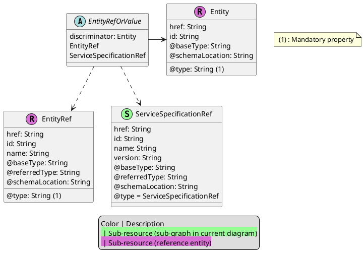
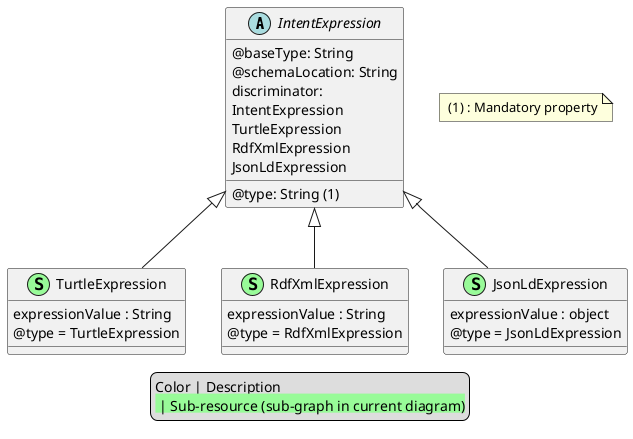
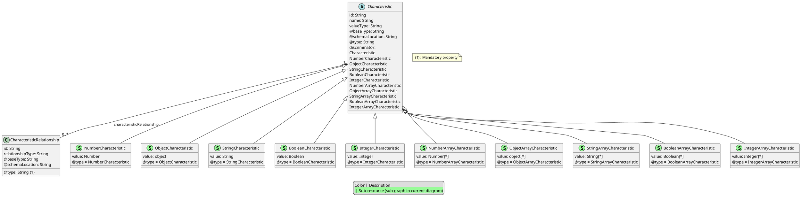
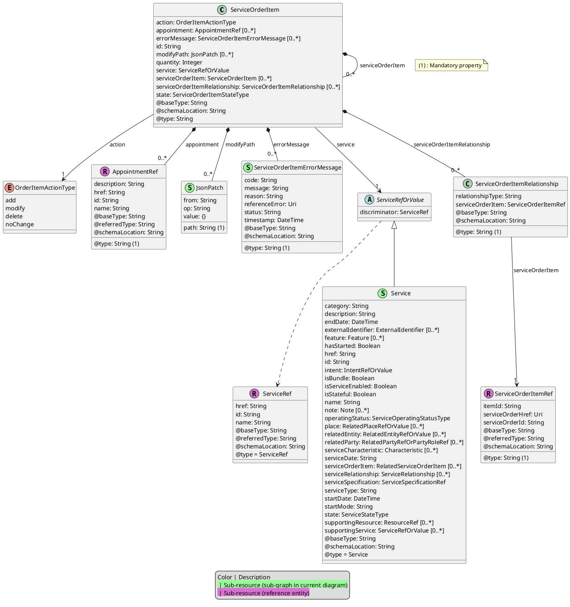
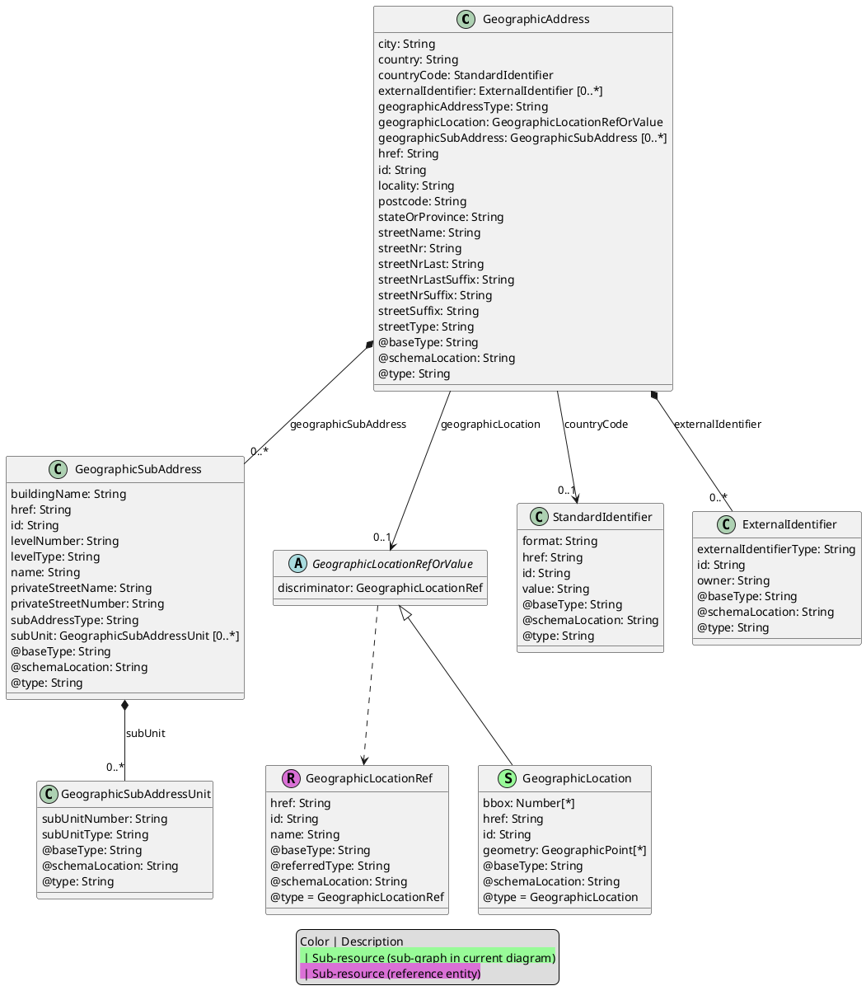
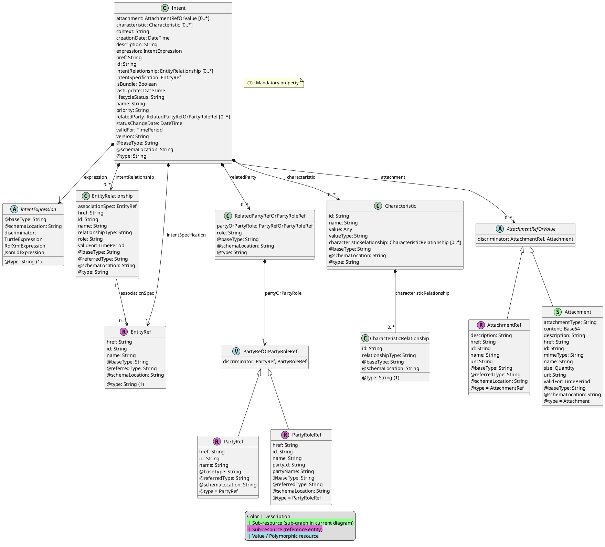
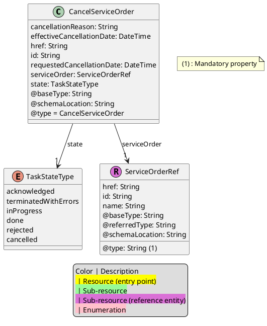
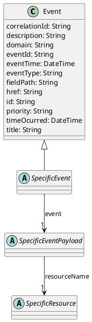

[Image: TM Forum logo]

**TM Forum Specification**

# ServiceOrdering

|                       |                     |
| :-------------------- | :------------------ |
| **Maturity Level:**   | TBD                 |
| **Release Status:** | TBD                 |
| **Version TBD**       |                     |
| **Team Approved Date:** | TBD                 |
| **Approval Status:**  | TBD                 |
| **IPR Mode:**         | RAND                |

**TMF641**
© TM Forum 2024. All Rights Reserved.

---

[Image: TM Forum logo]

## NOTICE

Copyright © TM Forum 2024. All Rights Reserved.

This document and translations of it may be copied and furnished to others, and derivative works that comment on or otherwise explain it or assist in its implementation may be prepared, copied, published, and distributed, in whole or in part, without restriction of any kind, provided that the above copyright notice and this section are included on all such copies and derivative works. However, this document itself may not be modified in any way, including by removing the copyright notice or references to TM FORUM, except as needed for the purpose of developing any document or deliverable produced by a TM FORUM Collaboration Project Team (in which case the rules applicable to copyrights, as set forth in the TM FORUM IPR Policy, must be followed) or as required to translate it into languages other than English.

The limited permissions granted above are perpetual and will not be revoked by TM FORUM or its successors or assigns.

This document and the information contained herein is provided on an "AS IS" basis and TM FORUM DISCLAIMS ALL WARRANTIES, EXPRESS OR IMPLIED, INCLUDING BUT NOT LIMITED TO ANY WARRANTY THAT THE USE OF THE INFORMATION HEREIN WILL NOT INFRINGE ANY OWNERSHIP RIGHTS OR ANY IMPLIED WARRANTIES OF MERCHANTABILITY OR FITNESS FOR A PARTICULAR PURPOSE.

Direct inquiries to the TM Forum office:

181 New Road, Suite 304
Parsippany, NJ 07054, USA
Tel No. +1 862 227 1648
TM Forum Web Page: www.tmforum.org

**ServiceOrdering**
© TM Forum 2024. All Rights Reserved. Page i

---

[Image: TM Forum logo]

## Table of Contents

*   NOTICE . . . . . . . . . . . . . . . . . . . . . . . . . . . . . . . . . . . . . . . . . . . . . . . . . . . . . . . . . . . . . . . . . . i
*   Introduction . . . . . . . . . . . . . . . . . . . . . . . . . . . . . . . . . . . . . . . . . . . . . . . . . . . . . . . . . . . . . . . 1
*   Sample Use Cases . . . . . . . . . . . . . . . . . . . . . . . . . . . . . . . . . . . . . . . . . . . . . . . . . . . . . . . . . 2
    *   Service Order Life Cycle . . . . . . . . . . . . . . . . . . . . . . . . . . . . . . . . . . . . . . . . . . . . . . . . . . . 2
    *   Cancel Service Order Life Cycle . . . . . . . . . . . . . . . . . . . . . . . . . . . . . . . . . . . . . . . . . . . . 3
*   Support of polymorphism and extension patterns. . . . . . . . . . . . . . . . . . . . . . . . . . . . . . . . . . 5
*   RESOURCE MODEL . . . . . . . . . . . . . . . . . . . . . . . . . . . . . . . . . . . . . . . . . . . . . . . . . . . . . . . 6
    *   Managed Entity and Task Resource Models. . . . . . . . . . . . . . . . . . . . . . . . . . . . . . . . . . . . 6
        *   ServiceOrder resource . . . . . . . . . . . . . . . . . . . . . . . . . . . . . . . . . . . . . . . . . . . . . . . . . . 6
        *   CancelServiceOrder resource. . . . . . . . . . . . . . . . . . . . . . . . . . . . . . . . . . . . . . . . . . . 41
    *   Notification Resource Models . . . . . . . . . . . . . . . . . . . . . . . . . . . . . . . . . . . . . . . . . . . . . . 43
        *   Service Order Delete Event. . . . . . . . . . . . . . . . . . . . . . . . . . . . . . . . . . . . . . . . . . . . . . 44
        *   Service Order Milestone Event . . . . . . . . . . . . . . . . . . . . . . . . . . . . . . . . . . . . . . . . . . 45
        *   Service Order Attribute Value Change Event . . . . . . . . . . . . . . . . . . . . . . . . . . . . . . . . 47
        *   Service Order State Change Event. . . . . . . . . . . . . . . . . . . . . . . . . . . . . . . . . . . . . . . . 48
        *   Service Order Jeopardy Event . . . . . . . . . . . . . . . . . . . . . . . . . . . . . . . . . . . . . . . . . . . 49
        *   Service Order Information Required Event . . . . . . . . . . . . . . . . . . . . . . . . . . . . . . . . . 51
        *   Service Order Create Event . . . . . . . . . . . . . . . . . . . . . . . . . . . . . . . . . . . . . . . . . . . . . 52
        *   Cancel Service Order Information Required Event . . . . . . . . . . . . . . . . . . . . . . . . . . . . 55
        *   Cancel Service Order Create Event . . . . . . . . . . . . . . . . . . . . . . . . . . . . . . . . . . . . . . . 56
        *   Cancel Service Order State Change Event. . . . . . . . . . . . . . . . . . . . . . . . . . . . . . . . . . 56
*   API OPERATIONS . . . . . . . . . . . . . . . . . . . . . . . . . . . . . . . . . . . . . . . . . . . . . . . . . . . . . . . . 58
    *   Operations on ServiceOrder . . . . . . . . . . . . . . . . . . . . . . . . . . . . . . . . . . . . . . . . . . . . . . . 58
        *   List or find ServiceOrder objects . . . . . . . . . . . . . . . . . . . . . . . . . . . . . . . . . . . . . . . . . 58
        *   Retrieves a ServiceOrder by ID. . . . . . . . . . . . . . . . . . . . . . . . . . . . . . . . . . . . . . . . . . 62
        *   Creates a ServiceOrder. . . . . . . . . . . . . . . . . . . . . . . . . . . . . . . . . . . . . . . . . . . . . . . . 65
        *   Updates partially a ServiceOrder . . . . . . . . . . . . . . . . . . . . . . . . . . . . . . . . . . . . . . . . 75
        *   Deletes a ServiceOrder. . . . . . . . . . . . . . . . . . . . . . . . . . . . . . . . . . . . . . . . . . . . . . . . 91
    *   Operations on CancelServiceOrder . . . . . . . . . . . . . . . . . . . . . . . . . . . . . . . . . . . . . . . . . 91
        *   Retrieves a CancelServiceOrder by ID . . . . . . . . . . . . . . . . . . . . . . . . . . . . . . . . . . . . . 91
        *   List or find CancelServiceOrder objects . . . . . . . . . . . . . . . . . . . . . . . . . . . . . . . . . . . 92
        *   Creates a CancelServiceOrder . . . . . . . . . . . . . . . . . . . . . . . . . . . . . . . . . . . . . . . . . . 94
*   API NOTIFICATIONS . . . . . . . . . . . . . . . . . . . . . . . . . . . . . . . . . . . . . . . . . . . . . . . . . . . . . . 96
    *   Register listener . . . . . . . . . . . . . . . . . . . . . . . . . . . . . . . . . . . . . . . . . . . . . . . . . . . . . . . . 96
    *   Unregister listener . . . . . . . . . . . . . . . . . . . . . . . . . . . . . . . . . . . . . . . . . . . . . . . . . . . . . . . 97
    *   Publish Event to listener . . . . . . . . . . . . . . . . . . . . . . . . . . . . . . . . . . . . . . . . . . . . . . . . . . 97
*   Acknowledgements . . . . . . . . . . . . . . . . . . . . . . . . . . . . . . . . . . . . . . . . . . . . . . . . . . . . . . . . 99
*   Release History. . . . . . . . . . . . . . . . . . . . . . . . . . . . . . . . . . . . . . . . . . . . . . . . . . . . . . . . . 99
*   Contributors to Document . . . . . . . . . . . . . . . . . . . . . . . . . . . . . . . . . . . . . . . . . . . . . . . . . 99

**ServiceOrdering**
© TM Forum 2024. All Rights Reserved. Page ii

---

[Image: TM Forum logo]

## Introduction

The following document is the user guide of the REST API for Service Ordering Management. It includes the model definition as well as all available operations. Possible actions are creating, updating and retrieving Service Orders (including filtering). The specification covers also a task-based resource to request Service Order Cancellation.
The following Assumptions were considered in the development of this document:

*   The Order Management system has access to a catalog system
*   A service order will describe a list of service order items
*   A service order item references an action on an existing or future service
*   The API supports ordering for both Customer-Facing Service (CFS) and Resource Facing Service (RFS)

From a component perspective, a service order should be available

*   from a Service Orchestration Component (and it could mix CFS and RFS)
*   from an Infrastructure Control & Management component (and it would have only RFS)

Service ordering API performs the following operations:

….on Service Order: \* Retrieval of a service order or a collection of service orders depending on filter criteria \* Partial update of a service order (including updating rules) \* Creation of a service order (including default values and creation rules) \* Deletion of service order (for administration purposes) \* Notification of events on service order:
**service order creation**
**service order deletion**
**service order state change**
**service order value change** used to notify that any data in an order has just changed
\*\* **service order information required** used to notify that some data in the order need to be filled / are missing

…..on CancelServiceOrder: \* Retrieval of a service order cancellation request or a collection of service order cancellation requests depending on filter criteria \* Creation of a service order cancellation request \* Notification of events on service order cancellation: **cancel service Order creation** cancel service Order state change \*\* order information required used to notify that some data in the cancel service order need to be filled / are missing

**ServiceOrdering**
© TM Forum 2024. All Rights Reserved. Page 1

---

[Image: TM Forum logo]

## Sample Use Cases

We illustrate in this document a multi-items service order covering use-cases:

1.  Creation of a very simplified CPE illustrating an object characteristic
2.  Modification of an existing service to change a characteristic value and a supporting resource
3.  Creation of a service with feature
4.  Modification of a service order item to switch to inactive an existing service

The document also provides an example to a service order cancellation request.

### Service Order Life Cycle

```plantuml
@startuml
[*] --> Acknowledged : Start Order
Acknowledged --> InProgress : Order passed business validation
Acknowledged --> Rejected : Order failed business validation / Cancellation requested / Order cancellation denied
InProgress --> Pending : Waiting Information / Access Seeker action required
InProgress --> AssessingCancellation : Cancellation requested
InProgress --> Held : Infrastructure shortfall / \nWaiting resource provisioning
InProgress --> Completed : Order Item provisioned successfully
InProgress --> Failed : Order Item provisioning failed
Pending --> InProgress : Information provided / \nAccess Seeker action done
Pending --> AssessingCancellation : Cancellation requested
Pending --> Cancelled : Auto cancellation (timeout)
Held --> InProgress : Issue resolved
Held --> AssessingCancellation : Cancellation requested
AssessingCancellation --> PendingCancellation : Cancellation request accepted
AssessingCancellation --> InProgress : Order cancellation denied
AssessingCancellation --> Held : Order cancellation denied
AssessingCancellation --> Pending : Order cancellation denied
PendingCancellation --> Cancelled : Cancellation done
Rejected --> [*] : Final
Completed --> [*] : Final
Failed --> [*] : Final
Cancelled --> [*] : Final
Partial : Some items succeeded, some failed
InProgress --> Partial
Pending --> Partial
Held --> Partial
Partial --> [*] : Final

state Acknowledged {
  description
  The Acknowledged state is when an order/item
  has been received and has passed surface
  message validation.
  end description
}
state Rejected {
  description
  The Rejected state is where:
  * Invalid information is provided
  * The order request fails to meet business rules
  If an order item is rejected the complete service order is rejected.
  end description
}
state InProgress {
  description
  The In Progress state is where an order Item
  has passed the Order check successfully and
  service delivery has started.
  For the order at least one order item is inProgress.
  end description
}
state Pending {
  description
  The Pending state is used when an order/item
  is currently in a waiting stage for an action/activity
  to be completed before the order/item can progress further.
  An “information required” notification will be issued.
  A pending stage can lead into auto cancellation.
  end description
}
state Held {
  description
  The Held state is used when an order/item cannot
  be progressed due to an issue. Service provider
  has temporarily delayed completing an order/item.
  Upon resolution of the issue, the order/item will
  continue to progress.
  end description
}
state AssessingCancellation {
  description
  Following a cancel request, the SP is assessing
  if cancel can be done for the order/item.
  If cancellation request is not accepted the order
  will return in Held or Pending or InProgress state.
  end description
}
state PendingCancellation {
  description
  Once a cancel order has been accepted by SP,
  it could take time to effectively cancel the order/item.
  During this time we use Pending Cancellation.
  end description
}
state Cancelled {
  description
  The Cancelled state is where an In-Flight Order/item
  has been successfully cancelled.
  end description
}
state Completed {
  description
  The Completed state is where an item has complete
  provision and the service is now active.
  For an order if all order items are completed.
  end description
}
state Failed {
  description
  Order item has not a successful delivery completion.
  The service is not delivered and the order item failed.
  All Order items have failed which results in the
  entire Order has Failed.
  end description
}
state Partial {
  description
  Some Order items have failed and some have succeeded
  so the entire Order is in a Partial state.
  This provides support for partial Failure of an Order.
  end description
}

@enduml
```

The following table provides service order state and service order item state description:

| State       | Definition                                                                                                                                                                                                                                                                                                                                                                                         |
| :---------- | :------------------------------------------------------------------------------------------------------------------------------------------------------------------------------------------------------------------------------------------------------------------------------------------------------------------------------------------------------------------------------------------------- |
| Acknowledged | The Acknowledged state is when an order/item has been received and has passed surface message validation.                                                                                                                                                                                                                                                                                        |
| Rejected    | The Rejected state is where: • Invalid information is provided through the order request (not checked synchronously – like check that a service id provided exist in the inventory and relation service order item action is valid) • The order request fails to meet business rules for ordering Same rules applied for order item. If an order item is rejected the complete service order is rejected. |

**ServiceOrdering**
© TM Forum 2024. All Rights Reserved. Page 2

---

[Image: TM Forum logo]

| State                | Definition                                                                                                                                                                                                                                                                               |
| :------------------- | :--------------------------------------------------------------------------------------------------------------------------------------------------------------------------------------------------------------------------------------------------------------------------------------- |
| Pending              | The Pending state is used when an order/item is currently in a waiting stage for an action/activity to be completed before the order/item can progress further, pending order amend or cancel assessment. In situations where Access Seeker action is required, an “information required” notification will be issued on transition into this state. A pending stage can lead into auto cancellation of an order/item, if no action is taken. |
| InProgress           | The In Progress state is where an order Item has passed the Order check successfully and service delivery has started. For the order at least one order item is inProgress                                                                                                                    |
| Held                 | The Held state is used when an order/item cannot be progressed due to an issue. Service provided has temporarily delayed completing an order/item to resolve an infrastructure shortfall to facilitate supply of order. Upon resolution of the issue, the order/item will continue to progress.     |
| AssessingCancellation | Following a cancel request, the SP is assessing if cancel can be done for the order/item (or if the Service Order has reached PONR). If cancellation request is not accepted after assessment the order will return in Held or Pending or InProgress state.                                       |
| PendingCancellation  | Once a cancel order has been accepted by SP, it could in some UC take time to effectively cancel the order/item. During this time when accepted cancellation is effectively processed we use Pending Cancellation.                                                                           |
| Cancelled            | The Cancelled state is where an In-Flight Order/item has been successfully cancelled.                                                                                                                                                                                                        |
| Completed            | The Completed state is where an item has complete provision and the service is now active. For an order if all order items are completed.                                                                                                                                                      |
| Failed               | Order item as not a successful delivery completion. The service is not delivered and the order item failed. All Order items have failed which results in the entire Order has Failed.                                                                                                         |
| Partial              | Some Order items have failed and some have succeeded so the entire Order is in a Partial state. This provides support for partial Failure of an Order (or a service order item with ‘embedded’ service order item).                                                                          |

### Cancel Service Order Life Cycle

**ServiceOrdering**
© TM Forum 2024. All Rights Reserved. Page 3

---

[Image: TM Forum logo]

```plantuml
@startuml
[*] --> acknowledged : EntryPoint
acknowledged --> inProgress
inProgress --> done
inProgress --> terminatedWithErrors
terminatedWithErrors --> [*] : Final
done --> [*] : Final

state acknowledged {
 description
 The acknowledged state is where a cancellation
 request has been received and has passed
 message and basic business validations.
 end description
}

state inProgress {
 description
 The In Progress state is when the cancel request
 is currently in the hands of the SP sales team to
 assess customer cancel request.
 end description
}

state terminatedWithErrors {
 description
 The Cancellation Request could not be correctly
 completed by SP sales team. Cancel result is not
 available.
 end description
}

state done {
 description
 Cancellation request has been assessed and
 result available.
 end description
}
@enduml
```

| State                | Definition                                                                                                                          |
| :------------------- | :---------------------------------------------------------------------------------------------------------------------------------- |
| Acknowledged         | The acknowledged state is where a cancellation request has been received and has passed message and basic business validations.   |
| InProgress           | The In Progress state is when the cancel request is currently in the hands of the SP sales team to assess customer cancel request. |
| TerminatedWithErrors | The Cancellation Request could not be correctly completed by SP sales team. Cancel result is not available.                         |
| Done                 | Cancellation request has been assessed and result available.                                                                        |

**ServiceOrdering**
© TM Forum 2024. All Rights Reserved. Page 4

---

[Image: TM Forum logo]

## Support of polymorphism and extension patterns

Support of polymorphic collections and types and schema based extension is provided by means of a list of generic meta-attributes that we describe below. Polymorphism in collections occurs when entities inherit from base entities, for instance a TypeAServiceOrder and TypeBServiceOrder inheriting properties from the abstract Account entity.

Generic support of polymorphism and pattern extensions is described in the TMF API Guidelines v5.0 Part 2 document.

The `@type` attribute provides a way to represent the actual class type of an entity. For example, within a list of ServiceOrder instances some may be instances of TypeAServiceOrder where other could be instances of TypeBServiceOrder. The `@type` gives this information. All resources and sub-resources of this API have a `@type` attributes that can be provided when this is useful.

The `@referredType` can be used within reference entities (like for instance an RelatedParty object) to explicitly denote the actual entity type of the referred class. Notice that in reference entities the `@type`, when used, denotes the class type of the reference itself, such as ServiceOrderItemRef or AppointmentRef, and not the class type of the referred object. However, since reference classes are rarely sub-classed, `@type` is generally not useful in reference objects.

The `@schemaLocation` property can be used in resources to allow specifying user-defined properties of an Entity or to specify the expected characteristics of an entity.

The `@baseType` attribute gives a way to provide explicitly the base of class of a given resource that has been extended.

**ServiceOrdering**
© TM Forum 2024. All Rights Reserved. Page 5

---

[Image: TM Forum logo]

## RESOURCE MODEL

### Managed Entity and Task Resource Models

#### ServiceOrder resource

##### Resource model



```plantuml
@startuml

class ServiceOrder {
  cancellationDate: DateTime
  cancellationReason: String
  category: String
  completionDate: DateTime
  description: String
  errorMessage: ServiceOrderErrorMessage [0..*]
  expectedCompletionDate: DateTime
  externalReference: ExternalReference [0..*]
  href: String
  id: String
  jeopardyAlert: ServiceOrderJeopardyAlert [0..*]
  milestone: ServiceOrderMilestone [0..*]
  note: Note [0..*]
  notificationContact: String
  orderCharacteristic: Characteristic [0..*]
  orderDate: DateTime
  orderRelationship: ServiceOrderRelationship [0..*]
  orderSpecification: OrderSpecificationRef
  priority: String
  relatedParty: RelatedPartyRefOrPartyRoleRef [0..*]
  requestedCompletionDate: DateTime
  requestedStartDate: DateTime
  serviceOrderItem: ServiceOrderItem [1..*]
  startDate: DateTime
  state: ServiceOrderStateType
  @baseType: String
  @schemaLocation: String
  @type: String
}

class ServiceOrderItem {
  action: OrderItemActionType
  appointment: AppointmentRef [0..*]
  errorMessage: ServiceOrderItemErrorMessage [0..*]
  id: String
  modifyPath: JsonPatch [0..*]
  quantity: Integer
  service: ServiceRefOrValue
  serviceOrderItem: ServiceOrderItem [0..*]
  serviceOrderItemRelationship: ServiceOrderItemRelationship [0..*]
  state: ServiceOrderItemStateType
  @baseType: String
  @schemaLocation: String
  @type: String
}

class ServiceOrderRelationship {
  href: String
  id: String
  name: String
  relationshipType: String
  validFor: TimePeriod
  @baseType: String
  @referredType: String
  @schemaLocation: String
  @type: String
}

class RelatedPartyRefOrPartyRoleRef {
  partyOrPartyRole: PartyRefOrPartyRoleRef
  role: String
  @baseType: String
  @schemaLocation: String
  @type: String
}

class Note {
  author: String
  date: DateTime
  id: String
  text: String
  @baseType: String
  @schemaLocation: String
  @type: String
}

class ServiceOrderMilestone {
  description: String
  id: String
  message: String
  milestoneDate: DateTime
  name: String
  status: String
  @baseType: String
  @schemaLocation: String
  @type: String
}

class Characteristic {
 id: String
 name: String
 value: Any
 valueType: String
 characteristicRelationship: CharacteristicRelationship [0..*]
 @baseType: String
 @schemaLocation: String
 @type: String
}

class ExternalReference {
  externalReferenceType: String
  href: String
  id: String
  name: String
  @baseType: String
  @schemaLocation: String
  @type: String
}

class OrderSpecificationRef {
  href: String
  id: String
  name: String
  version: String
  @baseType: String
  @referredType: String
  @schemaLocation: String
  @type: String
}

enum ServiceOrderStateType {
  acknowledged
  rejected
  pending
  held
  inProgress
  cancelled
  completed
  failed
  partial
  assessingCancellation
  pendingCancellation
}

class ServiceOrderErrorMessage {
 code: String
 message: String
 reason: String
 referenceError: Uri
 serviceOrderItem: ServiceOrderItemRef [0..*]
 status: String
 timestamp: DateTime
 @baseType: String
 @schemaLocation: String
 @type: String
}

class ServiceOrderJeopardyAlert {
 alertDate: DateTime
 exception: String
 id: String
 jeopardyType: String
 message: String
 name: String
 serviceOrderItem: ServiceOrderItemRef [0..*]
 @baseType: String
 @schemaLocation: String
 @type: String
}

ServiceOrder "1" *-- "1..*" ServiceOrderItem : serviceOrderItem
ServiceOrder "1" *-- "0..*" ServiceOrderRelationship : orderRelationship
ServiceOrder "1" *-- "0..*" RelatedPartyRefOrPartyRoleRef : relatedParty
ServiceOrder "1" *-- "0..*" Note : note
ServiceOrder "1" *-- "0..*" ServiceOrderMilestone : milestone
ServiceOrder "1" *-- "0..*" Characteristic : orderCharacteristic
ServiceOrder "1" *-- "0..*" ExternalReference : externalReference
ServiceOrder "1" --> "0..1" OrderSpecificationRef : orderSpecification
ServiceOrder "1" --> "1" ServiceOrderStateType : state
ServiceOrder "1" *-- "0..*" ServiceOrderErrorMessage : errorMessage
ServiceOrder "1" *-- "0..*" ServiceOrderJeopardyAlert : jeopardyAlert
ServiceOrderMilestone "1" *-- "0..*" ServiceOrderItemRef : serviceOrderItem
ServiceOrderJeopardyAlert "1" *-- "0..*" ServiceOrderItemRef : serviceOrderItem
ServiceOrderErrorMessage "1" *-- "0..*" ServiceOrderItemRef : serviceOrderItem

@enduml
```

**Figure 1 - ServiceOrder**

**ServiceOrdering**
© TM Forum 2024. All Rights Reserved. Page 6

---

[Image: TM Forum logo]



| Color        | Description                                   |
| :----------- | :-------------------------------------------- |
| `palegreen`  | Sub-resource (sub-graph in current diagram) |
| `orchid`     | Sub-resource (reference entity)             |
| (1)          | Mandatory property                            |

**Figure 2 - EntityRefOrValue**

**ServiceOrdering**
© TM Forum 2024. All Rights Reserved. Page 7

---

[Image: TM Forum logo]



**Figure 3 - IntentExpression**



**Figure 4 - Characteristic**

**ServiceOrdering**
© TM Forum 2024. All Rights Reserved. Page 8

---

[Image: TM Forum logo]



**Figure 5 - ServiceOrderItem**

**ServiceOrdering**
© TM Forum 2024. All Rights Reserved. Page 9

---

[Image: TM Forum logo]



**Figure 6 - GeographicAddress**

**ServiceOrdering**
© TM Forum 2024. All Rights Reserved. Page 10

---

[Image: TM Forum logo]



**Figure 7 - Intent**

**ServiceOrdering**
© TM Forum 2024. All Rights Reserved. Page 11

---

[Image: TM Forum logo]



```plantuml
@startuml

class Service {
 category: String
 description: String
 endDate: DateTime
 externalIdentifier: ExternalIdentifier [0..*]
 feature: Feature [0..*]
 hasStarted: Boolean
 href: String
 id: String
 intent: IntentRefOrValue
 isBundle: Boolean
 isServiceEnabled: Boolean
 isStateful: Boolean
 name: String
 note: Note [0..*]
 operatingStatus: ServiceOperatingStatusType
 place: RelatedPlaceRefOrValue [0..*]
 relatedEntity: RelatedEntityRefOrValue [0..*]
 relatedParty: RelatedPartyRefOrPartyRoleRef [0..*]
 serviceCharacteristic: Characteristic [0..*]
 serviceDate: String
 serviceOrderItem: RelatedServiceOrderItem [0..*]
 serviceRelationship: ServiceRelationship [0..*]
 serviceSpecification: ServiceSpecificationRef
 serviceType: String
 startDate: DateTime
 startMode: String
 state: ServiceStateType
 supportingResource: ResourceRef [0..*]
 supportingService: ServiceRefOrValue [0..*]
 @baseType: String
 @schemaLocation: String
 @type = Service
}

class ExternalIdentifier {
 externalIdentifierType: String
 id: String
 owner: String
 @baseType: String
 @schemaLocation: String
 @type: String
}

class Feature {
 featureCharacteristic: Characteristic [0..*]
 featureRelationship: FeatureRelationship [0..*]
 id: String
 isBundle: Boolean
 isEnabled: Boolean
 name: String
 policyConstraint: PolicyRef [0..*]
 @baseType: String
 @schemaLocation: String
 @type: String
}

abstract class IntentRefOrValue {
 discriminator: IntentRef, Intent
}
Service *--> "0..1" IntentRefOrValue : intent

class IntentRef <<(R,orchid)>> {
 href: String
 id: String
 name: String
 @baseType: String
 @referredType: String
 @schemaLocation: String
 @type = IntentRef
}
IntentRefOrValue <|-- IntentRef

class Note {
 author: String
 date: DateTime
 id: String
 text: String
 @baseType: String
 @schemaLocation: String
 @type: String
}

class RelatedPlaceRefOrValue {
 place: PlaceRefOrValue
 role: String
 @baseType: String
 @schemaLocation: String
 @type: String
}

abstract class PlaceRefOrValue {
 discriminator: PlaceRef, Place
}
RelatedPlaceRefOrValue *--> "1" PlaceRefOrValue : place

class PlaceRef <<(R,orchid)>> {
 href: String
 id: String
 name: String
 @baseType: String
 @referredType: String
 @schemaLocation: String
 @type = PlaceRef
}
PlaceRefOrValue <|-- PlaceRef

class RelatedEntityRefOrValue {
 entity: EntityRefOrValue
 role: String
 @baseType: String
 @schemaLocation: String
 @type: String
}

class RelatedPartyRefOrPartyRoleRef {
 partyOrPartyRole: PartyRefOrPartyRoleRef
 role: String
 @baseType: String
 @schemaLocation: String
 @type: String
}

class Characteristic {
 id: String
 name: String
 value: Any
 valueType: String
 characteristicRelationship: CharacteristicRelationship [0..*]
 @baseType: String
 @schemaLocation: String
 @type: String
}

class RelatedServiceOrderItem {
 itemAction: OrderItemActionType
 itemId: String
 role: String
 serviceOrderHref: String
 serviceOrderId: String
 @baseType: String
 @referredType: String
 @schemaLocation: String
 @type: String
}

class ServiceRelationship {
 relationshipType: String
 service: ServiceRefOrValue
 serviceRelationshipCharacteristic: Characteristic [0..*]
 @baseType: String
 @schemaLocation: String
 @type: String
}

class ServiceSpecificationRef {
 href: String
 id: String
 name: String
 version: String
 @baseType: String
 @referredType: String
 @schemaLocation: String
 @type = ServiceSpecificationRef
}

enum ServiceStateType {
 feasibilityChecked
 designed
 reserved
 inactive
 active
 terminated
}

enum ServiceOperatingStatusType {
 planned
 active
 inactive
}

class ResourceRef <<(R,orchid)>> {
 href: String
 id: String
 name: String
 @baseType: String
 @referredType: String
 @schemaLocation: String
 @type = ResourceRef
}

abstract class ServiceRefOrValue {
 discriminator: ServiceRef, Service
}
Service *--> "0..*" ServiceRefOrValue : supportingService

class ServiceRef <<(R,orchid)>> {
 href: String
 id: String
 name: String
 @baseType: String
 @referredType: String
 @schemaLocation: String
 @type = ServiceRef
}
ServiceRefOrValue <|-- ServiceRef

Service *--> "0..*" ExternalIdentifier : externalIdentifier
Service *--> "0..*" Feature : feature
Service *--> "0..*" Note : note
Service *--> "0..*" RelatedPlaceRefOrValue : place
Service *--> "0..*" RelatedEntityRefOrValue : relatedEntity
Service *--> "0..*" RelatedPartyRefOrPartyRoleRef : relatedParty
Service *--> "0..*" Characteristic : serviceCharacteristic
Service *--> "0..*" RelatedServiceOrderItem : serviceOrderItem
Service *--> "0..*" ServiceRelationship : serviceRelationship
Service *--> "1" ServiceSpecificationRef : serviceSpecification
Service *--> "0..*" ResourceRef : supportingResource
Service *--> "1" ServiceStateType : state
Service *--> "1" ServiceOperatingStatusType : operatingStatus

Feature *--> "0..*" Characteristic : featureCharacteristic
Feature *--> "0..*" FeatureRelationship : featureRelationship
Feature *--> "0..*" PolicyRef : policyConstraint
ServiceRelationship *--> "1" ServiceRefOrValue : service
ServiceRelationship *--> "0..*" Characteristic : serviceRelationshipCharacteristic
RelatedEntityRefOrValue *--> "1" EntityRefOrValue : entity
RelatedPartyRefOrPartyRoleRef *--> "1" PartyRefOrPartyRoleRef : partyOrPartyRole

@enduml
```

**Figure 8 - Service**

### Field descriptions

#### ServiceOrder fields

| Field                    | Description                                                                                                                                |
| :----------------------- | :----------------------------------------------------------------------------------------------------------------------------------------- |
| cancellationDate         | A DateTime. Date when the order is cancelled. This is used when order is cancelled.                                                         |
| cancellationReason       | A String. Reason why the order is cancelled. This is used when order is cancelled.                                                           |
| category                 | A String. Used to categorize the order, useful for the OM system, such as: Broadband, TVOption.                                           |
| completionDate           | A DateTime. Effective delivery date amended by the provider.                                                                               |
| description              | A String. A free-text description of the service order.                                                                                    |
| errorMessage             | A ServiceOrderErrorMessage. A ServiceOrderErrorMessage represents an error that causes a status change in a service order.                  |
| expectedCompletionDate   | A DateTime. Expected delivery date amended by the provider.                                                                                |
| externalReference        | An ExternalReference. External reference of the individual or reference in other system.                                                      |
| href                     | A String. Hyperlink reference.                                                                                                             |
| id                       | A String. Unique identifier.                                                                                                               |
| jeopardyAlert            | A ServiceOrderJeopardyAlert. A list of jeopardy alerts related to this order.                                                               |

**ServiceOrdering**
© TM Forum 2024. All Rights Reserved. Page 12

---

[Image: TM Forum logo]

| Field                    | Description                                                                                                                                |
| :----------------------- | :----------------------------------------------------------------------------------------------------------------------------------------- |
| milestone                | A ServiceOrderMilestone. A list of milestones related to this order.                                                                        |
| note                     | A Note. Extra-information about the order; e.g. useful to add extra delivery information that could be useful for a human process.        |
| notificationContact      | A String. Contact attached to the order to send back information regarding this order.                                                       |
| orderCharacteristic      | A Characteristic. A list of characteristics that characterize this order.                                                                     |
| orderDate                | A DateTime.                                                                                                                                |
| orderRelationship        | A ServiceOrderRelationship. A list of service orders related to this order (e.g. prerequisite, dependent on).                                |
| orderSpecification       | An OrderSpecificationRef. Order specification reference.                                                                                   |
| priority                 | A String. Can be used by consumers to prioritize orders in a Service Order Management system.                                              |
| relatedParty             | A RelatedPartyRefOrPartyRoleRef. A list of parties which are involved in this order and the role they are playing.                          |
| requestedCompletionDate  | A DateTime. Requested delivery date from the requestors perspective.                                                                         |
| requestedStartDate       | A DateTime. Order start date wished by the requestor.                                                                                      |
| serviceOrderItem         | A ServiceOrderItem. A list of service order items to be processed by this order.                                                             |
| startDate                | A DateTime. Date when the order was started for processing.                                                                                |
| state                    | A ServiceOrderStateType. Possible values for the state of the order.                                                                        |
| @baseType                | A String. When sub-classing, this defines the super-class.                                                                                |
| @schemaLocation          | A String. A URI to a JSON-Schema file that defines additional attributes and relationships.                                                  |
| @type                    | A String. When sub-classing, this defines the sub-class Extensible name.                                                                   |

#### AppointmentRef sub-resource fields

| Field          | Description                                                                                           |
| :------------- | :---------------------------------------------------------------------------------------------------- |
| description    | A String. An explanatory text regarding the appointment made with a party.                            |
| href           | A String. Hyperlink reference.                                                                        |
| id             | A String. Unique identifier.                                                                          |
| name           | A String. Name of the referred entity.                                                                |
| @baseType      | A String. When sub-classing, this defines the super-class.                                            |
| @referredType  | A String. The actual type of the target instance when needed for disambiguation.                       |

**ServiceOrdering**
© TM Forum 2024. All Rights Reserved. Page 13

---

[Image: TM Forum logo]

| Field            | Description                                                                                 |
| :--------------- | :------------------------------------------------------------------------------------------ |
| @schemaLocation  | A String. A URI to a JSON-Schema file that defines additional attributes and relationships. |
| @type            | A String. When sub-classing, this defines the sub-class Extensible name.                    |

#### Attachment sub-resource fields

| Field            | Description                                                                                                                    |
| :--------------- | :----------------------------------------------------------------------------------------------------------------------------- |
| attachmentType   | A String. A business characterization of the purpose of the attachment, for example logo, instructionManual, contractCopy.       |
| content          | A Base64. The actual contents of the attachment object, if embedded, encoded as base64.                                       |
| description      | A String. A narrative text describing the content of the attachment.                                                           |
| href             | A String. Hyperlink reference.                                                                                                 |
| id               | A String. Unique identifier.                                                                                                   |
| mimeType         | A String. A technical characterization of the attachment content format using IETF Mime Types.                                   |
| name             | A String. The name of the attachment.                                                                                          |
| size             | A Quantity. An amount in a given unit.                                                                                         |
| url              | A String. Uniform Resource Locator, is a web page address (a subset of URI).                                                    |
| validFor         | A TimePeriod. A period of time, either as a deadline (endDateTime only) a startDateTime only, or both.                           |
| @baseType        | A String. When sub-classing, this defines the super-class.                                                                    |
| @schemaLocation  | A String. A URI to a JSON-Schema file that defines additional attributes and relationships.                                      |
| @type            | A String. When sub-classing, this defines the sub-class Extensible name.                                                        |

#### AttachmentRef sub-resource fields

| Field            | Description                                                                                           |
| :--------------- | :---------------------------------------------------------------------------------------------------- |
| description      | A String. A narrative text describing the content of the attachment.                                  |
| href             | A String. Hyperlink reference.                                                                        |
| id               | A String. Unique identifier.                                                                          |
| name             | A String. Name of the referred entity.                                                                |
| url              | A String. Link to the attachment media/content.                                                       |
| @baseType        | A String. When sub-classing, this defines the super-class.                                            |
| @referredType    | A String. The actual type of the target instance when needed for disambiguation.                       |
| @schemaLocation  | A String. A URI to a JSON-Schema file that defines additional attributes and relationships.             |

**ServiceOrdering**
© TM Forum 2024. All Rights Reserved. Page 14

---

[Image: TM Forum logo]

| Field | Description                                                               |
| :---- | :------------------------------------------------------------------------ |
| @type | A String. When sub-classing, this defines the sub-class Extensible name. |

#### BooleanArrayCharacteristic sub-resource fields

| Field                      | Description                                                                                 |
| :------------------------- | :------------------------------------------------------------------------------------------ |
| characteristicRelationship | A CharacteristicRelationship. Another Characteristic that is related to the current Characteristic;. |
| id                         | A String. Unique identifier of the characteristic.                                          |
| name                       | A String. Name of the characteristic.                                                       |
| value                      | A Boolean.                                                                                  |
| valueType                  | A String. Data type of the value of the characteristic.                                     |
| @baseType                  | A String. When sub-classing, this defines the super-class.                                  |
| @schemaLocation            | A String. A URI to a JSON-Schema file that defines additional attributes and relationships. |
| @type                      | A String. When sub-classing, this defines the sub-class Extensible name.                    |

#### BooleanCharacteristic sub-resource fields

| Field                      | Description                                                                                 |
| :------------------------- | :------------------------------------------------------------------------------------------ |
| characteristicRelationship | A CharacteristicRelationship. Another Characteristic that is related to the current Characteristic;. |
| id                         | A String. Unique identifier of the characteristic.                                          |
| name                       | A String. Name of the characteristic.                                                       |
| value                      | A Boolean. Value of the characteristic.                                                     |
| valueType                  | A String. Data type of the value of the characteristic.                                     |
| @baseType                  | A String. When sub-classing, this defines the super-class.                                  |
| @schemaLocation            | A String. A URI to a JSON-Schema file that defines additional attributes and relationships. |
| @type                      | A String. When sub-classing, this defines the sub-class Extensible name.                    |

#### CalendarPeriod sub-resource fields

| Field      | Description                                                                                     |
| :--------- | :---------------------------------------------------------------------------------------------- |
| day        | A String. Day where the calendar status applies (e.g.: monday, mon-to-fri, weekdays, weekend, all week, …). |
| hourPeriod | A HourPeriod.                                                                                   |
| status     | A String. Indication of the availability of the caledar period (e.g.: available, booked, etc.). |
| timeZone   | A String. Indication of the timezone applicable to the calendar information (e.g.: Paris, GMT+1). |
| @baseType  | A String. When sub-classing, this defines the super-class.                                      |

**ServiceOrdering**
© TM Forum 2024. All Rights Reserved. Page 15

---

[Image: TM Forum logo]

| Field            | Description                                                                                 |
| :--------------- | :------------------------------------------------------------------------------------------ |
| @schemaLocation  | A String. A URI to a JSON-Schema file that defines additional attributes and relationships. |
| @type            | A String. When sub-classing, this defines the sub-class Extensible name.                    |

#### Characteristic sub-resource fields

| Field                      | Description                                                                                 |
| :------------------------- | :------------------------------------------------------------------------------------------ |
| characteristicRelationship | A CharacteristicRelationship. Another Characteristic that is related to the current Characteristic;. |
| id                         | A String. Unique identifier of the characteristic.                                          |
| name                       | A String. Name of the characteristic.                                                       |
| valueType                  | A String. Data type of the value of the characteristic.                                     |
| @baseType                  | A String. When sub-classing, this defines the super-class.                                  |
| @schemaLocation            | A String. A URI to a JSON-Schema file that defines additional attributes and relationships. |
| @type                      | A String. When sub-classing, this defines the sub-class Extensible name.                    |

#### CharacteristicRelationship sub-resource fields

| Field            | Description                                                                                 |
| :--------------- | :------------------------------------------------------------------------------------------ |
| id               | A String. Unique identifier of the characteristic.                                          |
| relationshipType | A String. The type of relationship.                                                         |
| @baseType        | A String. When sub-classing, this defines the super-class.                                  |
| @schemaLocation  | A String. A URI to a JSON-Schema file that defines additional attributes and relationships. |
| @type            | A String. When sub-classing, this defines the sub-class Extensible name.                    |

#### Entity sub-resource fields

| Field            | Description                                                                                 |
| :--------------- | :------------------------------------------------------------------------------------------ |
| href             | A String. Hyperlink reference.                                                              |
| id               | A String. Unique identifier.                                                                |
| @baseType        | A String. When sub-classing, this defines the super-class.                                  |
| @schemaLocation  | A String. A URI to a JSON-Schema file that defines additional attributes and relationships. |
| @type            | A String. When sub-classing, this defines the sub-class Extensible name.                    |

#### EntityRef sub-resource fields

| Field | Description                            |
| :---- | :------------------------------------- |
| href  | A String. Hyperlink reference.         |
| id    | A String. Unique identifier.           |
| name  | A String. Name of the referred entity. |

**ServiceOrdering**
© TM Forum 2024. All Rights Reserved. Page 16

---

[Image: TM Forum logo]

| Field            | Description                                                                                           |
| :--------------- | :---------------------------------------------------------------------------------------------------- |
| @baseType        | A String. When sub-classing, this defines the super-class.                                            |
| @referredType    | A String. The actual type of the target instance when needed for disambiguation.                       |
| @schemaLocation  | A String. A URI to a JSON-Schema file that defines additional attributes and relationships.             |
| @type            | A String. When sub-classing, this defines the sub-class Extensible name.                               |

#### EntityRelationship sub-resource fields

| Field            | Description                                                                                           |
| :--------------- | :---------------------------------------------------------------------------------------------------- |
| associationSpec  | An EntityRef. Entity reference schema to be use for all entityRef class.                              |
| href             | A String.                                                                                             |
| id               | A String.                                                                                             |
| name             | A String.                                                                                             |
| relationshipType | A String. Type of relationship such as migration, substitution, dependency, exclusivity.              |
| role             | A String. The association role for this entity.                                                       |
| validFor         | A TimePeriod. A period of time, either as a deadline (endDateTime only) a startDateTime only, or both. |
| @baseType        | A String. When sub-classing, this defines the super-class.                                            |
| @referredType    | A String.                                                                                             |
| @schemaLocation  | A String. A URI to a JSON-Schema file that defines additional attributes and relationships.             |
| @type            | A String.                                                                                             |

#### ErrorMessage sub-resource fields

| Field          | Description                                                                                 |
| :------------- | :------------------------------------------------------------------------------------------ |
| code           | A String. Error code.                                                                       |
| message        | A String. More details and corrective actions related to the error.                         |
| reason         | A String. Explanation of the reason for the error.                                          |
| referenceError | A String. URI of documentation describing the error.                                        |
| status         | A String. Error code extension like sys-ABC-2001.                                           |
| @baseType      | A String. When sub-classing, this defines the super-class.                                  |
| @schemaLocation  | A String. A URI to a JSON-Schema file that defines additional attributes and relationships. |
| @type          | A String. When sub-classing, this defines the sub-class Extensible name.                    |

#### ExternalIdentifier sub-resource fields

**ServiceOrdering**
© TM Forum 2024. All Rights Reserved. Page 17

---

[Image: TM Forum logo]

| Field                  | Description                                                                                 |
| :--------------------- | :------------------------------------------------------------------------------------------ |
| externalIdentifierType | A String. Type of the identification, typically would be the type of the entity within the external system. |
| id                     | A String. Identification of the entity within the external system.                          |
| owner                  | A String. Name of the external system that owns the entity.                                 |
| @baseType              | A String. When sub-classing, this defines the super-class.                                  |
| @schemaLocation        | A String. A URI to a JSON-Schema file that defines additional attributes and relationships. |
| @type                  | A String. When sub-classing, this defines the sub-class Extensible name.                    |

#### ExternalReference sub-resource fields

| Field                 | Description                                                                                 |
| :-------------------- | :------------------------------------------------------------------------------------------ |
| externalReferenceType | A String. Type of the external reference.                                                   |
| href                  | A String. Hyperlink reference.                                                              |
| id                    | A String. Unique identifier.                                                                |
| name                  | A String. Name given to the external reference.                                             |
| @baseType             | A String. When sub-classing, this defines the super-class.                                  |
| @schemaLocation       | A String. A URI to a JSON-Schema file that defines additional attributes and relationships. |
| @type                 | A String. When sub-classing, this defines the sub-class Extensible name.                    |

#### Feature sub-resource fields

| Field                 | Description                                                                                 |
| :-------------------- | :------------------------------------------------------------------------------------------ |
| featureCharacteristic | A Characteristic. This is a list of Characteristics for a particular feature.               |
| featureRelationship   | A FeatureRelationship. Configuration feature.                                               |
| id                    | A String. Unique identifier.                                                                |
| isBundle              | A Boolean. True if this is a feature group. Default is false.                               |
| isEnabled             | A Boolean. True if this feature is enabled. Default is true.                                |
| name                  | A String. This is the name for the feature.                                                 |
| policyConstraint      | A PolicyRef. Reference to mangage a list of feature specification policy constraints.      |
| @baseType             | A String. When sub-classing, this defines the super-class.                                  |
| @schemaLocation       | A String. A URI to a JSON-Schema file that defines additional attributes and relationships. |
| @type                 | A String. When sub-classing, this defines the sub-class Extensible name.                    |

#### FeatureRelationship sub-resource fields

**ServiceOrdering**
© TM Forum 2024. All Rights Reserved. Page 18

---

[Image: TM Forum logo]

| Field            | Description                                                                                           |
| :--------------- | :---------------------------------------------------------------------------------------------------- |
| href             | A String. Hyperlink reference.                                                                        |
| id               | A String. Unique identifier.                                                                          |
| name             | A String. Name of the referred entity.                                                                |
| relationshipType | A String. This is the type of the feature relationship.                                               |
| validFor         | A TimePeriod. A period of time, either as a deadline (endDateTime only) a startDateTime only, or both. |
| @baseType        | A String. When sub-classing, this defines the super-class.                                            |
| @referredType    | A String. The actual type of the target instance when needed for disambiguation.                       |
| @schemaLocation  | A String. A URI to a JSON-Schema file that defines additional attributes and relationships.             |
| @type            | A String. When sub-classing, this defines the sub-class Extensible name.                               |

#### GeographicAddress sub-resource fields

| Field                 | Description                                                                                                                                                                                                                                                                                                                                                                                                                                                                                       |
| :-------------------- | :------------------------------------------------------------------------------------------------------------------------------------------------------------------------------------------------------------------------------------------------------------------------------------------------------------------------------------------------------------------------------------------------------------------------------------------------------------------------------------------------ |
| city                  | A String. City that the address is in.                                                                                                                                                                                                                                                                                                                                                                                                                                                            |
| country               | A String. Country that the address is in.                                                                                                                                                                                                                                                                                                                                                                                                                                                         |
| countryCode           | A StandardIdentifier. Country codes are short alphabetic or numeric geographical codes (geocodes) developed to represent countries and dependent areas, for use in data processing and communications. Several different systems have been developed to do this. The term country code frequently refers to ISO 3166-1 alpha-2 or international dialing codes, the E.164 country calling codes.                                                                                             |
| externalIdentifier    | An ExternalIdentifier. An identification of an entity that is owned by or originates in a software system different from the current system, for example a ProductOrder handed off from a commerce platform into an order handling system. The structure identifies the system itself, the nature of the entity within the system (e.g. class name) and the unique ID of the entity within the system. It is anticipated that multiple external IDs can be held for a single entity, e.g. if the entity passed through multiple systems on the way to the current system. In this case the consumer is expected to sequence the IDs in the array in reverse order of provenance, i.e. most recent system first in the list. |
| geographicAddressType | A String. Classification of the address, e.g., residential, industrial.                                                                                                                                                                                                                                                                                                                                                                                                                          |
| geographicLocation    | A GeographicLocationRefOrValue. The polymorphic attributes @type, @schemaLocation & @referredType are related to the GeographicLocation entity and not the GeographicLocationRefOrValue class itself.                                                                                                                                                                                                                                                                                            |
| geographicSubAddress  | A GeographicSubAddress. Representation of a GeographicSubAddress It is used for addressing within a property in an urban area (country properties are often defined differently). It may refer to a building, a building cluster, or a floor of a multistory building.                                                                                                                                                                                                                            |

**ServiceOrdering**
© TM Forum 2024. All Rights Reserved. Page 19

---

[Image: TM Forum logo]

| Field              | Description                                                                                                                                                                                                                                                           |
| :----------------- | :-------------------------------------------------------------------------------------------------------------------------------------------------------------------------------------------------------------------------------------------------------------------- |
| href               | A String. Hyperlink reference.                                                                                                                                                                                                                                        |
| id                 | A String. Unique identifier.                                                                                                                                                                                                                                          |
| locality           | A String. An area of defined or undefined boundaries within a local authority or other legislatively defined area, usually rural or semi rural in nature. \[ANZLIC-STREET], or a suburb, a bounded locality within a city, town or shire principally of urban character \[ANZLICSTREET]. |
| postcode           | A String. Descriptor for a postal delivery area, used to speed and simplify the delivery of mail (also know as zipcode).                                                                                                                                              |
| stateOrProvince    | A String. The State or Province that the address is in.                                                                                                                                                                                                               |
| streetName         | A String. Name of the street or other street type.                                                                                                                                                                                                                    |
| streetNr           | A String. Number identifying a specific property on a public street. It may be combined with streetNrLast for ranged addresses.                                                                                                                                         |
| streetNrLast       | A String. Last number in a range of street numbers allocated to a property.                                                                                                                                                                                           |
| streetNrLastSuffix | A String. Last street number suffix for a ranged address.                                                                                                                                                                                                             |
| streetNrSuffix     | A String. The first street number suffix.                                                                                                                                                                                                                             |
| streetSuffix       | A String. A modifier denoting a relative direction.                                                                                                                                                                                                                   |
| streetType         | A String. Alley, avenue, boulevard, brae, crescent, drive, highway, lane, terrace, parade, place, tarn, way, wharf.                                                                                                                                                   |
| @baseType          | A String. When sub-classing, this defines the super-class.                                                                                                                                                                                                            |
| @schemaLocation    | A String. A URI to a JSON-Schema file that defines additional attributes and relationships.                                                                                                                                                                             |
| @type              | A String. When sub-classing, this defines the sub-class Extensible name.                                                                                                                                                                                              |

#### GeographicLocation sub-resource fields

| Field            | Description                                                                                                    |
| :--------------- | :------------------------------------------------------------------------------------------------------------- |
| bbox             | A Number. A bounding box array that contains the geometry. The axes order follows the axes order of the geometry. |
| href             | A String. Hyperlink reference.                                                                                 |
| id               | A String. Unique identifier.                                                                                   |
| @baseType        | A String. When sub-classing, this defines the super-class.                                                     |
| @schemaLocation  | A String. A URI to a JSON-Schema file that defines additional attributes and relationships.                      |
| @type            | A String. When sub-classing, this defines the sub-class Extensible name.                                       |

#### GeographicLocationRef sub-resource fields

| Field | Description                    |
| :---- | :----------------------------- |
| href  | A String. Hyperlink reference. |

**ServiceOrdering**
© TM Forum 2024. All Rights Reserved. Page 20

---

[Image: TM Forum logo]

| Field            | Description                                                                                           |
| :--------------- | :---------------------------------------------------------------------------------------------------- |
| id               | A String. Unique identifier.                                                                          |
| name             | A String. Name of the referred entity.                                                                |
| @baseType        | A String. When sub-classing, this defines the super-class.                                            |
| @referredType    | A String. The actual type of the target instance when needed for disambiguation.                       |
| @schemaLocation  | A String. A URI to a JSON-Schema file that defines additional attributes and relationships.             |
| @type            | A String. When sub-classing, this defines the sub-class Extensible name.                               |

#### GeographicSite sub-resource fields

| Field              | Description                                                                                                                                                                                                                                                                                                                                                                                                                                                                                       |
| :----------------- | :------------------------------------------------------------------------------------------------------------------------------------------------------------------------------------------------------------------------------------------------------------------------------------------------------------------------------------------------------------------------------------------------------------------------------------------------------------------------------------------------ |
| calendar           | A CalendarPeriod.                                                                                                                                                                                                                                                                                                                                                                                                                                                                                 |
| code               | A String. A code that may be used for some addressing schemes eg: \[ANSI T1.253-1999].                                                                                                                                                                                                                                                                                                                                                                                                              |
| creationDate       | A DateTime. Date and time when the GeographicSite was created.                                                                                                                                                                                                                                                                                                                                                                                                                                    |
| description        | A String. Text describing additional information regarding the site.                                                                                                                                                                                                                                                                                                                                                                                                                              |
| externalIdentifier | An ExternalIdentifier. An identification of an entity that is owned by or originates in a software system different from the current system, for example a ProductOrder handed off from a commerce platform into an order handling system. The structure identifies the system itself, the nature of the entity within the system (e.g. class name) and the unique ID of the entity within the system. It is anticipated that multiple external IDs can be held for a single entity, e.g. if the entity passed through multiple systems on the way to the current system. In this case the consumer is expected to sequence the IDs in the array in reverse order of provenance, i.e. most recent system first in the list. |
| href               | A String. Hyperlink reference.                                                                                                                                                                                                                                                                                                                                                                                                                                                                    |
| id                 | A String. Unique identifier.                                                                                                                                                                                                                                                                                                                                                                                                                                                                      |
| place              | A PlaceRefOrValue. The polymorphic attributes @type, @schemaLocation & @referredType are related to the Place entity and not the PlaceRefOrValue class itself.                                                                                                                                                                                                                                                                                                                                    |
| relatedParty       | A RelatedPartyRefOrPartyRoleRef. RelatedParty reference. A related party defines party or party role or its reference, linked to a specific entity.                                                                                                                                                                                                                                                                                                                                               |
| siteRelationship   | A GeographicSiteRelationship.                                                                                                                                                                                                                                                                                                                                                                                                                                                                     |
| status             | A String. The condition of the GeographicSite, such as planned, underConstruction, cancelled, active, inactive, former.                                                                                                                                                                                                                                                                                                                                                                          |
| @baseType          | A String. When sub-classing, this defines the super-class.                                                                                                                                                                                                                                                                                                                                                                                                                                        |
| @schemaLocation    | A String. A URI to a JSON-Schema file that defines additional attributes and relationships.                                                                                                                                                                                                                                                                                                                                                                                                       |

**ServiceOrdering**
© TM Forum 2024. All Rights Reserved. Page 21

---

[Image: TM Forum logo]

| Field | Description                                                               |
| :---- | :------------------------------------------------------------------------ |
| @type | A String. When sub-classing, this defines the sub-class Extensible name. |

#### GeographicSiteRelationship sub-resource fields

| Field            | Description                                                                                           |
| :--------------- | :---------------------------------------------------------------------------------------------------- |
| href             | A String. Reference of the related geographic site.                                                   |
| id               | A String. Unique identifier of the related site entity within the server.                             |
| relationshipType | A String. Type of relationship.                                                                       |
| role             | A String. Role of the related site in the relationship.                                               |
| validFor         | A TimePeriod. A period of time, either as a deadline (endDateTime only) a startDateTime only, or both. |
| @baseType        | A String. When sub-classing, this defines the super-class.                                            |
| @schemaLocation  | A String. A URI to a JSON-Schema file that defines additional attributes and relationships.             |
| @type            | A String. When sub-classing, this defines the sub-class Extensible name.                               |

#### GeographicSubAddress sub-resource fields

| Field               | Description                                                                                                                                |
| :------------------ | :----------------------------------------------------------------------------------------------------------------------------------------- |
| buildingName        | A String. Allows for buildings that have well-known names.                                                                                 |
| href                | A String. Hyperlink reference.                                                                                                             |
| id                  | A String. Unique identifier.                                                                                                               |
| levelNumber         | A String. Used where a level type may be repeated e.g. BASEMENT 1, BASEMENT 2.                                                             |
| levelType           | A String. Describes level types within a building.                                                                                         |
| name                | A String. Name of the subAddress to identify it with a meaningful identification.                                                          |
| privateStreetName   | A String. Private streets internal to a property (e.g. a university) may have internal names that are not recorded by the land title office. |
| privateStreetNumber | A String. Private streets numbers internal to a private street.                                                                            |
| subAddressType      | A String. Type of subAddress : it can be a subunit or a private street.                                                                    |
| subUnit             | A GeographicSubAddressUnit. Representation of a SubUnit. It is used for describing subunit within a subAddress e.g. BERTH, FLAT, PIER, SUITE, SHOP, TOWER, UNIT, WHARF. |
| @baseType           | A String. When sub-classing, this defines the super-class.                                                                                |
| @schemaLocation     | A String. A URI to a JSON-Schema file that defines additional attributes and relationships.                                                  |
| @type               | A String. When sub-classing, this defines the sub-class Extensible name.                                                                   |

**ServiceOrdering**
© TM Forum 2024. All Rights Reserved. Page 22

---

[Image: TM Forum logo]

#### GeographicSubAddressUnit sub-resource fields

| Field           | Description                                                                                 |
| :-------------- | :------------------------------------------------------------------------------------------ |
| subUnitNumber   | A String. The discriminator used for the subunit, often just a simple number but may also be a range. |
| subUnitType     | A String. The type of subunit e.g.BERTH, FLAT, PIER, SUITE, SHOP, TOWER, UNIT, WHARF, RACK.  |
| @baseType       | A String. When sub-classing, this defines the super-class.                                  |
| @schemaLocation | A String. A URI to a JSON-Schema file that defines additional attributes and relationships. |
| @type           | A String. When sub-classing, this defines the sub-class Extensible name.                    |

#### HourPeriod sub-resource fields

| Field           | Description                                                                                 |
| :-------------- | :------------------------------------------------------------------------------------------ |
| endHour         | A String. The time when the status ends applying.                                           |
| startHour       | A String. The time when the status starts applying.                                         |
| @baseType       | A String. When sub-classing, this defines the super-class.                                  |
| @schemaLocation | A String. A URI to a JSON-Schema file that defines additional attributes and relationships. |
| @type           | A String. When sub-classing, this defines the sub-class Extensible name.                    |

#### IntegerArrayCharacteristic sub-resource fields

| Field                      | Description                                                                                 |
| :------------------------- | :------------------------------------------------------------------------------------------ |
| characteristicRelationship | A CharacteristicRelationship. Another Characteristic that is related to the current Characteristic;. |
| id                         | A String. Unique identifier of the characteristic.                                          |
| name                       | A String. Name of the characteristic.                                                       |
| value                      | An Integer.                                                                                 |
| valueType                  | A String. Data type of the value of the characteristic.                                     |
| @baseType                  | A String. When sub-classing, this defines the super-class.                                  |
| @schemaLocation            | A String. A URI to a JSON-Schema file that defines additional attributes and relationships. |
| @type                      | A String. When sub-classing, this defines the sub-class Extensible name.                    |

#### IntegerCharacteristic sub-resource fields

| Field                      | Description                                                                                 |
| :------------------------- | :------------------------------------------------------------------------------------------ |
| characteristicRelationship | A CharacteristicRelationship. Another Characteristic that is related to the current Characteristic;. |
| id                         | A String. Unique identifier of the characteristic.                                          |
| name                       | A String. Name of the characteristic.                                                       |
| value                      | An Integer. Value of the characteristic.                                                    |

**ServiceOrdering**
© TM Forum 2024. All Rights Reserved. Page 23

---

[Image: TM Forum logo]

| Field           | Description                                                                                 |
| :-------------- | :------------------------------------------------------------------------------------------ |
| valueType       | A String. Data type of the value of the characteristic.                                     |
| @baseType       | A String. When sub-classing, this defines the super-class.                                  |
| @schemaLocation | A String. A URI to a JSON-Schema file that defines additional attributes and relationships. |
| @type           | A String. When sub-classing, this defines the sub-class Extensible name.                    |

#### Intent sub-resource fields

| Field              | Description                                                                                                                                |
| :----------------- | :----------------------------------------------------------------------------------------------------------------------------------------- |
| attachment         | An AttachmentRefOrValue. Attachments that may be of relevance to this intent, such as picture, document, media.                                |
| characteristic     | A Characteristic. Describes a given characteristic of an object or entity through a name/value pair.                                       |
| context            | A String. A string used to give a context to the intent.                                                                                   |
| creationDate       | A DateTime. Date and time of the creation of this REST resource.                                                                           |
| description        | A String. The description of the intent.                                                                                                   |
| expression         | An IntentExpression. An Intent expression.                                                                                                 |
| href               | A String. Hyperlink reference.                                                                                                             |
| id                 | A String. Unique identifier.                                                                                                               |
| intentRelationship | An EntityRelationship. A list of intents related to this intent.                                                                             |
| intentSpecification | An EntityRef. Entity reference schema to be use for all entityRef class.                                                                   |
| isBundle           | A Boolean. IsBundle determines whether an intent represents a single intent (false), or a bundle of intents(true).                           |
| lastUpdate         | A DateTime. Date and time of the last update of this REST resource.                                                                        |
| lifecycleStatus    | A String. Used to indicate the current lifecycle status of this intent.                                                                    |
| name               | A String. The name of the intent.                                                                                                          |
| priority           | A String. Can be used by intent owner to prioritize intents in an intent management system.                                                  |
| relatedParty       | A RelatedPartyRefOrPartyRoleRef. RelatedParty reference. A related party defines party or party role or its reference, linked to a specific entity. |
| statusChangeDate   | A DateTime. A date time( DateTime). The date that the entity status changed to the current one.                                            |
| validFor           | A TimePeriod. A period of time, either as a deadline (endDateTime only) a startDateTime only, or both.                                       |
| version            | A String. A field that identifies the specific version of an instance of an intent.                                                          |
| @baseType          | A String. When sub-classing, this defines the super-class.                                                                                |

**ServiceOrdering**
© TM Forum 2024. All Rights Reserved. Page 24

---

[Image: TM Forum logo]

| Field            | Description                                                                                 |
| :--------------- | :------------------------------------------------------------------------------------------ |
| @schemaLocation  | A String. A URI to a JSON-Schema file that defines additional attributes and relationships. |
| @type            | A String. When sub-classing, this defines the sub-class Extensible name.                    |

#### IntentExpression sub-resource fields

| Field            | Description                                                                                 |
| :--------------- | :------------------------------------------------------------------------------------------ |
| @baseType        | A String. When sub-classing, this defines the super-class.                                  |
| @schemaLocation  | A String. A URI to a JSON-Schema file that defines additional attributes and relationships. |
| @type            | A String. When sub-classing, this defines the sub-class Extensible name.                    |

#### IntentRef sub-resource fields

| Field            | Description                                                                                           |
| :--------------- | :---------------------------------------------------------------------------------------------------- |
| href             | A String. Hyperlink reference.                                                                        |
| id               | A String. Unique identifier.                                                                          |
| name             | A String. Name of the referred entity.                                                                |
| @baseType        | A String. When sub-classing, this defines the super-class.                                            |
| @referredType    | A String. The actual type of the target instance when needed for disambiguation.                       |
| @schemaLocation  | A String. A URI to a JSON-Schema file that defines additional attributes and relationships.             |
| @type            | A String. When sub-classing, this defines the sub-class Extensible name.                               |

#### JeopardyAlert sub-resource fields

| Field          | Description                                                                                 |
| :------------- | :------------------------------------------------------------------------------------------ |
| alertDate      | A DateTime. A date time( DateTime). The date that the alert issued.                         |
| exception      | A String. The exception associated with this jeopardy alert.                                |
| id             | A String. Identifier of the JeopardyAlert.                                                  |
| jeopardyType   | A String. A string represents the type of jeopardy/risk like Normal, Hazard, Critical, …    |
| message        | A String. A string represents the message of the alert.                                     |
| name           | A String. A string used to give a name to the jeopardy alert.                               |
| @baseType      | A String. When sub-classing, this defines the super-class.                                  |
| @schemaLocation  | A String. A URI to a JSON-Schema file that defines additional attributes and relationships. |
| @type          | A String. When sub-classing, this defines the sub-class Extensible name.                    |

#### JsonLdExpression sub-resource fields

**ServiceOrdering**
© TM Forum 2024. All Rights Reserved. Page 25

---

[Image: TM Forum logo]

| Field            | Description                                                                                                                                                                                                            |
| :--------------- | :--------------------------------------------------------------------------------------------------------------------------------------------------------------------------------------------------------------------- |
| expressionValue  | An object. JsonLdExpression is the ontology-encoded form of the Intent as JSON-LD as defined in https://www.w3.org/TR/json-ld/ should be validated against https://raw.githubusercontent.com/json-ld/json-ld.org/main/schemas/jsonld-schema.json. |
| @baseType        | A String. When sub-classing, this defines the super-class.                                                                                                                                                           |
| @schemaLocation  | A String. A URI to a JSON-Schema file that defines additional attributes and relationships.                                                                                                                            |
| @type            | A String. When sub-classing, this defines the sub-class Extensible name.                                                                                                                                               |

#### JsonPatch sub-resource fields

| Field | Description                                           |
| :---- | :---------------------------------------------------- |
| from  | A String. A string containing a JSON Pointer value. |
| op    | A String. The operation to be performed.              |
| path  | A String. A JSON-Pointer.                             |
| value | A {}. The value to be used within the operations.    |

#### Milestone sub-resource fields

| Field         | Description                                                                                 |
| :------------ | :------------------------------------------------------------------------------------------ |
| description   | A String. Free-text description of the Milestone.                                           |
| id            | A String. Identifier of the Milestone.                                                      |
| message       | A String. A string represents the message of the milestone.                                 |
| milestoneDate | A DateTime. A date time( DateTime). The date that the milestone happens.                    |
| name          | A String. A string used to give a name to the milestone.                                    |
| status        | A String. The milestone status.                                                             |
| @baseType     | A String. When sub-classing, this defines the super-class.                                  |
| @schemaLocation | A String. A URI to a JSON-Schema file that defines additional attributes and relationships. |
| @type         | A String. When sub-classing, this defines the sub-class Extensible name.                    |

#### Note sub-resource fields

| Field           | Description                                                                                 |
| :-------------- | :------------------------------------------------------------------------------------------ |
| author          | A String. Author of the note.                                                               |
| date            | A DateTime. Date of the note.                                                               |
| id              | A String. Identifier of the note within its containing entity.                              |
| text            | A String. Text of the note.                                                                 |
| @baseType       | A String. When sub-classing, this defines the super-class.                                  |
| @schemaLocation | A String. A URI to a JSON-Schema file that defines additional attributes and relationships. |

**ServiceOrdering**
© TM Forum 2024. All Rights Reserved. Page 26

---

[Image: TM Forum logo]

| Field | Description                                                               |
| :---- | :------------------------------------------------------------------------ |
| @type | A String. When sub-classing, this defines the sub-class Extensible name. |

#### NumberArrayCharacteristic sub-resource fields

| Field                      | Description                                                                                 |
| :------------------------- | :------------------------------------------------------------------------------------------ |
| characteristicRelationship | A CharacteristicRelationship. Another Characteristic that is related to the current Characteristic;. |
| id                         | A String. Unique identifier of the characteristic.                                          |
| name                       | A String. Name of the characteristic.                                                       |
| value                      | A Number.                                                                                   |
| valueType                  | A String. Data type of the value of the characteristic.                                     |
| @baseType                  | A String. When sub-classing, this defines the super-class.                                  |
| @schemaLocation            | A String. A URI to a JSON-Schema file that defines additional attributes and relationships. |
| @type                      | A String. When sub-classing, this defines the sub-class Extensible name.                    |

#### NumberCharacteristic sub-resource fields

| Field                      | Description                                                                                 |
| :------------------------- | :------------------------------------------------------------------------------------------ |
| characteristicRelationship | A CharacteristicRelationship. Another Characteristic that is related to the current Characteristic;. |
| id                         | A String. Unique identifier of the characteristic.                                          |
| name                       | A String. Name of the characteristic.                                                       |
| value                      | A Number. Value of the characteristic.                                                      |
| valueType                  | A String. Data type of the value of the characteristic.                                     |
| @baseType                  | A String. When sub-classing, this defines the super-class.                                  |
| @schemaLocation            | A String. A URI to a JSON-Schema file that defines additional attributes and relationships. |
| @type                      | A String. When sub-classing, this defines the sub-class Extensible name.                    |

#### ObjectArrayCharacteristic sub-resource fields

| Field                      | Description                                                                                 |
| :------------------------- | :------------------------------------------------------------------------------------------ |
| characteristicRelationship | A CharacteristicRelationship. Another Characteristic that is related to the current Characteristic;. |
| id                         | A String. Unique identifier of the characteristic.                                          |
| name                       | A String. Name of the characteristic.                                                       |
| value                      | An object.                                                                                  |
| valueType                  | A String. Data type of the value of the characteristic.                                     |
| @baseType                  | A String. When sub-classing, this defines the super-class.                                  |

**ServiceOrdering**
© TM Forum 2024. All Rights Reserved. Page 27

---

[Image: TM Forum logo]

| Field            | Description                                                                                 |
| :--------------- | :------------------------------------------------------------------------------------------ |
| @schemaLocation  | A String. A URI to a JSON-Schema file that defines additional attributes and relationships. |
| @type            | A String. When sub-classing, this defines the sub-class Extensible name.                    |

#### ObjectCharacteristic sub-resource fields

| Field                      | Description                                                                                 |
| :------------------------- | :------------------------------------------------------------------------------------------ |
| characteristicRelationship | A CharacteristicRelationship. Another Characteristic that is related to the current Characteristic;. |
| id                         | A String. Unique identifier of the characteristic.                                          |
| name                       | A String. Name of the characteristic.                                                       |
| value                      | An object. Value of the characteristic.                                                     |
| valueType                  | A String. Data type of the value of the characteristic.                                     |
| @baseType                  | A String. When sub-classing, this defines the super-class.                                  |
| @schemaLocation            | A String. A URI to a JSON-Schema file that defines additional attributes and relationships. |
| @type                      | A String. When sub-classing, this defines the sub-class Extensible name.                    |

#### OrderSpecificationRef sub-resource fields

| Field            | Description                                                                                           |
| :--------------- | :---------------------------------------------------------------------------------------------------- |
| href             | A String. Hyperlink reference.                                                                        |
| id               | A String. Unique identifier.                                                                          |
| name             | A String. Name of the referred entity.                                                                |
| version          | A String. Order specification version.                                                                |
| @baseType        | A String. When sub-classing, this defines the super-class.                                            |
| @referredType    | A String. The actual type of the target instance when needed for disambiguation.                       |
| @schemaLocation  | A String. A URI to a JSON-Schema file that defines additional attributes and relationships.             |
| @type            | A String. When sub-classing, this defines the sub-class Extensible name.                               |

#### PartyRef sub-resource fields

| Field            | Description                                                                                           |
| :--------------- | :---------------------------------------------------------------------------------------------------- |
| href             | A String. Hyperlink reference.                                                                        |
| id               | A String. Unique identifier.                                                                          |
| name             | A String. Name of the referred entity.                                                                |
| @baseType        | A String. When sub-classing, this defines the super-class.                                            |
| @referredType    | A String. The actual type of the target instance when needed for disambiguation.                       |

**ServiceOrdering**
© TM Forum 2024. All Rights Reserved. Page 28

---

[Image: TM Forum logo]

| Field            | Description                                                                                 |
| :--------------- | :------------------------------------------------------------------------------------------ |
| @schemaLocation  | A String. A URI to a JSON-Schema file that defines additional attributes and relationships. |
| @type            | A String. When sub-classing, this defines the sub-class Extensible name.                    |

#### PartyRoleRef sub-resource fields

| Field            | Description                                                                                           |
| :--------------- | :---------------------------------------------------------------------------------------------------- |
| href             | A String. Hyperlink reference.                                                                        |
| id               | A String. Unique identifier.                                                                          |
| name             | A String. Name of the referred entity.                                                                |
| partyId          | A String. The identifier of the engaged party that is linked to the PartyRole object.                 |
| partyName        | A String. The name of the engaged party that is linked to the PartyRole object.                       |
| @baseType        | A String. When sub-classing, this defines the super-class.                                            |
| @referredType    | A String. The actual type of the target instance when needed for disambiguation.                       |
| @schemaLocation  | A String. A URI to a JSON-Schema file that defines additional attributes and relationships.             |
| @type            | A String. When sub-classing, this defines the sub-class Extensible name.                               |

#### Place sub-resource fields

| Field            | Description                                                                                 |
| :--------------- | :------------------------------------------------------------------------------------------ |
| href             | A String. Hyperlink reference.                                                              |
| id               | A String. Unique identifier.                                                                |
| @baseType        | A String. When sub-classing, this defines the super-class.                                  |
| @schemaLocation  | A String. A URI to a JSON-Schema file that defines additional attributes and relationships. |
| @type            | A String. When sub-classing, this defines the sub-class Extensible name.                    |

#### PlaceRef sub-resource fields

| Field            | Description                                                                                           |
| :--------------- | :---------------------------------------------------------------------------------------------------- |
| href             | A String. Hyperlink reference.                                                                        |
| id               | A String. Unique identifier.                                                                          |
| name             | A String. Name of the referred entity.                                                                |
| @baseType        | A String. When sub-classing, this defines the super-class.                                            |
| @referredType    | A String. The actual type of the target instance when needed for disambiguation.                       |
| @schemaLocation  | A String. A URI to a JSON-Schema file that defines additional attributes and relationships.             |

**ServiceOrdering**
© TM Forum 2024. All Rights Reserved. Page 29

---

[Image: TM Forum logo]

| Field | Description                                                               |
| :---- | :------------------------------------------------------------------------ |
| @type | A String. When sub-classing, this defines the sub-class Extensible name. |

#### PolicyRef sub-resource fields

| Field            | Description                                                                                           |
| :--------------- | :---------------------------------------------------------------------------------------------------- |
| href             | A String. Hyperlink reference.                                                                        |
| id               | A String. Unique identifier.                                                                          |
| name             | A String. Name of the referred entity.                                                                |
| version          | A String.                                                                                             |
| @baseType        | A String. When sub-classing, this defines the super-class.                                            |
| @referredType    | A String. The actual type of the target instance when needed for disambiguation.                       |
| @schemaLocation  | A String. A URI to a JSON-Schema file that defines additional attributes and relationships.             |
| @type            | A String. When sub-classing, this defines the sub-class Extensible name.                               |

#### RdfXmlExpression sub-resource fields

| Field           | Description                                                                                 |
| :-------------- | :------------------------------------------------------------------------------------------ |
| expressionValue | A String. RDF XML Expression value encoded object.                                          |
| @baseType       | A String. When sub-classing, this defines the super-class.                                  |
| @schemaLocation | A String. A URI to a JSON-Schema file that defines additional attributes and relationships. |
| @type           | A String. When sub-classing, this defines the sub-class Extensible name.                    |

#### RelatedEntityRefOrValue sub-resource fields

| Field           | Description                                                                                 |
| :-------------- | :------------------------------------------------------------------------------------------ |
| entity          | An EntityRefOrValue.                                                                        |
| role            | A String.                                                                                   |
| @baseType       | A String. When sub-classing, this defines the super-class.                                  |
| @schemaLocation | A String. A URI to a JSON-Schema file that defines additional attributes and relationships. |
| @type           | A String. When sub-classing, this defines the sub-class Extensible name.                    |

#### RelatedPartyRefOrPartyRoleRef sub-resource fields

| Field            | Description                                                                                                                                         |
| :--------------- | :-------------------------------------------------------------------------------------------------------------------------------------------------- |
| partyOrPartyRole | A PartyRefOrPartyRoleRef.                                                                                                                           |
| role             | A String. Role played by the related party or party role in the context of the specific entity it is linked to. Such as 'initiator', 'customer', 'salesAgent', 'user'. |
| @baseType        | A String. When sub-classing, this defines the super-class.                                                                                        |

**ServiceOrdering**
© TM Forum 2024. All Rights Reserved. Page 30

---

[Image: TM Forum logo]

| Field            | Description                                                                                 |
| :--------------- | :------------------------------------------------------------------------------------------ |
| @schemaLocation  | A String. A URI to a JSON-Schema file that defines additional attributes and relationships. |
| @type            | A String. When sub-classing, this defines the sub-class Extensible name.                    |

#### RelatedPlaceRefOrValue sub-resource fields

| Field           | Description                                                                                                                                |
| :-------------- | :----------------------------------------------------------------------------------------------------------------------------------------- |
| place           | A PlaceRefOrValue. The polymorphic attributes @type, @schemaLocation & @referredType are related to the Place entity and not the PlaceRefOrValue class itself. |
| role            | A String.                                                                                                                                  |
| @baseType       | A String. When sub-classing, this defines the super-class.                                                                                |
| @schemaLocation | A String. A URI to a JSON-Schema file that defines additional attributes and relationships.                                                  |
| @type           | A String. When sub-classing, this defines the sub-class Extensible name.                                                                   |

#### RelatedServiceOrderItem sub-resource fields

| Field            | Description                                                                                           |
| :--------------- | :---------------------------------------------------------------------------------------------------- |
| itemAction       | An OrderItemActionType. Action to be performed on the entity managed by the item.                   |
| itemId           | A String. Identifier of the order item where the service was managed.                                 |
| role             | A String. Role of the service order item for this service.                                            |
| serviceOrderHref | A String. Reference of the related entity.                                                            |
| serviceOrderId   | A String. Unique identifier of a related entity.                                                      |
| @baseType        | A String. When sub-classing, this defines the super-class.                                            |
| @referredType    | A String. The actual type of the target instance when needed for disambiguation.                       |
| @schemaLocation  | A String. A URI to a JSON-Schema file that defines additional attributes and relationships.             |
| @type            | A String. When sub-classing, this defines the sub-class Extensible name.                               |

#### ResourceRef sub-resource fields

| Field            | Description                                                                                           |
| :--------------- | :---------------------------------------------------------------------------------------------------- |
| href             | A String. Hyperlink reference.                                                                        |
| id               | A String. Unique identifier.                                                                          |
| name             | A String. Name of the referred entity.                                                                |
| @baseType        | A String. When sub-classing, this defines the super-class.                                            |
| @referredType    | A String. The actual type of the target instance when needed for disambiguation.                       |

**ServiceOrdering**
© TM Forum 2024. All Rights Reserved. Page 31

---

[Image: TM Forum logo]

| Field            | Description                                                                                 |
| :--------------- | :------------------------------------------------------------------------------------------ |
| @schemaLocation  | A String. A URI to a JSON-Schema file that defines additional attributes and relationships. |
| @type            | A String. When sub-classing, this defines the sub-class Extensible name.                    |

#### Service sub-resource fields

| Field                 | Description                                                                                                                                  |
| :-------------------- | :------------------------------------------------------------------------------------------------------------------------------------------- |
| category              | A String. Is it a customer facing or resource facing service.                                                                                 |
| description           | A String. Free-text description of the service.                                                                                              |
| endDate               | A DateTime. Date when the service ends.                                                                                                      |
| externalIdentifier    | An ExternalIdentifier. A list of external identifiers assoicated with this service.                                                            |
| feature               | A Feature. A list of feature associated with this service.                                                                                    |
| hasStarted            | A Boolean. If TRUE, this Service has already been started.                                                                                   |
| href                  | A String. Hyperlink reference.                                                                                                               |
| id                    | A String. Unique identifier.                                                                                                                 |
| intent                | An IntentRefOrValue. Intent Ref (if Intent already exists) or Value (if Intent be created or its details be presented).                        |
| isBundle              | A Boolean. If true, the service is a ServiceBundle which regroup a service hierachy. If false, the service is a 'atomic' service (hierachy leaf). |
| isServiceEnabled      | A Boolean. If FALSE and hasStarted is FALSE, this particular Service has NOT been enabled for use - if FALSE and hasStarted is TRUE then the service has failed. |
| isStateful            | A Boolean. If TRUE, this Service can be changed without affecting any other services.                                                         |
| name                  | A String. Name of the service.                                                                                                               |
| note                  | A Note. A list of notes made on this service.                                                                                                |
| operatingStatus       | A ServiceOperatingStatusType. Valid values for the Operating status of the service.                                                         |
| place                 | A RelatedPlaceRefOrValue. A list of places (Place \[\*]). Used to define a place useful for the service (for example a geographical place whre the service is installed). |
| relatedEntity         | A RelatedEntityRefOrValue. A list of related entities in relationship with this service.                                                     |
| relatedParty          | A RelatedPartyRefOrPartyRoleRef. A list of related party references (RelatedParty \[\*]). A related party defines party or party role linked to a specific entity. |
| serviceCharacteristic | A Characteristic. A list of characteristics that characterize this service (ServiceCharacteristic \[\*]).                                       |
| serviceDate           | A String. Date when the service was created (whatever its status).                                                                            |

**ServiceOrdering**
© TM Forum 2024. All Rights Reserved. Page 32

---

[Image: TM Forum logo]

| Field                | Description                                                                                                                                                                                                                                                                                                                                                                                                                                                                                                                                                                                                                                                       |
| :------------------- | :---------------------------------------------------------------------------------------------------------------------------------------------------------------------------------------------------------------------------------------------------------------------------------------------------------------------------------------------------------------------------------------------------------------------------------------------------------------------------------------------------------------------------------------------------------------------------------------------------------------------------------------------------------------- |
| serviceOrderItem     | A RelatedServiceOrderItem. A list of service order items related to this service.                                                                                                                                                                                                                                                                                                                                                                                                                                                                                                                                                                                |
| serviceRelationship  | A ServiceRelationship. A list of service relationships (ServiceRelationship \[\*]). Describes links with other service(s) in the inventory.                                                                                                                                                                                                                                                                                                                                                                                                                                                                                                                         |
| serviceSpecification | A ServiceSpecificationRef. Service specification reference: ServiceSpecification(s) required to realize a ProductSpecification.                                                                                                                                                                                                                                                                                                                                                                                                                                                                                                                                     |
| serviceType          | A String. Business type of the service.                                                                                                                                                                                                                                                                                                                                                                                                                                                                                                                                                                                                                          |
| startDate            | A DateTime. Date when the service starts.                                                                                                                                                                                                                                                                                                                                                                                                                                                                                                                                                                                                                        |
| startMode            | A String. This attribute is an enumerated integer that indicates how the Service is started, such as: 0: Unknown; 1: Automatically by the managed environment; 2: Automatically by the owning device; 3: Manually by the Provider of the Service; 4: Manually by a Customer of the Provider; 5: Any of the above.                                                                                                                                                                                                                                                                                                                                                |
| state                | A ServiceStateType. Valid values for the lifecycle state of the service.                                                                                                                                                                                                                                                                                                                                                                                                                                                                                                                                                                                           |
| supportingResource   | A ResourceRef. A list of supporting resources (SupportingResource \[\*]).Note: only Service of type RFS can be associated with Resources.                                                                                                                                                                                                                                                                                                                                                                                                                                                                                                                             |
| supportingService    | A ServiceRefOrValue. A list of supporting services (SupportingService \[\*]). A collection of services that support this service (bundling, link CFS to RFS).                                                                                                                                                                                                                                                                                                                                                                                                                                                                                                         |
| @baseType            | A String. When sub-classing, this defines the super-class.                                                                                                                                                                                                                                                                                                                                                                                                                                                                                                                                                                                                        |
| @schemaLocation      | A String. A URI to a JSON-Schema file that defines additional attributes and relationships.                                                                                                                                                                                                                                                                                                                                                                                                                                                                                                                                                                         |
| @type                | A String. When sub-classing, this defines the sub-class Extensible name.                                                                                                                                                                                                                                                                                                                                                                                                                                                                                                                                                                                           |

#### ServiceOrderErrorMessage sub-resource fields

| Field            | Description                                                                                 |
| :--------------- | :------------------------------------------------------------------------------------------ |
| code             | A String. Error code.                                                                       |
| message          | A String. More details and corrective actions related to the error.                         |
| reason           | A String. Explanation of the reason for the error.                                          |
| referenceError   | A String. URI of documentation describing the error.                                        |
| serviceOrderItem | A ServiceOrderItemRef. A list of order item references corresponded to this error.          |
| status           | A String. Error code extension like sys-ABC-2001.                                           |
| timestamp        | A DateTime. Date when the error happened.                                                   |
| @baseType        | A String. When sub-classing, this defines the super-class.                                  |
| @schemaLocation  | A String. A URI to a JSON-Schema file that defines additional attributes and relationships. |

**ServiceOrdering**
© TM Forum 2024. All Rights Reserved. Page 33

---

[Image: TM Forum logo]

| Field | Description                                                               |
| :---- | :------------------------------------------------------------------------ |
| @type | A String. When sub-classing, this defines the sub-class Extensible name. |

#### ServiceOrderItem sub-resource fields

| Field                        | Description                                                                                                                                |
| :--------------------------- | :----------------------------------------------------------------------------------------------------------------------------------------- |
| action                       | An OrderItemActionType. Action to be performed on the entity managed by the item.                                                          |
| appointment                  | An AppointmentRef. Refers an appointment, such as a Customer presentation or internal meeting or site visit.                             |
| errorMessage                 | A ServiceOrderItemErrorMessage. The error(s) cause an order item status change.                                                            |
| id                           | A String. Identifier of the individual line item.                                                                                          |
| modifyPath                   | A JsonPatch. A list of modification items provided for the service update when serviceOrderItem action is modify.                          |
| quantity                     | An Integer. Quantity ordered.                                                                                                              |
| service                      | A ServiceRefOrValue. The polymorphic attributes @type, @schemaLocation & @referredType are related to the Service entity and not the ServiceRefOrValue class itself. |
| serviceOrderItem             | A ServiceOrderItem. A list of order items embedded to this order item.                                                                      |
| serviceOrderItemRelationship | A ServiceOrderItemRelationship. A list of order items related to this order item.                                                           |
| state                        | A ServiceOrderItemStateType. Possible values for the state of the order item.                                                              |

#### ServiceOrderItemErrorMessage sub-resource fields

| Field          | Description                                                                                 |
| :------------- | :------------------------------------------------------------------------------------------ |
| code           | A String. Error code.                                                                       |
| message        | A String. More details and corrective actions related to the error.                         |
| reason         | A String. Explanation of the reason for the error.                                          |
| referenceError | A Uri. URI of documentation describing the error.                                           |
| status         | A String. Error code extension like sys-ABC-2001.                                           |
| timestamp      | A DateTime. Date when the error happened.                                                   |
| @baseType      | A String. When sub-classing, this defines the super-class.                                  |
| @schemaLocation  | A String. A URI to a JSON-Schema file that defines additional attributes and relationships. |
| @type          | A String. When sub-classing, this defines the sub-class Extensible name.                    |

#### ServiceOrderItemRef sub-resource fields

| Field            | Description                                           |
| :--------------- | :---------------------------------------------------- |
| itemId           | A String. Identifier of the line item.                |
| serviceOrderHref | A Uri. Link to the order to which this item belongs to. |

**ServiceOrdering**
© TM Forum 2024. All Rights Reserved. Page 34

---

[Image: TM Forum logo]

| Field            | Description                                                                                           |
| :--------------- | :---------------------------------------------------------------------------------------------------- |
| serviceOrderId   | A String. Identifier of the order that this item belongs to.                                          |
| @baseType        | A String. When sub-classing, this defines the super-class.                                            |
| @referredType    | A String. The actual type of the target instance when needed for disambiguation.                       |
| @schemaLocation  | A String. A URI to a JSON-Schema file that defines additional attributes and relationships.             |
| @type            | A String. When sub-classing, this defines the sub-class Extensible name.                               |

#### ServiceOrderItemRelationship sub-resource fields

| Field            | Description                                                                                                                                    |
| :--------------- | :--------------------------------------------------------------------------------------------------------------------------------------------- |
| orderItem        | A ServiceOrderItemRef.                                                                                                                         |
| relationshipType | A String. The type of related order item, can be: dependency if the order item needs to be not started until another order item is complete. |
| @baseType        | A String. When sub-classing, this defines the super-class.                                                                                    |
| @schemaLocation  | A String. A URI to a JSON-Schema file that defines additional attributes and relationships.                                                      |
| @type            | A String. When sub-classing, this defines the sub-class Extensible name.                                                                       |

#### ServiceOrderJeopardyAlert sub-resource fields

| Field            | Description                                                                                 |
| :--------------- | :------------------------------------------------------------------------------------------ |
| alertDate        | A DateTime. A date time( DateTime). The date that the alert issued.                         |
| exception        | A String. The exception associated with this jeopardy alert.                                |
| id               | A String. Identifier of the JeopardyAlert.                                                  |
| jeopardyType     | A String. A string represents the type of jeopardy/risk like Normal, Hazard, Critical, …    |
| message          | A String. A string represents the message of the alert.                                     |
| name             | A String. A string used to give a name to the jeopardy alert.                               |
| serviceOrderItem | A ServiceOrderItemRef. A list of order item references corresponded to this alert.          |
| @baseType        | A String. When sub-classing, this defines the super-class.                                  |
| @schemaLocation  | A String. A URI to a JSON-Schema file that defines additional attributes and relationships. |
| @type            | A String. When sub-classing, this defines the sub-class Extensible name.                    |

#### ServiceOrderMilestone sub-resource fields

| Field       | Description                                  |
| :---------- | :------------------------------------------- |
| description | A String. Free-text description of the Milestone. |
| id          | A String. Identifier of the Milestone.       |

**ServiceOrdering**
© TM Forum 2024. All Rights Reserved. Page 35

---

[Image: TM Forum logo]

| Field            | Description                                                                                 |
| :--------------- | :------------------------------------------------------------------------------------------ |
| message          | A String. A string represents the message of the milestone.                                 |
| milestoneDate    | A DateTime. A date time( DateTime). The date that the milestone happens.                    |
| name             | A String. A string used to give a name to the milestone.                                    |
| serviceOrderItem | A ServiceOrderItemRef. A list of order item references corresponded to this milestone.      |
| status           | A String. The milestone status.                                                             |
| @baseType        | A String. When sub-classing, this defines the super-class.                                  |
| @schemaLocation  | A String. A URI to a JSON-Schema file that defines additional attributes and relationships. |
| @type            | A String. When sub-classing, this defines the sub-class Extensible name.                    |

#### ServiceOrderRelationship sub-resource fields

| Field            | Description                                                                                                                                                                                    |
| :--------------- | :--------------------------------------------------------------------------------------------------------------------------------------------------------------------------------------------- |
| href             | A String. Hyperlink reference.                                                                                                                                                                 |
| id               | A String. Unique identifier.                                                                                                                                                                   |
| name             | A String. Name of the referred entity.                                                                                                                                                         |
| relationshipType | A String. The type of related order, such as: \[dependency] if the order needs to be \[not started] until another order item is complete (a service order in this case) or \[cross-ref] to keep track of the source order (a productOrder). |
| validFor         | A TimePeriod. A period of time, either as a deadline (endDateTime only) a startDateTime only, or both.                                                                                         |
| @baseType        | A String. When sub-classing, this defines the super-class.                                                                                                                                    |
| @referredType    | A String. The actual type of the target instance when needed for disambiguation.                                                                                                                 |
| @schemaLocation  | A String. A URI to a JSON-Schema file that defines additional attributes and relationships.                                                                                                    |
| @type            | A String. When sub-classing, this defines the sub-class Extensible name.                                                                                                                       |

#### ServiceRef sub-resource fields

| Field            | Description                                                                                           |
| :--------------- | :---------------------------------------------------------------------------------------------------- |
| href             | A String. Hyperlink reference.                                                                        |
| id               | A String. Unique identifier.                                                                          |
| name             | A String. Name of the referred entity.                                                                |
| @baseType        | A String. When sub-classing, this defines the super-class.                                            |
| @referredType    | A String. The actual type of the target instance when needed for disambiguation.                       |
| @schemaLocation  | A String. A URI to a JSON-Schema file that defines additional attributes and relationships.             |

**ServiceOrdering**
© TM Forum 2024. All Rights Reserved. Page 36

---

[Image: TM Forum logo]

| Field | Description                                                               |
| :---- | :------------------------------------------------------------------------ |
| @type | A String. When sub-classing, this defines the sub-class Extensible name. |

#### ServiceRelationship sub-resource fields

| Field                             | Description                                                                                                                                |
| :-------------------------------- | :----------------------------------------------------------------------------------------------------------------------------------------- |
| relationshipType                  | A String.                                                                                                                                  |
| service                           | A ServiceRefOrValue. The polymorphic attributes @type, @schemaLocation & @referredType are related to the Service entity and not the ServiceRefOrValue class itself. |
| serviceRelationshipCharacteristic | A Characteristic. Describes a given characteristic of an object or entity through a name/value pair.                                       |
| @baseType                         | A String. When sub-classing, this defines the super-class.                                                                                |
| @schemaLocation                   | A String. A URI to a JSON-Schema file that defines additional attributes and relationships.                                                  |
| @type                             | A String. When sub-classing, this defines the sub-class Extensible name.                                                                   |

#### ServiceSpecificationRef sub-resource fields

| Field            | Description                                                                                           |
| :--------------- | :---------------------------------------------------------------------------------------------------- |
| href             | A String. Hyperlink reference.                                                                        |
| id               | A String. Unique identifier.                                                                          |
| name             | A String. Name of the referred entity.                                                                |
| version          | A String. Service specification version.                                                              |
| @baseType        | A String. When sub-classing, this defines the super-class.                                            |
| @referredType    | A String. The actual type of the target instance when needed for disambiguation.                       |
| @schemaLocation  | A String. A URI to a JSON-Schema file that defines additional attributes and relationships.             |
| @type            | A String. When sub-classing, this defines the sub-class Extensible name.                               |

#### StandardIdentifier sub-resource fields

| Field           | Description                                                                                           |
| :-------------- | :---------------------------------------------------------------------------------------------------- |
| format          | A String. Standard/Regulatory definition identifier. e.g., ISO 3166-1.                                |
| href            | A String. Hyperlink reference.                                                                        |
| id              | A String. Unique identifier.                                                                          |
| value           | A String. The value of the resource in the corresponding standard.e.g., a country code value.          |
| @baseType       | A String. When sub-classing, this defines the super-class.                                            |
| @schemaLocation | A String. A URI to a JSON-Schema file that defines additional attributes and relationships.             |

**ServiceOrdering**
© TM Forum 2024. All Rights Reserved. Page 37

---

[Image: TM Forum logo]

| Field | Description                                                               |
| :---- | :------------------------------------------------------------------------ |
| @type | A String. When sub-classing, this defines the sub-class Extensible name. |

#### StringArrayCharacteristic sub-resource fields

| Field                      | Description                                                                                 |
| :------------------------- | :------------------------------------------------------------------------------------------ |
| characteristicRelationship | A CharacteristicRelationship. Another Characteristic that is related to the current Characteristic;. |
| id                         | A String. Unique identifier of the characteristic.                                          |
| name                       | A String. Name of the characteristic.                                                       |
| value                      | A String.                                                                                   |
| valueType                  | A String. Data type of the value of the characteristic.                                     |
| @baseType                  | A String. When sub-classing, this defines the super-class.                                  |
| @schemaLocation            | A String. A URI to a JSON-Schema file that defines additional attributes and relationships. |
| @type                      | A String. When sub-classing, this defines the sub-class Extensible name.                    |

#### StringCharacteristic sub-resource fields

| Field                      | Description                                                                                 |
| :------------------------- | :------------------------------------------------------------------------------------------ |
| characteristicRelationship | A CharacteristicRelationship. Another Characteristic that is related to the current Characteristic;. |
| id                         | A String. Unique identifier of the characteristic.                                          |
| name                       | A String. Name of the characteristic.                                                       |
| value                      | A String. Value of the characteristic.                                                      |
| valueType                  | A String. Data type of the value of the characteristic.                                     |
| @baseType                  | A String. When sub-classing, this defines the super-class.                                  |
| @schemaLocation            | A String. A URI to a JSON-Schema file that defines additional attributes and relationships. |
| @type                      | A String. When sub-classing, this defines the sub-class Extensible name.                    |

#### TurtleExpression sub-resource fields

| Field           | Description                                                                                                                                            |
| :-------------- | :----------------------------------------------------------------------------------------------------------------------------------------------------- |
| expressionValue | A String. Turtle Expression value is the ontology-encoded form of the Intent as Turtle RDF as defined in https://www.w3.org/TR/turtle/.              |
| @baseType       | A String. When sub-classing, this defines the super-class.                                                                                           |
| @schemaLocation | A String. A URI to a JSON-Schema file that defines additional attributes and relationships.                                                             |
| @type           | A String. When sub-classing, this defines the sub-class Extensible name.                                                                              |

#### Json representation sample(s)

**ServiceOrdering**
© TM Forum 2024. All Rights Reserved. Page 38

---

[Image: TM Forum logo]

We provide below a JSON representation as example of the 'ServiceOrder' resource object.

```json
 {
  "note": [
   {
    "date": "2020-08-27T09:37:40.508Z",
    "author": "Harvey Poupon",
    "@type": "Note",
    "id": "1",
    "text": "Some text"
   }
  ],
  "@type": "ServiceOrder",
  "description": "Service order description",
  "priority": "1",
  "relatedParty": [
   {
    "partyOrPartyRole": {
     "@referredType": "Individual",
     "@type": "PartyRef",
     "name": "Jean Pontus",
     "href": "https://mycsp.com:8080/tmf-api/partyManagement/v5/individual/456",
     "id": "456"
    },
    "role": "requester",
    "@type": "RelatedPartyRefOrPartyRoleRef"
   }
  ],
  "requestedStartDate": "2020-08-31T09:37:40.508Z",
  "serviceOrderItem": [
   {
    "service": {
     "@type": "Service",
     "serviceSpecification": {
      "@referredType": "ServiceSpecification",
      "@type": "ServiceSpecificationRef",
      "name": "vCPE",
      "id": "1212",
      "href": "https://mycsp.com:8080/tmf-api/serviceCatalogManagement/v5/serviceSpecification/1212",
      "version": "1.0.0"
     },
     "state": "active",
     "serviceCharacteristic": [
      {
       "@type": "ObjectCharacteristic",
       "valueType": "object",
       "name": "vCPE",
       "id": "452-gh6",
       "value": {
        "MaxTxRate": 300,
        "@type": "VCPE",
        "vCPE_IP": "193.218.236.21",
        "maxTream": "OFF",
        "@schemaLocation": "https://mycsp.com:8080/tmf-api/schema/VCPE.schema.json",
        "TransmitPower": "11 dBm"
       }
      }
     ]
    },
    "@type": "ServiceOrderItem",
    "action": "add",
    "id": "1",
    "state": "InProgress"
   },
   {
```

**ServiceOrdering**
© TM Forum 2024. All Rights Reserved. Page 39

---

[Image: TM Forum logo]

```json
    "service": {
     "serviceRelationship": [
      {
       "relationshipType": "reliesOn",
       "service": {
        "@referredType": "Service",
        "@type": "ServiceRef",
        "href": "https://mycsp.com:8080/tmf-api/serviceInventory/v5/service/5645",
        "id": "5645"
       },
       "@type": "ServiceRelationship"
      }
     ],
     "feature": [
      {
       "featureCharacteritic": [
        {
         "@type": "BooleanCharacteristic",
         "valueType": "boolean",
         "name": "VolumeCapped",
         "id": "444",
         "value": true
        }
       ],
       "@type": "Feature",
       "isEnabled": true,
       "name": "DataDownload",
       "id": "Feat1"
      }
     ],
     "@type": "Service",
     "serviceSpecification": {
      "@referredType": "ServiceSpecification",
      "@type": "ServiceSpecificationRef",
      "name": "genericDataService48",
      "id": "48",
      "href": "https://mycsp.com:8080/tmf-api/serviceCatalogManagement/v5/serviceSpecification/48",
      "version": "2.0.0"
     },
     "state": "active"
    },
    "@type": "ServiceOrderItem",
    "action": "add",
    "id": "2",
    "state": "acknowledged"
   }
  ],
  "milestone": [
   {
    "serviceOrderItem": [
     {
      "itemId": "2",
      "@type": "ServiceOrderItemRef",
      "serviceOrderHref": "http://serverlocation:port/serviceOrdering/v5/serviceOrder/42",
      "serviceOrderId": "42"
     }
    ],
    "milestoneDate": "2020-08-27T23:17:45.450Z",
    "@type": "ServiceOrderMilestone",
    "name": "Port Allocation",
    "description": "Port Allocation",
    "id": "143",
    "message": "Port Allocation",
    "status": "Completed"
   }
  ],
  "expectedCompletionDate": "2020-08-31T09:37:40.508Z",
  "id": "42",
  "href": "http://serverlocation:port/serviceOrdering/v5/serviceOrder/42",
  "state": "InProgress",
```

**ServiceOrdering**
© TM Forum 2024. All Rights Reserved. Page 40

---

[Image: TM Forum logo]

```json
  "category": "TMF resource illustration",
  "orderDate": "2020-08-27T09:37:40.508Z",
  "startDate": "2020-08-31T09:37:40.508Z",
  "requestedCompletionDate": "2020-08-31T09:37:40.508Z"
 }
```

#### CancelServiceOrder resource

Request for cancellation an existing Service order.

##### Resource model



**Figure 9 - CancelServiceOrder**

### Field descriptions

#### CancelServiceOrder fields

| Field                     | Description                                                               |
| :------------------------ | :------------------------------------------------------------------------ |
| cancellationReason        | A String. Reason why the order is cancelled.                              |
| effectiveCancellationDate | A DateTime. Date when the order is cancelled.                             |
| href                      | A String. Hyperlink reference.                                            |
| id                        | A String. Unique identifier.                                              |
| requestedCancellationDate | A DateTime. Date when the submitter wants the order to be cancelled.       |

**ServiceOrdering**
© TM Forum 2024. All Rights Reserved. Page 41

---

[Image: TM Forum logo]

| Field           | Description                                                                                                                                |
| :-------------- | :----------------------------------------------------------------------------------------------------------------------------------------- |
| serviceOrder    | A ServiceOrderRef. Service Order reference. Useful to understand the which was the Service order through which the service was instantiated in the service inventory. |
| state           | A TaskStateType. Possible values for the state of a task.                                                                                 |
| @baseType       | A String. When sub-classing, this defines the super-class.                                                                                |
| @schemaLocation | A String. A URI to a JSON-Schema file that defines additional attributes and relationships.                                                  |
| @type           | A String. When sub-classing, this defines the sub-class Extensible name.                                                                   |

#### CancelOrder sub-resource fields

| Field                     | Description                                                               |
| :------------------------ | :------------------------------------------------------------------------ |
| cancellationReason        | A String. Reason why the order is cancelled.                              |
| effectiveCancellationDate | A DateTime. Date when the order is cancelled.                             |
| requestedCancellationDate | A DateTime. Date when the submitter wants the order to be cancelled.       |
| state                     | A TaskStateType. Possible values for the state of a task.                 |
| @baseType                 | A String. When sub-classing, this defines the super-class.                |
| @schemaLocation           | A String. A URI to a JSON-Schema file that defines additional attributes and relationships. |
| @type                     | A String. When sub-classing, this defines the sub-class Extensible name.  |

#### ServiceOrderRef sub-resource fields

| Field            | Description                                                                                           |
| :--------------- | :---------------------------------------------------------------------------------------------------- |
| href             | A String. Hyperlink reference.                                                                        |
| id               | A String. Unique identifier.                                                                          |
| name             | A String. Name of the referred entity.                                                                |
| @baseType        | A String. When sub-classing, this defines the super-class.                                            |
| @referredType    | A String. The actual type of the target instance when needed for disambiguation.                       |
| @schemaLocation  | A String. A URI to a JSON-Schema file that defines additional attributes and relationships.             |
| @type            | A String. When sub-classing, this defines the sub-class Extensible name.                               |

#### Json representation sample(s)

We provide below a JSON representation as example of the 'CancelServiceOrder' resource object.

```json
 {
  "requestedCancellationDate": "2020-08-27T12:56:21.931Z",
  "cancellationReason": "Duplicate service order",
```

**ServiceOrdering**
© TM Forum 2024. All Rights Reserved. Page 42

---

[Image: TM Forum logo]

```json
  "@type": "CancelServiceOrder",
  "serviceOrder": {
   "@referredType": "ServiceOrder",
   "@type": "ServiceOrderRef",
   "id": "45f-98f-ss45",
   "href": "https://host:port/serviceOrdering/v5/serviceOrder/45f-98f-ss45"
  },
  "id": "789-fsds5-kjp",
  "href": "https://host:port/serviceOrdering/v5/cancelServiceOrder/789-fsds5-kjp",
  "state": "done",
  "effectiveCancellationDate": "2020-08-27T12:58:35.489Z"
 }
```

A Service Order is a type of order which can be used to describe a group of operations on service one service order item per service. An action at the level of the service order item describe the operation to be done on a service (add, changer, terminate for example). The service order is triggered from the BSS system in charge of the product order management to the SOM (Service order Management) system that will manage the service fulfillment.

Here is the state machine diagram for a Service order. Each order state is described in the following table.

Note: Consistence rules are defined between order state & order item state.

[Reference to previously rendered PlantUML diagram for Service Order Lifecycle]
[Reference to previously rendered PlantUML diagram for Cancel Service Order Lifecycle]

### Notification Resource Models

10 notifications are defined for this API.

Notifications related to ServiceOrder:

*   Service Order Delete Event
*   Service Order Milestone Event
*   Service Order Attribute Value Change Event
*   Service Order State Change Event
*   Service Order Jeopardy Event
*   Service Order Information Required Event
*   Service Order Create Event

Notifications related to CancelServiceOrder:

*   Cancel Service Order Information Required Event
*   Cancel Service Order Create Event
*   Cancel Service Order State Change Event

The notification structure for all notifications in this API follow the pattern depicted by the figure below. A notification event resource (depicted by "SpecificEvent" placeholder) is a sub

**ServiceOrdering**
© TM Forum 2024. All Rights Reserved. Page 43

---

[Image: TM Forum logo]

class of a generic Event structure containing at least an id of the event occurrence (eventId), an event timestamp (eventTime), and the name of the resource (eventType). This notification structure owns an event payload structure ("SpecificEventPayload" placeholder) linked to the resource concerned by the notification using the resource name as access field ("resourceName" placeholder).



**Figure 10 Notification Pattern**

#### Service Order Delete Event

Message example for ServiceOrderDeleteEvent event

```http
Content-Type: application/json
```

```json
 {
  "correlationId": "SOM-20011",
  "description": "ServiceOrderDeleteEvent illustration",
  "domain": "Commercial",
  "eventId": "10039",
  "eventTime": "2021-12-27T01:06:59.059Z",
  "eventType": "ServiceOrderDeleteEvent",
  "priority": "1",
  "timeOcurred": "2021-12-27T01:06:59.059Z",
  "title": "ServiceOrderDeleteEvent",
  "event": {
   "serviceOrder": {
```

**ServiceOrdering**
© TM Forum 2024. All Rights Reserved. Page 44

---

[Image: TM Forum logo]

```json
    "id": "5351",
    "href": "https://host:port/serviceOrdering/v5/serviceOrder/5351",
    "@type": "ServiceOrder"
   }
  },
  "relatedParty": [
   {
    "id": "56d",
    "role": "Issuer",
    "@type": "RelatedParty",
    "@referredType": "Organization"
   }
  ],
  "reportingSystem": {
   "id": "20011",
   "name": "Service Order Management Component",
   "@type": "ReportingResource",
   "@referredType": "LogicalResource"
  },
  "source": {
   "id": "20011",
   "name": "Service Order Management Component",
   "@type": "ReportingResource",
   "@referredType": "LogicalResource"
  },
  "@baseType": "Event",
  "@type": "ServiceOrderDeleteEvent"
 }
```

#### Service Order Milestone Event

Message example for ServiceOrderMilestoneEvent event

```http
Content-Type: application/json
```

```json
 {
  "correlationId": "SOM-20011",
  "description": "ServiceOrderMilestoneEvent illustration",
  "domain": "Commercial",
  "eventId": "10069",
  "eventTime": "2021-12-27T01:06:59.059Z",
  "eventType": "ServiceOrderMilestoneEvent",
  "priority": "1",
  "timeOcurred": "2021-12-27T01:06:59.059Z",
  "title": "ServiceOrderMilestoneEvent",
  "event": {
   "serviceOrder": {
    "id": "42",
    "href": "http://serverlocation:port/serviceOrdering/v5/serviceOrder/42",
    "priority": "1",
    "description": "Service order description",
    "category": "TMF resource illustration",
    "state": "InProgress",
    "orderDate": "2020-08-27T09:37:40.508Z",
    "requestedStartDate": "2020-08-31T09:37:40.508Z",
    "requestedCompletionDate": "2020-08-31T09:37:40.508Z",
    "expectedCompletionDate": "2020-08-31T09:37:40.508Z",
    "startDate": "2020-08-31T09:37:40.508Z",
    "@type": "ServiceOrder",
    "note": [
```

**ServiceOrdering**
© TM Forum 2024. All Rights Reserved. Page 45

---

[Image: TM Forum logo]

```json
     {
      "date": "2020-08-27T09:37:40.508Z",
      "id": "1",
      "author": "Harvey Poupon",
      "text": "Some text",
      "@type": "Note"
     }
    ],
    "relatedParty": [
     {
      "role": "requester",
      "@type": "RelatedPartyRefOrPartyRoleRef",
      "partyOrPartyRole": {
       "href": "https://mycsp.com:8080/tmf-api/partyManagement/v5/individual/456",
       "id": "456",
       "name": "Jean Pontus",
       "@type": "PartyRef",
       "@referredType": "Individual"
      }
     }
    ],
    "milestone": [
     {
      "id": "143",
      "description": "Port Allocation",
      "message": "Port Allocation",
      "milestoneDate": "2020-08-27T23:17:45.450Z",
      "name": "Port Allocation",
      "status": "Completed",
      "serviceOrderItem": [
       {
        "itemId": "1",
        "serviceOrderHref": "http://serverlocation:port/serviceOrdering/v5/serviceOrder/42",
        "serviceOrderId": "42",
        "@type": "ServiceOrderItemRef"
       }
      ],
      "@type": "ServiceOrderMilestone"
     }
    ],
    "serviceOrderItem": [
     {
      "id": "1",
      "action": "add",
      "state": "InProgress",
      "service": {
       "@type": "Service",
       "state": "active",
       "serviceCharacteristic": [
        {
         "id": "452-gh6",
         "name": "vCPE",
         "valueType": "object",
         "value": {
          "@type": "VCPE",
          "@schemaLocation": "https://mycsp.com:8080/tmf-api/schema/VCPE.schema.json",
          "vCPE_IP": "193.218.236.21",
          "MaxTxRate": 300,
          "TransmitPower": "11 dBm",
          "maxTream": "OFF"
```

**ServiceOrdering**
© TM Forum 2024. All Rights Reserved. Page 46

---

[Image: TM Forum logo]

```json
         },
         "@type": "ObjectCharacteristic"
        }
       ],
       "serviceSpecification": {
        "@type": "ServiceSpecificationRef",
        "@referredType": "ServiceSpecification",
        "id": "1212",
        "href": "https://mycsp.com:8080/tmf-api/serviceCatalogManagement/v5/serviceSpecification/1212",
        "name": "vCPE",
        "version": "1.0.0"
       }
      },
      "@type": "ServiceOrderItem"
     }
    ]
   }
  },
  "reportingSystem": {
   "id": "20011",
   "name": "Service Order Management Component",
   "@type": "ReportingResource",
   "@referredType": "LogicalResource"
  },
  "source": {
   "id": "20011",
   "name": "Service Order Management Component",
   "@type": "ReportingResource",
   "@referredType": "LogicalResource"
  },
  "@baseType": "Event",
  "@type": "ServiceOrderMilestoneEvent"
 }
```

#### Service Order Attribute Value Change Event

Message example for ServiceOrderAttributeValueChangeEvent event

```http
Content-Type: application/json
```

```json
 {
  "correlationId": "SOM-20011",
  "description": "ServiceOrderAttributeValueChangeEvent illustration",
  "domain": "Commercial",
  "eventId": "10037",
  "eventTime": "2021-12-27T01:06:59.059Z",
  "eventType": "ServiceOrderAttributeValueChangeEvent",
  "priority": "1",
  "timeOcurred": "2021-12-27T01:06:59.059Z",
  "title": "ServiceOrderAttributeValueChangeEvent",
  "event": {
   "serviceOrder": {
    "id": "5351",
    "href": "https://host:port/serviceOrdering/v5/serviceOrder/5351",
    "expectedCompletionDate": "2022-02-27T01:06:59.059Z",
    "@type": "ServiceOrder"
   }
  },
  "relatedParty": [
```

**ServiceOrdering**
© TM Forum 2024. All Rights Reserved. Page 47

---

[Image: TM Forum logo]

```json
   {
    "id": "56d",
    "role": "Issuer",
    "@type": "RelatedParty",
    "@referredType": "Organization"
   }
  ],
  "reportingSystem": {
   "id": "20011",
   "name": "Service Order Management Component",
   "@type": "ReportingResource",
   "@referredType": "LogicalResource"
  },
  "source": {
   "id": "20011",
   "name": "Service Order Management Component",
   "@type": "ReportingResource",
   "@referredType": "LogicalResource"
  },
  "@baseType": "Event",
  "@type": "ServiceOrderAttributeValueChangeEvent"
 }
```

#### Service Order State Change Event

Message example for ServiceOrderStateChangeEvent event

```http
Content-Type: application/json
```

```json
 {
  "correlationId": "SOM-20011",
  "description": "ServiceOrderStateChangeEvent illustration",
  "domain": "Commercial",
  "eventId": "10091",
  "eventTime": "2021-12-27T01:06:59.059Z",
  "eventType": "ServiceOrderStateChangeEvent",
  "priority": "1",
  "timeOcurred": "2021-12-27T01:06:59.059Z",
  "title": "ServiceOrderStateChangeEvent",
  "event": {
   "serviceOrder": {
    "id": "5351",
    "href": "https://host:port/serviceOrder/v5/serviceOrder/5351",
    "state": "inProgress",
    "@type": "ServiceOrder"
   }
  },
  "relatedParty": [
   {
    "id": "56d",
    "role": "Issuer",
    "@type": "RelatedParty",
    "@referredType": "Organization"
   }
  ],
  "reportingSystem": {
   "id": "20011",
   "name": "Service Order Management Component",
   "@type": "ReportingResource",
   "@referredType": "LogicalResource"
  }
```

**ServiceOrdering**
© TM Forum 2024. All Rights Reserved. Page 48

---

[Image: TM Forum logo]

```json
 },
  "source": {
   "id": "20011",
   "name": "Service Order Management Component",
   "@type": "ReportingResource",
   "@referredType": "LogicalResource"
  },
  "@baseType": "Event",
  "@type": "ServiceOrderStateChangeEvent"
 }
```

#### Service Order Jeopardy Event

Message example for ServiceOrderJeopardyEvent event

```http
Content-Type: application/json
```

```json
 {
  "correlationId": "SOM-20011",
  "description": "ServiceOrderJeopardyEvent illustration",
  "domain": "Commercial",
  "eventId": "10079",
  "eventTime": "2021-12-27T01:06:59.059Z",
  "eventType": "ServiceOrderJeopardyEvent",
  "priority": "1",
  "timeOcurred": "2021-12-27T01:06:59.059Z",
  "title": "ServiceOrderJeopardyEvent",
  "event": {
   "serviceOrder": {
    "id": "42",
    "href": "http://serverlocation:port/serviceOrdering/v5/serviceOrder/42",
    "priority": "1",
    "description": "Service order description",
    "category": "TMF resource illustration",
    "state": "InProgress",
    "orderDate": "2020-08-27T09:37:40.508Z",
    "requestedStartDate": "2020-08-31T09:37:40.508Z",
    "requestedCompletionDate": "2020-08-31T09:37:40.508Z",
    "expectedCompletionDate": "2020-08-31T09:37:40.508Z",
    "startDate": "2020-08-31T09:37:40.508Z",
    "@type": "ServiceOrder",
    "note": [
     {
      "date": "2020-08-27T09:37:40.508Z",
      "id": "1",
      "author": "Harvey Poupon",
      "text": "Some text",
      "@type": "Note"
     }
    ],
    "relatedParty": [
     {
      "role": "requester",
      "@type": "RelatedPartyRefOrPartyRoleRef",
      "partyOrPartyRole": {
       "href": "https://mycsp.com:8080/tmf-api/partyManagement/v5/individual/456",
       "id": "456",
       "name": "Jean Pontus",
       "@type": "PartyRef",
```

**ServiceOrdering**
© TM Forum 2024. All Rights Reserved. Page 49

---

[Image: TM Forum logo]

```json
       "@referredType": "Individual"
      }
     }
    ],
    "jeopardyAlert": [
     {
      "id": "144",
      "alertDate": "2020-08-27T23:17:45.450Z",
      "exception": "Order Item Completion is in Jeopardy",
      "jeopardyType": "Normal",
      "message": "Order Item Completion is in Jeopardy",
      "name": "Order Item Completion",
      "serviceOrderItem": [
       {
        "itemId": "1",
        "serviceOrderHref": "http://serverlocation:port/serviceOrdering/v5/serviceOrder/42",
        "serviceOrderId": "42",
        "@type": "ServiceOrderItemRef"
       }
      ],
      "@type": "ServiceOrderJeopardyAlert"
     }
    ],
    "serviceOrderItem": [
     {
      "id": "1",
      "action": "add",
      "state": "InProgress",
      "service": {
       "@type": "Service",
       "state": "active",
       "serviceCharacteristic": [
        {
         "id": "452-gh6",
         "name": "vCPE",
         "valueType": "object",
         "value": {
          "@type": "VCPE",
          "@schemaLocation": "https://mycsp.com:8080/tmf-api/schema/VCPE.schema.json",
          "vCPE_IP": "193.218.236.21",
          "MaxTxRate": 300,
          "TransmitPower": "11 dBm",
          "maxTream": "OFF"
         },
         "@type": "ObjectCharacteristic"
        }
       ],
       "serviceSpecification": {
        "@type": "ServiceSpecificationRef",
        "@referredType": "ServiceSpecification",
        "id": "1212",
        "href": "https://mycsp.com:8080/tmf-api/serviceCatalogManagement/v5/serviceSpecification/1212",
        "name": "vCPE",
        "version": "1.0.0"
       }
      },
      "@type": "ServiceOrderItem"
     }
    ]
   }
```

**ServiceOrdering**
© TM Forum 2024. All Rights Reserved. Page 50

---

[Image: TM Forum logo]

```json
  },
  "reportingSystem": {
   "id": "20011",
   "name": "Service Order Management Component",
   "@type": "ReportingResource",
   "@referredType": "LogicalResource"
  },
  "source": {
   "id": "20011",
   "name": "Service Order Management Component",
   "@type": "ReportingResource",
   "@referredType": "LogicalResource"
  },
  "@baseType": "Event",
  "@type": "ServiceOrderJeopardyEvent"
 }
```

#### Service Order Information Required Event

Message example for ServiceOrderInformationRequiredEvent event

```http
Content-Type: application/json
```

```json
 {
  "correlationId": "SOM-20011",
  "description": "ServiceOrderInformationRequiredEvent illustration",
  "domain": "Commercial",
  "eventId": "10061",
  "eventTime": "2021-12-27T01:06:59.059Z",
  "eventType": "ServiceOrderInformationRequiredEvent",
  "priority": "1",
  "timeOcurred": "2021-12-27T01:06:59.059Z",
  "title": "ServiceOrderInformationRequiredEvent",
  "event": {
   "serviceOrder": {
    "id": "5351",
    "href": "https://host:port/serviceOrder/v5/serviceOrder/5351",
    "@type": "ServiceOrderRef"
   },
   "informationRequired": [
    {
     "op": "add",
     "path": "requestedCompletionDate"
    },
    {
     "op": "add",
     "path": "requestedStartDate"
    }
   ]
  },
  "relatedParty": [
   {
    "id": "56d",
    "role": "Issuer",
    "@type": "RelatedParty",
    "@referredType": "Organization"
   }
  ],
  "reportingSystem": {
   "id": "20011",
```

**ServiceOrdering**
© TM Forum 2024. All Rights Reserved. Page 51

---

[Image: TM Forum logo]

```json
   "name": "Service Order Management Component",
   "@type": "ReportingResource",
   "@referredType": "LogicalResource"
  },
  "source": {
   "id": "20011",
   "name": "Service Order Management Component",
   "@type": "ReportingResource",
   "@referredType": "LogicalResource"
  },
  "@baseType": "Event",
  "@type": "ServiceOrderInformationRequiredEvent"
 }
```

#### Service Order Create Event

Message example for ServiceOrderCreateEvent event

```http
Content-Type: application/json
```

```json
 {
  "correlationId": "SOM-20011",
  "description": "ServiceOrderCreateEvent illustration",
  "domain": "Commercial",
  "eventId": "10007",
  "eventTime": "2021-12-27T01:06:59.059Z",
  "eventType": "ServiceOrderCreateEvent",
  "priority": "1",
  "timeOcurred": "2021-12-27T01:06:59.059Z",
  "title": "ServiceOrderCreateEvent",
  "event": {
   "serviceOrder": {
    "id": "42",
    "href": "http://serverlocation:port/serviceOrdering/v5/serviceOrder/42",
    "priority": "1",
    "description": "Service order description",
    "category": "TMF resource illustration",
    "state": "acknowledged",
    "orderDate": "2020-08-27T09:37:40.508Z",
    "requestedStartDate": "2020-08-31T09:37:40.508Z",
    "requestedCompletionDate": "2020-08-31T09:37:40.508Z",
    "expectedCompletionDate": "2020-08-31T09:37:40.508Z",
    "startDate": "2020-08-31T09:37:40.508Z",
    "@type": "ServiceOrder",
    "note": [
     {
      "date": "2020-08-27T09:37:40.508Z",
      "id": "1",
      "author": "Harvey Poupon",
      "text": "Some text",
      "@type": "Note"
     }
    ],
    "relatedParty": [
     {
      "role": "requester",
      "@type": "RelatedPartyRefOrPartyRoleRef",
      "partyOrPartyRole": {
       "href": "https://mycsp.com:8080/tmf-api/partyManagement/v5/individual/456",
```

**ServiceOrdering**
© TM Forum 2024. All Rights Reserved. Page 52

---

[Image: TM Forum logo]

```json
       "id": "456",
       "name": "Jean Pontus",
       "@type": "PartyRef",
       "@referredType": "Individual"
      }
     }
    ],
    "serviceOrderItem": [
     {
      "id": "1",
      "action": "add",
      "state": "acknowledged",
      "service": {
       "@type": "Service",
       "state": "active",
       "serviceCharacteristic": [
        {
         "id": "452-gh6",
         "name": "vCPE",
         "valueType": "object",
         "value": {
          "@type": "VCPE",
          "@schemaLocation": "https://mycsp.com:8080/tmf-api/schema/VCPE.schema.json",
          "vCPE_IP": "193.218.236.21",
          "MaxTxRate": 300,
          "TransmitPower": "11 dBm",
          "maxTream": "OFF"
         },
         "@type": "ObjectCharacteristic"
        }
       ],
       "serviceSpecification": {
        "@type": "ServiceSpecificationRef",
        "@referredType": "ServiceSpecification",
        "id": "1212",
        "href": "https://mycsp.com:8080/tmf-api/serviceCatalogManagement/v5/serviceSpecification/1212",
        "name": "vCPE",
        "version": "1.0.0"
       }
      },
      "@type": "ServiceOrderItem"
     },
     {
      "id": "2",
      "action": "modify",
      "state": "InProgress",
      "service": {
       "id": "456",
       "@type": "Service",
       "href": "http://serverlocation:port/serviceInventoryManagement/v5/service/456",
       "state": "active",
       "serviceCharacteristic": [
        {
         "id": "452-gh6",
         "valueType": "string",
         "name": "InputPort",
         "value": "456/7",
         "@type": "StringCharacteristic"
        }
       ]
```

**ServiceOrdering**
© TM Forum 2024. All Rights Reserved. Page 53

---

[Image: TM Forum logo]

```json
     },
     "@type": "ServiceOrderItem"
    },
    {
     "id": "3",
     "action": "add",
     "state": "acknowledged",
     "service": {
      "state": "active",
      "@type": "Service",
      "serviceRelationship": [
       {
        "relationshipType": "reliesOn",
        "service": {
         "href": "https://mycsp.com:8080/tmf-api/serviceInventory/v5/service/5645",
         "id": "5645",
         "@type": "ServiceRef",
         "@referredType": "Service"
        },
        "@type": "ServiceRelationship"
       }
      ],
      "serviceSpecification": {
       "@type": "ServiceSpecificationRef",
       "@referredType": "ServiceSpecification",
       "id": "48",
       "href": "https://mycsp.com:8080/tmf-api/serviceCatalogManagement/v5/serviceSpecification/48",
       "name": "genericDataService48",
       "version": "2.0.0"
      },
      "feature": [
       {
        "id": "Feat1",
        "isEnabled": true,
        "name": "DataDownload",
        "@type": "Feature",
        "featureCharacteritic": [
         {
          "name": "VolumeCapped",
          "id": "444",
          "value": true,
          "valueType": "boolean",
          "@type": "BooleanCharacteristic"
         }
        ]
       }
      ]
     },
     "@type": "ServiceOrderItem"
    }
   ]
  }
 },
 "relatedParty": [
  {
   "id": "56d",
   "role": "Issuer",
   "@type": "RelatedParty",
   "@referredType": "Organization"
  }
 ],
```

**ServiceOrdering**
© TM Forum 2024. All Rights Reserved. Page 54

---

[Image: TM Forum logo]

```json
  "reportingSystem": {
   "id": "20011",
   "name": "Service Order Management Component",
   "@type": "ReportingResource",
   "@referredType": "LogicalResource"
  },
  "source": {
   "id": "20011",
   "name": "Service Order Management Component",
   "@type": "ReportingResource",
   "@referredType": "LogicalResource"
  },
  "@baseType": "Event",
  "@type": "ServiceOrderCreateEvent"
 }
```

#### Cancel Service Order Information Required Event

Message example for CancelServiceOrderInformationRequiredEvent event

```http
Content-Type: application/json
```

```json
 {
  "correlationId": "SOM-20021",
  "description": "CancelServiceOrderInformationRequiredEvent illustration",
  "eventId": "10103",
  "eventTime": "2021-12-28T01:09:57.059Z",
  "eventType": "CancelServiceOrderInformationRequiredEvent",
  "priority": "1",
  "timeOcurred": "2021-12-28T01:09:57.059Z",
  "title": "CancelServiceOrderInformationRequiredEvent",
  "event": {
   "cancelServiceOrder": {
    "id": "20021",
    "href": "https://host:port/serviceOrdering/v5/cancelServiceOrder/20021",
    "@type": "CancelServiceOrder"
   },
   "informationRequired": [
    {
     "op": "add",
     "path": "requestedCancellationDate"
    }
   ]
  },
  "reportingSystem": {
   "id": "20011",
   "name": "Service Order Management Component",
   "@type": "ReportingResource",
   "@referredType": "LogicalResource"
  },
  "source": {
   "id": "20011",
   "name": "Service Order Management Component",
   "@type": "ReportingResource",
   "@referredType": "LogicalResource"
  },
  "@baseType": "Event",
  "@type": "CancelServiceOrderInformationRequiredEvent"
 }
```

**ServiceOrdering**
© TM Forum 2024. All Rights Reserved. Page 55

---

[Image: TM Forum logo]

#### Cancel Service Order Create Event

Message example for CancelServiceOrderCreateEvent event

```http
Content-Type: application/json
```

```json
 {
  "correlationId": "SOM-20021",
  "description": "CancelServiceOrderCreateEvent illustration",
  "eventId": "10009",
  "eventTime": "2021-12-28T01:09:57.059Z",
  "eventType": "CancelServiceOrderCreateEvent",
  "priority": "1",
  "timeOcurred": "2021-12-28T01:09:57.059Z",
  "title": "CancelServiceOrderCreateEvent",
  "event": {
   "cancelServiceOrder": {
    "id": "789-fsds5-kjp",
    "href": "https://host:port/serviceOrdering/v5/cancelServiceOrder/789-fsds5-kjp",
    "cancellationReason": "Duplicate service order",
    "requestedCancellationDate": "2020-08-27T12:56:21.931Z",
    "serviceOrder": {
     "id": "45f-98f-ss45",
     "href": "https://host:port/serviceOrdering/v5/serviceOrder/45f-98f-ss45",
     "@referredType": "ServiceOrder",
     "@type": "ServiceOrderRef"
    },
    "state": "acknowledged",
    "@type": "CancelServiceOrder"
   }
  },
  "reportingSystem": {
   "id": "20011",
   "name": "Service Order Management Component",
   "@type": "ReportingResource",
   "@referredType": "LogicalResource"
  },
  "source": {
   "id": "20011",
   "name": "Service Order Management Component",
   "@type": "ReportingResource",
   "@referredType": "LogicalResource"
  },
  "@type": "CancelServiceOrderCreateEvent"
 }
```

#### Cancel Service Order State Change Event

Message example for CancelServiceOrderStateChangeEvent event

```http
Content-Type: application/json
```

```json
 {
  "correlationId": "SOM-20021",
  "description": "CancelServiceOrderStateChangeEvent illustration",
  "domain": "Commercial",
  "eventId": "10099",
```

**ServiceOrdering**
© TM Forum 2024. All Rights Reserved. Page 56

---

[Image: TM Forum logo]

```json
  "eventTime": "2021-12-28T01:09:57.059Z",
  "eventType": "CancelServiceOrderStateChangeEvent",
  "priority": "1",
  "timeOcurred": "2021-12-28T01:09:57.059Z",
  "title": "CancelServiceOrderStateChangeEvent",
  "event": {
   "cancelServiceOrder": {
    "id": "789-fsds5-kjp",
    "href": "https://host:port/serviceOrdering/v5/cancelServiceOrder/789-fsds5-kjp",
    "serviceOrder": {
     "id": "45f-98f-ss45",
     "href": "https://host:port/serviceOrdering/v5/serviceOrder/45f-98f-ss45",
     "@referredType": "ServiceOrder",
     "@type": "ServiceOrderRef"
    },
    "state": "done",
    "@type": "CancelServiceOrder"
   }
  },
  "reportingSystem": {
   "id": "20011",
   "name": "Service Order Management Component",
   "@type": "ReportingResource",
   "@referredType": "LogicalResource"
  },
  "source": {
   "id": "20011",
   "name": "Service Order Management Component",
   "@type": "ReportingResource",
   "@referredType": "LogicalResource"
  },
  "@baseType": "Event",
  "@type": "CancelServiceOrderStateChangeEvent"
 }
```

**ServiceOrdering**
© TM Forum 2024. All Rights Reserved. Page 57

---

[Image: TM Forum logo]

## API OPERATIONS

Remember the following Uniform Contract:

| Operation on Entities      | Uniform API Operation | Description                                               |
| :------------------------- | :-------------------- | :-------------------------------------------------------- |
| Query Entities             | GET Resource          | GET must be used to retrieve a representation of a resource. |
| Create Entity              | POST Resource         | POST must be used to create a new resource                |
| Partial Update of an Entity | PATCH Resource        | PATCH must be used to partially update a resource         |
| Remove an Entity           | DELETE Resource       | DELETE must be used to remove a resource                  |
| Execute an Action on an Entity | POST on TASK Resource | POST must be used to execute Task Resources           |
| Other Request Methods      | POST on TASK Resource | GET and POST must not be used to tunnel other request methods. |

Filtering and attribute selection rules are described in the TMF REST Design Guidelines.

Notifications are also described in a subsequent section.

### Operations on ServiceOrder

#### List or find ServiceOrder objects

`GET /serviceOrder?fields=…`

##### Description

This operation list ServiceOrder entities. Attribute selection is enabled for all first level attributes. Filtering may be available depending on the compliance level supported by an implementation.

##### Usage samples

Here's an example of a request for retrieving multiple service orders.

###### Request

```http
GET /serviceOrder
Content-Type: application/json
```

###### Response

```http
200
```

**ServiceOrdering**
© TM Forum 2024. All Rights Reserved. Page 58

---

[Image: TM Forum logo]

```json
 [
  {
   "id": "42",
   "href": "http://serverlocation:port/serviceOrdering/v5/serviceOrder/42",
   "priority": "1",
   "description": "Service order description",
   "category": "TMF resource illustration",
   "state": "InProgress",
   "orderDate": "2020-08-27T09:37:40.508Z",
   "requestedStartDate": "2020-08-31T09:37:40.508Z",
   "requestedCompletionDate": "2020-08-31T09:37:40.508Z",
   "expectedCompletionDate": "2020-08-31T09:37:40.508Z",
   "startDate": "2020-08-31T09:37:40.508Z",
   "@type": "ServiceOrder",
   "note": [
    {
     "date": "2020-08-27T09:37:40.508Z",
     "id": "1",
     "author": "Harvey Poupon",
     "text": "Some text",
     "@type": "Note"
    }
   ],
   "relatedParty": [
    {
     "role": "requester",
     "@type": "RelatedPartyRefOrPartyRoleRef",
     "partyOrPartyRole": {
      "href": "https://mycsp.com:8080/tmf-api/partyManagement/v5/individual/456",
      "id": "456",
      "name": "Jean Pontus",
      "@type": "PartyRef",
      "@referredType": "Individual"
     }
    }
   ],
   "jeopardyAlert": [
    {
     "id": "144",
     "alertDate": "2020-08-27T23:17:45.450Z",
     "exception": "Order Item Completion is in Jeopardy",
     "jeopardyType": "Normal",
     "message": "Order Item Completion is in Jeopardy",
     "name": "Order Item Completion",
     "serviceOrderItem": [
      {
       "itemId": "1",
       "serviceOrderHref": "http://serverlocation:port/serviceOrdering/v5/serviceOrder/42",
       "serviceOrderId": "42",
       "@type": "ServiceOrderItemRef"
      }
     ],
     "@type": "ServiceOrderJeopardyAlert"
    }
   ],
   "milestone": [
    {
     "id": "143",
     "description": "Port Allocation",
     "message": "Port Allocation",
     "milestoneDate": "2020-08-27T23:17:45.450Z",
```

**ServiceOrdering**
© TM Forum 2024. All Rights Reserved. Page 59

---

[Image: TM Forum logo]

```json
     "name": "Port Allocation",
     "status": "Completed",
     "serviceOrderItem": [
      {
       "itemId": "2",
       "serviceOrderHref": "http://serverlocation:port/serviceOrdering/v5/serviceOrder/42",
       "serviceOrderId": "42",
       "@type": "ServiceOrderItemRef"
      }
     ],
     "@type": "ServiceOrderMilestone"
    }
   ],
   "serviceOrderItem": [
    {
     "id": "1",
     "action": "add",
     "state": "InProgress",
     "service": {
      "@type": "Service",
      "state": "active",
      "serviceCharacteristic": [
       {
        "id": "452-gh6",
        "name": "vCPE",
        "valueType": "object",
        "value": {
         "@type": "VCPE",
         "@schemaLocation": "https://mycsp.com:8080/tmf-api/schema/VCPE.schema.json",
         "vCPE_IP": "193.218.236.21",
         "MaxTxRate": 300,
         "TransmitPower": "11 dBm",
         "maxTream": "OFF"
        },
        "@type": "ObjectCharacteristic"
       }
      ],
      "serviceSpecification": {
       "@type": "ServiceSpecificationRef",
       "@referredType": "ServiceSpecification",
       "id": "1212",
       "href": "https://mycsp.com:8080/tmf-api/serviceCatalogManagement/v5/serviceSpecification/1212",
       "name": "vCPE",
       "version": "1.0.0"
      }
     },
     "errorMessage": [
      {
       "code": "500",
       "message": "Resource Fallout",
       "reason": "IP address not available",
       "referenceError": "http://serverlocation:port/serviceOrdering/v5/errorMessage/500",
       "status": "ERROR-003",
       "timestamp": "2020-08-27T23:17:45.450Z",
       "@type": "ServiceOrderItemErrorMessage"
      }
     ],
     "@type": "ServiceOrderItem"
    },
```

**ServiceOrdering**
© TM Forum 2024. All Rights Reserved. Page 60

---

[Image: TM Forum logo]

```json
    {
     "id": "2",
     "action": "add",
     "state": "acknowledged",
     "service": {
      "state": "active",
      "@type": "Service",
      "serviceRelationship": [
       {
        "relationshipType": "reliesOn",
        "service": {
         "href": "https://mycsp.com:8080/tmf-api/serviceInventory/v5/service/5645",
         "id": "5645",
         "@type": "ServiceRef",
         "@referredType": "Service"
        },
        "@type": "ServiceRelationship"
       }
      ],
      "serviceSpecification": {
       "@type": "ServiceSpecificationRef",
       "@referredType": "ServiceSpecification",
       "id": "48",
       "href": "https://mycsp.com:8080/tmf-api/serviceCatalogManagement/v5/serviceSpecification/48",
       "name": "genericDataService48",
       "version": "2.0.0"
      },
      "feature": [
       {
        "id": "Feat1",
        "isEnabled": true,
        "name": "DataDownload",
        "@type": "Feature",
        "featureCharacteritic": [
         {
          "name": "VolumeCapped",
          "id": "444",
          "value": true,
          "valueType": "boolean",
          "@type": "BooleanCharacteristic"
         }
        ]
       }
      ]
     },
     "@type": "ServiceOrderItem"
    }
   ]
  },
  {
   "id": "51",
   "href": "http://serverlocation:port/serviceOrdering/v5/serviceOrder/51",
   "priority": "1",
   "description": "Service order description",
   "category": "TMF resource illustration",
   "state": "completed",
   "orderDate": "2019-07-01T09:56:03.222Z",
   "requestedStartDate": "2019-07-01T09:56:03.222Z",
   "requestedCompletionDate": "2020-05-01T09:56:03.222Z",
   "expectedCompletionDate": "2020-05-01T09:56:03.222Z",
   "startDate": "2019-07-01T09:56:03.222Z",
```

**ServiceOrdering**
© TM Forum 2024. All Rights Reserved. Page 61

---

[Image: TM Forum logo]

```json
   "@type": "ServiceOrder",
   "relatedParty": [
    {
     "role": "member",
     "@type": "RelatedPartyRefOrPartyRoleRef",
     "partyOrPartyRole": {
      "href": "https://mycsp.com:8080/tmf-api/partyManagement/v5/individual/420",
      "id": "420",
      "name": "Mark",
      "@type": "PartyRef",
      "@referredType": "Individual"
     }
    }
   ],
   "serviceOrderItem": [
    {
     "id": "1",
     "action": "add",
     "state": "completed",
     "service": {
      "@type": "Service",
      "id": "123-456",
      "href": "http://serverlocation:port/tmf-api/serviceInventory/v5/service/123-456",
      "state": "active",
      "serviceCharacteristic": [
       {
        "id": "654",
        "name": "MSISDN",
        "valueType": "string",
        "value": "415-275-7439",
        "@type": "StringCharacteristic"
       }
      ],
      "serviceSpecification": {
       "@type": "ServiceSpecificationRef",
       "@referredType": "ServiceSpecification",
       "id": "1515",
       "href": "https://mycsp.com:8080/tmf-api/serviceCatalogManagement/v5/serviceSpecification/1515",
       "name": "c_Mobile",
       "version": "1.0.0"
      }
     },
     "@type": "ServiceOrderItem"
    }
   ]
  }
 ]
```

#### Retrieves a ServiceOrder by ID

`GET /serviceOrder/{id}?fields=…`

##### Description

This operation retrieves a ServiceOrder entity. Attribute selection is enabled for all first level attributes. Filtering may be available depending on the compliance level supported by an implementation.

**ServiceOrdering**
© TM Forum 2024. All Rights Reserved. Page 62

---

[Image: TM Forum logo]

##### Usage samples

Here's an example of a request for retrieving service order by ID.

###### Request

```http
GET /serviceOrder/42
Content-Type: application/json
```

###### Response

```http
200
```

```json
 {
  "id": "42",
  "href": "http://serverlocation:port/serviceOrdering/v5/serviceOrder/42",
  "priority": "1",
  "description": "Service order description",
  "category": "TMF resource illustration",
  "state": "InProgress",
  "orderDate": "2020-08-27T09:37:40.508Z",
  "requestedStartDate": "2020-08-31T09:37:40.508Z",
  "requestedCompletionDate": "2020-08-31T09:37:40.508Z",
  "expectedCompletionDate": "2020-08-31T09:37:40.508Z",
  "startDate": "2020-08-31T09:37:40.508Z",
  "@type": "ServiceOrder",
  "note": [
   {
    "date": "2020-08-27T09:37:40.508Z",
    "id": "1",
    "author": "Harvey Poupon",
    "text": "Some text",
    "@type": "Note"
   }
  ],
  "relatedParty": [
   {
    "role": "requester",
    "@type": "RelatedPartyRefOrPartyRoleRef",
    "partyOrPartyRole": {
     "href": "https://mycsp.com:8080/tmf-api/partyManagement/v5/individual/456",
     "id": "456",
     "name": "Jean Pontus",
     "@type": "PartyRef",
     "@referredType": "Individual"
    }
   }
  ],
  "jeopardyAlert": [
   {
    "id": "144",
    "alertDate": "2020-08-27T23:17:45.450Z",
    "exception": "Order Item Completion is in Jeopardy",
    "jeopardyType": "Normal",
    "message": "Order Item Completion is in Jeopardy",
    "name": "Order Item Completion",
    "serviceOrderItem": [
```

**ServiceOrdering**
© TM Forum 2024. All Rights Reserved. Page 63

---

[Image: TM Forum logo]

```json
     {
      "itemId": "1",
      "serviceOrderHref": "http://serverlocation:port/serviceOrdering/v5/serviceOrder/42",
      "serviceOrderId": "42",
      "@type": "ServiceOrderItemRef"
     }
    ],
    "@type": "ServiceOrderJeopardyAlert"
   }
  ],
  "milestone": [
   {
    "id": "143",
    "description": "Port Allocation",
    "message": "Port Allocation",
    "milestoneDate": "2020-08-27T23:17:45.450Z",
    "name": "Port Allocation",
    "status": "Completed",
    "serviceOrderItem": [
     {
      "itemId": "2",
      "serviceOrderHref": "http://serverlocation:port/serviceOrdering/v5/serviceOrder/42",
      "serviceOrderId": "42",
      "@type": "ServiceOrderItemRef"
     }
    ],
    "@type": "ServiceOrderMilestone"
   }
  ],
  "serviceOrderItem": [
   {
    "id": "1",
    "action": "add",
    "state": "InProgress",
    "service": {
     "@type": "Service",
     "state": "active",
     "serviceCharacteristic": [
      {
       "id": "452-gh6",
       "name": "vCPE",
       "valueType": "object",
       "value": {
        "@type": "VCPE",
        "@schemaLocation": "https://mycsp.com:8080/tmf-api/schema/VCPE.schema.json",
        "vCPE_IP": "193.218.236.21",
        "MaxTxRate": 300,
        "TransmitPower": "11 dBm",
        "maxTream": "OFF"
       },
       "@type": "ObjectCharacteristic"
      }
     ],
     "serviceSpecification": {
      "@type": "ServiceSpecificationRef",
      "@referredType": "ServiceSpecification",
      "id": "1212",
      "href": "https://mycsp.com:8080/tmf-api/serviceCatalogManagement/v5/serviceSpecification/1212",
      "name": "vCPE",
```

**ServiceOrdering**
© TM Forum 2024. All Rights Reserved. Page 64

---

[Image: TM Forum logo]

```json
      "version": "1.0.0"
     }
    },
    "@type": "ServiceOrderItem"
   },
   {
    "id": "2",
    "action": "add",
    "state": "acknowledged",
    "service": {
     "state": "active",
     "@type": "Service",
     "serviceRelationship": [
      {
       "relationshipType": "reliesOn",
       "service": {
        "href": "https://mycsp.com:8080/tmf-api/serviceInventory/v5/service/5645",
        "id": "5645",
        "@type": "ServiceRef",
        "@referredType": "Service"
       },
       "@type": "ServiceRelationship"
      }
     ],
     "serviceSpecification": {
      "@type": "ServiceSpecificationRef",
      "@referredType": "ServiceSpecification",
      "id": "48",
      "href": "https://mycsp.com:8080/tmf-api/serviceCatalogManagement/v5/serviceSpecification/48",
      "name": "genericDataService48",
      "version": "2.0.0"
     },
     "feature": [
      {
       "id": "Feat1",
       "isEnabled": true,
       "name": "DataDownload",
       "@type": "Feature",
       "featureCharacteritic": [
        {
         "name": "VolumeCapped",
         "id": "444",
         "value": true,
         "valueType": "boolean",
         "@type": "BooleanCharacteristic"
        }
       ]
      }
     ]
    },
    "@type": "ServiceOrderItem"
   }
  ]
 }
```

#### Creates a ServiceOrder

`POST /serviceOrder?fields=…`

**ServiceOrdering**
© TM Forum 2024. All Rights Reserved. Page 65

---

[Image: TM Forum logo]

##### Description

This operation creates a ServiceOrder entity.

##### Mandatory Attributes

| Mandatory Attributes                         | Rule |
| :------------------------------------------- | :--- |
| serviceOrderItem                             |      |
| serviceOrderItem.action                      |      |
| serviceOrderItem.id                          |      |
| serviceOrderItem.service                     |      |
| serviceOrderItem.service.@type               |      |
| serviceOrderItem.service.id                  |      |
| serviceOrderItem.service.serviceDate         |      |
| serviceOrderItem.service.serviceSpecification |      |
| serviceOrderItem.service.serviceSpecification.@type |      |
| serviceOrderItem.service.serviceSpecification.id |      |
| serviceOrderItem.service.state               |      |
| @type                                        |      |

##### Usage samples

###### Creation of a new service order with POST operation

###### Request

```http
POST /serviceOrder
Content-Type: application/json
```

```json
 {
  "priority": "1",
  "description": "Service order description",
  "category": "TMF resource illustration",
  "requestedStartDate": "2020-08-27T09:37:40.508Z",
  "requestedCompletionDate": "2020-08-27T09:37:40.508Z",
  "@type": "ServiceOrder",
  "serviceOrderItem": [
   {
    "id": "1",
    "action": "add",
    "@type": "ServiceOrderItem",
    "service": {
     "@type": "Service",
     "state": "active",
     "serviceCharacteristic": [
```

**ServiceOrdering**
© TM Forum 2024. All Rights Reserved. Page 66

---

[Image: TM Forum logo]

```json
      {
       "name": "vCPE",
       "id": "452-gh6",
       "valueType": "object",
       "value": {
        "@type": "VCPE",
        "@schemaLocation": "https://mycsp.com:8080/tmf-api/schema/VCPE.schema.json",
        "vCPE_IP": "193.218.236.21",
        "MaxTxRate": 300,
        "TransmitPower": "11 dBm",
        "maxTream": "OFF"
       },
       "@type": "ObjectCharacteristic"
      }
     ],
     "serviceSpecification": {
      "id": "1212",
      "href": "https://mycsp.com:8080/tmf-api/serviceCatalogManagement/v5/serviceSpecification/1212",
      "name": "vCPE",
      "version": "1.0.0",
      "@type": "ServiceSpecificationRef",
      "@referredType": "ServiceSpecification"
     }
    }
   }
  ]
 }
```

###### Response

```http
201
```

```json
 {
  "id": "5351",
  "href": "http://serverlocation:port/serviceOrdering/v5/serviceOrder/5351",
  "state": "acknowledged",
  "description": "Service order description",
  "category": "TMF resource illustration",
  "orderDate": "2020-08-27T09:37:40.508Z",
  "requestedStartDate": "2020-08-31T09:37:40.508Z",
  "requestedCompletionDate": "2020-08-31T09:37:40.508Z",
  "expectedCompletionDate": "2020-10-31T09:37:40.508Z",
  "startDate": "2020-08-31T09:37:40.508Z",
  "serviceOrderItem": [
   {
    "id": "1",
    "action": "add",
    "state": "acknowledged",
    "service": {
     "@type": "Service",
     "state": "active",
     "serviceCharacteristic": [
      {
       "id": "452-gh6",
       "name": "vCPE",
       "valueType": "object",
       "value": {
        "@type": "VCPE",
```

**ServiceOrdering**
© TM Forum 2024. All Rights Reserved. Page 67

---

[Image: TM Forum logo]

```json
        "@schemaLocation": "https://mycsp.com:8080/tmf-api/schema/VCPE.schema.json",
        "vCPE_IP": "193.218.236.21",
        "MaxTxRate": 300,
        "TransmitPower": "11 dBm",
        "maxTream": "OFF"
       },
       "@type": "ObjectCharacteristic"
      }
     ],
     "serviceSpecification": {
      "@type": "ServiceSpecificationRef",
      "@referredType": "ServiceSpecification",
      "id": "1212",
      "href": "https://mycsp.com:8080/tmf-api/serviceCatalogManagement/v5/serviceSpecification/1212",
      "name": "vCPE",
      "version": "1.0.0"
     }
    },
    "@type": "ServiceOrderItem"
   }
  ],
  "@type": "ServiceOrder"
 }
```

###### Creation of a new service order with POST operation with serviceOrderItem action modify.

The use of modifyPath is optional and is only applicable in the context of a "ServiceOrderItem" with the action set to "modify". The modifyPath.path can only point to a service inside the ServiceOrderItem and it can't reference anything outside of the ServiceOrderItem.service. In case an implementation receive a JSON Pointer as part of the modifyPath.path referencing anything outside of the ServiceOrderItem.service, then the implementation must return 400 Bad Request.

###### Request

```http
POST /serviceOrder
Content-Type: application/json
```

```json
 {
  "priority": "1",
  "description": "Service order description",
  "category": "TMF resource illustration",
  "requestedStartDate": "2020-08-27T09:37:40.508Z",
  "requestedCompletionDate": "2020-08-27T09:37:40.508Z",
  "@type": "ServiceOrder",
  "serviceOrderItem": [
   {
    "id": "1",
    "action": "modify",
    "service": {
     "id": "456",
     "@type": "ServiceRef",
     "href": "http://serverlocation:port/serviceInventoryManagement/v5/service/456"
    },
    "modifyPath": [
     {
      "op": "add",
```

**ServiceOrdering**
© TM Forum 2024. All Rights Reserved. Page 68

---

[Image: TM Forum logo]

```json
      "path": "/serviceCharacteristic",
      "value": {
       "id": "452-gh6",
       "valueType": "string",
       "name": "InputPort",
       "value": "456/7",
       "@type": "StringCharacteristic"
      }
     }
    ],
    "@type": "ServiceOrderItem"
   }
  ]
 }
```

###### Response

```http
201
```

```json
 {
  "id": "5351",
  "href": "http://serverlocation:port/serviceOrdering/v5/serviceOrder/5351",
  "state": "acknowledged",
  "priority": "1",
  "description": "Service order description",
  "category": "TMF resource illustration",
  "requestedStartDate": "2020-08-27T09:37:40.508Z",
  "requestedCompletionDate": "2020-08-27T09:37:40.508Z",
  "expectedCompletionDate": "2020-10-31T09:37:40.508Z",
  "serviceOrderItem": [
   {
    "id": "1",
    "action": "modify",
    "state": "acknowledged",
    "service": {
     "id": "456",
     "@type": "ServiceRef",
     "href": "http://serverlocation:port/serviceInventoryManagement/v5/service/456"
    },
    "modifyPath": [
     {
      "op": "add",
      "path": "/serviceCharacteristic",
      "value": {
       "id": "452-gh6",
       "valueType": "string",
       "name": "InputPort",
       "value": "456/7",
       "@type": "StringCharacteristic"
      }
     }
    ],
    "@type": "ServiceOrderItem"
   }
  ],
  "@type": "ServiceOrder"
 }
```

**ServiceOrdering**
© TM Forum 2024. All Rights Reserved. Page 69

---

[Image: TM Forum logo]

###### Creation of a new service order with itent, with POST operation

###### Request

```http
POST /serviceOrder
Content-Type: application/json
```

```json
 {
  "priority": "1",
  "description": "Service order description",
  "category": "TMF resource illustration",
  "requestedStartDate": "2020-08-27T09:37:40.508Z",
  "requestedCompletionDate": "2020-08-27T09:37:40.508Z",
  "@type": "ServiceOrder",
  "serviceOrderItem": [
   {
    "id": "1",
    "action": "add",
    "@type": "ServiceOrderItem",
    "service": {
     "id": "455",
     "@type": "Service",
     "href": "http://serverlocation:port/serviceInventoryManagement/v5/service/455",
     "state": "active",
     "serviceSpecification": {
      "@type": "ServiceSpecificationRef",
      "@referredType": "ServiceSpecification",
      "id": "1212",
      "href": "https://mycsp.com:8080/tmf-api/serviceCatalogManagement/v5/serviceSpecification/1212",
      "name": "vCPE",
      "version": "1.0.0"
     },
     "intent": {
      "@type": "Intent",
      "id": "42",
      "description": "Intent for ordering live broadcast service for an event",
      "validFor": {
       "startDateTime": "2022-10-23T00:30:00.00Z",
       "endDateTime": "2022-10-19T23:30:00.00Z"
      },
      "isBundle": true,
      "version": "1.0.0",
      "intentSpecification": {
       "@type": "IntentSpecificationRef",
       "id": "EventLiveBroadcast_IntentSpec",
       "name": "EventLiveBroadcastIntentSpec",
       "@referredType": "IntentSpecification",
       "@href": "/intent/v5/IntentSpecification/EventLiveBroadcast_IntentSpec"
      },
      "name": "EventLiveBroadcast",
      "expression": {
       "@type": "JsonLdExpression",
       "expressionValue": {
        "@context": {
         "icm": "http://www.models.tmforum.org/tio/v1.0.0/IntentCommonModel#",
         "cat": "http://www.operator.com/Catalog#",
         "idan": "http://www.idan-tmforum-catalyst.org/IntentDrivenAutonomousNetworks#",
```

**ServiceOrdering**
© TM Forum 2024. All Rights Reserved. Page 70

---

[Image: TM Forum logo]

```json
         "xsd": "http://www.w3.org/2001/XMLSchema#",
         "t": "http://www.w3.org/2006/time#",
         "elb": "http://www.operator.com/Catalog/EventWirelessAccess#",
         "app": "http://www.operator.com/Catalog/StreamingApplication#",
         "geo": "https://tmforum.org/2020/07/geographicPoint#"
        },
        "idan:EventLiveBroadcast000001": {
         "@type": "icm:Intent",
         "icm:intentOwner": "idan:Salesforce",
         "icm:hasExpectation": {
          "idan:Delivery_service": {
           "@type": "icm:DeliveryExpectation",
           "icm:target": "_:service",
           "icm:params": {
            "icm:targetDescription": "cat:EventWirelessAccess"
           }
          },
          "idan:Delivery_app": {
           "@type": "icm:DeliveryExpectation",
           "icm:target": "_:application",
           "icm:params": {
            "icm:targetDescription": "cat:StreamingApplication"
           }
          },
          "idan:Property_service": {
           "@type": "icm:PropertyExpectation",
           "icm:target": "_:service",
           "icm:params": {
            "elb:serviceQuality": [
             {
              "icm:value": "4KUHD"
             }
            ],
            "elb:numberOfParticipants": [
             {
              "icm:atMost": "200"
             }
            ],
            "elb:areaOfService": [
             {
              "geo:geographicPoints": [
               {
                "geo:longitude": 90,
                "geo:latitude": 44,
                "geo:altitude": 84
               },
               {
                "geo:longitude": 84,
                "geo:latitude": -12,
                "geo:altitude": 24
               },
               {
                "geo:longitude": 131,
                "geo:latitude": -36,
                "geo:altitude": 29
               },
               {
                "geo:longitude": 7,
                "geo:latitude": 81,
                "geo:altitude": -42
               }
              ]
             }
```

**ServiceOrdering**
© TM Forum 2024. All Rights Reserved. Page 71

---

[Image: TM Forum logo]

```json
            ]
           }
          },
          "idan:Property_app": {
           "@type": "icm:PropertyExpectation",
           "icm:target": "_:application",
           "icm:params": {
            "app:appType": [
             {
              "icm:value": "AWS MediaLive"
             },
             {
              "icm:value": "Facebook Live"
             },
             {
              "icm:value": "YouTube"
             }
            ]
           }
          },
          "idan:Reporting": {
           "@type": "icm:ReportingExpectation",
           "icm:target": "idan:EventLiveBroadcast",
           "icm:params": {
            "icm:reportingInterval": [
             {
              "t:Duration": [
               {
                "t:numbericDuration": 10,
                "t:temporalUnit": "unitMinute"
               }
              ]
             }
            ],
            "icm:reportingEvent": [
             "icm:StateComplies",
             "icm:StateDegrades"
            ]
           }
          }
         }
        }
       }
      },
      "lastUpdate": "2023-03-09T08:42:33.044Z"
     }
    }
   }
  ]
 }
```

###### Response

```http
201
```

```json
 {
  "id": "5351",
  "href": "http://serverlocation:port/serviceOrdering/v5/serviceOrder/5351",
  "state": "acknowledged",
  "priority": "1",
```

**ServiceOrdering**
© TM Forum 2024. All Rights Reserved. Page 72

---

[Image: TM Forum logo]

```json
  "description": "Service order description",
  "category": "TMF resource illustration",
  "orderDate": "2020-08-27T09:37:40.508Z",
  "requestedStartDate": "2020-08-27T09:37:40.508Z",
  "requestedCompletionDate": "2020-08-27T09:37:40.508Z",
  "expectedCompletionDate": "2020-10-31T09:37:40.508Z",
  "startDate": "2020-08-31T09:37:40.508Z",
  "@type": "ServiceOrder",
  "serviceOrderItem": [
   {
    "id": "1",
    "action": "add",
    "state": "acknowledged",
    "service": {
     "id": "455",
     "@type": "Service",
     "href": "http://serverlocation:port/serviceInventoryManagement/v5/service/455",
     "state": "active",
     "serviceSpecification": {
      "@type": "ServiceSpecificationRef",
      "@referredType": "ServiceSpecification",
      "id": "1212",
      "href": "https://mycsp.com:8080/tmf-api/serviceCatalogManagement/v5/serviceSpecification/1212",
      "name": "vCPE",
      "version": "1.0.0"
     },
     "intent": {
      "@type": "Intent",
      "id": "42",
      "description": "Intent for ordering live broadcast service for an event",
      "validFor": {
       "startDateTime": "2022-10-23T00:30:00.00Z",
       "endDateTime": "2022-10-19T23:30:00.00Z"
      },
      "isBundle": true,
      "version": "1.0.0",
      "intentSpecification": {
       "@type": "IntentSpecificationRef",
       "id": "EventLiveBroadcast_IntentSpec",
       "name": "EventLiveBroadcastIntentSpec",
       "@referredType": "IntentSpecification",
       "@href": "/intent/v5/IntentSpecification/EventLiveBroadcast_IntentSpec"
      },
      "name": "EventLiveBroadcast",
      "expression": {
       "@type": "JsonLdExpression",
       "expressionValue": {
        "@context": {
         "icm": "http://www.models.tmforum.org/tio/v1.0.0/IntentCommonModel#",
         "cat": "http://www.operator.com/Catalog#",
         "idan": "http://www.idan-tmforum-catalyst.org/IntentDrivenAutonomousNetworks#",
         "xsd": "http://www.w3.org/2001/XMLSchema#",
         "t": "http://www.w3.org/2006/time#",
         "elb": "http://www.operator.com/Catalog/EventWirelessAccess#",
         "app": "http://www.operator.com/Catalog/StreamingApplication#",
         "geo": "https://tmforum.org/2020/07/geographicPoint#"
        },
```

**ServiceOrdering**
© TM Forum 2024. All Rights Reserved. Page 73

---

[Image: TM Forum logo]

```json
        "idan:EventLiveBroadcast000001": {
         "@type": "icm:Intent",
         "icm:intentOwner": "idan:Salesforce",
         "icm:hasExpectation": {
          "idan:Delivery_service": {
           "@type": "icm:DeliveryExpectation",
           "icm:target": "_:service",
           "icm:params": {
            "icm:targetDescription": "cat:EventWirelessAccess"
           }
          },
          "idan:Delivery_app": {
           "@type": "icm:DeliveryExpectation",
           "icm:target": "_:application",
           "icm:params": {
            "icm:targetDescription": "cat:StreamingApplication"
           }
          },
          "idan:Property_service": {
           "@type": "icm:PropertyExpectation",
           "icm:target": "_:service",
           "icm:params": {
            "elb:serviceQuality": [
             {
              "icm:value": "4KUHD"
             }
            ],
            "elb:numberOfParticipants": [
             {
              "icm:atMost": "200"
             }
            ],
            "elb:areaOfService": [
             {
              "geo:geographicPoints": [
               {
                "geo:longitude": 90,
                "geo:latitude": 44,
                "geo:altitude": 84
               },
               {
                "geo:longitude": 84,
                "geo:latitude": -12,
                "geo:altitude": 24
               },
               {
                "geo:longitude": 131,
                "geo:latitude": -36,
                "geo:altitude": 29
               },
               {
                "geo:longitude": 7,
                "geo:latitude": 81,
                "geo:altitude": -42
               }
              ]
             }
            ]
           }
          },
          "idan:Property_app": {
           "@type": "icm:PropertyExpectation",
           "icm:target": "_:application",
```

**ServiceOrdering**
© TM Forum 2024. All Rights Reserved. Page 74

---

[Image: TM Forum logo]

```json
           "icm:params": {
            "app:appType": [
             {
              "icm:value": "AWS MediaLive"
             },
             {
              "icm:value": "Facebook Live"
             },
             {
              "icm:value": "YouTube"
             }
            ]
           }
          },
          "idan:Reporting": {
           "@type": "icm:ReportingExpectation",
           "icm:target": "idan:EventLiveBroadcast",
           "icm:params": {
            "icm:reportingInterval": [
             {
              "t:Duration": [
               {
                "t:numbericDuration": 10,
                "t:temporalUnit": "unitMinute"
               }
              ]
             }
            ],
            "icm:reportingEvent": [
             "icm:StateComplies",
             "icm:StateDegrades"
            ]
           }
          }
         }
        }
       }
      },
      "lastUpdate": "2023-03-09T08:42:33.044Z"
     }
    },
    "@type": "ServiceOrderItem"
   }
  ]
 }
```

#### Updates partially a ServiceOrder

`PATCH /serviceOrder/{id}?fields=…`

##### Description

This operation allows partial updates of a ServiceOrder entity. Support of json/merge (https://tools.ietf.org/html/rfc7386) is mandatory, support of json/patch (http://tools.ietf.org/html/rfc5789) is optiona. Note: If the update operation yields to the creation of sub-resources or relationships, the same rules concerning mandatory sub-resource attributes and default value settings in the POST operation applies to the PATCH operation. Hence these tables are not repeated here.

**ServiceOrdering**
© TM Forum 2024. All Rights Reserved. Page 75

---

[Image: TM Forum logo]

##### Patchable and Non Patchable Attributes

| Non Patchable Attributes | Rule                        |
| :----------------------- | :-------------------------- |
| errorMessage             |                             |
| href                     |                             |
| id                       |                             |
| jeopardyAlert            |                             |
| milestone                |                             |
| orderDate                |                             |
| @baseType                | @baseType is immutable      |
| @schemaLocation          | @schemaLocation is immutable |
| @type                    | @type is immutable          |

| Patchable Attributes     | Rule |
| :----------------------- | :--- |
| cancellationDate         |      |
| cancellationReason       |      |
| category                 |      |
| completionDate           |      |
| description              |      |
| expectedCompletionDate   |      |
| externalReference        |      |
| note                     |      |
| notificationContact      |      |
| orderCharacteristic      |      |
| orderRelationship        |      |
| orderSpecification       |      |
| priority                 |      |
| relatedParty             |      |
| requestedCompletionDate  |      |
| requestedStartDate       |      |
| serviceOrderItem         |      |
| startDate                |      |
| state                    |      |

##### Usage samples

Here's an example of a request for patching a service order using merge-patch+json for requestedStartDate and requestedCompletionDate.

**ServiceOrdering**
© TM Forum 2024. All Rights Reserved. Page 76

---

[Image: TM Forum logo]

###### Request

```http
PATCH /serviceOrder/42
Content-Type: application/merge-patch+json
```

```json
 {
  "requestedStartDate": "2020-08-27T09:37:40.508Z",
  "requestedCompletionDate": "2020-08-27T09:37:40.508Z",
  "@type": "ServiceOrder"
 }
```

###### Response

```http
200
```

```json
 {
  "id": "42",
  "href": "http://serverlocation:port/serviceOrdering/v5/serviceOrder/42",
  "priority": "1",
  "description": "Service order description",
  "category": "TMF resource illustration",
  "state": "InProgress",
  "orderDate": "2020-08-27T09:37:40.508Z",
  "requestedStartDate": "2020-08-31T09:37:40.508Z",
  "requestedCompletionDate": "2020-08-31T09:37:40.508Z",
  "expectedCompletionDate": "2020-08-31T09:37:40.508Z",
  "startDate": "2020-08-31T09:37:40.508Z",
  "@type": "ServiceOrder",
  "note": [
   {
    "date": "2020-08-27T09:37:40.508Z",
    "id": "1",
    "author": "Harvey Poupon",
    "text": "Some text",
    "@type": "Note"
   }
  ],
  "relatedParty": [
   {
    "role": "requester",
    "@type": "RelatedPartyRefOrPartyRoleRef",
    "partyOrPartyRole": {
     "href": "https://mycsp.com:8080/tmf-api/partyManagement/v5/individual/456",
     "id": "456",
     "name": "Jean Pontus",
     "@type": "PartyRef",
     "@referredType": "Individual"
    }
   }
  ],
  "jeopardyAlert": [
   {
    "id": "144",
    "alertDate": "2020-08-27T23:17:45.450Z",
    "exception": "Order Item Completion is in Jeopardy",
    "jeopardyType": "Normal",
    "message": "Order Item Completion is in Jeopardy",
    "name": "Order Item Completion",
    "serviceOrderItem": [
```

**ServiceOrdering**
© TM Forum 2024. All Rights Reserved. Page 77

---

[Image: TM Forum logo]

```json
     {
      "itemId": "1",
      "serviceOrderHref": "http://serverlocation:port/serviceOrdering/v5/serviceOrder/42",
      "serviceOrderId": "42",
      "@type": "ServiceOrderItemRef"
     }
    ],
    "@type": "ServiceOrderJeopardyAlert"
   }
  ],
  "milestone": [
   {
    "id": "143",
    "description": "Port Allocation",
    "message": "Port Allocation",
    "milestoneDate": "2020-08-27T23:17:45.450Z",
    "name": "Port Allocation",
    "status": "Completed",
    "serviceOrderItem": [
     {
      "itemId": "2",
      "serviceOrderHref": "http://serverlocation:port/serviceOrdering/v5/serviceOrder/42",
      "serviceOrderId": "42",
      "@type": "ServiceOrderItemRef"
     }
    ],
    "@type": "ServiceOrderMilestone"
   }
  ],
  "serviceOrderItem": [
   {
    "id": "1",
    "action": "add",
    "state": "InProgress",
    "service": {
     "@type": "Service",
     "state": "active",
     "serviceCharacteristic": [
      {
       "id": "452-gh6",
       "name": "vCPE",
       "valueType": "object",
       "value": {
        "@type": "VCPE",
        "@schemaLocation": "https://mycsp.com:8080/tmf-api/schema/VCPE.schema.json",
        "vCPE_IP": "193.218.236.21",
        "MaxTxRate": 300,
        "TransmitPower": "11 dBm",
        "maxTream": "OFF"
       },
       "@type": "ObjectCharacteristic"
      }
     ],
     "serviceSpecification": {
      "@type": "ServiceSpecificationRef",
      "@referredType": "ServiceSpecification",
      "id": "1212",
      "href": "https://mycsp.com:8080/tmf-api/serviceCatalogManagement/v5/serviceSpecification/1212",
      "name": "vCPE",
```

**ServiceOrdering**
© TM Forum 2024. All Rights Reserved. Page 78

---

[Image: TM Forum logo]

```json
      "version": "1.0.0"
     }
    },
    "errorMessage": [
     {
      "code": "500",
      "message": "Resource Fallout",
      "reason": "IP address not available",
      "referenceError": "http://serverlocation:port/serviceOrdering/v5/errorMessage/500",
      "status": "ERROR-003",
      "timestamp": "2020-08-27T23:17:45.450Z",
      "@type": "ServiceOrderItemErrorMessage"
     }
    ],
    "@type": "ServiceOrderItem"
   },
   {
    "id": "2",
    "action": "modify",
    "state": "InProgress",
    "service": {
     "id": "456",
     "@type": "Service",
     "href": "http://serverlocation:port/serviceInventoryManagement/v5/service/456",
     "state": "active",
     "serviceCharacteristic": [
      {
       "id": "452-gh6",
       "valueType": "string",
       "name": "InputPort",
       "value": "456/7",
       "@type": "StringCharacteristic"
      }
     ]
    },
    "@type": "ServiceOrderItem"
   },
   {
    "id": "3",
    "action": "add",
    "state": "acknowledged",
    "service": {
     "state": "active",
     "@type": "Service",
     "serviceRelationship": [
      {
       "relationshipType": "reliesOn",
       "service": {
        "href": "https://mycsp.com:8080/tmf-api/serviceInventory/v5/service/5645",
        "id": "5645",
        "@type": "ServiceRef",
        "@referredType": "Service"
       },
       "@type": "ServiceRelationship"
      }
     ],
     "serviceSpecification": {
      "@type": "ServiceSpecificationRef",
      "@referredType": "ServiceSpecification",
      "id": "48",
```

**ServiceOrdering**
© TM Forum 2024. All Rights Reserved. Page 79

---

[Image: TM Forum logo]

```json
      "href": "https://mycsp.com:8080/tmf-api/serviceCatalogManagement/v5/serviceSpecification/48",
      "name": "genericDataService48",
      "version": "2.0.0"
     },
     "feature": [
      {
       "id": "Feat1",
       "isEnabled": true,
       "name": "DataDownload",
       "@type": "Feature",
       "featureCharacteritic": [
        {
         "name": "VolumeCapped",
         "id": "444",
         "value": true,
         "valueType": "boolean",
         "@type": "BooleanCharacteristic"
        }
       ]
      }
     ]
    },
    "@type": "ServiceOrderItem"
   }
  ]
 }
```

Here's an example of a request for updating a service order using json-patch-query+json for relatedParty.

###### Request

```http
PATCH /serviceOrder/42
Content-Type: application/json-patch-query+json
```

```json
 [
  {
   "op": "replace",
   "path": "/relatedParty/partyOrPartyRole/name?relatedParty.role=requester",
   "value": "Mr. N. Bene"
  }
 ]
```

###### Response

```http
200
```

```json
 {
  "id": "42",
  "href": "http://serverlocation:port/serviceOrdering/v5/serviceOrder/42",
  "priority": "1",
  "description": "Service order description",
  "category": "TMF resource illustration",
  "state": "InProgress",
  "orderDate": "2020-08-27T09:37:40.508Z",
  "requestedStartDate": "2020-08-31T09:37:40.508Z",
```

**ServiceOrdering**
© TM Forum 2024. All Rights Reserved. Page 80

---

[Image: TM Forum logo]

```json
  "requestedCompletionDate": "2020-08-31T09:37:40.508Z",
  "expectedCompletionDate": "2020-08-31T09:37:40.508Z",
  "startDate": "2020-08-31T09:37:40.508Z",
  "@type": "ServiceOrder",
  "note": [
   {
    "date": "2020-08-27T09:37:40.508Z",
    "id": "1",
    "author": "Harvey Poupon",
    "text": "Some text",
    "@type": "Note"
   }
  ],
  "relatedParty": [
   {
    "role": "requester",
    "@type": "RelatedPartyRefOrPartyRoleRef",
    "partyOrPartyRole": {
     "href": "https://mycsp.com:8080/tmf-api/partyManagement/v5/individual/456",
     "id": "456",
     "name": "Mr. N. Bene",
     "@type": "PartyRef",
     "@referredType": "Individual"
    }
   }
  ],
  "jeopardyAlert": [
   {
    "id": "144",
    "alertDate": "2020-08-27T23:17:45.450Z",
    "exception": "Order Item Completion is in Jeopardy",
    "jeopardyType": "Normal",
    "message": "Order Item Completion is in Jeopardy",
    "name": "Order Item Completion",
    "serviceOrderItem": [
     {
      "itemId": "1",
      "serviceOrderHref": "http://serverlocation:port/serviceOrdering/v5/serviceOrder/42",
      "serviceOrderId": "42",
      "@type": "ServiceOrderItemRef"
     }
    ],
    "@type": "ServiceOrderJeopardyAlert"
   }
  ],
  "milestone": [
   {
    "id": "143",
    "description": "Port Allocation",
    "message": "Port Allocation",
    "milestoneDate": "2020-08-27T23:17:45.450Z",
    "name": "Port Allocation",
    "status": "Completed",
    "serviceOrderItem": [
     {
      "itemId": "2",
      "serviceOrderHref": "http://serverlocation:port/serviceOrdering/v5/serviceOrder/42",
      "serviceOrderId": "42",
      "@type": "ServiceOrderItemRef"
     }
    ],
```

**ServiceOrdering**
© TM Forum 2024. All Rights Reserved. Page 81

---

[Image: TM Forum logo]

```json
    "@type": "ServiceOrderMilestone"
   }
  ],
  "serviceOrderItem": [
   {
    "id": "1",
    "action": "add",
    "state": "InProgress",
    "service": {
     "@type": "Service",
     "state": "active",
     "serviceCharacteristic": [
      {
       "id": "452-gh6",
       "name": "vCPE",
       "valueType": "object",
       "value": {
        "@type": "VCPE",
        "@schemaLocation": "https://mycsp.com:8080/tmf-api/schema/VCPE.schema.json",
        "vCPE_IP": "193.218.236.21",
        "MaxTxRate": 300,
        "TransmitPower": "11 dBm",
        "maxTream": "OFF"
       },
       "@type": "ObjectCharacteristic"
      }
     ],
     "serviceSpecification": {
      "@type": "ServiceSpecificationRef",
      "@referredType": "ServiceSpecification",
      "id": "1212",
      "href": "https://mycsp.com:8080/tmf-api/serviceCatalogManagement/v5/serviceSpecification/1212",
      "name": "vCPE",
      "version": "1.0.0"
     }
    },
    "errorMessage": [
     {
      "code": "500",
      "message": "Resource Fallout",
      "reason": "IP address not available",
      "referenceError": "http://serverlocation:port/serviceOrdering/v5/errorMessage/500",
      "status": "ERROR-003",
      "timestamp": "2020-08-27T23:17:45.450Z",
      "@type": "ServiceOrderItemErrorMessage"
     }
    ],
    "@type": "ServiceOrderItem"
   },
   {
    "id": "2",
    "action": "modify",
    "state": "InProgress",
    "service": {
     "id": "456",
     "@type": "Service",
     "href": "http://serverlocation:port/serviceInventoryManagement/v5/service/456",
     "state": "active",
     "serviceCharacteristic": [
```

**ServiceOrdering**
© TM Forum 2024. All Rights Reserved. Page 82

---

[Image: TM Forum logo]

```json
      {
       "id": "452-gh6",
       "valueType": "string",
       "name": "InputPort",
       "value": "456/7",
       "@type": "StringCharacteristic"
      }
     ]
    },
    "@type": "ServiceOrderItem"
   },
   {
    "id": "3",
    "action": "add",
    "state": "acknowledged",
    "service": {
     "state": "active",
     "@type": "Service",
     "serviceRelationship": [
      {
       "relationshipType": "reliesOn",
       "service": {
        "href": "https://mycsp.com:8080/tmf-api/serviceInventory/v5/service/5645",
        "id": "5645",
        "@type": "ServiceRef",
        "@referredType": "Service"
       },
       "@type": "ServiceRelationship"
      }
     ],
     "serviceSpecification": {
      "@type": "ServiceSpecificationRef",
      "@referredType": "ServiceSpecification",
      "id": "48",
      "href": "https://mycsp.com:8080/tmf-api/serviceCatalogManagement/v5/serviceSpecification/48",
      "name": "genericDataService48",
      "version": "2.0.0"
     },
     "feature": [
      {
       "id": "Feat1",
       "isEnabled": true,
       "name": "DataDownload",
       "@type": "Feature",
       "featureCharacteritic": [
        {
         "name": "VolumeCapped",
         "id": "444",
         "value": true,
         "valueType": "boolean",
         "@type": "BooleanCharacteristic"
        }
       ]
      }
     ]
    },
    "@type": "ServiceOrderItem"
   }
  ]
 }
```

**ServiceOrdering**
© TM Forum 2024. All Rights Reserved. Page 83

---

[Image: TM Forum logo]

Here's an example of a request for updating a service using json-patch+json for requestedStartDate and requestedCompletionDate.

###### Request

```http
PATCH /serviceOrder/42
Content-Type: application/json-patch+json
```

```json
 [
  {
   "op": "replace",
   "path": "/requestedStartDate",
   "value": "2020-08-31T09:37:40.508Z"
  },
  {
   "op": "replace",
   "path": "/requestedCompletionDate",
   "value": "2020-08-31T09:37:40.508Z"
  }
 ]
```

###### Response

```http
200
```

```json
 {
  "id": "42",
  "href": "http://serverlocation:port/serviceOrdering/v5/serviceOrder/42",
  "priority": "1",
  "description": "Service order description",
  "category": "TMF resource illustration",
  "state": "InProgress",
  "orderDate": "2020-08-27T09:37:40.508Z",
  "requestedStartDate": "2020-08-31T09:37:40.508Z",
  "requestedCompletionDate": "2020-08-31T09:37:40.508Z",
  "expectedCompletionDate": "2020-08-31T09:37:40.508Z",
  "startDate": "2020-08-31T09:37:40.508Z",
  "@type": "ServiceOrder",
  "note": [
   {
    "date": "2020-08-27T09:37:40.508Z",
    "id": "1",
    "author": "Harvey Poupon",
