[Image: TM Forum logo]

# TM Forum Specification

## Quote

**TMF648**

|                          |             |                      |           |
| :----------------------- | :---------- | :------------------- | :-------- |
| **Maturity Level:**      | TBD         | **Team Approved Date:** | TBD       |
| **Release Status:**      | TBD         | **Approval Status:** | TBD       |
| **Version TBD**          |             | **IPR Mode:**        | RAND      |
| **© TM Forum 2024. All Rights Reserved.** |             |                      |           |

[Image: TM Forum logo]

## NOTICE

Copyright © TM Forum 2024. All Rights Reserved.

This document and translations of it may be copied and furnished to others, and derivative works that comment on or otherwise explain it or assist in its implementation may be prepared, copied, published, and distributed, in whole or in part, without restriction of any kind, provided that the above copyright notice and this section are included on all such copies and derivative works. However, this document itself may not be modified in any way, including by removing the copyright notice or references to TM FORUM, except as needed for the purpose of developing any document or deliverable produced by a TM FORUM Collaboration Project Team (in which case the rules applicable to copyrights, as set forth in the TM FORUM IPR Policy, must be followed) or as required to translate it into languages other than English.

The limited permissions granted above are perpetual and will not be revoked by TM FORUM or its successors or assigns.

This document and the information contained herein is provided on an "AS IS" basis and TM FORUM DISCLAIMS ALL WARRANTIES, EXPRESS OR IMPLIED, INCLUDING BUT NOT LIMITED TO ANY WARRANTY THAT THE USE OF THE INFORMATION HEREIN WILL NOT INFRINGE ANY OWNERSHIP RIGHTS OR ANY IMPLIED WARRANTIES OF MERCHANTABILITY OR FITNESS FOR A PARTICULAR PURPOSE.

Direct inquiries to the TM Forum office:

181 New Road, Suite 304
Parsippany, NJ 07054, USA
Tel No. +1 862 227 1648
TM Forum Web Page: www.tmforum.org

[Image: TM Forum logo]

## Table of Contents

NOTICE . . . . . . . . . . . . . . . . . . . . . . . . . . . . . . . . . . . . . . . . . . . . . . . . . . . . . . . . . . . . . . . . . . i
Introduction . . . . . . . . . . . . . . . . . . . . . . . . . . . . . . . . . . . . . . . . . . . . . . . . . . . . . . . . . . . . . . . 1
Sample Use Cases . . . . . . . . . . . . . . . . . . . . . . . . . . . . . . . . . . . . . . . . . . . . . . . . . . . . . . . . . 2
Quote Life Cycle . . . . . . . . . . . . . . . . . . . . . . . . . . . . . . . . . . . . . . . . . . . . . . . . . . . . . . . . . 2
Support of polymorphism and extension patterns. . . . . . . . . . . . . . . . . . . . . . . . . . . . . . . . . . 5
RESOURCE MODEL . . . . . . . . . . . . . . . . . . . . . . . . . . . . . . . . . . . . . . . . . . . . . . . . . . . . . . . 6
Managed Entity and Task Resource Models. . . . . . . . . . . . . . . . . . . . . . . . . . . . . . . . . . . . 6
Quote resource . . . . . . . . . . . . . . . . . . . . . . . . . . . . . . . . . . . . . . . . . . . . . . . . . . . . . . . . 6
Notification Resource Models . . . . . . . . . . . . . . . . . . . . . . . . . . . . . . . . . . . . . . . . . . . . . . 74
Quote. . . . . . . . . . . . . . . . . . . . . . . . . . . . . . . . . . . . . . . . . . . . . . . . . . . . . . . . . . . . . . . 75
API OPERATIONS . . . . . . . . . . . . . . . . . . . . . . . . . . . . . . . . . . . . . . . . . . . . . . . . . . . . . . . . 84
Operations on Quote. . . . . . . . . . . . . . . . . . . . . . . . . . . . . . . . . . . . . . . . . . . . . . . . . . . . . 84
Retrieves a Quote by ID . . . . . . . . . . . . . . . . . . . . . . . . . . . . . . . . . . . . . . . . . . . . . . . . 84
List or find Quote objects. . . . . . . . . . . . . . . . . . . . . . . . . . . . . . . . . . . . . . . . . . . . . . . . 89
Creates a Quote . . . . . . . . . . . . . . . . . . . . . . . . . . . . . . . . . . . . . . . . . . . . . . . . . . . . . . 89
Updates partially a Quote . . . . . . . . . . . . . . . . . . . . . . . . . . . . . . . . . . . . . . . . . . . . . . . 97
Deletes a Quote. . . . . . . . . . . . . . . . . . . . . . . . . . . . . . . . . . . . . . . . . . . . . . . . . . . . . . 110
API NOTIFICATIONS . . . . . . . . . . . . . . . . . . . . . . . . . . . . . . . . . . . . . . . . . . . . . . . . . . . . . 111
Register listener. . . . . . . . . . . . . . . . . . . . . . . . . . . . . . . . . . . . . . . . . . . . . . . . . . . . . . . . 111
Unregister listener . . . . . . . . . . . . . . . . . . . . . . . . . . . . . . . . . . . . . . . . . . . . . . . . . . . . . . 112
Publish Event to listener . . . . . . . . . . . . . . . . . . . . . . . . . . . . . . . . . . . . . . . . . . . . . . . . . 112
Acknowledgements . . . . . . . . . . . . . . . . . . . . . . . . . . . . . . . . . . . . . . . . . . . . . . . . . . . . . . . 114
Release History . . . . . . . . . . . . . . . . . . . . . . . . . . . . . . . . . . . . . . . . . . . . . . . . . . . . . . . . 114
Contributors to Document . . . . . . . . . . . . . . . . . . . . . . . . . . . . . . . . . . . . . . . . . . . . . . . . 114

[Image: TM Forum logo]

## Introduction

The following document is the specification of the REST API for customer quote management. It includes the model definition as well as all available operations. Possible actions are creating, updating and retrieving customer quotes.

The customer Quote API provides a standardized mechanism for placing a customer quote with all of the necessary quote parameters. The API consists of a simple set of operations that interact with CRM/Order Negotiation systems in a consistent manner. A customer quote is created based on a product offer that is defined in a catalog.

The quote identifies the product or set of products that are available to a customer, and includes characteristics such as pricing (eventually special pricing for the customer described in the quote), product options and agreement.

Quote API performs the following operations on customer quote:

*   Retrieval of a customer quote or a collection of customer quote depending on filter criteria
*   Partial update of a customer quote (including updating rules)
*   Creation of a customer quote (including versioning, default values and creation rules)
*   Deletion of customer quote (for administration purposes)
*   Notification of events on quote such us:
    *   Quote creation
    *   Quote removal
    *   Quote state change
    *   Quote value change used to notify that any data in an quote has just changed
    *   Quote information required used to notify that some data in the quote need to be filled / are missing
    *   Quote is a pending state waiting approval (for the whole quote or only for quote item)
    *   Quote is accepted by the customer but there is at least one agreement to be signed

The following Assumptions were considered in the development of this document:

*   The customer quote management system has access to the commercial catalog system.
*   Supplier Quote is not managed in the scope of this document.

[Image: TM Forum logo]

## Sample Use Cases

The following table maps out the UC case with Internal/External actors. An internal actor is a representative of the ISP – an external is typically a representative of the prospect/customer.

| UC                                                                   | Actor                         | Rule                                   |
| :------------------------------------------------------------------- | :---------------------------- | :------------------------------------- |
| A new quote or a new version of a quote is created                   | Internal/ External (Customer) |                                        |
| An existing quote should be updated                                  | Internal/ External (Customer) | Quote in status In Progress or Pending |
| An existing quote should be validated before to be send to the customer | Internal                      | Quote in status In Progress or Pending |
| An existing quote should be updated after submission to the customer | Internal/ External            | Only status could be updated           |
| a quote or a collection of quotes should be retrieved                | Internal/ External (customer) | For an external access special checks and conditions are required (quote status, fields retrieved) |
| For technical reason a quote should be removed                       | Internal                      |                                        |

In order to illustrate JSON message we will use a Quote with following features:

*   A global authorization
*   3 quote items:
    *   For 10 lines for a TMF Tarif plan – a 10% off catalog price will be awared
    *   For 10 handsets - a commercial brochure will be provided in quote respone
    *   A free support for the 12 first months.

## Quote Life Cycle

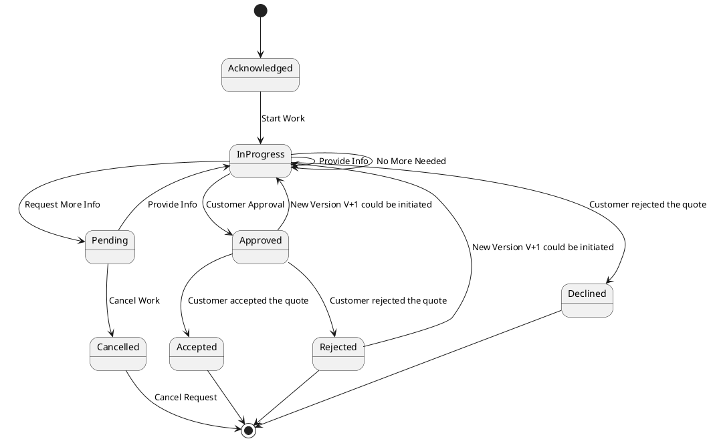

| State        | Definition                                                                                                                                                                                                                                  |
| :----------- | :------------------------------------------------------------------------------------------------------------------------------------------------------------------------------------------------------------------------------------------ |
| Acknowledged | The Acknowledged state represents the stage at which the customer’s requirements have been received, but the treatment or processing has not started yet.                                                                                    |
| In Progress  | The In Progress state is when the quote is currently in the hands of the SP sales team to build it regarding customer requirements. The quote is under construction and needs more information. Everything should be updatable in this state. |
| Pending      | The Pending state is used when a quote needs to be validated from the SP perspective for tariff validation or to capture detailed information. The Pending state could be only for some quote items.                                           |
| Approved     | The Approved state represents the stage following the SP validation. The quote is ready to be sent to the customer.                                                                                                                           |
| Accepted     | The Accepted state is used when the customer agreed to commit to the order and signed the quote.                                                                                                                                              |
| Cancelled    | The Cancelled state is when the quote process is stopped from a SP decision. A cancelled quote has never been send to the customer.                                                                                                             |

| State    | Definition                                                                                                                                                                                                                                                                     |
| :------- | :----------------------------------------------------------------------------------------------------------------------------------------------------------------------------------------------------------------------------------------------------------------------------- |
| Rejected | The Rejected state is used when the customer does not wish to progress with the quotation. It could be his final decision and no other quote will be initiated from this quote or it could be during negotiation phase and a new quote version is triggered from this quote. This new version of the quote is created with the in Progress state. |
| Declined | The Declined state indicates that the request or process of the quotation has been stopped, and no further action will be taken.                                                                                                                                               |

[Image: TM Forum logo]

## Support of polymorphism and extension patterns

Support of polymorphic collections and types and schema based extension is provided by means of a list of generic meta-attributes that we describe below. Polymorphism in collections occurs when entities inherit from base entities, for instance a BillingAccount and SettlementAccount inheriting properties from the abstract Account entity.

Generic support of polymorphism and pattern extensions is described in the TMF API Guidelines v3.0 Part 2 document.

The `@type` attribute provides a way to represent the actual class type of an entity. For example, within a list of Account instances some may be instances of BillingAccount where other could be instances of SettlementAccount. The `@type` gives this information. All resources and sub-resources of this API have a `@type` attributes that can be provided when this is useful.

The `@referredType` can be used within reference entities (like for instance an AccountRef object) to explicitly denote the actual entity type of the referred class. Notice that in reference entities the `@type`, when used, denotes the class type of the reference itself, such as BillingAccountRef or SettlementAccountRef, and not the class type of the referred object. However since reference classes are rarely sub-classed, `@type` is generally not useful in reference objects.

The `@schemaLocation` property can be used in resources to allow specifying user-defined properties of an Entity or to specify the expected characteristics of an entity.

The `@baseType` attribute gives a way to provide explicitly the base of class of a given resource that has been extended.

[Image: TM Forum logo]

## RESOURCE MODEL

### Managed Entity and Task Resource Models

#### Quote resource

Quote can be used to negotiate service and product acquisition or modification between a customer and a service provider. Quote contain list of quote items, a reference to customer (partyRole), a list of productOffering and attached prices and conditions.

#### Resource model

```plantuml
@startuml
skinparam linetype ortho

class Quote {
  category: String
  creationDate: DateTime
  description: String
  effectiveQuoteCompletionDate: DateTime
  expectedFulfillmentStartDate: DateTime
  expectedQuoteCompletionDate: DateTime
  externalId: ExternalIdentifier [0..*]
  href: String
  id: String
  instantSyncQuote: Boolean
  note: Note [0..*]
  productOfferingQualification: ProductOfferingQualificationRef [0..*]
  quoteDate: DateTime
  quoteItem: QuoteItem [1..*] {ordered}
  quoteLevel: String
  quoteTotalPrice: QuotePrice [0..*]
  relatedParty: RelatedPartyOrPartyRole [0..*]
  requestedQuoteCompletionDate: DateTime
  state: QuoteStateType
  validFor: TimePeriod
  version: String
  '@baseType': String
  '@schemaLocation': String
  '@type': String
}

enum QuoteStateType {
  acknowledged
  rejected
  pending
  inProgress
  cancelled
  approved
  accepted
  declined
}

class ContactMedium {
  city: String
  contactType: String
  country: String
  emailAddress: String
  faxNumber: String
  geographicAddress: GeographicAddressRefOrValue
  id: String
  phoneNumber: String
  postCode: String
  preferred: Boolean
  socialNetworkId: String
  stateOrProvince: String
  street1: String
  street2: String
  validFor: TimePeriod
  '@baseType': String
  '@schemaLocation': String
  '@type': String
}

class ExternalIdentifier {
  externalIdentifierType: String
  id: String
  owner: String
  '@baseType': String
  '@schemaLocation': String
  '@type': String
}

class BillingAccountRef {
  href: String
  id: String
  name: String
  ratingType : String
  '@baseType': String
  '@referredType': String
  '@schemaLocation': String
  '@type': String
}

class Note {
  author: String
  date: DateTime
  id: String
  text: String
  '@baseType': String
  '@schemaLocation': String
  '@type': String
}

class QuoteItem {
  action: ItemActionType
  appointment : AppointmentRef [0..*]
  attachment: AttachmentRefOrValue [0..*]
  id: String [1]
  note: Note [0..*]
  product: ProductRefOrValue [0..1]
  productOffering: ProductOfferingRef [0..1]
  productOfferingQualificationItem: ProductOfferingQualificationItemRef [0..*]
  quantity: Integer
  quoteItem: QuoteItem [0..*]
  quoteItemAuthorization: Authorization [0..*]
  quoteItemPrice: QuotePrice [0..*]
  quoteItemRelationship: QuoteItemRelationship [0..*]
  relatedParty: RelatedPartyOrPartyRole [0..*]
  state: QuoteStateType
  '@baseType': String
  '@schemaLocation': String
  '@type': String
}

class RelatedPartyOrPartyRole {
  href: String
  id: String
  name: String
  role: String
  '@baseType': String
  '@referredType': String
  '@schemaLocation': String
  '@type': String
  partyOrPartyRole: PartyOrPartyRole [1]
}

class Authorization {
  approver: RelatedPartyOrPartyRole [0..*]
  givenDate: DateTime
  name : String
  requestedDate: DateTime
  signatureRepresentation: String
  state: String
  '@baseType': String
  '@schemaLocation': String
  '@type': String
}

class QuotePrice {
  description: String
  name: String
  price: Price [0..1]
  priceAlteration: PriceAlteration [0..*]
  priceType: String
  productOfferingPrice: ProductOfferingPriceRef [0..*]
  recurringChargePeriod: String
  unitOfMeasure: String
  '@baseType': String
  '@schemaLocation': String
  '@type': String
}

class AgreementRef {
  href: String
  id: String
  name: String
  '@baseType': String
  '@referredType': String
  '@schemaLocation': String
  '@type': String
}

class ProductOfferingQualificationRef {
  href: String
  id: String [1]
  name: String
  '@baseType': String
  '@referredType': String
  '@schemaLocation': String
  '@type': String
}

class ProductOfferingRef {
  href: String
  id: String [1]
  name: String
  '@baseType': String
  '@referredType': String
  '@schemaLocation': String
  '@type': String
}

class PriceAlteration {
  applicationDuration: Integer
  description: String
  name: String
  price: Price [1]
  priceType: String
  priority: Integer
  productOfferingPrice: ProductOfferingPriceRef [0..*]
  recurringChargePeriod: String
  unitOfMeasure: String
  '@baseType': String
  '@schemaLocation': String
  '@type': String
}

class Price {
  dutyFreeAmount: Money
  percentage: Float
  taxIncludedAmount: Money
  taxRate: Float
  '@baseType': String
  '@schemaLocation': String
  '@type': String
}

Quote "1" *--> "0..*" ContactMedium : contactMedium
Quote "1" *--> "0..*" ExternalIdentifier : externalId
Quote "1" *--> "0..*" BillingAccountRef : billingAccount
Quote "1" *--> "0..*" Note : note
Quote "1" *--> "1..*" QuoteItem : quoteItem {ordered}
Quote "1" *--> "0..*" RelatedPartyOrPartyRole : relatedParty
Quote "1" *--> "0..*" Authorization : authorization
Quote "1" *--> "0..*" QuotePrice : quoteTotalPrice
Quote "1" *--> "0..*" AgreementRef : agreement
Quote "1" *--> "0..*" ProductOfferingQualificationRef : productOfferingQualification
Quote "1" -- "1" QuoteStateType : state
QuoteItem "1" *--> "0..*" ProductOfferingRef : productOffering
QuotePrice "1" *--> "0..*" PriceAlteration : priceAlteration
@enduml
```
**Figure 1 - Quote**

[Image: TM Forum logo]

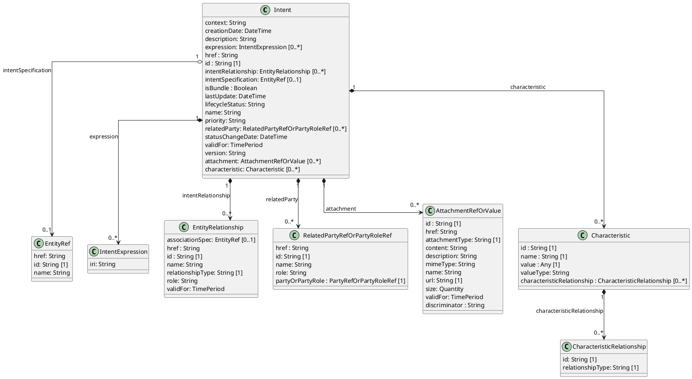
**Figure 2 - Intent**

[Image: TM Forum logo]

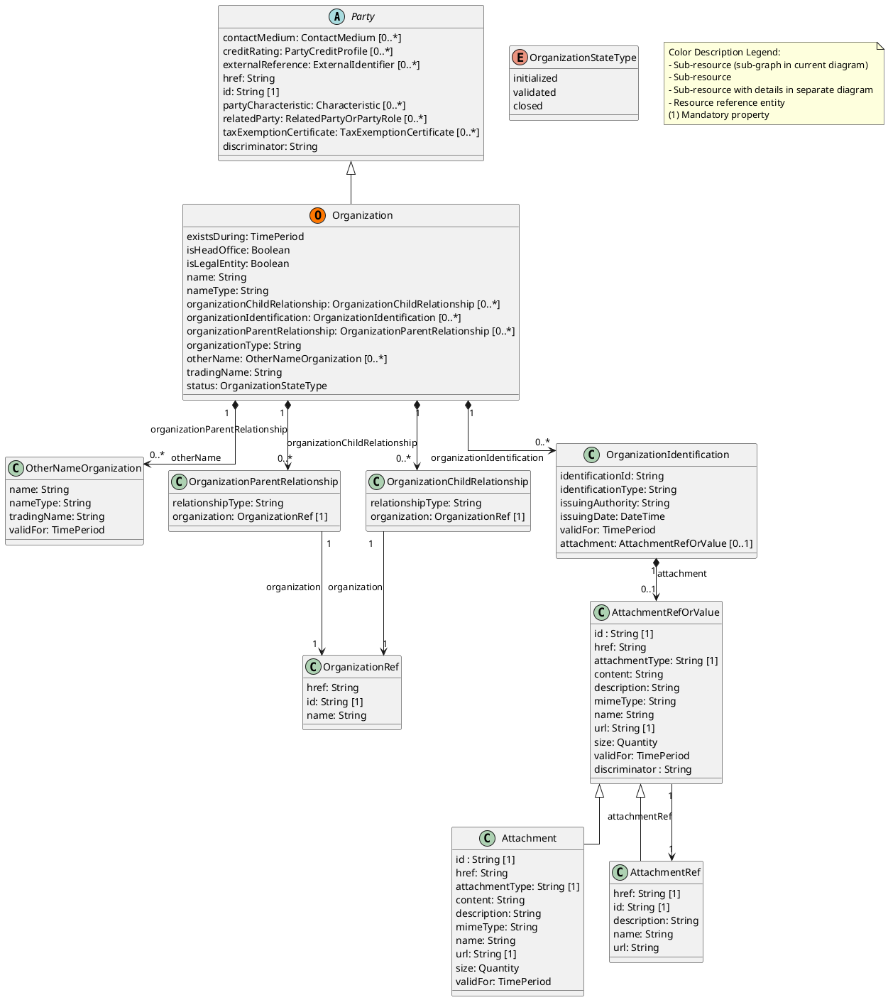
**Figure 3 - Organization**

[Image: TM Forum logo]

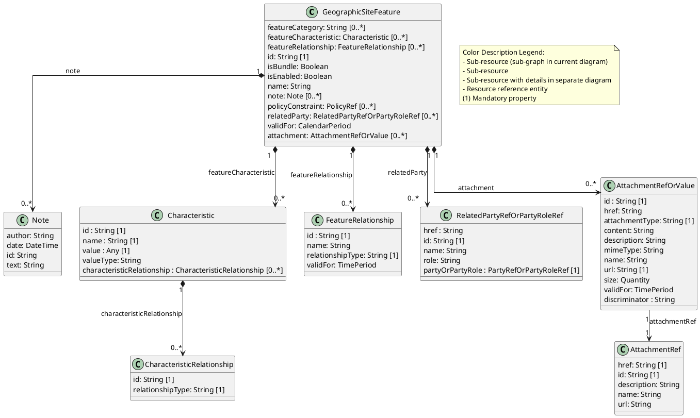
**Figure 4 - GeographicSiteFeature**

[Image: TM Forum logo]

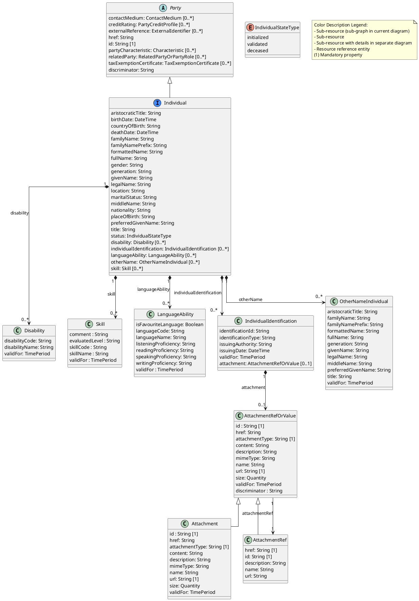
**Figure 5 - Individual**

[Image: TM Forum logo]

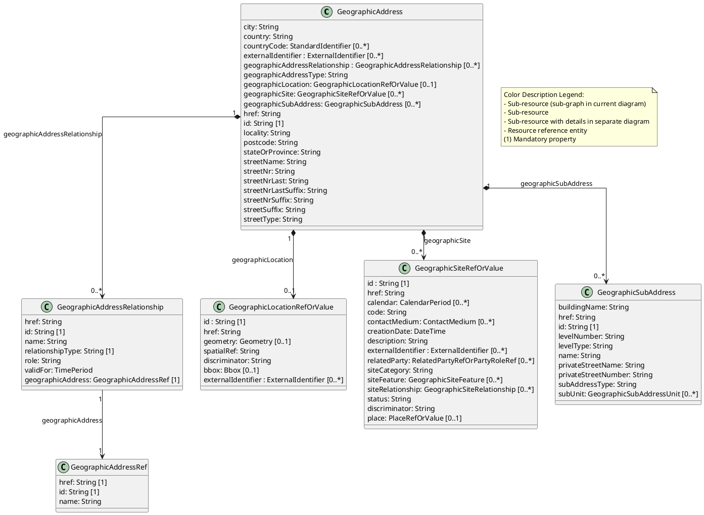
**Figure 6 - GeographicAddress**

[Image: TM Forum logo]

```plantuml
@startuml
skinparam linetype ortho

class QuoteItem {
  action: ItemActionType
  appointment : AppointmentRef [0..*]
  attachment: AttachmentRefOrValue [0..*]
  id: String [1]
  note: Note [0..*]
  product: ProductRefOrValue [0..1]
  productOffering: ProductOfferingRef [0..1]
  productOfferingQualificationItem: ProductOfferingQualificationItemRef [0..*]
  quantity: Integer
  quoteItem: QuoteItem [0..*]
  quoteItemAuthorization: Authorization [0..*]
  quoteItemPrice: QuotePrice [0..*]
  quoteItemRelationship: QuoteItemRelationship [0..*]
  relatedParty: RelatedPartyOrPartyRole [0..*]
  state: QuoteStateType
  '@baseType': String
  '@schemaLocation': String
  '@type': String
}

enum ItemActionType {
 add
 modify
 delete
 noChange
}

enum QuoteStateType {
 acknowledged
 rejected
 pending
 inProgress
 cancelled
 approved
 accepted
 declined
}

class Note {
  author: String
  date: DateTime
  id: String
  text: String
  '@baseType': String
  '@schemaLocation': String
  '@type': String
}

class ProductRefOrValue {
  id : String [1]
  href: String
  billingAccount: BillingAccountRef [0..*]
  creationDate: DateTime
  description: String
  isBundle: Boolean
  isCustomerVisible: Boolean
  name: String
  orderDate: DateTime
  productCharacteristic: Characteristic [0..*]
  productOffering: ProductOfferingRef [0..*]
  productOrderItem: RelatedOrderItem [0..*]
  productPrice: ProductPrice [0..*]
  productRelationship: ProductRelationship [0..*]
  productSerialNumber: String
  productSpecification: ProductSpecificationRef [0..*]
  productTerm: ProductTerm [0..*]
  realizingResource: ResourceRef [0..*]
  realizingService: ServiceRef [0..*]
  relatedParty: RelatedPartyOrPartyRole [0..*]
  startDate: DateTime
  status: ProductStatusType
  terminationDate: DateTime
  '@baseType': String
  '@schemaLocation': String
  '@referredType': String
  '@type': String
  discriminator: String
  agreementItem: AgreementItemRef [0..*]
  intent : IntentRefOrValue [0..1]
  place: RelatedPlaceRefOrValue [0..*]
  product: ProductRefOrValue [0..*]
}

class ProductOfferingRef {
  href: String
  id: String [1]
  name: String
  '@baseType': String
  '@referredType': String
  '@schemaLocation': String
  '@type': String
}

class ProductOfferingQualificationItemRef {
 href: String [1]
 itemId: String [1]
 productOfferingQualificationHref: String
 productOfferingQualificationId: String
 productOfferingQualificationName: String
 '@baseType': String
 '@referredType': String
 '@schemaLocation': String
 '@type': String
}

class Authorization {
  approver: RelatedPartyOrPartyRole [0..*]
  givenDate: DateTime
  name : String
  requestedDate: DateTime
  signatureRepresentation: String
  state: String
  '@baseType': String
  '@schemaLocation': String
  '@type': String
}

class QuotePrice {
  description: String
  name: String
  price: Price [0..1]
  priceAlteration: PriceAlteration [0..*]
  priceType: String
  productOfferingPrice: ProductOfferingPriceRef [0..*]
  recurringChargePeriod: String
  unitOfMeasure: String
  '@baseType': String
  '@schemaLocation': String
  '@type': String
}

class QuoteItemRelationship {
 id: String [1]
 relationshipType: String [1]
 '@baseType': String
 '@schemaLocation': String
 '@type': String
}

class AttachmentRefOrValue {
 id : String [1]
 href: String
 attachmentType: String [1]
 content: String
 description: String
 mimeType: String
 name: String
 url: String [1]
 size: Quantity
 validFor: TimePeriod
 '@baseType': String
 '@schemaLocation': String
 '@referredType': String
 '@type': String
 discriminator : String
}

QuoteItem "1" *--> "0..*" Note : note
QuoteItem "1" *--> "0..1" ProductRefOrValue : product
QuoteItem "1" *--> "0..1" ProductOfferingRef : productOffering
QuoteItem "1" *--> "0..*" ProductOfferingQualificationItemRef : productOfferingQualificationItem
QuoteItem "1" *--> "0..*" Authorization : quoteItemAuthorization
QuoteItem "1" *--> "0..*" QuotePrice : quoteItemPrice
QuoteItem "1" *--> "0..*" QuoteItemRelationship : quoteItemRelationship
QuoteItem "1" *--> "0..*" AttachmentRefOrValue : attachment
QuoteItem "1" -- "1" ItemActionType : action
QuoteItem "1" -- "1" QuoteStateType : state


note "Color Description Legend:\n- Sub-resource (sub-graph in current diagram)\n- Sub-resource\n- Sub-resource with details in separate diagram\n- Resource reference entity\n(1) Mandatory property" as Legend

@enduml

```
**Figure 7 - QuoteItem**

[Image: TM Forum logo]

```plantuml
@startuml
skinparam linetype ortho

abstract class Party {
 contactMedium: ContactMedium [0..*]
 creditRating: PartyCreditProfile [0..*]
 externalReference: ExternalIdentifier [0..*]
 href: String
 id: String [1]
 partyCharacteristic: Characteristic [0..*]
 relatedParty: RelatedPartyOrPartyRole [0..*]
 taxExemptionCertificate: TaxExemptionCertificate [0..*]
 '@baseType': String
 '@schemaLocation': String
 '@type': String
 discriminator: String
}

class Organization <<(O, #FF7700)>> {
 existsDuring: TimePeriod
 isHeadOffice: Boolean
 isLegalEntity: Boolean
 name: String
 nameType: String
 organizationChildRelationship: OrganizationChildRelationship [0..*]
 organizationIdentification: OrganizationIdentification [0..*]
 organizationParentRelationship: OrganizationParentRelationship [0..*]
 organizationType: String
 otherName: OtherNameOrganization [0..*]
 tradingName: String
 status: OrganizationStateType
}

class Individual <<(I, #448AFF)>> {
  aristocraticTitle: String
  birthDate: DateTime
  countryOfBirth: String
  deathDate: DateTime
  familyName: String
  familyNamePrefix: String
  formattedName: String
  fullName: String
  gender: String
  generation: String
  givenName: String
  legalName: String
  location: String
  maritalStatus: String
  middleName: String
  nationality: String
  placeOfBirth: String
  preferredGivenName: String
  title: String
  status: IndividualStateType
  disability: Disability [0..*]
  individualIdentification: IndividualIdentification [0..*]
  languageAbility: LanguageAbility [0..*]
  otherName: OtherNameIndividual [0..*]
  skill: Skill [0..*]
}

class ContactMedium {
  city: String
  contactType: String
  country: String
  emailAddress: String
  faxNumber: String
  geographicAddress: GeographicAddressRefOrValue
  id: String
  phoneNumber: String
  postCode: String
  preferred: Boolean
  socialNetworkId: String
  stateOrProvince: String
  street1: String
  street2: String
  validFor: TimePeriod
  '@baseType': String
  '@schemaLocation': String
  '@type': String
}

class PartyCreditProfile {
  creditProfileDate: DateTime
  creditRiskRating: Integer
  creditScore: Integer
  href: String
  id: String [1]
  validFor: TimePeriod
  '@baseType': String
  '@schemaLocation': String
  '@type': String
}

class ExternalIdentifier {
  externalIdentifierType: String
  id: String
  owner: String
  '@baseType': String
  '@schemaLocation': String
  '@type': String
}

class Characteristic {
 id : String [1]
 name : String [1]
 value : Any [1]
 valueType: String
 '@baseType': String
 '@schemaLocation': String
 '@type': String
 characteristicRelationship : CharacteristicRelationship [0..*]
}

class RelatedPartyOrPartyRole {
  href: String
  id: String
  name: String
  role: String
  '@baseType': String
  '@referredType': String
  '@schemaLocation': String
  '@type': String
  partyOrPartyRole: PartyOrPartyRole [1]
}

class TaxExemptionCertificate {
 certificateNumber: String
 issuingJurisdiction: String
 reason: String
 validFor: TimePeriod
 '@baseType': String
 '@schemaLocation': String
 '@type': String
 attachment: AttachmentRefOrValue [0..1]
 taxDefinition: TaxDefinition [0..*]
}

class PartyOrPartyRole {
  href: String [1]
  id: String [1]
  name: String
  '@baseType': String
  '@referredType': String
  '@schemaLocation': String
  '@type': String
  discriminator: String
}

class PartyRoleRef {
  href: String [1]
  id: String [1]
  name: String
  partyId: String
  partyName: String
  '@baseType': String
  '@referredType': String
  '@schemaLocation': String
  '@type': String
}
class PartyRef {
  href: String [1]
  id: String [1]
  name: String
  '@baseType': String
  '@referredType': String
  '@schemaLocation': String
  '@type': String
}
class IndividualRef {
}
class OrganizationRef {
}
class PartyRole {
}

class AttachmentRefOrValue {
 id : String [1]
 href: String
 attachmentType: String [1]
 content: String
 description: String
 mimeType: String
 name: String
 url: String [1]
 size: Quantity
 validFor: TimePeriod
 '@baseType': String
 '@schemaLocation': String
 '@referredType': String
 '@type': String
 discriminator : String
}

class Attachment {
 id : String [1]
 href: String
 attachmentType: String [1]
 content: String
 description: String
 mimeType: String
 name: String
 url: String [1]
 size: Quantity
 validFor: TimePeriod
 '@baseType': String
 '@schemaLocation': String
 '@type': String
}

class AttachmentRef {
 href: String [1]
 id: String [1]
 description: String
 name: String
 url: String
 '@baseType': String
 '@referredType': String
 '@schemaLocation': String
 '@type': String
}


Party <|-- Organization
Party <|-- Individual
Party "1" *--> "0..*" ContactMedium : contactMedium
Party "1" *--> "0..*" PartyCreditProfile : creditRating
Party "1" *--> "0..*" ExternalIdentifier : externalReference
Party "1" *--> "0..*" Characteristic : partyCharacteristic
Party "1" *--> "0..*" RelatedPartyOrPartyRole : relatedParty
Party "1" *--> "0..*" TaxExemptionCertificate : taxExemptionCertificate
RelatedPartyOrPartyRole "1" --> "1" PartyOrPartyRole : partyOrPartyRole
PartyOrPartyRole <|-- PartyRef
PartyOrPartyRole <|-- PartyRoleRef
PartyRef <|-- IndividualRef
PartyRef <|-- OrganizationRef
PartyRoleRef --> PartyRole
TaxExemptionCertificate "1" *--> "0..1" AttachmentRefOrValue : attachment
AttachmentRefOrValue <|-- Attachment
AttachmentRefOrValue <|-- AttachmentRef

note "Color Description Legend:\n- Sub-resource (sub-graph in current diagram)\n- Sub-resource\n- Sub-resource with details in separate diagram\n- Resource reference entity\n(1) Mandatory property" as Legend

@enduml
```
**Figure 8 - Party**

[Image: TM Forum logo]

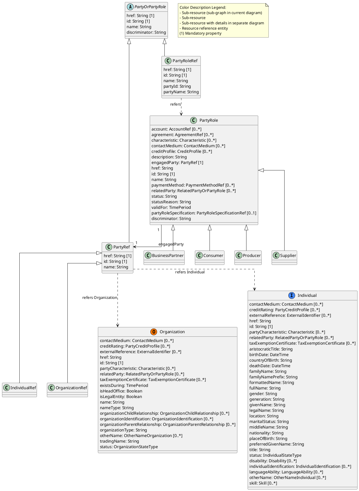
**Figure 9 - PartyOrPartyRole**

[Image: TM Forum logo]

```plantuml
@startuml
skinparam linetype ortho

class PartyRole {
 account: AccountRef [0..*]
 agreement: AgreementRef [0..*]
 characteristic: Characteristic [0..*]
 contactMedium: ContactMedium [0..*]
 creditProfile: CreditProfile [0..*]
 description: String
 engagedParty: PartyRef [1]
 href: String
 id: String [1]
 name: String
 paymentMethod: PaymentMethodRef [0..*]
 relatedParty: RelatedPartyOrPartyRole [0..*]
 status: String
 statusReason: String
 validFor: TimePeriod
 '@baseType': String
 '@schemaLocation': String
 '@type': String
 partyRoleSpecification: PartyRoleSpecificationRef [0..1]
 discriminator: String
}

class CreditProfile {
  creditProfileDate: DateTime
  creditRiskRating: Integer
  creditScore: Integer
  href: String
  id: String [1]
  validFor: TimePeriod
  '@baseType': String
  '@schemaLocation': String
  '@type': String
}

class ContactMedium {
  city: String
  contactType: String
  country: String
  emailAddress: String
  faxNumber: String
  geographicAddress: GeographicAddressRefOrValue
  id: String
  phoneNumber: String
  postCode: String
  preferred: Boolean
  socialNetworkId: String
  stateOrProvince: String
  street1: String
  street2: String
  validFor: TimePeriod
  '@baseType': String
  '@schemaLocation': String
  '@type': String
}

class PartyRef {
  href: String [1]
  id: String [1]
  name: String
  '@baseType': String
  '@referredType': String
  '@schemaLocation': String
  '@type': String
}

class PartyRoleSpecificationRef {
  href: String [1]
  id: String [1]
  name: String
  '@baseType': String
  '@referredType': String
  '@schemaLocation': String
  '@type': String
}

class PaymentMethodRef {
  href: String [1]
  id: String [1]
  name: String
  '@baseType': String
  '@referredType': String
  '@schemaLocation': String
  '@type': String
}

class Supplier {
}

class Consumer {
}

class Producer {
}

class RelatedPartyOrPartyRole {
  href: String
  id: String
  name: String
  role: String
  '@baseType': String
  '@referredType': String
  '@schemaLocation': String
  '@type': String
  partyOrPartyRole: PartyOrPartyRole [1]
}
class BusinessPartner {
}

class PartyOrPartyRole {
  href: String [1]
  id: String [1]
  name: String
  '@baseType': String
  '@referredType': String
  '@schemaLocation': String
  '@type': String
  discriminator: String
}

class AgreementRef {
  href: String
  id: String [1]
  name: String
  '@baseType': String
  '@referredType': String
  '@schemaLocation': String
  '@type': String
}

class Characteristic {
 id : String [1]
 name : String [1]
 value : Any [1]
 valueType: String
 '@baseType': String
 '@schemaLocation': String
 '@type': String
 characteristicRelationship : CharacteristicRelationship [0..*]
}

class AccountRef {
  href: String [1]
  id: String [1]
  description: String
  name: String
  '@baseType': String
  '@referredType': String
  '@schemaLocation': String
  '@type': String
}

class CharacteristicRelationship {
 id: String [1]
 relationshipType: String [1]
 '@baseType': String
 '@schemaLocation': String
 '@type': String
}

PartyRole <|-- BusinessPartner
PartyRole <|-- Producer
PartyRole <|-- Consumer
PartyRole <|-- Supplier

PartyRole "1" *--> "0..*" CreditProfile : creditProfile
PartyRole "1" *--> "0..*" ContactMedium : contactMedium
PartyRole "1" --> "1" PartyRef : engagedParty
PartyRole "1" --> "0..1" PartyRoleSpecificationRef : partyRoleSpecification
PartyRole "1" *--> "0..*" PaymentMethodRef : paymentMethod
PartyRole "1" *--> "0..*" RelatedPartyOrPartyRole : relatedParty
PartyRole "1" *--> "0..*" AgreementRef : agreement
PartyRole "1" *--> "0..*" Characteristic : characteristic
PartyRole "1" *--> "0..*" AccountRef : account
RelatedPartyOrPartyRole "1" --> "1" PartyOrPartyRole : partyOrPartyRole
Characteristic "1" *--> "0..*" CharacteristicRelationship : characteristicRelationship

note "Color Description Legend:\n- Sub-resource (sub-graph in current diagram)\n- Sub-resource\n- Sub-resource with details in separate diagram\n- Resource reference entity\n(1) Mandatory property" as Legend

@enduml
```
**Figure 10 - PartyRole**

[Image: TM Forum logo]

```plantuml
@startuml
skinparam linetype ortho

class ProductRefOrValue {
  id : String [1]
  href: String
  billingAccount: BillingAccountRef [0..*]
  creationDate: DateTime
  description: String
  isBundle: Boolean
  isCustomerVisible: Boolean
  name: String
  orderDate: DateTime
  productCharacteristic: Characteristic [0..*]
  productOffering: ProductOfferingRef [0..*]
  productOrderItem: RelatedOrderItem [0..*]
  productPrice: ProductPrice [0..*]
  productRelationship: ProductRelationship [0..*]
  productSerialNumber: String
  productSpecification: ProductSpecificationRef [0..*]
  productTerm: ProductTerm [0..*]
  realizingResource: ResourceRef [0..*]
  realizingService: ServiceRef [0..*]
  relatedParty: RelatedPartyOrPartyRole [0..*]
  startDate: DateTime
  status: ProductStatusType
  terminationDate: DateTime
  '@baseType': String
  '@schemaLocation': String
  '@referredType': String
  '@type': String
  discriminator: String
  agreementItem: AgreementItemRef [0..*]
  intent : IntentRefOrValue [0..1]
  place: RelatedPlaceRefOrValue [0..*]
  product: ProductRefOrValue [0..*]
}

class BillingAccountRef {
  href: String
  id: String [1]
  name: String
  ratingType : String
  '@baseType': String
  '@referredType': String
  '@schemaLocation': String
  '@type': String
}

class Characteristic {
 id : String [1]
 name : String [1]
 value : Any [1]
 valueType: String
 '@baseType': String
 '@schemaLocation': String
 '@type': String
 characteristicRelationship : CharacteristicRelationship [0..*]
}

class ProductOfferingRef {
  href: String
  id: String [1]
  name: String
  '@baseType': String
  '@referredType': String
  '@schemaLocation': String
  '@type': String
}

class RelatedOrderItem {
  orderHref: String
  orderId: String [1]
  orderItemId: String
  role: String
  '@baseType': String
  '@referredType': String
  '@schemaLocation': String
  '@type': String
  orderItemAction: ItemActionType
}

class ProductPrice {
 description: String
 name: String
 price: Price [1]
 priceAlteration: PriceAlteration [0..*]
 priceType: String
 productOfferingPrice: ProductOfferingPriceRef [0..*]
 recurringChargePeriod: String
 unitOfMeasure: String
 '@baseType': String
 '@schemaLocation': String
 '@type': String
}

class ProductRelationship {
 relationshipType: String
 '@baseType': String
 '@schemaLocation': String
 '@type': String
 product: ProductRef [1]
}

class ProductSpecificationRef {
 href: String [1]
 id: String [1]
 name: String
 targetProductSchema: TargetProductSchema
 version: String
 '@baseType': String
 '@referredType': String
 '@schemaLocation': String
 '@type': String
}

class ProductTerm {
 description: String
 duration: Duration
 name: String
 validFor: TimePeriod
 '@baseType': String
 '@schemaLocation': String
 '@type': String
}

class ResourceRef {
 href: String [1]
 id: String [1]
 name: String
 '@baseType': String
 '@referredType': String
 '@schemaLocation': String
 '@type': String
}

class ServiceRef {
 href: String [1]
 id: String [1]
 name: String
 '@baseType': String
 '@referredType': String
 '@schemaLocation': String
 '@type': String
}

class RelatedPartyOrPartyRole {
  href: String
  id: String
  name: String
  role: String
  '@baseType': String
  '@referredType': String
  '@schemaLocation': String
  '@type': String
  partyOrPartyRole: PartyOrPartyRole [1]
}

enum ProductStatusType {
 created
 pendingActive
 cancelled
 active
 pendingTerminate
 terminated
 suspended
 aborted
}

class AgreementItemRef {
  agreementHref: String
  agreementId: String
  agreementItemId: String
  agreementName: String
  '@baseType': String
  '@referredType': String
  '@schemaLocation': String
  '@type': String
}

class IntentRefOrValue {
}

class RelatedPlaceRefOrValue {
}

class ProductRef {
}


ProductRefOrValue "1" *--> "0..*" BillingAccountRef : billingAccount
ProductRefOrValue "1" *--> "0..*" Characteristic : productCharacteristic
ProductRefOrValue "1" *--> "0..*" ProductOfferingRef : productOffering
ProductRefOrValue "1" *--> "0..*" RelatedOrderItem : productOrderItem
ProductRefOrValue "1" *--> "0..*" ProductPrice : productPrice
ProductRefOrValue "1" *--> "0..*" ProductRelationship : productRelationship
ProductRefOrValue "1" *--> "0..*" ProductSpecificationRef : productSpecification
ProductRefOrValue "1" *--> "0..*" ProductTerm : productTerm
ProductRefOrValue "1" *--> "0..*" ResourceRef : realizingResource
ProductRefOrValue "1" *--> "0..*" ServiceRef : realizingService
ProductRefOrValue "1" *--> "0..*" RelatedPartyOrPartyRole : relatedParty
ProductRefOrValue "1" *--> "0..*" AgreementItemRef : agreementItem
ProductRefOrValue "1" *--> "0..1" IntentRefOrValue : intent
ProductRefOrValue "1" *--> "0..*" RelatedPlaceRefOrValue : place
ProductRefOrValue "1" *--> "0..*" ProductRefOrValue : product
ProductRefOrValue "1" -- "1" ProductStatusType : status

note "Color Description Legend:\n- Sub-resource (sub-graph in current diagram)\n- Sub-resource\n- Sub-resource with details in separate diagram\n- Resource reference entity\n(1) Mandatory property" as Legend

@enduml
```
**Figure 11 - Product**

### Field descriptions

#### Quote fields

| Field                          | Description                                                                                                                                                                                                                                                                                                    |
| :----------------------------- | :------------------------------------------------------------------------------------------------------------------------------------------------------------------------------------------------------------------------------------------------------------------------------------------------------------- |
| `agreement`                    | An `AgreementRef`. Agreement reference. An agreement represents a contract or arrangement, either written or verbal and sometimes enforceable by law, such as a service level agreement or a customer price agreement. An agreement involves a number of other business entities, such as products, services, and resources and/or their specifications. |
| `authorization`                | An `Authorization`. If special discount or special product offering price or specific condition need an approval for ISP sale representative it is described here.                                                                                                                                             |
| `billingAccount`               | A `BillingAccountRef`. BillingAccount reference. A BillingAccount is a detailed description of a bill structure.                                                                                                                                                                                                   |
| `category`                     | A `String`. Used to categorize the quote from a business perspective that can be useful for the CRM system (e.g. "enterprise", "residential", …).                                                                                                                                                                |
| `contactMedium`                | A `ContactMedium`. Indicates the contact medium that could be used to contact the party. This is an abstract base class, the actual value is in one of the strongly-typed subclasses : EmailContactMedium, FaxContactMedium, PhoneContactMedium, GeographicAddressContactMedium, SocialMediaContactMedium… <br> `ContactMedium` can be instanciated as<br> \* `EmailContactMedium`<br> \* `FaxContactMedium`<br> \* `GeographicAddressContactMedium`<br> \* `PhoneContactMedium`<br> \* `SocialContactMedium` |
| `creationDate`                 | A `DateTime`. Date and time when the quote was created.                                                                                                                                                                                                                                                        |
| `description`                  | A `String`. Description of the quote.                                                                                                                                                                                                                                                                          |
| `effectiveQuoteCompletionDate` | A `DateTime`. Date when the quote has been completed.                                                                                                                                                                                                                                                          |
| `expectedFulfillmentStartDate` | A `DateTime`. This is the date wished by the requester to have the requested quote item delivered.                                                                                                                                                                                                             |
| `expectedQuoteCompletionDate`  | A `DateTime`. This is expected date - from quote supplier - to be able to send back a response for this quote.                                                                                                                                                                                                  |
| `externalId`                   | An `ExternalIdentifier`. An identification of an entity that is owned by or originates in a software system different from the current system, for example a ProductOrder handed off from a commerce platform into an order handling system. The structure identifies the system itself, the nature of the entity within the system (e.g. class name) and the unique ID of the entity within the system. It is anticipated that multiple external IDs can be held for a single entity, e.g. if the entity passed through multiple systems on the way to the current system. In this case the consumer is expected to sequence the IDs in the array in reverse order of provenance, i.e. most recent system first in the list. |
| `href`                         | A `String`. Hyperlink reference.                                                                                                                                                                                                                                                                               |
| `id`                           | A `String`. Unique identifier.                                                                                                                                                                                                                                                                                 |
| `instantSyncQuote`             | A `Boolean`. An indicator which when the value is "true" means that requester expects to get quoting result immediately in the response. If the indicator is true then the response code of 200 indicates the operation is successful otherwise a task is created with a response 201.                          |
| `note`                         | A `Note`. Extra information about a given entity.                                                                                                                                                                                                                                                              |
| `productOfferingQualification` | A `ProductOfferingQualificationRef`. A productOfferingQualification that has been executed previously.                                                                                                                                                                                                         |
| `quoteItem`                    | A `QuoteItem`. A quote items describe an action to be performed on a productOffering or a product in order to get pricing elements and condition.                                                                                                                                                             |
| `quoteTotalPrice`              | A `QuotePrice`. Description of price and discount awarded.                                                                                                                                                                                                                                                     |
| `relatedParty`                 | A `RelatedPartyOrPartyRole`. RelatedParty reference. A related party defines party or party role or its reference, linked to a specific entity.                                                                                                                                                                |
| `requestedQuoteCompletionDate` | A `DateTime`. This is requested date - from quote requester - to get a complete response for this quote.                                                                                                                                                                                                       |
| `state`                        | A `QuoteStateType`. Possible values for the state of the quote. ENUMERATED with values:<br> \* acknowledged<br> \* rejected<br> \* pending<br> \* inProgress<br> \* cancelled<br> \* approved<br> \* accepted<br> \* declined                                                                                         |
| `validFor`                     | A `TimePeriod`. A period of time, either as a deadline (endDateTime only) a startDateTime only, or both.                                                                                                                                                                                                      |
| `version`                      | A `String`. Quote version - if the customer rejected the quote but negotiations still open a new version of the quote is managed.                                                                                                                                                                              |
| `@baseType`                    | A `String`. When sub-classing, this defines the super-class.                                                                                                                                                                                                                                                   |
| `@schemaLocation`              | A `String`. A URI to a JSON-Schema file that defines additional attributes and relationships.                                                                                                                                                                                                                  |
| `@type`                        | A `String`. When sub-classing, this defines the sub-class Extensible name.                                                                                                                                                                                                                                     |

##### Authorization sub-resource fields

| Field                     | Description                                                                                                                                            |
| :------------------------ | :----------------------------------------------------------------------------------------------------------------------------------------------------- |
| `approver`                | A `RelatedPartyOrPartyRole`. RelatedParty reference. A related party defines party or party role or its reference, linked to a specific entity.       |
| `givenDate`               | A `DateTime`. Date when the authorization (approved or declined) was done.                                                                             |
| `name`                    | A `String`. Name of the required authorization.                                                                                                        |
| `requestedDate`           | A `DateTime`. Date when the authorization is requested for.                                                                                            |
| `signatureRepresentation` | A `String`. To describe a digital or manual signature.                                                                                                 |
| `state`                   | A `String`. State of the authorization, such as: approved or declined.                                                                                 |
| `@baseType`               | A `String`. When sub-classing, this defines the super-class.                                                                                           |
| `@schemaLocation`         | A `String`. A URI to a JSON-Schema file that defines additional attributes and relationships.                                                          |
| `@type`                   | A `String`. When sub-classing, this defines the sub-class Extensible name.                                                                             |

##### QuotePrice sub-resource fields

| Field                   | Description                                                                                                                                                    |
| :---------------------- | :------------------------------------------------------------------------------------------------------------------------------------------------------------- |
| `description`           | A `String`. Description of the quote/quote item price.                                                                                                         |
| `name`                  | A `String`. Name of the quote /quote item price.                                                                                                               |
| `price`                 | A `Price`. Provides all amounts (tax included, duty free, tax rate), used currency and percentage to apply for Price and Price Alteration.                      |
| `priceAlteration`       | A `PriceAlteration`. Is an amount, usually of money, that modifies the price charged for an order item.                                                         |
| `priceType`             | A `String`. Indicate if the price is for recurrent or no-recurrent charge.                                                                                     |
| `productOfferingPrice`  | A `ProductOfferingPriceRef`. ProductPriceOffering reference. An amount, usually of money, that is asked for or allowed when a ProductOffering is bought, rented, or leased. |
| `recurringChargePeriod` | A `String`. Used for recurring charge to indicate period (month, week, etc..).                                                                                 |
| `unitOfMeasure`         | A `String`. Unit of Measure if price depending on it (Gb, SMS volume, etc..).                                                                                  |
| `@baseType`             | A `String`. When sub-classing, this defines the super-class.                                                                                                   |
| `@schemaLocation`         | A `String`. A URI to a JSON-Schema file that defines additional attributes and relationships.                                                                  |
| `@type`                 | A `String`. When sub-classing, this defines the sub-class Extensible name.                                                                                     |

##### ContactMedium sub-resource fields

| Field                 | Description                                                                                                                            |
| :-------------------- | :------------------------------------------------------------------------------------------------------------------------------------- |
| `contactType`         | A `String`. Type of the contact medium to qualify it like pro email / personal email. This is not used to define the contact medium used. |
| `id`                  | A `String`. Identifier for this contact medium.                                                                                        |
| `preferred`           | A `Boolean`. If true, indicates that is the preferred contact medium.                                                                  |
| `validFor`            | A `TimePeriod`. A period of time, either as a deadline (endDateTime only) a startDateTime only, or both.                                |
| `@baseType`           | A `String`. When sub-classing, this defines the super-class.                                                                           |
| `@schemaLocation`     | A `String`. A URI to a JSON-Schema file that defines additional attributes and relationships.                                          |
| `@type`               | A `String`. When sub-classing, this defines the sub-class Extensible name.                                                             |
|                       | `ContactMedium` can be instanciated as<br>\* `EmailContactMedium`<br>\* `FaxContactMedium`<br>\* `GeographicAddressContactMedium`<br>\* `PhoneContactMedium`<br>\* `SocialContactMedium` |
| `city`                | This property is present in subclasses                                                                                                 |
| `country`             | This property is present in subclasses                                                                                                 |
| `emailAddress`        | This property is present in subclasses                                                                                                 |
| `faxNumber`           | This property is present in subclasses                                                                                                 |
| `geographicAddress`   | This property is present in subclasses                                                                                                 |
| `phoneNumber`         | This property is present in subclasses                                                                                                 |
| `postCode`            | This property is present in subclasses                                                                                                 |
| `socialNetworkId`     | This property is present in subclasses                                                                                                 |
| `stateOrProvince`     | This property is present in subclasses                                                                                                 |
| `street1`             | This property is present in subclasses                                                                                                 |
| `street2`             | This property is present in subclasses                                                                                                 |

##### PhoneContactMedium sub-resource fields

| Field             | Description                                                                                                                            |
| :---------------- | :------------------------------------------------------------------------------------------------------------------------------------- |
| `contactType`     | A `String`. Type of the contact medium to qualify it like pro email / personal email. This is not used to define the contact medium used. |
| `id`              | A `String`. Identifier for this contact medium.                                                                                        |
| `phoneNumber`     | A `String`. The phone number of the contact.                                                                                           |
| `preferred`       | A `Boolean`. If true, indicates that is the preferred contact medium.                                                                  |
| `validFor`        | A `TimePeriod`. A period of time, either as a deadline (endDateTime only) a startDateTime only, or both.                                |
| `@baseType`       | A `String`. When sub-classing, this defines the super-class.                                                                           |
| `@schemaLocation` | A `String`. A URI to a JSON-Schema file that defines additional attributes and relationships.                                          |
| `@type`           | A `String`. When sub-classing, this defines the sub-class Extensible name.                                                             |

##### GeographicAddressContactMedium sub-resource fields

| Field               | Description                                                                                                                            |
| :------------------ | :------------------------------------------------------------------------------------------------------------------------------------- |
| `city`              | A `String`. The city.                                                                                                                  |
| `contactType`       | A `String`. Type of the contact medium to qualify it like pro email / personal email. This is not used to define the contact medium used. |
| `country`           | A `String`. The country.                                                                                                               |
| `geographicAddress` | A `GeographicAddressRef`. Reference to a Geographic Address.                                                                           |
| `id`                | A `String`. Identifier for this contact medium.                                                                                        |
| `postCode`          | A `String`. Postcode.                                                                                                                  |
| `preferred`         | A `Boolean`. If true, indicates that is the preferred contact medium.                                                                  |
| `stateOrProvince`   | A `String`. State or province.                                                                                                         |
| `street1`           | A `String`. Describes the street.                                                                                                      |
| `street2`           | A `String`. Complementary street description.                                                                                          |
| `validFor`          | A `TimePeriod`. A period of time, either as a deadline (endDateTime only) a startDateTime only, or both.                                |
| `@baseType`         | A `String`. When sub-classing, this defines the super-class.                                                                           |
| `@schemaLocation`   | A `String`. A URI to a JSON-Schema file that defines additional attributes and relationships.                                          |
| `@type`             | A `String`. When sub-classing, this defines the sub-class Extensible name.                                                             |

##### SocialContactMedium sub-resource fields

| Field             | Description                                                                                                                            |
| :---------------- | :------------------------------------------------------------------------------------------------------------------------------------- |
| `contactType`     | A `String`. Type of the contact medium to qualify it like pro email / personal email. This is not used to define the contact medium used. |
| `id`              | A `String`. Identifier for this contact medium.                                                                                        |
| `preferred`       | A `Boolean`. If true, indicates that is the preferred contact medium.                                                                  |
| `socialNetworkId` | A `String`. Identifier as a member of a social network.                                                                                |
| `validFor`        | A `TimePeriod`. A period of time, either as a deadline (endDateTime only) a startDateTime only, or both.                                |
| `@baseType`       | A `String`. When sub-classing, this defines the super-class.                                                                           |
| `@schemaLocation` | A `String`. A URI to a JSON-Schema file that defines additional attributes and relationships.                                          |
| `@type`           | A `String`. When sub-classing, this defines the sub-class Extensible name.                                                             |

##### EmailContactMedium sub-resource fields

| Field             | Description                                                                                                                            |
| :---------------- | :------------------------------------------------------------------------------------------------------------------------------------- |
| `contactType`     | A `String`. Type of the contact medium to qualify it like pro email / personal email. This is not used to define the contact medium used. |
| `emailAddress`    | A `String`. Full email address in standard format.                                                                                     |
| `id`              | A `String`. Identifier for this contact medium.                                                                                        |
| `preferred`       | A `Boolean`. If true, indicates that is the preferred contact medium.                                                                  |
| `validFor`        | A `TimePeriod`. A period of time, either as a deadline (endDateTime only) a startDateTime only, or both.                                |
| `@baseType`       | A `String`. When sub-classing, this defines the super-class.                                                                           |
| `@schemaLocation` | A `String`. A URI to a JSON-Schema file that defines additional attributes and relationships.                                          |
| `@type`           | A `String`. When sub-classing, this defines the sub-class Extensible name.                                                             |

##### FaxContactMedium sub-resource fields

| Field             | Description                                                                                                                            |
| :---------------- | :------------------------------------------------------------------------------------------------------------------------------------- |
| `contactType`     | A `String`. Type of the contact medium to qualify it like pro email / personal email. This is not used to define the contact medium used. |
| `faxNumber`       | A `String`. The fax number of the contact.                                                                                             |
| `id`              | A `String`. Identifier for this contact medium.                                                                                        |
| `preferred`       | A `Boolean`. If true, indicates that is the preferred contact medium.                                                                  |
| `validFor`        | A `TimePeriod`. A period of time, either as a deadline (endDateTime only) a startDateTime only, or both.                                |
| `@baseType`       | A `String`. When sub-classing, this defines the super-class.                                                                           |
| `@schemaLocation` | A `String`. A URI to a JSON-Schema file that defines additional attributes and relationships.                                          |
| `@type`           | A `String`. When sub-classing, this defines the sub-class Extensible name.                                                             |

##### ExternalIdentifier sub-resource fields

| Field                  | Description                                                                                   |
| :--------------------- | :-------------------------------------------------------------------------------------------- |
| `externalIdentifierType` | A `String`. Type of the identification, typically would be the type of the entity within the external system. |
| `id`                   | A `String`. Identification of the entity within the external system.                          |
| `owner`                | A `String`. Name of the external system that owns the entity.                                 |
| `@baseType`            | A `String`. When sub-classing, this defines the super-class.                                  |
| `@schemaLocation`      | A `String`. A URI to a JSON-Schema file that defines additional attributes and relationships. |
| `@type`                | A `String`. When sub-classing, this defines the sub-class Extensible name.                    |

##### BillingAccountRef sub-resource fields

| Field           | Description                                                                                      |
| :-------------- | :----------------------------------------------------------------------------------------------- |
| `href`          | A `String`. Hyperlink reference.                                                                 |
| `id`            | A `String`. Unique identifier.                                                                   |
| `name`          | A `String`. Name of the referred entity.                                                         |
| `ratingType`    | A `String`. Indicates whether the account follows a specific payment option such as prepaid or postpaid. |
| `@baseType`     | A `String`. When sub-classing, this defines the super-class.                                     |
| `@referredType` | A `String`. The actual type of the target instance when needed for disambiguation.               |
| `@schemaLocation` | A `String`. A URI to a JSON-Schema file that defines additional attributes and relationships.    |
| `@type`         | A `String`. When sub-classing, this defines the sub-class Extensible name.                       |

##### Note sub-resource fields

| Field           | Description                                                                                   |
| :-------------- | :-------------------------------------------------------------------------------------------- |
| `author`        | A `String`. Author of the note.                                                               |
| `date`          | A `DateTime`. Date of the note.                                                               |
| `id`            | A `String`. Identifier of the note within its containing entity.                              |
| `text`          | A `String`. Text of the note.                                                                 |
| `@baseType`     | A `String`. When sub-classing, this defines the super-class.                                  |
| `@schemaLocation` | A `String`. A URI to a JSON-Schema file that defines additional attributes and relationships. |
| `@type`         | A `String`. When sub-classing, this defines the sub-class Extensible name.                    |

##### AgreementRef sub-resource fields

| Field           | Description                                                                                   |
| :-------------- | :-------------------------------------------------------------------------------------------- |
| `href`          | A `String`. Hyperlink reference.                                                              |
| `id`            | A `String`. Unique identifier.                                                                |
| `name`          | A `String`. Name of the referred entity.                                                      |
| `@baseType`     | A `String`. When sub-classing, this defines the super-class.                                  |
| `@referredType` | A `String`. The actual type of the target instance when needed for disambiguation.            |
| `@schemaLocation` | A `String`. A URI to a JSON-Schema file that defines additional attributes and relationships. |
| `@type`         | A `String`. When sub-classing, this defines the sub-class Extensible name.                    |

##### QuoteItem sub-resource fields

| Field                              | Description                                                                                                                                                                                                 |
| :--------------------------------- | :---------------------------------------------------------------------------------------------------------------------------------------------------------------------------------------------------------- |
| `action`                           | An `ItemActionType`. Action to be performed on the entity managed by the item. ENUMERATED with values:<br>\* add<br>\* modify<br>\* delete<br>\* noChange                                                     |
| `appointment`                      | An `AppointmentRef`. Refers an appointment, such as a Customer presentation or internal meeting or site visit.                                                                                               |
| `attachment`                       | An `AttachmentRefOrValue`. The polymorphic attributes `@type`, `@schemaLocation` & `@referredType` are related to the Attachment entity and not the AttachmentRefOrValue class itself.                           |
| `id`                               | A `String`. Identifier of the quote item (generally it is a sequence number 01, 02, 03, …).                                                                                                                 |
| `note`                             | A `Note`. Extra information about a given entity.                                                                                                                                                           |
| `product`                          | A `ProductRefOrValue`. The polymorphic attributes `@type`, `@schemaLocation` & `@referredType` are related to the Product entity and not the ProductRefOrValue class itself.                                   |
| `productOffering`                  | A `ProductOfferingRef`. ProductOffering reference. A product offering represents entities that are orderable from the provider of the catalog, this resource includes pricing information.                    |
| `productOfferingQualificationItem` | A `ProductOfferingQualificationItemRef`. It’s a productOfferingQualification item that has been executed previously.                                                                                        |
| `quantity`                         | An `Integer`. Quantity asked for this quote item.                                                                                                                                                           |
| `quoteItem`                        | A `QuoteItem`. A quote items describe an action to be performed on a productOffering or a product in order to get pricing elements and condition.                                                           |
| `quoteItemAuthorization`           | An `Authorization`. If special discount or special product offering price or specific condition need an approval for ISP sale representative it is described here.                                             |
| `quoteItemPrice`                   | A `QuotePrice`. Description of price and discount awarded.                                                                                                                                                  |
| `quoteItemRelationship`            | A `QuoteItemRelationship`. Used to describe relationship between quote item. These relationship could have an impact on pricing and conditions.                                                             |
| `relatedParty`                     | A `RelatedPartyOrPartyRole`. RelatedParty reference. A related party defines party or party role or its reference, linked to a specific entity.                                                              |
| `state`                            | A `QuoteStateType`. Possible values for the state of the quote. ENUMERATED with values:<br>\* acknowledged<br>\* rejected<br>\* pending<br>\* inProgress<br>\* cancelled<br>\* approved<br>\* accepted<br>\* declined |
| `@baseType`                        | A `String`. When sub-classing, this defines the super-class.                                                                                                                                                |
| `@schemaLocation`                  | A `String`. A URI to a JSON-Schema file that defines additional attributes and relationships.                                                                                                               |
| `@type`                            | A `String`. When sub-classing, this defines the sub-class Extensible name.                                                                                                                                  |

##### RelatedPartyOrPartyRole sub-resource fields

| Field              | Description                                                                                                                                               |
| :----------------- | :-------------------------------------------------------------------------------------------------------------------------------------------------------- |
| `partyOrPartyRole` | A `PartyOrPartyRole`.                                                                                                                                     |
| `role`             | A `String`. Role played by the related party or party role in the context of the specific entity it is linked to. Such as 'initiator', 'customer', 'salesAgent', 'user'. |
| `@baseType`        | A `String`. When sub-classing, this defines the super-class.                                                                                              |
| `@schemaLocation`  | A `String`. A URI to a JSON-Schema file that defines additional attributes and relationships.                                                               |
| `@type`            | A `String`. When sub-classing, this defines the sub-class Extensible name.                                                                                |

##### ProductOfferingQualificationRef sub-resource fields

| Field           | Description                                                                                   |
| :-------------- | :-------------------------------------------------------------------------------------------- |
| `href`          | A `String`. Hyperlink reference.                                                              |
| `id`            | A `String`. Unique identifier.                                                                |
| `name`          | A `String`. Name of the referred entity.                                                      |
| `@baseType`     | A `String`. When sub-classing, this defines the super-class.                                  |
| `@referredType` | A `String`. The actual type of the target instance when needed for disambiguation.            |
| `@schemaLocation` | A `String`. A URI to a JSON-Schema file that defines additional attributes and relationships. |
| `@type`         | A `String`. When sub-classing, this defines the sub-class Extensible name.                    |

##### PartyRef sub-resource fields

| Field           | Description                                                                                   |
| :-------------- | :-------------------------------------------------------------------------------------------- |
| `href`          | A `String`. Hyperlink reference.                                                              |
| `id`            | A `String`. Unique identifier.                                                                |
| `name`          | A `String`. Name of the referred entity.                                                      |
| `@baseType`     | A `String`. When sub-classing, this defines the super-class.                                  |
| `@referredType` | A `String`. The actual type of the target instance when needed for disambiguation.            |
| `@schemaLocation` | A `String`. A URI to a JSON-Schema file that defines additional attributes and relationships. |
| `@type`         | A `String`. When sub-classing, this defines the sub-class Extensible name.                    |

##### PartyRole sub-resource fields

| Field                    | Description                                                                                                                                                                                                                                                                                                    |
| :----------------------- | :------------------------------------------------------------------------------------------------------------------------------------------------------------------------------------------------------------------------------------------------------------------------------------------------------------- |
| `account`                | An `AccountRef`. Account reference. A account may be a party account or a financial account.                                                                                                                                                                                                                   |
| `agreement`              | An `AgreementRef`. Agreement reference. An agreement represents a contract or arrangement, either written or verbal and sometimes enforceable by law, such as a service level agreement or a customer price agreement. An agreement involves a number of other business entities, such as products, services, and resources and/or their specifications. |
| `characteristic`         | A `Characteristic`. Describes a given characteristic of an object or entity through a name/value pair. This is an abstract base class, the actual value is in one of the strongly-typed subclasses : StringCharacteristic, ObjectCharacteristic, FloatCharacteristic, BooleanCharacteristic, NumberCharacteristic, IntegerCharacteristic, StringArrayCharacteristic, ObjectArrayCharacteristic, BooleanArrayCharacteristic, NumberArrayCharacteristic, IntegerArrayCharacteristic…<br>`Characteristic` can be instanciated as<br>\* `BooleanArrayCharacteristic`<br>\* `BooleanCharacteristic`<br>\* `IntegerArrayCharacteristic`<br>\* `IntegerCharacteristic`<br>\* `NumberArrayCharacteristic`<br>\* `NumberCharacteristic`<br>\* `ObjectArrayCharacteristic`<br>\* `ObjectCharacteristic`<br>\* `StringArrayCharacteristic`<br>\* `StringCharacteristic` |
| `contactMedium`          | A `ContactMedium`. Indicates the contact medium that could be used to contact the party. This is an abstract base class, the actual value is in one of the strongly-typed subclasses : EmailContactMedium, FaxContactMedium, PhoneContactMedium, GeographicAddressContactMedium, SocialMediaContactMedium…<br>`ContactMedium` can be instanciated as<br>\* `EmailContactMedium`<br>\* `FaxContactMedium`<br>\* `GeographicAddressContactMedium`<br>\* `PhoneContactMedium`<br>\* `SocialContactMedium` |
| `creditProfile`          | A `CreditProfile`. Credit profile for the party (containing credit scoring, …). By default only the current credit profile is retrieved. It can be used as a list to give the party credit profiles history, the first one in the list will be the current one.                                                    |
| `description`            | A `String`. A description of the PartyRole.                                                                                                                                                                                                                                                                    |
| `engagedParty`           | A `PartyRef`. A Party reference.                                                                                                                                                                                                                                                                               |
| `href`                   | A `String`. Hyperlink reference.                                                                                                                                                                                                                                                                               |
| `id`                     | A `String`. Unique identifier.                                                                                                                                                                                                                                                                                 |
| `name`                   | A `String`. A word, term, or phrase by which the PartyRole is known and distinguished from other PartyRoles. It’s the name of the PartyRole unique entity.                                                                                                                                                    |
| `partyRoleSpecification` | A `PartyRoleSpecificationRef`. Party role specification reference. A party role specification gives additional details on the part played by a party in a given context.                                                                                                                                         |
| `paymentMethod`          | A `PaymentMethodRef`. PaymentMethod reference. A payment method defines a specific mean of payment (e.g direct debit).                                                                                                                                                                                         |
| `relatedParty`           | A `RelatedPartyOrPartyRole`. RelatedParty reference. A related party defines party or party role or its reference, linked to a specific entity.                                                                                                                                                                |
| `role`                   | A `String`. Role played by the engagedParty in this context. As role is defined by partyRoleSpecification, this role attribute can be used to precise the role defined by partyRoleSpecification, or it can be used to define the role in case there is no partyRoleSpecification.                               |
| `status`                 | A `String`. Used to track the lifecycle status of the party role.                                                                                                                                                                                                                                              |
| `statusReason`           | A `String`. A string providing an explanation on the value of the status lifecycle. For instance if the status is Rejected, statusReason will provide the reason for rejection.                                                                                                                                  |
| `validFor`               | A `TimePeriod`. A period of time, either as a deadline (endDateTime only) a startDateTime only, or both.                                                                                                                                                                                                      |
| `@baseType`              | A `String`. When sub-classing, this defines the super-class.                                                                                                                                                                                                                                                   |
| `@schemaLocation`        | A `String`. A URI to a JSON-Schema file that defines additional attributes and relationships.                                                                                                                                                                                                                  |
| `@type`                  | A `String`. When sub-classing, this defines the sub-class Extensible name.                                                                                                                                                                                                                                     |
|                          | `PartyRole` can be instanciated as<br>\* `BusinessPartner`<br>\* `Consumer`<br>\* `Producer`<br>\* `Supplier`                                                                                                                                                                                                       |

##### Organization sub-resource fields

| Field                          | Description                                                                                                                                                                                                                                                                                                                                                                                                                                                                                                                                    |
| :----------------------------- | :--------------------------------------------------------------------------------------------------------------------------------------------------------------------------------------------------------------------------------------------------------------------------------------------------------------------------------------------------------------------------------------------------------------------------------------------------------------------------------------------------------------------------------------------- |
| `contactMedium`                | A `ContactMedium`. Indicates the contact medium that could be used to contact the party. This is an abstract base class, the actual value is in one of the strongly-typed subclasses : EmailContactMedium, FaxContactMedium, PhoneContactMedium, GeographicAddressContactMedium, SocialMediaContactMedium…<br>`ContactMedium` can be instanciated as<br>\* `EmailContactMedium`<br>\* `FaxContactMedium`<br>\* `GeographicAddressContactMedium`<br>\* `PhoneContactMedium`<br>\* `SocialContactMedium`                                         |
| `creditRating`                 | A `PartyCreditProfile`. An individual might be evaluated for its worthiness and this evaluation might be based on a credit rating given by a credit agency.                                                                                                                                                                                                                                                                                                                                                                                   |
| `existsDuring`                 | A `TimePeriod`. A period of time, either as a deadline (endDateTime only) a startDateTime only, or both.                                                                                                                                                                                                                                                                                                                                                                                                                                      |
| `externalReference`            | An `ExternalIdentifier`. An identification of an entity that is owned by or originates in a software system different from the current system, for example a ProductOrder handed off from a commerce platform into an order handling system. The structure identifies the system itself, the nature of the entity within the system (e.g. class name) and the unique ID of the entity within the system. It is anticipated that multiple external IDs can be held for a single entity, e.g. if the entity passed through multiple systems on the way to the current system. In this case the consumer is expected to sequence the IDs in the array in reverse order of provenance, i.e. most recent system first in the list. |
| `href`                         | A `String`. Hyperlink reference.                                                                                                                                                                                                                                                                                                                                                                                                                                                                                                               |
| `id`                           | A `String`. Unique identifier.                                                                                                                                                                                                                                                                                                                                                                                                                                                                                                                 |
| `isHeadOffice`                 | A `Boolean`. If value is true, the organization is the head office.                                                                                                                                                                                                                                                                                                                                                                                                                                                                            |
| `isLegalEntity`                | A `Boolean`. If value is true, the organization is a legal entity known by a national referential.                                                                                                                                                                                                                                                                                                                                                                                                                                             |
| `name`                         | A `String`. Organization name (department name for example).                                                                                                                                                                                                                                                                                                                                                                                                                                                                                   |
| `nameType`                     | A `String`. Type of the name : Co, Inc, Ltd, etc.                                                                                                                                                                                                                                                                                                                                                                                                                                                                                              |
| `organizationChildRelationship` | An `OrganizationChildRelationship`. Child references of an organization in a structure of organizations.                                                                                                                                                                                                                                                                                                                                                                                                                                       |
| `organizationIdentification`   | An `OrganizationIdentification`. Represents our registration of information used as proof of identity by an organization.                                                                                                                                                                                                                                                                                                                                                                                                                      |
| `organizationParentRelationship` | An `OrganizationParentRelationship`. Parent references of an organization in a structure of organizations.                                                                                                                                                                                                                                                                                                                                                                                                                                     |
| `organizationType`             | A `String`. Type of Organization (company, department…).                                                                                                                                                                                                                                                                                                                                                                                                                                                                                       |
| `otherName`                    | An `OtherNameOrganization`. Keeps track of other names, for example the old name of an organization.                                                                                                                                                                                                                                                                                                                                                                                                                                           |
| `partyCharacteristic`          | A `Characteristic`. Describes a given characteristic of an object or entity through a name/value pair. This is an abstract base class, the actual value is in one of the strongly-typed subclasses : StringCharacteristic, ObjectCharacteristic, FloatCharacteristic, BooleanCharacteristic, NumberCharacteristic, IntegerCharacteristic, StringArrayCharacteristic, ObjectArrayCharacteristic, BooleanArrayCharacteristic, NumberArrayCharacteristic, IntegerArrayCharacteristic…<br>`Characteristic` can be instanciated as<br>\* `BooleanArrayCharacteristic`<br>\* `BooleanCharacteristic`<br>\* `IntegerArrayCharacteristic`<br>\* `IntegerCharacteristic`<br>\* `NumberArrayCharacteristic`<br>\* `NumberCharacteristic`<br>\* `ObjectArrayCharacteristic`<br>\* `ObjectCharacteristic`<br>\* `StringArrayCharacteristic`<br>\* `StringCharacteristic` |
| `relatedParty`                 | A `RelatedPartyOrPartyRole`. RelatedParty reference. A related party defines party or party role or its reference, linked to a specific entity.                                                                                                                                                                                                                                                                                                                                                                                              |
| `status`                       | An `OrganizationStateType`. Valid values for the lifecycle state of the organization. ENUMERATED with values:<br>\* initialized<br>\* validated<br>\* closed                                                                                                                                                                                                                                                                                                                                                                                     |
| `taxExemptionCertificate`      | A `TaxExemptionCertificate`. A tax exemption certificate represents a tax exemption granted to a party (individual or organization) by a tax jurisdiction which may be a city, state, country,… An exemption has a certificate identifier (received from the jurisdiction that levied the tax) and a validity period. An exemption is per tax types and determines for each type of tax what portion of the tax is exempted (partial by percentage or complete) via the tax definition.                                                        |
| `tradingName`                  | A `String`. Name that the organization (unit) trades under.                                                                                                                                                                                                                                                                                                                                                                                                                                                                                    |
| `@baseType`                    | A `String`. When sub-classing, this defines the super-class.                                                                                                                                                                                                                                                                                                                                                                                                                                                                                   |
| `@schemaLocation`              | A `String`. A URI to a JSON-Schema file that defines additional attributes and relationships.                                                                                                                                                                                                                                                                                                                                                                                                                                                  |
| `@type`                        | A `String`. When sub-classing, this defines the sub-class Extensible name.                                                                                                                                                                                                                                                                                                                                                                                                                                                                     |

##### Consumer sub-resource fields

| Field                    | Description                                                                                                                                                                                                                                                                                                    |
| :----------------------- | :------------------------------------------------------------------------------------------------------------------------------------------------------------------------------------------------------------------------------------------------------------------------------------------------------------- |
| `account`                | An `AccountRef`. Account reference. A account may be a party account or a financial account.                                                                                                                                                                                                                   |
| `agreement`              | An `AgreementRef`. Agreement reference. An agreement represents a contract or arrangement, either written or verbal and sometimes enforceable by law, such as a service level agreement or a customer price agreement. An agreement involves a number of other business entities, such as products, services, and resources and/or their specifications. |
| `characteristic`         | A `Characteristic`. Describes a given characteristic of an object or entity through a name/value pair. This is an abstract base class, the actual value is in one of the strongly-typed subclasses : StringCharacteristic, ObjectCharacteristic, FloatCharacteristic, BooleanCharacteristic, NumberCharacteristic, IntegerCharacteristic, StringArrayCharacteristic, ObjectArrayCharacteristic, BooleanArrayCharacteristic, NumberArrayCharacteristic, IntegerArrayCharacteristic…<br>`Characteristic` can be instanciated as<br>\* `BooleanArrayCharacteristic`<br>\* `BooleanCharacteristic`<br>\* `IntegerArrayCharacteristic`<br>\* `IntegerCharacteristic`<br>\* `NumberArrayCharacteristic`<br>\* `NumberCharacteristic`<br>\* `ObjectArrayCharacteristic`<br>\* `ObjectCharacteristic`<br>\* `StringArrayCharacteristic`<br>\* `StringCharacteristic` |
| `contactMedium`          | A `ContactMedium`. Indicates the contact medium that could be used to contact the party. This is an abstract base class, the actual value is in one of the strongly-typed subclasses : EmailContactMedium, FaxContactMedium, PhoneContactMedium, GeographicAddressContactMedium, SocialMediaContactMedium…<br>`ContactMedium` can be instanciated as<br>\* `EmailContactMedium`<br>\* `FaxContactMedium`<br>\* `GeographicAddressContactMedium`<br>\* `PhoneContactMedium`<br>\* `SocialContactMedium` |
| `creditProfile`          | A `CreditProfile`. Credit profile for the party (containing credit scoring, …). By default only the current credit profile is retrieved. It can be used as a list to give the party credit profiles history, the first one in the list will be the current one.                                                    |
| `description`            | A `String`. A description of the PartyRole.                                                                                                                                                                                                                                                                    |
| `engagedParty`           | A `PartyRef`. A Party reference.                                                                                                                                                                                                                                                                               |
| `href`                   | A `String`. Hyperlink reference.                                                                                                                                                                                                                                                                               |
| `id`                     | A `String`. Unique identifier.                                                                                                                                                                                                                                                                                 |
| `name`                   | A `String`. A word, term, or phrase by which the PartyRole is known and distinguished from other PartyRoles. It’s the name of the PartyRole unique entity.                                                                                                                                                    |
| `partyRoleSpecification` | A `PartyRoleSpecificationRef`. Party role specification reference. A party role specification gives additional details on the part played by a party in a given context.                                                                                                                                         |
| `paymentMethod`          | A `PaymentMethodRef`. PaymentMethod reference. A payment method defines a specific mean of payment (e.g direct debit).                                                                                                                                                                                         |
| `relatedParty`           | A `RelatedPartyOrPartyRole`. RelatedParty reference. A related party defines party or party role or its reference, linked to a specific entity.                                                                                                                                                                |
| `role`                   | A `String`. Role played by the engagedParty in this context. As role is defined by partyRoleSpecification, this role attribute can be used to precise the role defined by partyRoleSpecification, or it can be used to define the role in case there is no partyRoleSpecification.                               |
| `status`                 | A `String`. Used to track the lifecycle status of the party role.                                                                                                                                                                                                                                              |
| `statusReason`           | A `String`. A string providing an explanation on the value of the status lifecycle. For instance if the status is Rejected, statusReason will provide the reason for rejection.                                                                                                                                  |
| `validFor`               | A `TimePeriod`. A period of time, either as a deadline (endDateTime only) a startDateTime only, or both.                                                                                                                                                                                                      |
| `@baseType`              | A `String`. When sub-classing, this defines the super-class.                                                                                                                                                                                                                                                   |
| `@schemaLocation`        | A `String`. A URI to a JSON-Schema file that defines additional attributes and relationships.                                                                                                                                                                                                                  |
| `@type`                  | A `String`. When sub-classing, this defines the sub-class Extensible name.                                                                                                                                                                                                                                     |

##### Producer sub-resource fields

| Field                    | Description                                                                                                                                                                                                                                                                                                    |
| :----------------------- | :------------------------------------------------------------------------------------------------------------------------------------------------------------------------------------------------------------------------------------------------------------------------------------------------------------- |
| `account`                | An `AccountRef`. Account reference. A account may be a party account or a financial account.                                                                                                                                                                                                                   |
| `agreement`              | An `AgreementRef`. Agreement reference. An agreement represents a contract or arrangement, either written or verbal and sometimes enforceable by law, such as a service level agreement or a customer price agreement. An agreement involves a number of other business entities, such as products, services, and resources and/or their specifications. |
| `characteristic`         | A `Characteristic`. Describes a given characteristic of an object or entity through a name/value pair. This is an abstract base class, the actual value is in one of the strongly-typed subclasses : StringCharacteristic, ObjectCharacteristic, FloatCharacteristic, BooleanCharacteristic, NumberCharacteristic, IntegerCharacteristic, StringArrayCharacteristic, ObjectArrayCharacteristic, BooleanArrayCharacteristic, NumberArrayCharacteristic, IntegerArrayCharacteristic…<br>`Characteristic` can be instanciated as<br>\* `BooleanArrayCharacteristic`<br>\* `BooleanCharacteristic`<br>\* `IntegerArrayCharacteristic`<br>\* `IntegerCharacteristic`<br>\* `NumberArrayCharacteristic`<br>\* `NumberCharacteristic`<br>\* `ObjectArrayCharacteristic`<br>\* `ObjectCharacteristic`<br>\* `StringArrayCharacteristic`<br>\* `StringCharacteristic` |
| `contactMedium`          | A `ContactMedium`. Indicates the contact medium that could be used to contact the party. This is an abstract base class, the actual value is in one of the strongly-typed subclasses : EmailContactMedium, FaxContactMedium, PhoneContactMedium, GeographicAddressContactMedium, SocialMediaContactMedium…<br>`ContactMedium` can be instanciated as<br>\* `EmailContactMedium`<br>\* `FaxContactMedium`<br>\* `GeographicAddressContactMedium`<br>\* `PhoneContactMedium`<br>\* `SocialContactMedium` |
| `creditProfile`          | A `CreditProfile`. Credit profile for the party (containing credit scoring, …). By default only the current credit profile is retrieved. It can be used as a list to give the party credit profiles history, the first one in the list will be the current one.                                                    |
| `description`            | A `String`. A description of the PartyRole.                                                                                                                                                                                                                                                                    |
| `engagedParty`           | A `PartyRef`. A Party reference.                                                                                                                                                                                                                                                                               |
| `href`                   | A `String`. Hyperlink reference.                                                                                                                                                                                                                                                                               |
| `id`                     | A `String`. Unique identifier.                                                                                                                                                                                                                                                                                 |
| `name`                   | A `String`. A word, term, or phrase by which the PartyRole is known and distinguished from other PartyRoles. It’s the name of the PartyRole unique entity.                                                                                                                                                    |
| `partyRoleSpecification` | A `PartyRoleSpecificationRef`. Party role specification reference. A party role specification gives additional details on the part played by a party in a given context.                                                                                                                                         |
| `paymentMethod`          | A `PaymentMethodRef`. PaymentMethod reference. A payment method defines a specific mean of payment (e.g direct debit).                                                                                                                                                                                         |
| `relatedParty`           | A `RelatedPartyOrPartyRole`. RelatedParty reference. A related party defines party or party role or its reference, linked to a specific entity.                                                                                                                                                                |
| `role`                   | A `String`. Role played by the engagedParty in this context. As role is defined by partyRoleSpecification, this role attribute can be used to precise the role defined by partyRoleSpecification, or it can be used to define the role in case there is no partyRoleSpecification.                               |
| `status`                 | A `String`. Used to track the lifecycle status of the party role.                                                                                                                                                                                                                                              |
| `statusReason`           | A `String`. A string providing an explanation on the value of the status lifecycle. For instance if the status is Rejected, statusReason will provide the reason for rejection.                                                                                                                                  |
| `validFor`               | A `TimePeriod`. A period of time, either as a deadline (endDateTime only) a startDateTime only, or both.                                                                                                                                                                                                      |
| `@baseType`              | A `String`. When sub-classing, this defines the super-class.                                                                                                                                                                                                                                                   |
| `@schemaLocation`        | A `String`. A URI to a JSON-Schema file that defines additional attributes and relationships.                                                                                                                                                                                                                  |
| `@type`                  | A `String`. When sub-classing, this defines the sub-class Extensible name.                                                                                                                                                                                                                                     |

##### Individual sub-resource fields

| Field                    | Description                                                                                                                                                                                                                                                                                                    |
| :----------------------- | :------------------------------------------------------------------------------------------------------------------------------------------------------------------------------------------------------------------------------------------------------------------------------------------------------------- |
| `aristocraticTitle`      | A `String`. E.g. Baron, Graf, Earl.                                                                                                                                                                                                                                                                            |
| `birthDate`              | A `DateTime`. Birth date.                                                                                                                                                                                                                                                                                      |
| `contactMedium`          | A `ContactMedium`. Indicates the contact medium that could be used to contact the party. This is an abstract base class, the actual value is in one of the strongly-typed subclasses : EmailContactMedium, FaxContactMedium, PhoneContactMedium, GeographicAddressContactMedium, SocialMediaContactMedium…<br>`ContactMedium` can be instanciated as<br>\* `EmailContactMedium`<br>\* `FaxContactMedium`<br>\* `GeographicAddressContactMedium`<br>\* `PhoneContactMedium`<br>\* `SocialContactMedium` |
| `countryOfBirth`         | A `String`. Country where the individual was born.                                                                                                                                                                                                                                                             |
| `creditRating`           | A `PartyCreditProfile`. An individual might be evaluated for its worthiness and this evaluation might be based on a credit rating given by a credit agency.                                                                                                                                                   |
| `deathDate`              | A `DateTime`. Date of death.                                                                                                                                                                                                                                                                                   |
| `disability`             | A `Disability`. Lack or inadequate strength or ability.                                                                                                                                                                                                                                                        |
| `externalReference`      | An `ExternalIdentifier`. An identification of an entity that is owned by or originates in a software system different from the current system, for example a ProductOrder handed off from a commerce platform into an order handling system. The structure identifies the system itself, the nature of the entity within the system (e.g. class name) and the unique ID of the entity within the system. It is anticipated that multiple external IDs can be held for a single entity, e.g. if the entity passed through multiple systems on the way to the current system. In this case the consumer is expected to sequence the IDs in the array in reverse order of provenance, i.e. most recent system first in the list. |
| `familyName`             | A `String`. Contains the non-chosen or inherited name. Also known as last name in the Western context.                                                                                                                                                                                                         |
| `familyNamePrefix`       | A `String`. Family name prefix.                                                                                                                                                                                                                                                                                |
| `formattedName`          | A `String`. A fully formatted name in one string with all of its pieces in their proper place and all of the necessary punctuation. Useful for specific contexts (Chinese, Japanese, Korean).                                                                                                                   |
| `gender`                 | A `String`. Gender.                                                                                                                                                                                                                                                                                            |
| `generation`             | A `String`. E.g.. Sr, Jr, III (the third).                                                                                                                                                                                                                                                                     |
| `givenName`              | A `String`. First name of the individual.                                                                                                                                                                                                                                                                      |
| `href`                   | A `String`. Hyperlink reference.                                                                                                                                                                                                                                                                               |
| `id`                     | A `String`. Unique identifier.                                                                                                                                                                                                                                                                                 |
| `individualIdentification` | An `IndividualIdentification`. Represents our registration of information used as proof of identity by an individual (passport, national identity card, drivers license, social security number, birth certificate).                                                                                           |
| `languageAbility`        | A `LanguageAbility`. Ability of an individual to understand or converse in a language.                                                                                                                                                                                                                         |
| `legalName`              | A `String`. Legal name or birth name (name one has for official purposes).                                                                                                                                                                                                                                     |
| `location`               | A `String`. Temporary current location of the individual (may be used if the individual has approved its sharing).                                                                                                                                                                                             |
| `maritalStatus`          | A `String`. Marital status (married, divorced, widow …).                                                                                                                                                                                                                                                       |
| `middleName`             | A `String`. Middles name or initial.                                                                                                                                                                                                                                                                           |
| `name`                   | A `String`. Full name flatten (first, middle, and last names) - this is the name that is expected to be presented in reference data types such as PartyRef, RelatedParty, etc. that refer to Individual.                                                                                                          |
| `nationality`            | A `String`. Nationality.                                                                                                                                                                                                                                                                                       |
| `otherName`              | An `OtherNameIndividual`. Keeps track of other names, for example the old name of a woman before marriage or an artist name.                                                                                                                                                                                   |
| `partyCharacteristic`    | A `Characteristic`. Describes a given characteristic of an object or entity through a name/value pair. This is an abstract base class, the actual value is in one of the strongly-typed subclasses : StringCharacteristic, ObjectCharacteristic, FloatCharacteristic, BooleanCharacteristic, NumberCharacteristic, IntegerCharacteristic, StringArrayCharacteristic, ObjectArrayCharacteristic, BooleanArrayCharacteristic, NumberArrayCharacteristic, IntegerArrayCharacteristic…<br>`Characteristic` can be instanciated as<br>\* `BooleanArrayCharacteristic`<br>\* `BooleanCharacteristic`<br>\* `IntegerArrayCharacteristic`<br>\* `IntegerCharacteristic`<br>\* `NumberArrayCharacteristic`<br>\* `NumberCharacteristic`<br>\* `ObjectArrayCharacteristic`<br>\* `ObjectCharacteristic`<br>\* `StringArrayCharacteristic`<br>\* `StringCharacteristic` |
| `placeOfBirth`           | A `String`. Reference to the place where the individual was born.                                                                                                                                                                                                                                              |
| `preferredGivenName`     | A `String`. Contains the chosen name by which the individual prefers to be addressed. Note: This name may be a name other than a given name, such as a nickname.                                                                                                                                                |
| `relatedParty`           | A `RelatedPartyOrPartyRole`. RelatedParty reference. A related party defines party or party role or its reference, linked to a specific entity.                                                                                                                                                                |
| `skill`                  | A `Skill`. Skills evaluated for an individual with a level and possibly with a limited validity when an obsolescence is defined (Ex: the first-aid certificate first level is limited to one year and an update training is required each year to keep the level).                                             |
| `status`                 | An `IndividualStateType`. Valid values for the lifecycle state of the individual. ENUMERATED with values:<br>\* initialized<br>\* validated<br>\* deceased                                                                                                                                                       |
| `taxExemptionCertificate` | A `TaxExemptionCertificate`. A tax exemption certificate represents a tax exemption granted to a party (individual or organization) by a tax jurisdiction which may be a city, state, country,… An exemption has a certificate identifier (received from the jurisdiction that levied the tax) and a validity period. An exemption is per tax types and determines for each type of tax what portion of the tax is exempted (partial by percentage or complete) via the tax definition.                                                        |
| `title`                  | A `String`. Useful for titles (aristocratic, social,…) Pr, Dr, Sir, …                                                                                                                                                                                                                                          |
| `@baseType`              | A `String`. When sub-classing, this defines the super-class.                                                                                                                                                                                                                                                   |
| `@schemaLocation`        | A `String`. A URI to a JSON-Schema file that defines additional attributes and relationships.                                                                                                                                                                                                                  |
| `@type`                  | A `String`. When sub-classing, this defines the sub-class Extensible name.                                                                                                                                                                                                                                     |

##### BusinessPartner sub-resource fields

| Field                    | Description                                                                                                                                                                                                                                                                                                    |
| :----------------------- | :------------------------------------------------------------------------------------------------------------------------------------------------------------------------------------------------------------------------------------------------------------------------------------------------------------- |
| `account`                | An `AccountRef`. Account reference. A account may be a party account or a financial account.                                                                                                                                                                                                                   |
| `agreement`              | An `AgreementRef`. Agreement reference. An agreement represents a contract or arrangement, either written or verbal and sometimes enforceable by law, such as a service level agreement or a customer price agreement. An agreement involves a number of other business entities, such as products, services, and resources and/or their specifications. |
| `characteristic`         | A `Characteristic`. Describes a given characteristic of an object or entity through a name/value pair. This is an abstract base class, the actual value is in one of the strongly-typed subclasses : StringCharacteristic, ObjectCharacteristic, FloatCharacteristic, BooleanCharacteristic, NumberCharacteristic, IntegerCharacteristic, StringArrayCharacteristic, ObjectArrayCharacteristic, BooleanArrayCharacteristic, NumberArrayCharacteristic, IntegerArrayCharacteristic…<br>`Characteristic` can be instanciated as<br>\* `BooleanArrayCharacteristic`<br>\* `BooleanCharacteristic`<br>\* `IntegerArrayCharacteristic`<br>\* `IntegerCharacteristic`<br>\* `NumberArrayCharacteristic`<br>\* `NumberCharacteristic`<br>\* `ObjectArrayCharacteristic`<br>\* `ObjectCharacteristic`<br>\* `StringArrayCharacteristic`<br>\* `StringCharacteristic` |
| `contactMedium`          | A `ContactMedium`. Indicates the contact medium that could be used to contact the party. This is an abstract base class, the actual value is in one of the strongly-typed subclasses : EmailContactMedium, FaxContactMedium, PhoneContactMedium, GeographicAddressContactMedium, SocialMediaContactMedium…<br>`ContactMedium` can be instanciated as<br>\* `EmailContactMedium`<br>\* `FaxContactMedium`<br>\* `GeographicAddressContactMedium`<br>\* `PhoneContactMedium`<br>\* `SocialContactMedium` |
| `creditProfile`          | A `CreditProfile`. Credit profile for the party (containing credit scoring, …). By default only the current credit profile is retrieved. It can be used as a list to give the party credit profiles history, the first one in the list will be the current one.                                                    |
| `description`            | A `String`. A description of the PartyRole.                                                                                                                                                                                                                                                                    |
| `engagedParty`           | A `PartyRef`. A Party reference.                                                                                                                                                                                                                                                                               |
| `href`                   | A `String`. Hyperlink reference.                                                                                                                                                                                                                                                                               |
| `id`                     | A `String`. Unique identifier.                                                                                                                                                                                                                                                                                 |
| `name`                   | A `String`. A word, term, or phrase by which the PartyRole is known and distinguished from other PartyRoles. It’s the name of the PartyRole unique entity.                                                                                                                                                    |
| `partyRoleSpecification` | A `PartyRoleSpecificationRef`. Party role specification reference. A party role specification gives additional details on the part played by a party in a given context.                                                                                                                                         |
| `paymentMethod`          | A `PaymentMethodRef`. PaymentMethod reference. A payment method defines a specific mean of payment (e.g direct debit).                                                                                                                                                                                         |
| `relatedParty`           | A `RelatedPartyOrPartyRole`. RelatedParty reference. A related party defines party or party role or its reference, linked to a specific entity.                                                                                                                                                                |
| `role`                   | A `String`. Role played by the engagedParty in this context. As role is defined by partyRoleSpecification, this role attribute can be used to precise the role defined by partyRoleSpecification, or it can be used to define the role in case there is no partyRoleSpecification.                               |
| `status`                 | A `String`. Used to track the lifecycle status of the party role.                                                                                                                                                                                                                                              |
| `statusReason`           | A `String`. A string providing an explanation on the value of the status lifecycle. For instance if the status is Rejected, statusReason will provide the reason for rejection.                                                                                                                                  |
| `validFor`               | A `TimePeriod`. A period of time, either as a deadline (endDateTime only) a startDateTime only, or both.                                                                                                                                                                                                      |
| `@baseType`              | A `String`. When sub-classing, this defines the super-class.                                                                                                                                                                                                                                                   |
| `@schemaLocation`        | A `String`. A URI to a JSON-Schema file that defines additional attributes and relationships.                                                                                                                                                                                                                  |
| `@type`                  | A `String`. When sub-classing, this defines the sub-class Extensible name.                                                                                                                                                                                                                                     |

##### Supplier sub-resource fields

| Field                    | Description                                                                                                                                                                                                                                                                                                    |
| :----------------------- | :------------------------------------------------------------------------------------------------------------------------------------------------------------------------------------------------------------------------------------------------------------------------------------------------------------- |
| `account`                | An `AccountRef`. Account reference. A account may be a party account or a financial account.                                                                                                                                                                                                                   |
| `agreement`              | An `AgreementRef`. Agreement reference. An agreement represents a contract or arrangement, either written or verbal and sometimes enforceable by law, such as a service level agreement or a customer price agreement. An agreement involves a number of other business entities, such as products, services, and resources and/or their specifications. |
| `characteristic`         | A `Characteristic`. Describes a given characteristic of an object or entity through a name/value pair. This is an abstract base class, the actual value is in one of the strongly-typed subclasses : StringCharacteristic, ObjectCharacteristic, FloatCharacteristic, BooleanCharacteristic, NumberCharacteristic, IntegerCharacteristic, StringArrayCharacteristic, ObjectArrayCharacteristic, BooleanArrayCharacteristic, NumberArrayCharacteristic, IntegerArrayCharacteristic…<br>`Characteristic` can be instanciated as<br>\* `BooleanArrayCharacteristic`<br>\* `BooleanCharacteristic`<br>\* `IntegerArrayCharacteristic`<br>\* `IntegerCharacteristic`<br>\* `NumberArrayCharacteristic`<br>\* `NumberCharacteristic`<br>\* `ObjectArrayCharacteristic`<br>\* `ObjectCharacteristic`<br>\* `StringArrayCharacteristic`<br>\* `StringCharacteristic` |
| `contactMedium`          | A `ContactMedium`. Indicates the contact medium that could be used to contact the party. This is an abstract base class, the actual value is in one of the strongly-typed subclasses : EmailContactMedium, FaxContactMedium, PhoneContactMedium, GeographicAddressContactMedium, SocialMediaContactMedium…<br>`ContactMedium` can be instanciated as<br>\* `EmailContactMedium`<br>\* `FaxContactMedium`<br>\* `GeographicAddressContactMedium`<br>\* `PhoneContactMedium`<br>\* `SocialContactMedium` |
| `creditProfile`          | A `CreditProfile`. Credit profile for the party (containing credit scoring, …). By default only the current credit profile is retrieved. It can be used as a list to give the party credit profiles history, the first one in the list will be the current one.                                                    |
| `description`            | A `String`. A description of the PartyRole.                                                                                                                                                                                                                                                                    |
| `engagedParty`           | A `PartyRef`. A Party reference.                                                                                                                                                                                                                                                                               |
| `href`                   | A `String`. Hyperlink reference.                                                                                                                                                                                                                                                                               |
| `id`                     | A `String`. Unique identifier.                                                                                                                                                                                                                                                                                 |
| `name`                   | A `String`. A word, term, or phrase by which the PartyRole is known and distinguished from other PartyRoles. It’s the name of the PartyRole unique entity.                                                                                                                                                    |
| `partyRoleSpecification` | A `PartyRoleSpecificationRef`. Party role specification reference. A party role specification gives additional details on the part played by a party in a given context.                                                                                                                                         |
| `paymentMethod`          | A `PaymentMethodRef`. PaymentMethod reference. A payment method defines a specific mean of payment (e.g direct debit).                                                                                                                                                                                         |
| `relatedParty`           | A `RelatedPartyOrPartyRole`. RelatedParty reference. A related party defines party or party role or its reference, linked to a specific entity.                                                                                                                                                                |
| `role`                   | A `String`. Role played by the engagedParty in this context. As role is defined by partyRoleSpecification, this role attribute can be used to precise the role defined by partyRoleSpecification, or it can be used to define the role in case there is no partyRoleSpecification.                               |
| `status`                 | A `String`. Used to track the lifecycle status of the party role.                                                                                                                                                                                                                                              |
| `statusReason`           | A `String`. A string providing an explanation on the value of the status lifecycle. For instance if the status is Rejected, statusReason will provide the reason for rejection.                                                                                                                                  |
| `validFor`               | A `TimePeriod`. A period of time, either as a deadline (endDateTime only) a startDateTime only, or both.                                                                                                                                                                                                      |
| `@baseType`              | A `String`. When sub-classing, this defines the super-class.                                                                                                                                                                                                                                                   |
| `@schemaLocation`        | A `String`. A URI to a JSON-Schema file that defines additional attributes and relationships.                                                                                                                                                                                                                  |
| `@type`                  | A `String`. When sub-classing, this defines the sub-class Extensible name.                                                                                                                                                                                                                                     |

##### PartyRoleRef sub-resource fields

| Field           | Description                                                                                   |
| :-------------- | :-------------------------------------------------------------------------------------------- |
| `href`          | A `String`. Hyperlink reference.                                                              |
| `id`            | A `String`. Unique identifier.                                                                |
| `name`          | A `String`. Name of the referred entity.                                                      |
| `partyId`       | A `String`. The identifier of the engaged party that is linked to the PartyRole object.       |
| `partyName`     | A `String`. The name of the engaged party that is linked to the PartyRole object.             |
| `@baseType`     | A `String`. When sub-classing, this defines the super-class.                                  |
| `@referredType` | A `String`. The actual type of the target instance when needed for disambiguation.            |
| `@schemaLocation` | A `String`. A URI to a JSON-Schema file that defines additional attributes and relationships. |
| `@type`         | A `String`. When sub-classing, this defines the sub-class Extensible name.                    |

##### CreditProfile sub-resource fields

| Field              | Description                                                                                                                                                                              |
| :----------------- | :--------------------------------------------------------------------------------------------------------------------------------------------------------------------------------------- |
| `creditProfileDate` | A `DateTime`. The date the profile was established.                                                                                                                                        |
| `creditRiskRating` | An `Integer`. This is an integer whose value is used to rate the risk.                                                                                                                   |
| `creditScore`      | An `Integer`. A measure of a person or organizations creditworthiness calculated on the basis of a combination of factors such as their income and credit history.                         |
| `href`             | A `String`. Hyperlink reference.                                                                                                                                                         |
| `id`               | A `String`. Unique identifier.                                                                                                                                                           |
| `validFor`         | A `TimePeriod`. A period of time, either as a deadline (endDateTime only) a startDateTime only, or both.                                                                                 |
| `@baseType`        | A `String`. When sub-classing, this defines the super-class.                                                                                                                             |
| `@schemaLocation`  | A `String`. A URI to a JSON-Schema file that defines additional attributes and relationships.                                                                                              |
| `@type`            | A `String`. When sub-classing, this defines the sub-class Extensible name.                                                                                                               |

##### Characteristic sub-resource fields

| Field                        | Description                                                                                                                                                                                                                                                                                                                                                                                                                                                                                                                                    |
| :--------------------------- | :--------------------------------------------------------------------------------------------------------------------------------------------------------------------------------------------------------------------------------------------------------------------------------------------------------------------------------------------------------------------------------------------------------------------------------------------------------------------------------------------------------------------------------------------- |
| `characteristicRelationship` | A `CharacteristicRelationship`. Another Characteristic that is related to the current Characteristic;.                                                                                                                                                                                                                                                                                                                                                                                                                                         |
| `id`                         | A `String`. Unique identifier of the characteristic.                                                                                                                                                                                                                                                                                                                                                                                                                                                                                           |
| `name`                       | A `String`. Name of the characteristic.                                                                                                                                                                                                                                                                                                                                                                                                                                                                                                        |
| `valueType`                  | A `String`. Data type of the value of the characteristic.                                                                                                                                                                                                                                                                                                                                                                                                                                                                                      |
| `@baseType`                  | A `String`. When sub-classing, this defines the super-class.                                                                                                                                                                                                                                                                                                                                                                                                                                                                                   |
| `@schemaLocation`            | A `String`. A URI to a JSON-Schema file that defines additional attributes and relationships.                                                                                                                                                                                                                                                                                                                                                                                                                                                  |
| `@type`                      | A `String`. When sub-classing, this defines the sub-class Extensible name.                                                                                                                                                                                                                                                                                                                                                                                                                                                                     |
|                              | `Characteristic` can be instanciated as<br>\* `BooleanArrayCharacteristic`<br>\* `BooleanCharacteristic`<br>\* `IntegerArrayCharacteristic`<br>\* `IntegerCharacteristic`<br>\* `NumberArrayCharacteristic`<br>\* `NumberCharacteristic`<br>\* `ObjectArrayCharacteristic`<br>\* `ObjectCharacteristic`<br>\* `StringArrayCharacteristic`<br>\* `StringCharacteristic`                                                                                                                                                                  |
| `value`                      | This property is present in subclasses                                                                                                                                                                                                                                                                                                                                                                                                                                                                                                         |

##### ObjectCharacteristic sub-resource fields

| Field                        | Description                                                                                   |
| :--------------------------- | :-------------------------------------------------------------------------------------------- |
| `characteristicRelationship` | A `CharacteristicRelationship`. Another Characteristic that is related to the current Characteristic;. |
| `id`                         | A `String`. Unique identifier of the characteristic.                                          |
| `name`                       | A `String`. Name of the characteristic.                                                       |
| `value`                      | An `object`. Value of the characteristic.                                                     |
| `valueType`                  | A `String`. Data type of the value of the characteristic.                                     |
| `@baseType`                  | A `String`. When sub-classing, this defines the super-class.                                  |
| `@schemaLocation`            | A `String`. A URI to a JSON-Schema file that defines additional attributes and relationships. |
| `@type`                      | A `String`. When sub-classing, this defines the sub-class Extensible name.                    |

##### NumberCharacteristic sub-resource fields

| Field                        | Description                                                                                   |
| :--------------------------- | :-------------------------------------------------------------------------------------------- |
| `characteristicRelationship` | A `CharacteristicRelationship`. Another Characteristic that is related to the current Characteristic;. |
| `id`                         | A `String`. Unique identifier of the characteristic.                                          |
| `name`                       | A `String`. Name of the characteristic.                                                       |
| `value`                      | A `Number`. Value of the characteristic.                                                      |
| `valueType`                  | A `String`. Data type of the value of the characteristic.                                     |
| `@baseType`                  | A `String`. When sub-classing, this defines the super-class.                                  |
| `@schemaLocation`            | A `String`. A URI to a JSON-Schema file that defines additional attributes and relationships. |
| `@type`                      | A `String`. When sub-classing, this defines the sub-class Extensible name.                    |

##### BooleanArrayCharacteristic sub-resource fields

| Field                        | Description                                                                                   |
| :--------------------------- | :-------------------------------------------------------------------------------------------- |
| `characteristicRelationship` | A `CharacteristicRelationship`. Another Characteristic that is related to the current Characteristic;. |
| `id`                         | A `String`. Unique identifier of the characteristic.                                          |
| `name`                       | A `String`. Name of the characteristic.                                                       |
| `value`                      | A `Boolean`. A characteristic which value is an array of Boolean(s).                          |
| `valueType`                  | A `String`. Data type of the value of the characteristic.                                     |
| `@baseType`                  | A `String`. When sub-classing, this defines the super-class.                                  |
| `@schemaLocation`            | A `String`. A URI to a JSON-Schema file that defines additional attributes and relationships. |
| `@type`                      | A `String`. When sub-classing, this defines the sub-class Extensible name.                    |

##### BooleanCharacteristic sub-resource fields

| Field                        | Description                                                                                   |
| :--------------------------- | :-------------------------------------------------------------------------------------------- |
| `characteristicRelationship` | A `CharacteristicRelationship`. Another Characteristic that is related to the current Characteristic;. |
| `id`                         | A `String`. Unique identifier of the characteristic.                                          |
| `name`                       | A `String`. Name of the characteristic.                                                       |
| `value`                      | A `Boolean`. Value of the characteristic.                                                     |
| `valueType`                  | A `String`. Data type of the value of the characteristic.                                     |
| `@baseType`                  | A `String`. When sub-classing, this defines the super-class.                                  |
| `@schemaLocation`            | A `String`. A URI to a JSON-Schema file that defines additional attributes and relationships. |
| `@type`                      | A `String`. When sub-classing, this defines the sub-class Extensible name.                    |

##### NumberArrayCharacteristic sub-resource fields

| Field                        | Description                                                                                   |
| :--------------------------- | :-------------------------------------------------------------------------------------------- |
| `characteristicRelationship` | A `CharacteristicRelationship`. Another Characteristic that is related to the current Characteristic;. |
| `id`                         | A `String`. Unique identifier of the characteristic.                                          |
| `name`                       | A `String`. Name of the characteristic.                                                       |
| `value`                      | A `Number`. A characteristic which value is an array of Number(s).                            |
| `valueType`                  | A `String`. Data type of the value of the characteristic.                                     |
| `@baseType`                  | A `String`. When sub-classing, this defines the super-class.                                  |
| `@schemaLocation`            | A `String`. A URI to a JSON-Schema file that defines additional attributes and relationships. |
| `@type`                      | A `String`. When sub-classing, this defines the sub-class Extensible name.                    |

##### IntegerCharacteristic sub-resource fields

| Field                        | Description                                                                                   |
| :--------------------------- | :-------------------------------------------------------------------------------------------- |
| `characteristicRelationship` | A `CharacteristicRelationship`. Another Characteristic that is related to the current Characteristic;. |
| `id`                         | A `String`. Unique identifier of the characteristic.                                          |
| `name`                       | A `String`. Name of the characteristic.                                                       |
| `value`                      | An `Integer`. Value of the characteristic.                                                    |
| `valueType`                  | A `String`. Data type of the value of the characteristic.                                     |
| `@baseType`                  | A `String`. When sub-classing, this defines the super-class.                                  |
| `@schemaLocation`            | A `String`. A URI to a JSON-Schema file that defines additional attributes and relationships. |
| `@type`                      | A `String`. When sub-classing, this defines the sub-class Extensible name.                    |

##### ObjectArrayCharacteristic sub-resource fields

| Field                        | Description                                                                                   |
| :--------------------------- | :-------------------------------------------------------------------------------------------- |
| `characteristicRelationship` | A `CharacteristicRelationship`. Another Characteristic that is related to the current Characteristic;. |
| `id`                         | A `String`. Unique identifier of the characteristic.                                          |
| `name`                       | A `String`. Name of the characteristic.                                                       |
| `value`                      | An `object`. Collection of characteristic values.                                             |
| `valueType`                  | A `String`. Data type of the value of the characteristic.                                     |
| `@baseType`                  | A `String`. When sub-classing, this defines the super-class.                                  |
| `@schemaLocation`            | A `String`. A URI to a JSON-Schema file that defines additional attributes and relationships. |
| `@type`                      | A `String`. When sub-classing, this defines the sub-class Extensible name.                    |

##### StringArrayCharacteristic sub-resource fields

| Field                        | Description                                                                                   |
| :--------------------------- | :-------------------------------------------------------------------------------------------- |
| `characteristicRelationship` | A `CharacteristicRelationship`. Another Characteristic that is related to the current Characteristic;. |
| `id`                         | A `String`. Unique identifier of the characteristic.                                          |
| `name`                       | A `String`. Name of the characteristic.                                                       |
| `value`                      | A `String`. Collection of string characteristics.                                             |
| `valueType`                  | A `String`. Data type of the value of the characteristic.                                     |
| `@baseType`                  | A `String`. When sub-classing, this defines the super-class.                                  |
| `@schemaLocation`            | A `String`. A URI to a JSON-Schema file that defines additional attributes and relationships. |
| `@type`                      | A `String`. When sub-classing, this defines the sub-class Extensible name.                    |

##### IntegerArrayCharacteristic sub-resource fields

| Field                        | Description                                                                                   |
| :--------------------------- | :-------------------------------------------------------------------------------------------- |
| `characteristicRelationship` | A `CharacteristicRelationship`. Another Characteristic that is related to the current Characteristic;. |
| `id`                         | A `String`. Unique identifier of the characteristic.                                          |
| `name`                       | A `String`. Name of the characteristic.                                                       |
| `value`                      | An `Integer`. A characteristic which value is an array of Integer(s).                         |
| `valueType`                  | A `String`. Data type of the value of the characteristic.                                     |
| `@baseType`                  | A `String`. When sub-classing, this defines the super-class.                                  |
| `@schemaLocation`            | A `String`. A URI to a JSON-Schema file that defines additional attributes and relationships. |
| `@type`                      | A `String`. When sub-classing, this defines the sub-class Extensible name.                    |

##### StringCharacteristic sub-resource fields

| Field                        | Description                                                                                   |
| :--------------------------- | :-------------------------------------------------------------------------------------------- |
| `characteristicRelationship` | A `CharacteristicRelationship`. Another Characteristic that is related to the current Characteristic;. |
| `id`                         | A `String`. Unique identifier of the characteristic.                                          |
| `name`                       | A `String`. Name of the characteristic.                                                       |
| `value`                      | A `String`. Value of the characteristic.                                                      |
| `valueType`                  | A `String`. Data type of the value of the characteristic.                                     |
| `@baseType`                  | A `String`. When sub-classing, this defines the super-class.                                  |
| `@schemaLocation`            | A `String`. A URI to a JSON-Schema file that defines additional attributes and relationships. |
| `@type`                      | A `String`. When sub-classing, this defines the sub-class Extensible name.                    |

##### AccountRef sub-resource fields

| Field           | Description                                                                                   |
| :-------------- | :-------------------------------------------------------------------------------------------- |
| `href`          | A `String`. Hyperlink reference.                                                              |
| `id`            | A `String`. Unique identifier.                                                                |
| `name`          | A `String`. Name of the referred entity.                                                      |
| `@baseType`     | A `String`. When sub-classing, this defines the super-class.                                  |
| `@referredType` | A `String`. The actual type of the target instance when needed for disambiguation.            |
| `@schemaLocation` | A `String`. A URI to a JSON-Schema file that defines additional attributes and relationships. |
| `@type`         | A `String`. When sub-classing, this defines the sub-class Extensible name.                    |

##### PartyRoleSpecificationRef sub-resource fields

| Field           | Description                                                                                   |
| :-------------- | :-------------------------------------------------------------------------------------------- |
| `href`          | A `String`. Hyperlink reference.                                                              |
| `id`            | A `String`. Unique identifier.                                                                |
| `name`          | A `String`. Name of the referred entity.                                                      |
| `@baseType`     | A `String`. When sub-classing, this defines the super-class.                                  |
| `@referredType` | A `String`. The actual type of the target instance when needed for disambiguation.            |
| `@schemaLocation` | A `String`. A URI to a JSON-Schema file that defines additional attributes and relationships. |
| `@type`         | A `String`. When sub-classing, this defines the sub-class Extensible name.                    |

##### PaymentMethodRef sub-resource fields

| Field           | Description                                                                                   |
| :-------------- | :-------------------------------------------------------------------------------------------- |
| `href`          | A `String`. Hyperlink reference.                                                              |
| `id`            | A `String`. Unique identifier.                                                                |
| `name`          | A `String`. Name of the referred entity.                                                      |
| `@baseType`     | A `String`. When sub-classing, this defines the super-class.                                  |
| `@referredType` | A `String`. The actual type of the target instance when needed for disambiguation.            |
| `@schemaLocation` | A `String`. A URI to a JSON-Schema file that defines additional attributes and relationships. |
| `@type`         | A `String`. When sub-classing, this defines the sub-class Extensible name.                    |

##### GeographicAddressRef sub-resource fields

| Field           | Description                                                                                   |
| :-------------- | :-------------------------------------------------------------------------------------------- |
| `href`          | A `String`. Hyperlink reference.                                                              |
| `id`            | A `String`. Unique identifier.                                                                |
| `name`          | A `String`. Name of the referred entity.                                                      |
| `@baseType`     | A `String`. When sub-classing, this defines the super-class.                                  |
| `@referredType` | A `String`. The actual type of the target instance when needed for disambiguation.            |
| `@schemaLocation` | A `String`. A URI to a JSON-Schema file that defines additional attributes and relationships. |
| `@type`         | A `String`. When sub-classing, this defines the sub-class Extensible name.                    |

##### CharacteristicRelationship sub-resource fields

| Field              | Description                                                                                   |
| :----------------- | :-------------------------------------------------------------------------------------------- |
| `id`               | A `String`. Unique identifier of the characteristic.                                          |
| `relationshipType` | A `String`. The type of relationship.                                                         |
| `@baseType`        | A `String`. When sub-classing, this defines the super-class.                                  |
| `@schemaLocation`  | A `String`. A URI to a JSON-Schema file that defines additional attributes and relationships. |
| `@type`            | A `String`. When sub-classing, this defines the sub-class Extensible name.                    |

##### OrganizationParentRelationship sub-resource fields

| Field              | Description                                                                                   |
| :----------------- | :-------------------------------------------------------------------------------------------- |
| `organization`     | An `OrganizationRef`.                                                                         |
| `relationshipType` | A `String`. Type of the relationship. Could be juridical, hierarchical, geographical, functional for example. |
| `@baseType`        | A `String`. When sub-classing, this defines the super-class.                                  |
| `@schemaLocation`  | A `String`. A URI to a JSON-Schema file that defines additional attributes and relationships. |
| `@type`            | A `String`. When sub-classing, this defines the sub-class Extensible name.                    |

##### OrganizationIdentification sub-resource fields

| Field              | Description                                                                                                                                                              |
| :----------------- | :----------------------------------------------------------------------------------------------------------------------------------------------------------------------- |
| `attachment`       | An `AttachmentRefOrValue`. The polymorphic attributes `@type`, `@schemaLocation` & `@referredType` are related to the Attachment entity and not the AttachmentRefOrValue class itself. |
| `identificationId` | A `String`. Identifier.                                                                                                                                                  |
| `identificationType` | A `String`. Type of identification information used to identify the company in a country or internationally.                                                             |
| `issuingAuthority` | A `String`. Authority which has issued the identifier (chamber of commerce…).                                                                                              |
| `issuingDate`      | A `DateTime`. Date at which the identifier was issued.                                                                                                                   |
| `validFor`         | A `TimePeriod`. A period of time, either as a deadline (endDateTime only) a startDateTime only, or both.                                                                 |
| `@baseType`        | A `String`. When sub-classing, this defines the super-class.                                                                                                             |
| `@schemaLocation`  | A `String`. A URI to a JSON-Schema file that defines additional attributes and relationships.                                                                              |
| `@type`            | A `String`. When sub-classing, this defines the sub-class Extensible name.                                                                                               |

##### OtherNameOrganization sub-resource fields

| Field           | Description                                                                                   |
| :-------------- | :-------------------------------------------------------------------------------------------- |
| `name`          | A `String`. Organization name (department name for example).                                  |
| `nameType`      | A `String`. Co. , Inc. , Ltd. , Pty Ltd. , Plc; , Gmbh.                                       |
| `tradingName`   | A `String`. The name that the organization trades under.                                      |
| `validFor`      | A `TimePeriod`. A period of time, either as a deadline (endDateTime only) a startDateTime only, or both. |
| `@baseType`     | A `String`. When sub-classing, this defines the super-class.                                  |
| `@schemaLocation` | A `String`. A URI to a JSON-Schema file that defines additional attributes and relationships. |
| `@type`         | A `String`. When sub-classing, this defines the sub-class Extensible name.                    |

##### OrganizationChildRelationship sub-resource fields

| Field              | Description                                                                                   |
| :----------------- | :-------------------------------------------------------------------------------------------- |
| `organization`     | An `OrganizationRef`.                                                                         |
| `relationshipType` | A `String`. Type of the relationship. Could be juridical, hierarchical, geographical, functional for example. |
| `@baseType`        | A `String`. When sub-classing, this defines the super-class.                                  |
| `@schemaLocation`  | A `String`. A URI to a JSON-Schema file that defines additional attributes and relationships. |
| `@type`            | A `String`. When sub-classing, this defines the sub-class Extensible name.                    |

##### OrganizationRef sub-resource fields

| Field           | Description                                                                                   |
| :-------------- | :-------------------------------------------------------------------------------------------- |
| `href`          | A `String`. Hyperlink reference.                                                              |
| `id`            | A `String`. Unique identifier.                                                                |
| `name`          | A `String`. Name of the referred entity.                                                      |
| `@baseType`     | A `String`. When sub-classing, this defines the super-class.                                  |
| `@referredType` | A `String`. The actual type of the target instance when needed for disambiguation.            |
| `@schemaLocation` | A `String`. A URI to a JSON-Schema file that defines additional attributes and relationships. |
| `@type`         | A `String`. When sub-classing, this defines the sub-class Extensible name.                    |

##### Attachment sub-resource fields

| Field            | Description                                                                                                                               |
| :--------------- | :---------------------------------------------------------------------------------------------------------------------------------------- |
| `attachmentType` | A `String`. A business characterization of the purpose of the attachment, for example logo, instructionManual, contractCopy.             |
| `content`        | A `Base64`. The actual contents of the attachment object, if embedded, encoded as base64.                                                 |
| `description`    | A `String`. A narrative text describing the content of the attachment.                                                                    |
| `href`           | A `String`. Hyperlink reference.                                                                                                          |
| `id`             | A `String`. Unique identifier.                                                                                                            |
| `mimeType`       | A `String`. A technical characterization of the attachment content format using IETF Mime Types.                                            |
| `name`           | A `String`. The name of the attachment.                                                                                                   |
| `size`           | A `Quantity`. An amount in a given unit.                                                                                                  |
| `url`            | A `String`. Uniform Resource Locator, is a web page address (a subset of URI).                                                            |
| `validFor`       | A `TimePeriod`. A period of time, either as a deadline (endDateTime only) a startDateTime only, or both.                                   |
| `@baseType`      | A `String`. When sub-classing, this defines the super-class.                                                                              |
| `@schemaLocation`  | A `String`. A URI to a JSON-Schema file that defines additional attributes and relationships.                                             |
| `@type`          | A `String`. When sub-classing, this defines the sub-class Extensible name.                                                                |

##### AttachmentRef sub-resource fields

| Field           | Description                                                                                   |
| :-------------- | :-------------------------------------------------------------------------------------------- |
| `description`   | A `String`. A narrative text describing the content of the attachment.                          |
| `href`          | A `String`. Hyperlink reference.                                                              |
| `id`            | A `String`. Unique identifier.                                                                |
| `name`          | A `String`. Name of the referred entity.                                                      |
| `url`           | A `String`. Link to the attachment media/content.                                             |
| `@baseType`     | A `String`. When sub-classing, this defines the super-class.                                  |
| `@referredType` | A `String`. The actual type of the target instance when needed for disambiguation.            |
| `@schemaLocation` | A `String`. A URI to a JSON-Schema file that defines additional attributes and relationships. |
| `@type`         | A `String`. When sub-classing, this defines the sub-class Extensible name.                    |

##### Disability sub-resource fields

| Field          | Description                                                                                              |
| :------------- | :------------------------------------------------------------------------------------------------------- |
| `disabilityCode` | A `String`. Code of the disability.                                                                      |
| `disabilityName` | A `String`. Name of the disability.                                                                      |
| `validFor`     | A `TimePeriod`. A period of time, either as a deadline (endDateTime only) a startDateTime only, or both. |

##### Skill sub-resource fields

| Field            | Description                                                                                              |
| :--------------- | :------------------------------------------------------------------------------------------------------- |
| `comment`        | A `String`. A free text comment linked to the evaluation done.                                           |
| `evaluatedLevel` | A `String`. Level of expertise in a skill evaluated for an individual.                                   |
| `skillCode`      | A `String`. Code of the skill.                                                                           |
| `skillName`      | A `String`. Name of the skill, such as Java language.                                                    |
| `validFor`       | A `TimePeriod`. A period of time, either as a deadline (endDateTime only) a startDateTime only, or both. |

##### LanguageAbility sub-resource fields

| Field                 | Description                                                                                              |
| :-------------------- | :------------------------------------------------------------------------------------------------------- |
| `isFavouriteLanguage` | A `Boolean`. A ?true? value specifies whether the language is considered by the individual as his favourite one. |
| `languageCode`        | A `String`. Language code (RFC 5646).                                                                    |
| `languageName`        | A `String`. Language name.                                                                               |
| `listeningProficiency` | A `String`. Listening proficiency evaluated for this language.                                           |
| `readingProficiency`  | A `String`. Reading proficiency evaluated for this language.                                             |
| `speakingProficiency` | A `String`. Speaking proficiency evaluated for this language.                                            |
| `writingProficiency`  | A `String`. Writing proficiency evaluated for this language.                                             |
| `validFor`            | A `TimePeriod`. A period of time, either as a deadline (endDateTime only) a startDateTime only, or both. |

##### IndividualIdentification sub-resource fields

| Field              | Description                                                                                                                                                              |
| :----------------- | :----------------------------------------------------------------------------------------------------------------------------------------------------------------------- |
| `attachment`       | An `AttachmentRefOrValue`. The polymorphic attributes `@type`, `@schemaLocation` & `@referredType` are related to the Attachment entity and not the AttachmentRefOrValue class itself. |
| `identificationId` | A `String`. Identifier.                                                                                                                                                  |
| `identificationType` | A `String`. Identification type (passport, national identity card, drivers license, social security number, birth certificate).                                          |
| `issuingAuthority` | A `String`. Authority which has issued the identifier, such as: social security, town hall.                                                                              |
| `issuingDate`      | A `DateTime`. Date at which the identifier was issued.                                                                                                                   |
| `validFor`         | A `TimePeriod`. A period of time, either as a deadline (endDateTime only) a startDateTime only, or both.                                                                 |
| `@baseType`        | A `String`. When sub-classing, this defines the super-class.                                                                                                             |
| `@schemaLocation`  | A `String`. A URI to a JSON-Schema file that defines additional attributes and relationships.                                                                              |
| `@type`            | A `String`. When sub-classing, this defines the sub-class Extensible name.                                                                                               |

##### OtherNameIndividual sub-resource fields

| Field                | Description                                                                                                                                                 |
| :------------------- | :---------------------------------------------------------------------------------------------------------------------------------------------------------- |
| `aristocraticTitle`  | A `String`. E.g. Baron, Graf, Earl, etc.                                                                                                                    |
| `familyName`         | A `String`. Contains the non-chosen or inherited name. Also known as last name in the Western context.                                                      |
| `familyNamePrefix`   | A `String`. Family name prefix.                                                                                                                             |
| `formattedName`      | A `String`. . A fully formatted name in one string with all of its pieces in their proper place and all of the necessary punctuation. Useful for specific contexts (Chinese, Japanese, Korean, etc.). |
| `fullName`           | A `String`. Full name flatten (first, middle, and last names).                                                                                              |
| `generation`         | A `String`. E.g. Sr, Jr, etc.                                                                                                                               |
| `givenName`          | A `String`. First name.                                                                                                                                     |
| `legalName`          | A `String`. Legal name or birth name (name one has for official purposes).                                                                                  |
| `middleName`         | A `String`. Middle name or initial.                                                                                                                         |
| `preferredGivenName` | A `String`. Contains the chosen name by which the person prefers to be addressed. Note: This name may be a name other than a given name, such as a nickname. |
| `title`              | A `String`. Use for titles (aristrocatic, social, …): Pr, Dr, Sir,….                                                                                        |
| `validFor`           | A `TimePeriod`. A period of time, either as a deadline (endDateTime only) a startDateTime only, or both.                                                     |

##### PriceAlteration sub-resource fields

| Field                  | Description                                                                                                                                                    |
| :--------------------- | :------------------------------------------------------------------------------------------------------------------------------------------------------------- |
| `applicationDuration`  | An `Integer`. Duration during which the alteration applies on the order item price (for instance 2 months free of charge for the recurring charge).             |
| `description`          | A `String`. A narrative that explains in detail the semantics of this order item price alteration.                                                               |
| `name`                 | A `String`. Name of the order item price alteration.                                                                                                           |
| `price`                | A `Price`. Provides all amounts (tax included, duty free, tax rate), used currency and percentage to apply for Price and Price Alteration.                      |
| `priceType`            | A `String`. A category that describes the price such as recurring, one time and usage.                                                                           |
| `priority`             | An `Integer`. Priority level for applying this alteration among all the defined alterations on the order item price.                                             |
| `productOfferingPrice` | A `ProductOfferingPriceRef`. ProductPriceOffering reference. An amount, usually of money, that is asked for or allowed when a ProductOffering is bought, rented, or leased. |
| `recurringChargePeriod` | A `String`. Could be month, week…                                                                                                                              |
| `unitOfMeasure`        | A `String`. Could be minutes, GB…                                                                                                                              |
| `@baseType`            | A `String`. When sub-classing, this defines the super-class.                                                                                                   |
| `@schemaLocation`        | A `String`. A URI to a JSON-Schema file that defines additional attributes and relationships.                                                                  |
| `@type`                | A `String`. When sub-classing, this defines the sub-class Extensible name.                                                                                     |

##### ProductOfferingPriceRef sub-resource fields

| Field           | Description                                                                                   |
| :-------------- | :-------------------------------------------------------------------------------------------- |
| `href`          | A `String`. Hyperlink reference.                                                              |
| `id`            | A `String`. Unique identifier.                                                                |
| `name`          | A `String`. Name of the referred entity.                                                      |
| `version`       | A `String`. Version of the product offering price.                                            |
| `@baseType`     | A `String`. When sub-classing, this defines the super-class.                                  |
| `@referredType` | A `String`. The actual type of the target instance when needed for disambiguation.            |
| `@schemaLocation` | A `String`. A URI to a JSON-Schema file that defines additional attributes and relationships. |
| `@type`         | A `String`. When sub-classing, this defines the sub-class Extensible name.                    |

##### Price sub-resource fields

| Field             | Description                                                                                   |
| :---------------- | :-------------------------------------------------------------------------------------------- |
| `dutyFreeAmount`  | A `Money`. A base / value business entity used to represent money.                            |
| `percentage`      | A `Float`. Percentage to apply for ProdOfferPriceAlteration.                                  |
| `taxIncludedAmount` | A `Money`. A base / value business entity used to represent money.                            |
| `taxRate`         | A `Float`. Tax rate.                                                                          |
| `@baseType`       | A `String`. When sub-classing, this defines the super-class.                                  |
| `@schemaLocation` | A `String`. A URI to a JSON-Schema file that defines additional attributes and relationships. |
| `@type`           | A `String`. When sub-classing, this defines the sub-class Extensible name.                    |

##### ProductOfferingRef sub-resource fields

| Field           | Description                                                                                   |
| :-------------- | :-------------------------------------------------------------------------------------------- |
| `href`          | A `String`. Hyperlink reference.                                                              |
| `id`            | A `String`. Unique identifier.                                                                |
| `name`          | A `String`. Name of the referred entity.                                                      |
| `version`       | A `String`. Version of the product offering.                                                  |
| `@baseType`     | A `String`. When sub-classing, this defines the super-class.                                  |
| `@referredType` | A `String`. The actual type of the target instance when needed for disambiguation.            |
| `@schemaLocation` | A `String`. A URI to a JSON-Schema file that defines additional attributes and relationships. |
| `@type`         | A `String`. When sub-classing, this defines the sub-class Extensible name.                    |

##### ProductOfferingQualificationItemRef sub-resource fields

| Field                             | Description                                                                                   |
| :-------------------------------- | :-------------------------------------------------------------------------------------------- |
| `itemId`                          | A `String`. Id of an item of a product offering qualification.                                |
| `productOfferingQualificationHref` | A `String`. Reference of the related entity.                                                  |
| `productOfferingQualificationId`  | A `String`. Unique identifier of a related entity.                                            |
| `productOfferingQualificationName` | A `String`. Name of the related entity.                                                       |
| `@baseType`                       | A `String`. When sub-classing, this defines the super-class.                                  |
| `@referredType`                   | A `String`. The actual type of the target instance when needed for disambiguation.            |
| `@schemaLocation`                 | A `String`. A URI to a JSON-Schema file that defines additional attributes and relationships. |
| `@type`                           | A `String`. When sub-classing, this defines the sub-class Extensible name.                    |

##### Product sub-resource fields

| Field                 | Description                                                                                                                                                                                                                                                                                                                                                                                                                                                                                                                                    |
| :-------------------- | :--------------------------------------------------------------------------------------------------------------------------------------------------------------------------------------------------------------------------------------------------------------------------------------------------------------------------------------------------------------------------------------------------------------------------------------------------------------------------------------------------------------------------------------------- |
| `agreementItem`       | An `AgreementItemRef`. It’s a Agreement item that has been executed previously.                                                                                                                                                                                                                                                                                                                                                                                                                                                                |
| `billingAccount`      | A `BillingAccountRef`. BillingAccount reference. A BillingAccount is a detailed description of a bill structure.                                                                                                                                                                                                                                                                                                                                                                                                                                 |
| `creationDate`        | A `DateTime`. Date and time when the product was created.                                                                                                                                                                                                                                                                                                                                                                                                                                                                                      |
| `description`         | A `String`. Is the description of the product. It could be copied from the description of the Product Offering.                                                                                                                                                                                                                                                                                                                                                                                                                                |
| `href`                | A `String`. Hyperlink reference.                                                                                                                                                                                                                                                                                                                                                                                                                                                                                                               |
| `id`                  | A `String`. Unique identifier.                                                                                                                                                                                                                                                                                                                                                                                                                                                                                                                 |
| `intent`              | An `IntentRefOrValue`. Intent Ref (if Intent already exists) or Value (if Intent be created or its details be presented).                                                                                                                                                                                                                                                                                                                                                                                                                        |
| `isBundle`            | A `Boolean`. If true, the product is a ProductBundle which is an instantiation of a BundledProductOffering. If false, the product is a ProductComponent which is an instantiation of a SimpleProductOffering.                                                                                                                                                                                                                                                                                                                                  |
| `isCustomerVisible`   | A `Boolean`. If true, the product is visible by the customer.                                                                                                                                                                                                                                                                                                                                                                                                                                                                                  |
| `name`                | A `String`. Name of the product. It could be the same as the name of the product offering.                                                                                                                                                                                                                                                                                                                                                                                                                                                     |
| `orderDate`           | A `DateTime`. Is the date when the product was ordered.                                                                                                                                                                                                                                                                                                                                                                                                                                                                                        |
| `place`               | A `RelatedPlaceRefOrValue`. Entity reference. The polymorphic attributes `@type`, `@schemaLocation` & `@referredType` are related to the RelatedPlace entity and not the RelatedPlaceRefOrValue class itself.                                                                                                                                                                                                                                                                                                                                 |
| `product`             | A `ProductRefOrValue`. The polymorphic attributes `@type`, `@schemaLocation` & `@referredType` are related to the Product entity and not the ProductRefOrValue class itself.                                                                                                                                                                                                                                                                                                                                                                   |
| `productCharacteristic` | A `Characteristic`. Describes a given characteristic of an object or entity through a name/value pair. This is an abstract base class, the actual value is in one of the strongly-typed subclasses : StringCharacteristic, ObjectCharacteristic, FloatCharacteristic, BooleanCharacteristic, NumberCharacteristic, IntegerCharacteristic, StringArrayCharacteristic, ObjectArrayCharacteristic, BooleanArrayCharacteristic, NumberArrayCharacteristic, IntegerArrayCharacteristic…<br>`Characteristic` can be instanciated as<br>\* `BooleanArrayCharacteristic`<br>\* `BooleanCharacteristic`<br>\* `IntegerArrayCharacteristic`<br>\* `IntegerCharacteristic`<br>\* `NumberArrayCharacteristic`<br>\* `NumberCharacteristic`<br>\* `ObjectArrayCharacteristic`<br>\* `ObjectCharacteristic`<br>\* `StringArrayCharacteristic`<br>\* `StringCharacteristic` |
| `productOffering`     | A `ProductOfferingRef`. ProductOffering reference. A product offering represents entities that are orderable from the provider of the catalog, this resource includes pricing information.                                                                                                                                                                                                                                                                                                                                                     |
| `productOrderItem`    | A `RelatedOrderItem`. It’s a Order item that has been executed previously.                                                                                                                                                                                                                                                                                                                                                                                                                                                                     |
| `productPrice`        | A `ProductPrice`. Description of price and discount awarded.                                                                                                                                                                                                                                                                                                                                                                                                                                                                                   |
| `productRelationship` | A `ProductRelationship`. Used to describe relationship between product.                                                                                                                                                                                                                                                                                                                                                                                                                                                                        |
| `productSerialNumber` | A `String`. Is the serial number for the product. This is typically applicable to tangible products e.g. Broadband Router.                                                                                                                                                                                                                                                                                                                                                                                                                       |
| `productSpecification` | A `ProductSpecificationRef`. ProductSpecification reference. A product Specification represents entities that are orderable from the provider of the catalog.                                                                                                                                                                                                                                                                                                                                                                                  |
| `productTerm`         | A `ProductTerm`. Description of a productTerm linked to this product. This represent a commitment with a duration.                                                                                                                                                                                                                                                                                                                                                                                                                             |
| `realizingResource`   | A `ResourceRef`. Resource reference, for when Resource is used by other entities.                                                                                                                                                                                                                                                                                                                                                                                                                                                              |
| `realizingService`    | A `ServiceRef`. Service reference, for when Service is used by other entities.                                                                                                                                                                                                                                                                                                                                                                                                                                                                 |
| `relatedParty`        | A `RelatedPartyOrPartyRole`. RelatedParty reference. A related party defines party or party role or its reference, linked to a specific entity.                                                                                                                                                                                                                                                                                                                                                                                                 |
| `startDate`           | A `DateTime`. Is the date from which the product starts.                                                                                                                                                                                                                                                                                                                                                                                                                                                                                       |
| `status`              | A `ProductStatusType`. Possible values for the status of the product. ENUMERATED with values:<br>\* created<br>\* pendingActive<br>\* cancelled<br>\* active<br>\* pendingTerminate<br>\* terminated<br>\* suspended<br>\* aborted                                                                                                                                                                                                                                                                                                           |
| `terminationDate`     | A `DateTime`. Is the date when the product was terminated.                                                                                                                                                                                                                                                                                                                                                                                                                                                                                     |
| `@baseType`           | A `String`. When sub-classing, this defines the super-class.                                                                                                                                                                                                                                                                                                                                                                                                                                                                                   |
| `@schemaLocation`     | A `String`. A URI to a JSON-Schema file that defines additional attributes and relationships.                                                                                                                                                                                                                                                                                                                                                                                                                                                  |
| `@type`               | A `String`. When sub-classing, this defines the sub-class Extensible name.                                                                                                                                                                                                                                                                                                                                                                                                                                                                     |

##### ProductRef sub-resource fields

| Field           | Description                                                                                   |
| :-------------- | :-------------------------------------------------------------------------------------------- |
| `href`          | A `String`. Hyperlink reference.                                                              |
| `id`            | A `String`. Unique identifier.                                                                |
| `name`          | A `String`. Name of the referred entity.                                                      |
| `@baseType`     | A `String`. When sub-classing, this defines the super-class.                                  |
| `@referredType` | A `String`. The actual type of the target instance when needed for disambiguation.            |
| `@schemaLocation` | A `String`. A URI to a JSON-Schema file that defines additional attributes and relationships. |
| `@type`         | A `String`. When sub-classing, this defines the sub-class Extensible name.                    |

##### AppointmentRef sub-resource fields

| Field           | Description                                                                                   |
| :-------------- | :-------------------------------------------------------------------------------------------- |
| `description`   | A `String`. An explanatory text regarding the appointment made with a party.                  |
| `href`          | A `String`. Hyperlink reference.                                                              |
| `id`            | A `String`. Unique identifier.                                                                |
| `name`          | A `String`. Name of the referred entity.                                                      |
| `@baseType`     | A `String`. When sub-classing, this defines the super-class.                                  |
| `@referredType` | A `String`. The actual type of the target instance when needed for disambiguation.            |
| `@schemaLocation` | A `String`. A URI to a JSON-Schema file that defines additional attributes and relationships. |
| `@type`         | A `String`. When sub-classing, this defines the sub-class Extensible name.                    |

##### QuoteItemRelationship sub-resource fields

| Field              | Description                                                                                   |
| :----------------- | :-------------------------------------------------------------------------------------------- |
| `id`               | A `String`. Id of the related quote item (must be in the same quote).                         |
| `relationshipType` | A `String`. Relationship type as relies on, bundles, etc…                                     |
| `@baseType`        | A `String`. When sub-classing, this defines the super-class.                                  |
| `@schemaLocation`  | A `String`. A URI to a JSON-Schema file that defines additional attributes and relationships. |
| `@type`            | A `String`. When sub-classing, this defines the sub-class Extensible name.                    |

##### ProductPrice sub-resource fields

| Field                   | Description                                                                                                                                                    |
| :---------------------- | :------------------------------------------------------------------------------------------------------------------------------------------------------------- |
| `description`           | A `String`. Description of the Product price.                                                                                                                  |
| `name`                  | A `String`. Name of the Product price.                                                                                                                         |
| `price`                 | A `Price`. Provides all amounts (tax included, duty free, tax rate), used currency and percentage to apply for Price and Price Alteration.                      |
| `priceAlteration`       | A `PriceAlteration`. Is an amount, usually of money, that modifies the price charged for an order item.                                                         |
| `priceType`             | A `String`. Indicate if the price is for recurrent or no-recurrent charge.                                                                                     |
| `productOfferingPrice`  | A `ProductOfferingPriceRef`. ProductPriceOffering reference. An amount, usually of money, that is asked for or allowed when a ProductOffering is bought, rented, or leased. |
| `recurringChargePeriod` | A `String`. Used for recurring charge to indicate period (month, week, etc..).                                                                                 |
| `unitOfMeasure`         | A `String`. Unit of Measure if price depending on it (Gb, SMS volume, etc..).                                                                                  |
| `@baseType`             | A `String`. When sub-classing, this defines the super-class.                                                                                                   |
| `@schemaLocation`         | A `String`. A URI to a JSON-Schema file that defines additional attributes and relationships.                                                                  |
| `@type`                 | A `String`. When sub-classing, this defines the sub-class Extensible name.                                                                                     |

##### IntentRef sub-resource fields

| Field           | Description                                                                                   |
| :-------------- | :-------------------------------------------------------------------------------------------- |
| `href`          | A `String`. Hyperlink reference.                                                              |
| `id`            | A `String`. Unique identifier.                                                                |
| `name`          | A `String`. Name of the referred entity.                                                      |
| `@baseType`     | A `String`. When sub-classing, this defines the super-class.                                  |
| `@referredType` | A `String`. The actual type of the target instance when needed for disambiguation.            |
| `@schemaLocation` | A `String`. A URI to a JSON-Schema file that defines additional attributes and relationships. |
| `@type`         | A `String`. When sub-classing, this defines the sub-class Extensible name.                    |

##### Intent sub-resource fields

| Field              | Description                                                                                                                                                                                                                                                                                                                                                                                                                                                                                                                                    |
| :----------------- | :--------------------------------------------------------------------------------------------------------------------------------------------------------------------------------------------------------------------------------------------------------------------------------------------------------------------------------------------------------------------------------------------------------------------------------------------------------------------------------------------------------------------------------------------- |
| `attachment`       | An `AttachmentRefOrValue`. The polymorphic attributes `@type`, `@schemaLocation` & `@referredType` are related to the Attachment entity and not the AttachmentRefOrValue class itself.                                                                                                                                                                                                                                                                                                                                                        |
| `characteristic`   | A `Characteristic`. Describes a given characteristic of an object or entity through a name/value pair. This is an abstract base class, the actual value is in one of the strongly-typed subclasses : StringCharacteristic, ObjectCharacteristic, FloatCharacteristic, BooleanCharacteristic, NumberCharacteristic, IntegerCharacteristic, StringArrayCharacteristic, ObjectArrayCharacteristic, BooleanArrayCharacteristic, NumberArrayCharacteristic, IntegerArrayCharacteristic…<br>`Characteristic` can be instanciated as<br>\* `BooleanArrayCharacteristic`<br>\* `BooleanCharacteristic`<br>\* `IntegerArrayCharacteristic`<br>\* `IntegerCharacteristic`<br>\* `NumberArrayCharacteristic`<br>\* `NumberCharacteristic`<br>\* `ObjectArrayCharacteristic`<br>\* `ObjectCharacteristic`<br>\* `StringArrayCharacteristic`<br>\* `StringCharacteristic` |
| `context`          | A `String`. A string used to give a context to the intent.                                                                                                                                                                                                                                                                                                                                                                                                                                                                                     |
| `creationDate`     | A `DateTime`. Date and time of the creation of this REST resource.                                                                                                                                                                                                                                                                                                                                                                                                                                                                             |
| `description`      | A `String`. The description of the intent.                                                                                                                                                                                                                                                                                                                                                                                                                                                                                                     |
| `expression`       | An `IntentExpression`. An Intent expression.                                                                                                                                                                                                                                                                                                                                                                                                                                                                                                   |
| `href`             | A `String`. Hyperlink reference.                                                                                                                                                                                                                                                                                                                                                                                                                                                                                                               |
| `id`               | A `String`. Unique identifier.                                                                                                                                                                                                                                                                                                                                                                                                                                                                                                                 |
| `intentRelationship` | An `EntityRelationship`. A uni-directional relationship from this entity to a target entity instance.                                                                                                                                                                                                                                                                                                                                                                                                                                        |
| `intentSpecification` | An `EntityRef`. Entity reference schema to be use for all entityRef class.                                                                                                                                                                                                                                                                                                                                                                                                                                                                   |
| `isBundle`         | A `Boolean`. IsBundle determines whether an intent represents a single intent (false), or a bundle of intents(true).                                                                                                                                                                                                                                                                                                                                                                                                                          |
| `lastUpdate`       | A `DateTime`. Date and time of the last update of this REST resource.                                                                                                                                                                                                                                                                                                                                                                                                                                                                          |
| `lifecycleStatus`  | A `String`. Used to indicate the current lifecycle status of this intent.                                                                                                                                                                                                                                                                                                                                                                                                                                                                      |
| `name`             | A `String`. The name of the intent.                                                                                                                                                                                                                                                                                                                                                                                                                                                                                                            |
| `priority`         | A `String`. Can be used by intent owner to prioritize intents in an intent management system.                                                                                                                                                                                                                                                                                                                                                                                                                                                  |
| `relatedParty`     | A `RelatedPartyRefOrPartyRoleRef`. RelatedParty reference. A related party defines party or party role or its reference, linked to a specific entity.                                                                                                                                                                                                                                                                                                                                                                                            |
| `statusChangeDate` | A `DateTime`. A date time( DateTime). The date that the entity status changed to the current one.                                                                                                                                                                                                                                                                                                                                                                                                                                               |
| `validFor`         | A `TimePeriod`. A period of time, either as a deadline (endDateTime only) a startDateTime only, or both.                                                                                                                                                                                                                                                                                                                                                                                                                                      |
| `version`          | A `String`. A field that identifies the specific version of an instance of an intent.                                                                                                                                                                                                                                                                                                                                                                                                                                                          |
| `@baseType`        | A `String`. When sub-classing, this defines the super-class.                                                                                                                                                                                                                                                                                                                                                                                                                                                                                   |
| `@schemaLocation`  | A `String`. A URI to a JSON-Schema file that defines additional attributes and relationships.                                                                                                                                                                                                                                                                                                                                                                                                                                                  |
| `@type`            | A `String`. When sub-classing, this defines the sub-class Extensible name.                                                                                                                                                                                                                                                                                                                                                                                                                                                                     |

##### ProductRelationship sub-resource fields

| Field              | Description                                                                                   |
| :----------------- | :-------------------------------------------------------------------------------------------- |
| `href`             | A `String`. Hyperlink reference.                                                              |
| `id`               | A `String`. Unique identifier.                                                                |
| `name`             | A `String`. Name of the referred entity.                                                      |
| `relationshipType` | A `String`. Relationship type as relies on, bundles, etc…                                     |
| `@baseType`        | A `String`. When sub-classing, this defines the super-class.                                  |
| `@referredType`    | A `String`. The actual type of the target instance when needed for disambiguation.            |
| `@schemaLocation`  | A `String`. A URI to a JSON-Schema file that defines additional attributes and relationships. |
| `@type`            | A `String`. When sub-classing, this defines the sub-class Extensible name.                    |

##### RelatedOrderItem sub-resource fields

| Field           | Description                                                                                                                                               |
| :-------------- | :-------------------------------------------------------------------------------------------------------------------------------------------------------- |
| `orderHref`     | A `String`. Reference of the related entity.                                                                                                              |
| `orderId`       | A `String`. Unique identifier of a related Order.                                                                                                         |
| `orderItemAction` | An `ItemActionType`. Action to be performed on the entity managed by the item. ENUMERATED with values:<br>\* add<br>\* modify<br>\* delete<br>\* noChange |
| `orderItemId`   | A `String`. Id of an item of a product order.                                                                                                             |
| `role`          | A `String`. Role played by the Order.                                                                                                                     |
| `@baseType`     | A `String`. When sub-classing, this defines the super-class.                                                                                              |
| `@referredType` | A `String`. The actual type of the target instance when needed for disambiguation.                                                                        |
| `@schemaLocation` | A `String`. A URI to a JSON-Schema file that defines additional attributes and relationships.                                                             |
| `@type`         | A `String`. When sub-classing, this defines the sub-class Extensible name.                                                                                |

##### AgreementItemRef sub-resource fields

| Field             | Description                                                                                   |
| :---------------- | :-------------------------------------------------------------------------------------------- |
| `agreementHref`   | A `String`. Reference of the related entity.                                                  |
| `agreementId`     | A `String`. Unique identifier of a related entity.                                            |
| `agreementItemId` | A `String`. Id of an item of a Agreement.                                                     |
| `agreementName`   | A `String`. Name of the related entity.                                                       |
| `@baseType`       | A `String`. When sub-classing, this defines the super-class.                                  |
| `@referredType`   | A `String`. The actual type of the target instance when needed for disambiguation.            |
| `@schemaLocation` | A `String`. A URI to a JSON-Schema file that defines additional attributes and relationships. |
| `@type`           | A `String`. When sub-classing, this defines the sub-class Extensible name.                    |

##### RelatedPlaceRefOrValue sub-resource fields

| Field           | Description                                                                                   |
| :-------------- | :-------------------------------------------------------------------------------------------- |
| `place`         | A `PlaceRefOrValue`. The polymorphic attributes `@type`, `@schemaLocation` & `@referredType` are related to the Place entity and not the PlaceRefOrValue class itself. |
| `role`          | A `String`.                                                                                   |
| `@baseType`     | A `String`. When sub-classing, this defines the super-class.                                  |
| `@schemaLocation` | A `String`. A URI to a JSON-Schema file that defines additional attributes and relationships. |
| `@type`         | A `String`. When sub-classing, this defines the sub-class Extensible name.                    |

##### ResourceRef sub-resource fields

| Field           | Description                                                                                   |
| :-------------- | :-------------------------------------------------------------------------------------------- |
| `href`          | A `String`. Hyperlink reference.                                                              |
| `id`            | A `String`. Unique identifier.                                                                |
| `name`          | A `String`. Name of the referred entity.                                                      |
| `@baseType`     | A `String`. When sub-classing, this defines the super-class.                                  |
| `@referredType` | A `String`. The actual type of the target instance when needed for disambiguation.            |
| `@schemaLocation` | A `String`. A URI to a JSON-Schema file that defines additional attributes and relationships. |
| `@type`         | A `String`. When sub-classing, this defines the sub-class Extensible name.                    |

##### ProductTerm sub-resource fields

| Field         | Description                                                                                   |
| :------------ | :-------------------------------------------------------------------------------------------- |
| `description` | A `String`. Description of the productTerm.                                                   |
| `duration`    | A `Duration`. A time interval in a given unit of time.                                        |
| `name`        | A `String`. Name of the productTerm.                                                          |
| `validFor`    | A `TimePeriod`. A period of time, either as a deadline (endDateTime only) a startDateTime only, or both. |
| `@baseType`   | A `String`. When sub-classing, this defines the super-class.                                  |
| `@schemaLocation` | A `String`. A URI to a JSON-Schema file that defines additional attributes and relationships. |
| `@type`       | A `String`. When sub-classing, this defines the sub-class Extensible name.                    |

##### ServiceRef sub-resource fields

| Field           | Description                                                                                   |
| :-------------- | :-------------------------------------------------------------------------------------------- |
| `href`          | A `String`. Hyperlink reference.                                                              |
| `id`            | A `String`. Unique identifier.                                                                |
| `name`          | A `String`. Name of the referred entity.                                                      |
| `@baseType`     | A `String`. When sub-classing, this defines the super-class.                                  |
| `@referredType` | A `String`. The actual type of the target instance when needed for disambiguation.            |
| `@schemaLocation` | A `String`. A URI to a JSON-Schema file that defines additional attributes and relationships. |
| `@type`         | A `String`. When sub-classing, this defines the sub-class Extensible name.                    |

##### ProductSpecificationRef sub-resource fields

| Field                 | Description                                                                                                                                           |
| :-------------------- | :---------------------------------------------------------------------------------------------------------------------------------------------------- |
| `href`                | A `String`. Hyperlink reference.                                                                                                                      |
| `id`                  | A `String`. Unique identifier.                                                                                                                        |
| `name`                | A `String`. Name of the referred entity.                                                                                                              |
| `targetProductSchema` | A `TargetProductSchema`. The reference object to the schema and type of target product which is described by product specification.                   |
| `version`             | A `String`. Version of the product specification.                                                                                                     |
| `@baseType`           | A `String`. When sub-classing, this defines the super-class.                                                                                          |
| `@referredType`       | A `String`. The actual type of the target instance when needed for disambiguation.                                                                    |
| `@schemaLocation`     | A `String`. A URI to a JSON-Schema file that defines additional attributes and relationships.                                                         |
| `@type`               | A `String`. When sub-classing, this defines the sub-class Extensible name.                                                                            |

##### IntentExpression sub-resource fields

| Field           | Description                                                                                   |
| :-------------- | :-------------------------------------------------------------------------------------------- |
| `iri`           | A `String`. Internationalized Resource Identifier of the intent Expression.                   |
| `@baseType`     | A `String`. When sub-classing, this defines the super-class.                                  |
| `@schemaLocation` | A `String`. A URI to a JSON-Schema file that defines additional attributes and relationships. |
| `@type`         | A `String`. When sub-classing, this defines the sub-class Extensible name.                    |

##### EntityRelationship sub-resource fields

| Field              | Description                                                                                   |
| :----------------- | :-------------------------------------------------------------------------------------------- |
| `associationSpec`  | An `EntityRef`. Entity reference schema to be use for all entityRef class.                      |
| `href`             | A `String`.                                                                                   |
| `id`               | A `String`.                                                                                   |
| `name`             | A `String`.                                                                                   |
| `relationshipType` | A `String`. Type of relationship such as migration, substitution, dependency, exclusivity.    |
| `role`             | A `String`. The association role for this entity.                                             |
| `validFor`         | A `TimePeriod`. A period of time, either as a deadline (endDateTime only) a startDateTime only, or both. |
| `@baseType`        | A `String`. When sub-classing, this defines the super-class.                                  |
| `@referredType`    | A `String`.                                                                                   |
| `@schemaLocation`  | A `String`. A URI to a JSON-Schema file that defines additional attributes and relationships. |
| `@type`            | A `String`.                                                                                   |

##### RelatedPartyRefOrPartyRoleRef sub-resource fields

| Field              | Description                                                                                                                                               |
| :----------------- | :-------------------------------------------------------------------------------------------------------------------------------------------------------- |
| `partyOrPartyRole` | A `PartyRefOrPartyRoleRef`.                                                                                                                               |
| `role`             | A `String`. Role played by the related party or party role in the context of the specific entity it is linked to. Such as 'initiator', 'customer', 'salesAgent', 'user'. |
| `@baseType`        | A `String`. When sub-classing, this defines the super-class.                                                                                              |
| `@schemaLocation`  | A `String`. A URI to a JSON-Schema file that defines additional attributes and relationships.                                                               |
| `@type`            | A `String`. When sub-classing, this defines the sub-class Extensible name.                                                                                |

##### EntityRef sub-resource fields

| Field           | Description                                                                                   |
| :-------------- | :-------------------------------------------------------------------------------------------- |
| `href`          | A `String`. Hyperlink reference.                                                              |
| `id`            | A `String`. Unique identifier.                                                                |
| `name`          | A `String`. Name of the referred entity.                                                      |
| `@baseType`     | A `String`. When sub-classing, this defines the super-class.                                  |
| `@referredType` | A `String`. The actual type of the target instance when needed for disambiguation.            |
| `@schemaLocation` | A `String`. A URI to a JSON-Schema file that defines additional attributes and relationships. |
| `@type`         | A `String`. When sub-classing, this defines the sub-class Extensible name.                    |

##### GeographicAddress sub-resource fields

| Field                           | Description                                                                                                                                                                                                                                                                                                                                                                                                                                                                                                                                    |
| :------------------------------ | :--------------------------------------------------------------------------------------------------------------------------------------------------------------------------------------------------------------------------------------------------------------------------------------------------------------------------------------------------------------------------------------------------------------------------------------------------------------------------------------------------------------------------------------------- |
| `city`                          | A `String`. City that the address is in.                                                                                                                                                                                                                                                                                                                                                                                                                                                                                                       |
| `country`                       | A `String`. Country that the address is in.                                                                                                                                                                                                                                                                                                                                                                                                                                                                                                    |
| `countryCode`                   | A `StandardIdentifier`. The corresponding identification of the resource in different standard, regulatory definitions. The standard specification identifier (e.g., ISO 3166-1 Alpha-2) and the corresponding value (e.g., BE) relevant to a particular resource. It is anticipated that multiple standards can provide definitions for a single entity, e.g., a country identifier can be specified in various standards (e.g., "ISO 3166-1 Alpha 2", "ISO 3166-1 Alpha 3", "ISO 3166-1 Numeric").                                           |
| `externalIdentifier`            | An `ExternalIdentifier`. An identification of an entity that is owned by or originates in a software system different from the current system, for example a ProductOrder handed off from a commerce platform into an order handling system. The structure identifies the system itself, the nature of the entity within the system (e.g. class name) and the unique ID of the entity within the system. It is anticipated that multiple external IDs can be held for a single entity, e.g. if the entity passed through multiple systems on the way to the current system. In this case the consumer is expected to sequence the IDs in the array in reverse order of provenance, i.e. most recent system first in the list. |
| `geographicAddressRelationship` | A `GeographicAddressRelationship`. The GeographicAddressRelationship schema represents a relationship between geographic addresses. It defines the structure for storing information about how two geographic addresses are related to each other within a system.                                                                                                                                                                                                                                                                          |
| `geographicAddressType`         | A `String`. Classification of the address, e.g., residential, industrial.                                                                                                                                                                                                                                                                                                                                                                                                                                                                      |
| `geographicLocation`            | A `GeographicLocationRefOrValue`. The polymorphic attributes `@type`, `@schemaLocation` & `@referredType` are related to the GeographicLocation entity and not the GeographicLocationRefOrValue class itself.                                                                                                                                                                                                                                                                                                                              |
| `geographicSite`                | A `GeographicSiteRefOrValue`. The polymorphic attributes `@type`, `@schemaLocation` & `@referredType` are related to the GeographicSite entity and not the GeographicSiteRefOrValue class itself.                                                                                                                                                                                                                                                                                                                                          |
| `geographicSubAddress`          | A `GeographicSubAddress`. Representation of a GeographicSubAddress It is used for addressing within a property in an urban area (country properties are often defined differently). It may refer to a building, a building cluster, or a floor of a multistory building.                                                                                                                                                                                                                                                                   |
| `href`                          | A `String`. Hyperlink reference.                                                                                                                                                                                                                                                                                                                                                                                                                                                                                                               |
| `id`                            | A `String`. Unique identifier.                                                                                                                                                                                                                                                                                                                                                                                                                                                                                                                 |
| `locality`                      | A `String`. An area of defined or undefined boundaries within a local authority or other legislatively defined area, usually rural or semi rural in nature. \[ANZLIC-STREET], or a suburb, a bounded locality within a city, town or shire principally of urban character \[ANZLICSTREET].                                                                                                                                                                                                                                                      |
| `postcode`                      | A `String`. Descriptor for a postal delivery area, used to speed and simplify the delivery of mail (also know as zipcode).                                                                                                                                                                                                                                                                                                                                                                                                                      |
| `stateOrProvince`               | A `String`. The State or Province that the address is in.                                                                                                                                                                                                                                                                                                                                                                                                                                                                                      |
| `streetName`                    | A `String`. Name of the street or other street type.                                                                                                                                                                                                                                                                                                                                                                                                                                                                                           |
| `streetNr`                      | A `String`. Number identifying a specific property on a public street. It may be combined with streetNrLast for ranged addresses.                                                                                                                                                                                                                                                                                                                                                                                                             |
| `streetNrLast`                  | A `String`. Last number in a range of street numbers allocated to a property.                                                                                                                                                                                                                                                                                                                                                                                                                                                                  |
| `streetNrLastSuffix`            | A `String`. Last street number suffix for a ranged address.                                                                                                                                                                                                                                                                                                                                                                                                                                                                                    |
| `streetNrSuffix`                | A `String`. The first street number suffix.                                                                                                                                                                                                                                                                                                                                                                                                                                                                                                    |
| `streetSuffix`                  | A `String`. A modifier denoting a relative direction.                                                                                                                                                                                                                                                                                                                                                                                                                                                                                          |
| `streetType`                    | A `String`. Alley, avenue, boulevard, brae, crescent, drive, highway, lane, terrace, parade, place, tarn, way, wharf.                                                                                                                                                                                                                                                                                                                                                                                                                        |
| `@baseType`                     | A `String`. When sub-classing, this defines the super-class.                                                                                                                                                                                                                                                                                                                                                                                                                                                                                   |
| `@schemaLocation`               | A `String`. A URI to a JSON-Schema file that defines additional attributes and relationships.                                                                                                                                                                                                                                                                                                                                                                                                                                                  |
| `@type`                         | A `String`. When sub-classing, this defines the sub-class Extensible name.                                                                                                                                                                                                                                                                                                                                                                                                                                                                     |

##### GeographicLocation sub-resource fields

| Field                | Description                                                                                                                                                                                                                                                                                                                                                                                                                                                                                                                                    |
| :------------------- | :--------------------------------------------------------------------------------------------------------------------------------------------------------------------------------------------------------------------------------------------------------------------------------------------------------------------------------------------------------------------------------------------------------------------------------------------------------------------------------------------------------------------------------------------- |
| `bbox`               | A `bbox`. A bounding box array that contains the geometry. The axes order follows the axes order of the geometry.                                                                                                                                                                                                                                                                                                                                                                                                                              |
| `externalIdentifier` | An `ExternalIdentifier`. An identification of an entity that is owned by or originates in a software system different from the current system, for example a ProductOrder handed off from a commerce platform into an order handling system. The structure identifies the system itself, the nature of the entity within the system (e.g. class name) and the unique ID of the entity within the system. It is anticipated that multiple external IDs can be held for a single entity, e.g. if the entity passed through multiple systems on the way to the current system. In this case the consumer is expected to sequence the IDs in the array in reverse order of provenance, i.e. most recent system first in the list. |
| `href`               | A `String`. Hyperlink reference.                                                                                                                                                                                                                                                                                                                                                                                                                                                                                                               |
| `id`                 | A `String`. Unique identifier.                                                                                                                                                                                                                                                                                                                                                                                                                                                                                                                 |
| `@baseType`          | A `String`. When sub-classing, this defines the super-class.                                                                                                                                                                                                                                                                                                                                                                                                                                                                                   |
| `@schemaLocation`      | A `String`. A URI to a JSON-Schema file that defines additional attributes and relationships.                                                                                                                                                                                                                                                                                                                                                                                                                                                  |
| `@type`              | A `String`. When sub-classing, this defines the sub-class Extensible name.                                                                                                                                                                                                                                                                                                                                                                                                                                                                     |

##### GeographicSite sub-resource fields

| Field                | Description                                                                                                                                                                                                                                                                                                                                                                                                                                                                                                                                    |
| :------------------- | :--------------------------------------------------------------------------------------------------------------------------------------------------------------------------------------------------------------------------------------------------------------------------------------------------------------------------------------------------------------------------------------------------------------------------------------------------------------------------------------------------------------------------------------------- |
| `calendar`           | A `CalendarPeriod`. The CalendarPeriod schema represents a period of time within a calendar, defining various attributes such as the applicable day, timezone, hour period, and status. It is designed to capture information about the availability or status of a calendar period, which can be used in scheduling, booking, or resource allocation applications.                                                                                                                                                                             |
| `code`               | A `String`. A code that may be used for some addressing schemes eg: \[ANSI T1.253-1999].                                                                                                                                                                                                                                                                                                                                                                                                                                                        |
| `contactMedium`      | A `ContactMedium`. Indicates the contact medium that could be used to contact the party. This is an abstract base class, the actual value is in one of the strongly-typed subclasses : EmailContactMedium, FaxContactMedium, PhoneContactMedium, GeographicAddressContactMedium, SocialMediaContactMedium…<br>`ContactMedium` can be instanciated as<br>\* `EmailContactMedium`<br>\* `FaxContactMedium`<br>\* `GeographicAddressContactMedium`<br>\* `PhoneContactMedium`<br>\* `SocialContactMedium`                                         |
| `creationDate`       | A `DateTime`. Date and time when the GeographicSite was created.                                                                                                                                                                                                                                                                                                                                                                                                                                                                               |
| `description`        | A `String`. Text describing additional information regarding the site.                                                                                                                                                                                                                                                                                                                                                                                                                                                                         |
| `externalIdentifier` | An `ExternalIdentifier`. An identification of an entity that is owned by or originates in a software system different from the current system, for example a ProductOrder handed off from a commerce platform into an order handling system. The structure identifies the system itself, the nature of the entity within the system (e.g. class name) and the unique ID of the entity within the system. It is anticipated that multiple external IDs can be held for a single entity, e.g. if the entity passed through multiple systems on the way to the current system. In this case the consumer is expected to sequence the IDs in the array in reverse order of provenance, i.e. most recent system first in the list. |
| `href`               | A `String`. Hyperlink reference.                                                                                                                                                                                                                                                                                                                                                                                                                                                                                                               |
| `id`                 | A `String`. Unique identifier.                                                                                                                                                                                                                                                                                                                                                                                                                                                                                                                 |
| `place`              | A `PlaceRefOrValue`. The polymorphic attributes `@type`, `@schemaLocation` & `@referredType` are related to the Place entity and not the PlaceRefOrValue class itself.                                                                                                                                                                                                                                                                                                                                                                         |
| `relatedParty`       | A `RelatedPartyRefOrPartyRoleRef`. RelatedParty reference. A related party defines party or party role or its reference, linked to a specific entity.                                                                                                                                                                                                                                                                                                                                                                                            |
| `siteCategory`       | A `String`. Site classification/category.                                                                                                                                                                                                                                                                                                                                                                                                                                                                                                      |
| `siteFeature`        | A `GeographicSiteFeature`. Geographic Site Feature captures various site information, ranging from survey data to safety guidelines and hazard information.                                                                                                                                                                                                                                                                                                                                                                                     |
| `siteRelationship`   | A `GeographicSiteRelationship`. Details of geographic site relationship.                                                                                                                                                                                                                                                                                                                                                                                                                                                                       |
| `status`             | A `String`. The condition of the GeographicSite, such as planned, underConstruction, cancelled, active, inactive, former.                                                                                                                                                                                                                                                                                                                                                                                                                       |
| `@baseType`          | A `String`. When sub-classing, this defines the super-class.                                                                                                                                                                                                                                                                                                                                                                                                                                                                                   |
| `@schemaLocation`      | A `String`. A URI to a JSON-Schema file that defines additional attributes and relationships.                                                                                                                                                                                                                                                                                                                                                                                                                                                  |
| `@type`              | A `String`. When sub-classing, this defines the sub-class Extensible name.                                                                                                                                                                                                                                                                                                                                                                                                                                                                     |

##### PlaceRef sub-resource fields

| Field           | Description                                                                                   |
| :-------------- | :-------------------------------------------------------------------------------------------- |
| `href`          | A `String`. Hyperlink reference.                                                              |
| `id`            | A `String`. Unique identifier.                                                                |
| `name`          | A `String`. Name of the referred entity.                                                      |
| `@baseType`     | A `String`. When sub-classing, this defines the super-class.                                  |
| `@referredType` | A `String`. The actual type of the target instance when needed for disambiguation.            |
| `@schemaLocation` | A `String`. A URI to a JSON-Schema file that defines additional attributes and relationships. |
| `@type`         | A `String`. When sub-classing, this defines the sub-class Extensible name.                    |

##### GeographicAddressRelationship sub-resource fields

| Field              | Description                                                                                                                                                           |
| :----------------- | :-------------------------------------------------------------------------------------------------------------------------------------------------------------------- |
| `href`             | A `String`. Hyperlink reference.                                                                                                                                      |
| `id`               | A `String`. Unique identifier.                                                                                                                                        |
| `name`             | A `String`. Name of the referred entity.                                                                                                                              |
| `relationshipType` | A `String`. Type of relationship between the geographic addresses. This attribute specifies the nature of the relationship between the related addresses. It provides context for understanding how the addresses are related to each other. |
| `@baseType`        | A `String`. When sub-classing, this defines the super-class.                                                                                                          |
| `@referredType`    | A `String`. The actual type of the target instance when needed for disambiguation.                                                                                    |
| `@schemaLocation`  | A `String`. A URI to a JSON-Schema file that defines additional attributes and relationships.                                                                           |
| `@type`            | A `String`. When sub-classing, this defines the sub-class Extensible name.                                                                                            |

##### StandardIdentifier sub-resource fields

| Field           | Description                                                                                   |
| :-------------- | :-------------------------------------------------------------------------------------------- |
| `format`        | A `String`. Standard/Regulatory definition identifier. e.g., ISO 3166-1.                      |
| `href`          | A `String`. Hyperlink reference.                                                              |
| `id`            | A `String`. Unique identifier.                                                                |
| `value`         | A `String`. The value of the resource in the corresponding standard.e.g., a country code value. |
| `@baseType`     | A `String`. When sub-classing, this defines the super-class.                                  |
| `@schemaLocation` | A `String`. A URI to a JSON-Schema file that defines additional attributes and relationships. |
| `@type`         | A `String`. When sub-classing, this defines the sub-class Extensible name.                    |

##### GeographicLocationRef sub-resource fields

| Field           | Description                                                                                   |
| :-------------- | :-------------------------------------------------------------------------------------------- |
| `href`          | A `String`. Hyperlink reference.                                                              |
| `id`            | A `String`. Unique identifier.                                                                |
| `name`          | A `String`. Name of the referred entity.                                                      |
| `@baseType`     | A `String`. When sub-classing, this defines the super-class.                                  |
| `@referredType` | A `String`. The actual type of the target instance when needed for disambiguation.            |
| `@schemaLocation` | A `String`. A URI to a JSON-Schema file that defines additional attributes and relationships. |
| `@type`         | A `String`. When sub-classing, this defines the sub-class Extensible name.                    |

##### GeographicSubAddress sub-resource fields

| Field               | Description                                                                                   |
| :------------------ | :-------------------------------------------------------------------------------------------- |
| `buildingName`      | A `String`. Allows for buildings that have well-known names.                                  |
| `href`              | A `String`. Hyperlink reference.                                                              |
| `id`                | A `String`. Unique identifier.                                                                |
| `levelNumber`       | A `String`. Used where a level type may be repeated e.g. BASEMENT 1, BASEMENT 2.              |
| `levelType`         | A `String`. Describes level types within a building.                                          |
| `name`              | A `String`. Name of the subAddress to identify it with a meaningful identification.           |
| `privateStreetName` | A `String`. Private streets internal to a property (e.g. a university) may have internal names that are not recorded by the land title office. |
| `privateStreetNumber` | A `String`. Private streets numbers internal to a private street.                             |
| `subAddressType`    | A `String`. Type of subAddress : it can be a subunit or a private street.                     |
| `subUnit`           | A `GeographicSubAddressUnit`. Representation of a SubUnit. It is used for describing subunit within a subAddress e.g. BERTH, FLAT, PIER, SUITE, SHOP, TOWER, UNIT, WHARF. |
| `@baseType`         | A `String`. When sub-classing, this defines the super-class.                                  |
| `@schemaLocation`   | A `String`. A URI to a JSON-Schema file that defines additional attributes and relationships. |
| `@type`             | A `String`. When sub-classing, this defines the sub-class Extensible name.                    |

##### GeographicSiteRef sub-resource fields

| Field           | Description                                                                                   |
| :-------------- | :-------------------------------------------------------------------------------------------- |
| `href`          | A `String`. Hyperlink reference.                                                              |
| `id`            | A `String`. Unique identifier.                                                                |
| `name`          | A `String`. Name of the referred entity.                                                      |
| `@baseType`     | A `String`. When sub-classing, this defines the super-class.                                  |
| `@referredType` | A `String`. The actual type of the target instance when needed for disambiguation.            |
| `@schemaLocation` | A `String`. A URI to a JSON-Schema file that defines additional attributes and relationships. |
| `@type`         | A `String`. When sub-classing, this defines the sub-class Extensible name.                    |

##### GeographicSubAddressUnit sub-resource fields

| Field           | Description                                                                                   |
| :-------------- | :-------------------------------------------------------------------------------------------- |
| `subUnitNumber` | A `String`. The discriminator used for the subunit, often just a simple number but may also be a range. |
| `subUnitType`   | A `String`. The type of subunit e.g.BERTH, FLAT, PIER, SUITE, SHOP, TOWER, UNIT, WHARF, RACK. |
| `@baseType`     | A `String`. When sub-classing, this defines the super-class.                                  |
| `@schemaLocation` | A `String`. A URI to a JSON-Schema file that defines additional attributes and relationships. |
| `@type`         | A `String`. When sub-classing, this defines the sub-class Extensible name.                    |

##### CalendarPeriod sub-resource fields

| Field           | Description                                                                                   |
| :-------------- | :-------------------------------------------------------------------------------------------- |
| `day`           | A `String`. Day where the calendar status applies (e.g.: monday, mon-to-fri, weekdays, weekend, all week, …). |
| `hourPeriod`    | A `HourPeriod`. Hour interval.                                                                |
| `status`        | A `String`. Indication of the availability of the calendar period (e.g.: available, booked, etc.). |
| `timeZone`      | A `String`. Indication of the timezone applicable to the calendar information (e.g.: Paris, GMT+1). |
| `@baseType`     | A `String`. When sub-classing, this defines the super-class.                                  |
| `@schemaLocation` | A `String`. A URI to a JSON-Schema file that defines additional attributes and relationships. |
| `@type`         | A `String`. When sub-classing, this defines the sub-class Extensible name.                    |

##### GeographicSiteRelationship sub-resource fields

| Field              | Description                                                                                   |
| :----------------- | :-------------------------------------------------------------------------------------------- |
| `href`             | A `String`. Reference of the related geographic site.                                         |
| `id`               | A `String`. Unique identifier of the related site entity within the server.                   |
| `relationshipType` | A `String`. Type of relationship.                                                             |
| `role`             | A `String`. Role of the related site in the relationship.                                     |
| `validFor`         | A `TimePeriod`. A period of time, either as a deadline (endDateTime only) a startDateTime only, or both. |
| `@baseType`        | A `String`. When sub-classing, this defines the super-class.                                  |
| `@schemaLocation`  | A `String`. A URI to a JSON-Schema file that defines additional attributes and relationships. |
| `@type`            | A `String`. When sub-classing, this defines the sub-class Extensible name.                    |

##### GeographicSiteFeature sub-resource fields

| Field                 | Description                                                                                                                                                                                                                                                                                                                                                                                                                                                                                                                                    |
| :-------------------- | :--------------------------------------------------------------------------------------------------------------------------------------------------------------------------------------------------------------------------------------------------------------------------------------------------------------------------------------------------------------------------------------------------------------------------------------------------------------------------------------------------------------------------------------------- |
| `attachment`          | An `AttachmentRefOrValue`. The polymorphic attributes `@type`, `@schemaLocation` & `@referredType` are related to the Attachment entity and not the AttachmentRefOrValue class itself.                                                                                                                                                                                                                                                                                                                                                        |
| `featureCategory`     | A `String`. Collection of feature category.                                                                                                                                                                                                                                                                                                                                                                                                                                                                                                    |
| `featureCharacteristic` | A `Characteristic`. Describes a given characteristic of an object or entity through a name/value pair. This is an abstract base class, the actual value is in one of the strongly-typed subclasses : StringCharacteristic, ObjectCharacteristic, FloatCharacteristic, BooleanCharacteristic, NumberCharacteristic, IntegerCharacteristic, StringArrayCharacteristic, ObjectArrayCharacteristic, BooleanArrayCharacteristic, NumberArrayCharacteristic, IntegerArrayCharacteristic…<br>`Characteristic` can be instanciated as<br>\* `BooleanArrayCharacteristic`<br>\* `BooleanCharacteristic`<br>\* `IntegerArrayCharacteristic`<br>\* `IntegerCharacteristic`<br>\* `NumberArrayCharacteristic`<br>\* `NumberCharacteristic`<br>\* `ObjectArrayCharacteristic`<br>\* `ObjectCharacteristic`<br>\* `StringArrayCharacteristic`<br>\* `StringCharacteristic` |
| `featureRelationship` | A `FeatureRelationship`. Configuration feature.                                                                                                                                                                                                                                                                                                                                                                                                                                                                                                |
| `id`                  | A `String`. Unique identifier.                                                                                                                                                                                                                                                                                                                                                                                                                                                                                                                 |
| `isBundle`            | A `Boolean`. True if this is a feature group. Default is false.                                                                                                                                                                                                                                                                                                                                                                                                                                                                                |
| `isEnabled`           | A `Boolean`. True if this feature is enabled. Default is true.                                                                                                                                                                                                                                                                                                                                                                                                                                                                                 |
| `name`                | A `String`. This is the name for the feature.                                                                                                                                                                                                                                                                                                                                                                                                                                                                                                  |
| `note`                | A `Note`. Extra information about a given entity.                                                                                                                                                                                                                                                                                                                                                                                                                                                                                              |
| `policyConstraint`    | A `PolicyRef`. Reference to managed Policy object.                                                                                                                                                                                                                                                                                                                                                                                                                                                                                             |
| `relatedParty`        | A `RelatedPartyRefOrPartyRoleRef`. RelatedParty reference. A related party defines party or party role or its reference, linked to a specific entity.                                                                                                                                                                                                                                                                                                                                                                                            |
| `validFor`            | A `CalendarPeriod`. The CalendarPeriod schema represents a period of time within a calendar, defining various attributes such as the applicable day, timezone, hour period, and status. It is designed to capture information about the availability or status of a calendar period, which can be used in scheduling, booking, or resource allocation applications.                                                                                                                                                                             |
| `@baseType`           | A `String`. When sub-classing, this defines the super-class.                                                                                                                                                                                                                                                                                                                                                                                                                                                                                   |
| `@schemaLocation`       | A `String`. A URI to a JSON-Schema file that defines additional attributes and relationships.                                                                                                                                                                                                                                                                                                                                                                                                                                                  |
| `@type`               | A `String`. When sub-classing, this defines the sub-class Extensible name.                                                                                                                                                                                                                                                                                                                                                                                                                                                                     |

##### Feature sub-resource fields

| Field                 | Description                                                                                                                                                                                                                                                                                                                                                                                                                                                                                                                                    |
| :-------------------- | :--------------------------------------------------------------------------------------------------------------------------------------------------------------------------------------------------------------------------------------------------------------------------------------------------------------------------------------------------------------------------------------------------------------------------------------------------------------------------------------------------------------------------------------------- |
| `featureCharacteristic` | A `Characteristic`. Describes a given characteristic of an object or entity through a name/value pair. This is an abstract base class, the actual value is in one of the strongly-typed subclasses : StringCharacteristic, ObjectCharacteristic, FloatCharacteristic, BooleanCharacteristic, NumberCharacteristic, IntegerCharacteristic, StringArrayCharacteristic, ObjectArrayCharacteristic, BooleanArrayCharacteristic, NumberArrayCharacteristic, IntegerArrayCharacteristic…<br>`Characteristic` can be instanciated as<br>\* `BooleanArrayCharacteristic`<br>\* `BooleanCharacteristic`<br>\* `IntegerArrayCharacteristic`<br>\* `IntegerCharacteristic`<br>\* `NumberArrayCharacteristic`<br>\* `NumberCharacteristic`<br>\* `ObjectArrayCharacteristic`<br>\* `ObjectCharacteristic`<br>\* `StringArrayCharacteristic`<br>\* `StringCharacteristic` |
| `featureRelationship` | A `FeatureRelationship`. Configuration feature.                                                                                                                                                                                                                                                                                                                                                                                                                                                                                                |
| `id`                  | A `String`. Unique identifier.                                                                                                                                                                                                                                                                                                                                                                                                                                                                                                                 |
| `isBundle`            | A `Boolean`. True if this is a feature group. Default is false.                                                                                                                                                                                                                                                                                                                                                                                                                                                                                |
| `isEnabled`           | A `Boolean`. True if this feature is enabled. Default is true.                                                                                                                                                                                                                                                                                                                                                                                                                                                                                 |
| `name`                | A `String`. This is the name for the feature.                                                                                                                                                                                                                                                                                                                                                                                                                                                                                                  |
| `policyConstraint`    | A `PolicyRef`. Reference to managed Policy object.                                                                                                                                                                                                                                                                                                                                                                                                                                                                                             |
| `@baseType`           | A `String`. When sub-classing, this defines the super-class.                                                                                                                                                                                                                                                                                                                                                                                                                                                                                   |
| `@schemaLocation`       | A `String`. A URI to a JSON-Schema file that defines additional attributes and relationships.                                                                                                                                                                                                                                                                                                                                                                                                                                                  |
| `@type`               | A `String`. When sub-classing, this defines the sub-class Extensible name.                                                                                                                                                                                                                                                                                                                                                                                                                                                                     |
|                       | `Feature` can be instanciated as<br>\* `GeographicSiteFeature`                                                                                                                                                                                                                                                                                                                                                                                                                                                                                  |
| `attachment`          | This property is present in subclasses                                                                                                                                                                                                                                                                                                                                                                                                                                                                                                         |
| `featureCategory`     | This property is present in subclasses                                                                                                                                                                                                                                                                                                                                                                                                                                                                                                         |
| `note`                | This property is present in subclasses                                                                                                                                                                                                                                                                                                                                                                                                                                                                                                         |
| `relatedParty`        | This property is present in subclasses                                                                                                                                                                                                                                                                                                                                                                                                                                                                                                         |
| `validFor`            | This property is present in subclasses                                                                                                                                                                                                                                                                                                                                                                                                                                                                                                         |

##### HourPeriod sub-resource fields

| Field       | Description                                                  |
| :---------- | :----------------------------------------------------------- |
| `endHour`   | A `String`. The time when the status ends applying.          |
| `startHour` | A `String`. The time when the status starts applying.        |
| `@baseType` | A `String`. When sub-classing, this defines the super-class. |
| `@schemaLocation` | A `String`. A URI to a JSON-Schema file that defines additional attributes and relationships. |
| `@type`     | A `String`. When sub-classing, this defines the sub-class Extensible name.                    |

##### TargetProductSchema sub-resource fields

| Field           | Description                                                                                   |
| :-------------- | :-------------------------------------------------------------------------------------------- |
| `@schemaLocation` | A `Uri`. This field provides a link to the schema describing the target product.              |
| `@type`         | A `String`. Class type of the target product.                                                 |

### Json representation sample(s)

We provide below a JSON representation as example of the 'Quote' resource object.

```json
{
  "expectedQuoteCompletionDate": "2021-05-14T12:45:12.028Z",
  "note": [
    {
      "date": "2019-05-06T12:45:12.031Z",
      "author": "Jean Pontus",
      "@type": "Note",
      "id": "1",
      "text": "This is a quote request following today call"
    }
  ],
  "contactMedium": [
    {
      "emailAddress": "jean.pontus@PerfectCustomer.com",
      "validFor": {
        "startDateTime": "2019-05-06T12:45:12.028Z"
      },
      "@type": "EmailContactMedium",
      "id": "1",
      "preferred": true
    }
  ],
  "agreement": [
    {
      "@referredType": "MassAgreement",
      "@type": "AgreementRef",
      "name": "Global Agreement",
      "id": "7778-jj56",
      "href": "https://host:port/agreementManagement/v5/agreement/7778-jj56"
    }
  ],
  "requestedQuoteCompletionDate": "2021-05-14T12:45:12.028Z",
  "validFor": {
    "startDateTime": "2021-05-06T12:45:12.033Z",
    "endDateTime": "2021-05-06T12:45:12.033Z"
  },
  "@type": "Quote",
  "expectedFulfillmentStartDate": "2021-05-21T12:45:12.028Z",
  "productOfferingQualification": [
    {
      "@type": "ProductOfferingQualificationRef",
      "id": "22ds-ty55",
      "href": "https://host:port/productOfferingQualificationManagement/v5/productOfferingQualification/22ds-ty55"
    }
  ],
  "description": "Quote illustration",
  "externalId": [
    {
      "owner": "TMF",
      "externalIdentifierType": "Quotenumber",
      "@type": "ExternalIdentifier",
      "id": "AK1"
    }
  ],
  "billingAccount": [
    {
      "@type": "BillingAccountRef",
      "id": "BA4569",
      "href": "https://host:port/accountManagement/v5/billingAccount/BA4569"
    }
  ],
  "relatedParty": [
    {
      "partyOrPartyRole": {
        "@referredType": "Individual",
        "@type": "PartyRef",
        "name": "Jean Pontus",
        "id": "qsdd-9888"
      },
      "role": "Buyer Contact",
      "@type": "RelatedPartyOrPartyRole"
    },
    {
      "partyOrPartyRole": {
        "@referredType": "Organization",
        "@type": "PartyRef",
        "name": "PerfectCustomer",
        "id": "55"
      },
      "role": "Buyer organization",
      "@type": "RelatedPartyOrPartyRole"
    },
    {
      "partyOrPartyRole": {
        "@referredType": "Individual",
        "@type": "PartyRef",
        "name": "Joe Doe",
        "id": "45gh-gh89"
      },
      "role": "Seller Contact",
      "@type": "RelatedPartyOrPartyRole"
    }
  ],
  "version": "1",
  "effectiveQuoteCompletionDate": "2021-05-21T12:45:12.028Z",
  "authorization": [
    {
      "givenDate": "2019-05-08T12:45:12.031Z",
      "approver": [
        {
          "partyOrPartyRole": {
            "@referredType": "Individual",
            "@type": "PartyRef",
            "name": "Joe Doe",
            "id": "45gh-gh89"
          },
          "role": "B2B Discount approver",
          "@type": "RelatedPartyOrPartyRole"
        }
      ],
      "@type": "Authorization",
      "name": "Discount validation",
      "signatureRepresentation": "Manager approval",
      "requestedDate": "2021-05-09T12:45:12.031Z",
      "state": "validated"
    }
  ],
  "quoteItem": [
    {
      "product": {
        "productSpecification": {
          "@type": "ProductSpecificationRef",
          "name": "TMF Tariff Plan",
          "id": "ssp7-ty89",
          "href": "https://host:port/productCatalogManagement/v5/productSpecification/ssp7-ty89"
        },
        "@type": "Product",
        "productCharacteristic": [
          {
            "@type": "StringCharacteristic",
            "name": "Voice Bundle",
            "value": "unlimited"
          },
          {
            "@type": "ObjectCharacteristic",
            "name": "Data Bundle",
            "id": "Char5",
            "value": {
              "volume": 50,
              "unit": "Gb/month"
            }
          }
        ]
      },
      "quantity": 10,
      "productOffering": {
        "@type": "ProductOfferingRef",
        "name": "TMF Tarif Plan 25",
        "id": "54gg-zza1",
        "href": "https://host:port/productCatalogManagement/v5/productOffering/54gg-zza1"
      },
      "@type": "QuoteItem",
      "action": "add",
      "id": "1",
      "state": "approved",
      "quoteItemPrice": [
        {
          "@type": "QuotePrice",
          "price": {
            "taxRate": 16,
            "@type": "Price",
            "taxIncludedAmount": {
              "unit": "EUR",
              "value": 34.8
            },
            "dutyFreeAmount": {
              "unit": "EUR",
              "value": 30
            }
          },
          "name": "Tariff Plan 25 tariff",
          "priceType": "recurring",
          "description": "Tariff plan 25 fee",
          "recurringChargePeriod": "month",
          "priceAlteration": [
            {
              "applicationDuration": 0,
              "@type": "PriceAlteration",
              "price": {
                "@type": "Price",
                "percentage": 10
              },
              "name": "10% off",
              "priceType": "recurring",
              "description": "Specific Discount for PerfectCustomer company",
              "priority": 1,
              "recurringChargePeriod": "month"
            }
          ]
        }
      ]
    },
    {
      "product": {
        "productSpecification": {
          "@type": "ProductSpecificationRef",
          "name": "Handset",
          "id": "qq45-ytr7",
          "href": "https://host:port/productCatalogManagement/v5/productSpecification/qq45-ytr7"
        },
        "@type": "Product"
      },
      "quantity": 10,
      "attachment": [
        {
          "size": {
            "amount": 3.7,
            "units": "Mb"
          },
          "attachmentType": "brochure",
          "validFor": {
            "startDateTime": "2019-05-06T12:45:12.031Z"
          },
          "@type": "Attachment",
          "name": "Handset commercial brochure.pdf",
          "description": "handset brochure",
          "mimeType": "pdf",
          "url": "www.tmf_hanset/contentMangement/brochure.pdf"
        }
      ],
      "productOffering": {
        "@type": "ProductOfferingRef",
        "name": "TMF handset T9+",
        "id": "z789-78ga",
        "href": "https://host:port/productCatalogManagement/v5/productOffering/z789-78ga"
      },
      "@type": "QuoteItem",
      "action": "add",
      "id": "2",
      "state": "approved",
      "quoteItemPrice": [
        {
          "@type": "QuotePrice",
          "price": {
            "taxRate": 16,
            "@type": "Price",
            "taxIncludedAmount": {
              "unit": "EUR",
              "value": 406
            },
            "dutyFreeAmount": {
              "unit": "EUR",
              "value": 350
            }
          },
          "name": "Handset Fee",
          "priceType": "nonRecurring",
          "description": "Handset"
        }
      ]
    }
  ],
  "id": "12dd-78hg",
  "href": "https://host:port/quoteManagement/v4/quote/12dd-78hg",
  "state": "approved",
  "category": "BSBS Quote",
  "instantSyncQuote": false
}
```

### Notification Resource Models

5 notifications are defined for this API.

Notifications related to Quote:

*   Create Event
*   Delete Event
*   Attribute Value Change Event
*   Information Required Event
*   State Change Event

The notification structure for all notifications in this API follow the pattern depicted by the figure below. A notification event resource (depicted by `"SpecificEvent"` placeholder) is a sub class of a generic Event structure containing at least an id of the event occurrence (eventId), an event timestamp (eventTime), and the name of the resource (eventType). This notification structure owns an event payload structure (`"SpecificEventPayload"` placeholder) linked to the resource concerned by the notification using the resource name as access field (`"resourceName"` placeholder).

[Figure: Notification Pattern diagram showing a hierarchy: Event -> SpecificEvent -> SpecificEventPayload -> SpecificResource. Relationships are labeled 'event' between SpecificEvent and SpecificEventPayload, and 'resourceName' between SpecificEventPayload and SpecificResource. The Event class has attributes: correlationId (String), description (String), domain (String), eventId (String), eventTime (DateTime), fieldPath (String), id (String), priority (String), timeOccurred (DateTime), title (String).]
**Figure 12 Notification Pattern**

### Quote Notifications

#### Create Event

##### Message example for QuoteCreateEvent event

```
Content-Type: application/json
```

```json
{
  "correlationId": "126-54f",
  "description": "QuoteCreateEvent illustration",
  "domain": "Commercial",
  "eventId": "125",
  "eventTime": "2021-09-27T07:43:59.059Z",
  "eventType": "QuoteCreateEvent",
  "priority": "1",
  "timeOccurred": "2021-09-27T07:43:59.059Z",
  "title": "QuoteCreateEvent",
  "event": {
    "quote": {
      "id": "12dd-78hg",
      "href": "https://host:port/quoteManagement/v5/quote/12dd-78hg",
      "@type": "Quote",
      "category": "BSBS Quote",
      "description": "Quote illustration",
      "effectiveQuoteCompletionDate": "2021-05-13T12:45:12.028Z",
      "expectedFulfillmentStartDate": "2021-05-21T12:45:12.028Z",
      "expectedQuoteCompletionDate": "2021-05-14T12:45:12.028Z",
      "externalId": [
        {
          "@type": "ExternalIdentifier",
          "owner": "TMF",
          "externalIdentifierType": "Quotenumber",
          "id": "AK1"
        }
      ],
      "instantSyncQuote": false,
      "quoteDate": "2021-05-06T12:45:12.028Z",
      "requestedQuoteCompletionDate": "2021-05-14T12:45:12.028Z",
      "version": "1",
      "agreement": [
        {
          "id": "7778-jj56",
          "href": "https://host:port/agreementManagement/v5/agreement/7778-jj56",
          "name": "Global Agrrement",
          "@type": "AgreementRef",
          "@referredType": "MassAgreement"
        }
      ],
      "billingAccount": [
        {
          "id": "BA4569",
          "href": "https://host:port/accountManagement/v5/billingAccount/BA4569",
          "@type": "BillingAccountRef"
        }
      ],
      "contactMedium": [
        {
          "@type": "EmailContactMedium",
          "contactMediumIdentifier": "11",
          "preferred": true,
          "emailAddress": "jean.pontus@PerfectCustomer.com"
        }
      ],
      "note": [
        {
          "id": "1",
          "author": "Jean Pontus",
          "date": "2021-05-06T12:45:12.031Z",
          "text": "This is a quote request following today call",
          "@type": "Note"
        }
      ],
      "productOfferingQualification": [
        {
          "id": "22ds-ty55",
          "@type": "ProductOfferingQualificationRef",
          "href": "https://host:port/productOfferingQualificationManagement/v5/productOfferingQualification/22ds-ty55"
        }
      ],
      "authorization": [
        {
          "givenDate": "2021-05-08T12:45:12.031Z",
          "name": "Discount validation",
          "@type": "Authorization",
          "requestedDate": "2021-05-09T12:45:12.031Z",
          "signatureRepresentation": "Manager approval",
          "state": "validated",
          "approver": [
            {
              "role": "B2B Discount approver",
              "@type": "RelatedPartyOrPartyRole",
              "partyOrPartyRole": {
                "id": "45gh-gh89",
                "name": "Joe Doe",
                "@referredType": "Individual",
                "@type": "PartyRef"
              }
            }
          ]
        }
      ],
      "quoteItem": [
        {
          "id": "1",
          "@type": "QuoteItem",
          "action": "add",
          "quantity": 1,
          "state": "approved",
          "product": {
            "@type": "product",
            "productCharacteristic": [
              {
                "@type": "StringCharacteristic",
                "id": "Char1",
                "name": "Voice Bundle",
                "value": "unlimited"
              },
              {
                "@type": "ObjectCharacteristic",
                "id": "Char5",
                "name": "Data Bundle",
                "value": {
                  "volume": 50,
                  "unit": "Gb/month"
                }
              }
            ],
            "productSpecification": {
              "id": "ssp7-ty89",
              "href": "https://host:port/productCatalogManagement/v5/productSpecification/ssp7-ty89",
              "name": "TMF Tariff Plan",
              "@type": "ProductSpecificationRef"
            }
          },
          "productOffering": {
            "id": "54gg-zza1",
            "href": "https://host:port/productCatalogManagement/v5/productSpecification/54gg-zza1",
            "name": "TMF Tarif Plan 25",
            "@type": "ProductOfferingRef"
          },
          "quoteItemPrice": [
            {
              "description": "Tariff plan 25 fee",
              "name": "Tariff Plan 25 tariff",
              "priceType": "recurring",
              "recurringChargePeriod": "month",
              "@type": "QuotePrice",
              "price": {
                "@type": "Price",
                "taxRate": 16,
                "dutyFreeAmount": {
                  "unit": "EUR",
                  "value": 30,
                  "@type": "Money"
                },
                "taxIncludedAmount": {
                  "unit": "EUR",
                  "value": 34.8,
                  "@type": "Money"
                }
              },
              "priceAlteration": [
                {
                  "applicationDuration": 0,
                  "description": "Specific Discount for PerfectCustomer company",
                  "name": "10% off",
                  "priceType": "recurring",
                  "priority": 1,
                  "recurringChargePeriod": "month",
                  "@type": "PriceAlteration",
                  "price": {
                    "percentage": 10,
                    "@type": "Price"
                  }
                }
              ]
            }
          ]
        },
        {
          "id": "2",
          "@type": "QuoteItem",
          "action": "add",
          "quantity": 10,
          "state": "approved",
          "attachment": [
            {
              "@type": "Attachment",
              "attachmentType": "brochure",
              "description": "handset brochure",
              "mimeType": "pdf",
              "name": "Handset commercial brochure.pdf",
              "url": "www.tmf_hanset/contentMangement/brochure.pdf",
              "size": {
                "amount": 3.7,
                "units": "Mb"
              },
              "validFor": {
                "startDateTime": "2021-05-06T12:45:12.031Z"
              }
            }
          ],
          "product": {
            "@type": "Product",
            "productSpecification": {
              "id": "qq45-ytr7",
              "href": "https://host:port/productCatalogManagement/v5/productSpecification/qq45-ytr7",
              "name": "Handset",
              "@type": "ProductSpecificationRef",
              "version": "1"
            }
          },
          "productOffering": {
            "id": "z789-78ga",
            "href": "https://host:port/productCatalogManagement/v5/productOffering/z789-78ga",
            "name": "TMF handset T9+",
            "@type": "ProductOfferingRef"
          },
          "quoteItemPrice": [
            {
              "description": "Handset",
              "name": "Handset Fee",
              "priceType": "nonRecurring",
              "@type": "QuotePrice",
              "price": {
                "@type": "Price",
                "taxRate": 16,
                "dutyFreeAmount": {
                  "unit": "EUR",
                  "value": 350,
                  "@type": "Money"
                },
                "taxIncludedAmount": {
                  "unit": "EUR",
                  "value": 406,
                  "@type": "Money"
                }
              }
            }
          ]
        }
      ],
      "relatedParty": [
        {
          "role": "Buyer Contact",
          "@type": "RelatedPartyOrPartyRole",
          "partyOrPartyRole": {
            "id": "qsdd-9888",
            "name": "Jean Pontus",
            "@referredType": "Individual",
            "@type": "PartyRef"
          }
        },
        {
          "role": "Buyer organization",
          "@type": "RelatedPartyOrPartyRole",
          "partyOrPartyRole": {
            "id": "55",
            "name": "PerfectCustomer",
            "@referredType": "Organization",
            "@type": "PartyRef"
          }
        },
        {
          "role": "Seller Contact",
          "@type": "RelatedPartyOrPartyRole",
          "partyOrPartyRole": {
            "id": "45gh-gh89",
            "name": "Joe Doe",
            "@referredType": "Individual",
            "@type": "PartyRef"
          }
        }
      ],
      "state": "approved",
      "validFor": {
        "endDateTime": "2021-05-06T12:45:12.033Z",
        "startDateTime": "2021-05-06T12:45:12.033Z"
      }
    }
  },
  "relatedParty": [
    {
      "role": "Issuer",
      "@type": "RelatedPartyOrPartyRole",
      "partyOrPartyRole": {
        "id": "56d",
        "@referredType": "Organization",
        "@type": "PartyRef"
      }
    }
  ],
  "reportingSystem": {
    "id": "123",
    "name": "CRM app",
    "@type": "ReportingResource",
    "@referredType": "LogicalResource"
  },
  "source": {
    "id": "123",
    "name": "CRM app",
    "@type": "ReportingResource",
    "@referredType": "LogicalResource"
  },
  "@baseType": "Event",
  "@type": "QuoteCreateEvent"
}
```

#### Delete Event

##### Message example for QuoteDeleteEvent event

```
Content-Type: application/json
```

```json
{
  "correlationId": "145d-8hh",
  "description": "QuoteDeleteEvent illustration",
  "domain": "Commercial",
  "eventId": "523",
  "eventTime": "2021-09-27T07:43:59.059Z",
  "eventType": "QuoteDeleteEvent",
  "priority": "3",
  "timeOccurred": "2021-09-27T07:43:59.059Z",
  "title": "QuoteDeleteEvent",
  "event": {
    "quote": {
      "id": "9693",
      "href": "https://host:port/quoteManagement/v5/quote/9693",
      "@type": "Quote"
    }
  },
  "reportingSystem": {
    "id": "123",
    "name": "CRM app",
    "@type": "ReportingResource",
    "@referredType": "LogicalResource"
  },
  "source": {
    "id": "123",
    "name": "CRM app",
    "@type": "ReportingResource",
    "@referredType": "LogicalResource"
  },
  "@baseType": "Event",
  "@type": "QuoteDeleteEvent"
}
```

#### Attribute Value Change Event

##### Message example for AttributeValueChangeEvent event

```
Content-Type: application/json
```

```json
{
  "correlationId": "akj-566",
  "description": "QuoteAttributeValueChangeEvent illustration",
  "domain": "Commercial",
  "eventId": "741",
  "eventTime": "2021-09-27T07:43:59.059Z",
  "eventType": "QuoteAttributeValueChangeEvent",
  "priority": "1",
  "timeOccurred": "2021-09-27T07:43:59.059Z",
  "title": "QuoteAttributeValueChangeEvent",
  "event": {
    "quote": {
      "id": "12dd-78hg",
      "quoteItem": [
        {
          "id": "2",
          "@type": "QuoteItem",
          "quantity": 12
        }
      ],
      "relatedParty": [
        {
          "role": "Buyer Contact",
          "@type": "RelatedPartyOrPartyRole",
          "partyOrPartyRole": {
            "id": "qsdd-9888",
            "name": "Louise Pontus",
            "@referredType": "Individual",
            "@type": "PartyRef"
          }
        }
      ],
      "@type": "Quote"
    }
  },
  "reportingSystem": {
    "id": "123",
    "name": "CRM app",
    "@type": "ReportingResource",
    "@referredType": "LogicalResource"
  },
  "source": {
    "id": "123",
    "name": "CRM app",
    "@type": "ReportingResource",
    "@referredType": "LogicalResource"
  },
  "@baseType": "Event",
  "@type": "QuoteAttributeValueChangeEvent"
}
```

#### Information Required Event

##### Message example for QuoteInformationRequiredEvent event

```
Content-Type: application/json
```

```json
{
  "correlationId": "qs1-k33",
  "description": "QuoteInformationRequiredEvent illustration",
  "domain": "Commercial",
  "eventId": "966",
  "eventTime": "2021-09-27T07:43:59.059Z",
  "eventType": "QuoteInformationRequiredEvent",
  "priority": "1",
  "timeOccurred": "2021-09-27T07:43:59.059Z",
  "title": "QuoteInformationRequiredEvent",
  "event": {
    "quote": {
      "id": "5252",
      "href": "https://host:port/quoteManagement/v5/quote/5252",
      "@type": "Quote",
      "informationRequired": [
        {
          "op": "add",
          "path": "/agreement"
        },
        {
          "op": "add",
          "path": "/contactMedium"
        }
      ]
    }
  },
  "reportingSystem": {
    "id": "123",
    "name": "CRM app",
    "@type": "ReportingResource",
    "@referredType": "LogicalResource"
  },
  "source": {
    "id": "123",
    "name": "CRM app",
    "@type": "ReportingResource",
    "@referredType": "LogicalResource"
  },
  "@baseType": "Event",
  "@type": "QuoteInformationRequiredEvent"
}

```

#### State Change Event

##### Message example for QuoteStateChangeEvent event

```
Content-Type: application/json
```

```json
{
  "correlationId": "333-fd6",
  "description": "QuoteStateChangeEvent illustration",
  "domain": "Commercial",
  "eventId": "569",
  "eventTime": "2021-09-27T07:43:59.059Z",
  "eventType": "QuoteStateChangeEvent",
  "priority": "1",
  "timeOccurred": "2021-09-27T07:43:59.059Z",
  "title": "QuoteStateChangeEvent",
  "event": {
    "quote": {
      "id": "9693",
      "href": "https://host:port/quoteManagement/v5/quote/9693",
      "@type": "Quote",
      "state": "approved"
    }
  },
  "reportingSystem": {
    "id": "123",
    "name": "CRM app",
    "@type": "ReportingResource",
    "@referredType": "LogicalResource"
  },
  "source": {
    "id": "123",
    "name": "CRM app",
    "@type": "ReportingResource",
    "@referredType": "LogicalResource"
  },
  "@baseType": "Event",
  "@type": "QuoteStateChangeEvent"
}
```

## API OPERATIONS

Remember the following Uniform Contract:

| Operation on Entities  | Uniform API Operation    | Description                                                     |
| :--------------------- | :----------------------- | :-------------------------------------------------------------- |
| Query Entities         | `GET` Resource           | `GET` must be used to retrieve