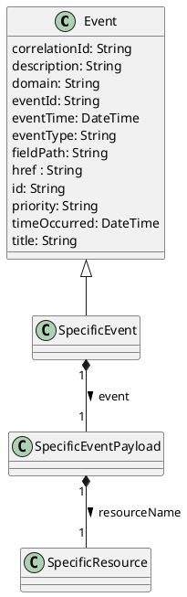

[Image: TM Forum logo.]

# TM Forum Specification

## Agreement Management

**TMF651**

|                     |          |                     |          |
| :------------------ | :------- | :------------------ | :------- |
| **Maturity Level:** | TBD      | **Team Approved Date:** | TBD      |
| **Release Status:** | TBD      | **Approval Status:**  | TBD      |
| **Version**         | TBD      | **IPR Mode:**         | RAND     |

TM Forum 2024. All Rights Reserved.
tmforum.org

***

Agreement Management
[Image: TM Forum logo.]

## NOTICE

Copyright © TM Forum 2024. All Rights Reserved.

This document and translations of it may be copied and furnished to others, and derivative works that comment on or otherwise explain it or assist in its implementation may be prepared, copied, published, and distributed, in whole or in part, without restriction of any kind, provided that the above copyright notice and this section are included on all such copies and derivative works. However, this document itself may not be modified in any way, including by removing the copyright notice or references to TM FORUM, except as needed for the purpose of developing any document or deliverable produced by a TM FORUM Collaboration Project Team (in which case the rules applicable to copyrights, as set forth in the TM FORUM IPR Policy, must be followed) or as required to translate it into languages other than English.

The limited permissions granted above are perpetual and will not be revoked by TM FORUM or its successors or assigns.

This document and the information contained herein is provided on an "AS IS" basis and TM FORUM DISCLAIMS ALL WARRANTIES, EXPRESS OR IMPLIED, INCLUDING BUT NOT LIMITED TO ANY WARRANTY THAT THE USE OF THE INFORMATION HEREIN WILL NOT INFRINGE ANY OWNERSHIP RIGHTS OR ANY IMPLIED WARRANTIES OF MERCHANTABILITY OR FITNESS FOR A PARTICULAR PURPOSE.

Direct inquiries to the TM Forum office:

181 New Road, Suite 304
Parsippany, NJ 07054, USA
Tel No. +1 862 227 1648
TM Forum Web Page: www.tmforum.org

TM Forum 2024. All Rights Reserved.
Page i
tmforum.org

***

Agreement Management
[Image: TM Forum logo.]

## Table of Contents

*   NOTICE........................................................................... i
*   Introduction................................................................... 1
*   SAMPLE USE CASES................................................................. 2
*   Support of polymorphism and extension patterns............................................... 3
*   RESOURCE MODEL................................................................... 4
    *   Managed Entity and Task Resource Models................................................ 4
    *   Agreement resource............................................................... 4
    *   AgreementSpecification resource..................................................... 24
    *   Notification Resource Models........................................................ 41
        *   Agreement...................................................................... 42
        *   AgreementSpecification............................................................. 47
*   API OPERATIONS.................................................................. 51
    *   Operations on Agreement............................................................ 51
        *   Retrieves a Agreement by ID...................................................... 51
        *   List or find Agreement objects..................................................... 53
        *   Creates a Agreement............................................................ 54
        *   Updates partially a Agreement.................................................... 58
        *   Deletes a Agreement............................................................ 67
    *   Operations on AgreementSpecification................................................... 67
        *   Retrieves a AgreementSpecification by ID........................................... 67
        *   List or find AgreementSpecification objects........................................ 68
        *   Creates a AgreementSpecification................................................... 69
        *   Updates partially a AgreementSpecification......................................... 70
        *   Deletes a AgreementSpecification................................................. 76
*   API NOTIFICATIONS............................................................... 77
    *   Register listener................................................................ 77
    *   Unregister listener.............................................................. 78
    *   Publish Event to listener........................................................ 78
*   Acknowledgements............................................................... 80
*   Release History.................................................................. 80
*   Contributors to Document........................................................... 80

TM Forum 2024. All Rights Reserved.
Page ii
tmforum.org

***

Agreement Management
[Image: TM Forum logo.]

## Introduction

The Agreement API provides standardized mechanism for managing agreements, especially in the context on partnerships between partners.

The API allows creation, update and query of *agreement* instances as well as creation, update and query of *agreement specifications* – serving as templates for agreement instances.

The following APIs are typically used in conjunction with this API:

*   Product Catalog Management API to refer to the product offerings that are linked to the agreements or agreement specifications. This will be particularly relevant for Product Agreements, that will be generated using the ProductAgreementItem subclass.
*   Party Management API to refer to the engaged parties that have signed agreements

TM Forum 2024. All Rights Reserved.
Page 1
tmforum.org

***

Agreement Management
[Image: TM Forum logo.]

## SAMPLE USE CASES

Relevant examples of use cases for this API can be found in the Partnership Management API – Use Case section. In the partnership API, Partnership Specifications typically declare Agreement Specifications, and Partnership instances declare Party Roles instances that declare the Agreements that apply to them.

TM Forum 2024. All Rights Reserved.
Page 2
tmforum.org

***

Agreement Management
[Image: TM Forum logo.]

## Support of polymorphism and extension patterns

Support of polymorphic collections and types and schema based extension is provided by means of a list of generic meta-attributes that we describe below. Polymorphism in collections occurs when entities inherit from base entities, for instance a PrivacyAgreement inheriting properties from the Agreement entity.

Generic support of polymorphism and pattern extensions is described in the TMF API Guidelines v5.0 Part 2 document.

The @type attribute provides a way to represent the actual class type of an entity. For example, within a list of Agreement instances we might find instances of:

*   **Agreement** itself - this is a concrete not an abstract class
*   **PrivacyAgreement** - a subclass of Agreement that has additional information relating the agreement specifically to a Party Privacy profile.

Additionally, the list of AgreementItem within the Agreement can itself be polymorphic, with subentities of type:

*   **AgreementItem** itself - this is a base class that contains only textual terms and conditions
*   **ProductAgreementItem** - this is a subclass of AgreementItem that refers to a product in the inventory or in the catalog

The @type gives this information. All resources and sub-resources of this API must have a @type attributes that must be populated.

The @referredType must be used within reference entities (like for instance an AgreementRef object) to explicitly denote the actual entity type of the referred class. Notice that in reference entities the @type denotes the class type of the reference itself, such as AgreementRef or PrivacyAgreementRef, and not the class type of the referred object.

The @schemaLocation property can be used in resources to allow specifying user-defined properties of an Entity or to specify the expected *characteristics* of an entity.

The @baseType attribute gives a way to provide explicitly the base of class of a given resource that has been extended.

TM Forum 2024. All Rights Reserved.
Page 3
tmforum.org

***

Agreement Management
[Image: TM Forum logo.]

## RESOURCE MODEL

### Managed Entity and Task Resource Models

#### Agreement resource

An agreement represents a contract or arrangement, either written or verbal and sometimes enforceable by law, such as a service level agreement or a customer price agreement. An agreement involves a number of other business entities, such as products, services, and resources and/or their specifications.

##### Resource model



```plantuml
@startuml
skinparam classAttributeIconSize 0

abstract class Characteristic <<Resource (entry point)>> {
  id: String
  **name**: String
  valueType: String
  @baseType: String
  @schemaLocation: String
  **@type**: String
}
class BooleanArrayCharacteristic extends Characteristic {}
class BooleanCharacteristic extends Characteristic {}
class FloatArrayCharacteristic extends Characteristic {}
class FloatCharacteristic extends Characteristic {}
class IntegerArrayCharacteristic extends Characteristic {}
class IntegerCharacteristic extends Characteristic {}
class MapAnyCharacteristicValue extends Characteristic {}
class NumberArrayCharacteristic extends Characteristic {}
class NumberCharacteristic extends Characteristic {}
class ObjectArrayCharacteristic extends Characteristic {}
class ObjectCharacteristic extends Characteristic {}
class StringArrayCharacteristic extends Characteristic {}
class StringCharacteristic extends Characteristic {}

class CharacteristicRelationship <<Sub-resource>> {
  **id**: String
  **relationshipType**: String
  @baseType: String
  @schemaLocation: String
  **@type**: String
}

abstract class AttachmentRefOrValue <<Sub-resource (reference entity)>> {
  discriminator: Attachment, AttachmentRef
}
class Attachment extends AttachmentRefOrValue {
  **attachmentType**: String
  content: Base64
  description: String
  href: String
  id: String
  **mimeType**: String
  name: String
  size: Quantity
  url: String
  validFor: TimePeriod
  @baseType: String
  @schemaLocation: String
  **@type** = Attachment
}
class AttachmentRef extends AttachmentRefOrValue {
  description: String
  href: String
  **id**: String
  name: String
  url: String
  @baseType: String
  @referredType: String
  @schemaLocation: String
  **@type** = AttachmentRef
}

abstract class PartyRefOrPartyRoleRef <<Sub-resource (reference entity)>> {
  discriminator: PartyRef, PartyRoleRef
}
class PartyRef extends PartyRefOrPartyRoleRef {
  href: String
  **id**: String
  name: String
  @baseType: String
  @referredType: String
  @schemaLocation: String
  **@type** = PartyRef
}
class PartyRoleRef extends PartyRefOrPartyRoleRef {
  href: String
  **id**: String
  name: String
  partyId: String
  partyName: String
  @baseType: String
  @referredType: String
  @schemaLocation: String
  **@type** = PartyRoleRef
}

class RelatedPartyRefOrPartyRoleRef <<Sub-resource>> {
  **role**: String
  @baseType: String
  @schemaLocation: String
  **@type**: String
}

class ExternalIdentifier <<Sub-resource>> {
  externalIdentifierType: String
  **id**: String
  owner: String
  @baseType: String
  @schemaLocation: String
  **@type**: String
}

class AgreementRelationship <<Sub-resource>> {
  href: String
  **id**: String
  name: String
  relationshipType: String
  validFor: TimePeriod
  @baseType: String
  @referredType: String
  @schemaLocation: String
  **@type**: String
}

class AgreementSpecificationRef <<Sub-resource (reference entity)>> {
  description: String
  href: String
  **id**: String
  name: String
  version: String
  @baseType: String
  @referredType: String
  @schemaLocation: String
  **@type**: String
}

abstract class AgreementItem <<Sub-resource>> {
  **id**: String
  @baseType: String
  @schemaLocation: String
  **@type**: String
  discriminator: AgreementItem, ProductAgreementItem
}
class ProductAgreementItem extends AgreementItem {}

abstract class RelatedDocumentRefOrValue <<Sub-resource (reference entity)>> {
  **role**: String
  @baseType: String
  @schemaLocation: String
  **@type**: String
  discriminator: DocumentRef, Document
}
class DocumentRef extends RelatedDocumentRefOrValue {
 href: String
 **id**: String
 name: String
 @baseType: String
 @referredType: String
 @schemaLocation: String
 **@type** = DocumentRef
}
class Document extends RelatedDocumentRefOrValue {
 attachment: AttachmentRefOrValue [0..*]
 category: CategoryRef [0..*]
 characteristic: Characteristic [0..*]
 creationDate: DateTime
 description: String
 documentRelationship: DocumentRef [0..*]
 documentSpecification: DocumentSpecification
 documentType: String
 href: String
 id: String
 lastUpdate: DateTime
 lifecycleState: String
 **name**: String
 relatedEntity: RelatedEntity
 relatedParty: RelatedPartyRefOrPartyRoleRef [0..*]
 version: String
 @baseType: String
 @schemaLocation: String
 **@type** = Document
}


class AgreementTermOrCondition <<Sub-resource>> {
  description: String
  id: String
  validFor: TimePeriod
  @baseType: String
  @schemaLocation: String
  **@type**: String
}

class AgreementAuthorization <<Sub-resource>> {
  date: DateTime
  id: String
  signatureRepresentation: String
  state: String
  @baseType: String
  @schemaLocation: String
  **@type**: String
}

enum AgreementStatusExampleType <<Enumeration>> {
  approved
  inProgress
  validated
  rejected
  initialized
}

class Agreement <<Resource (entry point)>> {
  agreementPeriod: TimePeriod
  **agreementType**: String
  completionDate: TimePeriod
  description: String
  href: String
  id: String
  initialDate: DateTime
  **name**: String
  statementOfIntent: String
  status: String
  version: String
  @baseType: String
  @schemaLocation: String
  **@type**: String
}


Agreement "1" *-- "0..*" ExternalIdentifier : externalIdentifier >
Agreement "1" *-- "0..*" AgreementRelationship : agreementRelationship >
Agreement "1" *-- "0..1" AgreementSpecificationRef : agreementSpecification >
Agreement "1" *-- "1..*" AgreementItem : agreementItem >
Agreement "1" *-- "0..*" Characteristic : characteristic >
Agreement "1" *-- "0..*" RelatedDocumentRefOrValue : relatedDocument >
Agreement "1" *-- "0..1" AgreementAuthorization : agreementAuthorization >
Agreement "1" -- "0..*" RelatedPartyRefOrPartyRoleRef : relatedParty >
Agreement "1" -- "1..*" RelatedPartyRefOrPartyRoleRef : engagedParty >
Agreement "1" -- AgreementStatusExampleType : status

Characteristic "1" -- "0..*" CharacteristicRelationship : characteristicRelationship >

AgreementItem "1" -- "0..*" AgreementTermOrCondition : termOrCondition >

AgreementAuthorization "1" -- "0..1" AttachmentRefOrValue : signature >
AgreementAuthorization "1" -- "0..1" PartyRefOrPartyRoleRef : party >

RelatedPartyRefOrPartyRoleRef "1" -- "1" PartyRefOrPartyRoleRef : partyOrPartyRole >

RelatedDocumentRefOrValue "1" -- "0..1" DocumentRefOrValue : document >

' Relationships from Figure 2 (Document) are implicitly included here via Document class
'Document "1" *-- "0..*" DocumentRef : documentRelationship >
'Document "1" *-- "0..1" DocumentSpecification : documentSpecification >
'Document "1" *-- "0..*" CategoryRef : category >
'Document "1" *-- "0..*" RelatedPartyRefOrPartyRoleRef : relatedParty >
'Document "1" *-- "0..*" Characteristic : characteristic >
'Document "1" *-- "0..*" AttachmentRefOrValue : attachment >
'Document "1" *-- "0..*" RelatedEntity : relatedEntity >
@enduml
```

**Figure 1 - Agreement**

TM Forum 2024. All Rights Reserved.
Page 5
tmforum.org

***

Agreement Management
[Image: TM Forum logo.]

```plantuml
@startuml
skinparam classAttributeIconSize 0

abstract class AttachmentRefOrValue <<Sub-resource (reference entity)>> {
  discriminator: Attachment, AttachmentRef
}
class Attachment extends AttachmentRefOrValue <<Sub-resource>> {
  **attachmentType**: String
  content: Base64
  description: String
  href: String
  id: String
  **mimeType**: String
  name: String
  size: Quantity
  url: String
  validFor: TimePeriod
  @baseType: String
  @schemaLocation: String
  **@type** = Attachment
}
class AttachmentRef extends AttachmentRefOrValue <<Sub-resource (reference entity)>> {
  description: String
  href: String
  **id**: String
  name: String
  url: String
  @baseType: String
  @referredType: String
  @schemaLocation: String
  **@type** = AttachmentRef
}

abstract class Characteristic <<Sub-resource (sub-graph in current diagram)>> {
  id: String
  **name**: String
  valueType: String
  @baseType: String
  @schemaLocation: String
  **@type**: String
  discriminator: FloatCharacteristic, BooleanArrayCharacteristic, Characteristic, ObjectArrayCharacteristic, MapAnyCharacteristicValue, FloatArrayCharacteristic, StringCharacteristic, ObjectCharacteristic, NumberCharacteristic, BooleanCharacteristic, NumberArrayCharacteristic, IntegerCharacteristic, StringArrayCharacteristic, IntegerArrayCharacteristic
}
class CharacteristicRelationship <<Sub-resource>> {
  **id**: String
  **relationshipType**: String
  @baseType: String
  @schemaLocation: String
  **@type**: String
}
Characteristic "1" -- "0..*" CharacteristicRelationship : characteristicRelationship >

class CategoryRef <<Sub-resource (reference entity)>> {
  href: String
  **id**: String
  name: String
  version: String
  @baseType: String
  @referredType: String
  @schemaLocation: String
  **@type**: String
}

class DocumentSpecification <<Sub-resource (reference entity)>> {
  URL: String
  **id**: String
  name: String
  version: String
  @baseType: String
  @schemaLocation: String
  **@type**: String
}

class DocumentRef <<Sub-resource (reference entity)>> {
  href: String
  **id**: String
  name: String
  @baseType: String
  @referredType: String
  @schemaLocation: String
  **@type** = DocumentRef
}

abstract class PartyRefOrPartyRoleRef <<Sub-resource (reference entity)>> {
  discriminator: PartyRef, PartyRoleRef
}
class PartyRef extends PartyRefOrPartyRoleRef <<Sub-resource (reference entity)>> {
  href: String
  **id**: String
  name: String
  @baseType: String
  @referredType: String
  @schemaLocation: String
  **@type** = PartyRef
}
class PartyRoleRef extends PartyRefOrPartyRoleRef <<Sub-resource (reference entity)>> {
  href: String
  **id**: String
  name: String
  partyId: String
  partyName: String
  @baseType: String
  @referredType: String
  @schemaLocation: String
  **@type** = PartyRoleRef
}

class RelatedPartyRefOrPartyRoleRef <<Sub-resource>> {
  **role**: String
  @baseType: String
  @schemaLocation: String
  **@type**: String
}
RelatedPartyRefOrPartyRoleRef "1" -- "0..1" PartyRefOrPartyRoleRef : partyOrPartyRole >

class EntityRef <<Sub-resource (reference entity)>> {
    href : String
    **id**: String
    name : String
    @baseType : String
    @referredType : String
    @schemaLocation : String
    **@type**: String
}

class RelatedEntity <<Sub-resource>> {
  **role**: String
  @baseType: String
  @schemaLocation: String
  **@type**: String
}
RelatedEntity "1" -- "0..1" EntityRef : entity >


class Document <<Resource (entry point)>> {
 creationDate: DateTime
 description: String
 documentType: String
 href: String
 id: String
 lastUpdate: DateTime
 lifecycleState: String
 **name**: String
 version: String
 @baseType: String
 @schemaLocation: String
 **@type** = Document
}

Document "1" *-- "0..*" DocumentRef : documentRelationship <
Document "1" -- "0..1" DocumentSpecification : documentSpecification >
Document "1" *-- "0..*" CategoryRef : category >
Document "1" *-- "0..*" RelatedPartyRefOrPartyRoleRef : relatedParty >
Document "1" *-- "0..*" Characteristic : characteristic >
Document "1" *-- "0..*" AttachmentRefOrValue : attachment >
Document "1" *-- "0..*" RelatedEntity : relatedEntity >

@enduml
```

**Figure 2 - Document**

### Field descriptions

TM Forum 2024. All Rights Reserved.
tmforum.org
Page 6

***

Agreement Management
[Image: TM Forum logo.]

### Agreement fields

| Field Name               | Description                                                                                                                                                                                                                                                                                                                                                                                               |
| :----------------------- | :-------------------------------------------------------------------------------------------------------------------------------------------------------------------------------------------------------------------------------------------------------------------------------------------------------------------------------------------------------------------------------------------------------- |
| agreementAuthorization | An AgreementAuthorization. An authorization by a business participant that is responsible for approving the agreement.                                                                                                                                                                                                                                                                                      |
| agreementItem            | An AgreementItem. A clause of the agreement containing specific terms and conditions. The clause may refer to specific products that are owned by parties to the agreement, or product offerings that will be supplied to parties under the terms of the agreement. <br> AgreementItem can be instanciated as <br> \* ProductAgreementItem                                                                     |
| agreementPeriod          | A TimePeriod. A period of time, either as a deadline (endDateTime only) a startDateTime only, or both.                                                                                                                                                                                                                                                                                                    |
| agreementRelationship    | An AgreementRelationship. A uni-directionmal relationship from this agreement to another agreement.                                                                                                                                                                                                                                                                                                         |
| agreementSpecification   | An AgreementSpecificationRef. Agreement specification reference. An AgreementSpecification represents a template of an agreement that can be used when establishing partnerships.                                                                                                                                                                                                                            |
| agreementType            | A String. The type of the agreement. For example commercial.                                                                                                                                                                                                                                                                                                                                              |
| characteristic           | A Characteristic. Describes a given characteristic of an object or entity through a name/value pair. This is an abstract base class, the actual value is in one of the strongly-typed subclasses : StringCharacteristic, ObjectCharacteristic, FloatCharacteristic, Boolean Characteristic, NumberCharacteristic, IntegerCharacteristic, StringArrayCharacteristic, ObjectArrayCharacteristic, BooleanArrayCharacteristic, NumberArrayCharacteristic, IntegerArrayCharacteristic... <br> Characteristic can be instanciated as <br> \* BooleanArrayCharacteristic <br> \* Boolean Characteristic <br> \* FloatArrayCharacteristic <br> \* FloatCharacteristic <br> \* IntegerArrayCharacteristic <br> \* IntegerCharacteristic <br> \* MapAnyCharacteristic Value <br> \* NumberArrayCharacteristic <br> \* NumberCharacteristic <br> \* ObjectArrayCharacteristic <br> \* ObjectCharacteristic <br> \* StringArrayCharacteristic <br> \* StringCharacteristic |
| completionDate           | A TimePeriod. A period of time, either as a deadline (endDateTime only) a startDateTime only, or both.                                                                                                                                                                                                                                                                                                    |
| description              | A String. Narrative that explains the agreement and details about it, such as why the agreement is taking place.                                                                                                                                                                                                                                                                                          |
| engagedParty             | A PartyRefOrPartyRoleRef.                                                                                                                                                                                                                                                                                                                                                                                 |
| externalIdentifier       | An ExternalIdentifier. An identification of an entity that is owned by or originates in a software system different from the current system, for example a ProductOrder handed off from a commerce platform into an order handling system. The structure identifies the system itself, the nature of the entity within the system (e.g. class name) and the unique ID of the entity within the system. It is anticipated that multiple external IDs can be held for a single entity, e.g. if the entity passed through multiple systems on the way to the current system. In this case the consumer is expected to sequence the IDs in the array in reverse order of provenance, i.e. most recent system first in the list. |
| href                     | A String. Hyperlink reference.                                                                                                                                                                                                                                                                                                                                                                            |
| id                       | A String. Unique identifier.                                                                                                                                                                                                                                                                                                                                                                              |
| initialDate              | A DateTime. Date at which the agreement was initialized.                                                                                                                                                                                                                                                                                                                                                  |
| name                     | A String. A human-readable name for the agreement.                                                                                                                                                                                                                                                                                                                                                        |
| relatedDocument          | A RelatedDocumentRefOrValue. Entity reference. The polymorphic attributes @type, @schemaLocation & @referredType are related to the DocumentRefOrValue entity and not the RelatedDocumentRefOrValue class itself.                                                                                                                                                                                       |
| relatedParty             | A RelatedPartyRefOrPartyRoleRef. RelatedParty reference. A related party defines party or party role or its reference, linked to a specific entity.                                                                                                                                                                                                                                                      |
| statementOfIntent        | A String. An overview and goals of the Agreement.                                                                                                                                                                                                                                                                                                                                                         |
| status                   | A String. The current status of the agreement. Typical values are: in process, approved, rejected.                                                                                                                                                                                                                                                                                                        |
| version                  | A String. A string identifying the version of the agreement.                                                                                                                                                                                                                                                                                                                                              |
| @baseType                | A String. When sub-classing, this defines the super-class.                                                                                                                                                                                                                                                                                                                                                |
| @schemaLocation          | A String. A URI to a JSON-Schema file that defines additional attributes and relationships.                                                                                                                                                                                                                                                                                                             |
| @type                    | A String. When sub-classing, this defines the sub-class Extensible name.                                                                                                                                                                                                                                                                                                                                  |

TM Forum 2024. All Rights Reserved.
tmforum.org
Page 7

***

### AgreementItem sub-resource fields

| Field Name      | Description                                                                                                                                                                                                                                                        |
| :-------------- | :----------------------------------------------------------------------------------------------------------------------------------------------------------------------------------------------------------------------------------------------------------------- |
| id              | A String. Locally-unique identifier of the Agreement item within the agreement (such as a sequence number 01, 02, 03, ...; or clauses and sub-clauses 1, 1.1, 1.2, ...).                                                                                            |
| termOrCondition | An AgreementTermOrCondition. Aspects of the agreement not formally specified elsewhere in the agreement and that cannot be captured elsewhere in a formal notation, or automatically monitored and require a more human level of management.                        |
| @baseType       | A String. When sub-classing, this defines the super-class.                                                                                                                                                                                                         |
| @schemaLocation | A String. A URI to a JSON-Schema file that defines additional attributes and relationships.                                                                                                                                                                      |
| @type           | A String. When sub-classing, this defines the sub-class Extensible name. <br> AgreementItem can be instanciated as <br> \* ProductAgreementItem                                                                                                                    |
| product         | This property is present in subclasses                                                                                                                                                                                                                             |
| productOffering | This property is present in subclasses                                                                                                                                                                                                                             |

### ProductAgreementItem sub-resource fields

| Field Name      | Description                                                                                                                                                                                                                            |
| :-------------- | :------------------------------------------------------------------------------------------------------------------------------------------------------------------------------------------------------------------------------------- |
| id              | A String. Locally-unique identifier of the Product Agreement item within the agreement (such as a sequence number 01, 02, 03, ... ; or clauses and sub-clauses 1, 1.1, 1.2, ...).                                                      |
| product         | A ProductRef. A Product reference.                                                                                                                                                                                                     |
| productOffering | A ProductOfferingRef. ProductOffering reference. A product offering represents entities that are orderable from the provider of the catalog, this resource includes pricing information.                                              |
| termOrCondition | An AgreementTermOrCondition. Aspects of the agreement not formally specified elsewhere in the agreement and that cannot be captured elsewhere in a formal notation, or automatically monitored and require a more human level of management. |
| @baseType       | A String. When sub-classing, this defines the super-class.                                                                                                                                                                             |
| @schemaLocation | A String. A URI to a JSON-Schema file that defines additional attributes and relationships.                                                                                                                                          |
| @type           | A String. When sub-classing, this defines the sub-class Extensible name.                                                                                                                                                               |

### ExternalIdentifier sub-resource fields

| Field Name             | Description                                                                              |
| :--------------------- | :--------------------------------------------------------------------------------------- |
| externalIdentifierType | A String. Type of the identification, typically would be the type of the entity within the external system. |
| id                     | A String. Identification of the entity within the external system.                       |
| owner                  | A String. Name of the external system that owns the entity.                              |
| @baseType              | A String. When sub-classing, this defines the super-class.                               |
| @schemaLocation        | A String. A URI to a JSON-Schema file that defines additional attributes and relationships. |
| @type                  | A String. When sub-classing, this defines the sub-class Extensible name.                 |

### Characteristic sub-resource fields

| Field Name                | Description                                                                                                                                                                                                                                                                                                                                                                                                                                                  |
| :------------------------ | :----------------------------------------------------------------------------------------------------------------------------------------------------------------------------------------------------------------------------------------------------------------------------------------------------------------------------------------------------------------------------------------------------------------------------------------------------------- |
| characteristicRelationship| A CharacteristicRelationship. Another Characteristic that is related to the current Characteristic;.                                                                                                                                                                                                                                                                                                                                                           |
| id                        | A String. Unique identifier of the characteristic.                                                                                                                                                                                                                                                                                                                                                                                                             |
| name                      | A String. Name of the characteristic.                                                                                                                                                                                                                                                                                                                                                                                                                          |
| valueType                 | A String. Data type of the value of the characteristic.                                                                                                                                                                                                                                                                                                                                                                                                        |
| @baseType                 | A String. When sub-classing, this defines the super-class.                                                                                                                                                                                                                                                                                                                                                                                                     |
| @schemaLocation           | A String. A URI to a JSON-Schema file that defines additional attributes and relationships.                                                                                                                                                                                                                                                                                                                                                                   |
| @type                     | A String. When sub-classing, this defines the sub-class Extensible name. <br> Characteristic can be instanciated as <br> \* BooleanArrayCharacteristic <br> \* BooleanCharacteristic <br> \* FloatArrayCharacteristic <br> \* FloatCharacteristic <br> \* IntegerArrayCharacteristic <br> \* IntegerCharacteristic <br> \* MapAnyCharacteristicValue <br> \* NumberArrayCharacteristic <br> \* NumberCharacteristic <br> \* ObjectArrayCharacteristic <br> \* ObjectCharacteristic <br> \* StringArrayCharacteristic <br> \* StringCharacteristic |
| value                     | This property is present in subclasses                                                                                                                                                                                                                                                                                                                                                                                                                       |

### FloatCharacteristic sub-resource fields

| Field Name                | Description                                                                                       |
| :------------------------ | :------------------------------------------------------------------------------------------------ |
| characteristicRelationship| A Characteristic Relationship. Another Characteristic that is related to the current Characteristic;. |
| id                        | A String. Unique identifier of the characteristic.                                                |
| name                      | A String. Name of the characteristic.                                                             |
| value                     | A Float. Value of the characteristic.                                                             |
| valueType                 | A String. Data type of the value of the characteristic.                                           |
| @baseType                 | A String. When sub-classing, this defines the super-class.                                        |
| @schemaLocation           | A String. A URI to a JSON-Schema file that defines additional attributes and relationships.        |
| @type                     | A String. When sub-classing, this defines the sub-class Extensible name.                          |

### BooleanArrayCharacteristic sub-resource fields

| Field Name                | Description                                                                                       |
| :------------------------ | :------------------------------------------------------------------------------------------------ |
| characteristicRelationship| A Characteristic Relationship. Another Characteristic that is related to the current Characteristic;. |
| id                        | A String. Unique identifier of the characteristic.                                                |
| name                      | A String. Name of the characteristic.                                                             |
| value                     | A Boolean. A characteristic which value is an array of Boolean(s).                                |
| valueType                 | A String. Data type of the value of the characteristic.                                           |
| @baseType                 | A String. When sub-classing, this defines the super-class.                                        |
| @schemaLocation           | A String. A URI to a JSON-Schema file that defines additional attributes and relationships.        |
| @type                     | A String. When sub-classing, this defines the sub-class Extensible name.                          |

### ObjectArrayCharacteristic sub-resource fields

| Field Name                | Description                                                                                       |
| :------------------------ | :------------------------------------------------------------------------------------------------ |
| characteristicRelationship| A CharacteristicRelationship. Another Characteristic that is related to the current Characteristic;. |
| id                        | A String. Unique identifier of the characteristic.                                                |
| name                      | A String. Name of the characteristic.                                                             |
| value                     | An object. Collection of characteristic values.                                                   |
| valueType                 | A String. Data type of the value of the characteristic.                                           |
| @baseType                 | A String. When sub-classing, this defines the super-class.                                        |
| @schemaLocation           | A String. A URI to a JSON-Schema file that defines additional attributes and relationships.        |
| @type                     | A String. When sub-classing, this defines the sub-class Extensible name.                          |

### MapAnyCharacteristicValue sub-resource fields

| Field Name                | Description                                                                                    |
| :------------------------ | :--------------------------------------------------------------------------------------------- |
| characteristicRelationship| A CharacteristicRelationship. Another Characteristic that is related to the current Characteristic;. |
| id                        | A String. Unique identifier of the characteristic.                                             |
| name                      | A String. Name of the characteristic.                                                          |
| value                     | An object. Value of the characteristic.                                                        |
| valueType                 | A String. Data type of the value of the characteristic.                                        |
| @baseType                 | A String. When sub-classing, this defines the super-class.                                     |
| @schemaLocation           | A String. A URI to a JSON-Schema file that defines additional attributes and relationships.     |
| @type                     | A String. When sub-classing, this defines the sub-class Extensible name.                       |

### FloatArrayCharacteristic sub-resource fields

| Field Name                | Description                                                                                      |
| :------------------------ | :----------------------------------------------------------------------------------------------- |
| characteristicRelationship| A CharacteristicRelationship. Another Characteristic that is related to the current Characteristic;. |
| id                        | A String. Unique identifier of the characteristic.                                               |
| name                      | A String. Name of the characteristic.                                                            |
| value                     | A Float. A characteristic which value is an array of Float(s).                                   |
| valueType                 | A String. Data type of the value of the characteristic.                                          |
| @baseType                 | A String. When sub-classing, this defines the super-class.                                       |
| @schemaLocation           | A String. A URI to a JSON-Schema file that defines additional attributes and relationships.       |
| @type                     | A String. When sub-classing, this defines the sub-class Extensible name.                         |

### StringCharacteristic sub-resource fields

| Field Name                | Description                                                                                       |
| :------------------------ | :------------------------------------------------------------------------------------------------ |
| characteristicRelationship| A Characteristic Relationship. Another Characteristic that is related to the current Characteristic;. |
| id                        | A String. Unique identifier of the characteristic.                                                |
| name                      | A String. Name of the characteristic.                                                             |
| value                     | A String. Value of the characteristic.                                                            |
| valueType                 | A String. Data type of the value of the characteristic.                                           |
| @baseType                 | A String. When sub-classing, this defines the super-class.                                        |
| @schemaLocation           | A String. A URI to a JSON-Schema file that defines additional attributes and relationships.        |
| @type                     | A String. When sub-classing, this defines the sub-class Extensible name.                          |

### ObjectCharacteristic sub-resource fields

| Field Name                | Description                                                                                       |
| :------------------------ | :------------------------------------------------------------------------------------------------ |
| characteristicRelationship| A Characteristic Relationship. Another Characteristic that is related to the current Characteristic;. |
| id                        | A String. Unique identifier of the characteristic.                                                |
| name                      | A String. Name of the characteristic.                                                             |
| value                     | An object. Value of the characteristic.                                                           |
| valueType                 | A String. Data type of the value of the characteristic.                                           |
| @baseType                 | A String. When sub-classing, this defines the super-class.                                        |
| @schemaLocation           | A String. A URI to a JSON-Schema file that defines additional attributes and relationships.        |
| @type                     | A String. When sub-classing, this defines the sub-class Extensible name.                          |

### NumberCharacteristic sub-resource fields

| Field Name                | Description                                                                                       |
| :------------------------ | :------------------------------------------------------------------------------------------------ |
| characteristicRelationship| A Characteristic Relationship. Another Characteristic that is related to the current Characteristic;. |
| id                        | A String. Unique identifier of the characteristic.                                                |
| name                      | A String. Name of the characteristic.                                                             |
| value                     | A Number. Value of the characteristic.                                                            |
| valueType                 | A String. Data type of the value of the characteristic.                                           |
| @baseType                 | A String. When sub-classing, this defines the super-class.                                        |
| @schemaLocation           | A String. A URI to a JSON-Schema file that defines additional attributes and relationships.        |
| @type                     | A String. When sub-classing, this defines the sub-class Extensible name.                          |

### Boolean Characteristic sub-resource fields

| Field Name                | Description                                                                                       |
| :------------------------ | :------------------------------------------------------------------------------------------------ |
| characteristicRelationship| A CharacteristicRelationship. Another Characteristic that is related to the current Characteristic;. |
| id                        | A String. Unique identifier of the characteristic.                                                |
| name                      | A String. Name of the characteristic.                                                             |
| value                     | A Boolean. Value of the characteristic.                                                           |
| valueType                 | A String. Data type of the value of the characteristic.                                           |
| @baseType                 | A String. When sub-classing, this defines the super-class.                                        |
| @schemaLocation           | A String. A URI to a JSON-Schema file that defines additional attributes and relationships.        |
| @type                     | A String. When sub-classing, this defines the sub-class Extensible name.                          |

### NumberArrayCharacteristic sub-resource fields

| Field Name                | Description                                                                                      |
| :------------------------ | :----------------------------------------------------------------------------------------------- |
| characteristicRelationship| A Characteristic Relationship. Another Characteristic that is related to the current Characteristic;. |
| id                        | A String. Unique identifier of the characteristic.                                               |
| name                      | A String. Name of the characteristic.                                                            |
| value                     | A Number. A characteristic which value is an array of Number(s).                                 |
| valueType                 | A String. Data type of the value of the characteristic.                                          |
| @baseType                 | A String. When sub-classing, this defines the super-class.                                       |
| @schemaLocation           | A String. A URI to a JSON-Schema file that defines additional attributes and relationships.       |
| @type                     | A String. When sub-classing, this defines the sub-class Extensible name.                         |

### IntegerCharacteristic sub-resource fields

| Field Name                | Description                                                                                       |
| :------------------------ | :------------------------------------------------------------------------------------------------ |
| characteristicRelationship| A CharacteristicRelationship. Another Characteristic that is related to the current Characteristic;. |
| id                        | A String. Unique identifier of the characteristic.                                                |
| name                      | A String. Name of the characteristic.                                                             |
| value                     | An Integer. Value of the characteristic.                                                          |
| valueType                 | A String. Data type of the value of the characteristic.                                           |
| @baseType                 | A String. When sub-classing, this defines the super-class.                                        |
| @schemaLocation           | A String. A URI to a JSON-Schema file that defines additional attributes and relationships.        |
| @type                     | A String. When sub-classing, this defines the sub-class Extensible name.                          |

### StringArrayCharacteristic sub-resource fields

| Field Name                | Description                                                                                       |
| :------------------------ | :------------------------------------------------------------------------------------------------ |
| characteristicRelationship| A CharacteristicRelationship. Another Characteristic that is related to the current Characteristic;. |
| id                        | A String. Unique identifier of the characteristic.                                                |
| name                      | A String. Name of the characteristic.                                                             |
| value                     | A String. Collection of string characteristics.                                                   |
| valueType                 | A String. Data type of the value of the characteristic.                                           |
| @baseType                 | A String. When sub-classing, this defines the super-class.                                        |
| @schemaLocation           | A String. A URI to a JSON-Schema file that defines additional attributes and relationships.        |
| @type                     | A String. When sub-classing, this defines the sub-class Extensible name.                          |

### IntegerArrayCharacteristic sub-resource fields

| Field Name                | Description                                                                                      |
| :------------------------ | :----------------------------------------------------------------------------------------------- |
| characteristicRelationship| A Characteristic Relationship. Another Characteristic that is related to the current Characteristic;. |
| id                        | A String. Unique identifier of the characteristic.                                               |
| name                      | A String. Name of the characteristic.                                                            |
| value                     | An Integer. A characteristic which value is an array of Integer(s).                              |
| valueType                 | A String. Data type of the value of the characteristic.                                          |
| @baseType                 | A String. When sub-classing, this defines the super-class.                                       |
| @schemaLocation           | A String. A URI to a JSON-Schema file that defines additional attributes and relationships.       |
| @type                     | A String. When sub-classing, this defines the sub-class Extensible name.                         |

### RelatedPartyRefOrPartyRoleRef sub-resource fields

| Field Name        | Description              |
| :---------------- | :----------------------- |
| partyOrPartyRole  | A PartyRefOrPartyRoleRef. |
| role              | A String. Role played by the related party or party role in the context of the specific entity it is linked to. Such as 'initiator', 'customer', 'salesAgent', 'user'. |
| @baseType         | A String. When sub-classing, this defines the super-class. |
| @schemaLocation   | A String. A URI to a JSON-Schema file that defines additional attributes and relationships. |
| @type             | A String. When sub-classing, this defines the sub-class Extensible name. |

### AgreementAuthorization sub-resource fields

| Field Name             | Description                                                                                                                                                                 |
| :--------------------- | :-------------------------------------------------------------------------------------------------------------------------------------------------------------------------- |
| date                   | A DateTime. The date associated with the authorization state.                                                                                                               |
| id                     | A String. Locally unique index allowing a specific authorization to be addressed in the list of authorizations.                                                              |
| party                  | A PartyRefOrPartyRoleRef.                                                                                                                                                   |
| signature              | An AttachmentRefOrValue. The polymorphic attributes @type, @schemaLocation & @referredType are related to the Attachment entity and not the AttachmentRefOrValue class itself. |
| signatureRepresentation| A String. Indication that represents whether the signature is a physical paper signature or a digital signature.                                                              |
| state                  | A String. Current status of the authorization, for example in process, approved, rejected.                                                                                  |
| @baseType              | A String. When sub-classing, this defines the super-class.                                                                                                                  |
| @schemaLocation        | A String. A URI to a JSON-Schema file that defines additional attributes and relationships.                                                                                 |
| @type                  | A String. When sub-classing, this defines the sub-class Extensible name.                                                                                                    |

### PartyRef sub-resource fields

| Field Name      | Description                                                                              |
| :-------------- | :--------------------------------------------------------------------------------------- |
| href            | A String. Hyperlink reference.                                                           |
| id              | A String. Unique identifier.                                                             |
| name            | A String. Name of the referred entity.                                                   |
| @baseType       | A String. When sub-classing, this defines the super-class.                               |
| @referredType   | A String. The actual type of the target instance when needed for disambiguation.         |
| @schemaLocation | A String. A URI to a JSON-Schema file that defines additional attributes and relationships. |
| @type           | A String. When sub-classing, this defines the sub-class Extensible name.                 |

### PartyRoleRef sub-resource fields

| Field Name      | Description                                                                              |
| :-------------- | :--------------------------------------------------------------------------------------- |
| href            | A String. Hyperlink reference.                                                           |
| id              | A String. Unique identifier.                                                             |
| name            | A String. Name of the referred entity.                                                   |
| partyId         | A String. The identifier of the engaged party that is linked to the PartyRole object.    |
| partyName       | A String. The name of the engaged party that is linked to the PartyRole object.          |
| @baseType       | A String. When sub-classing, this defines the super-class.                               |
| @referredType   | A String. The actual type of the target instance when needed for disambiguation.         |
| @schemaLocation | A String. A URI to a JSON-Schema file that defines additional attributes and relationships. |
| @type           | A String. When sub-classing, this defines the sub-class Extensible name.                 |

### AgreementSpecificationRef sub-resource fields

| Field Name      | Description                                                                                       |
| :-------------- | :------------------------------------------------------------------------------------------------ |
| description     | A String. A narrative that explains in detail what the agreement specification is about.          |
| href            | A String. Hyperlink reference.                                                                    |
| id              | A String. Unique identifier.                                                                      |
| name            | A String. Name of the referred entity.                                                            |
| version         | A String. Agreement specification version.                                                        |
| @baseType       | A String. When sub-classing, this defines the super-class.                                        |
| @referredType   | A String. The actual type of the target instance when needed for disambiguation.                  |
| @schemaLocation | A String. A URI to a JSON-Schema file that defines additional attributes and relationships.        |
| @type           | A String. When sub-classing, this defines the sub-class Extensible name.                          |

### RelatedDocumentRefOrValue sub-resource fields

| Field Name      | Description                                                                              |
| :-------------- | :--------------------------------------------------------------------------------------- |
| document        | A DocumentRefOrValue.                                                                    |
| role            | A String.                                                                                |
| @baseType       | A String. When sub-classing, this defines the super-class.                               |
| @schemaLocation | A String. A URI to a JSON-Schema file that defines additional attributes and relationships. |
| @type           | A String. When sub-classing, this defines the sub-class Extensible name.                 |

### AgreementRelationship sub-resource fields

| Field Name       | Description                                                                                       |
| :--------------- | :------------------------------------------------------------------------------------------------ |
| href             | A String. Hyperlink reference.                                                                    |
| id               | A String. Unique identifier.                                                                      |
| name             | A String. Name of the referred entity.                                                            |
| relationshipType | A String. Type of relationship such as containment, substitution, dependency, exclusivity.        |
| validFor         | A TimePeriod. A period of time, either as a deadline (endDateTime only) a startDateTime only, or both. |
| @baseType        | A String. When sub-classing, this defines the super-class.                                        |
| @referredType    | A String. The actual type of the target instance when needed for disambiguation.                  |
| @schemaLocation  | A String. A URI to a JSON-Schema file that defines additional attributes and relationships.        |
| @type            | A String. When sub-classing, this defines the sub-class Extensible name.                          |

### AgreementTermOrCondition sub-resource fields

| Field Name      | Description                                                                                       |
| :-------------- | :------------------------------------------------------------------------------------------------ |
| description     | A String. Text that explains the term or condition of the agreement.                              |
| id              | A String. Locally unique identitifier assigned for reference.                                     |
| validFor        | A TimePeriod. A period of time, either as a deadline (endDateTime only) a startDateTime only, or both. |
| @baseType       | A String. When sub-classing, this defines the super-class.                                        |
| @schemaLocation | A String. A URI to a JSON-Schema file that defines additional attributes and relationships.        |
| @type           | A String. When sub-classing, this defines the sub-class Extensible name.                          |

### ProductOfferingRef sub-resource fields

| Field Name      | Description                                                                              |
| :-------------- | :--------------------------------------------------------------------------------------- |
| href            | A String. Hyperlink reference.                                                           |
| id              | A String. Unique identifier.                                                             |
| name            | A String. Name of the referred entity.                                                   |
| version         | A String. Version of the product offering.                                               |
| @baseType       | A String. When sub-classing, this defines the super-class.                               |
| @referredType   | A String. The actual type of the target instance when needed for disambiguation.         |
| @schemaLocation | A String. A URI to a JSON-Schema file that defines additional attributes and relationships. |
| @type           | A String. When sub-classing, this defines the sub-class Extensible name.                 |

### ProductRef sub-resource fields

| Field Name      | Description                                                                              |
| :-------------- | :--------------------------------------------------------------------------------------- |
| href            | A String. Hyperlink reference.                                                           |
| id              | A String. Unique identifier.                                                             |
| name            | A String. Name of the referred entity.                                                   |
| @baseType       | A String. When sub-classing, this defines the super-class.                               |
| @referredType   | A String. The actual type of the target instance when needed for disambiguation.         |
| @schemaLocation | A String. A URI to a JSON-Schema file that defines additional attributes and relationships. |
| @type           | A String. When sub-classing, this defines the sub-class Extensible name.                 |

### CharacteristicRelationship sub-resource fields

| Field Name       | Description                                                                              |
| :--------------- | :--------------------------------------------------------------------------------------- |
| id               | A String. Unique identifier of the characteristic.                                       |
| relationshipType | A String. The type of relationship.                                                      |
| @baseType        | A String. When sub-classing, this defines the super-class.                               |
| @schemaLocation  | A String. A URI to a JSON-Schema file that defines additional attributes and relationships. |
| @type            | A String. When sub-classing, this defines the sub-class Extensible name.                 |

### Attachment sub-resource fields

| Field Name     | Description                                                                                                       |
| :------------- | :---------------------------------------------------------------------------------------------------------------- |
| attachmentType | A String. A business characterization of the purpose of the attachment, for example logo, instructionManual, contractCopy. |
| content        | A Base64. The actual contents of the attachment object, if embedded, encoded as base64.                            |
| description    | A String. A narrative text describing the content of the attachment.                                              |
| href           | A String. Hyperlink reference.                                                                                    |
| id             | A String. Unique identifier.                                                                                      |
| mimeType       | A String. A technical characterization of the attachment content format using IETF Mime Types.                    |
| name           | A String. The name of the attachment.                                                                             |
| size           | A Quantity. An amount in a given unit.                                                                            |
| url            | A String. Uniform Resource Locator, is a web page address (a subset of URI).                                        |
| validFor       | A TimePeriod. A period of time, either as a deadline (endDateTime only) a startDateTime only, or both.           |
| @baseType      | A String. When sub-classing, this defines the super-class.                                                        |
| @schemaLocation| A String. A URI to a JSON-Schema file that defines additional attributes and relationships.                       |
| @type          | A String. When sub-classing, this defines the sub-class Extensible name.                                          |

### AttachmentRef sub-resource fields

| Field Name      | Description                                                                              |
| :-------------- | :--------------------------------------------------------------------------------------- |
| description     | A String. A narrative text describing the content of the attachment.                     |
| href            | A String. Hyperlink reference.                                                           |
| id              | A String. Unique identifier.                                                             |
| name            | A String. Name of the referred entity.                                                   |
| url             | A String. Link to the attachment media/content.                                          |
| @baseType       | A String. When sub-classing, this defines the super-class.                               |
| @referredType   | A String. The actual type of the target instance when needed for disambiguation.         |
| @schemaLocation | A String. A URI to a JSON-Schema file that defines additional attributes and relationships. |
| @type           | A String. When sub-classing, this defines the sub-class Extensible name.                 |

### DocumentRef sub-resource fields

| Field Name      | Description                                                                              |
| :-------------- | :--------------------------------------------------------------------------------------- |
| href            | A String. Hyperlink reference.                                                           |
| id              | A String. Unique identifier.                                                             |
| name            | A String. Name of the referred entity.                                                   |
| @baseType       | A String. When sub-classing, this defines the super-class.                               |
| @referredType   | A String. The actual type of the target instance when needed for disambiguation.         |
| @schemaLocation | A String. A URI to a JSON-Schema file that defines additional attributes and relationships. |
| @type           | A String. When sub-classing, this defines the sub-class Extensible name.                 |

### Document sub-resource fields

| Field Name            | Description                                                                                                                                                                                                                                                                                                                                                                                                                                                 |
| :-------------------- | :---------------------------------------------------------------------------------------------------------------------------------------------------------------------------------------------------------------------------------------------------------------------------------------------------------------------------------------------------------------------------------------------------------------------------------------------------------- |
| attachment            | An AttachmentRefOrValue. The polymorphic attributes @type, @schemaLocation & @referredType are related to the Attachment entity and not the AttachmentRefOrValue class itself.                                                                                                                                                                                                                                                                             |
| category              | A CategoryRef. Reference to a category in the catalog.                                                                                                                                                                                                                                                                                                                                                                                                      |
| characteristic        | A Characteristic. Describes a given characteristic of an object or entity through a name/value pair. This is an abstract base class, the actual value is in one of the strongly-typed subclasses : StringCharacteristic, ObjectCharacteristic, FloatCharacteristic, BooleanCharacteristic, NumberCharacteristic, IntegerCharacteristic, StringArrayCharacteristic, ObjectArrayCharacteristic, BooleanArrayCharacteristic, NumberArrayCharacteristic, IntegerArrayCharacteristic... <br> Characteristic can be instanciated as <br> \* BooleanArrayCharacteristic <br> \* BooleanCharacteristic <br> \* FloatArrayCharacteristic <br> \* FloatCharacteristic <br> \* IntegerArrayCharacteristic <br> \* IntegerCharacteristic <br> \* MapAnyCharacteristicValue <br> \* NumberArrayCharacteristic <br> \* NumberCharacteristic <br> \* ObjectArrayCharacteristic <br> \* ObjectCharacteristic <br> \* StringArrayCharacteristic <br> \* StringCharacteristic |
| creationDate          | A DateTime. The date and time the document was created. A date and time formatted in compliance with the ISO8601 standard must be used.                                                                                                                                                                                                                                                                                                                    |
| description           | A String. Free-text description of the document.                                                                                                                                                                                                                                                                                                                                                                                                            |
| documentRelationship  | A DocumentRef.                                                                                                                                                                                                                                                                                                                                                                                                                                              |
| documentSpecification | A DocumentSpecification. A document specification reference.                                                                                                                                                                                                                                                                                                                                                                                                |
| documentType          | A String. Name of the document type.                                                                                                                                                                                                                                                                                                                                                                                                                        |
| href                  | A String. Hyperlink reference.                                                                                                                                                                                                                                                                                                                                                                                                                              |
| id                    | A String. Unique identifier.                                                                                                                                                                                                                                                                                                                                                                                                                                |
| lastUpdate            | A DateTime. The date and time the document was last modified. A date and time formatted in compliance with the ISO8601 standard must be used.                                                                                                                                                                                                                                                                                                              |
| lifecycleState        | A String. The life cycle state of the document.                                                                                                                                                                                                                                                                                                                                                                                                             |
| name                  | A String. A string used to give a name to the document.                                                                                                                                                                                                                                                                                                                                                                                                     |
| relatedEntity         | A RelatedEntity. A reference to an entity, where the type of the entity is not known in advance.                                                                                                                                                                                                                                                                                                                                                            |
| relatedParty          | A RelatedPartyRefOrPartyRoleRef. RelatedParty reference. A related party defines party or party role or its reference, linked to a specific entity.                                                                                                                                                                                                                                                                                                        |
| version               | A String. A particular form or variety of an artefact that is different from others or from the original. The form represents differences in properties that characterize an artefact, that are not enough to warrant creating a new artefact.                                                                                                                                                                                                            |
| @baseType             | A String. When sub-classing, this defines the super-class.                                                                                                                                                                                                                                                                                                                                                                                                  |
| @schemaLocation       | A String. A URI to a JSON-Schema file that defines additional attributes and relationships.                                                                                                                                                                                                                                                                                                                                                               |
| @type                 | A String. When sub-classing, this defines the sub-class Extensible name.                                                                                                                                                                                                                                                                                                                                                                                    |

### DocumentSpecification sub-resource fields

| Field Name      | Description                                                                              |
| :-------------- | :--------------------------------------------------------------------------------------- |
| URL             | A String. URL of the Document Specification.                                             |
| id              | A String. Identifier of the DocumentSpecification.                                       |
| name            | A String. A String. Name of the DocumentSpecification.                                   |
| version         | A String. A string, a version of the DocumentSpecification.                              |
| @baseType       | A String. When sub-classing, this defines the super-class.                               |
| @schemaLocation | A String. A URI to a JSON-Schema file that defines additional attributes and relationships. |
| @type           | A String. When sub-classing, this defines the sub-class Extensible name.                 |

### RelatedEntity sub-resource fields

| Field Name      | Description                                                                               |
| :-------------- | :---------------------------------------------------------------------------------------- |
| entity          | An EntityRef. Entity reference schema to be use for all entityRef class.                   |
| role            | A String.                                                                                 |
| @baseType       | A String. When sub-classing, this defines the super-class.                                |
| @schemaLocation | A String. A URI to a JSON-Schema file that defines additional attributes and relationships. |
| @type           | A String. When sub-classing, this defines the sub-class Extensible name.                  |

### CategoryRef sub-resource fields

| Field Name      | Description                                                                              |
| :-------------- | :--------------------------------------------------------------------------------------- |
| href            | A String. Hyperlink reference.                                                           |
| id              | A String. Unique identifier.                                                             |
| name            | A String. Name of the referred entity.                                                   |
| version         | A String. Version of the category.                                                       |
| @baseType       | A String. When sub-classing, this defines the super-class.                               |
| @referredType   | A String. The actual type of the target instance when needed for disambiguation.         |
| @schemaLocation | A String. A URI to a JSON-Schema file that defines additional attributes and relationships. |
| @type           | A String. When sub-classing, this defines the sub-class Extensible name.                 |

### EntityRef sub-resource fields

| Field Name      | Description                                                                              |
| :-------------- | :--------------------------------------------------------------------------------------- |
| href            | A String. Hyperlink reference.                                                           |
| id              | A String. Unique identifier.                                                             |
| name            | A String. Name of the referred entity.                                                   |
| @baseType       | A String. When sub-classing, this defines the super-class.                               |
| @referredType   | A String. The actual type of the target instance when needed for disambiguation.         |
| @schemaLocation | A String. A URI to a JSON-Schema file that defines additional attributes and relationships. |
| @type           | A String. When sub-classing, this defines the sub-class Extensible name.                 |

### Json representation sample(s)

We provide below a JSON representation as example of the 'Agreement' resource object.

```json
{
  "@type": "Agreement",
  "href": "https://mycsp.com:8080/tmf-api/agreementManagement/v5/agreement/40",
  "id": "40",
  "name": "Moon",
  "agreementType": "commercial",
  "status": "inProgress",
  "version": "1.0",
  "agreementSpecification": {
    "href": "https://mycsp.com:8080/tmf-api/agreementManagement/v5/agreementSpecification/1140",
    "id": "1140",
    "name": "Moon Agreement Template",
    "@type": "AgreementSpecificationRef",
    "@referredType": "AgreementSpecification"
  },
  "agreementPeriod": {
    "startDateTime": "2018-06-12T00:00:00Z",
    "endDateTime": "2019-01-11T00:00:00Z"
  },
  "engagedParty": [
    {
      "href": "https://mycsp.com:8080/tmf-api/partyManagement/v5/organization/500",
      "id": "500",
      "name": "Happy Travellers",
      "@type": "PartyRef",
      "@referredType": "Organization"
    }
  ],
  "characteristic": [
    {
      "name": "fidelityProgram",
      "@type": "StringCharacteristic",
      "value": "premium",
      "valueType": "string"
    }
  ],
  "relatedParty": [
    {
      "@type": "RelatedPartyRefOrPartyRoleRef",
      "role": "bill receiver",
      "partyOrPartyRole": {
        "href": "https://mycsp.com:8080/tmf-api/partyManagement/v5/organization/2777",
        "id": "2777",
        "name": "John Doe Private Holdings",
        "@type": "PartyRef",
        "@referredType": "Organization"
      }
    }
  ],
  "agreementItem": [
    {
      "id": "1",
      "@type": "AgreementItem",
      "termOrCondition": [
        {
          "id": "1",
          "description": "delivery should be done in France",
          "@type": "AgreementTermOrCondition"
        }
      ]
    },
    {
      "id": "2",
      "@type": "ProductAgreementItem",
      "productOffering": [
        {
          "id": "9559",
          "href": "https://mycsp.com:8080/tmf-api/productCatalog/v5/productOffering/9559",
          "name": "Magic Offer",
          "version": "1.1",
          "@type": "ProductOfferingRef"
        }
      ],
      "product": [
        {
          "id": "7120",
          "href": "https://mycsp.com:8080/tmf-api/productInventory/v5/product/7120",
          "name": "Magic Offer Instance",
          "@type": "ProductRef"
        }
      ],
      "termOrCondition": [
        {
          "id": "1",
          "description": "The product offering will be made available for up to 10 users",
          "validFor": {
            "endDateTime": "2019-09-06T09:56:38.679Z",
            "startDateTime": "2020-09-06T09:56:38.679Z"
          },
          "@type": "AgreementTermOrCondition"
        }
      ]
    }
  ]
}
```

TM Forum 2024. All Rights Reserved.
tmforum.org
Page 22-23

***

#### AgreementSpecification resource

A template of an agreement that can be used when establishing partnerships.

##### Resource model



```plantuml
@startuml
skinparam classAttributeIconSize 0

abstract class CharacteristicValueSpecification <<Sub-resource>> {
  isDefault: Boolean
  rangeInterval: String
  regex: String
  unitOfMeasure: String
  validFor: TimePeriod
  valueFrom: Integer
  valueTo: Integer
  valueType: String
  @baseType: String
  @schemaLocation: String
  **@type**: String
  discriminator: IntegerArrayCharacteristicValueSpecification, MapCharacteristicValueSpecification, NumberCharacteristicValueSpecification, ObjectCharacteristicValueSpecification, StringArrayCharacteristicValueSpecification, FloatArrayCharacteristicValueSpecification, MapArrayCharacteristicValueSpecification, BooleanArrayCharacteristicValueSpecification, FloatCharacteristicValueSpecification, IntegerCharacteristicValueSpecification, StringCharacteristicValueSpecification, ObjectArrayCharacteristicValueSpecification, NumberArrayCharacteristicValueSpecification, CharacteristicValueSpecification
}
class CharacteristicSpecification <<Sub-resource>> {
  configurable: Boolean
  description: String
  extensible: Boolean
  id: String
  isUnique: Boolean
  maxCardinality: Integer
  minCardinality: Integer
  **name**: String
  regex: String
  validFor: TimePeriod
  **valueType**: String
  @baseType: String
  @schemaLocation: String
  **@type**: String
  @valueSchemaLocation: String
}
CharacteristicSpecification "1" *-- "0..*" CharacteristicValueSpecification : characteristicValueSpecification >


class CharacteristicSpecificationRelationship <<Sub-resource>> {
  characteristicSpecificationId: String
  **name**: String
  parentSpecificationHref: Uri
  **parentSpecificationId**: String
  **relationshipType**: String
  validFor: TimePeriod
  @baseType: String
  @schemaLocation: String
  **@type**: String
}
CharacteristicSpecification "1" -- "0..*" CharacteristicSpecificationRelationship : charSpecRelationship >

class ExternalIdentifier <<Sub-resource>> {
  externalIdentifierType: String
  **id**: String
  owner: String
  @baseType: String
  @schemaLocation: String
  **@type**: String
}

class AgreementSpecificationRelationship <<Sub-resource>> {
  href: String
  **id**: String
  name: String
  relationshipType: String
  validFor: TimePeriod
  @baseType: String
  @referredType: String
  @schemaLocation: String
  **@type**: String
}

class CategoryRef <<Sub-resource (reference entity)>> {
  href: String
  **id**: String
  name: String
  version: String
  @baseType: String
  @referredType: String
  @schemaLocation: String
  **@type**: String
}

abstract class AttachmentRefOrValue <<Sub-resource (reference entity)>> {
  discriminator: Attachment, AttachmentRef
}
class Attachment extends AttachmentRefOrValue {
  **attachmentType**: String
  content: Base64
  description: String
  href: String
  id: String
  **mimeType**: String
  name: String
  size: Quantity
  url: String
  validFor: TimePeriod
  @baseType: String
  @schemaLocation: String
  **@type** = Attachment
}
class AttachmentRef extends AttachmentRefOrValue {
  description: String
  href: String
  **id**: String
  name: String
  url: String
  @baseType: String
  @referredType: String
  @schemaLocation: String
  **@type** = AttachmentRef
}

abstract class PartyRefOrPartyRoleRef <<Sub-resource (reference entity)>> {
  discriminator: PartyRef, PartyRoleRef
}
class PartyRef extends PartyRefOrPartyRoleRef {
  href: String
  **id**: String
  name: String
  @baseType: String
  @referredType: String
  @schemaLocation: String
  **@type** = PartyRef
}
class PartyRoleRef extends PartyRefOrPartyRoleRef {
  href: String
  **id**: String
  name: String
  partyId: String
  partyName: String
  @baseType: String
  @referredType: String
  @schemaLocation: String
  **@type** = PartyRoleRef
}

class RelatedPartyRefOrPartyRoleRef <<Sub-resource>> {
  **role**: String
  @baseType: String
  @schemaLocation: String
  **@type**: String
}
RelatedPartyRefOrPartyRoleRef "1" -- "0..1" PartyRefOrPartyRoleRef : partyOrPartyRole >

class AgreementSpecification <<Resource (entry point)>> {
  description: String
  href: String
  id: String
  isBundle: Boolean
  **lastUpdate**: DateTime
  **lifecycleStatus**: String
  **name**: String
  validFor: TimePeriod
  version: String
  @baseType: String
  @schemaLocation: String
  **@type**: String
}

AgreementSpecification "1" *-- "0..*" ExternalIdentifier : externalldentifier >
AgreementSpecification "1" *-- "0..*" AgreementSpecificationRelationship : specificationRelationship >
AgreementSpecification "1" *-- "0..*" CategoryRef : category >
AgreementSpecification "1" *-- "0..*" CharacteristicSpecification : specificationCharacteristic >
AgreementSpecification "1" *-- "0..*" AttachmentRefOrValue : attachment >
AgreementSpecification "1" *-- "0..*" RelatedPartyRefOrPartyRoleRef : relatedParty >

@enduml
```

**Figure 3 - AgreementSpecification**

### Field descriptions

TM Forum 2024. All Rights Reserved.
tmforum.org
Page 24

***

### AgreementSpecification fields

| Field Name                | Description                                                                                                                                                                                                                                                                                                                                                                                    |
| :------------------------ | :--------------------------------------------------------------------------------------------------------------------------------------------------------------------------------------------------------------------------------------------------------------------------------------------------------------------------------------------------------------------------------------------- |
| attachment                | An AttachmentRefOrValue. The polymorphic attributes @type, @schemaLocation & @referredType are related to the Attachment entity and not the AttachmentRefOrValue class itself.                                                                                                                                                                                                             |
| category                  | A CategoryRef. Reference to a category in the catalog.                                                                                                                                                                                                                                                                                                                                         |
| description               | A String. A narrative that explains in detail what the agreement specification is about.                                                                                                                                                                                                                                                                                                        |
| externalIdentifier        | An ExternalIdentifier. An identification of an entity that is owned by or originates in a software system different from the current system, for example a ProductOrder handed off from a commerce platform into an order handling system. The structure identifies the system itself, the nature of the entity within the system (e.g. class name) and the unique ID of the entity within the system. It is anticipated that multiple external IDs can be held for a single entity, e.g. if the entity passed through multiple systems on the way to the current system. In this case the consumer is expected to sequence the IDs in the array in reverse order of provenance, i.e. most recent system first in the list. |
| href                      | A String. Hyperlink reference.                                                                                                                                                                                                                                                                                                                                                                 |
| id                        | A String. Unique identifier.                                                                                                                                                                                                                                                                                                                                                                   |
| isBundle                  | A Boolean. If true, this agreement specification is a grouping of other agreement specifications. The list of bundled agreement specifications is provided by the specificationRelationship property.                                                                                                                                                                                       |
| lastUpdate                | A DateTime. Date and time of the last update.                                                                                                                                                                                                                                                                                                                                                  |
| lifecycleStatus           | A String. Indicates the current lifecycle status.                                                                                                                                                                                                                                                                                                                                              |
| name                      | A String. Name given to the agreement specification.                                                                                                                                                                                                                                                                                                                                           |
| relatedParty              | A RelatedPartyRefOrPartyRoleRef. RelatedParty reference. A related party defines party or party role or its reference, linked to a specific entity.                                                                                                                                                                                                                                           |
| specificationCharacteristic | A CharacteristicSpecification. This class defines a characteristic specification.                                                                                                                                                                                                                                                                                                              |
| specificationRelationship | An AgreementSpecificationRelationship. A relationship between agreement specifications. Typical relationships are substitution and dependency.                                                                                                                                                                                                                                               |
| validFor                  | A TimePeriod. A period of time, either as a deadline (endDateTime only) a startDateTime only, or both.                                                                                                                                                                                                                                                                                       |
| version                   | A String. Agreement specification version.                                                                                                                                                                                                                                                                                                                                                     |
| @baseType                 | A String. When sub-classing, this defines the super-class.                                                                                                                                                                                                                                                                                                                                     |
| @schemaLocation           | A String. A URI to a JSON-Schema file that defines additional attributes and relationships.                                                                                                                                                                                                                                                                                                  |
| @type                     | A String. When sub-classing, this defines the sub-class Extensible name.                                                                                                                                                                                                                                                                                                                       |

### ExternalIdentifier sub-resource fields

| Field Name             | Description                                                                              |
| :--------------------- | :--------------------------------------------------------------------------------------- |
| externalIdentifierType | A String. Type of the identification, typically would be the type of the entity within the external system. |
| id                     | A String. Identification of the entity within the external system.                       |
| owner                  | A String. Name of the external system that owns the entity.                              |
| @baseType              | A String. When sub-classing, this defines the super-class.                               |
| @schemaLocation        | A String. A URI to a JSON-Schema file that defines additional attributes and relationships. |
| @type                  | A String. When sub-classing, this defines the sub-class Extensible name.                 |

### CategoryRef sub-resource fields

| Field Name      | Description                                                                              |
| :-------------- | :--------------------------------------------------------------------------------------- |
| href            | A String. Hyperlink reference.                                                           |
| id              | A String. Unique identifier.                                                             |
| name            | A String. Name of the referred entity.                                                   |
| version         | A String. Version of the category.                                                       |
| @baseType       | A String. When sub-classing, this defines the super-class.                               |
| @referredType   | A String. The actual type of the target instance when needed for disambiguation.         |
| @schemaLocation | A String. A URI to a JSON-Schema file that defines additional attributes and relationships. |
| @type           | A String. When sub-classing, this defines the sub-class Extensible name.                 |

### RelatedPartyRefOrPartyRoleRef sub-resource fields

| Field Name        | Description                                                                                                                                                                 |
| :---------------- | :-------------------------------------------------------------------------------------------------------------------------------------------------------------------------- |
| partyOrPartyRole  | A PartyRefOrPartyRoleRef.                                                                                                                                                   |
| role              | A String. Role played by the related party or party role in the context of the specific entity it is linked to. Such as 'initiator', 'customer', 'salesAgent', 'user'.      |
| @baseType         | A String. When sub-classing, this defines the super-class.                                                                                                                  |
| @schemaLocation   | A String. A URI to a JSON-Schema file that defines additional attributes and relationships.                                                                                 |
| @type             | A String. When sub-classing, this defines the sub-class Extensible name.                                                                                                    |

### AgreementSpecificationRelationship sub-resource fields

| Field Name       | Description                                                                                       |
| :--------------- | :------------------------------------------------------------------------------------------------ |
| href             | A String. Hyperlink reference.                                                                    |
| id               | A String. Unique identifier.                                                                      |
| name             | A String. Name of the referred entity.                                                            |
| relationshipType | A String. Type of relationship such as, substitution or dependency.                               |
| validFor         | A TimePeriod. A period of time, either as a deadline (endDateTime only) a startDateTime only, or both. |
| @baseType        | A String. When sub-classing, this defines the super-class.                                        |
| @referredType    | A String. The actual type of the target instance when needed for disambiguation.                  |
| @schemaLocation  | A String. A URI to a JSON-Schema file that defines additional attributes and relationships.        |
| @type            | A String. When sub-classing, this defines the sub-class Extensible name.                          |

### CharacteristicSpecification sub-resource fields

| Field Name                        | Description                                                                                                                                                                                                                                                                                                                                                                                                                                                                                                                                                                                                                                                                                                                                                                                                                                                                                                                                                                                                                                                                                                                                                                                                                                                                                        |
| :-------------------------------- | :--------------------------------------------------------------------------------------------------------------------------------------------------------------------------------------------------------------------------------------------------------------------------------------------------------------------------------------------------------------------------------------------------------------------------------------------------------------------------------------------------------------------------------------------------------------------------------------------------------------------------------------------------------------------------------------------------------------------------------------------------------------------------------------------------------------------------------------------------------------------------------------------------------------------------------------------------------------------------------------------------------------------------------------------------------------------------------------------------------------------------------------------------------------------------------------------------------------------------------------------------------------------------------------------- |
| charSpecRelationship              | A CharacteristicSpecificationRelationship. An aggregation, migration, substitution, dependency or exclusivity relationship between/among Characteristic specifications. The specification characteristic is embedded within the specification whose ID and href are in this entity, and identified by its ID.                                                                                                                                                                                                                                                                                                                                                                                                                                                                                                                                                                                                                                                                                                                                                                                                                                                                                                                                                                                     |
| characteristicValueSpecification  | A CharacteristicValueSpecification. Specification of a value (number or text or an object) that can be assigned to a Characteristic. This is an abstract base class, the actual value is in one of the strongly-typed subclasses : BooleanArrayCharacteristicValueSpecification, BooleanCharacteristicValueSpecification, FloatArrayCharacteristicValueSpecification, FloatCharacteristicValueSpecification, IntegerArrayCharacteristicValueSpecification, IntegerCharacteristicValueSpecification, MapArrayCharacteristicValueSpecification, MapCharacteristicValueSpecification, NumberArrayCharacteristicValueSpecification, NumberCharacteristicValueSpecification, ObjectArrayCharacteristicValueSpecification, ObjectCharacteristicValueSpecification, StringArrayCharacteristicValueSpecification, StringCharacteristicValueSpecification... <br> CharacteristicValueSpecification can be instanciated as <br> \* BooleanArrayCharacteristicValueSpecification <br> \* FloatArrayCharacteristicValueSpecification <br> \* FloatCharacteristicValueSpecification <br> \* IntegerArrayCharacteristicValueSpecification <br> \* IntegerCharacteristicValueSpecification <br> \* MapArrayCharacteristicValueSpecification <br> \* MapCharacteristicValueSpecification <br> \* NumberArrayCharacteristicValueSpecification <br> \* NumberCharacteristicValueSpecification <br> \* ObjectArrayCharacteristicValueSpecification <br> \* ObjectCharacteristicValueSpecification <br> \* StringArrayCharacteristicValueSpecification <br> \* StringCharacteristicValueSpecification |
| configurable                      | A Boolean. If true, the Boolean indicates that the target Characteristic is configurable.                                                                                                                                                                                                                                                                                                                                                                                                                                                                                                                                                                                                                                                                                                                                                                                                                                                                                                                                                                                                                                                                                                                                                                                                        |
| description                       | A String. A narrative that explains the CharacteristicSpecification.                                                                                                                                                                                                                                                                                                                                                                                                                                                                                                                                                                                                                                                                                                                                                                                                                                                                                                                                                                                                                                                                                                                                                                                                                           |
| extensible                        | A Boolean. An indicator that specifies that the values for the characteristic can be extended by adding new values when instantiating a characteristic for a resource.                                                                                                                                                                                                                                                                                                                                                                                                                                                                                                                                                                                                                                                                                                                                                                                                                                                                                                                                                                                                                                                                                                                            |
| id                                | A String. Unique ID for the characteristic.                                                                                                                                                                                                                                                                                                                                                                                                                                                                                                                                                                                                                                                                                                                                                                                                                                                                                                                                                                                                                                                                                                                                                                                                                                                    |
| isUnique                          | A Boolean. Specifies if the value of this characteristic is unique across all entities instantiated from the specification that uses this characteristic. For example, consider a ProductSpecification for a set-top box, with a CharacteristicSpecification cardID. Each set-top box must have a different value for cardID, so this isUnique attribute would be set to true for the characteristic.                                                                                                                                                                                                                                                                                                                                                                                                                                                                                                                                                                                                                                                                                                                                                                                                                                                                                          |
| maxCardinality                    | An Integer. The maximum number of instances a CharacteristicValue can take on. For example, zero to five phone numbers in a group calling plan, where five is the value for the maxCardinality.                                                                                                                                                                                                                                                                                                                                                                                                                                                                                                                                                                                                                                                                                                                                                                                                                                                                                                                                                                                                                                                                                                |
| minCardinality                    | An Integer. The minimum number of instances a CharacteristicValue can take on. For example, zero to five phone numbers in a group calling plan, where zero is the value for the minCardinality.                                                                                                                                                                                                                                                                                                                                                                                                                                                                                                                                                                                                                                                                                                                                                                                                                                                                                                                                                                                                                                                                                                |
| name                              | A String. A word, term, or phrase by which this characteristic specification is known and distinguished from other characteristic specifications.                                                                                                                                                                                                                                                                                                                                                                                                                                                                                                                                                                                                                                                                                                                                                                                                                                                                                                                                                                                                                                                                                                                                              |
| regex                             | A String. A rule or principle represented in regular expression used to derive the value of a characteristic value.                                                                                                                                                                                                                                                                                                                                                                                                                                                                                                                                                                                                                                                                                                                                                                                                                                                                                                                                                                                                                                                                                                                                                                              |
| validFor                          | A TimePeriod. A period of time, either as a deadline (endDateTime only) a startDateTime only, or both.                                                                                                                                                                                                                                                                                                                                                                                                                                                                                                                                                                                                                                                                                                                                                                                                                                                                                                                                                                                                                                                                                                                                                                                        |
| valueType                         | A String. A kind of value that the characteristic can take on, such as numeric, text and so forth.                                                                                                                                                                                                                                                                                                                                                                                                                                                                                                                                                                                                                                                                                                                                                                                                                                                                                                                                                                                                                                                                                                                                                                                            |
| @baseType                         | A String. When sub-classing, this defines the super-class.                                                                                                                                                                                                                                                                                                                                                                                                                                                                                                                                                                                                                                                                                                                                                                                                                                                                                                                                                                                                                                                                                                                                                                                                                                     |
| @schemaLocation                   | A String. A URI to a JSON-Schema file that defines additional attributes and relationships.                                                                                                                                                                                                                                                                                                                                                                                                                                                                                                                                                                                                                                                                                                                                                                                                                                                                                                                                                                                                                                                                                                                                                                                                  |
| @type                             | A String. When sub-classing, this defines the sub-class Extensible name.                                                                                                                                                                                                                                                                                                                                                                                                                                                                                                                                                                                                                                                                                                                                                                                                                                                                                                                                                                                                                                                                                                                                                                                                                     |
| @valueSchemaLocation              | A String. This (optional) field provides a link to the schema describing the value type.                                                                                                                                                                                                                                                                                                                                                                                                                                                                                                                                                                                                                                                                                                                                                                                                                                                                                                                                                                                                                                                                                                                                                                                                       |

### Attachment sub-resource fields

| Field Name     | Description                                                                                                       |
| :------------- | :---------------------------------------------------------------------------------------------------------------- |
| attachmentType | A String. A business characterization of the purpose of the attachment, for example logo, instructionManual, contractCopy. |
| content        | A Base64. The actual contents of the attachment object, if embedded, encoded as base64.                            |
| description    | A String. A narrative text describing the content of the attachment.                                              |
| href           | A String. Hyperlink reference.                                                                                    |
| id             | A String. Unique identifier.                                                                                      |
| mimeType       | A String. A technical characterization of the attachment content format using IETF Mime Types.                    |
| name           | A String. The name of the attachment.                                                                             |
| size           | A Quantity. An amount in a given unit.                                                                            |
| url            | A String. Uniform Resource Locator, is a web page address (a subset of URI).                                        |
| validFor       | A TimePeriod. A period of time, either as a deadline (endDateTime only) a startDateTime only, or both.           |
| @baseType      | A String. When sub-classing, this defines the super-class.                                                        |
| @schemaLocation| A String. A URI to a JSON-Schema file that defines additional attributes and relationships.                       |
| @type          | A String. When sub-classing, this defines the sub-class Extensible name.                                          |

### AttachmentRef sub-resource fields

| Field Name      | Description                                                                              |
| :-------------- | :--------------------------------------------------------------------------------------- |
| description     | A String. A narrative text describing the content of the attachment.                     |
| href            | A String. Hyperlink reference.                                                           |
| id              | A String. Unique identifier.                                                             |
| name            | A String. Name of the referred entity.                                                   |
| url             | A String. Link to the attachment media/content.                                          |
| @baseType       | A String. When sub-classing, this defines the super-class.                               |
| @referredType   | A String. The actual type of the target instance when needed for disambiguation.         |
| @schemaLocation | A String. A URI to a JSON-Schema file that defines additional attributes and relationships. |
| @type           | A String. When sub-classing, this defines the sub-class Extensible name.                 |

### PartyRef sub-resource fields

| Field Name      | Description                                                                              |
| :-------------- | :--------------------------------------------------------------------------------------- |
| href            | A String. Hyperlink reference.                                                           |
| id              | A String. Unique identifier.                                                             |
| name            | A String. Name of the referred entity.                                                   |
| @baseType       | A String. When sub-classing, this defines the super-class.                               |
| @referredType   | A String. The actual type of the target instance when needed for disambiguation.         |
| @schemaLocation | A String. A URI to a JSON-Schema file that defines additional attributes and relationships. |
| @type           | A String. When sub-classing, this defines the sub-class Extensible name.                 |

### PartyRoleRef sub-resource fields

| Field Name      | Description                                                                              |
| :-------------- | :--------------------------------------------------------------------------------------- |
| href            | A String. Hyperlink reference.                                                           |
| id              | A String. Unique identifier.                                                             |
| name            | A String. Name of the referred entity.                                                   |
| partyId         | A String. The identifier of the engaged party that is linked to the PartyRole object.    |
| partyName       | A String. The name of the engaged party that is linked to the PartyRole object.          |
| @baseType       | A String. When sub-classing, this defines the super-class.                               |
| @referredType   | A String. The actual type of the target instance when needed for disambiguation.         |
| @schemaLocation | A String. A URI to a JSON-Schema file that defines additional attributes and relationships. |
| @type           | A String. When sub-classing, this defines the sub-class Extensible name.                 |

### CharacteristicSpecificationRelationship sub-resource fields

| Field Name                  | Description                                                                                    |
| :-------------------------- | :--------------------------------------------------------------------------------------------- |
| characteristicSpecificationId| A String. Unique identifier of the characteristic within the specification.                    |
| name                        | A String. Name of the target characteristic within the specification.                          |
| parentSpecificationHref     | A Uri. Hyperlink reference to the parent specification containing the target characteristic. |
| parentSpecificationId       | A String. Unique identifier of the parent specification containing the target characteristic. |
| relationshipType            | A String. Type of relationship such as aggregation, migration, substitution, dependency, exclusivity. |
| validFor                    | A TimePeriod. A period of time, either as a deadline (endDateTime only) a startDateTime only, or both. |
| @baseType                   | A String. When sub-classing, this defines the super-class.                                     |
| @schemaLocation             | A String. A URI to a JSON-Schema file that defines additional attributes and relationships.     |
| @type                       | A String. When sub-classing, this defines the sub-class Extensible name.                       |

### CharacteristicValueSpecification sub-resource fields

| Field Name    | Description                                                                                                                                                                                                                                                                                                                                                                                                                                                                                                                                                                                                                                                                                                                                                                                                                                                                                                                                                                                                                                                                                                                                                                                                                                                                                                                                                                                                 |
| :------------ | :------------------------------------------------------------------------------------------------------------------------------------------------------------------------------------------------------------------------------------------------------------------------------------------------------------------------------------------------------------------------------------------------------------------------------------------------------------------------------------------------------------------------------------------------------------------------------------------------------------------------------------------------------------------------------------------------------------------------------------------------------------------------------------------------------------------------------------------------------------------------------------------------------------------------------------------------------------------------------------------------------------------------------------------------------------------------------------------------------------------------------------------------------------------------------------------------------------------------------------------------------------------------------------------------------------------------------------------------------------------------------------------------------ |
| isDefault     | A Boolean. If true, the Boolean Indicates if the value is the default value for a characteristic.                                                                                                                                                                                                                                                                                                                                                                                                                                                                                                                                                                                                                                                                                                                                                                                                                                                                                                                                                                                                                                                                                                                                                                                                                                                                                                        |
| rangeInterval | A String. An indicator that specifies the inclusion or exclusion of the valueFrom and valueTo attributes. If applicable, possible values are "open", "closed", "closedBottom" and "closedTop".                                                                                                                                                                                                                                                                                                                                                                                                                                                                                                                                                                                                                                                                                                                                                                                                                                                                                                                                                                                                                                                                                                                                                                                                             |
| regex         | A String. A regular expression constraint for given value.                                                                                                                                                                                                                                                                                                                                                                                                                                                                                                                                                                                                                                                                                                                                                                                                                                                                                                                                                                                                                                                                                                                                                                                                                                                                                                                                             |
| unitOfMeasure | A String. A length, surface, volume, dry measure, liquid measure, money, weight, time, and the like. In general, a determinate quantity or magnitude of the kind designated, taken as a standard of comparison for others of the same kind, in assigning to them numerical values, as 1 foot, 1 yard, 1 mile, 1 square foot.                                                                                                                                                                                                                                                                                                                                                                                                                                                                                                                                                                                                                                                                                                                                                                                                                                                                                                                                                                                                                                                                        |
| validFor      | A TimePeriod. A period of time, either as a deadline (endDateTime only) a startDateTime only, or both.                                                                                                                                                                                                                                                                                                                                                                                                                                                                                                                                                                                                                                                                                                                                                                                                                                                                                                                                                                                                                                                                                                                                                                                                                                                                                                  |
| valueFrom     | An Integer. The low range value that a characteristic can take on.                                                                                                                                                                                                                                                                                                                                                                                                                                                                                                                                                                                                                                                                                                                                                                                                                                                                                                                                                                                                                                                                                                                                                                                                                                                                                                                                        |
| valueTo       | An Integer. The upper range value that a characteristic can take on.                                                                                                                                                                                                                                                                                                                                                                                                                                                                                                                                                                                                                                                                                                                                                                                                                                                                                                                                                                                                                                                                                                                                                                                                                                                                                                                                      |
| valueType     | A String. A kind of value that the characteristic value can take on, such as numeric, text and so forth.                                                                                                                                                                                                                                                                                                                                                                                                                                                                                                                                                                                                                                                                                                                                                                                                                                                                                                                                                                                                                                                                                                                                                                                                                                                                                                |
| @baseType     | A String. When sub-classing, this defines the super-class.                                                                                                                                                                                                                                                                                                                                                                                                                                                                                                                                                                                                                                                                                                                                                                                                                                                                                                                                                                                                                                                                                                                                                                                                                                                                                                                                             |
| @schemaLocation| A String. A URI to a JSON-Schema file that defines additional attributes and relationships.                                                                                                                                                                                                                                                                                                                                                                                                                                                                                                                                                                                                                                                                                                                                                                                                                                                                                                                                                                                                                                                                                                                                                                                                                                                                                                            |
| @type         | A String. When sub-classing, this defines the sub-class Extensible name. <br> CharacteristicValueSpecification can be instanciated as <br> \* BooleanArrayCharacteristicValueSpecification <br> \* FloatArrayCharacteristicValueSpecification <br> \* FloatCharacteristicValueSpecification <br> \* IntegerArrayCharacteristicValueSpecification <br> \* IntegerCharacteristicValueSpecification <br> \* MapArrayCharacteristicValueSpecification <br> \* MapCharacteristicValueSpecification <br> \* NumberArrayCharacteristicValueSpecification <br> \* NumberCharacteristicValueSpecification <br> \* ObjectArrayCharacteristicValueSpecification <br> \* ObjectCharacteristicValueSpecification <br> \* StringArrayCharacteristicValueSpecification <br> \* StringCharacteristicValueSpecification                                                                                                                                                                                                                                                                                                                                                                                                                                                                                                                                                                                                             |
| value         | This property is present in subclasses                                                                                                                                                                                                                                                                                                                                                                                                                                                                                                                                                                                                                                                                                                                                                                                                                                                                                                                                                                                                                                                                                                                                                                                                                                                                 |

### IntegerArrayCharacteristicValueSpecification sub-resource fields

| Field Name    | Description                                                                                                                                                                                                                                                                                                                                                                                                                                                   |
| :------------ | :------------------------------------------------------------------------------------------------------------------------------------------------------------------------------------------------------------------------------------------------------------------------------------------------------------------------------------------------------------------------------------------------------------------------------------------------------------ |
| isDefault     | A Boolean. If true, the Boolean Indicates if the value is the default value for a characteristic.                                                                                                                                                                                                                                                                                                                                                              |
| rangeInterval | A String. An indicator that specifies the inclusion or exclusion of the valueFrom and valueTo attributes. If applicable, possible values are "open", "closed", "closedBottom" and "closedTop".                                                                                                                                                                                                                                                                    |
| regex         | A String. A regular expression constraint for given value.                                                                                                                                                                                                                                                                                                                                                                                                     |
| unitOfMeasure | A String. A length, surface, volume, dry measure, liquid measure, money, weight, time, and the like. In general, a determinate quantity or magnitude of the kind designated, taken as a standard of comparison for others of the same kind, in assigning to them numerical values, as 1 foot, 1 yard, 1 mile, 1 square foot.                                                                                                                            |
| validFor      | A TimePeriod. A period of time, either as a deadline (endDateTime only) a startDateTime only, or both.                                                                                                                                                                                                                                                                                                                                                         |
| value         | An Integer.                                                                                                                                                                                                                                                                                                                                                                                                                                                   |
| valueFrom     | An Integer. The low range value that a characteristic can take on.                                                                                                                                                                                                                                                                                                                                                                                             |
| valueTo       | An Integer. The upper range value that a characteristic can take on.                                                                                                                                                                                                                                                                                                                                                                                            |
| valueType     | A String. A kind of value that the characteristic value can take on, such as numeric, text and so forth.                                                                                                                                                                                                                                                                                                                                                      |
| @baseType     | A String. When sub-classing, this defines the super-class.                                                                                                                                                                                                                                                                                                                                                                                                     |
| @schemaLocation| A String. A URI to a JSON-Schema file that defines additional attributes and relationships.                                                                                                                                                                                                                                                                                                                                                                 |
| @type         | A String. When sub-classing, this defines the sub-class Extensible name.                                                                                                                                                                                                                                                                                                                                                                                        |

### MapCharacteristicValueSpecification sub-resource fields

| Field Name    | Description                                                                                                                                                                                                                                                                                                                                                                                                                                                   |
| :------------ | :------------------------------------------------------------------------------------------------------------------------------------------------------------------------------------------------------------------------------------------------------------------------------------------------------------------------------------------------------------------------------------------------------------------------------------------------------------ |
| isDefault     | A Boolean. If true, the Boolean Indicates if the value is the default value for a characteristic.                                                                                                                                                                                                                                                                                                                                                              |
| rangeInterval | A String. An indicator that specifies the inclusion or exclusion of the valueFrom and valueTo attributes. If applicable, possible values are "open", "closed", "closedBottom" and "closedTop".                                                                                                                                                                                                                                                                    |
| regex         | A String. A regular expression constraint for given value.                                                                                                                                                                                                                                                                                                                                                                                                     |
| unitOfMeasure | A String. A length, surface, volume, dry measure, liquid measure, money, weight, time, and the like. In general, a determinate quantity or magnitude of the kind designated, taken as a standard of comparison for others of the same kind, in assigning to them numerical values, as 1 foot, 1 yard, 1 mile, 1 square foot.                                                                                                                            |
| validFor      | A TimePeriod. A period of time, either as a deadline (endDateTime only) a startDateTime only, or both.                                                                                                                                                                                                                                                                                                                                                         |
| value         | An object. Value of the characteristic.                                                                                                                                                                                                                                                                                                                                                                                                                       |
| valueFrom     | An Integer. The low range value that a characteristic can take on.                                                                                                                                                                                                                                                                                                                                                                                             |
| valueTo       | An Integer. The upper range value that a characteristic can take on.                                                                                                                                                                                                                                                                                                                                                                                            |
| valueType     | A String. A kind of value that the characteristic value can take on, such as numeric, text and so forth.                                                                                                                                                                                                                                                                                                                                                      |
| @baseType     | A String. When sub-classing, this defines the super-class.                                                                                                                                                                                                                                                                                                                                                                                                     |
| @schemaLocation| A String. A URI to a JSON-Schema file that defines additional attributes and relationships.                                                                                                                                                                                                                                                                                                                                                                 |
| @type         | A String. When sub-classing, this defines the sub-class Extensible name.                                                                                                                                                                                                                                                                                                                                                                                        |

### NumberCharacteristicValueSpecification sub-resource fields

| Field Name    | Description                                                                                                                                                                                                                                                                                                                                                                                                                                                   |
| :------------ | :------------------------------------------------------------------------------------------------------------------------------------------------------------------------------------------------------------------------------------------------------------------------------------------------------------------------------------------------------------------------------------------------------------------------------------------------------------ |
| isDefault     | A Boolean. If true, the Boolean Indicates if the value is the default value for a characteristic.                                                                                                                                                                                                                                                                                                                                                              |
| rangeInterval | A String. An indicator that specifies the inclusion or exclusion of the valueFrom and valueTo attributes. If applicable, possible values are "open", "closed", "closedBottom" and "closedTop".                                                                                                                                                                                                                                                                    |
| regex         | A String. A regular expression constraint for given value.                                                                                                                                                                                                                                                                                                                                                                                                     |
| unitOfMeasure | A String. A length, surface, volume, dry measure, liquid measure, money, weight, time, and the like. In general, a determinate quantity or magnitude of the kind designated, taken as a standard of comparison for others of the same kind, in assigning to them numerical values, as 1 foot, 1 yard, 1 mile, 1 square foot.                                                                                                                            |
| validFor      | A TimePeriod. A period of time, either as a deadline (endDateTime only) a startDateTime only, or both.                                                                                                                                                                                                                                                                                                                                                         |
| value         | A Number. Value of the characteristic.                                                                                                                                                                                                                                                                                                                                                                                                                        |
| valueFrom     | An Integer. The low range value that a characteristic can take on.                                                                                                                                                                                                                                                                                                                                                                                             |
| valueTo       | An Integer. The upper range value that a characteristic can take on.                                                                                                                                                                                                                                                                                                                                                                                            |
| valueType     | A String. A kind of value that the characteristic value can take on, such as numeric, text and so forth.                                                                                                                                                                                                                                                                                                                                                      |
| @baseType     | A String. When sub-classing, this defines the super-class.                                                                                                                                                                                                                                                                                                                                                                                                     |
| @schemaLocation| A String. A URI to a JSON-Schema file that defines additional attributes and relationships.                                                                                                                                                                                                                                                                                                                                                                 |
| @type         | A String. When sub-classing, this defines the sub-class Extensible name.                                                                                                                                                                                                                                                                                                                                                                                        |

### ObjectCharacteristicValueSpecification sub-resource fields

| Field Name    | Description                                                                                                                                                                                                                                                                                                                                                                                                                                                   |
| :------------ | :------------------------------------------------------------------------------------------------------------------------------------------------------------------------------------------------------------------------------------------------------------------------------------------------------------------------------------------------------------------------------------------------------------------------------------------------------------ |
| isDefault     | A Boolean. If true, the Boolean Indicates if the value is the default value for a characteristic.                                                                                                                                                                                                                                                                                                                                                              |
| rangeInterval | A String. An indicator that specifies the inclusion or exclusion of the valueFrom and valueTo attributes. If applicable, possible values are "open", "closed", "closedBottom" and "closedTop".                                                                                                                                                                                                                                                                    |
| regex         | A String. A regular expression constraint for given value.                                                                                                                                                                                                                                                                                                                                                                                                     |
| unitOfMeasure | A String. A length, surface, volume, dry measure, liquid measure, money, weight, time, and the like. In general, a determinate quantity or magnitude of the kind designated, taken as a standard of comparison for others of the same kind, in assigning to them numerical values, as 1 foot, 1 yard, 1 mile, 1 square foot.                                                                                                                            |
| validFor      | A TimePeriod. A period of time, either as a deadline (endDateTime only) a startDateTime only, or both.                                                                                                                                                                                                                                                                                                                                                         |
| value         | An object. Value of the characteristic.                                                                                                                                                                                                                                                                                                                                                                                                                       |
| valueFrom     | An Integer. The low range value that a characteristic can take on.                                                                                                                                                                                                                                                                                                                                                                                             |
| valueTo       | An Integer. The upper range value that a characteristic can take on.                                                                                                                                                                                                                                                                                                                                                                                            |
| valueType     | A String. A kind of value that the characteristic value can take on, such as numeric, text and so forth.                                                                                                                                                                                                                                                                                                                                                      |
| @baseType     | A String. When sub-classing, this defines the super-class.                                                                                                                                                                                                                                                                                                                                                                                                     |
| @schemaLocation| A String. A URI to a JSON-Schema file that defines additional attributes and relationships.                                                                                                                                                                                                                                                                                                                                                                 |
| @type         | A String. When sub-classing, this defines the sub-class Extensible name.                                                                                                                                                                                                                                                                                                                                                                                        |

### StringArrayCharacteristicValueSpecification sub-resource fields

| Field Name    | Description                                                                                                                                                                                                                                                                                                                                                                                                                                                   |
| :------------ | :------------------------------------------------------------------------------------------------------------------------------------------------------------------------------------------------------------------------------------------------------------------------------------------------------------------------------------------------------------------------------------------------------------------------------------------------------------ |
| isDefault     | A Boolean. If true, the Boolean Indicates if the value is the default value for a characteristic.                                                                                                                                                                                                                                                                                                                                                              |
| rangeInterval | A String. An indicator that specifies the inclusion or exclusion of the valueFrom and valueTo attributes. If applicable, possible values are "open", "closed", "closedBottom" and "closedTop".                                                                                                                                                                                                                                                                    |
| regex         | A String. A regular expression constraint for given value.                                                                                                                                                                                                                                                                                                                                                                                                     |
| unitOfMeasure | A String. A length, surface, volume, dry measure, liquid measure, money, weight, time, and the like. In general, a determinate quantity or magnitude of the kind designated, taken as a standard of comparison for others of the same kind, in assigning to them numerical values, as 1 foot, 1 yard, 1 mile, 1 square foot.                                                                                                                            |
| validFor      | A TimePeriod. A period of time, either as a deadline (endDateTime only) a startDateTime only, or both.                                                                                                                                                                                                                                                                                                                                                         |
| value         | A String.                                                                                                                                                                                                                                                                                                                                                                                                                                                     |
| valueFrom     | An Integer. The low range value that a characteristic can take on.                                                                                                                                                                                                                                                                                                                                                                                             |
| valueTo       | An Integer. The upper range value that a characteristic can take on.                                                                                                                                                                                                                                                                                                                                                                                            |
| valueType     | A String. A kind of value that the characteristic value can take on, such as numeric, text and so forth.                                                                                                                                                                                                                                                                                                                                                      |
| @baseType     | A String. When sub-classing, this defines the super-class.                                                                                                                                                                                                                                                                                                                                                                                                     |
| @schemaLocation| A String. A URI to a JSON-Schema file that defines additional attributes and relationships.                                                                                                                                                                                                                                                                                                                                                                 |
| @type         | A String. When sub-classing, this defines the sub-class Extensible name.                                                                                                                                                                                                                                                                                                                                                                                        |

### FloatArrayCharacteristicValueSpecification sub-resource fields

| Field Name    | Description                                                                                                                                                                                                                                                                                                                                                                                                                                                   |
| :------------ | :------------------------------------------------------------------------------------------------------------------------------------------------------------------------------------------------------------------------------------------------------------------------------------------------------------------------------------------------------------------------------------------------------------------------------------------------------------ |
| isDefault     | A Boolean. If true, the Boolean Indicates if the value is the default value for a characteristic.                                                                                                                                                                                                                                                                                                                                                              |
| rangeInterval | A String. An indicator that specifies the inclusion or exclusion of the valueFrom and valueTo attributes. If applicable, possible values are "open", "closed", "closedBottom" and "closedTop".                                                                                                                                                                                                                                                                    |
| regex         | A String. A regular expression constraint for given value.                                                                                                                                                                                                                                                                                                                                                                                                     |
| unitOfMeasure | A String. A length, surface, volume, dry measure, liquid measure, money, weight, time, and the like. In general, a determinate quantity or magnitude of the kind designated, taken as a standard of comparison for others of the same kind, in assigning to them numerical values, as 1 foot, 1 yard, 1 mile, 1 square foot.                                                                                                                            |
| validFor      | A TimePeriod. A period of time, either as a deadline (endDateTime only) a startDateTime only, or both.                                                                                                                                                                                                                                                                                                                                                         |
| value         | A Float.                                                                                                                                                                                                                                                                                                                                                                                                                                                      |
| valueFrom     | An Integer. The low range value that a characteristic can take on.                                                                                                                                                                                                                                                                                                                                                                                             |
| valueTo       | An Integer. The upper range value that a characteristic can take on.                                                                                                                                                                                                                                                                                                                                                                                            |
| valueType     | A String. A kind of value that the characteristic value can take on, such as numeric, text and so forth.                                                                                                                                                                                                                                                                                                                                                      |
| @baseType     | A String. When sub-classing, this defines the super-class.                                                                                                                                                                                                                                                                                                                                                                                                     |
| @schemaLocation| A String. A URI to a JSON-Schema file that defines additional attributes and relationships.                                                                                                                                                                                                                                                                                                                                                                 |
| @type         | A String. When sub-classing, this defines the sub-class Extensible name.                                                                                                                                                                                                                                                                                                                                                                                        |

### MapArrayCharacteristicValueSpecification sub-resource fields

| Field Name    | Description                                                                                                                                                                                                                                                                                                                                                                                                                                                   |
| :------------ | :------------------------------------------------------------------------------------------------------------------------------------------------------------------------------------------------------------------------------------------------------------------------------------------------------------------------------------------------------------------------------------------------------------------------------------------------------------ |
| isDefault     | A Boolean. If true, the Boolean Indicates if the value is the default value for a characteristic.                                                                                                                                                                                                                                                                                                                                                              |
| rangeInterval | A String. An indicator that specifies the inclusion or exclusion of the valueFrom and valueTo attributes. If applicable, possible values are "open", "closed", "closedBottom" and "closedTop".                                                                                                                                                                                                                                                                    |
| regex         | A String. A regular expression constraint for given value.                                                                                                                                                                                                                                                                                                                                                                                                     |
| unitOfMeasure | A String. A length, surface, volume, dry measure, liquid measure, money, weight, time, and the like. In general, a determinate quantity or magnitude of the kind designated, taken as a standard of comparison for others of the same kind, in assigning to them numerical values, as 1 foot, 1 yard, 1 mile, 1 square foot.                                                                                                                            |
| validFor      | A TimePeriod. A period of time, either as a deadline (endDateTime only) a startDateTime only, or both.                                                                                                                                                                                                                                                                                                                                                         |
| value         | An object.                                                                                                                                                                                                                                                                                                                                                                                                                                                    |
| valueFrom     | An Integer. The low range value that a characteristic can take on.                                                                                                                                                                                                                                                                                                                                                                                             |
| valueTo       | An Integer. The upper range value that a characteristic can take on.                                                                                                                                                                                                                                                                                                                                                                                            |
| valueType     | A String. A kind of value that the characteristic value can take on, such as numeric, text and so forth.                                                                                                                                                                                                                                                                                                                                                      |
| @baseType     | A String. When sub-classing, this defines the super-class.                                                                                                                                                                                                                                                                                                                                                                                                     |
| @schemaLocation| A String. A URI to a JSON-Schema file that defines additional attributes and relationships.                                                                                                                                                                                                                                                                                                                                                                 |
| @type         | A String. When sub-classing, this defines the sub-class Extensible name.                                                                                                                                                                                                                                                                                                                                                                                        |

### BooleanArrayCharacteristicValueSpecification sub-resource fields

| Field Name    | Description                                                                                                                                                                                                                                                                                                                                                                                                                                                   |
| :------------ | :------------------------------------------------------------------------------------------------------------------------------------------------------------------------------------------------------------------------------------------------------------------------------------------------------------------------------------------------------------------------------------------------------------------------------------------------------------ |
| isDefault     | A Boolean. If true, the Boolean Indicates if the value is the default value for a characteristic.                                                                                                                                                                                                                                                                                                                                                              |
| rangeInterval | A String. An indicator that specifies the inclusion or exclusion of the valueFrom and valueTo attributes. If applicable, possible values are "open", "closed", "closedBottom" and "closedTop".                                                                                                                                                                                                                                                                    |
| regex         | A String. A regular expression constraint for given value.                                                                                                                                                                                                                                                                                                                                                                                                     |
| unitOfMeasure | A String. A length, surface, volume, dry measure, liquid measure, money, weight, time, and the like. In general, a determinate quantity or magnitude of the kind designated, taken as a standard of comparison for others of the same kind, in assigning to them numerical values, as 1 foot, 1 yard, 1 mile, 1 square foot.                                                                                                                            |
| validFor      | A TimePeriod. A period of time, either as a deadline (endDateTime only) a startDateTime only, or both.                                                                                                                                                                                                                                                                                                                                                         |
| value         | A Boolean.                                                                                                                                                                                                                                                                                                                                                                                                                                                    |
| valueFrom     | An Integer. The low range value that a characteristic can take on.                                                                                                                                                                                                                                                                                                                                                                                             |
| valueTo       | An Integer. The upper range value that a characteristic can take on.                                                                                                                                                                                                                                                                                                                                                                                            |
| valueType     | A String. A kind of value that the characteristic value can take on, such as numeric, text and so forth.                                                                                                                                                                                                                                                                                                                                                      |
| @baseType     | A String. When sub-classing, this defines the super-class.                                                                                                                                                                                                                                                                                                                                                                                                     |
| @schemaLocation| A String. A URI to a JSON-Schema file that defines additional attributes and relationships.                                                                                                                                                                                                                                                                                                                                                                 |
| @type         | A String. When sub-classing, this defines the sub-class Extensible name.                                                                                                                                                                                                                                                                                                                                                                                        |

### FloatCharacteristicValueSpecification sub-resource fields

| Field Name    | Description                                                                                                                                                                                                                                                                                                                                                                                                                                                   |
| :------------ | :------------------------------------------------------------------------------------------------------------------------------------------------------------------------------------------------------------------------------------------------------------------------------------------------------------------------------------------------------------------------------------------------------------------------------------------------------------ |
| isDefault     | A Boolean. If true, the Boolean Indicates if the value is the default value for a characteristic.                                                                                                                                                                                                                                                                                                                                                              |
| rangeInterval | A String. An indicator that specifies the inclusion or exclusion of the valueFrom and valueTo attributes. If applicable, possible values are "open", "closed", "closedBottom" and "closedTop".                                                                                                                                                                                                                                                                    |
| regex         | A String. A regular expression constraint for given value.                                                                                                                                                                                                                                                                                                                                                                                                     |
| unitOfMeasure | A String. A length, surface, volume, dry measure, liquid measure, money, weight, time, and the like. In general, a determinate quantity or magnitude of the kind designated, taken as a standard of comparison for others of the same kind, in assigning to them numerical values, as 1 foot, 1 yard, 1 mile, 1 square foot.                                                                                                                            |
| validFor      | A TimePeriod. A period of time, either as a deadline (endDateTime only) a startDateTime only, or both.                                                                                                                                                                                                                                                                                                                                                         |
| value         | A Float. Value of the characteristic.                                                                                                                                                                                                                                                                                                                                                                                                                         |
| valueFrom     | An Integer. The low range value that a characteristic can take on.                                                                                                                                                                                                                                                                                                                                                                                             |
| valueTo       | An Integer. The upper range value that a characteristic can take on.                                                                                                                                                                                                                                                                                                                                                                                            |
| valueType     | A String. A kind of value that the characteristic value can take on, such as numeric, text and so forth.                                                                                                                                                                                                                                                                                                                                                      |
| @baseType     | A String. When sub-classing, this defines the super-class.                                                                                                                                                                                                                                                                                                                                                                                                     |
| @schemaLocation| A String. A URI to a JSON-Schema file that defines additional attributes and relationships.                                                                                                                                                                                                                                                                                                                                                                 |
| @type         | A String. When sub-classing, this defines the sub-class Extensible name.                                                                                                                                                                                                                                                                                                                                                                                        |

### IntegerCharacteristicValueSpecification sub-resource fields

| Field Name    | Description                                                                                                                                                                                                                                                                                                                                                                                                                                                   |
| :------------ | :------------------------------------------------------------------------------------------------------------------------------------------------------------------------------------------------------------------------------------------------------------------------------------------------------------------------------------------------------------------------------------------------------------------------------------------------------------ |
| isDefault     | A Boolean. If true, the Boolean Indicates if the value is the default value for a characteristic.                                                                                                                                                                                                                                                                                                                                                              |
| rangeInterval | A String. An indicator that specifies the inclusion or exclusion of the valueFrom and valueTo attributes. If applicable, possible values are "open", "closed", "closedBottom" and "closedTop".                                                                                                                                                                                                                                                                    |
| regex         | A String. A regular expression constraint for given value.                                                                                                                                                                                                                                                                                                                                                                                                     |
| unitOfMeasure | A String. A length, surface, volume, dry measure, liquid measure, money, weight, time, and the like. In general, a determinate quantity or magnitude of the kind designated, taken as a standard of comparison for others of the same kind, in assigning to them numerical values, as 1 foot, 1 yard, 1 mile, 1 square foot.                                                                                                                            |
| validFor      | A TimePeriod. A period of time, either as a deadline (endDateTime only) a startDateTime only, or both.                                                                                                                                                                                                                                                                                                                                                         |
| value         | An Integer. Value of the characteristic.                                                                                                                                                                                                                                                                                                                                                                                                                      |
| valueFrom     | An Integer. The low range value that a characteristic can take on.                                                                                                                                                                                                                                                                                                                                                                                             |
| valueTo       | An Integer. The upper range value that a characteristic can take on.                                                                                                                                                                                                                                                                                                                                                                                            |
| valueType     | A String. A kind of value that the characteristic value can take on, such as numeric, text and so forth.                                                                                                                                                                                                                                                                                                                                                      |
| @baseType     | A String. When sub-classing, this defines the super-class.                                                                                                                                                                                                                                                                                                                                                                                                     |
| @schemaLocation| A String. A URI to a JSON-Schema file that defines additional attributes and relationships.                                                                                                                                                                                                                                                                                                                                                                 |
| @type         | A String. When sub-classing, this defines the sub-class Extensible name.                                                                                                                                                                                                                                                                                                                                                                                        |

### StringCharacteristicValueSpecification sub-resource fields

| Field Name    | Description                                                                                                                                                                                                                                                                                                                                                                                                                                                   |
| :------------ | :------------------------------------------------------------------------------------------------------------------------------------------------------------------------------------------------------------------------------------------------------------------------------------------------------------------------------------------------------------------------------------------------------------------------------------------------------------ |
| isDefault     | A Boolean. If true, the Boolean Indicates if the value is the default value for a characteristic.                                                                                                                                                                                                                                                                                                                                                              |
| rangeInterval | A String. An indicator that specifies the inclusion or exclusion of the valueFrom and valueTo attributes. If applicable, possible values are "open", "closed", "closedBottom" and "closedTop".                                                                                                                                                                                                                                                                    |
| regex         | A String. A regular expression constraint for given value.                                                                                                                                                                                                                                                                                                                                                                                                     |
| unitOfMeasure | A String. A length, surface, volume, dry measure, liquid measure, money, weight, time, and the like. In general, a determinate quantity or magnitude of the kind designated, taken as a standard of comparison for others of the same kind, in assigning to them numerical values, as 1 foot, 1 yard, 1 mile, 1 square foot.                                                                                                                            |
| validFor      | A TimePeriod. A period of time, either as a deadline (endDateTime only) a startDateTime only, or both.                                                                                                                                                                                                                                                                                                                                                         |
| value         | A String. Value of the characteristic.                                                                                                                                                                                                                                                                                                                                                                                                                        |
| valueFrom     | An Integer. The low range value that a characteristic can take on.                                                                                                                                                                                                                                                                                                                                                                                             |
| valueTo       | An Integer. The upper range value that a characteristic can take on.                                                                                                                                                                                                                                                                                                                                                                                            |
| valueType     | A String. A kind of value that the characteristic value can take on, such as numeric, text and so forth.                                                                                                                                                                                                                                                                                                                                                      |
| @baseType     | A String. When sub-classing, this defines the super-class.                                                                                                                                                                                                                                                                                                                                                                                                     |
| @schemaLocation| A String. A URI to a JSON-Schema file that defines additional attributes and relationships.                                                                                                                                                                                                                                                                                                                                                                 |
| @type         | A String. When sub-classing, this defines the sub-class Extensible name.                                                                                                                                                                                                                                                                                                                                                                                        |

### ObjectArrayCharacteristicValueSpecification sub-resource fields

| Field Name    | Description                                                                                                                                                                                                                                                                                                                                                                                                                                                   |
| :------------ | :------------------------------------------------------------------------------------------------------------------------------------------------------------------------------------------------------------------------------------------------------------------------------------------------------------------------------------------------------------------------------------------------------------------------------------------------------------ |
| isDefault     | A Boolean. If true, the Boolean Indicates if the value is the default value for a characteristic.                                                                                                                                                                                                                                                                                                                                                              |
| rangeInterval | A String. An indicator that specifies the inclusion or exclusion of the valueFrom and valueTo attributes. If applicable, possible values are "open", "closed", "closedBottom" and "closedTop".                                                                                                                                                                                                                                                                    |
| regex         | A String. A regular expression constraint for given value.                                                                                                                                                                                                                                                                                                                                                                                                     |
| unitOfMeasure | A String. A length, surface, volume, dry measure, liquid measure, money, weight, time, and the like. In general, a determinate quantity or magnitude of the kind designated, taken as a standard of comparison for others of the same kind, in assigning to them numerical values, as 1 foot, 1 yard, 1 mile, 1 square foot.                                                                                                                            |
| validFor      | A TimePeriod. A period of time, either as a deadline (endDateTime only) a startDateTime only, or both.                                                                                                                                                                                                                                                                                                                                                         |
| value         | An object. Collection of characteristic values.                                                                                                                                                                                                                                                                                                                                                                                                                |
| valueFrom     | An Integer. The low range value that a characteristic can take on.                                                                                                                                                                                                                                                                                                                                                                                             |
| valueTo       | An Integer. The upper range value that a characteristic can take on.                                                                                                                                                                                                                                                                                                                                                                                            |
| valueType     | A String. A kind of value that the characteristic value can take on, such as numeric, text and so forth.                                                                                                                                                                                                                                                                                                                                                      |
| @baseType     | A String. When sub-classing, this defines the super-class.                                                                                                                                                                                                                                                                                                                                                                                                     |
| @schemaLocation| A String. A URI to a JSON-Schema file that defines additional attributes and relationships.                                                                                                                                                                                                                                                                                                                                                                 |
| @type         | A String. When sub-classing, this defines the sub-class Extensible name.                                                                                                                                                                                                                                                                                                                                                                                        |

### NumberArrayCharacteristicValueSpecification sub-resource fields

| Field Name    | Description                                                                                                                                                                                                                                                                                                                                                                                                                                                   |
| :------------ | :------------------------------------------------------------------------------------------------------------------------------------------------------------------------------------------------------------------------------------------------------------------------------------------------------------------------------------------------------------------------------------------------------------------------------------------------------------ |
| isDefault     | A Boolean. If true, the Boolean Indicates if the value is the default value for a characteristic.                                                                                                                                                                                                                                                                                                                                                              |
| rangeInterval | A String. An indicator that specifies the inclusion or exclusion of the valueFrom and valueTo attributes. If applicable, possible values are "open", "closed", "closedBottom" and "closedTop".                                                                                                                                                                                                                                                                    |
| regex         | A String. A regular expression constraint for given value.                                                                                                                                                                                                                                                                                                                                                                                                     |
| unitOfMeasure | A String. A length, surface, volume, dry measure, liquid measure, money, weight, time, and the like. In general, a determinate quantity or magnitude of the kind designated, taken as a standard of comparison for others of the same kind, in assigning to them numerical values, as 1 foot, 1 yard, 1 mile, 1 square foot.                                                                                                                            |
| validFor      | A TimePeriod. A period of time, either as a deadline (endDateTime only) a startDateTime only, or both.                                                                                                                                                                                                                                                                                                                                                         |
| value         | A Number.                                                                                                                                                                                                                                                                                                                                                                                                                                                     |
| valueFrom     | An Integer. The low range value that a characteristic can take on.                                                                                                                                                                                                                                                                                                                                                                                             |
| valueTo       | An Integer. The upper range value that a characteristic can take on.                                                                                                                                                                                                                                                                                                                                                                                            |
| valueType     | A String. A kind of value that the characteristic value can take on, such as numeric, text and so forth.                                                                                                                                                                                                                                                                                                                                                      |
| @baseType     | A String. When sub-classing, this defines the super-class.                                                                                                                                                                                                                                                                                                                                                                                                     |
| @schemaLocation| A String. A URI to a JSON-Schema file that defines additional attributes and relationships.                                                                                                                                                                                                                                                                                                                                                                 |
| @type         | A String. When sub-classing, this defines the sub-class Extensible name.                                                                                                                                                                                                                                                                                                                                                                                        |

### Json representation sample(s)

We provide below a JSON representation as example of the 'AgreementSpecification' resource object.

```json
{
  "@type": "AgreementSpecification",
  "href": "https://mycsp.com:8080/tmf-api/agreementManagement/v5/agreementSpecification/1140",
  "id": "1140",
  "name": "Moon Agreement Template",
  "lifecycleStatus": "Approved",
  "lastUpdate": "2018-06-05T00:00:00Z",
  "version": "2.0",
  "validFor": {
    "startDateTime": "2018-06-12T00:00:00Z",
    "endDateTime": "2019-01-11T00:00:00Z"
  },
  "specificationCharacteristic": [
    {
      "@type": "CharacteristicSpecification",
      "name": "fidelityProgram",
      "configurable": true,
      "valueType": "string"
    }
  ],
  "relatedParty": [
    {
      "@type": "RelatedPartyRefOrPartyRoleRef",
      "role": "agreement expert",
      "partyOrPartyRole": {
        "href": "https://mycsp.com:8080/tmf-api/partyManagement/v5/individual/2778",
        "id": "2778",
        "name": "Jean Smith",
        "@type": "PartyRef",
        "@referredType": "Organization"
      }
    }
  ]
}
```

TM Forum 2024. All Rights Reserved.
tmforum.org
Page 40-41

***

### Notification Resource Models

8 notifications are defined for this API.

Notifications related to Agreement:

*   Create Event
*   Delete Event
*   Attribute Value Change Event
*   State Change Event

Notifications related to AgreementSpecification:

*   Create Event
*   Delete Event
*   Attribute Value Change Event
*   State Change Event

The notification structure for all notifications in this API follow the pattern depicted by the figure below. A notification event resource (depicted by "SpecificEvent" placeholder) is a sub class of a generic Event structure containing at least an id of the event occurrence (eventId), an event timestamp (eventTime), and the name of the resource (eventType). This notification structure owns an event payload structure ("SpecificEventPayload" placeholder) linked to the resource concerned by the notification using the resource name as access field ("resourceName" placeholder).



**Figure 4 Notification Pattern**

TM Forum 2024. All Rights Reserved.
Page 41
tmforum.org

***

### Agreement

#### Create Event

##### Message example for AgreementCreateEvent event

```json
{
  "correlationId": "ecdala89-9ff5",
  "description": "AgreementCreateEvent illustration",
  "domain": "Commercial",
  "eventId": "40bb-a450-ecbabb2e23ae",
  "eventTime": "2022-08-25T12:20:58.621Z",
  "eventType": "AgreementCreateEvent",
  "priority": "3",
  "timeOcurred": "2022-08-25T12:20:55.865Z",
  "title": "AgreementCreateEvent",
  "event": {
    "agreement": {
      "@type": "Agreement",
      "href": "https://mycsp.com:8080/tmf-api/agreementManagement/v5/agreement/40",
      "id": "40",
      "name": "Moon",
      "agreementType": "commercial",
      "status": "inProgress",
      "lastUpdate": "2018-06-05T00:00:00Z",
      "version": "1.0",
      "agreementSpecification": {
        "href": "https://mycsp.com:8080/tmf-api/agreementManagement/v5/agreementSpecification/1140",
        "id": "1140",
        "name": "Moon Agreement Template",
        "@type": "AgreementSpecificationRef",
        "@referredType": "AgreementSpecification"
      },
      "agreementPeriod": {
        "startDateTime": "2018-06-12T00:00:00Z",
        "endDateTime": "2019-01-11T00:00:00Z"
      },
      "engagedParty": [
        {
          "href": "https://mycsp.com:8080/tmf-api/partyManagement/v5/organization/500",
          "id": "500",
          "name": "Happy Travellers",
          "@type": "PartyRef",
          "@referredType": "Organization"
        }
      ],
      "characteristic": [
        {
          "name": "fidelityProgram",
          "@type": "StringCharacteristic",
          "value": "premium",
          "valueType": "string"
        }
      ],
      "relatedParty": [
        {
          "@type": "RelatedPartyRefOrPartyRoleRef",
          "role": "bill receiver",
          "partyOrPartyRole": {
            "href": "https://mycsp.com:8080/tmf-api/partyManagement/v5/organization/2777",
            "id": "2777",
            "name": "John Doe Private Holdings",
            "@type": "PartyRef",
            "@referredType": "Organization"
          }
        }
      ],
      "agreementItem": [
        {
          "id": "1",
          "@type": "AgreementItem",
          "termOrCondition": [
            {
              "id": "1",
              "description": "delivery should be done in France",
              "@type": "AgreementTermOrCondition"
            }
          ]
        },
        {
          "id": "2",
          "@type": "ProductAgreementItem",
          "productOffering": [
            {
              "id": "9559",
              "href": "https://mycsp.com:8080/tmf-api/productCatalog/v5/productOffering/9559",
              "name": "Magic Offer",
              "version": "1.1",
              "@type": "ProductOfferingRef"
            }
          ],
          "product": [
            {
              "id": "7120",
              "href": "https://mycsp.com:8080/tmf-api/productInventory/v5/product/7120",
              "name": "Magic Offer Instance",
              "@type": "ProductRef"
            }
          ],
          "termOrCondition": [
            {
              "id": "1",
              "description": "The product offering will be made available for up to 10 users",
              "validFor": {
                "endDateTime": "2019-09-06T09:56:38.679Z",
                "startDateTime": "2020-09-06T09:56:38.679Z"
              },
              "@type": "AgreementTermOrCondition"
            }
          ]
        }
      ]
    }
  },
  "reportingSystem": {
    "id": "959",
    "name": "APP-628",
    "@type": "ReportingResource",
    "@referredType": "LogicalResource"
  },
  "source": {
    "id": "281",
    "name": "APP-436",
    "@type": "ReportingResource",
    "@referredType": "LogicalResource"
  },
  "@baseType": "Event",
  "@type": "AgreementCreateEvent"
}
```

TM Forum 2024. All Rights Reserved.
Page 42-44
tmforum.org

***

#### Delete Event

##### Message example for AgreementDeleteEvent event

```json
{
  "correlationId": "47db624a-af7a",
  "description": "AgreementDeleteEvent illustration",
  "domain": "Commercial",
  "eventId": "4cad-9c02-361e8fed9e8e",
  "eventTime": "2022-08-25T12:20:58.662Z",
  "eventType": "AgreementDeleteEvent",
  "priority": "1",
  "timeOcurred": "2022-08-25T12:20:56.380Z",
  "title": "AgreementDeleteEvent",
  "event": {
    "agreement": {
      "@type": "Agreement",
      "href": "https://mycsp.com:8080/tmf-api/agreementManagement/v5/Agreement/1140",
      "id": "1140"
    }
  },
  "reportingSystem": {
    "id": "959",
    "name": "APP-628",
    "@type": "ReportingResource",
    "@referredType": "LogicalResource"
  },
  "source": {
    "id": "281",
    "name": "APP-436",
    "@type": "ReportingResource",
    "@referredType": "LogicalResource"
  },
  "@baseType": "Event",
  "@type": "AgreementDeleteEvent"
}
```

#### Attribute Value Change Event

##### Message example for AgreementAttributeValueChangeEvent event

```json
{
  "correlationId": "b04d1155-3bfe",
  "description": "AgreementAttributeValueChangeEvent illustration",
  "domain": "Commercial",
  "eventId": "4ce0-85b4-3594a96eca18",
  "eventTime": "2022-08-25T12:20:58.633Z",
  "eventType": "AgreementAttributeValueChangeEvent",
  "priority": "1",
  "timeOcurred": "2022-08-25T12:20:56.012Z",
  "title": "AgreementAttributeValueChangeEvent",
  "event": {
    "agreement": {
      "href": "https://mycsp.com:8080/tmf-api/agreementManagement/v5/agreement/40",
      "id": "40",
      "@type": "Agreement",
      "validFor": {
        "startDateTime": "2018-06-12T00:00:00Z",
        "endDateTime": "2020-01-11T00:00:00Z"
      }
    }
  },
  "reportingSystem": {
    "id": "959",
    "name": "APP-628",
    "@type": "ReportingResource",
    "@referredType": "LogicalResource"
  },
  "source": {
    "id": "281",
    "name": "APP-436",
    "@type": "ReportingResource",
    "@referredType": "LogicalResource"
  },
  "@baseType": "Event",
  "@type": "AgreementAttributeValueChangeEvent"
}
```

#### State Change Event

##### Message example for AgreementStateChangeEvent event with ?fields=state property only

```json
{
  "correlationId": "eed80420-1889",
  "description": "AgreementStateChangeEvent illustration",
  "domain": "Commercial",
  "eventId": "4594-809a-e75849cc782e",
  "eventTime": "2022-08-25T12:20:58.645Z",
  "eventType": "AgreementStateChangeEvent",
  "priority": "5",
  "timeOcurred": "2022-08-25T12:20:49.658Z",
  "title": "AgreementStateChangeEvent",
  "event": {
    "agreement": {
      "href": "https://mycsp.com:8080/tmf-api/agreementManagement/v5/agreement/1140",
      "id": "1140",
      "@type": "Agreement",
      "status": "rejected"
    }
  },
  "reportingSystem": {
    "id": "959",
    "name": "APP-628",
    "@type": "ReportingResource",
    "@referredType": "LogicalResource"
  },
  "source": {
    "id": "281",
    "name": "APP-436",
    "@type": "ReportingResource",
    "@referredType": "LogicalResource"
  },
  "@baseType": "Event",
  "@type": "AgreementStateChangeEvent"
}
```

TM Forum 2024. All Rights Reserved.
Page 44-46
tmforum.org

***

### AgreementSpecification

#### Create Event

##### Message example for AgreementSpecificationCreateEvent event

```json
{
  "correlationId": "ecdala89-9ff5",
  "description": "AgreementSpecificationCreateEvent illustration",
  "domain": "Commercial",
  "eventId": "40bb-a450-ecbabb2e23ae",
  "eventTime": "2022-08-25T12:20:58.621Z",
  "eventType": "AgreementSpecificationCreateEvent",
  "priority": "3",
  "timeOcurred": "2022-08-25T12:20:55.865Z",
  "title": "AgreementSpecificationCreateEvent",
  "event": {
    "agreementSpecification": {
      "@type": "AgreementSpecification",
      "href": "https://mycsp.com:8080/tmf-api/agreementManagement/v5/agreementSpecification/1140",
      "id": "1140",
      "name": "Moon Agreement Template",
      "lifecycleStatus": "Approved",
      "version": "2.0",
      "validFor": {
        "startDateTime": "2018-06-12T00:00:00Z",
        "endDateTime": "2019-01-11T00:00:00Z"
      },
      "specificationCharacteristic": [
        {
          "@type": "CharacteristicSpecification",
          "name": "fidelityProgram",
          "configurable": true,
          "valueType": "string"
        }
      ],
      "relatedParty": [
        {
          "@type": "RelatedPartyRefOrPartyRoleRef",
          "role": "agreement expert",
          "partyOrPartyRole": {
            "href": "https://mycsp.com:8080/tmf-api/partyManagement/v5/individual/2778",
            "id": "2778",
            "name": "Jean Smith",
            "@type": "PartyRef",
            "@referredType": "Organization"
          }
        }
      ]
    }
  },
  "reportingSystem": {
    "id": "959",
    "name": "APP-628",
    "@type": "ReportingResource",
    "@referredType": "LogicalResource"
  },
  "source": {
    "id": "281",
    "name": "APP-436",
    "@type": "ReportingResource",
    "@referredType": "LogicalResource"
  },
  "@baseType": "Event",
  "@type": "AgreementSpecificationCreateEvent"
}
```

#### Delete Event

##### Message example for AgreementSpecificationDeleteEvent event

```json
{
  "correlationId": "47db624a-af7a",
  "description": "AgreementSpecificationDeleteEvent illustration",
  "domain": "Commercial",
  "eventId": "4cad-9c02-361e8fed9e8e",
  "eventTime": "2022-08-25T12:20:58.662Z",
  "eventType": "AgreementSpecificationDeleteEvent",
  "priority": "1",
  "timeOcurred": "2022-08-25T12:20:56.380Z",
  "title": "AgreementSpecificationDeleteEvent",
  "event": {
    "agreementSpecification": {
      "@type": "AgreementSpecification",
      "href": "https://mycsp.com:8080/tmf-api/agreementManagement/v5/agreementSpecification/1140",
      "id": "1140"
    }
  },
  "reportingSystem": {
    "id": "959",
    "name": "APP-628",
    "@type": "ReportingResource",
    "@referredType": "LogicalResource"
  },
  "source": {
    "id": "281",
    "name": "APP-436",
    "@type": "ReportingResource",
    "@referredType": "LogicalResource"
  },
  "@baseType": "Event",
  "@type": "AgreementSpecificationDeleteEvent"
}
```

#### Attribute Value Change Event

##### Message example for AgreementSpecificationAttributeValueChangeEvent event

```json
{
  "correlationId": "b04d1155-3bfe",
  "description": "AgreementSpecificationAttributeValueChangeEvent illustration",
  "domain": "Commercial",
  "eventId": "4ce0-85b4-3594a96eca18",
  "eventTime": "2022-08-25T12:20:58.633Z",
  "eventType": "AgreementSpecificationAttributeValueChangeEvent",
  "priority": "1",
  "timeOcurred": "2022-08-25T12:20:56.012Z",
  "title": "AgreementSpecificationAttributeValueChangeEvent",
  "event": {
    "agreementSpecification": {
      "href": "https://mycsp.com:8080/tmf-api/agreementManagement/v5/agreementSpecification/1140",
      "id": "1140",
      "@type": "AgreementSpecification",
      "validFor": {
        "startDateTime": "2018-06-12T00:00:00Z",
        "endDateTime": "2020-01-11T00:00:00Z"
      }
    }
  },
  "reportingSystem": {
    "id": "959",
    "name": "APP-628",
    "@type": "ReportingResource",
    "@referredType": "LogicalResource"
  },
  "source": {
    "id": "281",
    "name": "APP-436",
    "@type": "ReportingResource",
    "@referredType": "LogicalResource"
  },
  "@baseType": "Event",
  "@type": "AgreementSpecificationAttributeValueChangeEvent"
}
```

#### State Change Event

##### Message example for AgreementSpecificationStateChangeEvent event with ?fields=state property only

```json
{
  "correlationId": "eed80420-1889",
  "description": "AgreementSpecificationStateChangeEvent illustration",
  "domain": "Commercial",
  "eventId": "4594-809a-e75849cc782e",
  "eventTime": "2022-08-25T12:20:58.645Z",
  "eventType": "AgreementSpecificationStateChangeEvent",
  "priority": "5",
  "timeOcurred": "2022-08-25T12:20:49.658Z",
  "title": "AgreementSpecificationStateChangeEvent",
  "event": {
    "agreementSpecification": {
      "href": "https://mycsp.com:8080/tmf-api/agreementManagement/v5/agreementSpecification/1140",
      "id": "1140",
      "@type": "AgreementSpecification",
      "lifecycleStatus": "Approved"
    }
  },
  "reportingSystem": {
    "id": "959",
    "name": "APP-628",
    "@type": "ReportingResource",
    "@referredType": "LogicalResource"
  },
  "source": {
    "id": "281",
    "name": "APP-436",
    "@type": "ReportingResource",
    "@referredType": "LogicalResource"
  },
  "@baseType": "Event",
  "@type": "AgreementSpecificationStateChangeEvent"
}
```

TM Forum 2024. All Rights Reserved.
Page 47-50
tmforum.org

***

## API OPERATIONS

Remember the following Uniform Contract:

| Operation on Entities      | Uniform API Operation | Description                                                      |
| :------------------------- | :-------------------- | :--------------------------------------------------------------- |
| Query Entities             | GET Resource          | GET must be used to retrieve a representation of a resource.   |
| Create Entity              | POST Resource         | POST must be used to create a new resource                     |
| Partial Update of an Entity| PATCH Resource        | PATCH must be used to partially update a resource              |
| Complete Update of an Entity| PUT Resource          | PUT must be used to completely update a resource identified by its resource URI |
| Remove an Entity           | DELETE Resource       | DELETE must be used to remove a resource                       |
| Execute an Action on an Entity | POST on TASK Resource | POST must be used to execute Task Resources                    |
| Other Request Methods      | POST on TASK Resource | GET and POST must not be used to tunnel other request methods.   |

Filtering and attribute selection rules are described in the TMF REST Design Guidelines.

Notifications are also described in a subsequent section.

### Operations on Agreement

#### Retrieves a Agreement by ID

```text
GET /agreement/{id}?fields=...
```

##### Description

This operation retrieves an Agreement entity. Attribute selection is enabled for all first level attributes. Filtering may be available depending on the compliance level supported by an implementation.

##### Usage samples

Here's an example of a request for retrieving a specific Agreement resource

##### Request

```text
GET /agreement/40
Content-Type: application/json
```

##### Response

```text
200
```

```json
{
  "@type": "Agreement",
  "href": "https://mycsp.com:8080/tmf-api/agreementManagement/v5/agreement/40",
  "id": "40",
  "name": "Moon",
  "agreementType": "commercial",
  "status": "inProgress",
  "version": "1.0",
  "agreementSpecification": {
    "href": "https://mycsp.com:8080/tmf-api/agreementManagement/v5/agreementSpecification/1140",
    "id": "1140",
    "name": "Moon Agreement Template",
    "@type": "AgreementSpecificationRef",
    "@referredType": "AgreementSpecification"
  },
  "agreementPeriod": {
    "startDateTime": "2018-06-12T00:00:00Z",
    "endDateTime": "2019-01-11T00:00:00Z"
  },
  "engagedParty": [
    {
      "href": "https://mycsp.com:8080/tmf-api/partyManagement/v5/organization/500",
      "id": "500",
      "name": "Happy Travellers",
      "@type": "PartyRef",
      "@referredType": "Organization"
    }
  ],
  "characteristic": [
    {
      "name": "fidelityProgram",
      "@type": "StringCharacteristic",
      "value": "premium",
      "valueType": "string"
    }
  ],
  "relatedParty": [
    {
      "@type": "RelatedPartyRefOrPartyRoleRef",
      "role": "bill receiver",
      "partyOrPartyRole": {
        "href": "https://mycsp.com:8080/tmf-api/partyManagement/v5/organization/2777",
        "id": "2777",
        "name": "John Doe Private Holdings",
        "@type": "PartyRef",
        "@referredType": "Organization"
      }
    }
  ],
  "agreementItem": [
    {
      "id": "1",
      "@type": "AgreementItem",
      "termOrCondition": [
        {
          "id": "1",
          "description": "delivery should be done in France",
          "@type": "AgreementTermOrCondition"
        }
      ]
    },
    {
      "id": "2",
      "@type": "ProductAgreementItem",
      "productOffering": [
        {
          "id": "9559",
          "href": "https://mycsp.com:8080/tmf-api/productCatalog/v5/productOffering/9559",
          "name": "Magic Offer",
          "version": "1.1",
          "@type": "ProductOfferingRef"
        }
      ],
      "product": [
        {
          "id": "7120",
          "href": "https://mycsp.com:8080/tmf-api/productInventory/v5/product/7120",
          "name": "Magic Offer Instance",
          "@type": "ProductRef"
        }
      ],
      "termOrCondition": [
        {
          "id": "1",
          "description": "The product offering will be made available for up to 10 users",
          "validFor": {
            "endDateTime": "2019-09-06T09:56:38.679Z",
            "startDateTime": "2020-09-06T09:56:38.679Z"
          },
          "@type": "AgreementTermOrCondition"
        }
      ]
    }
  ]
}
```

#### List or find Agreement objects

```text
GET /agreement?fields=...
```

##### Description

This operation list Agreement entities. Attribute selection is enabled for all first level attributes. Filtering may be available depending on the compliance level supported by an implementation.

##### Usage samples

TBD - not retrievable from API

##### Request

```text
GET /agreement
Content-Type: application/json
{}
```

##### Response

```text
200
```

#### Creates a Agreement

```text
POST /agreement?fields=...
```

##### Description

This operation creates an Agreement entity.

##### Mandatory Attributes

| Mandatory Attributes   | Rule |
| :--------------------- | :--- |
| agreementItem          |      |
| agreementItem.@type    |      |
| agreementItem.id       |      |
| agreementType          |      |
| engagedParty           |      |
| engagedParty.@type     |      |
| name                   |      |
| @type                  |      |

##### Usage samples

Here is an example of a request for creating an agreement.

##### Request

```json
{
  "@type": "Agreement",
  "name": "Moon",
  "agreementType": "commercial",
  "status": "inProgress",
  "version": "1.0",
  "agreementSpecification": {
    "href": "https://mycsp.com:8080/tmf-api/agreementManagement/v5/agreementSpecification/1140",
    "id": "1140",
    "name": "Moon Agreement Template",
    "@type": "AgreementSpecificationRef",
    "@referredType": "AgreementSpecification"
  },
  "agreementPeriod": {
    "startDateTime": "2018-06-12T00:00:00Z",
    "endDateTime": "2019-01-11T00:00:00Z"
  },
  "engagedParty": [
    {
      "href": "https://mycsp.com:8080/tmf-api/partyManagement/v5/organization/500",
      "id": "500",
      "name": "Happy Travellers",
      "@type": "PartyRef",
      "@referredType": "Organization"
    }
  ],
  "characteristic": [
    {
      "name": "fidelityProgram",
      "@type": "StringCharacteristic",
      "value": "premium",
      "valueType": "string"
    }
  ],
  "relatedParty": [
    {
      "@type": "RelatedPartyRefOrPartyRoleRef",
      "role": "bill receiver",
      "partyOrPartyRole": {
        "href": "https://mycsp.com:8080/tmf-api/partyManagement/v5/organization/2777",
        "id": "2777",
        "name": "John Doe Private Holdings",
        "@type": "PartyRef",
        "@referredType": "Organization"
      }
    }
  ],
  "agreementItem": [
    {
      "id": "1",
      "@type": "AgreementItem",
      "termOrCondition": [
        {
          "id": "1",
          "description": "delivery should be done in France",
          "@type": "AgreementTermOrCondition"
        }
      ]
    },
    {
      "id": "2",
      "@type": "ProductAgreementItem",
      "productOffering": [
        {
          "id": "9559",
          "href": "https://mycsp.com:8080/tmf-api/productCatalog/v5/productOffering/9559",
          "name": "Magic Offer",
          "version": "1.1",
          "@type": "ProductOfferingRef"
        }
      ],
      "product": [
        {
          "id": "7120",
          "href": "https://mycsp.com:8080/tmf-api/productInventory/v5/product/7120",
          "name": "Magic Offer Instance",
          "@type": "ProductRef"
        }
      ],
      "termOrCondition": [
        {
          "id": "1",
          "description": "The product offering will be made available for up to 10 users",
          "validFor": {
            "endDateTime": "2019-09-06T09:56:38.679Z",
            "startDateTime": "2020-09-06T09:56:38.679Z"
          },
          "@type": "AgreementTermOrCondition"
        }
      ]
    }
  ]
}
```

##### Response

```text
201
```

```json
{
  "@type": "Agreement",
  "name": "Moon",
  "agreementType": "commercial",
  "status": "inProgress",
  "version": "1.0",
  "agreementSpecification": {
    "href": "https://mycsp.com:8080/tmf-api/agreementManagement/v5/agreementSpecification/1140",
    "id": "1140",
    "name": "Moon Agreement Template",
    "@type": "AgreementSpecificationRef",
    "@referredType": "AgreementSpecification"
  },
  "agreementPeriod": {
    "startDateTime": "2018-06-12T00:00:00Z",
    "endDateTime": "2019-01-11T00:00:00Z"
  },
  "engagedParty": [
    {
      "href": "https://mycsp.com:8080/tmf-api/partyManagement/v5/organization/500",
      "id": "500",
      "name": "Happy Travellers",
      "@type": "PartyRef",
      "@referredType": "Organization"
    }
  ],
  "characteristic": [
    {
      "name": "fidelityProgram",
      "@type": "StringCharacteristic",
      "value": "premium",
      "valueType": "string"
    }
  ],
  "relatedParty": [
    {
      "@type": "RelatedPartyRefOrPartyRoleRef",
      "role": "bill receiver",
      "partyOrPartyRole": {
        "href": "https://mycsp.com:8080/tmf-api/partyManagement/v5/organization/2777",
        "id": "2777",
        "name": "John Doe Private Holdings",
        "@type": "PartyRef",
        "@referredType": "Organization"
      }
    }
  ],
  "agreementItem": [
    {
      "id": "1",
      "@type": "AgreementItem",
      "termOrCondition": [
        {
          "id": "1",
          "description": "delivery should be done in France",
          "@type": "AgreementTermOrCondition"
        }
      ]
    },
    {
      "id": "2",
      "@type": "ProductAgreementItem",
      "productOffering": [
        {
          "id": "9559",
          "href": "https://mycsp.com:8080/tmf-api/productCatalog/v5/productOffering/9559",
          "name": "Magic Offer",
          "version": "1.1",
          "@type": "ProductOfferingRef"
        }
      ],
      "product": [
        {
          "id": "7120",
          "href": "https://mycsp.com:8080/tmf-api/productInventory/v5/product/7120",
          "name": "Magic Offer Instance",
          "@type": "ProductRef"
        }
      ],
      "termOrCondition": [
        {
          "id": "1",
          "description": "The product offering will be made available for up to 10 users",
          "validFor": {
            "endDateTime": "2019-09-06T09:56:38.679Z",
            "startDateTime": "2020-09-06T09:56:38.679Z"
          },
          "@type": "AgreementTermOrCondition"
        }
      ]
    }
  ]
}
```

#### Updates partially a Agreement

```text
PATCH /agreement/{id}?fields=...
```

##### Description

This operation allows partial updates of an Agreement entity. Support of json/merge (https://tools.ietf.org/html/rfc7396) is mandatory, support of json/patch (http://tools.ietf.org/html/rfc5789) is optional. Note: If the update operation yields to the creation of sub-resources or relationships, the same rules concerning mandatory sub-resource attributes and default value settings in the POST operation applies to the PATCH operation. Hence these tables are not repeated here.

##### Patchable and Non Patchable Attributes

| Non Patchable Attributes | Rule                           |
| :----------------------- | :----------------------------- |
| href                     |                                |
| id                       |                                |
| @baseType                | @baseType is immutable         |
| @schemaLocation          | @schemaLocation is immutable |
| @type                    | @type is immutable             |

| Patchable Attributes    | Rule |
| :---------------------- | :--- |
| agreementAuthorization  |      |
| agreementItem           |      |
| agreementPeriod         |      |
| agreementRelationship   |      |
| agreementSpecification  |      |
| agreementType           |      |
| characteristic          |      |
| completionDate          |      |
| description             |      |
| engagedParty            |      |
| externalIdentifier      |      |
| initialDate             |      |
| name                    |      |
| relatedDocument         |      |
| relatedParty            |      |
| statementOfIntent       |      |
| status                  |      |
| version                 |      |

##### Usage samples

Here is an example of a request for patching an agreement. In this example, the agreement status is set.

##### Request

```json
{
  "@type": "Agreement",
  "status": "rejected"
}
```

##### Response

```text
200
```

```json
{
  "@type": "Agreement",
  "href": "https://mycsp.com:8080/tmf-api/agreementManagement/v5/agreement/40",
  "id": "40",
  "name": "Moon",
  "agreementType": "commercial",
  "status": "rejected",
  "version": "1.0",
  "agreementSpecification": {
    "href": "https://mycsp.com:8080/tmf-api/agreementManagement/v5/agreementSpecification/1140",
    "id": "1140",
    "name": "Moon Agreement Template",
    "@type": "AgreementSpecificationRef",
    "@referredType": "AgreementSpecification"
  },
  "agreementPeriod": {
    "startDateTime": "2018-06-12T00:00:00Z",
    "endDateTime": "2019-01-11T00:00:00Z"
  },
  "engagedParty": [
    {
      "href": "https://mycsp.com:8080/tmf-api/partyManagement/v5/organization/500",
      "id": "500",
      "name": "Happy Travellers",
      "@type": "PartyRef",
      "@referredType": "Organization"
    }
  ],
  "characteristic": [
    {
      "name": "fidelityProgram",
      "@type": "StringCharacteristic",
      "value": "premium",
      "valueType": "string"
    }
  ],
  "relatedParty": [
    {
      "@type": "RelatedPartyRefOrPartyRoleRef",
      "role": "bill receiver",
      "partyOrPartyRole": {
        "href": "https://mycsp.com:8080/tmf-api/partyManagement/v5/organization/2777",
        "id": "2777",
        "name": "John Doe Private Holdings",
        "@type": "PartyRef",
        "@referredType": "Organization"
      }
    }
  ],
  "agreementItem": [
    {
      "id": "1",
      "@type": "AgreementItem",
      "termOrCondition": [
        {
          "id": "1",
          "description": "delivery should be done in France",
          "@type": "AgreementTermOrCondition"
        }
      ]
    },
    {
      "id": "2",
      "@type": "ProductAgreementItem",
      "productOffering": [
        {
          "id": "9559",
          "href": "https://mycsp.com:8080/tmf-api/productCatalog/v5/productOffering/9559",
          "name": "Magic Offer",
          "version": "1.1",
          "@type": "ProductOfferingRef"
        }
      ],
      "product": [
        {
          "id": "7120",
          "href": "https://mycsp.com:8080/tmf-api/productInventory/v5/product/7120",
          "name": "Magic Offer Instance",
          "@type": "ProductRef"
        }
      ],
      "termOrCondition": [
        {
          "id": "1",
          "description": "The product offering will be made available for up to 10 users",
          "validFor": {
            "endDateTime": "2019-09-06T09:56:38.679Z",
            "startDateTime": "2020-09-06T09:56:38.679Z"
          },
          "@type": "AgreementTermOrCondition"
        }
      ]
    }
  ]
}
```

Here is an example of a request for patching an agreement. In this example, a new version is set, together with validity period.

##### Request

```json
[
  {
    "op": "replace",
    "path": "version",
    "value": "2.0"
  },
  {
    "op": "replace",
    "path": "agreementPeriod",
    "value": {
      "startDateTime": "2018-06-12T00:00:00Z",
      "endDateTime": "2020-01-11T00:00:00Z"
    }
  }
]
```

##### Response

```text
200
```

```json
{
  "@type": "Agreement",
  "href": "https://mycsp.com:8080/tmf-api/agreementManagement/v5/agreement/40",
  "id": "40",
  "name": "Moon",
  "agreementType": "commercial",
  "status": "inProgress",
  "version": "1.1",
  "agreementSpecification": {
    "href": "https://mycsp.com:8080/tmf-api/agreementManagement/v5/agreementSpecification/1140",
    "id": "1140",
    "name": "Moon Agreement Template",
    "@type": "AgreementSpecificationRef",
    "@referredType": "AgreementSpecification"
  },
  "agreementPeriod": {
    "startDateTime": "2018-06-12T00:00:00Z",
    "endDateTime": "2020-01-11T00:00:00Z"
  },
  "engagedParty": [
    {
      "href": "https://mycsp.com:8080/tmf-api/partyManagement/v5/organization/500",
      "id": "500",
      "name": "Happy Travellers",
      "@type": "PartyRef",
      "@referredType": "Organization"
    }
  ],
  "characteristic": [
    {
      "name": "fidelityProgram",
      "@type": "StringCharacteristic",
      "value": "premium",
      "valueType": "string"
    }
  ],
  "relatedParty": [
    {
      "@type": "RelatedPartyRefOrPartyRoleRef",
      "role": "bill receiver",
      "partyOrPartyRole": {
        "href": "https://mycsp.com:8080/tmf-api/partyManagement/v5/organization/2777",
        "id": "2777",
        "name": "John Doe Private Holdings",
        "@type": "PartyRef",
        "@referredType": "Organization"
      }
    }
  ],
  "agreementItem": [
    {
      "id": "1",
      "@type": "AgreementItem",
      "termOrCondition": [
        {
          "id": "1",
          "description": "delivery should be done in France",
          "@type": "AgreementTermOrCondition"
        }
      ]
    },
    {
      "id": "2",
      "@type": "ProductAgreementItem",
      "productOffering": [
        {
          "id": "9559",
          "href": "https://mycsp.com:8080/tmf-api/productCatalog/v5/productOffering/9559",
          "name": "Magic Offer",
          "version": "1.1",
          "@type": "ProductOfferingRef"
        }
      ],
      "product": [
        {
          "id": "7120",
          "href": "https://mycsp.com:8080/tmf-api/productInventory/v5/product/7120",
          "name": "Magic Offer Instance",
          "@type": "ProductRef"
        }
      ],
      "termOrCondition": [
        {
          "id": "1",
          "description": "The product offering will be made available for up to 10 users",
          "validFor": {
            "endDateTime": "2019-09-06T09:56:38.679Z",
            "startDateTime": "2020-09-06T09:56:38.679Z"
          },
          "@type": "AgreementTermOrCondition"
        }
      ]
    }
  ]
}
```

Here is an example of a request for patching an agreement. In this example, a characteristic value is updated.

##### Request

```json
[
  {
    "op": "replace",
    "path": "/characteristic/value?/characteristic/name=fidelityProgram",
    "value": "standard"
  }
]
```

##### Response

```text
200
```

```json
{
  "@type": "Agreement",
  "href": "https://mycsp.com:8080/tmf-api/agreementManagement/v5/agreement/40",
  "id": "40",
  "name": "Moon",
  "agreementType": "commercial",
  "status": "inProgress",
  "version": "1.0",
  "agreementSpecification": {
    "href": "https://mycsp.com:8080/tmf-api/agreementManagement/v5/agreementSpecification/1140",
    "id": "1140",
    "name": "Moon Agreement Template",
    "@type": "AgreementSpecificationRef",
    "@referredType": "AgreementSpecification"
  },
  "agreementPeriod": {
    "startDateTime": "2018-06-12T00:00:00Z",
    "endDateTime": "2019-01-11T00:00:00Z"
  },
  "engagedParty": [
    {
      "href": "https://mycsp.com:8080/tmf-api/partyManagement/v5/organization/500",
      "id": "500",
      "name": "Happy Travellers",
      "@type": "PartyRef",
      "@referredType": "Organization"
    }
  ],
  "characteristic": [
    {
      "name": "fidelityProgram",
      "@type": "StringCharacteristic",
      "value": "standard",
      "valueType": "string"
    }
  ],
  "relatedParty": [
    {
      "@type": "RelatedPartyRefOrPartyRoleRef",
      "role": "bill receiver",
      "partyOrPartyRole": {
        "href": "https://mycsp.com:8080/tmf-api/partyManagement/v5/organization/2777",
        "id": "2777",
        "name": "John Doe Private Holdings",
        "@type": "PartyRef",
        "@referredType": "Organization"
      }
    }
  ],
  "agreementItem": [
    {
      "id": "1",
      "@type": "AgreementItem",
      "termOrCondition": [
        {
          "id": "1",
          "description": "delivery should be done in France",
          "@type": "AgreementTermOrCondition"
        }
      ]
    },
    {
      "id": "2",
      "@type": "ProductAgreementItem",
      "productOffering": [
        {
          "id": "9559",
          "href": "https://mycsp.com:8080/tmf-api/productCatalog/v5/productOffering/9559",
          "name": "Magic Offer",
          "version": "1.1",
          "@type": "ProductOfferingRef"
        }
      ],
      "product": [
        {
          "id": "7120",
          "href": "https://mycsp.com:8080/tmf-api/productInventory/v5/product/7120",
          "name": "Magic Offer Instance",
          "@type": "ProductRef"
        }
      ],
      "termOrCondition": [
        {
          "id": "1",
          "description": "The product offering will be made available for up to 10 users",
          "validFor": {
            "endDateTime": "2019-09-06T09:56:38.679Z",
            "startDateTime": "2020-09-06T09:56:38.679Z"
          },
          "@type": "AgreementTermOrCondition"
        }
      ]
    }
  ]
}
```

#### Deletes a Agreement

```text
DELETE /agreement/{id}
```

##### Description

This operation deletes an Agreement entity.

### Operations on AgreementSpecification

#### Retrieves a AgreementSpecification by ID

```text
GET /agreementSpecification/{id}?fields=...
```

##### Description

This operation retrieves an AgreementSpecification entity. Attribute selection is enabled for all first level attributes. Filtering may be available depending on the compliance level supported by an implementation.

##### Usage samples

Here's an example of a request for retrieving an AgreementSpecification resource

##### Request

```text
GET /agreementSpecification/1140
Content-Type: application/json
```

##### Response

```text
200
```

```json
{
  "@type": "AgreementSpecification",
  "href": "https://mycsp.com:8080/tmf-api/agreementManagement/v5/agreementSpecification/1140",
  "id": "1140",
  "name": "Moon Agreement Template",
  "lifecycleStatus": "Approved",
  "lastUpdate": "2018-06-05T00:00:00Z",
  "version": "2.0",
  "validFor": {
    "startDateTime": "2018-06-12T00:00:00Z",
    "endDateTime": "2019-01-11T00:00:00Z"
  },
  "specificationCharacteristic": [
    {
      "@type": "CharacteristicSpecification",
      "name": "fidelityProgram",
      "configurable": true,
      "valueType": "string"
    }
  ],
  "relatedParty": [
    {
      "@type": "RelatedPartyRefOrPartyRoleRef",
      "role": "agreement expert",
      "partyOrPartyRole": {
        "href": "https://mycsp.com:8080/tmf-api/partyManagement/v5/individual/2778",
        "id": "2778",
        "name": "Jean Smith",
        "@type": "PartyRef",
        "@referredType": "Organization"
      }
    }
  ]
}
```

#### List or find AgreementSpecification objects

```text
GET /agreementSpecification?fields=...
```

##### Description

This operation list AgreementSpecification entities. Attribute selection is enabled for all first level attributes. Filtering may be available depending on the compliance level supported by an implementation.

##### Usage samples

TBD - not retrievable from API

##### Request

```text
GET /agreementSpecification
Content-Type: application/json
{}
```

##### Response

```text
200
```

#### Creates a AgreementSpecification

```text
POST /agreementSpecification?fields=...
```

##### Description

This operation creates an AgreementSpecification entity.

##### Mandatory Attributes

| Mandatory Attributes | Rule |
| :------------------- | :--- |
| lastUpdate           |      |
| lifecycleStatus      |      |
| name                 |      |
| @type                |      |

##### Usage samples

Here is an example of a request for creating an agreement specification.

##### Request

```json
{
  "@type": "AgreementSpecification",
  "name": "Moon Agreement Template",
  "lifecycleStatus": "In progress",
  "lastUpdate": "2018-06-05T00:00:00Z",
  "version": "1.0",
  "validFor": {
    "startDateTime": "2018-06-12T00:00:00Z",
    "endDateTime": "2019-01-11T00:00:00Z"
  },
  "specificationCharacteristic": [
    {
      "@type": "CharacteristicSpecification",
      "name": "fidelityProgram",
      "configurable": true,
      "valueType": "string"
    }
  ],
  "relatedParty": [
    {
      "@type": "RelatedPartyRefOrPartyRoleRef",
      "role": "agreement expert",
      "partyOrPartyRole": {
        "href": "https://mycsp.com:8080/tmf-api/partyManagement/v5/individual/2778",
        "id": "2778",
        "name": "Jean Smith",
        "@type": "PartyRef",
        "@referredType": "Organization"
      }
    }
  ]
}
```

##### Response

```text
201
```

```json
{
  "@type": "AgreementSpecification",
  "name": "Moon Agreement Template",
  "lifecycleStatus": "In progress",
  "lastUpdate": "2018-06-05T00:00:00Z",
  "version": "1.0",
  "validFor": {
    "startDateTime": "2018-06-12T00:00:00Z",
    "endDateTime": "2019-01-11T00:00:00Z"
  },
  "specificationCharacteristic": [
    {
      "@type": "CharacteristicSpecification",
      "name": "fidelityProgram",
      "configurable": true,
      "valueType": "string"
    }
  ],
  "relatedParty": [
    {
      "@type": "RelatedPartyRefOrPartyRoleRef",
      "role": "agreement expert",
      "partyOrPartyRole": {
        "href": "https://mycsp.com:8080/tmf-api/partyManagement/v5/individual/2778",
        "id": "2778",
        "name": "Jean Smith",
        "@type": "PartyRef",
        "@referredType": "Organization"
      }
    }
  ]
}
```

#### Updates partially a AgreementSpecification

```text
PATCH /agreementSpecification/{id}?fields=...
```

##### Description

This operation allows partial updates of an AgreementSpecification entity. Support of json/merge (https://tools.ietf.org/html/rfc7396) is mandatory, support of json/patch (http://tools.ietf.org/html/rfc5789) is optional. Note: If the update operation yields to the creation of sub-resources or relationships, the same rules concerning mandatory sub-resource attributes and default value settings in the POST operation applies to the PATCH operation. Hence these tables are not repeated here.

##### Patchable and Non Patchable Attributes

| Non Patchable Attributes | Rule                           |
| :----------------------- | :----------------------------- |
| href                     |                                |
| id                       |                                |
| lastUpdate               |                                |
| @baseType                | @baseType is immutable         |
| @schemaLocation          | @schemaLocation is immutable |
| @type                    | @type is immutable             |

| Patchable Attributes        | Rule |
| :-------------------------- | :--- |
| attachment                  |      |
| category                    |      |
| description                 |      |
| externalIdentifier          |      |
| isBundle                    |      |
| lifecycleStatus             |      |
| name                        |      |
| relatedParty                |      |
| specificationCharacteristic |      |
| specificationRelationship   |      |
| validFor                    |      |
| version                     |      |

##### Usage samples

Here is an example of a request for patching an agreement specification. In this example, the agreement specification status is set.

##### Request

```json
{
  "@type": "Agreement",
  "attachment": [
    {
      "@type": "Attachment",
      "name": "Detailed description of Moon template",
      "url": "https://www.allmydocs.fr/agreement_standard.pdf",
      "mimeType": "application/pdf"
    }
  ]
}
```

##### Response

```text
200
```

```json
{
  "@type": "AgreementSpecification",
  "href": "https://mycsp.com:8080/tmf-api/agreementManagement/v5/agreementSpecification/1140",
  "id": "1140",
  "name": "Moon Agreement Template",
  "lifecycleStatus": "Approved",
  "lastUpdate": "2018-06-05T00:00:00Z",
  "version": "2.0",
  "validFor": {
    "startDateTime": "2018-06-12T00:00:00Z",
    "endDateTime": "2019-01-11T00:00:00Z"
  },
  "specificationCharacteristic": [
    {
      "@type": "CharacteristicSpecification",
      "name": "fidelityProgram",
      "configurable": true,
      "valueType": "string"
    }
  ],
  "attachment": [
    {
      "@type": "Attachment",
      "name": "Detailed description of Moon template",
      "url": "https://www.allmydocs.fr/agreement_standard.pdf",
      "mimeType": "application/pdf"
    }
  ],
  "relatedParty": [
    {
      "@type": "RelatedPartyRefOrPartyRoleRef",
      "role": "agreement expert",
      "partyOrPartyRole": {
        "href": "https://mycsp.com:8080/tmf-api/partyManagement/v5/individual/2778",
        "id": "2778",
        "name": "Jean Smith",
        "@type": "PartyRef",
        "@referredType": "Organization"
      }
    }
  ]
}
```

Here is an example of a request for patching an agreement specification. In this example, a new version is set, together with validity period.

##### Request

```json
[
  {
    "op": "replace",
    "path": "version",
    "value": "2.0"
  },
  {
    "op": "replace",
    "path": "validFor",
    "value": {
      "startDateTime": "2018-06-12T00:00:00Z",
      "endDateTime": "2020-01-11T00:00:00Z"
    }
  }
]
```

##### Response

```text
200
```

```json
{
  "@type": "AgreementSpecification",
  "href": "https://mycsp.com:8080/tmf-api/agreementManagement/v5/agreementSpecification/1140",
  "id": "1140",
  "name": "Moon Agreement Template",
  "lifecycleStatus": "Approved",
  "lastUpdate": "2018-06-05T00:00:00Z",
  "version": "2.0",
  "validFor": {
    "startDateTime": "2018-06-12T00:00:00Z",
    "endDateTime": "2020-01-11T00:00:00Z"
  },
  "specificationCharacteristic": [
    {
      "@type": "CharacteristicSpecification",
      "name": "fidelityProgram",
      "configurable": true,
      "valueType": "string"
    }
  ],
  "relatedParty": [
    {
      "@type": "RelatedPartyRefOrPartyRoleRef",
      "role": "agreement expert",
      "partyOrPartyRole": {
        "href": "https://mycsp.com:8080/tmf-api/partyManagement/v5/individual/2778",
        "id": "2778",
        "name": "Jean Smith",
        "@type": "PartyRef",
        "@referredType": "Organization"
      }
    }
  ]
}
```

Here is an example of a request for patching an agreement specification. In this example, role of related party is adjusted.

##### Request

```json
[
  {
    "op": "replace",
    "path": "/relatedParty/role?/relatedParty/partyOrPartyRole/id=2778",
    "value": "Agreement Authority"
  }
]
```

##### Response

```text
200
```

```json
{
  "@type": "AgreementSpecification",
  "href": "https://mycsp.com:8080/tmf-api/agreementManagement/v5/agreementSpecification/1140",
  "id": "1140",
  "name": "Moon Agreement Template",
  "lifecycleStatus": "Approved",
  "lastUpdate": "2018-06-05T00:00:00Z",
  "version": "2.0",
  "validFor": {
    "startDateTime": "2018-06-12T00:00:00Z",
    "endDateTime": "2019-01-11T00:00:00Z"
  },
  "specificationCharacteristic": [
    {
      "@type": "CharacteristicSpecification",
      "name": "fidelityProgram",
      "configurable": true,
      "valueType": "string"
    }
  ],
  "relatedParty": [
    {
      "@type": "RelatedPartyRefOrPartyRoleRef",
      "role": "Agreement Authority",
      "partyOrPartyRole": {
        "href": "https://mycsp.com:8080/tmf-api/partyManagement/v5/individual/2778",
        "id": "2778",
        "name": "Jean Smith",
        "@type": "PartyRef",
        "@referredType": "Organization"
      }
    }
  ]
}
```

#### Deletes a AgreementSpecification

```text
DELETE /agreementSpecification/{id}
```

##### Description

This operation deletes an AgreementSpecification entity.

TM Forum 2024. All Rights Reserved.
Page 70-76
tmforum.org

***

## API NOTIFICATIONS

For every single of operation on the entities use the following templates and provide sample REST notification POST calls.

It is assumed that the Pub/Sub uses the Register and UnRegister mechanisms described in the REST Guidelines reproduced below.

### Register listener

```text
POST /hub
```

#### Description

Sets the communication endpoint address the service instance must use to deliver information about its health state, execution state, failures and metrics. Subsequent POST calls will be rejected by the service if it does not support multiple listeners. In this case DELETE /api/hub/{id} must be called before an endpoint can be created again.

#### Behavior

Returns HTTP/1.1 status code 204 if the request was successful.
Returns HTTP/1.1 status code 409 if request is not successful.

#### Usage Samples

Here's an example of a request for registering a listener.

#### Request

```text
POST /api/hub
Accept: application/json
```

```json
{
  "callback": "http://in.listener.com"
}
```

#### Response

```text
201
Content-Type: application/json
Location: /api/hub/42
```

```json
{
  "id": "42",
  "callback": "http://in.listener.com",
  "query": ""
}
```

### Unregister listener

```text
DELETE /hub/{id}
```

#### Description

Clears the communication endpoint address that was set by creating the Hub..

#### Behavior

Returns HTTP/1.1 status code 204 if the request was successful.
Returns HTTP/1.1 status code 404 if the resource is not found.

#### Usage Samples

Here's an example of a request for un-registering a listener.

#### Request

```text
DELETE /api/hub/42
Accept: application/json
```

#### Response

```text
204
```

### Publish Event to listener

```text
POST /client/listener
```

#### Description

Clears the communication endpoint address that was set by creating the Hub.

Provides to a registered listener the description of the event that was raised. The /client/listener url is the callback url passed when registering the listener.

#### Behavior

Returns HTTP/1.1 status code 201 if the service is able to set the configuration.

#### Usage Samples

Here's an example of a notification received by the listener. In this example "EVENT TYPE” should be replaced by one of the notification types supported by this API (see Notification resources Models section) and EVENT BODY refers to the data structure of the given notification type.

#### Request

```text
POST /client/listener
Accept: application/json
```

```json
{
  "event": {
    // EVENT BODY
  },
  "eventType": "EVENT_TYPE"
}
```

#### Response

```text
201
```

For detailed examples on the general TM Forum notification mechanism, see the TMF REST Design Guidelines.

TM Forum 2024. All Rights Reserved.
Page 77-79
tmforum.org

***

## Acknowledgements

### Release History

| Release Number | Date       | Release led by:                                                          | Description                                                     |
| :------------- | :--------- | :----------------------------------------------------------------------- | :-------------------------------------------------------------- |
| Release 1.0    | 15/04/2016 | Pierre Gauthier TM Forum pgauthier@tmforum.org Mariano Belaunde Orange mariano.belaunde@orange.com | First Release of the Document. Generated from the API Data Model. |
| Release 2.0    | 24/04/2018 | Mariano Belaunde                                                         | Update with minor changes to comply with Guidelines V3.0      |
| Release 4.0    | 30/05/2019 | Mariano Belaunde Orange Labs                                             | Regeneration after schematization                               |
| Release 5.0    | 01/09/2024 | Jonathan Goldberg                                                        | Update to version 5                                             |

### Contributors to Document

| Name                   |             |
| :--------------------- | :---------- |
| Veronique Mauneau      | Orange      |
| Jean-Luc Tymen         | Orange      |
| Mariano Belaunde       | Orange      |
| Elaine Haher           | Ericsson    |
| August-Wilhelm Jagau   | Ericsson    |
| Liuyiling (Sammy)      | Huawei      |
| Sunruinan              | Huawei      |
| Jiang Yisong           | Huawei      |
| George Glass           | BT          |
| Pierre Gauthier        | TM Forum    |
| Jonathan Goldberg      | (formerly) Amdocs |

TM Forum 2024. All Rights Reserved.
Page 80
tmforum.org