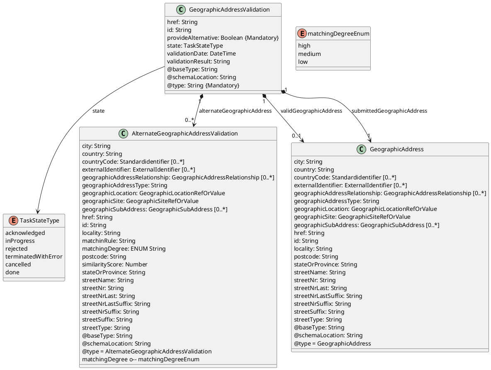
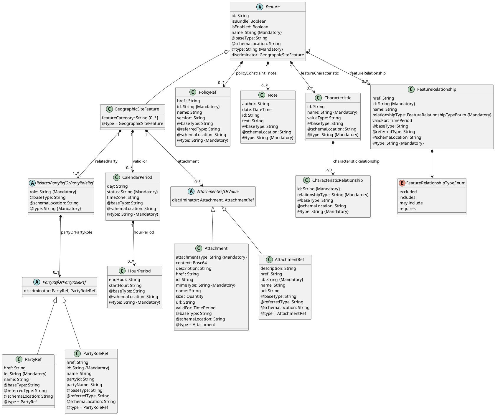
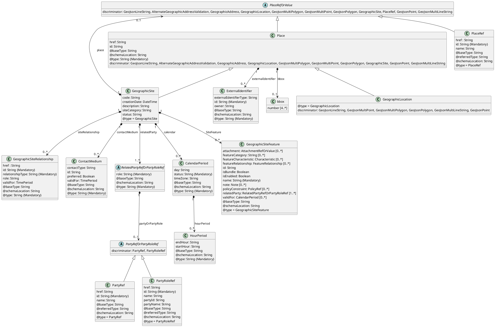
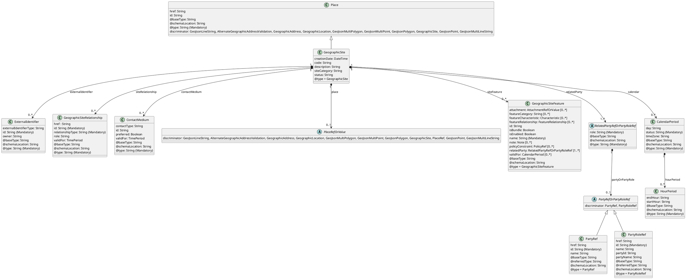
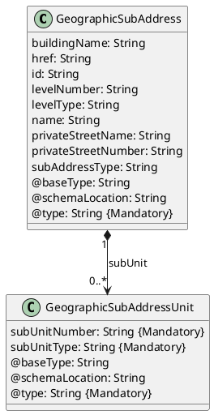
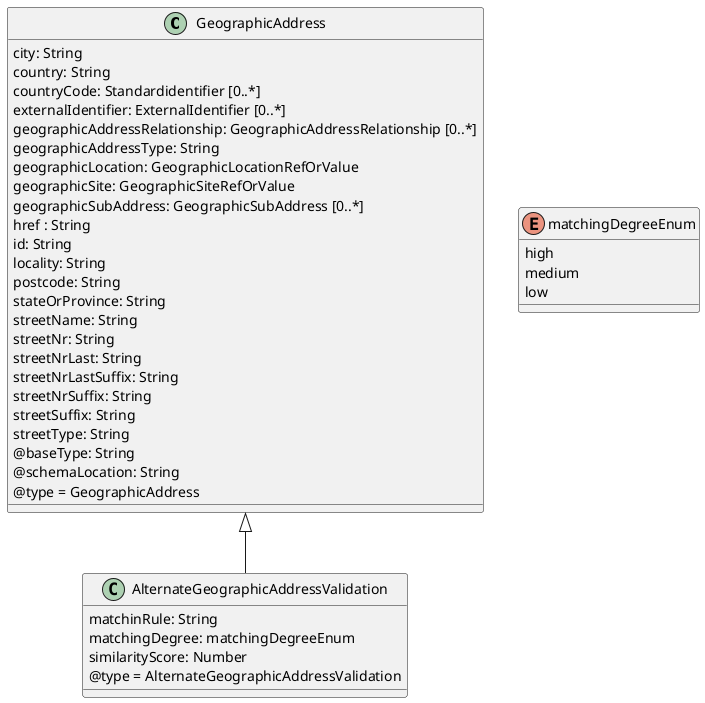

[Image: TM Forum logo.]

# TM Forum Specification

## GeographicAddress

**TMF673**

|                       |                   |
| :-------------------- | :---------------- |
| **Maturity Level:**   | TBD               |
| **Release Status:**   | TBD               |
| **Version TBD**       |                   |
| **Team Approved Date:** | TBD               |
| **Approval Status:**  | TBD               |
| **IPR Mode:**         | RAND              |

* * *

**© TM Forum 2024. All Rights Reserved.**
**tmforum.org**

* * *

GeographicAddress
[Image: TM Forum logo.]

## NOTICE

**Copyright © TM Forum 2024. All Rights Reserved.**

This document and translations of it may be copied and furnished to others, and derivative works that comment on or otherwise explain it or assist in its implementation may be prepared, copied, published, and distributed, in whole or in part, without restriction of any kind, provided that the above copyright notice and this section are included on all such copies and derivative works. However, this document itself may not be modified in any way, including by removing the copyright notice or references to TM FORUM, except as needed for the purpose of developing any document or deliverable produced by a TM FORUM Collaboration Project Team (in which case the rules applicable to copyrights, as set forth in the TM FORUM IPR Policy, must be followed) or as required to translate it into languages other than English.

The limited permissions granted above are perpetual and will not be revoked by TM FORUM or its successors or assigns.

This document and the information contained herein is provided on an "AS IS" basis and TM FORUM DISCLAIMS ALL WARRANTIES, EXPRESS OR IMPLIED, INCLUDING BUT NOT LIMITED TO ANY WARRANTY THAT THE USE OF THE INFORMATION HEREIN WILL NOT INFRINGE ANY OWNERSHIP RIGHTS OR ANY IMPLIED WARRANTIES OF MERCHANTABILITY OR FITNESS FOR A PARTICULAR PURPOSE.

Direct inquiries to the TM Forum office:

181 New Road, Suite 304
Parsippany, NJ 07054, USA
Tel No. +1 862 227 1648
TM Forum Web Page: www.tmforum.org

* * *

**© TM Forum 2024. All Rights Reserved.**
**Page i**
**tmforum.org**

* * *

GeographicAddress
[Image: TM Forum logo.]

## Table of Contents

*   NOTICE i
*   Introduction 1
*   Sample Use Cases 2
*   Support of polymorphism and extension patterns. 3
*   RESOURCE MODEL 4
    *   Managed Entity and Task Resource Models. 4
    *   GeographicAddressValidation resource 4
    *   GeographicAddress resource 27
    *   GeographicSubAddress resource . 48
    *   AlternateGeographicAddressValidation resource 50
    *   Notification Resource Models 64
    *   GeographicAddressValidation. 65
    *   GeographicAddress. 65
*   API OPERATIONS 71
    *   Operations on GeographicAddress Validation 71
    *   List or find GeographicAddressValidation objects 71
    *   Retrieves a GeographicAddressValidation by ID 73
    *   Creates a GeographicAddressValidation 76
    *   Operations on GeographicAddress. 78
    *   List or find GeographicAddress objects 78
    *   Retrieves a GeographicAddress by ID 79
    *   Creates a GeographicAddress 81
    *   Updates partially a GeographicAddress 83
    *   Deletes a GeographicAddress 87
    *   Operations on GeographicSubAddress 87
    *   List or find GeographicSubAddress objects 87
    *   Retrieves a GeographicSubAddress by ID 89
*   API NOTIFICATIONS 91
    *   Register listener 91
    *   Unregister listener. 92
    *   Publish Event to listener 92
*   Acknowledgements. 94
*   Release History. 94
*   Contributors to Document. 94

* * *

**© TM Forum 2024. All Rights Reserved.**
**Page ii**
**tmforum.org**

* * *

GeographicAddress
[Image: TM Forum logo.]

## Introduction

The following document is the user guide of the REST API for Any management. It includes the model definition as well as all available operations.

* * *

**© TM Forum 2024. All Rights Reserved.**
**Page 1**
**tmforum.org**

* * *

GeographicAddress
[Image: TM Forum logo.]

## Sample Use Cases

Reader will find example of use cases using Usage API in "Open Digital Business Scenarios and Use Cases" document.

* * *

**© TM Forum 2024. All Rights Reserved.**
**Page 2**
**tmforum.org**

* * *

GeographicAddress
[Image: TM Forum logo.]

## Support of polymorphism and extension patterns

Support of polymorphic collections and types and schema based extension is provided by means of a list of generic meta-attributes that we describe below. Polymorphism in collections occurs when entities inherit from base entities, for instance a BillingAccount and SettlementAccount inheriting properties from the abstract Account entity.

Generic support of polymorphism and pattern extensions is described in the TMF API Guidelines, Part 2 (TMF630).

The `@type` attribute provides a way to represent the actual class type of an entity. For example, within a list of Account instances some may be instances of BillingAccount where other could be instances of SettlementAccount. The `@type` gives this information. All resources and sub-resources of this API have a `@type` attributes that can be provided when this is useful.

The `@referredType` can be used within reference entities (like for instance an AccountRef object) to explicitly denote the actual entity type of the referred class. Notice that in reference entities the `@type`, when used, denotes the class type of the reference itself, such as BillingAccountRef or SettlementAccountRef, and not the class type of the referred object. However since reference classes are rarely sub-classed, `@type` is generally not useful in reference objects.

The `@schemaLocation` property can be used in resources to allow specifying user-defined properties of an Entity or to specify the expected characteristics of an entity.

The `@baseType` attribute gives a way to provide explicitly the base of class of a given resource that has been extended.

* * *

**© TM Forum 2024. All Rights Reserved.**
**Page 3**
**tmforum.org**

* * *

GeographicAddress
[Image: TM Forum logo.]

## RESOURCE MODEL

### Managed Entity and Task Resource Models

### GeographicAddressValidation resource

This resource is used to manage address validation request and response.

#### Resource model



**Figure 1 - GeographicAddressValidation**

* * *

**© TM Forum 2024. All Rights Reserved.**
**Page 4**
**tmforum.org**

* * *

GeographicAddress
[Image: TM Forum logo.]



**Figure 2 - GeographicSiteFeature**

* * *

**© TM Forum 2024. All Rights Reserved.**
**Page 5**
**tmforum.org**

* * *

GeographicAddress
[Image: TM Forum logo.]



**Figure 3 - PlaceRefOrValue**

### Field descriptions

#### GeographicAddressValidation fields

*   **alternateGeographicAddress**
    An AlternateGeographicAddressValidation. An alternate geographic address can signify an alternative address that shares a certain degree of similarity with the original geographic address, matched using different algormiths (e.g. fuzzy) by the address management system. This alternative may encompass variations in spelling or represent a different rendition of the primary address.
*   **href**
    A String. Hyperlink reference.
*   **id**
    A String. Unique identifier.
*   **provideAlternative**
    A Boolean. Indicator provided by the requester to specify if alternate addresses must be provided in case of partial or fail result.
* * *

**© TM Forum 2024. All Rights Reserved.**
**Page 6**
**tmforum.org**

* * *

GeographicAddress
[Image: TM Forum logo.]

*   **state**
    A TaskStateType. Possible values for the state of a task. ENUMERATED with values:
    *   acknowledged
    *   rejected
    *   inProgress
    *   cancelled
    *   done
    *   terminatedWithError
*   **submittedGeographicAddress**
    A GeographicAddress. Structured textual way of describing how to find a Property in an urban area (country properties are often defined differently). Note: Address corresponds to SID UrbanPropertyAddress.

    GeographicAddress can be instanciated as
    \* AlternateGeographicAddressValidation
*   **validGeographicAddress**
    A GeographicAddress. Structured textual way of describing how to find a Property in an urban area (country properties are often defined differently). Note: Address corresponds to SID UrbanPropertyAddress.

    GeographicAddress can be instanciated as
    \* AlternateGeographicAddressValidation
*   **validationDate**
    A DateTime. Date when the address validation is performed.
*   **validationResult**
    A String. Result of the address validation (success, partial, fails).
*   **@baseType**
    A String. When sub-classing, this defines the super-class.
*   **@schemaLocation**
    A String. A URI to a JSON-Schema file that defines additional attributes and relationships.
*   **@type**
    A String. When sub-classing, this defines the sub-class Extensible name.

#### AlternateGeographicAddressValidation sub-resource fields

*   **city**
    A String. City that the address is in.
*   **country**
    A String. Country that the address is in.
*   **countryCode**
    A StandardIdentifier. The corresponding identification of the resource in different standard, regulatory definitions. The standard specification identifier (e.g., ISO 3166-1 Alpha-2) and the corresponding value (e.g., BE) relevant to a particular resource. It is anticipated that multiple standards can provide definitions for a single entity, e.g., a country identifier can be specified in various standards (e.g., "ISO 3166-1 Alpha 2", "ISO 3166-1 Alpha 3", "ISO 3166-1 Numeric").
* * *

**© TM Forum 2024. All Rights Reserved.**
**Page 7**
**tmforum.org**

* * *

GeographicAddress
[Image: TM Forum logo.]

*   **externalIdentifier**
    An ExternalIdentifier. An identification of an entity that is owned by or originates in a software system different from the current system, for example a ProductOrder handed off from a commerce platform into an order handling system. The structure identifies the system itself, the nature of the entity within the system (e.g. class name) and the unique ID of the entity within the system. It is anticipated that multiple external IDs can be held for a single entity, e.g. if the entity passed through multiple systems on the way to the current system. In this case the consumer is expected to sequence the IDs in the array in reverse order of provenance, i.e. most recent system first in the list.
*   **geographicAddressRelationship**
    A GeographicAddressRelationship. The GeographicAddressRelationship schema represents a relationship between geographic addresses. It defines the structure for storing information about how two geographic addresses are related to each other within a system.
*   **geographicAddressType**
    A String. Classification of the address, e.g., residential, industrial.
*   **geographicLocation**
    A GeographicLocationRefOrValue. The polymorphic attributes @type, @schemaLocation & @referredType are related to the GeographicLocation entity and not the GeographicLocationRefOrValue class itself.
*   **geographicSite**
    A GeographicSiteRefOrValue. The polymorphic attributes @type, @schemaLocation & @referredType are related to the GeographicSite entity and not the GeographicSiteRefOrValue class itself.
*   **geographicSubAddress**
    A GeographicSubAddress. Representation of a GeographicSubAddress It is used for addressing within a property in an urban area (country properties are often defined differently). It may refer to a building, a building cluster, or a floor of a multistory building.
*   **href**
    A String. Hyperlink reference.
*   **id**
    A String. Unique identifier.
*   **locality**
    A String. An area of defined or undefined boundaries within a local authority or other legislatively defined area, usually rural or semi rural in nature. \[ANZLIC-STREET], or a suburb, a bounded locality within a city, town or shire principally of urban character \[ANZLICSTREET].
*   **matchinRule**
    A String. Indicates the matching rule that was applied to determine the matching degree for the target item. This attribute provides insight into the reasoning behind the assigned matching degree.
*   **matchingDegree**
    A String. Represents the matching degree between the search query and the target item, classified based on linguistic variables and matching rules. This attribute categorizes the degree of similarity into linguistic terms such as HighSimilarity, Medium Similarity, or LowSimilarity. ENUMERATED with values:
    *   high
    *   medium
    *   low
* * *

**© TM Forum 2024. All Rights Reserved.**
**Page 8**
**tmforum.org**

* * *

GeographicAddress
[Image: TM Forum logo.]

*   **postcode**
    A String. Descriptor for a postal delivery area, used to speed and simplify the delivery of mail (also know as zipcode).
*   **similarityScore**
    A Number. Represents the similarity score between the search query and the target item. This score quantifies the degree of similarity or match between the two.
*   **stateOrProvince**
    A String. The State or Province that the address is in.
*   **streetName**
    A String. Name of the street or other street type.
*   **streetNr**
    A String. Number identifying a specific property on a public street. It may be combined with streetNrLast for ranged addresses.
*   **streetNrLast**
    A String. Last number in a range of street numbers allocated to a property.
*   **streetNrLastSuffix**
    A String. Last street number suffix for a ranged address.
*   **streetNrSuffix**
    A String. The first street number suffix.
*   **streetSuffix**
    A String. A modifier denoting a relative direction.
*   **streetType**
    A String. Alley, avenue, boulevard, brae, crescent, drive, highway, lane, terrace, parade, place, tarn, way, wharf.
*   **@baseType**
    A String. When sub-classing, this defines the super-class.
*   **@schemaLocation**
    A String. A URI to a JSON-Schema file that defines additional attributes and relationships.
*   **@type**
    A String. When sub-classing, this defines the sub-class Extensible name.

#### GeoJsonLineString sub-resource fields

*   **bbox**
    A bbox. A bounding box array that contains the geometry. The axes order follows the axes order of the geometry.
*   **externalIdentifier**
    An ExternalIdentifier. An identification of an entity that is owned by or originates in a software system different from the current system, for example a ProductOrder handed off from a commerce platform into an order handling system. The structure identifies the system itself, the nature of the entity within the system (e.g. class name) and the unique ID of the entity within the system. It is anticipated that multiple external IDs can be held for a single entity, e.g. if the entity passed through multiple systems on the way to the current system. In this case the consumer is expected to sequence the IDs in the array in reverse order of provenance, i.e. most recent system first in the list.
*   **geoJson**
    A LineString. GeoJSON: A collection of Points forming a connected line.
*   **href**
    A String. Hyperlink reference.
*   **id**
    A String. Unique identifier.
*   **@baseType**
    A String. When sub-classing, this defines the super-class.
* * *

**© TM Forum 2024. All Rights Reserved.**
**Page 9**
**tmforum.org**

* * *

GeographicAddress
[Image: TM Forum logo.]

*   **@schemaLocation**
    A String. A URI to a JSON-Schema file that defines additional attributes and relationships.
*   **@type**
    A String. When sub-classing, this defines the sub-class Extensible name.

#### GeographicAddress sub-resource fields

*   **city**
    A String. City that the address is in.
*   **country**
    A String. Country that the address is in.
*   **countryCode**
    A StandardIdentifier. The corresponding identification of the resource in different standard, regulatory definitions. The standard specification identifier (e.g., ISO 3166-1 Alpha-2) and the corresponding value (e.g., BE) relevant to a particular resource. It is anticipated that multiple standards can provide definitions for a single entity, e.g., a country identifier can be specified in various standards (e.g., "ISO 3166-1 Alpha 2", "ISO 3166-1 Alpha 3", "ISO 3166-1 Numeric").
*   **externalIdentifier**
    An ExternalIdentifier. An identification of an entity that is owned by or originates in a software system different from the current system, for example a ProductOrder handed off from a commerce platform into an order handling system. The structure identifies the system itself, the nature of the entity within the system (e.g. class name) and the unique ID of the entity within the system. It is anticipated that multiple external IDs can be held for a single entity, e.g. if the entity passed through multiple systems on the way to the current system. In this case the consumer is expected to sequence the IDs in the array in reverse order of provenance, i.e. most recent system first in the list.
*   **geographicAddressRelationship**
    A GeographicAddressRelationship. The GeographicAddressRelationship schema represents a relationship between geographic addresses. It defines the structure for storing information about how two geographic addresses are related to each other within a system.
*   **geographicAddressType**
    A String. Classification of the address, e.g., residential, industrial.
*   **geographicLocation**
    A GeographicLocationRefOrValue. The polymorphic attributes @type, @schemaLocation & @referredType are related to the GeographicLocation entity and not the GeographicLocationRefOrValue class itself.
*   **geographicSite**
    A GeographicSiteRefOrValue. The polymorphic attributes @type, @schemaLocation & @referredType are related to the GeographicSite entity and not the GeographicSiteRefOrValue class itself.
*   **geographicSubAddress**
    A GeographicSubAddress. Representation of a GeographicSubAddress It is used for addressing within a property in an urban area (country properties are often defined differently). It may refer to a building, a building cluster, or a floor of a multistory building.
*   **href**
    A String. Hyperlink reference.
* * *

**© TM Forum 2024. All Rights Reserved.**
**Page 10**
**tmforum.org**

* * *

GeographicAddress
[Image: TM Forum logo.]

*   **id**
    A String. Unique identifier.
*   **locality**
    A String. An area of defined or undefined boundaries within a local authority or other legislatively defined area, usually rural or semi rural in nature. \[ANZLIC-STREET], or a suburb, a bounded locality within a city, town or shire principally of urban character \[ANZLICSTREET].
*   **postcode**
    A String. Descriptor for a postal delivery area, used to speed and simplify the delivery of mail (also know as zipcode).
*   **stateOrProvince**
    A String. The State or Province that the address is in.
*   **streetName**
    A String. Name of the street or other street type.
*   **streetNr**
    A String. Number identifying a specific property on a public street. It may be combined with streetNrLast for ranged addresses.
*   **streetNrLast**
    A String. Last number in a range of street numbers allocated to a property.
*   **streetNrLastSuffix**
    A String. Last street number suffix for a ranged address.
*   **streetNrSuffix**
    A String. The first street number suffix.
*   **streetSuffix**
    A String. A modifier denoting a relative direction.
*   **streetType**
    A String. Alley, avenue, boulevard, brae, crescent, drive, highway, lane, terrace, parade, place, tarn, way, wharf.
*   **@baseType**
    A String. When sub-classing, this defines the super-class.
*   **@schemaLocation**
    A String. A URI to a JSON-Schema file that defines additional attributes and relationships.
*   **@type**
    A String. When sub-classing, this defines the sub-class Extensible name.

    GeographicAddress can be instanciated as
    \* AlternateGeographicAddressValidation
*   **matchinRule**
    This property is present in subclasses
*   **matchingDegree**
    This property is present in subclasses
*   **similarityScore**
    This property is present in subclasses

#### GeographicLocation sub-resource fields

*   **bbox**
    A bbox. A bounding box array that contains the geometry. The axes order follows the axes order of the geometry.
* * *

**© TM Forum 2024. All Rights Reserved.**
**Page 11**
**tmforum.org**

* * *

GeographicAddress
[Image: TM Forum logo.]

*   **externalIdentifier**
    An ExternalIdentifier. An identification of an entity that is owned by or originates in a software system different from the current system, for example a ProductOrder handed off from a commerce platform into an order handling system. The structure identifies the system itself, the nature of the entity within the system (e.g. class name) and the unique ID of the entity within the system. It is anticipated that multiple external IDs can be held for a single entity, e.g. if the entity passed through multiple systems on the way to the current system. In this case the consumer is expected to sequence the IDs in the array in reverse order of provenance, i.e. most recent system first in the list.
*   **href**
    A String. Hyperlink reference.
*   **id**
    A String. Unique identifier.
*   **@baseType**
    A String. When sub-classing, this defines the super-class.
*   **@schemaLocation**
    A String. A URI to a JSON-Schema file that defines additional attributes and relationships.
*   **@type**
    A String. When sub-classing, this defines the sub-class Extensible name.

    GeographicLocation can be instanciated as
    *   GeoJsonLineString
    *   GeoJsonMultiLineString
    *   GeoJsonMultiPoint
    *   GeoJsonMultiPolygon
    *   GeoJsonPoint
    *   GeoJsonPolygon
*   **geoJson**
    This property is present in subclasses

#### GeoJsonMultiPolygon sub-resource fields

*   **bbox**
    A bbox. A bounding box array that contains the geometry. The axes order follows the axes order of the geometry.
*   **externalIdentifier**
    An ExternalIdentifier. An identification of an entity that is owned by or originates in a software system different from the current system, for example a ProductOrder handed off from a commerce platform into an order handling system. The structure identifies the system itself, the nature of the entity within the system (e.g. class name) and the unique ID of the entity within the system. It is anticipated that multiple external IDs can be held for a single entity, e.g. if the entity passed through multiple systems on the way to the current system. In this case the consumer is expected to sequence the IDs in the array in reverse order of provenance, i.e. most recent system first in the list.
*   **geoJson**
    A MultiPolygon. GeoJSON: A collection of Polygons.
*   **href**
    A String. Hyperlink reference.
*   **id**
    A String. Unique identifier.
*   **@baseType**
    A String. When sub-classing, this defines the super-class.
* * *

**© TM Forum 2024. All Rights Reserved.**
**Page 12**
**tmforum.org**

* * *

GeographicAddress
[Image: TM Forum logo.]

*   **@schemaLocation**
    A String. A URI to a JSON-Schema file that defines additional attributes and relationships.
*   **@type**
    A String. When sub-classing, this defines the sub-class Extensible name.

#### GeoJsonMultiPoint sub-resource fields

*   **bbox**
    A bbox. A bounding box array that contains the geometry. The axes order follows the axes order of the geometry.
*   **externalIdentifier**
    An ExternalIdentifier. An identification of an entity that is owned by or originates in a software system different from the current system, for example a ProductOrder handed off from a commerce platform into an order handling system. The structure identifies the system itself, the nature of the entity within the system (e.g. class name) and the unique ID of the entity within the system. It is anticipated that multiple external IDs can be held for a single entity, e.g. if the entity passed through multiple systems on the way to the current system. In this case the consumer is expected to sequence the IDs in the array in reverse order of provenance, i.e. most recent system first in the list.
*   **geoJson**
    A MultiPoint. GeoJSON: A collection of Points.
*   **href**
    A String. Hyperlink reference.
*   **id**
    A String. Unique identifier.
*   **@baseType**
    A String. When sub-classing, this defines the super-class.
*   **@schemaLocation**
    A String. A URI to a JSON-Schema file that defines additional attributes and relationships.
*   **@type**
    A String. When sub-classing, this defines the sub-class Extensible name.

#### GeoJsonPolygon sub-resource fields

*   **bbox**
    A bbox. A bounding box array that contains the geometry. The axes order follows the axes order of the geometry.
*   **externalIdentifier**
    An ExternalIdentifier. An identification of an entity that is owned by or originates in a software system different from the current system, for example a ProductOrder handed off from a commerce platform into an order handling system. The structure identifies the system itself, the nature of the entity within the system (e.g. class name) and the unique ID of the entity within the system. It is anticipated that multiple external IDs can be held for a single entity, e.g. if the entity passed through multiple systems on the way to the current system. In this case the consumer is expected to sequence the IDs in the array in reverse order of provenance, i.e. most recent system first in the list.
*   **geoJson**
    A Polygon. GeoJSON: An array of linear rings.
*   **href**
    A String. Hyperlink reference.
*   **id**
    A String. Unique identifier.
* * *

**© TM Forum 2024. All Rights Reserved.**
**Page 13**
**tmforum.org**

* * *

GeographicAddress
[Image: TM Forum logo.]

*   **@baseType**
    A String. When sub-classing, this defines the super-class.
*   **@schemaLocation**
    A String. A URI to a JSON-Schema file that defines additional attributes and relationships.
*   **@type**
    A String. When sub-classing, this defines the sub-class Extensible name.

#### GeographicSite sub-resource fields

*   **calendar**
    A CalendarPeriod. The CalendarPeriod schema represents a period of time within a calendar, defining various attributes such as the applicable day, timezone, hour period, and status. It is designed to capture information about the availability or status of a calendar period, which can be used in scheduling, booking, or resource allocation applications.
*   **code**
    A String. A code that may be used for some addressing schemes eg: \[ANSI T1.253-1999].
*   **contactMedium**
    A ContactMedium. Indicates the contact medium that could be used to contact the party. This is an abstract base class, the actual value is in one of the strongly-typed subclasses : EmailContactMedium, FaxContactMedium, PhoneContactMedium, GeographicAddressContactMedium, SocialMediaContactMedium...
*   **creationDate**
    A DateTime. Date and time when the GeographicSite was created.
*   **description**
    A String. Text describing additional information regarding the site.
*   **externalIdentifier**
    An ExternalIdentifier. An identification of an entity that is owned by or originates in a software system different from the current system, for example a ProductOrder handed off from a commerce platform into an order handling system. The structure identifies the system itself, the nature of the entity within the system (e.g. class name) and the unique ID of the entity within the system. It is anticipated that multiple external IDs can be held for a single entity, e.g. if the entity passed through multiple systems on the way to the current system. In this case the consumer is expected to sequence the IDs in the array in reverse order of provenance, i.e. most recent system first in the list.
*   **href**
    A String. Hyperlink reference.
*   **id**
    A String. Unique identifier.
*   **place**
    A PlaceRefOrValue. The polymorphic attributes @type, @schemaLocation & @referredType are related to the Place entity and not the PlaceRefOrValue class itself.
*   **relatedParty**
    A RelatedPartyRefOrPartyRoleRef. Related Party reference. A related party defines party or party role or its reference, linked to a specific entity.
*   **siteCategory**
    A String. Site classification/category.
* * *

**© TM Forum 2024. All Rights Reserved.**
**Page 14**
**tmforum.org**

* * *

GeographicAddress
[Image: TM Forum logo.]

*   **siteFeature**
    A GeographicSiteFeature. Geographic Site Feature captures various site information, ranging from survey data to safety guidelines and hazard information.
*   **siteRelationship**
    A GeographicSiteRelationship. Details of geographic site relationship.
*   **status**
    A String. The condition of the GeographicSite, such as planned, underConstruction, cancelled, active, inactive, former.
*   **@baseType**
    A String. When sub-classing, this defines the super-class.
*   **@schemaLocation**
    A String. A URI to a JSON-Schema file that defines additional attributes and relationships.
*   **@type**
    A String. When sub-classing, this defines the sub-class Extensible name.

#### GeoJsonPoint sub-resource fields

*   **bbox**
    A bbox. A bounding box array that contains the geometry. The axes order follows the axes order of the geometry.
*   **externalIdentifier**
    An ExternalIdentifier. An identification of an entity that is owned by or originates in a software system different from the current system, for example a ProductOrder handed off from a commerce platform into an order handling system. The structure identifies the system itself, the nature of the entity within the system (e.g. class name) and the unique ID of the entity within the system. It is anticipated that multiple external IDs can be held for a single entity, e.g. if the entity passed through multiple systems on the way to the current system. In this case the consumer is expected to sequence the IDs in the array in reverse order of provenance, i.e. most recent system first in the list.
*   **geoJson**
    A Point. GeoJSON: A single position.
*   **href**
    A String. Hyperlink reference.
*   **id**
    A String. Unique identifier.
*   **@baseType**
    A String. When sub-classing, this defines the super-class.
*   **@schemaLocation**
    A String. A URI to a JSON-Schema file that defines additional attributes and relationships.
*   **@type**
    A String. When sub-classing, this defines the sub-class Extensible name.

#### GeoJsonMultiLineString sub-resource fields

*   **bbox**
    A bbox. A bounding box array that contains the geometry. The axes order follows the axes order of the geometry.
* * *

**© TM Forum 2024. All Rights Reserved.**
**Page 15**
**tmforum.org**

* * *

GeographicAddress
[Image: TM Forum logo.]

*   **externalIdentifier**
    An ExternalIdentifier. An identification of an entity that is owned by or originates in a software system different from the current system, for example a ProductOrder handed off from a commerce platform into an order handling system. The structure identifies the system itself, the nature of the entity within the system (e.g. class name) and the unique ID of the entity within the system. It is anticipated that multiple external IDs can be held for a single entity, e.g. if the entity passed through multiple systems on the way to the current system. In this case the consumer is expected to sequence the IDs in the array in reverse order of provenance, i.e. most recent system first in the list.
*   **geoJson**
    A MultiLineString. GeoJSON: A collection of distinct LineStrings.
*   **href**
    A String. Hyperlink reference.
*   **id**
    A String. Unique identifier.
*   **@baseType**
    A String. When sub-classing, this defines the super-class.
*   **@schemaLocation**
    A String. A URI to a JSON-Schema file that defines additional attributes and relationships.
*   **@type**
    A String. When sub-classing, this defines the sub-class Extensible name.

#### Place sub-resource fields

*   **externalIdentifier**
    An ExternalIdentifier. An identification of an entity that is owned by or originates in a software system different from the current system, for example a ProductOrder handed off from a commerce platform into an order handling system. The structure identifies the system itself, the nature of the entity within the system (e.g. class name) and the unique ID of the entity within the system. It is anticipated that multiple external IDs can be held for a single entity, e.g. if the entity passed through multiple systems on the way to the current system. In this case the consumer is expected to sequence the IDs in the array in reverse order of provenance, i.e. most recent system first in the list.
*   **href**
    A String. Hyperlink reference.
*   **id**
    A String. Unique identifier.
*   **@baseType**
    A String. When sub-classing, this defines the super-class.
*   **@schemaLocation**
    A String. A URI to a JSON-Schema file that defines additional attributes and relationships.
*   **@type**
    A String. When sub-classing, this defines the sub-class Extensible name.

    Place can be instanciated as
    *   GeographicAddress
    *   GeographicLocation
    *   GeographicSite
*   **bbox**
    This property is present in subclasses
*   **calendar**
    This property is present in subclasses
* * *

**© TM Forum 2024. All Rights Reserved.**
**Page 16**
**tmforum.org**

* * *

GeographicAddress
[Image: TM Forum logo.]

*   **city**
    This property is present in subclasses
*   **code**
    This property is present in subclasses
*   **contactMedium**
    This property is present in subclasses
*   **country**
    This property is present in subclasses
*   **countryCode**
    This property is present in subclasses
*   **creationDate**
    This property is present in subclasses
*   **description**
    This property is present in subclasses
*   **geographicAddressRelationship**
    This property is present in subclasses
*   **geographicAddressType**
    This property is present in subclasses
*   **geographicLocation**
    This property is present in subclasses
*   **geographicSite**
    This property is present in subclasses
*   **geographicSubAddress**
    This property is present in subclasses
*   **locality**
    This property is present in subclasses
*   **place**
    This property is present in subclasses
*   **postcode**
    This property is present in subclasses
*   **relatedParty**
    This property is present in subclasses
*   **siteCategory**
    This property is present in subclasses
*   **siteFeature**
    This property is present in subclasses
*   **siteRelationship**
    This property is present in subclasses
*   **stateOrProvince**
    This property is present in subclasses
*   **status**
    This property is present in subclasses
*   **streetName**
    This property is present in subclasses
*   **streetNr**
    This property is present in subclasses
*   **streetNrLast**
    This property is present in subclasses
*   **streetNrLastSuffix**
    This property is present in subclasses
*   **streetNrSuffix**
    This property is present in subclasses
*   **streetSuffix**
    This property is present in subclasses
*   **streetType**
    This property is present in subclasses

#### GeographicAddressRelationship sub-resource fields

*   **href**
    A String. Hyperlink reference.
*   **id**
    A String. Unique identifier.
*   **name**
    A String. Name of the referred entity.
* * *

**© TM Forum 2024. All Rights Reserved.**
**Page 17**
**tmforum.org**

* * *

GeographicAddress
[Image: TM Forum logo.]

*   **relationshipType**
    A String. Type of relationship between the geographic addresses. This attribute specifies the nature of the relationship between the related addresses. It provides context for understanding how the addresses are related to each other.
*   **@baseType**
    A String. When sub-classing, this defines the super-class.
*   **@referredType**
    A String. The actual type of the target instance when needed for disambiguation.
*   **@schemaLocation**
    A String. A URI to a JSON-Schema file that defines additional attributes and relationships.
*   **@type**
    A String. When sub-classing, this defines the sub-class Extensible name.

#### StandardIdentifier sub-resource fields

*   **format**
    A String. Standard/Regulatory definition identifier. e.g., ISO 3166-1.
*   **href**
    A String. Hyperlink reference.
*   **id**
    A String. Unique identifier.
*   **value**
    A String. The value of the resource in the corresponding standard.e.g., a country code value.
*   **@baseType**
    A String. When sub-classing, this defines the super-class.
*   **@schemaLocation**
    A String. A URI to a JSON-Schema file that defines additional attributes and relationships.
*   **@type**
    A String. When sub-classing, this defines the sub-class Extensible name.

#### GeographicLocationRef sub-resource fields

*   **href**
    A String. Hyperlink reference.
*   **id**
    A String. Unique identifier.
*   **name**
    A String. Name of the referred entity.
*   **@baseType**
    A String. When sub-classing, this defines the super-class.
*   **@referredType**
    A String. The actual type of the target instance when needed for disambiguation.
*   **@schemaLocation**
    A String. A URI to a JSON-Schema file that defines additional attributes and relationships.
*   **@type**
    A String. When sub-classing, this defines the sub-class Extensible name.

#### GeographicSubAddress sub-resource fields

*   **buildingName**
    A String. Allows for buildings that have well-known names.
*   **href**
    A String. Hyperlink reference.
* * *

**© TM Forum 2024. All Rights Reserved.**
**Page 18**
**tmforum.org**

* * *

GeographicAddress
[Image: TM Forum logo.]

*   **id**
    A String. Unique identifier.
*   **levelNumber**
    A String. Used where a level type may be repeated e.g. BASEMENT 1, BASEMENT 2.
*   **levelType**
    A String. Describes level types within a building.
*   **name**
    A String. Name of the subAddress to identify it with a meaningful identification.
*   **privateStreetName**
    A String. Private streets internal to a property (e.g. a university) may have internal names that are not recorded by the land title office.
*   **privateStreetNumber**
    A String. Private streets numbers internal to a private street.
*   **subAddressType**
    A String. Type of subAddress : it can be a subunit or a private street.
*   **subUnit**
    A GeographicSubAddressUnit. Representation of a SubUnit. It is used for describing subunit within a subAddress e.g. BERTH, FLAT, PIER, SUITE, SHOP, TOWER, UNIT, WHARF.
*   **@baseType**
    A String. When sub-classing, this defines the super-class.
*   **@schemaLocation**
    A String. A URI to a JSON-Schema file that defines additional attributes and relationships.
*   **@type**
    A String. When sub-classing, this defines the sub-class Extensible name.

#### GeographicSiteRef sub-resource fields

*   **href**
    A String. Hyperlink reference.
*   **id**
    A String. Unique identifier.
*   **name**
    A String. Name of the referred entity.
*   **@baseType**
    A String. When sub-classing, this defines the super-class.
*   **@referredType**
    A String. The actual type of the target instance when needed for disambiguation.
*   **@schemaLocation**
    A String. A URI to a JSON-Schema file that defines additional attributes and relationships.
*   **@type**
    A String. When sub-classing, this defines the sub-class Extensible name.

#### LineString sub-resource fields

*   **coordinates**
    A position. GeoJSON: An array of two or more positions.
*   **type**
    A String. ENUMERATED with values:
    *   LineString

#### MultiPolygon sub-resource fields

*   **coordinates**
    A polygon. GeoJSON: An array of polygons.
* * *

**© TM Forum 2024. All Rights Reserved.**
**Page 19**
**tmforum.org**

* * *

GeographicAddress
[Image: TM Forum logo.]

*   **type**
    A String. ENUMERATED with values:
    *   MultiPolygon

#### MultiPoint sub-resource fields

*   **coordinates**
    A position. GeoJSON: An array of positions.
*   **type**
    A String. ENUMERATED with values:
    *   MultiPoint

#### Polygon sub-resource fields

*   **coordinates**
    A linearRing. GeoJSON: An array of linear rings.
*   **type**
    A String. ENUMERATED with values:
    *   Polygon

#### Point sub-resource fields

*   **coordinates**
    A position. GeoJSON: A single position.
*   **type**
    A String. ENUMERATED with values:
    *   Point

#### MultiLineString sub-resource fields

*   **coordinates**
    A position. GeoJSON: An array of two or more positions.
*   **type**
    A String. ENUMERATED with values:
    *   MultiLineString

#### GeographicSubAddressUnit sub-resource fields

*   **subUnitNumber**
    A String. The discriminator used for the subunit, often just a simple number but may also be a range.
*   **subUnitType**
    A String. The type of subunit e.g.BERTH, FLAT, PIER, SUITE, SHOP, TOWER, UNIT, WHARF, RACK.
*   **@baseType**
    A String. When sub-classing, this defines the super-class.
*   **@schemaLocation**
    A String. A URI to a JSON-Schema file that defines additional attributes and relationships.
*   **@type**
    A String. When sub-classing, this defines the sub-class Extensible name.

#### ContactMedium sub-resource fields

*   **contactType**
    A String. Type of the contact medium to qualify it like pro email / personal email. This is not used to define the contact medium used.
*   **id**
    A String. Identifier for this contact medium.
*   **preferred**
    A Boolean. If true, indicates that is the preferred contact medium.
* * *

**© TM Forum 2024. All Rights Reserved.**
**Page 20**
**tmforum.org**

* * *

GeographicAddress
[Image: TM Forum logo.]

*   **validFor**
    A TimePeriod. A period of time, either as a deadline (endDateTime only) a startDateTime only, or both.
*   **@baseType**
    A String. When sub-classing, this defines the super-class.
*   **@schemaLocation**
    A String. A URI to a JSON-Schema file that defines additional attributes and relationships.
*   **@type**
    A String. When sub-classing, this defines the sub-class Extensible name.

#### PlaceRef sub-resource fields

*   **href**
    A String. Hyperlink reference.
*   **id**
    A String. Unique identifier.
*   **name**
    A String. Name of the referred entity.
*   **@baseType**
    A String. When sub-classing, this defines the super-class.
*   **@referredType**
    A String. The actual type of the target instance when needed for disambiguation.
*   **@schemaLocation**
    A String. A URI to a JSON-Schema file that defines additional attributes and relationships.
*   **@type**
    A String. When sub-classing, this defines the sub-class Extensible name.

#### CalendarPeriod sub-resource fields

*   **day**
    A String. Day where the calendar status applies (e.g.: monday, mon-to-fri, weekdays, weekend, all week, ...).
*   **hourPeriod**
    A HourPeriod. Hour interval.
*   **status**
    A String. Indication of the availability of the calendar period (e.g.: available, booked, etc.).
*   **timeZone**
    A String. Indication of the timezone applicable to the calendar information (e.g.: Paris, GMT+1).
*   **@baseType**
    A String. When sub-classing, this defines the super-class.
*   **@schemaLocation**
    A String. A URI to a JSON-Schema file that defines additional attributes and relationships.
*   **@type**
    A String. When sub-classing, this defines the sub-class Extensible name.

#### GeographicSiteRelationship sub-resource fields

*   **href**
    A String. Reference of the related geographic site.
*   **id**
    A String. Unique identifier of the related site entity within the server.
*   **relationshipType**
    A String. Type of relationship.
*   **role**
    A String. Role of the related site in the relationship.
* * *

**© TM Forum 2024. All Rights Reserved.**
**Page 21**
**tmforum.org**

* * *

GeographicAddress
[Image: TM Forum logo.]

*   **validFor**
    A TimePeriod. A period of time, either as a deadline (endDateTime only) a startDateTime only, or both.
*   **@baseType**
    A String. When sub-classing, this defines the super-class.
*   **@schemaLocation**
    A String. A URI to a JSON-Schema file that defines additional attributes and relationships.
*   **@type**
    A String. When sub-classing, this defines the sub-class Extensible name.

#### RelatedPartyRefOrPartyRoleRef sub-resource fields

*   **partyOrPartyRole**
    A PartyRefOrPartyRoleRef.
*   **role**
    A String. Role played by the related party or party role in the context of the specific entity it is linked to. Such as 'initiator', 'customer', 'salesAgent', 'user'.
*   **@baseType**
    A String. When sub-classing, this defines the super-class.
*   **@schemaLocation**
    A String. A URI to a JSON-Schema file that defines additional attributes and relationships.
*   **@type**
    A String. When sub-classing, this defines the sub-class Extensible name.

#### GeographicSiteFeature sub-resource fields

*   **attachment**
    An AttachmentRefOrValue. The polymorphic attributes @type, @schemaLocation & @referredType are related to the Attachment entity and not the AttachmentRefOrValue class itself.
*   **featureCategory**
    A String. Collection of feature category.
*   **featureCharacteristic**
    A Characteristic. Describes a given characteristic of an object or entity through a name/value pair. This is an abstract base class, the actual value is in one of the strongly-typed subclasses : StringCharacteristic, ObjectCharacteristic, FloatCharacteristic, BooleanCharacteristic, NumberCharacteristic, IntegerCharacteristic, StringArrayCharacteristic, ObjectArrayCharacteristic, BooleanArrayCharacteristic, NumberArrayCharacteristic, IntegerArrayCharacteristic...
*   **featureRelationship**
    A FeatureRelationship. Configuration feature.
*   **id**
    A String. Unique identifier.
*   **isBundle**
    A Boolean. True if this is a feature group. Default is false.
*   **isEnabled**
    A Boolean. True if this feature is enabled. Default is true.
*   **name**
    A String. This is the name for the feature.
*   **note**
    A Note. Extra information about a given entity.
*   **policyConstraint**
    A PolicyRef. Reference to managed Policy object.
*   **relatedParty**
    A RelatedPartyRefOrPartyRoleRef. Related Party reference. A related party defines party or party role or its reference, linked to a specific entity.
* * *

**© TM Forum 2024. All Rights Reserved.**
**Page 22**
**tmforum.org**

* * *

GeographicAddress
[Image: TM Forum logo.]

*   **validFor**
    A CalendarPeriod. The CalendarPeriod schema represents a period of time within a calendar, defining various attributes such as the applicable day, timezone, hour period, and status. It is designed to capture information about the availability or status of a calendar period, which can be used in scheduling, booking, or resource allocation applications.
*   **@baseType**
    A String. When sub-classing, this defines the super-class.
*   **@schemaLocation**
    A String. A URI to a JSON-Schema file that defines additional attributes and relationships.
*   **@type**
    A String. When sub-classing, this defines the sub-class Extensible name.

#### Feature sub-resource fields

*   **featureCharacteristic**
    A Characteristic. Describes a given characteristic of an object or entity through a name/value pair. This is an abstract base class, the actual value is in one of the strongly-typed subclasses : StringCharacteristic, ObjectCharacteristic, FloatCharacteristic, BooleanCharacteristic, NumberCharacteristic, IntegerCharacteristic, StringArrayCharacteristic, ObjectArrayCharacteristic, BooleanArrayCharacteristic, NumberArrayCharacteristic, IntegerArrayCharacteristic...
*   **featureRelationship**
    A FeatureRelationship. Configuration feature.
*   **id**
    A String. Unique identifier.
*   **isBundle**
    A Boolean. True if this is a feature group. Default is false.
*   **isEnabled**
    A Boolean. True if this feature is enabled. Default is true.
*   **name**
    A String. This is the name for the feature.
*   **policyConstraint**
    A PolicyRef. Reference to managed Policy object.
*   **@baseType**
    A String. When sub-classing, this defines the super-class.
*   **@schemaLocation**
    A String. A URI to a JSON-Schema file that defines additional attributes and relationships.
*   **@type**
    A String. When sub-classing, this defines the sub-class Extensible name.

    Feature can be instanciated as
    *   GeographicSiteFeature
*   **attachment**
    This property is present in subclasses
*   **featureCategory**
    This property is present in subclasses
*   **note**
    This property is present in subclasses
*   **relatedParty**
    This property is present in subclasses
*   **validFor**
    This property is present in subclasses

#### HourPeriod sub-resource fields

* * *

**© TM Forum 2024. All Rights Reserved.**
**Page 23**
**tmforum.org**

* * *

GeographicAddress
[Image: TM Forum logo.]

*   **endHour**
    A String. The time when the status ends applying.
*   **startHour**
    A String. The time when the status starts applying.
*   **@baseType**
    A String. When sub-classing, this defines the super-class.
*   **@schemaLocation**
    A String. A URI to a JSON-Schema file that defines additional attributes and relationships.
*   **@type**
    A String. When sub-classing, this defines the sub-class Extensible name.

#### PartyRef sub-resource fields

*   **href**
    A String. Hyperlink reference.
*   **id**
    A String. Unique identifier.
*   **name**
    A String. Name of the referred entity.
*   **@baseType**
    A String. When sub-classing, this defines the super-class.
*   **@referredType**
    A String. The actual type of the target instance when needed for disambiguation.
*   **@schemaLocation**
    A String. A URI to a JSON-Schema file that defines additional attributes and relationships.
*   **@type**
    A String. When sub-classing, this defines the sub-class Extensible name.

#### PartyRoleRef sub-resource fields

*   **href**
    A String. Hyperlink reference.
*   **id**
    A String. Unique identifier.
*   **name**
    A String. Name of the referred entity.
*   **partyId**
    A String. The identifier of the engaged party that is linked to the PartyRole object.
*   **partyName**
    A String. The name of the engaged party that is linked to the PartyRole object.
*   **@baseType**
    A String. When sub-classing, this defines the super-class.
*   **@referredType**
    A String. The actual type of the target instance when needed for disambiguation.
*   **@schemaLocation**
    A String. A URI to a JSON-Schema file that defines additional attributes and relationships.
*   **@type**
    A String. When sub-classing, this defines the sub-class Extensible name.

#### Note sub-resource fields

*   **author**
    A String. Author of the note.
*   **date**
    A DateTime. Date of the note.
* * *

**© TM Forum 2024. All Rights Reserved.**
**Page 24**
**tmforum.org**

* * *

GeographicAddress
[Image: TM Forum logo.]

*   **id**
    A String. Identifier of the note within its containing entity.
*   **text**
    A String. Text of the note.
*   **@baseType**
    A String. When sub-classing, this defines the super-class.
*   **@schemaLocation**
    A String. A URI to a JSON-Schema file that defines additional attributes and relationships.
*   **@type**
    A String. When sub-classing, this defines the sub-class Extensible name.

#### Attachment sub-resource fields

*   **attachmentType**
    A String. A business characterization of the purpose of the attachment, for example logo, instructionManual, contractCopy.
*   **content**
    A Base64. The actual contents of the attachment object, if embedded, encoded as base64.
*   **description**
    A String. A narrative text describing the content of the attachment.
*   **href**
    A String. Hyperlink reference.
*   **id**
    A String. Unique identifier.
*   **mimeType**
    A String. A technical characterization of the attachment content format using IETF Mime Types.
*   **name**
    A String. The name of the attachment.
*   **size**
    A Quantity. An amount in a given unit.
*   **url**
    A String. Uniform Resource Locator, is a web page address (a subset of URI).
*   **validFor**
    A TimePeriod. A period of time, either as a deadline (endDateTime only) a startDateTime only, or both.
*   **@baseType**
    A String. When sub-classing, this defines the super-class.
*   **@schemaLocation**
    A String. A URI to a JSON-Schema file that defines additional attributes and relationships.
*   **@type**
    A String. When sub-classing, this defines the sub-class Extensible name.

#### AttachmentRef sub-resource fields

*   **description**
    A String. A narrative text describing the content of the attachment.
*   **href**
    A String. Hyperlink reference.
*   **id**
    A String. Unique identifier.
*   **name**
    A String. Name of the referred entity.
*   **url**
    A String. Link to the attachment media/content.
*   **@baseType**
    A String. When sub-classing, this defines the super-class.
* * *

**© TM Forum 2024. All Rights Reserved.**
**Page 25**
**tmforum.org**

* * *

GeographicAddress
[Image: TM Forum logo.]

*   **@referredType**
    A String. The actual type of the target instance when needed for disambiguation.
*   **@schemaLocation**
    A String. A URI to a JSON-Schema file that defines additional attributes and relationships.
*   **@type**
    A String. When sub-classing, this defines the sub-class Extensible name.

#### Json representation sample(s)

We provide below a JSON representation as example of the 'GeographicAddressValidation' resource object.

```json
{
  "id": "33173014-fc84-4e7b-8ccf-3e900c0a9917",
  "href": "https://host/tmf-api/geographicAddressManagement/v5/geographicAddressValidation/33173014-fc84-4e7b-8ccf-3e900c0a9917",
  "provideAlternative": true,
  "state": "done",
  "validationDate": "2012-07-09T19:22:09.1440844Z",
  "validationResult": "partial",
  "submittedGeographicAddress": {
    "streetNr": "151",
    "streetName": "Landgrabenweg",
    "postcode": "53227",
    "city": "Bonn",
    "stateOrProvince": "NRW",
    "country": "Germany",
    "@type": "FieldedAddress",
    "@baseType": "GeographicAddress"
  },
  "alternateGeographicAddress": [
    {
      "id": "35dcfeec-9051-4605-830-7a0f67dc541d",
      "href": "https://host/tmf-api/geographicAddressManagement/v5/geographicAddress/35dcfeec-9051-4b05-830e-7a0f67dc541d",
      "streetNr": "151",
      "streetNrSuffix": "Erstbau",
      "streetName": "Landgrabenweg",
      "streetType": "road",
      "postcode": "53227",
      "locality": "Beuel",
      "city": "Bonn",
      "stateOrProvince": "NRW",
      "country": "Germany",
      "geographicLocation": {
        "id": "67301845-ee43-4984-ba3b-b4fba4b98872",
        "href": "https://host/tmf-api/geographicLocation/v5/geographicLocation/67301845-ee43-4984-ba3b-b4fba4b98872",
        "@type": "GeoJsonPoint"
      }
    }
  ],
  "@type": "GeographicAddressValidation"
}
```

* * *

**© TM Forum 2024. All Rights Reserved.**
**Page 26**
**tmforum.org**

* * *

GeographicAddress
[Image: TM Forum logo.]

### GeographicAddress resource

Structured textual way of describing how to find a Property in an urban area (country properties are often defined differently).
Note: Address corresponds to SID UrbanPropertyAddress.

#### Resource model



```plantuml
@startuml
skinparam classAttributeIconSize 0

class GeographicAddress {
  city: String
  country: String
  geographicAddressType: String
  locality: String
  postcode: String
  stateOrProvince: String
  streetName: String
  streetNr: String
  streetNrLast: String
  streetNrLastSuffix: String
  streetNrSuffix: String
  streetSuffix: String
  streetType: String
  @type = GeographicAddress
  ' Note: Common Place attributes like href, id, @baseType, @schemaLocation are inherited but not shown for brevity.
}

class GeographicAddressRelationship {
  href: String
  id: String {Mandatory}
  name: String
  relationshipType: String {Mandatory}
  @baseType: String
  @referredType: String
  @schemaLocation: String
  @type: String {Mandatory}
}

class GeographicSubAddress {
  buildingName: String
  href: String
  id: String
  levelNumber: String
  levelType: String
  name: String
  privateStreetName: String
  privateStreetNumber: String
  subAddressType: String
  subUnit: GeographicSubAddressUnit [0..*]
  @baseType: String
  @schemaLocation: String
  @type: String {Mandatory}
}

class StandardIdentifier {
  format: String
  href : String
  id: String
  value: String
  @baseType: String
  @schemaLocation: String
  @type: String {Mandatory}
}


abstract class PlaceRefOrValue {
  href: String
  id: String
  @baseType: String
  @schemaLocation: String
  @type: String {Mandatory}
}
note right of PlaceRefOrValue : discriminator: GeoJsonLineString, GeographicLocation, GeographicLocationRef, ...

abstract class GeographicLocationRefOrValue extends PlaceRefOrValue {
   ' Placeholder for GeographicLocation or GeographicLocationRef
}
note right of GeographicLocationRefOrValue : discriminator: GeoJsonLineString, GeographicLocation, GeographicLocationRef, ...

abstract class GeographicSiteRefOrValue extends PlaceRefOrValue {
   ' Placeholder for GeographicSite or GeographicSiteRef
}
note right of GeographicSiteRefOrValue : discriminator: GeographicSite, GeographicSiteRef

class ExternalIdentifier {
 externalIdentifierType: String
 id: String {Mandatory}
 owner: String
 @baseType: String
 @schemaLocation: String
 @type: String {Mandatory}
}

class bbox {
  number [4..*]
}

class GeographicLocationRef {
  href: String
  id: String {Mandatory}
  name: String
  @baseType: String
  @referredType: String
  @schemaLocation: String
  @type = GeographicLocationRef
}

class GeographicLocation {
  @type = GeographicLocation
  discriminator: GeoJsonLineString, GeoJsonMultiPoint, GeoJsonMultiPolygon, GeoJsonPolygon, GeoJsonMultiLineString, GeoJsonPoint
  ' Attributes like bbox, externalIdentifier inherited from Place/GeographicLocation hierarchy
}

class GeographicSiteRef {
  href : String
  id: String {Mandatory}
  name: String
  @baseType: String
  @referredType: String
  @schemaLocation: String
  @type = GeographicSiteRef
}


class GeographicSite {
  calendar: CalendarPeriod [0..*]
  code: String
  contactMedium: ContactMedium [0..*]
  creationDate: DateTime
  description: String
  externalIdentifier: ExternalIdentifier [0..*]
  href : String
  id: String
  place: PlaceRefOrValue [0..*]
  relatedParty: RelatedPartyRefOrPartyRoleRef [0..*]
  siteCategory: String
  siteFeature: GeographicSiteFeature [0..*]
  siteRelationship: GeographicSiteRelationship [0..*]
  status: String
  @baseType: String
  @schemaLocation: String
  @type = GeographicSite
}


GeographicAddress "1" *--> "0..*" GeographicAddressRelationship : geographicAddressRelationship
GeographicAddress "1" *--> "0..*" GeographicSubAddress : geographicSubAddress
GeographicAddress "1" *--> "0..*" StandardIdentifier : countryCode
GeographicAddress "1" *--> "0..1" GeographicLocationRefOrValue : geographicLocation
GeographicAddress "1" *--> "0..1" GeographicSiteRefOrValue : geographicSite
GeographicAddress "1" *--> "0..*" ExternalIdentifier : externalIdentifier
GeographicAddress "1" *--> "0..1" bbox : bbox ' Assuming bbox can be associated with Address

' Note: Details for GeographicSubAddressUnit, CalendarPeriod, ContactMedium, PlaceRefOrValue,
' RelatedPartyRefOrPartyRoleRef, GeographicSiteFeature are assumed defined elsewhere.
' Inheritance/Polymorphism details (e.g., Place hierarchy) are simplified.

@enduml
```

**Figure 4 - GeographicAddress**

* * *

**© TM Forum 2024. All Rights Reserved.**
**Page 27**
**tmforum.org**

* * *

GeographicAddress
[Image: TM Forum logo.]


**Figure 5 - GeographicSiteFeature**

* * *

**© TM Forum 2024. All Rights Reserved.**
**Page 28**
**tmforum.org**

* * *

GeographicAddress
[Image: TM Forum logo.]



**Figure 6 - GeographicSite**

### Field descriptions

#### GeographicAddress fields

* * *

**© TM Forum 2024. All Rights Reserved.**
**Page 29**
**tmforum.org**

* * *

GeographicAddress
[Image: TM Forum logo.]

*   **city**
    A String. City that the address is in.
*   **country**
    A String. Country that the address is in.
*   **countryCode**
    A StandardIdentifier. The corresponding identification of the resource in different standard, regulatory definitions. The standard specification identifier (e.g., ISO 3166-1 Alpha-2) and the corresponding value (e.g., BE) relevant to a particular resource. It is anticipated that multiple standards can provide definitions for a single entity, e.g., a country identifier can be specified in various standards (e.g., "ISO 3166-1 Alpha 2", "ISO 3166-1 Alpha 3", "ISO 3166-1 Numeric").
*   **externalIdentifier**
    An ExternalIdentifier. An identification of an entity that is owned by or originates in a software system different from the current system, for example a ProductOrder handed off from a commerce platform into an order handling system. The structure identifies the system itself, the nature of the entity within the system (e.g. class name) and the unique ID of the entity within the system. It is anticipated that multiple external IDs can be held for a single entity, e.g. if the entity passed through multiple systems on the way to the current system. In this case the consumer is expected to sequence the IDs in the array in reverse order of provenance, i.e. most recent system first in the list.
*   **geographicAddressRelationship**
    A GeographicAddressRelationship. The GeographicAddressRelationship schema represents a relationship between geographic addresses. It defines the structure for storing information about how two geographic addresses are related to each other within a system.
*   **geographicAddressType**
    A String. Classification of the address, e.g., residential, industrial.
*   **geographicLocation**
    A GeographicLocationRefOrValue. The polymorphic attributes @type, @schemaLocation & @referredType are related to the GeographicLocation entity and not the GeographicLocationRefOrValue class itself.
*   **geographicSite**
    A GeographicSiteRefOrValue. The polymorphic attributes @type, @schemaLocation & @referredType are related to the GeographicSite entity and not the GeographicSiteRefOrValue class itself.
*   **geographicSubAddress**
    A GeographicSubAddress. Representation of a GeographicSubAddress It is used for addressing within a property in an urban area (country properties are often defined differently). It may refer to a building, a building cluster, or a floor of a multistory building.
*   **href**
    A String. Hyperlink reference.
*   **id**
    A String. Unique identifier.
*   **locality**
    A String. An area of defined or undefined boundaries within a local authority or other legislatively defined area, usually rural or semi rural in nature. \[ANZLIC-STREET], or a suburb, a bounded locality within a city, town or shire principally of urban character \[ANZLICSTREET].
* * *

**© TM Forum 2024. All Rights Reserved.**
**Page 30**
**tmforum.org**

* * *

GeographicAddress
[Image: TM Forum logo.]

*   **postcode**
    A String. Descriptor for a postal delivery area, used to speed and simplify the delivery of mail (also know as zipcode).
*   **stateOrProvince**
    A String. The State or Province that the address is in.
*   **streetName**
    A String. Name of the street or other street type.
*   **streetNr**
    A String. Number identifying a specific property on a public street. It may be combined with streetNrLast for ranged addresses.
*   **streetNrLast**
    A String. Last number in a range of street numbers allocated to a property.
*   **streetNrLastSuffix**
    A String. Last street number suffix for a ranged address.
*   **streetNrSuffix**
    A String. The first street number suffix.
*   **streetSuffix**
    A String. A modifier denoting a relative direction.
*   **streetType**
    A String. Alley, avenue, boulevard, brae, crescent, drive, highway, lane, terrace, parade, place, tarn, way, wharf.
*   **@baseType**
    A String. When sub-classing, this defines the super-class.
*   **@schemaLocation**
    A String. A URI to a JSON-Schema file that defines additional attributes and relationships.
*   **@type**
    A String. When sub-classing, this defines the sub-class Extensible name.

    GeographicAddress can be instanciated as
    \* AlternateGeographicAddressValidation
*   **matchinRule**
    This property is present in subclasses
*   **matchingDegree**
    This property is present in subclasses
*   **similarityScore**
    This property is present in subclasses

#### GeographicAddressRelationship sub-resource fields

*   **href**
    A String. Hyperlink reference.
*   **id**
    A String. Unique identifier.
*   **name**
    A String. Name of the referred entity.
*   **relationshipType**
    A String. Type of relationship between the geographic addresses. This attribute specifies the nature of the relationship between the related addresses. It provides context for understanding how the addresses are related to each other.
*   **@baseType**
    A String. When sub-classing, this defines the super-class.
*   **@referredType**
    A String. The actual type of the target instance when needed for disambiguation.
*   **@schemaLocation**
    A String. A URI to a JSON-Schema file that defines additional attributes and relationships.
*   **@type**
    A String. When sub-classing, this defines the sub-class Extensible name.
* * *

**© TM Forum 2024. All Rights Reserved.**
**Page 31**
**tmforum.org**

* * *

GeographicAddress
[Image: TM Forum logo.]

#### StandardIdentifier sub-resource fields

*   **format**
    A String. Standard/Regulatory definition identifier. e.g., ISO 3166-1.
*   **href**
    A String. Hyperlink reference.
*   **id**
    A String. Unique identifier.
*   **value**
    A String. The value of the resource in the corresponding standard.e.g., a country code value.
*   **@baseType**
    A String. When sub-classing, this defines the super-class.
*   **@schemaLocation**
    A String. A URI to a JSON-Schema file that defines additional attributes and relationships.
*   **@type**
    A String. When sub-classing, this defines the sub-class Extensible name.

#### GeoJsonLineString sub-resource fields

*   **bbox**
    A bbox. A bounding box array that contains the geometry. The axes order follows the axes order of the geometry.
*   **externalIdentifier**
    An ExternalIdentifier. An identification of an entity that is owned by or originates in a software system different from the current system, for example a ProductOrder handed off from a commerce platform into an order handling system. The structure identifies the system itself, the nature of the entity within the system (e.g. class name) and the unique ID of the entity within the system. It is anticipated that multiple external IDs can be held for a single entity, e.g. if the entity passed through multiple systems on the way to the current system. In this case the consumer is expected to sequence the IDs in the array in reverse order of provenance, i.e. most recent system first in the list.
*   **geoJson**
    A LineString. GeoJSON: A collection of Points forming a connected line.
*   **href**
    A String. Hyperlink reference.
*   **id**
    A String. Unique identifier.
*   **@baseType**
    A String. When sub-classing, this defines the super-class.
*   **@schemaLocation**
    A String. A URI to a JSON-Schema file that defines additional attributes and relationships.
*   **@type**
    A String. When sub-classing, this defines the sub-class Extensible name.

#### GeographicLocation sub-resource fields

*   **bbox**
    A bbox. A bounding box array that contains the geometry. The axes order follows the axes order of the geometry.
* * *

**© TM Forum 2024. All Rights Reserved.**
**Page 32**
**tmforum.org**

* * *

GeographicAddress
[Image: TM Forum logo.]

*   **externalIdentifier**
    An ExternalIdentifier. An identification of an entity that is owned by or originates in a software system different from the current system, for example a ProductOrder handed off from a commerce platform into an order handling system. The structure identifies the system itself, the nature of the entity within the system (e.g. class name) and the unique ID of the entity within the system. It is anticipated that multiple external IDs can be held for a single entity, e.g. if the entity passed through multiple systems on the way to the current system. In this case the consumer is expected to sequence the IDs in the array in reverse order of provenance, i.e. most recent system first in the list.
*   **href**
    A String. Hyperlink reference.
*   **id**
    A String. Unique identifier.
*   **@baseType**
    A String. When sub-classing, this defines the super-class.
*   **@schemaLocation**
    A String. A URI to a JSON-Schema file that defines additional attributes and relationships.
*   **@type**
    A String. When sub-classing, this defines the sub-class Extensible name.

    GeographicLocation can be instanciated as
    *   GeoJsonLineString
    *   GeoJsonMultiLineString
    *   GeoJsonMultiPoint
    *   GeoJsonMultiPolygon
    *   GeoJsonPoint
    *   GeoJsonPolygon
*   **geoJson**
    This property is present in subclasses

#### GeographicLocationRef sub-resource fields

*   **href**
    A String. Hyperlink reference.
*   **id**
    A String. Unique identifier.
*   **name**
    A String. Name of the referred entity.
*   **@baseType**
    A String. When sub-classing, this defines the super-class.
*   **@referredType**
    A String. The actual type of the target instance when needed for disambiguation.
*   **@schemaLocation**
    A String. A URI to a JSON-Schema file that defines additional attributes and relationships.
*   **@type**
    A String. When sub-classing, this defines the sub-class Extensible name.

#### GeoJsonMultiPolygon sub-resource fields

*   **bbox**
    A bbox. A bounding box array that contains the geometry. The axes order follows the axes order of the geometry.
* * *

**© TM Forum 2024. All Rights Reserved.**
**Page 33**
**tmforum.org**

* * *

GeographicAddress
[Image: TM Forum logo.]

*   **externalIdentifier**
    An ExternalIdentifier. An identification of an entity that is owned by or originates in a software system different from the current system, for example a ProductOrder handed off from a commerce platform into an order handling system. The structure identifies the system itself, the nature of the entity within the system (e.g. class name) and the unique ID of the entity within the system. It is anticipated that multiple external IDs can be held for a single entity, e.g. if the entity passed through multiple systems on the way to the current system. In this case the consumer is expected to sequence the IDs in the array in reverse order of provenance, i.e. most recent system first in the list.
*   **geoJson**
    A MultiPolygon. GeoJSON: A collection of Polygons.
*   **href**
    A String. Hyperlink reference.
*   **id**
    A String. Unique identifier.
*   **@baseType**
    A String. When sub-classing, this defines the super-class.
*   **@schemaLocation**
    A String. A URI to a JSON-Schema file that defines additional attributes and relationships.
*   **@type**
    A String. When sub-classing, this defines the sub-class Extensible name.

#### GeoJsonMultiPoint sub-resource fields

*   **bbox**
    A bbox. A bounding box array that contains the geometry. The axes order follows the axes order of the geometry.
*   **externalIdentifier**
    An ExternalIdentifier. An identification of an entity that is owned by or originates in a software system different from the current system, for example a ProductOrder handed off from a commerce platform into an order handling system. The structure identifies the system itself, the nature of the entity within the system (e.g. class name) and the unique ID of the entity within the system. It is anticipated that multiple external IDs can be held for a single entity, e.g. if the entity passed through multiple systems on the way to the current system. In this case the consumer is expected to sequence the IDs in the array in reverse order of provenance, i.e. most recent system first in the list.
*   **geoJson**
    A MultiPoint. GeoJSON: A collection of Points.
*   **href**
    A String. Hyperlink reference.
*   **id**
    A String. Unique identifier.
*   **@baseType**
    A String. When sub-classing, this defines the super-class.
*   **@schemaLocation**
    A String. A URI to a JSON-Schema file that defines additional attributes and relationships.
*   **@type**
    A String. When sub-classing, this defines the sub-class Extensible name.

#### GeoJsonPolygon sub-resource fields

* * *

**© TM Forum 2024. All Rights Reserved.**
**Page 34**
**tmforum.org**

* * *

GeographicAddress
[Image: TM Forum logo.]

*   **bbox**
    A bbox. A bounding box array that contains the geometry. The axes order follows the axes order of the geometry.
*   **externalIdentifier**
    An ExternalIdentifier. An identification of an entity that is owned by or originates in a software system different from the current system, for example a ProductOrder handed off from a commerce platform into an order handling system. The structure identifies the system itself, the nature of the entity within the system (e.g. class name) and the unique ID of the entity within the system. It is anticipated that multiple external IDs can be held for a single entity, e.g. if the entity passed through multiple systems on the way to the current system. In this case the consumer is expected to sequence the IDs in the array in reverse order of provenance, i.e. most recent system first in the list.
*   **geoJson**
    A Polygon. GeoJSON: An array of linear rings.
*   **href**
    A String. Hyperlink reference.
*   **id**
    A String. Unique identifier.
*   **@baseType**
    A String. When sub-classing, this defines the super-class.
*   **@schemaLocation**
    A String. A URI to a JSON-Schema file that defines additional attributes and relationships.
*   **@type**
    A String. When sub-classing, this defines the sub-class Extensible name.

#### GeoJsonPoint sub-resource fields

*   **bbox**
    A bbox. A bounding box array that contains the geometry. The axes order follows the axes order of the geometry.
*   **externalIdentifier**
    An ExternalIdentifier. An identification of an entity that is owned by or originates in a software system different from the current system, for example a ProductOrder handed off from a commerce platform into an order handling system. The structure identifies the system itself, the nature of the entity within the system (e.g. class name) and the unique ID of the entity within the system. It is anticipated that multiple external IDs can be held for a single entity, e.g. if the entity passed through multiple systems on the way to the current system. In this case the consumer is expected to sequence the IDs in the array in reverse order of provenance, i.e. most recent system first in the list.
*   **geoJson**
    A Point. GeoJSON: A single position.
*   **href**
    A String. Hyperlink reference.
*   **id**
    A String. Unique identifier.
*   **@baseType**
    A String. When sub-classing, this defines the super-class.
*   **@schemaLocation**
    A String. A URI to a JSON-Schema file that defines additional attributes and relationships.
*   **@type**
    A String. When sub-classing, this defines the sub-class Extensible name.
* * *

**© TM Forum 2024. All Rights Reserved.**
**Page 35**
**tmforum.org**

* * *

GeographicAddress
[Image: TM Forum logo.]

#### GeoJsonMultiLineString sub-resource fields

*   **bbox**
    A bbox. A bounding box array that contains the geometry. The axes order follows the axes order of the geometry.
*   **externalIdentifier**
    An ExternalIdentifier. An identification of an entity that is owned by or originates in a software system different from the current system, for example a ProductOrder handed off from a commerce platform into an order handling system. The structure identifies the system itself, the nature of the entity within the system (e.g. class name) and the unique ID of the entity within the system. It is anticipated that multiple external IDs can be held for a single entity, e.g. if the entity passed through multiple systems on the way to the current system. In this case the consumer is expected to sequence the IDs in the array in reverse order of provenance, i.e. most recent system first in the list.
*   **geoJson**
    A MultiLineString. GeoJSON: A collection of distinct LineStrings.
*   **href**
    A String. Hyperlink reference.
*   **id**
    A String. Unique identifier.
*   **@baseType**
    A String. When sub-classing, this defines the super-class.
*   **@schemaLocation**
    A String. A URI to a JSON-Schema file that defines additional attributes and relationships.
*   **@type**
    A String. When sub-classing, this defines the sub-class Extensible name.

#### GeographicSubAddress sub-resource fields

*   **buildingName**
    A String. Allows for buildings that have well-known names.
*   **href**
    A String. Hyperlink reference.
*   **id**
    A String. Unique identifier.
*   **levelNumber**
    A String. Used where a level type may be repeated e.g. BASEMENT 1, BASEMENT 2.
*   **levelType**
    A String. Describes level types within a building.
*   **name**
    A String. Name of the subAddress to identify it with a meaningful identification.
*   **privateStreetName**
    A String. Private streets internal to a property (e.g. a university) may have internal names that are not recorded by the land title office.
*   **privateStreetNumber**
    A String. Private streets numbers internal to a private street.
*   **subAddressType**
    A String. Type of subAddress : it can be a subunit or a private street.
*   **subUnit**
    A GeographicSubAddressUnit. Representation of a SubUnit. It is used for describing subunit within a subAddress e.g. BERTH, FLAT, PIER, SUITE, SHOP, TOWER, UNIT, WHARF.
*   **@baseType**
    A String. When sub-classing, this defines the super-class.
* * *

**© TM Forum 2024. All Rights Reserved.**
**Page 36**
**tmforum.org**

* * *

GeographicAddress
[Image: TM Forum logo.]

*   **@schemaLocation**
    A String. A URI to a JSON-Schema file that defines additional attributes and relationships.
*   **@type**
    A String. When sub-classing, this defines the sub-class Extensible name.

#### GeographicSite sub-resource fields

*   **calendar**
    A CalendarPeriod. The CalendarPeriod schema represents a period of time within a calendar, defining various attributes such as the applicable day, timezone, hour period, and status. It is designed to capture information about the availability or status of a calendar period, which can be used in scheduling, booking, or resource allocation applications.
*   **code**
    A String. A code that may be used for some addressing schemes eg: \[ANSI T1.253-1999].
*   **contactMedium**
    A ContactMedium. Indicates the contact medium that could be used to contact the party. This is an abstract base class, the actual value is in one of the strongly-typed subclasses : EmailContactMedium, FaxContactMedium, PhoneContactMedium, GeographicAddressContactMedium, SocialMediaContactMedium...
*   **creationDate**
    A DateTime. Date and time when the GeographicSite was created.
*   **description**
    A String. Text describing additional information regarding the site.
*   **externalIdentifier**
    An ExternalIdentifier. An identification of an entity that is owned by or originates in a software system different from the current system, for example a ProductOrder handed off from a commerce platform into an order handling system. The structure identifies the system itself, the nature of the entity within the system (e.g. class name) and the unique ID of the entity within the system. It is anticipated that multiple external IDs can be held for a single entity, e.g. if the entity passed through multiple systems on the way to the current system. In this case the consumer is expected to sequence the IDs in the array in reverse order of provenance, i.e. most recent system first in the list.
*   **href**
    A String. Hyperlink reference.
*   **id**
    A String. Unique identifier.
*   **place**
    A PlaceRefOrValue. The polymorphic attributes @type, @schemaLocation & @referredType are related to the Place entity and not the PlaceRefOrValue class itself.
*   **relatedParty**
    A RelatedPartyRefOrPartyRoleRef. Related Party reference. A related party defines party or party role or its reference, linked to a specific entity.
*   **siteCategory**
    A String. Site classification/category.
*   **siteFeature**
    A GeographicSiteFeature. Geographic Site Feature captures various site information, ranging from survey data to safety guidelines and hazard information.
* * *

**© TM Forum 2024. All Rights Reserved.**
**Page 37**
**tmforum.org**

* * *

GeographicAddress
[Image: TM Forum logo.]

*   **siteRelationship**
    A GeographicSiteRelationship. Details of geographic site relationship.
*   **status**
    A String. The condition of the GeographicSite, such as planned, underConstruction, cancelled, active, inactive, former.
*   **@baseType**
    A String. When sub-classing, this defines the super-class.
*   **@schemaLocation**
    A String. A URI to a JSON-Schema file that defines additional attributes and relationships.
*   **@type**
    A String. When sub-classing, this defines the sub-class Extensible name.

#### GeographicSiteRef sub-resource fields

*   **href**
    A String. Hyperlink reference.
*   **id**
    A String. Unique identifier.
*   **name**
    A String. Name of the referred entity.
*   **@baseType**
    A String. When sub-classing, this defines the super-class.
*   **@referredType**
    A String. The actual type of the target instance when needed for disambiguation.
*   **@schemaLocation**
    A String. A URI to a JSON-Schema file that defines additional attributes and relationships.
*   **@type**
    A String. When sub-classing, this defines the sub-class Extensible name.

#### LineString sub-resource fields

*   **coordinates**
    A position. GeoJSON: An array of two or more positions.
*   **type**
    A String. ENUMERATED with values:
    *   LineString

#### MultiPoint sub-resource fields

*   **coordinates**
    A position. GeoJSON: An array of positions.
*   **type**
    A String. ENUMERATED with values:
    *   MultiPoint

#### MultiPolygon sub-resource fields

*   **coordinates**
    A polygon. GeoJSON: An array of polygons.
*   **type**
    A String. ENUMERATED with values:
    *   MultiPolygon

#### Polygon sub-resource fields

*   **coordinates**
    A linearRing. GeoJSON: An array of linear rings.
* * *

**© TM Forum 2024. All Rights Reserved.**
**Page 38**
**tmforum.org**

* * *

GeographicAddress
[Image: TM Forum logo.]

*   **type**
    A String. ENUMERATED with values:
    *   Polygon

#### MultiLineString sub-resource fields

*   **coordinates**
    A position. GeoJSON: An array of two or more positions.
*   **type**
    A String. ENUMERATED with values:
    *   MultiLineString

#### Point sub-resource fields

*   **coordinates**
    A position. GeoJSON: A single position.
*   **type**
    A String. ENUMERATED with values:
    *   Point

#### GeographicSubAddressUnit sub-resource fields

*   **subUnitNumber**
    A String. The discriminator used for the subunit, often just a simple number but may also be a range.
*   **subUnitType**
    A String. The type of subunit e.g.BERTH, FLAT, PIER, SUITE, SHOP, TOWER, UNIT, WHARF, RACK.
*   **@baseType**
    A String. When sub-classing, this defines the super-class.
*   **@schemaLocation**
    A String. A URI to a JSON-Schema file that defines additional attributes and relationships.
*   **@type**
    A String. When sub-classing, this defines the sub-class Extensible name.

#### ContactMedium sub-resource fields

*   **contactType**
    A String. Type of the contact medium to qualify it like pro email / personal email. This is not used to define the contact medium used.
*   **id**
    A String. Identifier for this contact medium.
*   **preferred**
    A Boolean. If true, indicates that is the preferred contact medium.
*   **validFor**
    A TimePeriod. A period of time, either as a deadline (endDateTime only) a startDateTime only, or both.
*   **@baseType**
    A String. When sub-classing, this defines the super-class.
*   **@schemaLocation**
    A String. A URI to a JSON-Schema file that defines additional attributes and relationships.
*   **@type**
    A String. When sub-classing, this defines the sub-class Extensible name.

#### AlternateGeographicAddressValidation sub-resource fields

*   **city**
    A String. City that the address is in.
* * *

**© TM Forum 2024. All Rights Reserved.**
**Page 39**
**tmforum.org**

* * *

GeographicAddress
[Image: TM Forum logo.]

*   **country**
    A String. Country that the address is in.
*   **countryCode**
    A StandardIdentifier. The corresponding identification of the resource in different standard, regulatory definitions. The standard specification identifier (e.g., ISO 3166-1 Alpha-2) and the corresponding value (e.g., BE) relevant to a particular resource. It is anticipated that multiple standards can provide definitions for a single entity, e.g., a country identifier can be specified in various standards (e.g., "ISO 3166-1 Alpha 2", "ISO 3166-1 Alpha 3", "ISO 3166-1 Numeric").
*   **externalIdentifier**
    An ExternalIdentifier. An identification of an entity that is owned by or originates in a software system different from the current system, for example a ProductOrder handed off from a commerce platform into an order handling system. The structure identifies the system itself, the nature of the entity within the system (e.g. class name) and the unique ID of the entity within the system. It is anticipated that multiple external IDs can be held for a single entity, e.g. if the entity passed through multiple systems on the way to the current system. In this case the consumer is expected to sequence the IDs in the array in reverse order of provenance, i.e. most recent system first in the list.
*   **geographicAddressRelationship** A GeographicAddressRelationship. The GeographicAddressRelationship schema represents a relationship between geographic addresses. It defines the structure for storing information about how two geographic addresses are related to each other within a system.
*   **geographicAddressType**
    A String. Classification of the address, e.g., residential, industrial.
*   **geographicLocation**
    A GeographicLocationRefOrValue. The polymorphic attributes @type, @schemaLocation & @referredType are related to the GeographicLocation entity and not the GeographicLocationRefOrValue class itself.
*   **geographicSite**
    A GeographicSiteRefOrValue. The polymorphic attributes @type, @schemaLocation & @referredType are related to the GeographicSite entity and not the GeographicSiteRefOrValue class itself.
*   **geographicSubAddress**
    A GeographicSubAddress. Representation of a GeographicSubAddress It is used for addressing within a property in an urban area (country properties are often defined differently). It may refer to a building, a building cluster, or a floor of a multistory building.
*   **href**
    A String. Hyperlink reference.
*   **id**
    A String. Unique identifier.
*   **locality**
    A String. An area of defined or undefined boundaries within a local authority or other legislatively defined area, usually rural or semi rural in nature. \[ANZLIC-STREET], or a suburb, a bounded locality within a city, town or shire principally of urban character \[ANZLICSTREET].
* * *

**© TM Forum 2024. All Rights Reserved.**
**Page 40**
**tmforum.org**

* * *

GeographicAddress
[Image: TM Forum logo.]

*   **matchinRule**
    A String. Indicates the matching rule that was applied to determine the matching degree for the target item. This attribute provides insight into the reasoning behind the assigned matching degree.
*   **matchingDegree**
    A String. Represents the matching degree between the search query and the target item, classified based on linguistic variables and matching rules. This attribute categorizes the degree of similarity into linguistic terms such as HighSimilarity, Medium Similarity, or LowSimilarity. ENUMERATED with values:
    *   high
    *   medium
    *   low
*   **postcode**
    A String. Descriptor for a postal delivery area, used to speed and simplify the delivery of mail (also know as zipcode).
*   **similarityScore**
    A Number. Represents the similarity score between the search query and the target item. This score quantifies the degree of similarity or match between the two.
*   **stateOrProvince**
    A String. The State or Province that the address is in.
*   **streetName**
    A String. Name of the street or other street type.
*   **streetNr**
    A String. Number identifying a specific property on a public street. It may be combined with streetNrLast for ranged addresses.
*   **streetNrLast**
    A String. Last number in a range of street numbers allocated to a property.
*   **streetNrLastSuffix**
    A String. Last street number suffix for a ranged address.
*   **streetNrSuffix**
    A String. The first street number suffix.
*   **streetSuffix**
    A String. A modifier denoting a relative direction.
*   **streetType**
    A String. Alley, avenue, boulevard, brae, crescent, drive, highway, lane, terrace, parade, place, tarn, way, wharf.
*   **@baseType**
    A String. When sub-classing, this defines the super-class.
*   **@schemaLocation**
    A String. A URI to a JSON-Schema file that defines additional attributes and relationships.
*   **@type**
    A String. When sub-classing, this defines the sub-class Extensible name.

#### PlaceRef sub-resource fields

*   **href**
    A String. Hyperlink reference.
*   **id**
    A String. Unique identifier.
*   **name**
    A String. Name of the referred entity.
*   **@baseType**
    A String. When sub-classing, this defines the super-class.
*   **@referredType**
    A String. The actual type of the target instance when needed for disambiguation.
* * *

**© TM Forum 2024. All Rights Reserved.**
**Page 41**
**tmforum.org**

* * *

GeographicAddress
[Image: TM Forum logo.]

*   **@schemaLocation**
    A String. A URI to a JSON-Schema file that defines additional attributes and relationships.
*   **@type**
    A String. When sub-classing, this defines the sub-class Extensible name.

#### CalendarPeriod sub-resource fields

*   **day**
    A String. Day where the calendar status applies (e.g.: monday, mon-to-fri, weekdays, weekend, all week, ...).
*   **hourPeriod**
    A HourPeriod. Hour interval.
*   **status**
    A String. Indication of the availability of the calendar period (e.g.: available, booked, etc.).
*   **timeZone**
    A String. Indication of the timezone applicable to the calendar information (e.g.: Paris, GMT+1).
*   **@baseType**
    A String. When sub-classing, this defines the super-class.
*   **@schemaLocation**
    A String. A URI to a JSON-Schema file that defines additional attributes and relationships.
*   **@type**
    A String. When sub-classing, this defines the sub-class Extensible name.

#### GeographicSiteRelationship sub-resource fields

*   **href**
    A String. Reference of the related geographic site.
*   **id**
    A String. Unique identifier of the related site entity within the server.
*   **relationshipType**
    A String. Type of relationship.
*   **role**
    A String. Role of the related site in the relationship.
*   **validFor**
    A TimePeriod. A period of time, either as a deadline (endDateTime only) a startDateTime only, or both.
*   **@baseType**
    A String. When sub-classing, this defines the super-class.
*   **@schemaLocation**
    A String. A URI to a JSON-Schema file that defines additional attributes and relationships.
*   **@type**
    A String. When sub-classing, this defines the sub-class Extensible name.

#### RelatedPartyRefOrPartyRoleRef sub-resource fields

*   **partyOrPartyRole**
    A PartyRefOrPartyRoleRef.
*   **role**
    A String. Role played by the related party or party role in the context of the specific entity it is linked to. Such as 'initiator', 'customer', 'salesAgent', 'user'.
*   **@baseType**
    A String. When sub-classing, this defines the super-class.
* * *

**© TM Forum 2024. All Rights Reserved.**
**Page 42**
**tmforum.org**

* * *

GeographicAddress
[Image: TM Forum logo.]

*   **@schemaLocation**
    A String. A URI to a JSON-Schema file that defines additional attributes and relationships.
*   **@type**
    A String. When sub-classing, this defines the sub-class Extensible name.

#### GeographicSiteFeature sub-resource fields

*   **attachment**
    An AttachmentRefOrValue. The polymorphic attributes @type, @schemaLocation & @referredType are related to the Attachment entity and not the AttachmentRefOrValue class itself.
*   **featureCategory**
    A String. Collection of feature category.
*   **featureCharacteristic**
    A Characteristic. Describes a given characteristic of an object or entity through a name/value pair. This is an abstract base class, the actual value is in one of the strongly-typed subclasses : StringCharacteristic, ObjectCharacteristic, FloatCharacteristic, BooleanCharacteristic, NumberCharacteristic, IntegerCharacteristic, StringArrayCharacteristic, ObjectArrayCharacteristic, BooleanArrayCharacteristic, NumberArrayCharacteristic, IntegerArrayCharacteristic...
*   **featureRelationship**
    A FeatureRelationship. Configuration feature.
*   **id**
    A String. Unique identifier.
*   **isBundle**
    A Boolean. True if this is a feature group. Default is false.
*   **isEnabled**
    A Boolean. True if this feature is enabled. Default is true.
*   **name**
    A String. This is the name for the feature.
*   **note**
    A Note. Extra information about a given entity.
*   **policyConstraint**
    A PolicyRef. Reference to managed Policy object.
*   **relatedParty**
    A RelatedPartyRefOrPartyRoleRef. Related Party reference. A related party defines party or party role or its reference, linked to a specific entity.
*   **validFor**
    A CalendarPeriod. The CalendarPeriod schema represents a period of time within a calendar, defining various attributes such as the applicable day, timezone, hour period, and status. It is designed to capture information about the availability or status of a calendar period, which can be used in scheduling, booking, or resource allocation applications.
*   **@baseType**
    A String. When sub-classing, this defines the super-class.
*   **@schemaLocation**
    A String. A URI to a JSON-Schema file that defines additional attributes and relationships.
*   **@type**
    A String. When sub-classing, this defines the sub-class Extensible name.

#### Feature sub-resource fields

* * *

**© TM Forum 2024. All Rights Reserved.**
**Page 43**
**tmforum.org**

* * *

GeographicAddress
[Image: TM Forum logo.]

*   **featureCharacteristic**
    A Characteristic. Describes a given characteristic of an object or entity through a name/value pair. This is an abstract base class, the actual value is in one of the strongly-typed subclasses : StringCharacteristic, ObjectCharacteristic, FloatCharacteristic, BooleanCharacteristic, NumberCharacteristic, IntegerCharacteristic, StringArrayCharacteristic, ObjectArrayCharacteristic, BooleanArrayCharacteristic, NumberArrayCharacteristic, IntegerArrayCharacteristic...
*   **featureRelationship**
    A FeatureRelationship. Configuration feature.
*   **id**
    A String. Unique identifier.
*   **isBundle**
    A Boolean. True if this is a feature group. Default is false.
*   **isEnabled**
    A Boolean. True if this feature is enabled. Default is true.
*   **name**
    A String. This is the name for the feature.
*   **policyConstraint**
    A PolicyRef. Reference to managed Policy object.
*   **@baseType**
    A String. When sub-classing, this defines the super-class.
*   **@schemaLocation**
    A String. A URI to a JSON-Schema file that defines additional attributes and relationships.
*   **@type**
    A String. When sub-classing, this defines the sub-class Extensible name.

    Feature can be instanciated as
    *   GeographicSiteFeature
*   **attachment**
    This property is present in subclasses
*   **featureCategory**
    This property is present in subclasses
*   **note**
    This property is present in subclasses
*   **relatedParty**
    This property is present in subclasses
*   **validFor**
    This property is present in subclasses

#### HourPeriod sub-resource fields

*   **endHour**
    A String. The time when the status ends applying.
*   **startHour**
    A String. The time when the status starts applying.
*   **@baseType**
    A String. When sub-classing, this defines the super-class.
*   **@schemaLocation**
    A String. A URI to a JSON-Schema file that defines additional attributes and relationships.
*   **@type**
    A String. When sub-classing, this defines the sub-class Extensible name.

#### PartyRef sub-resource fields

*   **href**
    A String. Hyperlink reference.
*   **id**
    A String. Unique identifier.
*   **name**
    A String. Name of the referred entity.
* * *

**© TM Forum 2024. All Rights Reserved.**
**Page 44**
**tmforum.org**

* * *

GeographicAddress
[Image: TM Forum logo.]

*   **@baseType**
    A String. When sub-classing, this defines the super-class.
*   **@referredType**
    A String. The actual type of the target instance when needed for disambiguation.
*   **@schemaLocation**
    A String. A URI to a JSON-Schema file that defines additional attributes and relationships.
*   **@type**
    A String. When sub-classing, this defines the sub-class Extensible name.

#### PartyRoleRef sub-resource fields

*   **href**
    A String. Hyperlink reference.
*   **id**
    A String. Unique identifier.
*   **name**
    A String. Name of the referred entity.
*   **partyId**
    A String. The identifier of the engaged party that is linked to the PartyRole object.
*   **partyName**
    A String. The name of the engaged party that is linked to the PartyRole object.
*   **@baseType**
    A String. When sub-classing, this defines the super-class.
*   **@referredType**
    A String. The actual type of the target instance when needed for disambiguation.
*   **@schemaLocation**
    A String. A URI to a JSON-Schema file that defines additional attributes and relationships.
*   **@type**
    A String. When sub-classing, this defines the sub-class Extensible name.

#### Note sub-resource fields

*   **author**
    A String. Author of the note.
*   **date**
    A DateTime. Date of the note.
*   **id**
    A String. Identifier of the note within its containing entity.
*   **text**
    A String. Text of the note.
*   **@baseType**
    A String. When sub-classing, this defines the super-class.
*   **@schemaLocation**
    A String. A URI to a JSON-Schema file that defines additional attributes and relationships.
*   **@type**
    A String. When sub-classing, this defines the sub-class Extensible name.

#### Attachment sub-resource fields

*   **attachmentType**
    A String. A business characterization of the purpose of the attachment, for example logo, instructionManual, contractCopy.
*   **content**
    A Base64. The actual contents of the attachment object, if embedded, encoded as base64.
* * *

**© TM Forum 2024. All Rights Reserved.**
**Page 45**
**tmforum.org**

* * *

GeographicAddress
[Image: TM Forum logo.]

*   **description**
    A String. A narrative text describing the content of the attachment.
*   **href**
    A String. Hyperlink reference.
*   **id**
    A String. Unique identifier.
*   **mimeType**
    A String. A technical characterization of the attachment content format using IETF Mime Types.
*   **name**
    A String. The name of the attachment.
*   **size**
    A Quantity. An amount in a given unit.
*   **url**
    A String. Uniform Resource Locator, is a web page address (a subset of URI).
*   **validFor**
    A TimePeriod. A period of time, either as a deadline (endDateTime only) a startDateTime only, or both.
*   **@baseType**
    A String. When sub-classing, this defines the super-class.
*   **@schemaLocation**
    A String. A URI to a JSON-Schema file that defines additional attributes and relationships.
*   **@type**
    A String. When sub-classing, this defines the sub-class Extensible name.

#### AttachmentRef sub-resource fields

*   **description**
    A String. A narrative text describing the content of the attachment.
*   **href**
    A String. Hyperlink reference.
*   **id**
    A String. Unique identifier.
*   **name**
    A String. Name of the referred entity.
*   **url**
    A String. Link to the attachment media/content.
*   **@baseType**
    A String. When sub-classing, this defines the super-class.
*   **@referredType**
    A String. The actual type of the target instance when needed for disambiguation.
*   **@schemaLocation**
    A String. A URI to a JSON-Schema file that defines additional attributes and relationships.
*   **@type**
    A String. When sub-classing, this defines the sub-class Extensible name.

#### Json representation sample(s)

We provide below a JSON representation as example of the 'GeographicAddress' resource object.

```json
{
  "id": "4c6b6fc1-d954-4ad6-adf6-59c275afb541",
  "href": "https://host/tmf-api/geographicAddressManagement/v5/geographicAddress/4c6b6fc1-d954-4ad6-adf6-59c275afb541",
  "streetNr": "225",
  "streetNrSuffix": "B",
  "streetName": "Strathmore",
  "streetType": "Terrace",
  "postcode": "5004",
  "locality": "Brighton.",
  "city": "Brighton",
  "stateOrProvince": "SA",
  "country": "Australia",
  "countryCode": [
    {
      "format": "ISO 3166-1 Alpha-2",
      "value": "AU"
    }
  ],
  "externalIdentifier": [
    {
      "id": "df882733-6a5d-440a-9a91-d261ba6ac346",
      "owner": "ExternalSystem",
      "externalIdentifierType": "GeographicAddress"
    }
  ],
  "geographicAddressType": "residential",
  "@type": "GeographicAddress",
  "geographicLocation": {
    "id": "67301845-ee43-4984-ba3b-b4fba4b98872",
    "href": "https://host/tmf-api/geographicLocation/v5/geographicLocation/67301845-ee43-4984-ba3b-b4fba4b98872",
    "name": "Nice Acropolis",
    "@type": "GeoJsonPoint"
  },
  "geographicSubAddress": [
    {
      "id": "1e58c8e7-6869-4c45-8af4-0fffbe8fc677",
      "href": "https://host/tmf-api/geographicAddressManagement/v5/geographicAddress/4c6b6fc1-d954-4ad6-adf6-59c275afb541/geographicSubAddress/1e58c8e7-6869-4c45-8af4-0fffbe8fc677",
      "name": "Mimosas",
      "subUnitType": "flat",
      "subUnitNumber": "239",
      "levelType": "floor",
      "levelNumber": "3",
      "buildingName": "Catalysts",
      "@type": "GeographicSubAddress"
    },
    {
      "id": "3c657185-e158-45b4-96f2-72a83eaffd46",
      "href": "https://host/tmf-api/geographicAddressManagement/v5/geographicAddress/4c6b6fc1-d954-4ad6-adf6-59c275afb541/geographicSubAddress/3c657185-e158-45b4-96f2-72a83eaffd46",
      "name": "Heaven",
      "subUnitType": "flat",
      "subUnitNumber": "007",
      "levelType": "floor",
      "levelNumber": "3",
      "buildingName": "VIP area",
      "@type": "GeographicSubAddress"
    }
  ]
}
```

* * *

**© TM Forum 2024. All Rights Reserved.**
**Page 46-47**
**tmforum.org**

* * *

GeographicAddress
[Image: TM Forum logo.]

### GeographicSubAddress resource

Representation of a GeographicSubAddress
It is used for addressing within a property in an urban area (country properties are often defined differently). It may refer to a building, a building cluster, or a floor of a multistory building.

#### Resource model



**Figure 7 - GeographicSubAddress**

### Field descriptions

#### GeographicSubAddress fields

*   **buildingName**
    A String. Allows for buildings that have well-known names.
*   **href**
    A String. Hyperlink reference.
*   **id**
    A String. Unique identifier.
*   **levelNumber**
    A String. Used where a level type may be repeated e.g. BASEMENT 1, BASEMENT 2.
* * *

**© TM Forum 2024. All Rights Reserved.**
**Page 48**
**tmforum.org**

* * *

GeographicAddress
[Image: TM Forum logo.]

*   **levelType**
    A String. Describes level types within a building.
*   **name**
    A String. Name of the subAddress to identify it with a meaningful identification.
*   **privateStreetName**
    A String. Private streets internal to a property (e.g. a university) may have internal names that are not recorded by the land title office.
*   **privateStreetNumber**
    A String. Private streets numbers internal to a private street.
*   **subAddressType**
    A String. Type of subAddress : it can be a subunit or a private street.
*   **subUnit**
    A GeographicSubAddressUnit. Representation of a SubUnit. It is used for describing subunit within a subAddress e.g. BERTH, FLAT, PIER, SUITE, SHOP, TOWER, UNIT, WHARF.
*   **@baseType**
    A String. When sub-classing, this defines the super-class.
*   **@schemaLocation**
    A String. A URI to a JSON-Schema file that defines additional attributes and relationships.
*   **@type**
    A String. When sub-classing, this defines the sub-class Extensible name.

#### GeographicSubAddressUnit sub-resource fields

*   **subUnitNumber**
    A String. The discriminator used for the subunit, often just a simple number but may also be a range.
*   **subUnitType**
    A String. The type of subunit e.g.BERTH, FLAT, PIER, SUITE, SHOP, TOWER, UNIT, WHARF, RACK.
*   **@baseType**
    A String. When sub-classing, this defines the super-class.
*   **@schemaLocation**
    A String. A URI to a JSON-Schema file that defines additional attributes and relationships.
*   **@type**
    A String. When sub-classing, this defines the sub-class Extensible name.

#### Json representation sample(s)

We provide below a JSON representation as example of the 'GeographicSubAddress' resource object.

```json
{
  "id": "1e58c8e7-6869-4c45-8af4-0fffbe8fc677",
  "href": "https://host/tmf-api/geographicAddressManagement/v5/geographicAddress/f019f4e5-7431-44dc-94d6-97e9a881fe79/geographicSubAddress/1e58c8e7-6869-4c45-8af4-0fffbe8fc677",
  "name": "EastGate Shopping Center",
  "buildingName": "EastGate",
  "levelType": "floor",
  "levelNumber": "3",
  "privateStreetName": "Queen St",
  "privateStreetNumber": "1",
  "subAddressType": "subUnit",
  "subUnit": [
    {
      "subUnitType": "SHOP",
      "subUnitNumber": "239"
    }
  ],
  "@type": "GeographicSubAddress"
}
```

* * *

**© TM Forum 2024. All Rights Reserved.**
**Page 49, 50**
**tmforum.org**

* * *

GeographicAddress
[Image: TM Forum logo.]

### AlternateGeographicAddressValidation resource

An alternate geographic address can signify an alternative address that shares a certain degree of similarity with the original geographic address, matched using different algormiths (e.g. fuzzy) by the address management system. This alternative may encompass variations in spelling or represent a different rendition of the primary address.

#### Resource model



**Figure 8 - AlternateGeographicAddressValidation**

* * *

**© TM Forum 2024. All Rights Reserved.**
**Page 51**
**tmforum.org**

* * *

GeographicAddress
[Image: TM Forum logo.]


**Figure 9 - GeographicSiteFeature**

* * *

**© TM Forum 2024. All Rights Reserved.**
**Page 52**
**tmforum.org**

* * *

GeographicAddress
[Image: TM Forum logo.]


**Figure 10 - GeographicSite**

### Field descriptions

#### AlternateGeographicAddressValidation fields

* * *

**© TM Forum 2024. All Rights Reserved.**
**Page 53**
**tmforum.org**

* * *

GeographicAddress
[Image: TM Forum logo.]

*   **city**
    A String. City that the address is in.
*   **country**
    A String. Country that the address is in.
*   **countryCode**
    A StandardIdentifier. The corresponding identification of the resource in different standard, regulatory definitions. The standard specification identifier (e.g., ISO 3166-1 Alpha-2) and the corresponding value (e.g., BE) relevant to a particular resource. It is anticipated that multiple standards can provide definitions for a single entity, e.g., a country identifier can be specified in various standards (e.g., "ISO 3166-1 Alpha 2", "ISO 3166-1 Alpha 3", "ISO 3166-1 Numeric").
*   **externalIdentifier**
    An ExternalIdentifier. An identification of an entity that is owned by or originates in a software system different from the current system, for example a ProductOrder handed off from a commerce platform into an order handling system. The structure identifies the system itself, the nature of the entity within the system (e.g. class name) and the unique ID of the entity within the system. It is anticipated that multiple external IDs can be held for a single entity, e.g. if the entity passed through multiple systems on the way to the current system. In this case the consumer is expected to sequence the IDs in the array in reverse order of provenance, i.e. most recent system first in the list.
*   **geographicAddressRelationship**
    A GeographicAddressRelationship. The GeographicAddressRelationship schema represents a relationship between geographic addresses. It defines the structure for storing information about how two geographic addresses are related to each other within a system.
*   **geographicAddressType**
    A String. Classification of the address, e.g., residential, industrial.
*   **geographicLocation**
    A GeographicLocationRefOrValue. The polymorphic attributes @type, @schemaLocation & @referredType are related to the GeographicLocation entity and not the GeographicLocationRefOrValue class itself.
*   **geographicSite**
    A GeographicSiteRefOrValue. The polymorphic attributes @type, @schemaLocation & @referredType are related to the GeographicSite entity and not the GeographicSiteRefOrValue class itself.
*   **geographicSubAddress**
    A GeographicSubAddress. Representation of a GeographicSubAddress It is used for addressing within a property in an urban area (country properties are often defined differently). It may refer to a building, a building cluster, or a floor of a multistory building.
*   **href**
    A String. Hyperlink reference.
*   **id**
    A String. Unique identifier.
*   **locality**
    A String. An area of defined or undefined boundaries within a local authority or other legislatively defined area, usually rural or semi rural in nature. \[ANZLIC-STREET], or a suburb, a bounded locality within a city, town or shire principally of urban character \[ANZLICSTREET].
* * *

**© TM Forum 2024. All Rights Reserved.**
**Page 54**
**tmforum.org**

* * *

GeographicAddress
[Image: TM Forum logo.]

*   **matchinRule**
    A String. Indicates the matching rule that was applied to determine the matching degree for the target item. This attribute provides insight into the reasoning behind the assigned matching degree.
*   **matchingDegree**
    A String. Represents the matching degree between the search query and the target item, classified based on linguistic variables and matching rules. This attribute categorizes the degree of similarity into linguistic terms such as HighSimilarity, Medium Similarity, or LowSimilarity. ENUMERATED with values:
    *   high
    *   medium
    *   low
*   **postcode**
    A String. Descriptor for a postal delivery area, used to speed and simplify the delivery of mail (also know as zipcode).
*   **similarityScore**
    A Number. Represents the similarity score between the search query and the target item. This score quantifies the degree of similarity or match between the two.
*   **stateOrProvince**
    A String. The State or Province that the address is in.
*   **streetName**
    A String. Name of the street or other street type.
*   **streetNr**
    A String. Number identifying a specific property on a public street. It may be combined with streetNrLast for ranged addresses.
*   **streetNrLast**
    A String. Last number in a range of street numbers allocated to a property.
*   **streetNrLastSuffix**
    A String. Last street number suffix for a ranged address.
*   **streetNrSuffix**
    A String. The first street number suffix.
*   **streetSuffix**
    A String. A modifier denoting a relative direction.
*   **streetType**
    A String. Alley, avenue, boulevard, brae, crescent, drive, highway, lane, terrace, parade, place, tarn, way, wharf.
*   **@baseType**
    A String. When sub-classing, this defines the super-class.
*   **@schemaLocation**
    A String. A URI to a JSON-Schema file that defines additional attributes and relationships.
*   **@type**
    A String. When sub-classing, this defines the sub-class Extensible name.

#### GeoJsonLineString sub-resource fields

*   **bbox**
    A bbox. A bounding box array that contains the geometry. The axes order follows the axes order of the geometry.
* * *

**© TM Forum 2024. All Rights Reserved.**
**Page 55**
**tmforum.org**

* * *

GeographicAddress
[Image: TM Forum logo.]

*   **externalIdentifier**
    An ExternalIdentifier. An identification of an entity that is owned by or originates in a software system different from the current system, for example a ProductOrder handed off from a commerce platform into an order handling system. The structure identifies the system itself, the nature of the entity within the system (e.g. class name) and the unique ID of the entity within the system. It is anticipated that multiple external IDs can be held for a single entity, e.g. if the entity passed through multiple systems on the way to the current system. In this case the consumer is expected to sequence the IDs in the array in reverse order of provenance, i.e. most recent system first in the list.
*   **geoJson**
    A LineString. GeoJSON: A collection of Points forming a connected line.
*   **href**
    A String. Hyperlink reference.
*   **id**
    A String. Unique identifier.
*   **@baseType**
    A String. When sub-classing, this defines the super-class.
*   **@schemaLocation**
    A String. A URI to a JSON-Schema file that defines additional attributes and relationships.
*   **@type**
    A String. When sub-classing, this defines the sub-class Extensible name.

#### GeographicAddress sub-resource fields

*   **city**
    A String. City that the address is in.
*   **country**
    A String. Country that the address is in.
*   **countryCode**
    A StandardIdentifier. The corresponding identification of the resource in different standard, regulatory definitions. The standard specification identifier (e.g., ISO 3166-1 Alpha-2) and the corresponding value (e.g., BE) relevant to a particular resource. It is anticipated that multiple standards can provide definitions for a single entity, e.g., a country identifier can be specified in various standards (e.g., "ISO 3166-1 Alpha 2", "ISO 3166-1 Alpha 3", "ISO 3166-1 Numeric").
*   **externalIdentifier**
    An ExternalIdentifier. An identification of an entity that is owned by or originates in a software system different from the current system, for example a ProductOrder handed off from a commerce platform into an order handling system. The structure identifies the system itself, the nature of the entity within the system (e.g. class name) and the unique ID of the entity within the system. It is anticipated that multiple external IDs can be held for a single entity, e.g. if the entity passed through multiple systems on the way to the current system. In this case the consumer is expected to sequence the IDs in the array in reverse order of provenance, i.e. most recent system first in the list.
*   **geographicAddressRelationship**
    A GeographicAddressRelationship. The GeographicAddressRelationship schema represents a relationship between geographic addresses. It defines the structure for storing information about how two geographic addresses are related to each other within a system.
* * *

**© TM Forum 2024. All Rights Reserved.**
**Page 56**
**tmforum.org**

* * *

GeographicAddress
[Image: TM Forum logo.]

*   **geographicAddressType**
    A String. Classification of the address, e.g., residential, industrial.
*   **geographicLocation**
    A GeographicLocationRefOrValue. The polymorphic attributes @type, @schemaLocation & @referredType are related to the GeographicLocation entity and not the GeographicLocationRefOrValue class itself.
*   **geographicSite**
    A GeographicSiteRefOrValue. The polymorphic attributes @type, @schemaLocation & @referredType are related to the GeographicSite entity and not the GeographicSiteRefOrValue class itself.
*   **geographicSubAddress**
    A GeographicSubAddress. Representation of a GeographicSubAddress It is used for addressing within a property in an urban area (country properties are often defined differently). It may refer to a building, a building cluster, or a floor of a multistory building.
*   **href**
    A String. Hyperlink reference.
*   **id**
    A String. Unique identifier.
*   **locality**
    A String. An area of defined or undefined boundaries within a local authority or other legislatively defined area, usually rural or semi rural in nature. \[ANZLIC-STREET], or a suburb, a bounded locality within a city, town or shire principally of urban character \[ANZLICSTREET].
*   **postcode**
    A String. Descriptor for a postal delivery area, used to speed and simplify the delivery of mail (also know as zipcode).
*   **stateOrProvince**
    A String. The State or Province that the address is in.
*   **streetName**
    A String. Name of the street or other street type.
*   **streetNr**
    A String. Number identifying a specific property on a public street. It may be combined with streetNrLast for ranged addresses.
*   **streetNrLast**
    A String. Last number in a range of street numbers allocated to a property.
*   **streetNrLastSuffix**
    A String. Last street number suffix for a ranged address.
*   **streetNrSuffix**
    A String. The first street number suffix.
*   **streetSuffix**
    A String. A modifier denoting a relative direction.
*   **streetType**
    A String. Alley, avenue, boulevard, brae, crescent, drive, highway, lane, terrace, parade, place, tarn, way, wharf.
*   **@baseType**
    A String. When sub-classing, this defines the super-class.
*   **@schemaLocation**
    A String. A URI to a JSON-Schema file that defines additional attributes and relationships.
*   **@type**
    A String. When sub-classing, this defines the sub-class Extensible name.

    GeographicAddress can be instanciated as
    \* AlternateGeographicAddressValidation
*   **matchinRule**
    This property is present in subclasses
* * *

**© TM Forum 2024. All Rights Reserved.**
**Page 57**
**tmforum.org**

* * *

GeographicAddress
[Image: TM Forum logo.]

*   **matchingDegree**
    This property is present in subclasses
*   **similarityScore**
    This property is present in subclasses

#### GeographicLocation sub-resource fields

*   **bbox**
    A bbox. A bounding box array that contains the geometry. The axes order follows the axes order of the geometry.
*   **externalIdentifier**
    An ExternalIdentifier. An identification of an entity that is owned by or originates in a software system different from the current system, for example a ProductOrder handed off from a commerce platform into an order handling system. The structure identifies the system itself, the nature of the entity within the system (e.g. class name) and the unique ID of the entity within the system. It is anticipated that multiple external IDs can be held for a single entity, e.g. if the entity passed through multiple systems on the way to the current system. In this case the consumer is expected to sequence the IDs in the array in reverse order of provenance, i.e. most recent system first in the list.
*   **href**
    A String. Hyperlink reference.
*   **id**
    A String. Unique identifier.
*   **@baseType**
    A String. When sub-classing, this defines the super-class.
*   **@schemaLocation**
    A String. A URI to a JSON-Schema file that defines additional attributes and relationships.
*   **@type**
    A String. When sub-classing, this defines the sub-class Extensible name.

    GeographicLocation can be instanciated as
    *   GeoJsonLineString
    *   GeoJsonMultiLineString
    *   GeoJsonMultiPoint
    *   GeoJsonMultiPolygon
    *   GeoJsonPoint
    *   GeoJsonPolygon
*   **geoJson**
    This property is present in subclasses

#### GeoJsonMultiPolygon sub-resource fields

*   **bbox**
    A bbox. A bounding box array that contains the geometry. The axes order follows the axes order of the geometry.
* * *

**© TM Forum 2024. All Rights Reserved.**
**Page 58**
**tmforum.org**

* * *

GeographicAddress
[Image: TM Forum logo.]

*   **externalIdentifier**
    An ExternalIdentifier. An identification of an entity that is owned by or originates in a software system different from the current system, for example a ProductOrder handed off from a commerce platform into an order handling system. The structure identifies the system itself, the nature of the entity within the system (e.g. class name) and the unique ID of the entity within the system. It is anticipated that multiple external IDs can be held for a single entity, e.g. if the entity passed through multiple systems on the way to the current system. In this case the consumer is expected to sequence the IDs in the array in reverse order of provenance, i.e. most recent system first in the list.
*   **geoJson**
    A MultiPolygon. GeoJSON: A collection of Polygons.
*   **href**
    A String. Hyperlink reference.
*   **id**
    A String. Unique identifier.
*   **@baseType**
    A String. When sub-classing, this defines the super-class.
*   **@schemaLocation**
    A String. A URI to a JSON-Schema file that defines additional attributes and relationships.
*   **@type**
    A String. When sub-classing, this defines the sub-class Extensible name.

#### GeoJsonMultiPoint sub-resource fields

*   **bbox**
    A bbox. A bounding box array that contains the geometry. The axes order follows the axes order of the geometry.
*   **externalIdentifier**
    An ExternalIdentifier. An identification of an entity that is owned by or originates in a software system different from the current system, for example a ProductOrder handed off from a commerce platform into an order handling system. The structure identifies the system itself, the nature of the entity within the system (e.g. class name) and the unique ID of the entity within the system. It is anticipated that multiple external IDs can be held for a single entity, e.g. if the entity passed through multiple systems on the way to the current system. In this case the consumer is expected to sequence the IDs in the array in reverse order of provenance, i.e. most recent system first in the list.
*   **geoJson**
    A MultiPoint. GeoJSON: A collection of Points.
*   **href**
    A String. Hyperlink reference.
*   **id**
    A String. Unique identifier.
*   **@baseType**
    A String. When sub-classing, this defines the super-class.
*   **@schemaLocation**
    A String. A URI to a JSON-Schema file that defines additional attributes and relationships.
*   **@type**
    A String. When sub-classing, this defines the sub-class Extensible name.

#### GeoJsonPolygon sub-resource fields

* * *

**© TM Forum 2024. All Rights Reserved.**
**Page 59**
**tmforum.org**

* * *

GeographicAddress
[Image: TM Forum logo.]

*   **bbox**
    A bbox. A bounding box array that contains the geometry. The axes order follows the axes order of the geometry.
*   **externalIdentifier**
    An ExternalIdentifier. An identification of an entity that is owned by or originates in a software system different from the current system, for example a ProductOrder handed off from a commerce platform into an order handling system. The structure identifies the system itself, the nature of the entity within the system (e.g. class name) and the unique ID of the entity within the system. It is anticipated that multiple external IDs can be held for a single entity, e.g. if the entity passed through multiple systems on the way to the current system. In this case the consumer is expected to sequence the IDs in the array in reverse order of provenance, i.e. most recent system first in the list.
*   **geoJson**
    A Polygon. GeoJSON: An array of linear rings.
*   **href**
    A String. Hyperlink reference.
*   **id**
    A String. Unique identifier.
*   **@baseType**
    A String. When sub-classing, this defines the super-class.
*   **@schemaLocation**
    A String. A URI to a JSON-Schema file that defines additional attributes and relationships.
*   **@type**
    A String. When sub-classing, this defines the sub-class Extensible name.

#### GeographicSite sub-resource fields

*   **calendar**
    A CalendarPeriod. The CalendarPeriod schema represents a period of time within a calendar, defining various attributes such as the applicable day, timezone, hour period, and status. It is designed to capture information about the availability or status of a calendar period, which can be used in scheduling, booking, or resource allocation applications.
*   **code**
    A String. A code that may be used for some addressing schemes eg: \[ANSI T1.253-1999].
*   **contactMedium**
    A ContactMedium. Indicates the contact medium that could be used to contact the party. This is an abstract base class, the actual value is in one of the strongly-typed subclasses : EmailContactMedium, FaxContactMedium, PhoneContactMedium, GeographicAddressContactMedium, SocialMediaContactMedium...
*   **creationDate**
    A DateTime. Date and time when the GeographicSite was created.
*   **description**
    A String. Text describing additional information regarding the site.
* * *

**© TM Forum 2024. All Rights Reserved.**
**Page 60**
**tmforum.org**

* * *

GeographicAddress
[Image: TM Forum logo.]

*   **externalIdentifier**
    An ExternalIdentifier. An identification of an entity that is owned by or originates in a software system different from the current system, for example a ProductOrder handed off from a commerce platform into an order handling system. The structure identifies the system itself, the nature of the entity within the system (e.g. class name) and the unique ID of the entity within the system. It is anticipated that multiple external IDs can be held for a single entity, e.g. if the entity passed through multiple systems on the way to the current system. In this case the consumer is expected to sequence the IDs in the array in reverse order of provenance, i.e. most recent system first in the list.
*   **href**
    A String. Hyperlink reference.
*   **id**
    A String. Unique identifier.
*   **place**
    A PlaceRefOrValue. The polymorphic attributes @type, @schemaLocation & @referredType are related to the Place entity and not the PlaceRefOrValue class itself.
*   **relatedParty**
    A RelatedPartyRefOrPartyRoleRef. Related Party reference. A related party defines party or party role or its reference, linked to a specific entity.
*   **siteCategory**
    A String. Site classification/category.
*   **siteFeature**
    A GeographicSiteFeature. Geographic Site Feature captures various site information, ranging from survey data to safety guidelines and hazard information.
*   **siteRelationship**
    A GeographicSiteRelationship. Details of geographic site relationship.
*   **status**
    A String. The condition of the GeographicSite, such as planned, underConstruction, cancelled, active, inactive, former.
*   **@baseType**
    A String. When sub-classing, this defines the super-class.
*   **@schemaLocation**
    A String. A URI to a JSON-Schema file that defines additional attributes and relationships.
*   **@type**
    A String. When sub-classing, this defines the sub-class Extensible name.

#### GeoJsonPoint sub-resource fields

*   **bbox**
    A bbox. A bounding box array that contains the geometry. The axes order follows the axes order of the geometry.
*   **externalIdentifier**
    An ExternalIdentifier. An identification of an entity that is owned by or originates in a software system different from the current system, for example a ProductOrder handed off from a commerce platform into an order handling system. The structure identifies the system itself, the nature of the entity within the system (e.g. class name) and the unique ID of the entity within the system. It is anticipated that multiple external IDs can be held for a single entity, e.g. if the entity passed through multiple systems on the way to the current system. In this case the consumer is expected to sequence the IDs in the array in reverse order of provenance, i.e. most recent system first in the list.
* * *

**© TM Forum 2024. All Rights Reserved.**
**Page 61**
**tmforum.org**

* * *

GeographicAddress
[Image: TM Forum logo.]

*   **geoJson**
    A Point. GeoJSON: A single position.
*   **href**
    A String. Hyperlink reference.
*   **id**
    A String. Unique identifier.
*   **@baseType**
    A String. When sub-classing, this defines the super-class.
*   **@schemaLocation**
    A String. A URI to a JSON-Schema file that defines additional attributes and relationships.
*   **@type**
    A String. When sub-classing, this defines the sub-class Extensible name.

#### GeoJsonMultiLineString sub-resource fields

*   **bbox**
    A bbox. A bounding box array that contains the geometry. The axes order follows the axes order of the geometry.
*   **externalIdentifier**
    An ExternalIdentifier. An identification of an entity that is owned by or originates in a software system different from the current system, for example a ProductOrder handed off from a commerce platform into an order handling system. The structure identifies the system itself, the nature of the entity within the system (e.g. class name) and the unique ID of the entity within the system. It is anticipated that multiple external IDs can be held for a single entity, e.g. if the entity passed through multiple systems on the way to the current system. In this case the consumer is expected to sequence the IDs in the array in reverse order of provenance, i.e. most recent system first in the list.
*   **geoJson**
    A MultiLineString. GeoJSON: A collection of distinct LineStrings.
*   **href**
    A String. Hyperlink reference.
*   **id**
    A String. Unique identifier.
*   **@baseType**
    A String. When sub-classing, this defines the super-class.
*   **@schemaLocation**
    A String. A URI to a JSON-Schema file that defines additional attributes and relationships.
*   **@type**
    A String. When sub-classing, this defines the sub-class Extensible name.

#### Place sub-resource fields

*   **externalIdentifier**
    An ExternalIdentifier. An identification of an entity that is owned by or originates in a software system different from the current system, for example a ProductOrder handed off from a commerce platform into an order handling system. The structure identifies the system itself, the nature of the entity within the system (e.g. class name) and the unique ID of the entity within the system. It is anticipated that multiple external IDs can be held for a single entity, e.g. if the entity passed through multiple systems on the way to the current system. In this case the consumer is expected to sequence the IDs in the array in reverse order of provenance, i.e. most recent system first in the list.
* * *

**© TM Forum 2024. All Rights Reserved.**
**Page 62**
**tmforum.org**

* * *

GeographicAddress
[Image: TM Forum logo.]

*   **href**
    A String. Hyperlink reference.
*   **id**
    A String. Unique identifier.
*   **@baseType**
    A String. When sub-classing, this defines the super-class.
*   **@schemaLocation**
    A String. A URI to a JSON-Schema file that defines additional attributes and relationships.
*   **@type**
    A String. When sub-classing, this defines the sub-class Extensible name.

    Place can be instanciated as
    *   GeographicAddress
    *   GeographicLocation
    *   GeographicSite
*   **bbox**
    This property is present in subclasses
*   **calendar**
    This property is present in subclasses
*   **city**
    This property is present in subclasses
*   **code**
    This property is present in subclasses
*   **contactMedium**
    This property is present in subclasses
*   **country**
    This property is present in subclasses
*   **countryCode**
    This property is present in subclasses
*   **creationDate**
    This property is present in subclasses
*   **description**
    This property is present in subclasses
*   **geographicAddressRelationship**
    This property is present in subclasses
*   **geographicAddressType**
    This property is present in subclasses
*   **geographicLocation**
    This property is present in subclasses
*   **geographicSite**
    This property is present in subclasses
*   **geographicSubAddress**
    This property is present in subclasses
*   **locality**
    This property is present in subclasses
*   **place**
    This property is present in subclasses
*   **postcode**
    This property is present in subclasses
*   **relatedParty**
    This property is present in subclasses
*   **siteCategory**
    This property is present in subclasses
*   **siteFeature**
    This property is present in subclasses
*   **siteRelationship**
    This property is present in subclasses
*   **stateOrProvince**
    This property is present in subclasses
*   **status**
    This property is present in subclasses
*   **streetName**
    This property is present in subclasses
*   **streetNr**
    This property is present in subclasses
*   **streetNrLast**
    This property is present in subclasses
* * *

**© TM Forum 2024. All Rights Reserved.**
**Page 63**
**tmforum.org**

* * *

GeographicAddress
[Image: TM Forum logo.]

*   **streetNrLastSuffix**
    This property is present in subclasses
*   **streetNrSuffix**
    This property is present in subclasses
*   **streetSuffix**
    This property is present in subclasses
*   **streetType**
    This property is present in subclasses

### Notification Resource Models

4 notifications are defined for this API.

Notifications related to GeographicAddressValidation:

*   State Change Event

Notifications related to GeographicAddress:

*   Create Event
*   Delete Event
*   Attribute Value Change Event

The notification structure for all notifications in this API follow the pattern depicted by the figure below. A notification event resource (depicted by "SpecificEvent" placeholder) is a sub class of a generic Event structure containing at least an id of the event occurrence (eventId), an event timestamp (eventTime), and the name of the resource (eventType). This notification structure owns an event payload structure ("SpecificEventPayload" placeholder) linked to the resource concerned by the notification using the resource name as access field ("resourceName" placeholder).

* * *

**© TM Forum 2024. All Rights Reserved.**
**Page 64**
**tmforum.org**

* * *

GeographicAddress
[Image: TM Forum logo.]

[Figure: Diagram illustrating the TM Forum Notification Pattern. An 'Event' class has general attributes like correlationId, description, domain, eventId, eventTime, eventType, fieldPath, href, id, priority, timeOccurred, title. A 'SpecificEvent' class inherits from 'Event'. 'SpecificEvent' contains (1) a 'SpecificEventPayload'. The payload references (1) a 'SpecificResource' via a 'resourceName' field.]

**Figure 11 Notification Pattern**

#### GeographicAddressValidation

##### State Change Event

Message example for GeographicAddressValidationStateChangeEvent event

```json
Content-Type: application/json
{
  "id": "33173014-fc84-4e7b-8ccf-3e900c0a9917",
  "href": "https://host/tmf-api/geographicAddressManagement/v5/geographicAddressValidation/33173014-fc84-4e7b-8ccf-3e900c0a9917",
  "state": "done",
  "@type": "GeographicAddressValidation"
}
```

#### GeographicAddress

* * *

**© TM Forum 2024. All Rights Reserved.**
**Page 65**
**tmforum.org**

* * *

GeographicAddress
[Image: TM Forum logo.]

##### Create Event

Message example for GeographicAddressCreateEvent event

```json
Content-Type: application/json
{
  "correlationId": "b20d7f84-4fce",
  "description": "GeographicAddressCreateEvent illustration",
  "domain": "Commercial",
  "eventId": "44ae-9c3d-818a7727e876",
  "eventTime": "2023-02-22T11:20:57.341Z",
  "eventType": "GeographicAddressCreateEvent",
  "priority": "1",
  "timeOcurred": "2023-02-22T11:20:55.792Z",
  "title": "GeographicAddressCreateEvent",
  "event": {
    "geographicAddress": {
      "id": "4c6b6fc1-d954-4ad6-adf6-59c275afb541",
      "href": "https://host/tmf-api/geographicAddressManagement/v5/geographicAddress/4c6b6fc1-d954-4ad6-adf6-59c275afb541",
      "streetNr": "225",
      "streetNrSuffix": "B",
      "streetName": "Strathmore",
      "streetType": "Terrace",
      "postcode": "5004",
      "locality": "Brighton.",
      "city": "Brighton",
      "stateOrProvince": "SA",
      "country": "Australia",
      "countryCode": [
        {
          "format": "ISO 3166-1 Alpha-2",
          "value": "AU",
          "@type": "StandardIdentifier"
        }
      ],
      "externalIdentifier": [
        {
          "id": "df882733-6a5d-440a-9a91-d261ba6ac346",
          "owner": "ExternalSystem",
          "externalIdentifierType": "GeographicAddress",
          "@type": "ExternalIdentifier"
        }
      ],
      "geographicAddressType": "residential",
      "@type": "GeographicAddress",
      "geographicLocation": {
        "id": "67301845-ee43-4984-ba3b-b4fba4b98872",
        "href": "https://host/tmf-api/geographicLocation/v5/geographicLocation/67301845-ee43-4984-ba3b-b4fba4b98872",
        "name": "Nice Acropolis",
        "@type": "GeoJsonPoint"
      },
      "geographicSubAddress": [
        {
          "id": "1e58c8e7-6869-4c45-8af4-0fffbe8fc677",
          "href": "https://host/tmf-api/geographicAddressManagement/v5/geographicAddress/4c6b6fc1-d954-4ad6-adf6-59c275afb541/geographicSubAddress/1e58c8e7-6869-4c45-8af4-0fffbe8fc677",
          "name": "Mimosas",
          "subUnitType": "flat",
          "subUnitNumber": "239",
          "levelType": "floor",
          "levelNumber": "3",
          "buildingName": "Catalysts",
          "@type": "GeographicSubAddress"
        },
        {
          "id": "3c657185-e158-45b4-96f2-72a83eaffd46",
          "href": "https://host/tmf-api/geographicAddressManagement/v5/geographicAddress/4c6b6fc1-d954-4ad6-adf6-59c275afb541/geographicSubAddress/3c657185-e158-45b4-96f2-72a83eaffd46",
          "name": "Heaven",
          "subUnitType": "flat",
          "subUnitNumber": "007",
          "levelType": "floor",
          "levelNumber": "3",
          "buildingName": "VIP area",
          "@type": "GeographicSubAddress"
        }
      ]
    }
  },
  "reportingSystem": {
    "id": "7b697ba1-988b-46f1-bb38-424994c56cfa",
    "name": "APP-365",
    "@type": "ReportingResource",
    "@referredType": "LogicalResource"
  },
  "source": {
    "id": "8eab9f96-8173-4660-9dc9-64b0be63781d",
    "name": "APP-250",
    "@type": "ReportingResource",
    "@referredType": "LogicalResource"
  },
  "@baseType": "Event",
  "@type": "GeographicAddressCreateEvent"
}
```

* * *

**© TM Forum 2024. All Rights Reserved.**
**Page 66, 67**
**tmforum.org**

* * *

GeographicAddress
[Image: TM Forum logo.]

##### Delete Event

Message example for GeographicAddressDeleteEvent event

```json
Content-Type: application/json
{
  "correlationId": "9863f9c1-064b",
  "description": "GeographicAddressDeleteEvent illustration",
  "domain": "Commercial",
  "eventId": "49a2-a7b4-543bcbcc3a27",
  "eventTime": "2023-02-22T11:20:57.373Z",
  "eventType": "GeographicAddressDeleteEvent",
  "priority": "4",
  "timeOcurred": "2023-02-22T11:20:53.297Z",
  "title": "GeographicAddressDeleteEvent",
  "event": {
    "geographicAddress": {
      "id": "4c6b6fc1-d954-4ad6-adf6-59c275afb541",
      "href": "https://host/tmf-api/geographicAddressManagement/v5/geographicAddress/4c6b6fc1-d954-4ad6-adf6-59c275afb541",
      "streetNr": "225",
      "streetNrSuffix": "B",
      "streetName": "Strathmore",
      "streetType": "Terrace",
      "postcode": "5004",
      "locality": "Brighton.",
      "city": "Brighton",
      "stateOrProvince": "SA",
      "country": "Australia",
      "countryCode": [
        {
          "format": "ISO 3166-1 Alpha-2",
          "value": "AU",
          "@type": "StandardIdentifier"
        }
      ],
      "externalIdentifier": [
        {
          "id": "df882733-6a5d-440a-9a91-d261ba6ac346",
          "owner": "ExternalSystem",
          "externalIdentifierType": "GeographicAddress",
          "@type": "ExternalIdentifier"
        }
      ],
      "geographicAddressType": "residential",
      "@type": "GeographicAddress",
      "geographicLocation": {
        "id": "67301845-ee43-4984-ba3b-b4fba4b98872",
        "href": "https://host/tmf-api/geographicLocation/v5/geographicLocation/67301845-ee43-4984-ba3b-b4fba4b98872",
        "name": "Nice Acropolis",
        "@type": "GeoJsonPoint"
      },
      "geographicSubAddress": [
        {
          "id": "1e58c8e7-6869-4c45-8af4-0fffbe8fc677",
          "href": "https://host/tmf-api/geographicAddressManagement/v5/geographicAddress/4c6b6fc1-d954-4ad6-adf6-59c275afb541/geographicSubAddress/1e58c8e7-6869-4c45-8af4-0fffbe8fc677",
          "name": "Mimosas",
          "subUnitType": "flat",
          "subUnitNumber": "239",
          "levelType": "floor",
          "levelNumber": "3",
          "buildingName": "Catalysts",
          "@type": "GeographicSubAddress"
        },
        {
          "id": "3c657185-e158-45b4-96f2-72a83eaffd46",
          "href": "https://host/tmf-api/geographicAddressManagement/v5/geographicAddress/4c6b6fc1-d954-4ad6-adf6-59c275afb541/geographicSubAddress/3c657185-e158-45b4-96f2-72a83eaffd46",
          "name": "Heaven",
          "subUnitType": "flat",
          "subUnitNumber": "007",
          "levelType": "floor",
          "levelNumber": "3",
          "buildingName": "VIP area",
          "@type": "GeographicSubAddress"
        }
      ]
    }
  },
  "reportingSystem": {
    "id": "ab7cdf06-40ad-4f0e-abb8-69ed8d4b0ba6",
    "name": "APP-365",
    "@type": "ReportingResource",
    "@referredType": "LogicalResource"
  },
  "source": {
    "id": "945a66e1-eb83-4742-bb20-8e13c5aa76e9",
    "name": "APP-250",
    "@type": "ReportingResource",
    "@referredType": "LogicalResource"
  },
  "@baseType": "Event",
  "@type": "GeographicAddressDeleteEvent"
}
```

* * *

**© TM Forum 2024. All Rights Reserved.**
**Page 67, 68, 69**
**tmforum.org**

* * *

GeographicAddress
[Image: TM Forum logo.]

##### Attribute Value Change Event

Message example for GeographicAddressAttributeValueChangeEvent event

```json
Content-Type: application/json
{
  "correlationId": "10182509-654c",
  "description": "GeographicAddressAttributeValueChangeEvent illustration",
  "domain": "Commercial",
  "eventId": "4fe7-88d1-f6ce0aa8cde0",
  "eventTime": "2023-02-22T11:20:57.355Z",
  "eventType": "GeographicAddressAttributeValueChangeEvent",
  "priority": "3",
  "timeOcurred": "2023-02-22T11:20:52.833Z",
  "title": "GeographicAddressAttributeValueChangeEvent",
  "event": {
    "geographicAddress": {
      "id": "4c6b6fc1-d954-4ad6-adf6-59c275afb541",
      "href": "https://host/tmf-api/geographicAddressManagement/v5/geographicAddress/4c6b6fc1-d954-4ad6-adf6-59c275afb541",
      "streetNr": "225",
      "@type": "GeographicAddress"
    }
  },
  "reportingSystem": {
    "id": "1e1b2eb3-49e2-45a7-a069-840222688ff3",
    "name": "APP-365",
    "@type": "ReportingResource",
    "@referredType": "LogicalResource"
  },
  "source": {
    "id": "eelbbeb6-2cb1-4123-9d30-826b349b00f8",
    "name": "APP-250",
    "@type": "ReportingResource",
    "@referredType": "LogicalResource"
  },
  "@baseType": "Event",
  "@type": "GeographicAddressAttributeValueChangeEvent"
}
```

* * *

**© TM Forum 2024. All Rights Reserved.**
**Page 69, 70**
**tmforum.org**

* * *

GeographicAddress
[Image: TM Forum logo.]

## API OPERATIONS

Remember the following Uniform Contract:

| Operation on Entities        | Uniform API Operation | Description                                                           |
| :--------------------------- | :-------------------- | :-------------------------------------------------------------------- |
| Query Entities               | GET Resource          | GET must be used to retrieve a representation of a resource.        |
| Create Entity                | POST Resource         | POST must be used to create a new resource                            |
| Partial Update of an Entity  | PATCH Resource        | PATCH must be used to partially update a resource                     |
| Remove an Entity             | DELETE Resource       | DELETE must be used to remove a resource                              |
| Execute an Action on an Entity | POST on TASK Resource | POST must be used to execute Task Resources                         |
| Other Request Methods        | POST on TASK Resource | GET and POST must not be used to tunnel other request methods.        |

Filtering and attribute selection rules are described in the TMF REST Design Guidelines.

Notifications are also described in a subsequent section.

### Operations on GeographicAddressValidation

#### List or find GeographicAddressValidation objects

`GET /geographicAddressValidation?fields=...`

**Description**

This operation list GeographicAddressValidation entities. Attribute selection is enabled for all first level attributes. Filtering may be available depending on the compliance level supported by an implementation.

**Usage samples**

Here's an example of a request for retrieving a GeographicAddressValidation list resource with status=done

**Request**

```
GET /geographicAddressValidation?status=done
Content-Type: application/json
```

**Response**

* * *

**© TM Forum 2024. All Rights Reserved.**
**Page 71**
**tmforum.org**

* * *

GeographicAddress
[Image: TM Forum logo.]

```json
200
[
  {
    "id": "33173014-fc84-4e7b-8ccf-3e900c0a9917",
    "href": "https://host/tmf-api/geographicAddressManagement/v5/geographicAddressValidation/33173014-fc84-4e7b-8ccf-3e900c0a9917",
    "provideAlternative": true,
    "state": "done",
    "validationDate": "2012-07-09T19:22:09.1440844Z",
    "validationResult": "success",
    "submittedGeographicAddress": {
      "streetNr": "151",
      "streetName": "Landgrabenweg",
      "city": "Bonn",
      "country": "Germany",
      "@type": "GeographicAddress"
    },
    "validGeographicAddress": {
      "id": "2b8cea8f-642d-42e0-bdb2-6f47fabb3f07",
      "href": "https://host/tmf-api/geographicAddressManagement/v5/geographicAddress/2b8cea8f-642d-42e0-bdb2-6f47fabb3f07",
      "streetNr": "151",
      "streetNrSuffix": "Erstbau",
      "streetName": "Landgrabenweg",
      "streetType": "road",
      "postcode": "53227",
      "locality": "Beuel",
      "city": "Bonn",
      "stateOrProvince": "NRW",
      "country": "Germany",
      "geographicLocation": {
        "id": "67301845-ee43-4984-ba3b-b4fba4b98872",
        "href": "https://host/tmf-api/geographicLocation/v5/geographicLocation/67301845-ee43-4984-ba3b-b4fba4b98872",
        "@type": "GeoJsonPoint"
      },
      "@type": "GeographicAddress"
    },
    "@type": "GeographicAddressValidation"
  },
  {
    "id": "21956612-5f4a-40a8-96ae-2e9d30936ed9",
    "href": "https://host/tmf-api/geographicAddressManagement/v5/geographicAddressValidation/21956612-5f4a-40a8-96ae-2e9d30936ed9",
    "provideAlternative": false,
    "state": "done",
    "validationDate": "2012-07-09T19:22:09.1440844Z",
    "validationResult": "fail",
    "submittedGeographicAddress": {
      "streetNr": "151",
      "streetName": "Landgrabenweg",
      "city": "Bonn",
      "country": "Germany",
      "@type": "GeographicAddress"
    },
    "@type": "GeographicAddressValidation"
  },
  {
    "id": "33b50501-fc52-438d-96d8-6d03b23bbeb2",
    "href": "https://host/tmf-api/geographicAddressManagement/v5/geographicAddressValidation/33b50501-fc52-438d-96d8-6d03b23bbeb2",
    "provideAlternative": true,
    "state": "done",
    "validationDate": "2012-07-09T19:22:09.1440844Z",
    "validationResult": "success",
    "submittedGeographicAddress": {
      "streetNr": "151",
      "streetName": "Landgrabenweg",
      "city": "Bonn",
      "country": "Germany",
      "@type": "GeographicAddress"
    },
    "alternateGeographicAddress": [
      {
        "id": "2b8cea8f-642d-42e0-bdb2-6f47fabb3f07",
        "href": "https://host/tmf-api/geographicAddressManagement/v5/geographicAddress/2b8cea8f-642d-42e0-bdb2-6f47fabb3f07",
        "streetNr": "151",
        "streetNrSuffix": "Erstbau",
        "streetName": "Landgrabenweg",
        "streetType": "road",
        "postcode": "53227",
        "locality": "Beuel",
        "city": "Bonn",
        "stateOrProvince": "NRW",
        "country": "Germany",
        "geographicLocation": {
          "id": "67301845-ee43-4984-ba3b-b4fba4b98872",
          "href": "https://host/tmf-api/geographicLocation/v5/geographicLocation/67301845-ee43-4984-ba3b-b4fba4b98872",
          "@type": "GeoJsonPoint"
        },
        "similarityScore": 50,
        "matchinRule": "FuzzyRule",
        "matchingDegree": "medium",
        "@type": "AlternateGeographicAddress"
      }
    ],
    "@type": "GeographicAddressValidation"
  }
]
```

* * *

**© TM Forum 2024. All Rights Reserved.**
**Page 72, 73**
**tmforum.org**

* * *

GeographicAddress
[Image: TM Forum logo.]

#### Retrieves a GeographicAddressValidation by ID

`GET /geographicAddressValidation/{id}?fields=...`

**Description**

This operation retrieves a GeographicAddressValidation entity. Attribute selection is enabled for all first level attributes. Filtering may be available depending on the compliance level supported by an implementation.

**Usage samples**

Here's an example of a request for retrieving a geographicAddressValidation resource with a success result ? only validGeographicAddress information are presents

**Request**

```
GET /geographicAddressValidation/33173014-fc84-4e7b-8ccf-3e900c0a9917
Content-Type: application/json
```

**Response**

```json
200
{
  "id": "33173014-fc84-4e7b-8ccf-3e900c0a9917",
  "href": "https://host/tmf-api/geographicAddressManagement/v5/geographicAddressValidation/33173014-fc84-4e7b-8ccf-3e900c0a9917",
  "provideAlternative": true,
  "state": "done",
  "validationDate": "2012-07-09T19:22:09.1440844Z",
  "validationResult": "success",
  "submittedGeographicAddress": {
    "streetNr": "151",
    "streetName": "Landgrabenweg",
    "city": "Bonn",
    "country": "Germany",
    "@type": "GeographicAddress"
  },
  "validGeographicAddress": {
    "id": "2b8cea8f-642d-42e0-bdb2-6f47fabb3f07",
    "href": "https://host/tmf-api/geographicAddressManagement/v5/geographicAddress/2b8cea8f-642d-42e0-bdb2-6f47fabb3f07",
    "streetNr": "151",
    "streetNrSuffix": "Erstbau",
    "streetName": "Landgrabenweg",
    "streetType": "road",
    "postcode": "53227",
    "locality": "Beuel",
    "city": "Bonn",
    "stateOrProvince": "NRW",
    "country": "Germany",
    "geographicLocation": {
      "id": "67301845-ee43-4984-ba3b-b4fba4b98872",
      "href": "https://host/tmf-api/geographicLocation/v5/geographicLocation/67301845-ee43-4984-ba3b-b4fba4b98872",
      "@type": "GeoJsonPoint"
    },
    "@type": "GeographicAddress"
  },
  "@type": "GeographicAddressValidation"
}
```

Here's an example of a request for retrieving a GeographicAddressValidation resource with a fail result and provideAlternative flag set to no

**Request**

* * *

**© TM Forum 2024. All Rights Reserved.**
**Page 74**
**tmforum.org**

* * *

GeographicAddress
[Image: TM Forum logo.]

```
GET /geographicAddressValidation/21956612-5f4a-40a8-96ae-2e9d30936ed9
Content-Type: application/json
```

**Response**

```json
200
{
  "id": "21956612-5f4a-40a8-96ae-2e9d30936ed9",
  "href": "https://host/tmf-api/geographicAddressManagement/v5/geographicAddressValidation/21956612-5f4a-40a8-96ae-2e9d30936ed9",
  "provideAlternative": false,
  "state": "done",
  "validationDate": "2012-07-09T19:22:09.1440844Z",
  "validationResult": "fail",
  "submittedGeographicAddress": {
    "streetNr": "151",
    "streetName": "Landgrabenweg",
    "city": "Bonn",
    "country": "Germany",
    "@type": "GeographicAddress"
  },
  "@type": "GeographicAddressValidation"
}
```

Here's an example of a request for retrieving a GeographicAddressValidation resource with a partial result

**Request**

```
GET /geographicAddressValidation/33b50501-fc52-438d-96d8-6d03b23bbeb2
Content-Type: application/json
```

**Response**

```json
200
{
  "id": "33b50501-fc52-438d-96d8-6d03b23bbeb2",
  "href": "https://host/tmf-api/geographicAddressManagement/v5/geographicAddressValidation/33b50501-fc52-438d-96d8-6d03b23bbeb2",
  "provideAlternative": true,
  "state": "done",
  "validationDate": "2012-07-09T19:22:09.1440844Z",
  "validationResult": "partial",
  "submittedGeographicAddress": {
    "streetNr": "151",
    "streetName": "Landgrabenweg",
    "city": "Bonn",
    "country": "Germany",
    "@type": "GeographicAddress"
  },
  "alternateGeographicAddress": [
    {
      "id": "2b8cea8f-642d-42e0-bdb2-6f47fabb3f07",
      "href": "https://host/tmf-api/geographicAddressManagement/v5/geographicAddress/2b8cea8f-642d-42e0-bdb2-6f47fabb3f07",
      "streetNr": "151",
      "streetNrSuffix": "Erstbau",
      "streetName": "Landgrabenweg",
      "streetType": "road",
      "postcode": "53227",
      "locality": "Beuel",
      "city": "Bonn",
      "stateOrProvince": "NRW",
      "country": "Germany",
      "geographicLocation": {
        "id": "67301845-ee43-4984-ba3b-b4fba4b98872",
        "href": "https://host/tmf-api/geographicLocation/v5/geographicLocation/67301845-ee43-4984-ba3b-b4fba4b98872",
        "@type": "GeoJsonPoint"
      },
      "similarityScore": 80,
      "matchinRule": "FuzzyRule",
      "matchingDegree": "high",
      "@type": "AlternateGeographicAddress"
    }
  ],
  "@type": "GeographicAddressValidation"
}
```

* * *

**© TM Forum 2024. All Rights Reserved.**
**Page 75, 76**
**tmforum.org**

* * *

GeographicAddress
[Image: TM Forum logo.]

#### Creates a GeographicAddressValidation

`POST /geographicAddressValidation?fields=...`

**Description**

This operation creates a GeographicAddressValidation entity.

**Mandatory Attributes**

| Mandatory Attributes              | Rule |
| :-------------------------------- | :--- |
| provideAlternative                |      |
| submittedGeographicAddress        |      |
| submittedGeographicAddress.@type  |      |
| @type                             |      |

**Usage samples**

Creation of a new Geographic Address Validation with POST operation

**Request**

```json
POST /geographicAddressValidation
Content-Type: application/json
{
  "provideAlternative": true,
  "submittedGeographicAddress": {
    "streetNr": "151",
    "streetName": "Landgrabenweg",
    "city": "Bonn",
    "country": "Germany",
    "@type": "GeographicAddress"
  },
  "@type": "GeographicAddressValidation"
}
```

**Response**

```json
200
{
  "id": "5a897fc3-c269-4fe8-98fe-611b4ce9c3b8",
  "href": "https://host/tmf-api/geographicAddressManagement/v5/geographicAddressValidation/5a897fc3-c269-4fe8-98fe-611b4ce9c3b8",
  "provideAlternative": true,
  "state": "done",
  "validationDate": "2012-07-09T19:22:09.1440844Z",
  "validationResult": "partial",
  "submittedGeographicAddress": {
    "streetNr": "151",
    "streetName": "Landgrabenweg",
    "city": "Bonn",
    "country": "Germany",
    "@type": "GeographicAddress"
  },
  "alternateGeographicAddress": [
    {
      "id": "2b8cea8f-642d-42e0-bdb2-6f47fabb3f07",
      "href": "https://host/tmf-api/geographicAddressManagement/v5/geographicAddress/2b8cea8f-642d-42e0-bdb2-6f47fabb3f07",
      "streetNr": "151",
      "streetNrSuffix": "Erstbau",
      "streetName": "Landgrabenweg",
      "streetType": "road",
      "postcode": "53227",
      "locality": "Beuel",
      "city": "Bonn",
      "stateOrProvince": "NRW",
      "country": "Germany",
      "geographicLocation": {
        "id": "67301845-ee43-4984-ba3b-b4fba4b98872",
        "href": "https://host/tmf-api/geographicLocation/v5/geographicLocation/67301845-ee43-4984-ba3b-b4fba4b98872",
        "@type": "GeoJsonPoint"
      },
      "similarityScore": 80,
      "matchinRule": "FuzzyRule",
      "matchingDegree": "high",
      "@type": "AlternateGeographicAddress"
    }
  ],
  "@type": "GeographicAddressValidation"
}
```

* * *

**© TM Forum 2024. All Rights Reserved.**
**Page 76, 77**
**tmforum.org**

* * *

GeographicAddress
[Image: TM Forum logo.]

### Operations on GeographicAddress

#### List or find GeographicAddress objects

`GET /geographicAddress?fields=...`

**Description**

This operation list GeographicAddress entities. Attribute selection is enabled for all first level attributes. Filtering may be available depending on the compliance level supported by an implementation.

**Usage samples**

Here's an example of a for retrieving Geographic Address resources

**Request**

```
GET /geographicAddress?city=Berlin
Content-Type: application/json
```

**Response**

```json
200
[
  {
    "id": "f9a64ffe-845d-4c5d-8618-910d2c56004e",
    "href": "https://host/tmf-api/geographicAddressManagement/v5/geographicAddress/f9a64ffe-845d-4c5d-8618-910d2c56004e",
    "streetNr": "1",
    "streetName": "UnterDenLinden",
    "city": "Berlin",
    "country": "Germany",
    "postcode": "10117",
    "@type": "GeographicAddress",
    "geographicLocation": {
      "id": "d61505c5-0edb-4539-b1bc-2ba06a308c21",
      "href": "https://host/tmf-api/geographicLocation/v5/geographicLocation/d61505c5-0edb-4539-b1bc-2ba06a308c21",
      "@type": "GeoJsonPoint"
    },
    "countryCode": [
      {
        "format": "ISO 3166-1 Alpha-2",
        "value": "DE",
        "@type": "StandardIdentifier"
      }
    ],
    "externalIdentifier": [
      {
        "id": "df882733-6a5d-440a-9a91-d261ba6ac346",
        "owner": "Master-SBS",
        "externalIdentifierType": "GeographicAddress",
        "@type": "ExternalIdentifier"
      }
    ],
    "geographicAddressType": "residential"
  },
  {
    "id": "62a13770-b897-4b12-9b86-d05aa6f9b0c7",
    "href": "https://host/tmf-api/geographicAddressManagement/v5/geographicAddress/62a13770-b897-4b12-9b86-d05aa6f9b0c7",
    "streetNr": "3",
    "streetName": "UnterDenLinden",
    "city": "Berlin",
    "country": "Germany",
    "postcode": "10117",
    "@type": "GeographicAddress",
    "geographicLocation": {
      "id": "d94a469c-12f3-425c-afa7-17165b704c70",
      "href": "https://host/tmf-api/geographicLocation/v5/geographicLocation/d94a469c-12f3-425c-afa7-17165b704c70",
      "@type": "GeoJsonPoint"
    },
    "countryCode": [
      {
        "format": "ISO 3166-1 Alpha-2",
        "value": "DE",
        "@type": "StandardIdentifier"
      }
    ],
    "externalIdentifier": [
      {
        "id": "bb66f723-f55b-4035-a938-9be6f66f660c",
        "owner": "Master-SBS",
        "externalIdentifierType": "GeographicAddress",
        "@type": "ExternalIdentifier"
      }
    ],
    "geographicAddressType": "residential"
  }
]
```

* * *

**© TM Forum 2024. All Rights Reserved.**
**Page 78, 79**
**tmforum.org**

* * *

GeographicAddress
[Image: TM Forum logo.]

#### Retrieves a GeographicAddress by ID

`GET /geographicAddress/{id}?fields=...`

**Description**

This operation retrieves a GeographicAddress entity. Attribute selection is enabled for all first level attributes. Filtering may be available depending on the compliance level supported by an implementation.

**Usage samples**

Here's an example for retrieving an Geographic Address resource

**Request**

```
GET /geographicAddress/4c6b6fc1-d954-4ad6-adf6-59c275afb541
Content-Type: application/json
```

**Response**

```json
200
{
  "id": "4c6b6fc1-d954-4ad6-adf6-59c275afb541",
  "href": "https://host/tmf-api/geographicAddressManagement/v5/geographicAddress/4c6b6fc1-d954-4ad6-adf6-59c275afb541",
  "streetNr": "151",
  "streetNrSuffix": "Erstbau",
  "streetName": "Landgrabenweg",
  "streetType": "road",
  "postcode": "53227",
  "locality": "Beuel",
  "city": "Bonn",
  "stateOrProvince": "NRW",
  "country": "Germany",
  "geographicLocation": {
    "id": "67301845-ee43-4984-ba3b-b4fba4b98872",
    "href": "https://host/tmf-api/geographicLocation/v5/geographicLocation/67301845-ee43-4984-ba3b-b4fba4b98872",
    "@type": "GeoJsonPoint"
  },
  "countryCode": [
    {
      "format": "ISO 3166-1 Alpha-2",
      "value": "DE",
      "@type": "StandardIdentifier"
    }
  ],
  "externalIdentifier": [
    {
      "id": "df882733-6a5d-440a-9a91-d261ba6ac346",
      "owner": "Master",
      "externalIdentifierType": "GeographicAddress",
      "@type": "ExternalIdentifier"
    }
  ],
  "geographicAddressType": "residential",
  "geographicSubAddress": [
    {
      "id": "20901d24-f20e-4391-8db8-57757380c9eb",
      "href": "https://host/tmf-api/geographicAddressManagement/v5/geographicAddress/4c6b6fc1-d954-4ad6-adf6-59c275afb541/geographicSubAddress/20901d24-f20e-4391-8db8-57757380c9eb",
      "levelNumber": "0",
      "levelType": "floor",
      "subAddressType": "subUnit",
      "subUnit": [
        {
          "subUnitNumber": "1",
          "subUnitType": "SHOP",
          "@type": "GeographicSubAddressUnit"
        }
      ],
      "@type": "GeographicSubAddress"
    }
  ],
  "@type": "GeographicAddress"
}
```

* * *

**© TM Forum 2024. All Rights Reserved.**
**Page 80, 81**
**tmforum.org**

* * *

GeographicAddress
[Image: TM Forum logo.]

#### Creates a GeographicAddress

`POST /geographicAddress?fields=...`

**Description**

This operation creates a GeographicAddress entity.

**Mandatory Attributes**

| Mandatory Attributes | Rule |
| :------------------- | :--- |
| @type                |      |

**Usage samples**

Creation of a new Geographic Address with POST operation

**Request**

```json
POST /geographicAddress
Content-Type: application/json
{
  "streetNr": "2",
  "streetNrSuffix": "B",
  "streetName": "Libertatii",
  "streetType": "Strada",
  "postcode": "100283",
  "locality": "Ploiesti",
  "city": "Ploiesti",
  "stateOrProvince": "Prahova",
  "country": "Romania",
  "geographicLocation": {
    "id": "67301845-ee43-4984-ba3b-b4fba4b98872",
    "href": "https://host/tmf-api/geographicLocation/v5/geographicLocation/67301845-ee43-4984-ba3b-b4fba4b98872",
    "@type": "GeographicLocation"
  },
  "countryCode": [
    {
      "format": "ISO 3166-1 Alpha-2",
      "value": "RO",
      "@type": "StandardIdentifier"
    }
  ],
  "externalIdentifier": [
    {
      "id": "df882733-6a5d-440a-9a91-d261ba6ac346",
      "owner": "Master-SBS",
      "externalIdentifierType": "GeographicAddress",
      "@type": "ExternalIdentifier"
    },
    {
      "id": "b3444353-14d5-4cf5-acea-bba60964fcfd",
      "owner": "Secondary-SBS",
      "externalIdentifierType": "GeographicAddress",
      "@type": "ExternalIdentifier"
    }
  ],
  "geographicAddressType": "residential",
  "@type": "GeographicAddress"
}
```

**Response**

```json
201
{
  "id": "2b8cea8f-642d-42e0-bdb2-6f47fabb3f07",
  "href": "https://host/tmf-api/geographicAddressManagement/v5/geographicAddress/2b8cea8f-642d-42e0-bdb2-6f47fabb3f07",
  "streetNr": "2",
  "streetNrSuffix": "B",
  "streetName": "Libertatii",
  "streetType": "Strada",
  "postcode": "100283",
  "locality": "Ploiesti",
  "city": "Ploiesti",
  "stateOrProvince": "Prahova",
  "country": "Romania",
  "geographicLocation": {
    "id": "67301845-ee43-4984-ba3b-b4fba4b98872",
    "href": "https://host/tmf-api/geographicLocation/v5/geographicLocation/67301845-ee43-4984-ba3b-b4fba4b98872",
    "@type": "GeographicLocation"
  },
  "countryCode": [
    {
      "format": "ISO 3166-1 Alpha-2",
      "value": "RO",
      "@type": "StandardIdentifier"
    }
  ],
  "externalIdentifier": [
    {
      "id": "df882733-6a5d-440a-9a91-d261ba6ac346",
      "