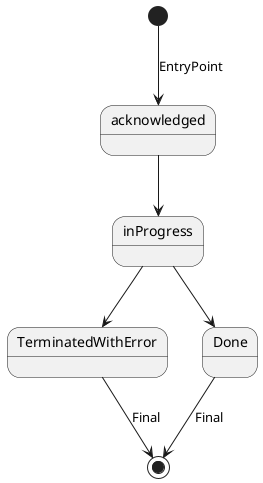
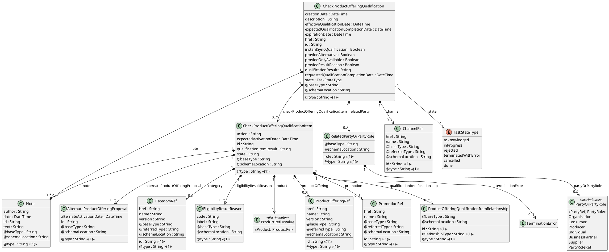
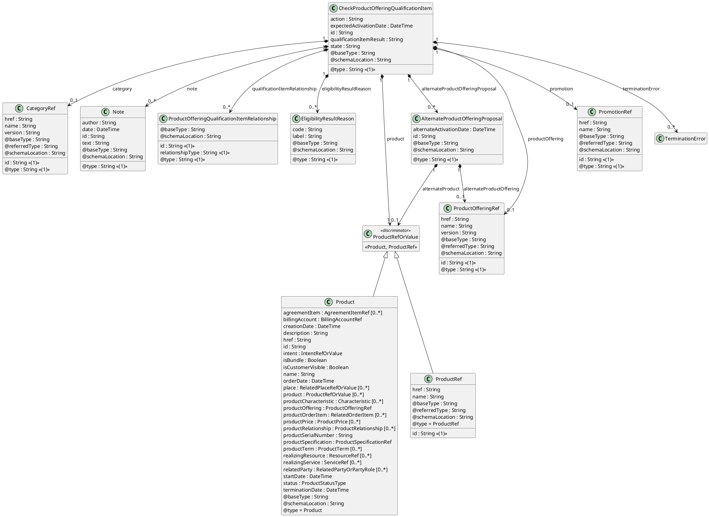
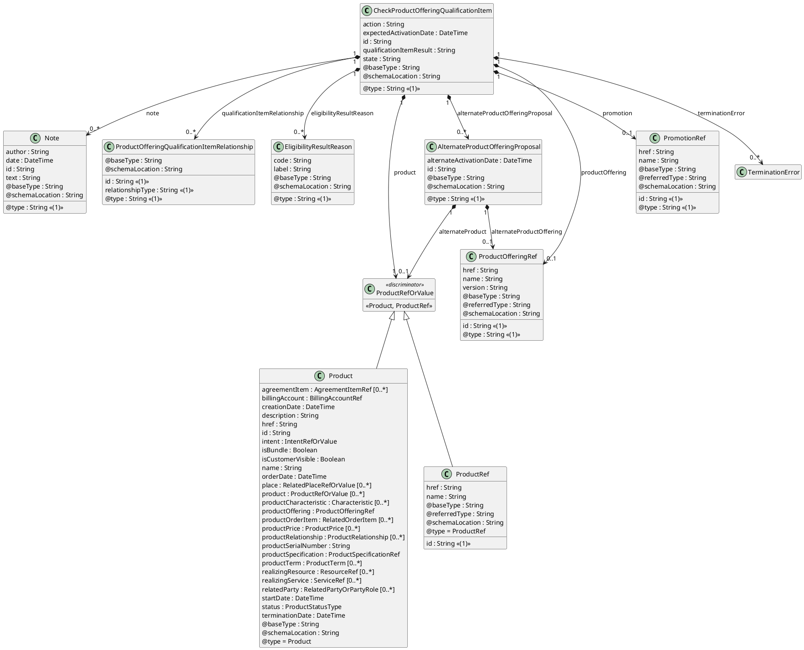
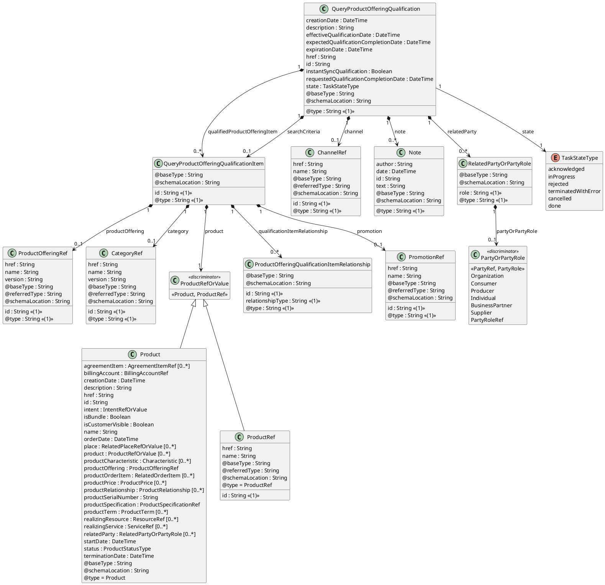
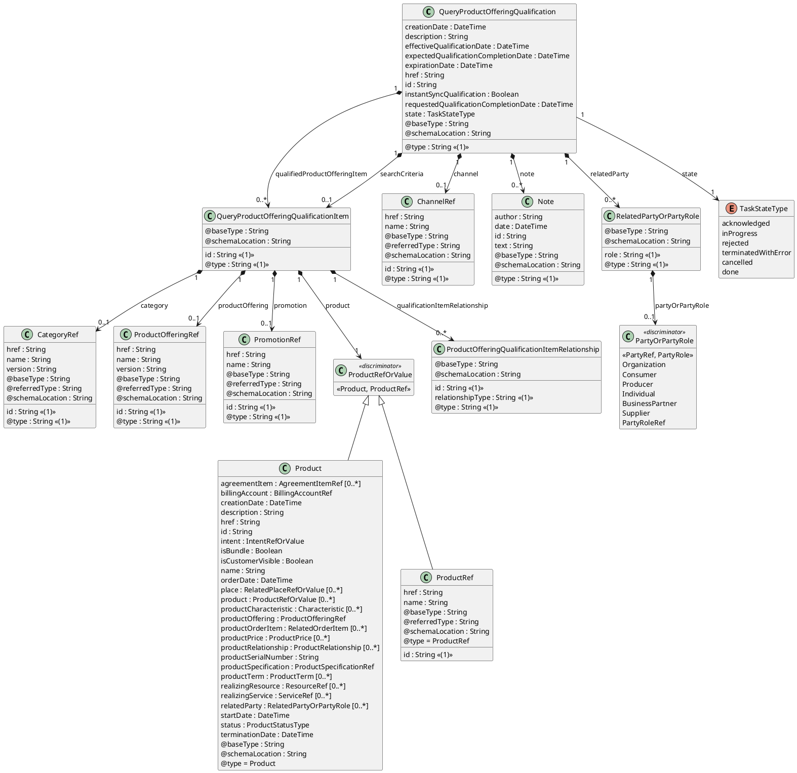

```markdown
# TM Forum Specification

## Product Offering Qualification

**TMF679**

|                           |                       |
| :------------------------ | :-------------------- |
| **Maturity Level:** TBD   | **Team Approved Date:** TBD |
| **Release Status:** TBD | **Approval Status:** TBD  |
| **Version TBD**           | **IPR Mode:** RAND    |

[Image: TM Forum Logo]

© TM Forum 2024. All Rights Reserved.

---

## NOTICE

Copyright © TM Forum 2024. All Rights Reserved.

This document and translations of it may be copied and furnished to others, and derivative works that comment on or otherwise explain it or assist in its implementation may be prepared, copied, published, and distributed, in whole or in part, without restriction of any kind, provided that the above copyright notice and this section are included on all such copies and derivative works. However, this document itself may not be modified in any way, including by removing the copyright notice or references to TM FORUM, except as needed for the purpose of developing any document or deliverable produced by a TM FORUM Collaboration Project Team (in which case the rules applicable to copyrights, as set forth in the TM FORUM IPR Policy, must be followed) or as required to translate it into languages other than English.

The limited permissions granted above are perpetual and will not be revoked by TM FORUM or its successors or assigns.

This document and the information contained herein is provided on an "AS IS" basis and TM FORUM DISCLAIMS ALL WARRANTIES, EXPRESS OR IMPLIED, INCLUDING BUT NOT LIMITED TO ANY WARRANTY THAT THE USE OF THE INFORMATION HEREIN WILL NOT INFRINGE ANY OWNERSHIP RIGHTS OR ANY IMPLIED WARRANTIES OF MERCHANTABILITY OR FITNESS FOR A PARTICULAR PURPOSE.

Direct inquiries to the TM Forum office:

181 New Road, Suite 304
Parsippany, NJ 07054, USA
Tel No. +1 862 227 1648
TM Forum Web Page: www.tmforum.org

Product Offering Qualification
© TM Forum 2024. All Rights Reserved. Page i

---

[Image: TM Forum Logo]

## Table of Contents

*   NOTICE . . . . . . . . . . . . . . . . . . . . . . . . . . . . . . . . . . . . . . . . . . . . . . . . . . . . . . . . . . . . . . . . . . i
*   Introduction . . . . . . . . . . . . . . . . . . . . . . . . . . . . . . . . . . . . . . . . . . . . . . . . . . . . . . . . . . . . . . . 1
    *   Lifecycle . . . . . . . . . . . . . . . . . . . . . . . . . . . . . . . . . . . . . . . . . . . . . . . . . . . . . . . . . . . . . . . 2
*   Sample Use Cases . . . . . . . . . . . . . . . . . . . . . . . . . . . . . . . . . . . . . . . . . . . . . . . . . . . . . . . . . 4
*   Support of polymorphism and extension patterns. . . . . . . . . . . . . . . . . . . . . . . . . . . . . . . . . . 5
*   RESOURCE MODEL . . . . . . . . . . . . . . . . . . . . . . . . . . . . . . . . . . . . . . . . . . . . . . . . . . . . . . . 6
    *   Managed Entity and Task Resource Models. . . . . . . . . . . . . . . . . . . . . . . . . . . . . . . . . . . . 6
        *   CheckProductOfferingQualification resource . . . . . . . . . . . . . . . . . . . . . . . . . . . . . . . . . 6
        *   QueryProductOfferingQualification resource. . . . . . . . . . . . . . . . . . . . . . . . . . . . . . . . . 60
    *   Notification Resource Models . . . . . . . . . . . . . . . . . . . . . . . . . . . . . . . . . . . . . . . . . . . . . 114
        *   CheckProductOfferingQualification . . . . . . . . . . . . . . . . . . . . . . . . . . . . . . . . . . . . . . 115
        *   QueryProductOfferingQualification . . . . . . . . . . . . . . . . . . . . . . . . . . . . . . . . . . . . . . 120
*   API OPERATIONS . . . . . . . . . . . . . . . . . . . . . . . . . . . . . . . . . . . . . . . . . . . . . . . . . . . . . . . 126
    *   Operations on CheckProductOfferingQualification . . . . . . . . . . . . . . . . . . . . . . . . . . . . . 126
        *   List or find CheckProductOfferingQualification objects . . . . . . . . . . . . . . . . . . . . . . . . 126
        *   Retrieves a CheckProductOfferingQualification by ID. . . . . . . . . . . . . . . . . . . . . . . . . 131
        *   Creates a CheckProductOfferingQualification. . . . . . . . . . . . . . . . . . . . . . . . . . . . . . . 135
        *   Updates partially a CheckProductOfferingQualification . . . . . . . . . . . . . . . . . . . . . . 139
        *   Deletes a CheckProductOfferingQualification. . . . . . . . . . . . . . . . . . . . . . . . . . . . . . . 148
    *   Operations on QueryProductOfferingQualification . . . . . . . . . . . . . . . . . . . . . . . . . . . . . 148
        *   List or find QueryProductOfferingQualification objects . . . . . . . . . . . . . . . . . . . . . . . . 148
        *   Retrieves a QueryProductOfferingQualification by ID. . . . . . . . . . . . . . . . . . . . . . . . . 152
        *   Creates a QueryProductOfferingQualification. . . . . . . . . . . . . . . . . . . . . . . . . . . . . . . 156
        *   Updates partially a QueryProductOfferingQualification. . . . . . . . . . . . . . . . . . . . . . . . 159
        *   Deletes a QueryProductOfferingQualification . . . . . . . . . . . . . . . . . . . . . . . . . . . . . . . 167
*   API NOTIFICATIONS . . . . . . . . . . . . . . . . . . . . . . . . . . . . . . . . . . . . . . . . . . . . . . . . . . . . . 168
    *   Register listener . . . . . . . . . . . . . . . . . . . . . . . . . . . . . . . . . . . . . . . . . . . . . . . . . . . . . . 168
    *   Unregister listener . . . . . . . . . . . . . . . . . . . . . . . . . . . . . . . . . . . . . . . . . . . . . . . . . . . . . . 169
    *   Publish Event to listener . . . . . . . . . . . . . . . . . . . . . . . . . . . . . . . . . . . . . . . . . . . . . . . . . 169
*   Acknowledgements . . . . . . . . . . . . . . . . . . . . . . . . . . . . . . . . . . . . . . . . . . . . . . . . . . . . . . . 171
*   Version History . . . . . . . . . . . . . . . . . . . . . . . . . . . . . . . . . . . . . . . . . . . . . . . . . . . . . . . . 171
*   Release History. . . . . . . . . . . . . . . . . . . . . . . . . . . . . . . . . . . . . . . . . . . . . . . . . . . . . . . . 171
*   Contributors to Document . . . . . . . . . . . . . . . . . . . . . . . . . . . . . . . . . . . . . . . . . . . . . . . . 171

Product Offering Qualification
© TM Forum 2024. All Rights Reserved. Page ii

---

[Image: TM Forum Logo]

# Introduction

The following document is the specification of the REST API for ProductOfferingQualification management. It includes the model definition as well as all available operations. In the Open Digital Economy where multiple actors (SDPs, CSPs, …) may be involved with the delivery of an end-to end service, those actors need to collaborate and interact with the customer as needed. Following diagram shows ProductOfferingQualification API within pre-ordering API package :

[Figure: Diagram showing the relationship between ProductOfferingQualification API and other pre-ordering APIs. Arrows connect 'Pre-ordering API' to 'Service Qualification', 'Shopping Cart', 'Product Catalog', 'ProductOffering Qualification', 'Product order', 'Address Search', 'Appointment', and 'Quote'. 'ProductOffering Qualification' is central, connected to 'Pre-ordering API', 'Product Catalog', 'Address Search', 'Shopping Cart', 'Product order', 'Appointment', and 'Quote'. This indicates its role in coordinating information and processes within the pre-ordering phase.]

ProductOfferingQualification API is one of Pre-Ordering Management API Family. The Product Offering Qualification API provides a standardized mechanism for placing a qualification request to check offer commercial eligibility with all of the necessary parameters. The API consists of a simple set of operations that interact with Catalog and Inventory systems in a consistent manner. A Product Offering Qualification is created based on a product offers that are defined in a catalog. Product Offering Qualification API is one of Pre-Ordering Management API Family. Product Offering Qualification API goal is to provide Product Offering commercial eligibility, with 2 resources :

*   CheckProductOfferingQualification
*   QueryProductOfferingQualification

CheckProductOfferingQualification allows to :

*   request a specific productOffering (of an array of productOffering) eligibility as an input a configured customer context. The requester will provide an array of product offering qualification item and expect to have a qualification result for each one of them.
*   in the request, the following attributes could/must be filled :
    *   relatedParty, for which the qualification must be done
    *   place,(where the customer wants his productOffering)

Product Offering Qualification
© TM Forum 2024. All Rights Reserved. Page 1

---

[Image: TM Forum Logo]

    *   channel, (sale channel of the current interaction where to make the qualification)
    *   expected activation date.
*   In the response, the API will provide qualification result but also :
    *   Eligibility result reason (if any)
    *   Alternate product offering proposal (if any).

QueryProductOfferingQualification allows to :

*   look for productOffering eligible (or not) from a product category
*   look for productOffering eligible (or not) from a productSpec description.
*   in the request, the following attributes could/must be filled : productOffering, or productSpec, or productCategory will be indicated (at least one is mandatory)

Because the API allows describing product from the inventory, it is also possible to use it to retrieve productOffering available to complete existing product.

ProductOfferingQualification API could be used… … Before Shopping Cart or ProductOrder API … After recommendation API to filtering result(s).

Product Offering Qualification API performs the following operations on Product Offering Qualification :

*   Retrieval of a Product Offering Qualification or a collection of Product Offering Qualification depending on filter criteria
*   Partial update of a Product Offering Qualification
*   Creation of a Product Offering Qualification
*   Deletion of Product Offering Qualification (for administration purposes)
*   Notification of events on Product Offering Qualification
    *   Product Offering Qualification creation
    *   Product Offering Qualification removal
    *   Product Offering Qualification state change
    *   Product Offering Qualification value change used to notify that any data in a Product Offering Qualification has just changed

The following Assumptions were considered in the development of this document :

*   The Product Offering Qualification management system has access to the commercial catalog system

## Lifecycle

The state machine specifying the typical state change transitions is provided below. This is standard task based resource lifecycle:

Product Offering Qualification
© TM Forum 2024. All Rights Reserved. Page 2

---

[Image: TM Forum Logo]



| State                 | Definition                                                                                                                             |
| :-------------------- | :------------------------------------------------------------------------------------------------------------------------------------- |
| **InProgress**        | The In Progress state is when the POQ is currently in the hands of the SP sales team to assess customer qualification request. Everything should be updatable in this state. |
| **Acknowledged**      | The acknowledged state is where a POQ request has been received and has passed message and basic business validations.               |
| **TerminatedWithError** | The CPOQ or QPOQ could not be correctly completed by SP sales team. Qualification is not available or partial.                     |
| **Done**              | Qualification has been done. The POQ is ready for client.                                                                                |

Product Offering Qualification
© TM Forum 2024. All Rights Reserved. Page 3

---

[Image: TM Forum Logo]

# Sample Use Cases

Reader will find example of use cases using Usage API in “Open Digital Business Scenarios and Use Cases” document.

For QueryProductOfferingQualification :

*   Perform a request for a broadband offer on the Web channel for a specific geographic location. The product offering qualification resust is qualified

For CheckProductOfferingQualification :

*   Perform a request for an new eLine on an existing UNI. The product offering qualification result is alternate – requested eLine capabilities are not available but alternate configuration is available.
*   Retrieve the list of productOfferingQualification with result qualified.

Product Offering Qualification
© TM Forum 2024. All Rights Reserved. Page 4

---

[Image: TM Forum Logo]

# Support of polymorphism and extension patterns

Support of polymorphic collections and types and schema based extension is provided by means of a list of generic meta-attributes that we describe below. Polymorphism in collections occurs when entities inherit from base entities, for instance a BillingAccount and SettlementAccount inheriting properties from the abstract Account entity.

Generic support of polymorphism and pattern extensions is described in the TMF API Guidelines v3.0 Part 2 document.

The `@type` attribute provides a way to represent the actual class type of an entity. For example, within a list of Account instances some may be instances of BillingAccount where other could be instances of SettlementAccount. The `@type` gives this information. All resources and sub-resources of this API have a `@type` attributes that can be provided when this is useful.

The `@referredType` can be used within reference entities (like for instance an AccountRef object) to explicitly denote the actual entity type of the referred class. Notice that in reference entities the `@type`, when used, denotes the class type of the reference itself, such as BillingAccountRef or SettlementAccountRef, and not the class type of the referred object. However since reference classes are rarely sub-classed, `@type` is generally not useful in reference objects.

The `@schemaLocation` property can be used in resources to allow specifying user-defined properties of an Entity or to specify the expected characteristics of an entity.

The `@baseType` attribute gives a way to provide explicitly the base of class of a given resource that has been extended.

Product Offering Qualification
© TM Forum 2024. All Rights Reserved. Page 5

---

[Image: TM Forum Logo]

# RESOURCE MODEL

ProductOfferingQualification is used to perform a commercial eligibility. It allows to retrieve a list of productOffering that are commercially available in the context of the interaction (defined be place, channel, party, product).

## Managed Entity and Task Resource Models

### CheckProductOfferingQualification resource

CheckProductOfferingQualification is used to perform a commercial eligibility. It allows to request an eligibility check for a list of productOfferings (one per item). The response will provide qualification result depending on catalog rules and of the context of the interaction (defined be place, channel, party, product).

#### Resource model



[Figure: Color legend for UML diagrams. Resource (entry point) is light yellow. Sub-resource is light blue. Sub-resource (reference entity) is pink. Sub-resource with details in separate diagram is light green. Enumeration is white.]

**(1) : Mandatory property**

**Figure 1 - CheckProductOfferingQualification**

Product Offering Qualification
© TM Forum 2024. All Rights Reserved. Page 6

---

[Image: TM Forum Logo]


[Figure: Color legend for UML diagrams. Resource (entry point) is light yellow. Sub-resource is light blue. Sub-resource (reference entity) is pink. Sub-resource with details in separate diagram is light green. Enumeration is white.]

**Figure 2 - CheckProductOfferingQualification**

[Figure: Placeholder for Figure 3 - Organization]

[Figure: Placeholder for Figure 4 - Organization]

[Figure: Placeholder for Figure 5 - Intent]

[Figure: Placeholder for Figure 6 - Intent]

Product Offering Qualification
© TM Forum 2024. All Rights Reserved. Page 7

---

[Image: TM Forum Logo]



[Figure: Color legend for UML diagrams. Sub-resource (sub-graph in current diagram) is purple. Sub-resource is light blue. Sub-resource (reference entity) is pink. Sub-resource with details in separate diagram is light green.]

**(1) : Mandatory property**

**Figure 7 - CheckProductOfferingQualificationItem**

Product Offering Qualification
© TM Forum 2024. All Rights Reserved. Page 8

---

[Image: TM Forum Logo]


[Figure: Color legend for UML diagrams. Sub-resource (sub-graph in current diagram) is purple. Sub-resource is light blue. Sub-resource (reference entity) is pink. Sub-resource with details in separate diagram is light green.]

**Figure 8 - CheckProductOfferingQualificationItem**

[Figure: Placeholder for Figure 9 - Individual]

[Figure: Placeholder for Figure 10 - Individual]

[Figure: Placeholder for Figure 11 - GeographicSiteFeature]

[Figure: Placeholder for Figure 12 - GeographicSiteFeature]

[Figure: Placeholder for Figure 13 - GeographicAddress]

[Figure: Placeholder for Figure 14 - GeographicAddress]

[Figure: Placeholder for Figure 15 - Party]

Product Offering Qualification
© TM Forum 2024. All Rights Reserved. Page 9

---

[Image: TM Forum Logo]

[Figure: Placeholder for Figure 16 - Party]

[Figure: Placeholder for Figure 17 - PartyOrPartyRole]

[Figure: Placeholder for Figure 18 - PartyOrPartyRole]

[Figure: Placeholder for Figure 19 - PartyRole]

[Figure: Placeholder for Figure 20 - PartyRole]

[Figure: Placeholder for Figure 21 - Product]

[Figure: Placeholder for Figure 22 - Product]

### Field descriptions

#### CheckProductOfferingQualification fields

*   **channel**: A ChannelRef. The channel to which the resource reference to. e.g. channel for selling product offerings, channel for opening a trouble ticket etc..
*   **checkProductOfferingQualificationItem**: A CheckProductOfferingQualificationItem.
*   **creationDate**: A DateTime. Date and time when the CheckProductOfferingQualification was created.
*   **description**: A String. Description of the CheckProductOfferingQualification.
*   **effectiveQualificationDate**: A DateTime. Effective date to CheckProductOfferingQualification completion.
*   **expectedQualificationCompletionDate**: A DateTime. Expected Date from server side to provide an answer for the check qualification request.
*   **expirationDate**: A DateTime. Date the qualification response expires.
*   **href**: A String. Hyperlink reference.
*   **id**: A String. Unique identifier.
*   **instantSyncQualification**: DEPRECATED A Boolean. A previous indicator which when the value is "true" means that requester expects to get qualifcation result immedi3ately in the response. If the indicator is true (or by default now without it) then the response code of 200 indicates the operation is successful otherwise a task is created with a response 201. For asynchronous, this attribute is now replaced by the header request "Expect: 202-Accepted".

Product Offering Qualification
© TM Forum 2024. All Rights Reserved. Page 10

---

[Image: TM Forum Logo]

*   **note**: A Note. Extra information about a given entity.
*   **provideAlternative**: A Boolean. An indicator which when the value is "true" means that alternative solutions should be provided.
*   **provideOnlyAvailable**: A Boolean. An indicator which when the value is "true" means that only available product offering must be listed in the response.
*   **provideResultReason**: A Boolean. An indicator which when the value is "true" means that result reason are expected for available or not of product offering.
*   **qualificationResult**: A String. Result of the qualification (example: green, yellow, red).
*   **relatedParty**: A RelatedPartyOrPartyRole. RelatedParty reference. A related party defines party or party role or its reference, linked to a specific entity.
*   **requestedQualificationCompletionDate**: A DateTime. Deadline date when the requester expected a qualification answer.
*   **state**: A TaskStateType. Possible values for the state of a task. ENUMERATED with values:
    *   acknowledged
    *   rejected
    *   inProgress
    *   cancelled
    *   done
    *   terminatedWithError
*   **@baseType**: A String. When sub-classing, this defines the super-class.
*   **@schemaLocation**: A String. A URI to a JSON-Schema file that defines additional attributes and relationships.
*   **@type**: A String. When sub-classing, this defines the sub-class Extensible name.

#### Note sub-resource fields

*   **author**: A String. Author of the note.
*   **date**: A DateTime. Date of the note.
*   **id**: A String. Identifier of the note within its containing entity.
*   **text**: A String. Text of the note.
*   **@baseType**: A String. When sub-classing, this defines the super-class.
*   **@schemaLocation**: A String. A URI to a JSON-Schema file that defines additional attributes and relationships.
*   **@type**: A String. When sub-classing, this defines the sub-class Extensible name.

#### RelatedPartyOrPartyRole sub-resource fields

*   **partyOrPartyRole**: A PartyOrPartyRole.

Product Offering Qualification
© TM Forum 2024. All Rights Reserved. Page 11

---

[Image: TM Forum Logo]

*   **role**: A String. Role played by the related party or party role in the context of the specific entity it is linked to. Such as 'initiator', 'customer', 'salesAgent', 'user'.
*   **@baseType**: A String. When sub-classing, this defines the super-class.
*   **@schemaLocation**: A String. A URI to a JSON-Schema file that defines additional attributes and relationships.
*   **@type**: A String. When sub-classing, this defines the sub-class Extensible name.

#### ChannelRef sub-resource fields

*   **href**: A String. Hyperlink reference.
*   **id**: A String. Unique identifier.
*   **name**: A String. Name of the referred entity.
*   **@baseType**: A String. When sub-classing, this defines the super-class.
*   **@referredType**: A String. The actual type of the target instance when needed for disambiguation.
*   **@schemaLocation**: A String. A URI to a JSON-Schema file that defines additional attributes and relationships.
*   **@type**: A String. When sub-classing, this defines the sub-class Extensible name.

#### CheckProductOfferingQualificationItem sub-resource fields

*   **CheckProductOfferingQualificationItem**: A CheckProductOfferingQualificationItem.
*   **action**: A String. Action to be performed on a ProductOffering or product in order to be qualified(add, modify, remove, etc.).
*   **alternateProductOfferingProposal**: An AlternateProductOfferingProposal. Alternate product Offering proposal is used when the requested product offering is not available with characteristic and date asked for. An alternate proposal could be a distinct product offering or product Spec close to requested one or same as requested but with a different activation date.
*   **category**: A CategoryRef. Reference to a category in the catalog.
*   **eligibilityResultReason**: An EligibilityResultReason. Reason for understanding the eligibility result, whatever the result is (availability or unavailability).
*   **expectedActivationDate**: A DateTime. Date when the requester look for productOfferingQualification activation.
*   **id**: A String. Identifier of the CheckProductOfferingQualification item (generally it is a sequence number 01, 02, 03, …).
*   **note**: A Note. Extra information about a given entity.

Product Offering Qualification
© TM Forum 2024. All Rights Reserved. Page 12

---

[Image: TM Forum Logo]

*   **product**: A ProductRefOrValue. The polymorphic attributes @type, @schemaLocation & @referredType are related to the Product entity and not the ProductRefOrValue class itself.
*   **productOffering**: A ProductOfferingRef. ProductOffering reference. A product offering represents entities that are orderable from the provider of the catalog, this resource includes pricing information.
*   **promotion**: A PromotionRef. Promotion reference. Promotion Resource is used to provide the additional discount, voucher, bonus or gift to the customer who meets the pre-defined criteria. Using promotion, the enterprise is able to attract the users and encourage more consumption, especially continuous purchases.
*   **qualificationItemRelationship**: A ProductOfferingQualificationItemRelationship. Structure used to describe relationship between productOfferingQualification item from the same ProductOfferingQualification.
*   **qualificationItemResult**: A String. Qualification result for this checkProductOfferingQualification item. It could be qualified (request productOffering or productSpecification are available), unqualified (requested not available and not alternate available), alternate (requested not available but alternate proposal available).
*   **state**: A String. State of the CheckProductOfferingQualification item : described in the state machine diagram.
*   **terminationError**: A TerminationError. Extra information about a given entity.
*   **@baseType**: A String. When sub-classing, this defines the super-class.
*   **@schemaLocation**: A String. A URI to a JSON-Schema file that defines additional attributes and relationships.
*   **@type**: A String. When sub-classing, this defines the sub-class Extensible name.

#### PartyRef sub-resource fields

*   **href**: A String. Hyperlink reference.
*   **id**: A String. Unique identifier.
*   **name**: A String. Name of the referred entity.
*   **@baseType**: A String. When sub-classing, this defines the super-class.
*   **@referredType**: A String. The actual type of the target instance when needed for disambiguation.
*   **@schemaLocation**: A String. A URI to a JSON-Schema file that defines additional attributes and relationships.
*   **@type**: A String. When sub-classing, this defines the sub-class Extensible name.

#### PartyRole sub-resource fields

Product Offering Qualification
© TM Forum 2024. All Rights Reserved. Page 13

---

[Image: TM Forum Logo]

*   **account**: An AccountRef. Account reference. A account may be a party account or a financial account.
*   **agreement**: An AgreementRef. Agreement reference. An agreement represents a contract or arrangement, either written or verbal and sometimes enforceable by law, such as a service level agreement or a customer price agreement. An agreement involves a number of other business entities, such as products, services, and resources and/or their specifications.
*   **characteristic**: A Characteristic. Describes a given characteristic of an object or entity through a name/value pair. This is an abstract base class, the actual value is in one of the strongly-typed subclasses : StringCharacteristic, ObjectCharacteristic, FloatCharacteristic, BooleanCharacteristic, NumberCharacteristic, IntegerCharacteristic, StringArrayCharacteristic, ObjectArrayCharacteristic, BooleanArrayCharacteristic, NumberArrayCharacteristic, IntegerArrayCharacteristic…
    Characteristic can be instanciated as
    *   BooleanArrayCharacteristic
    *   BooleanCharacteristic
    *   IntegerArrayCharacteristic
    *   IntegerCharacteristic
    *   NumberArrayCharacteristic
    *   NumberCharacteristic
    *   ObjectArrayCharacteristic
    *   ObjectCharacteristic
    *   StringArrayCharacteristic
    *   StringCharacteristic
*   **contactMedium**: A ContactMedium. Indicates the contact medium that could be used to contact the party. This is an abstract base class, the actual value is in one of the strongly-typed subclasses : EmailContactMedium, FaxContactMedium, PhoneContactMedium, GeographicAddressContactMedium, SocialMediaContactMedium…
*   **creditProfile**: A CreditProfile. Credit profile for the party (containing credit scoring, …). By default only the current credit profile is retrieved. It can be used as a list to give the party credit profiles history, the first one in the list will be the current one.
*   **description**: A String. A description of the PartyRole.
*   **engagedParty**: A PartyRef. A Party reference.
*   **href**: A String. Hyperlink reference.
*   **id**: A String. Unique identifier.
*   **name**: A String. A word, term, or phrase by which the PartyRole is known and distinguished from other PartyRoles. It’s the name of the PartyRole unique entity.
*   **partyRoleSpecification**: A PartyRoleSpecificationRef. Party role specification reference. A party role specification gives additional details on the part played by a party in a given context.

Product Offering Qualification
© TM Forum 2024. All Rights Reserved. Page 14

---

[Image: TM Forum Logo]

*   **paymentMethod**: A PaymentMethodRef. PaymentMethod reference. A payment method defines a specific mean of payment (e.g direct debit).
*   **relatedParty**: A RelatedPartyOrPartyRole. RelatedParty reference. A related party defines party or party role or its reference, linked to a specific entity.
*   **role**: A String. Role played by the engagedParty in this context. As role is defined by partyRoleSpecification, this role attribute can be used to precise the role defined by partyRoleSpecification, or it can be used to define the role in case there is no partyRoleSpecification.
*   **status**: A String. Used to track the lifecycle status of the party role.
*   **statusReason**: A String. A string providing an explanation on the value of the status lifecycle. For instance if the status is Rejected, statusReason will provide the reason for rejection.
*   **validFor**: A TimePeriod. A period of time, either as a deadline (endDateTime only) a startDateTime only, or both.
*   **@baseType**: A String. When sub-classing, this defines the super-class.
*   **@schemaLocation**: A String. A URI to a JSON-Schema file that defines additional attributes and relationships.
*   **@type**: A String. When sub-classing, this defines the sub-class Extensible name.
    PartyRole can be instanciated as
    *   BusinessPartner
    *   Consumer
    *   Producer
    *   Supplier

#### Organization sub-resource fields

*   **contactMedium**: A ContactMedium. Indicates the contact medium that could be used to contact the party. This is an abstract base class, the actual value is in one of the strongly-typed subclasses : EmailContactMedium, FaxContactMedium, PhoneContactMedium, GeographicAddressContactMedium, SocialMediaContactMedium…
*   **creditRating**: A PartyCreditProfile. An individual might be evaluated for its worthiness and this evaluation might be based on a credit rating given by a credit agency.
*   **existsDuring**: A TimePeriod. A period of time, either as a deadline (endDateTime only) a startDateTime only, or both.

Product Offering Qualification
© TM Forum 2024. All Rights Reserved. Page 15

---

[Image: TM Forum Logo]

*   **externalReference**: An ExternalIdentifier. An identification of an entity that is owned by or originates in a software system different from the current system, for example a ProductOrder handed off from a commerce platform into an order handling system. The structure identifies the system itself, the nature of the entity within the system (e.g. class name) and the unique ID of the entity within the system. It is anticipated that multiple external IDs can be held for a single entity, e.g. if the entity passed through multiple systems on the way to the current system. In this case the consumer is expected to sequence the IDs in the array in reverse order of provenance, i.e. most recent system first in the list.
*   **href**: A String. Hyperlink reference.
*   **id**: A String. Unique identifier.
*   **isHeadOffice**: A Boolean. If value is true, the organization is the head office.
*   **isLegalEntity**: A Boolean. If value is true, the organization is a legal entity known by a national referential.
*   **name**: A String. Organization name (department name for example).
*   **nameType**: A String. Type of the name : Co, Inc, Ltd, etc.
*   **organizationChildRelationship**: An OrganizationChildRelationship. Child references of an organization in a structure of organizations.
*   **organizationIdentification**: An OrganizationIdentification. Represents our registration of information used as proof of identity by an organization.
*   **organizationParentRelationship**: An OrganizationParentRelationship. Parent references of an organization in a structure of organizations.
*   **organizationType**: A String. Type of Organization (company, department…).
*   **otherName**: An OtherNameOrganization. Keeps track of other names, for example the old name of an organization.
*   **partyCharacteristic**: A Characteristic. Describes a given characteristic of an object or entity through a name/value pair. This is an abstract base class, the actual value is in one of the strongly-typed subclasses : StringCharacteristic, ObjectCharacteristic, FloatCharacteristic, BooleanCharacteristic, NumberCharacteristic, IntegerCharacteristic, StringArrayCharacteristic, ObjectArrayCharacteristic, BooleanArrayCharacteristic, NumberArrayCharacteristic, IntegerArrayCharacteristic…
    Characteristic can be instanciated as
    *   BooleanArrayCharacteristic
    *   BooleanCharacteristic
    *   IntegerArrayCharacteristic
    *   IntegerCharacteristic
    *   NumberArrayCharacteristic
    *   NumberCharacteristic
    *   ObjectArrayCharacteristic
    *   ObjectCharacteristic
    *   StringArrayCharacteristic
    *   StringCharacteristic

Product Offering Qualification
© TM Forum 2024. All Rights Reserved. Page 16

---

[Image: TM Forum Logo]

*   **relatedParty**: A RelatedPartyOrPartyRole. RelatedParty reference. A related party defines party or party role or its reference, linked to a specific entity.
*   **status**: An OrganizationStateType. Valid values for the lifecycle state of the organization. ENUMERATED with values:
    *   initialized
    *   validated
    *   closed
*   **taxExemptionCertificate**: A TaxExemptionCertificate. A tax exemption certificate represents a tax exemption granted to a party (individual or organization) by a tax jurisdiction which may be a city, state, country,… An exemption has a certificate identifier (received from the jurisdiction that levied the tax) and a validity period. An exemption is per tax types and determines for each type of tax what portion of the tax is exempted (partial by percentage or complete) via the tax definition.
*   **tradingName**: A String. Name that the organization (unit) trades under.
*   **@baseType**: A String. When sub-classing, this defines the super-class.
*   **@schemaLocation**: A String. A URI to a JSON-Schema file that defines additional attributes and relationships.
*   **@type**: A String. When sub-classing, this defines the sub-class Extensible name.

#### Consumer sub-resource fields

*   **account**: An AccountRef. Account reference. A account may be a party account or a financial account.
*   **agreement**: An AgreementRef. Agreement reference. An agreement represents a contract or arrangement, either written or verbal and sometimes enforceable by law, such as a service level agreement or a customer price agreement. An agreement involves a number of other business entities, such as products, services, and resources and/or their specifications.

Product Offering Qualification
© TM Forum 2024. All Rights Reserved. Page 17

---

[Image: TM Forum Logo]

*   **characteristic**: A Characteristic. Describes a given characteristic of an object or entity through a name/value pair. This is an abstract base class, the actual value is in one of the strongly-typed subclasses : StringCharacteristic, ObjectCharacteristic, FloatCharacteristic, BooleanCharacteristic, NumberCharacteristic, IntegerCharacteristic, StringArrayCharacteristic, ObjectArrayCharacteristic, BooleanArrayCharacteristic, NumberArrayCharacteristic, IntegerArrayCharacteristic…
    Characteristic can be instanciated as
    *   BooleanArrayCharacteristic
    *   BooleanCharacteristic
    *   IntegerArrayCharacteristic
    *   IntegerCharacteristic
    *   NumberArrayCharacteristic
    *   NumberCharacteristic
    *   ObjectArrayCharacteristic
    *   ObjectCharacteristic
    *   StringArrayCharacteristic
    *   StringCharacteristic
*   **contactMedium**: A ContactMedium. Indicates the contact medium that could be used to contact the party. This is an abstract base class, the actual value is in one of the strongly-typed subclasses : EmailContactMedium, FaxContactMedium, PhoneContactMedium, GeographicAddressContactMedium, SocialMediaContactMedium…
*   **creditProfile**: A CreditProfile. Credit profile for the party (containing credit scoring, …). By default only the current credit profile is retrieved. It can be used as a list to give the party credit profiles history, the first one in the list will be the current one.
*   **description**: A String. A description of the PartyRole.
*   **engagedParty**: A PartyRef. A Party reference.
*   **href**: A String. Hyperlink reference.
*   **id**: A String. Unique identifier.
*   **name**: A String. A word, term, or phrase by which the PartyRole is known and distinguished from other PartyRoles. It’s the name of the PartyRole unique entity.
*   **partyRoleSpecification**: A PartyRoleSpecificationRef. Party role specification reference. A party role specification gives additional details on the part played by a party in a given context.
*   **paymentMethod**: A PaymentMethodRef. PaymentMethod reference. A payment method defines a specific mean of payment (e.g direct debit).
*   **relatedParty**: A RelatedPartyOrPartyRole. RelatedParty reference. A related party defines party or party role or its reference, linked to a specific entity.

Product Offering Qualification
© TM Forum 2024. All Rights Reserved. Page 18

---

[Image: TM Forum Logo]

*   **role**: A String. Role played by the engagedParty in this context. As role is defined by partyRoleSpecification, this role attribute can be used to precise the role defined by partyRoleSpecification, or it can be used to define the role in case there is no partyRoleSpecification.
*   **status**: A String. Used to track the lifecycle status of the party role.
*   **statusReason**: A String. A string providing an explanation on the value of the status lifecycle. For instance if the status is Rejected, statusReason will provide the reason for rejection.
*   **validFor**: A TimePeriod. A period of time, either as a deadline (endDateTime only) a startDateTime only, or both.
*   **@baseType**: A String. When sub-classing, this defines the super-class.
*   **@schemaLocation**: A String. A URI to a JSON-Schema file that defines additional attributes and relationships.
*   **@type**: A String. When sub-classing, this defines the sub-class Extensible name.

#### Producer sub-resource fields

*   **account**: An AccountRef. Account reference. A account may be a party account or a financial account.
*   **agreement**: An AgreementRef. Agreement reference. An agreement represents a contract or arrangement, either written or verbal and sometimes enforceable by law, such as a service level agreement or a customer price agreement. An agreement involves a number of other business entities, such as products, services, and resources and/or their specifications.
*   **characteristic**: A Characteristic. Describes a given characteristic of an object or entity through a name/value pair. This is an abstract base class, the actual value is in one of the strongly-typed subclasses : StringCharacteristic, ObjectCharacteristic, FloatCharacteristic, BooleanCharacteristic, NumberCharacteristic, IntegerCharacteristic, StringArrayCharacteristic, ObjectArrayCharacteristic, BooleanArrayCharacteristic, NumberArrayCharacteristic, IntegerArrayCharacteristic…
    Characteristic can be instanciated as
    *   BooleanArrayCharacteristic
    *   BooleanCharacteristic
    *   IntegerArrayCharacteristic
    *   IntegerCharacteristic
    *   NumberArrayCharacteristic
    *   NumberCharacteristic
    *   ObjectArrayCharacteristic
    *   ObjectCharacteristic
    *   StringArrayCharacteristic
    *   StringCharacteristic

Product Offering Qualification
© TM Forum 2024. All Rights Reserved. Page 19

---

[Image: TM Forum Logo]

*   **contactMedium**: A ContactMedium. Indicates the contact medium that could be used to contact the party. This is an abstract base class, the actual value is in one of the strongly-typed subclasses : EmailContactMedium, FaxContactMedium, PhoneContactMedium, GeographicAddressContactMedium, SocialMediaContactMedium…
*   **creditProfile**: A CreditProfile. Credit profile for the party (containing credit scoring, …). By default only the current credit profile is retrieved. It can be used as a list to give the party credit profiles history, the first one in the list will be the current one.
*   **description**: A String. A description of the PartyRole.
*   **engagedParty**: A PartyRef. A Party reference.
*   **href**: A String. Hyperlink reference.
*   **id**: A String. Unique identifier.
*   **name**: A String. A word, term, or phrase by which the PartyRole is known and distinguished from other PartyRoles. It’s the name of the PartyRole unique entity.
*   **partyRoleSpecification**: A PartyRoleSpecificationRef. Party role specification reference. A party role specification gives additional details on the part played by a party in a given context.
*   **paymentMethod**: A PaymentMethodRef. PaymentMethod reference. A payment method defines a specific mean of payment (e.g direct debit).
*   **relatedParty**: A RelatedPartyOrPartyRole. RelatedParty reference. A related party defines party or party role or its reference, linked to a specific entity.
*   **role**: A String. Role played by the engagedParty in this context. As role is defined by partyRoleSpecification, this role attribute can be used to precise the role defined by partyRoleSpecification, or it can be used to define the role in case there is no partyRoleSpecification.
*   **status**: A String. Used to track the lifecycle status of the party role.
*   **statusReason**: A String. A string providing an explanation on the value of the status lifecycle. For instance if the status is Rejected, statusReason will provide the reason for rejection.
*   **validFor**: A TimePeriod. A period of time, either as a deadline (endDateTime only) a startDateTime only, or both.
*   **@baseType**: A String. When sub-classing, this defines the super-class.
*   **@schemaLocation**: A String. A URI to a JSON-Schema file that defines additional attributes and relationships.
*   **@type**: A String. When sub-classing, this defines the sub-class Extensible name.

#### Individual sub-resource fields

*   **aristocraticTitle**: A String. E.g. Baron, Graf, Earl.

Product Offering Qualification
© TM Forum 2024. All Rights Reserved. Page 20

---

[Image: TM Forum Logo]

*   **birthDate**: A DateTime. Birth date.
*   **contactMedium**: A ContactMedium. Indicates the contact medium that could be used to contact the party. This is an abstract base class, the actual value is in one of the strongly-typed subclasses : EmailContactMedium, FaxContactMedium, PhoneContactMedium, GeographicAddressContactMedium, SocialMediaContactMedium…
*   **countryOfBirth**: A String. Country where the individual was born.
*   **creditRating**: A PartyCreditProfile. An individual might be evaluated for its worthiness and this evaluation might be based on a credit rating given by a credit agency.
*   **deathDate**: A DateTime. Date of death.
*   **disability**: A Disability. Lack or inadequate strength or ability.
*   **externalReference**: An ExternalIdentifier. An identification of an entity that is owned by or originates in a software system different from the current system, for example a ProductOrder handed off from a commerce platform into an order handling system. The structure identifies the system itself, the nature of the entity within the system (e.g. class name) and the unique ID of the entity within the system. It is anticipated that multiple external IDs can be held for a single entity, e.g. if the entity passed through multiple systems on the way to the current system. In this case the consumer is expected to sequence the IDs in the array in reverse order of provenance, i.e. most recent system first in the list.
*   **familyName**: A String. Contains the non-chosen or inherited name. Also known as last name in the Western context.
*   **familyNamePrefix**: A String. Family name prefix.
*   **formattedName**: A String. A fully formatted name in one string with all of its pieces in their proper place and all of the necessary punctuation. Useful for specific contexts (Chinese, Japanese, Korean).
*   **gender**: A String. Gender.
*   **generation**: A String. E.g.. Sr, Jr, III (the third).
*   **givenName**: A String. First name of the individual.
*   **href**: A String. Hyperlink reference.
*   **id**: A String. Unique identifier.
*   **individualIdentification**: An IndividualIdentification. Represents our registration of information used as proof of identity by an individual (passport, national identity card, drivers license, social security number, birth certificate).
*   **languageAbility**: A LanguageAbility. Ability of an individual to understand or converse in a language.
*   **legalName**: A String. Legal name or birth name (name one has for official purposes).
*   **location**: A String. Temporary current location of the individual (may be used if the individual has approved its sharing).

Product Offering Qualification
© TM Forum 2024. All Rights Reserved. Page 21

---

[Image: TM Forum Logo]

*   **maritalStatus**: A String. Marital status (married, divorced, widow …).
*   **middleName**: A String. Middles name or initial.
*   **name**: A String. Full name flatten (first, middle, and last names) - this is the name that is expected to be presented in reference data types such as PartyRef, RelatedParty, etc. that refer to Individual.
*   **nationality**: A String. Nationality.
*   **otherName**: An OtherNameIndividual. Keeps track of other names, for example the old name of a woman before marriage or an artist name.
*   **partyCharacteristic**: A Characteristic. Describes a given characteristic of an object or entity through a name/value pair. This is an abstract base class, the actual value is in one of the strongly-typed subclasses : StringCharacteristic, ObjectCharacteristic, FloatCharacteristic, BooleanCharacteristic, NumberCharacteristic, IntegerCharacteristic, StringArrayCharacteristic, ObjectArrayCharacteristic, BooleanArrayCharacteristic, NumberArrayCharacteristic, IntegerArrayCharacteristic…
    Characteristic can be instanciated as
    *   BooleanArrayCharacteristic
    *   BooleanCharacteristic
    *   IntegerArrayCharacteristic
    *   IntegerCharacteristic
    *   NumberArrayCharacteristic
    *   NumberCharacteristic
    *   ObjectArrayCharacteristic
    *   ObjectCharacteristic
    *   StringArrayCharacteristic
    *   StringCharacteristic
*   **placeOfBirth**: A String. Reference to the place where the individual was born.
*   **preferredGivenName**: A String. Contains the chosen name by which the individual prefers to be addressed. Note: This name may be a name other than a given name, such as a nickname.
*   **relatedParty**: A RelatedPartyOrPartyRole. RelatedParty reference. A related party defines party or party role or its reference, linked to a specific entity.
*   **skill**: A Skill. Skills evaluated for an individual with a level and possibly with a limited validity when an obsolescence is defined (Ex: the first-aid certificate first level is limited to one year and an update training is required each year to keep the level).
*   **status**: An IndividualStateType. Valid values for the lifecycle state of the individual. ENUMERATED with values:
    *   initialized
    *   validated
    *   deceased

Product Offering Qualification
© TM Forum 2024. All Rights Reserved. Page 22

---

[Image: TM Forum Logo]

*   **taxExemptionCertificate**: A TaxExemptionCertificate. A tax exemption certificate represents a tax exemption granted to a party (individual or organization) by a tax jurisdiction which may be a city, state, country,… An exemption has a certificate identifier (received from the jurisdiction that levied the tax) and a validity period. An exemption is per tax types and determines for each type of tax what portion of the tax is exempted (partial by percentage or complete) via the tax definition.
*   **title**: A String. Useful for titles (aristocratic, social,…) Pr, Dr, Sir, …
*   **@baseType**: A String. When sub-classing, this defines the super-class.
*   **@schemaLocation**: A String. A URI to a JSON-Schema file that defines additional attributes and relationships.
*   **@type**: A String. When sub-classing, this defines the sub-class Extensible name.

#### BusinessPartner sub-resource fields

*   **account**: An AccountRef. Account reference. A account may be a party account or a financial account.
*   **agreement**: An AgreementRef. Agreement reference. An agreement represents a contract or arrangement, either written or verbal and sometimes enforceable by law, such as a service level agreement or a customer price agreement. An agreement involves a number of other business entities, such as products, services, and resources and/or their specifications.
*   **characteristic**: A Characteristic. Describes a given characteristic of an object or entity through a name/value pair. This is an abstract base class, the actual value is in one of the strongly-typed subclasses : StringCharacteristic, ObjectCharacteristic, FloatCharacteristic, BooleanCharacteristic, NumberCharacteristic, IntegerCharacteristic, StringArrayCharacteristic, ObjectArrayCharacteristic, BooleanArrayCharacteristic, NumberArrayCharacteristic, IntegerArrayCharacteristic…
    Characteristic can be instanciated as
    *   BooleanArrayCharacteristic
    *   BooleanCharacteristic
    *   IntegerArrayCharacteristic
    *   IntegerCharacteristic
    *   NumberArrayCharacteristic
    *   NumberCharacteristic
    *   ObjectArrayCharacteristic
    *   ObjectCharacteristic
    *   StringArrayCharacteristic
    *   StringCharacteristic
*   **contactMedium**: A ContactMedium. Indicates the contact medium that could be used to contact the party. This is an abstract base class, the actual value is in one of the strongly-typed subclasses : EmailContactMedium, FaxContactMedium, PhoneContactMedium, GeographicAddressContactMedium, SocialMediaContactMedium…

Product Offering Qualification
© TM Forum 2024. All Rights Reserved. Page 23

---

[Image: TM Forum Logo]

*   **creditProfile**: A CreditProfile. Credit profile for the party (containing credit scoring, …). By default only the current credit profile is retrieved. It can be used as a list to give the party credit profiles history, the first one in the list will be the current one.
*   **description**: A String. A description of the PartyRole.
*   **engagedParty**: A PartyRef. A Party reference.
*   **href**: A String. Hyperlink reference.
*   **id**: A String. Unique identifier.
*   **name**: A String. A word, term, or phrase by which the PartyRole is known and distinguished from other PartyRoles. It’s the name of the PartyRole unique entity.
*   **partyRoleSpecification**: A PartyRoleSpecificationRef. Party role specification reference. A party role specification gives additional details on the part played by a party in a given context.
*   **paymentMethod**: A PaymentMethodRef. PaymentMethod reference. A payment method defines a specific mean of payment (e.g direct debit).
*   **relatedParty**: A RelatedPartyOrPartyRole. RelatedParty reference. A related party defines party or party role or its reference, linked to a specific entity.
*   **role**: A String. Role played by the engagedParty in this context. As role is defined by partyRoleSpecification, this role attribute can be used to precise the role defined by partyRoleSpecification, or it can be used to define the role in case there is no partyRoleSpecification.
*   **status**: A String. Used to track the lifecycle status of the party role.
*   **statusReason**: A String. A string providing an explanation on the value of the status lifecycle. For instance if the status is Rejected, statusReason will provide the reason for rejection.
*   **validFor**: A TimePeriod. A period of time, either as a deadline (endDateTime only) a startDateTime only, or both.
*   **@baseType**: A String. When sub-classing, this defines the super-class.
*   **@schemaLocation**: A String. A URI to a JSON-Schema file that defines additional attributes and relationships.
*   **@type**: A String. When sub-classing, this defines the sub-class Extensible name.

#### Supplier sub-resource fields

*   **account**: An AccountRef. Account reference. A account may be a party account or a financial account.

Product Offering Qualification
© TM Forum 2024. All Rights Reserved. Page 24

---

[Image: TM Forum Logo]

*   **agreement**: An AgreementRef. Agreement reference. An agreement represents a contract or arrangement, either written or verbal and sometimes enforceable by law, such as a service level agreement or a customer price agreement. An agreement involves a number of other business entities, such as products, services, and resources and/or their specifications.
*   **characteristic**: A Characteristic. Describes a given characteristic of an object or entity through a name/value pair. This is an abstract base class, the actual value is in one of the strongly-typed subclasses : StringCharacteristic, ObjectCharacteristic, FloatCharacteristic, BooleanCharacteristic, NumberCharacteristic, IntegerCharacteristic, StringArrayCharacteristic, ObjectArrayCharacteristic, BooleanArrayCharacteristic, NumberArrayCharacteristic, IntegerArrayCharacteristic…
    Characteristic can be instanciated as
    *   BooleanArrayCharacteristic
    *   BooleanCharacteristic
    *   IntegerArrayCharacteristic
    *   IntegerCharacteristic
    *   NumberArrayCharacteristic
    *   NumberCharacteristic
    *   ObjectArrayCharacteristic
    *   ObjectCharacteristic
    *   StringArrayCharacteristic
    *   StringCharacteristic
*   **contactMedium**: A ContactMedium. Indicates the contact medium that could be used to contact the party. This is an abstract base class, the actual value is in one of the strongly-typed subclasses : EmailContactMedium, FaxContactMedium, PhoneContactMedium, GeographicAddressContactMedium, SocialMediaContactMedium…
*   **creditProfile**: A CreditProfile. Credit profile for the party (containing credit scoring, …). By default only the current credit profile is retrieved. It can be used as a list to give the party credit profiles history, the first one in the list will be the current one.
*   **description**: A String. A description of the PartyRole.
*   **engagedParty**: A PartyRef. A Party reference.
*   **href**: A String. Hyperlink reference.
*   **id**: A String. Unique identifier.
*   **name**: A String. A word, term, or phrase by which the PartyRole is known and distinguished from other PartyRoles. It’s the name of the PartyRole unique entity.
*   **partyRoleSpecification**: A PartyRoleSpecificationRef. Party role specification reference. A party role specification gives additional details on the part played by a party in a given context.
*   **paymentMethod**: A PaymentMethodRef. PaymentMethod reference. A payment method defines a specific mean of payment (e.g direct debit).

Product Offering Qualification
© TM Forum 2024. All Rights Reserved. Page 25

---

[Image: TM Forum Logo]

*   **relatedParty**: A RelatedPartyOrPartyRole. RelatedParty reference. A related party defines party or party role or its reference, linked to a specific entity.
*   **role**: A String. Role played by the engagedParty in this context. As role is defined by partyRoleSpecification, this role attribute can be used to precise the role defined by partyRoleSpecification, or it can be used to define the role in case there is no partyRoleSpecification.
*   **status**: A String. Used to track the lifecycle status of the party role.
*   **statusReason**: A String. A string providing an explanation on the value of the status lifecycle. For instance if the status is Rejected, statusReason will provide the reason for rejection.
*   **validFor**: A TimePeriod. A period of time, either as a deadline (endDateTime only) a startDateTime only, or both.
*   **@baseType**: A String. When sub-classing, this defines the super-class.
*   **@schemaLocation**: A String. A URI to a JSON-Schema file that defines additional attributes and relationships.
*   **@type**: A String. When sub-classing, this defines the sub-class Extensible name.

#### PartyRoleRef sub-resource fields

*   **href**: A String. Hyperlink reference.
*   **id**: A String. Unique identifier.
*   **name**: A String. Name of the referred entity.
*   **partyId**: A String. The identifier of the engaged party that is linked to the PartyRole object.
*   **partyName**: A String. The name of the engaged party that is linked to the PartyRole object.
*   **@baseType**: A String. When sub-classing, this defines the super-class.
*   **@referredType**: A String. The actual type of the target instance when needed for disambiguation.
*   **@schemaLocation**: A String. A URI to a JSON-Schema file that defines additional attributes and relationships.
*   **@type**: A String. When sub-classing, this defines the sub-class Extensible name.

#### Party sub-resource fields

*   **contactMedium**: A ContactMedium. Indicates the contact medium that could be used to contact the party. This is an abstract base class, the actual value is in one of the strongly-typed subclasses : EmailContactMedium, FaxContactMedium, PhoneContactMedium, GeographicAddressContactMedium, SocialMediaContactMedium…

Product Offering Qualification
© TM Forum 2024. All Rights Reserved. Page 26

---

[Image: TM Forum Logo]

*   **creditRating**: A PartyCreditProfile. An individual might be evaluated for its worthiness and this evaluation might be based on a credit rating given by a credit agency.
*   **externalReference**: An ExternalIdentifier. An identification of an entity that is owned by or originates in a software system different from the current system, for example a ProductOrder handed off from a commerce platform into an order handling system. The structure identifies the system itself, the nature of the entity within the system (e.g. class name) and the unique ID of the entity within the system. It is anticipated that multiple external IDs can be held for a single entity, e.g. if the entity passed through multiple systems on the way to the current system. In this case the consumer is expected to sequence the IDs in the array in reverse order of provenance, i.e. most recent system first in the list.
*   **href**: A String. Hyperlink reference.
*   **id**: A String. Unique identifier.
*   **partyCharacteristic**: A Characteristic. Describes a given characteristic of an object or entity through a name/value pair. This is an abstract base class, the actual value is in one of the strongly-typed subclasses : StringCharacteristic, ObjectCharacteristic, FloatCharacteristic, BooleanCharacteristic, NumberCharacteristic, IntegerCharacteristic, StringArrayCharacteristic, ObjectArrayCharacteristic, BooleanArrayCharacteristic, NumberArrayCharacteristic, IntegerArrayCharacteristic…
    Characteristic can be instanciated as
    *   BooleanArrayCharacteristic
    *   BooleanCharacteristic
    *   IntegerArrayCharacteristic
    *   IntegerCharacteristic
    *   NumberArrayCharacteristic
    *   NumberCharacteristic
    *   ObjectArrayCharacteristic
    *   ObjectCharacteristic
    *   StringArrayCharacteristic
    *   StringCharacteristic
*   **relatedParty**: A RelatedPartyOrPartyRole. RelatedParty reference. A related party defines party or party role or its reference, linked to a specific entity.
*   **taxExemptionCertificate**: A TaxExemptionCertificate. A tax exemption certificate represents a tax exemption granted to a party (individual or organization) by a tax jurisdiction which may be a city, state, country,… An exemption has a certificate identifier (received from the jurisdiction that levied the tax) and a validity period. An exemption is per tax types and determines for each type of tax what portion of the tax is exempted (partial by percentage or complete) via the tax definition.
*   **@baseType**: A String. When sub-classing, this defines the super-class.
*   **@schemaLocation**: A String. A URI to a JSON-Schema file that defines additional attributes and relationships.

Product Offering Qualification
© TM Forum 2024. All Rights Reserved. Page 27

---

[Image: TM Forum Logo]

*   **@type**: A String. When sub-classing, this defines the sub-class Extensible name.
    Party can be instanciated as
    *   Individual
    *   Organization
*   **aristocraticTitle**: This property is present in subclasses
*   **birthDate**: This property is present in subclasses
*   **countryOfBirth**: This property is present in subclasses
*   **deathDate**: This property is present in subclasses
*   **disability**: This property is present in subclasses
*   **existsDuring**: This property is present in subclasses
*   **familyName**: This property is present in subclasses
*   **familyNamePrefix**: This property is present in subclasses
*   **formattedName**: This property is present in subclasses
*   **gender**: This property is present in subclasses
*   **generation**: This property is present in subclasses
*   **givenName**: This property is present in subclasses
*   **individualIdentification**: This property is present in subclasses
*   **isHeadOffice**: This property is present in subclasses
*   **isLegalEntity**: This property is present in subclasses
*   **languageAbility**: This property is present in subclasses
*   **legalName**: This property is present in subclasses
*   **location**: This property is present in subclasses
*   **maritalStatus**: This property is present in subclasses
*   **middleName**: This property is present in subclasses
*   **name**: This property is present in subclasses
*   **nameType**: This property is present in subclasses
*   **nationality**: This property is present in subclasses
*   **organizationChildRelationship**: This property is present in subclasses
*   **organizationIdentification**: This property is present in subclasses
*   **organizationParentRelationship**: This property is present in subclasses
*   **organizationType**: This property is present in subclasses
*   **otherName**: This property is present in subclasses
*   **placeOfBirth**: This property is present in subclasses
*   **preferredGivenName**: This property is present in subclasses
*   **skill**: This property is present in subclasses

Product Offering Qualification
© TM Forum 2024. All Rights Reserved. Page 28

---

[Image: TM Forum Logo]

*   **status**: This property is present in subclasses
*   **title**: This property is present in subclasses
*   **tradingName**: This property is present in subclasses

#### CreditProfile sub-resource fields

*   **creditProfileDate**: A DateTime. The date the profile was established.
*   **creditRiskRating**: An Integer. This is an integer whose value is used to rate the risk.
*   **creditScore**: An Integer. A measure of a person or organizations creditworthiness calculated on the basis of a combination of factors such as their income and credit history.
*   **href**: A String. Hyperlink reference.
*   **id**: A String. Unique identifier.
*   **validFor**: A TimePeriod. A period of time, either as a deadline (endDateTime only) a startDateTime only, or both.
*   **@baseType**: A String. When sub-classing, this defines the super-class.
*   **@schemaLocation**: A String. A URI to a JSON-Schema file that defines additional attributes and relationships.
*   **@type**: A String. When sub-classing, this defines the sub-class Extensible name.

#### ContactMedium sub-resource fields

*   **contactType**: A String. Type of the contact medium to qualify it like pro email / personal email. This is not used to define the contact medium used.
*   **id**: A String. Identifier for this contact medium.
*   **preferred**: A Boolean. If true, indicates that is the preferred contact medium.
*   **validFor**: A TimePeriod. A period of time, either as a deadline (endDateTime only) a startDateTime only, or both.
*   **@baseType**: A String. When sub-classing, this defines the super-class.
*   **@schemaLocation**: A String. A URI to a JSON-Schema file that defines additional attributes and relationships.
*   **@type**: A String. When sub-classing, this defines the sub-class Extensible name.

#### AgreementRef sub-resource fields

*   **href**: A String. Hyperlink reference.
*   **id**: A String. Unique identifier.
*   **name**: A String. Name of the referred entity.

Product Offering Qualification
© TM Forum 2024. All Rights Reserved. Page 29

---

[Image: TM Forum Logo]

*   **@baseType**: A String. When sub-classing, this defines the super-class.
*   **@referredType**: A String. The actual type of the target instance when needed for disambiguation.
*   **@schemaLocation**: A String. A URI to a JSON-Schema file that defines additional attributes and relationships.
*   **@type**: A String. When sub-classing, this defines the sub-class Extensible name.

#### ObjectCharacteristic sub-resource fields

*   **characteristicRelationship**: A CharacteristicRelationship. Another Characteristic that is related to the current Characteristic;.
*   **id**: A String. Unique identifier of the characteristic.
*   **name**: A String. Name of the characteristic.
*   **value**: An object. Value of the characteristic.
*   **valueType**: A String. Data type of the value of the characteristic.
*   **@baseType**: A String. When sub-classing, this defines the super-class.
*   **@schemaLocation**: A String. A URI to a JSON-Schema file that defines additional attributes and relationships.
*   **@type**: A String. When sub-classing, this defines the sub-class Extensible name.

#### NumberCharacteristic sub-resource fields

*   **characteristicRelationship**: A CharacteristicRelationship. Another Characteristic that is related to the current Characteristic;.
*   **id**: A String. Unique identifier of the characteristic.
*   **name**: A String. Name of the characteristic.
*   **value**: A Number. Value of the characteristic.
*   **valueType**: A String. Data type of the value of the characteristic.
*   **@baseType**: A String. When sub-classing, this defines the super-class.
*   **@schemaLocation**: A String. A URI to a JSON-Schema file that defines additional attributes and relationships.
*   **@type**: A String. When sub-classing, this defines the sub-class Extensible name.

#### BooleanArrayCharacteristic sub-resource fields

*   **characteristicRelationship**: A CharacteristicRelationship. Another Characteristic that is related to the current Characteristic;.
*   **id**: A String. Unique identifier of the characteristic.
*   **name**: A String. Name of the characteristic.

Product Offering Qualification
© TM Forum 2024. All Rights Reserved. Page 30

---

[Image: TM Forum Logo]

*   **value**: A Boolean. A characteristic which value is an array of Boolean(s).
*   **valueType**: A String. Data type of the value of the characteristic.
*   **@baseType**: A String. When sub-classing, this defines the super-class.
*   **@schemaLocation**: A String. A URI to a JSON-Schema file that defines additional attributes and relationships.
*   **@type**: A String. When sub-classing, this defines the sub-class Extensible name.

#### BooleanCharacteristic sub-resource fields

*   **characteristicRelationship**: A CharacteristicRelationship. Another Characteristic that is related to the current Characteristic;.
*   **id**: A String. Unique identifier of the characteristic.
*   **name**: A String. Name of the characteristic.
*   **value**: A Boolean. Value of the characteristic.
*   **valueType**: A String. Data type of the value of the characteristic.
*   **@baseType**: A String. When sub-classing, this defines the super-class.
*   **@schemaLocation**: A String. A URI to a JSON-Schema file that defines additional attributes and relationships.
*   **@type**: A String. When sub-classing, this defines the sub-class Extensible name.

#### NumberArrayCharacteristic sub-resource fields

*   **characteristicRelationship**: A CharacteristicRelationship. Another Characteristic that is related to the current Characteristic;.
*   **id**: A String. Unique identifier of the characteristic.
*   **name**: A String. Name of the characteristic.
*   **value**: A Number. A characteristic which value is an array of Number(s).
*   **valueType**: A String. Data type of the value of the characteristic.
*   **@baseType**: A String. When sub-classing, this defines the super-class.
*   **@schemaLocation**: A String. A URI to a JSON-Schema file that defines additional attributes and relationships.
*   **@type**: A String. When sub-classing, this defines the sub-class Extensible name.

#### IntegerCharacteristic sub-resource fields

*   **characteristicRelationship**: A CharacteristicRelationship. Another Characteristic that is related to the current Characteristic;.
*   **id**: A String. Unique identifier of the characteristic.

Product Offering Qualification
© TM Forum 2024. All Rights Reserved. Page 31

---

[Image: TM Forum Logo]

*   **name**: A String. Name of the characteristic.
*   **value**: An Integer. Value of the characteristic.
*   **valueType**: A String. Data type of the value of the characteristic.
*   **@baseType**: A String. When sub-classing, this defines the super-class.
*   **@schemaLocation**: A String. A URI to a JSON-Schema file that defines additional attributes and relationships.
*   **@type**: A String. When sub-classing, this defines the sub-class Extensible name.

#### ObjectArrayCharacteristic sub-resource fields

*   **characteristicRelationship**: A CharacteristicRelationship. Another Characteristic that is related to the current Characteristic;.
*   **id**: A String. Unique identifier of the characteristic.
*   **name**: A String. Name of the characteristic.
*   **value**: An object. Collection of characteristic values.
*   **valueType**: A String. Data type of the value of the characteristic.
*   **@baseType**: A String. When sub-classing, this defines the super-class.
*   **@schemaLocation**: A String. A URI to a JSON-Schema file that defines additional attributes and relationships.
*   **@type**: A String. When sub-classing, this defines the sub-class Extensible name.

#### StringArrayCharacteristic sub-resource fields

*   **characteristicRelationship**: A CharacteristicRelationship. Another Characteristic that is related to the current Characteristic;.
*   **id**: A String. Unique identifier of the characteristic.
*   **name**: A String. Name of the characteristic.
*   **value**: A String. Collection of string characteristics.
*   **valueType**: A String. Data type of the value of the characteristic.
*   **@baseType**: A String. When sub-classing, this defines the super-class.
*   **@schemaLocation**: A String. A URI to a JSON-Schema file that defines additional attributes and relationships.
*   **@type**: A String. When sub-classing, this defines the sub-class Extensible name.

#### IntegerArrayCharacteristic sub-resource fields

*   **characteristicRelationship**: A CharacteristicRelationship. Another Characteristic that is related to the current Characteristic;.

Product Offering Qualification
© TM Forum 2024. All Rights Reserved. Page 32

---

[Image: TM Forum Logo]

*   **id**: A String. Unique identifier of the characteristic.
*   **name**: A String. Name of the characteristic.
*   **value**: An Integer. A characteristic which value is an array of Integer(s).
*   **valueType**: A String. Data type of the value of the characteristic.
*   **@baseType**: A String. When sub-classing, this defines the super-class.
*   **@schemaLocation**: A String. A URI to a JSON-Schema file that defines additional attributes and relationships.
*   **@type**: A String. When sub-classing, this defines the sub-class Extensible name.

#### StringCharacteristic sub-resource fields

*   **characteristicRelationship**: A CharacteristicRelationship. Another Characteristic that is related to the current Characteristic;.
*   **id**: A String. Unique identifier of the characteristic.
*   **name**: A String. Name of the characteristic.
*   **value**: A String. Value of the characteristic.
*   **valueType**: A String. Data type of the value of the characteristic.
*   **@baseType**: A String. When sub-classing, this defines the super-class.
*   **@schemaLocation**: A String. A URI to a JSON-Schema file that defines additional attributes and relationships.
*   **@type**: A String. When sub-classing, this defines the sub-class Extensible name.

#### Characteristic sub-resource fields

*   **characteristicRelationship**: A CharacteristicRelationship. Another Characteristic that is related to the current Characteristic;.
*   **id**: A String. Unique identifier of the characteristic.
*   **name**: A String. Name of the characteristic.
*   **valueType**: A String. Data type of the value of the characteristic.
*   **@baseType**: A String. When sub-classing, this defines the super-class.
*   **@schemaLocation**: A String. A URI to a JSON-Schema file that defines additional attributes and relationships.
*   **@type**: A String. When sub-classing, this defines the sub-class Extensible name.

Product Offering Qualification
© TM Forum 2024. All Rights Reserved. Page 33

---

[Image: TM Forum Logo]

*   **Characteristic can be instanciated as**
    *   BooleanArrayCharacteristic
    *   BooleanCharacteristic
    *   IntegerArrayCharacteristic
    *   IntegerCharacteristic
    *   NumberArrayCharacteristic
    *   NumberCharacteristic
    *   ObjectArrayCharacteristic
    *   ObjectCharacteristic
    *   StringArrayCharacteristic
    *   StringCharacteristic
*   **value**: This property is present in subclasses

#### AccountRef sub-resource fields

*   **href**: A String. Hyperlink reference.
*   **id**: A String. Unique identifier.
*   **name**: A String. Name of the referred entity.
*   **@baseType**: A String. When sub-classing, this defines the super-class.
*   **@referredType**: A String. The actual type of the target instance when needed for disambiguation.
*   **@schemaLocation**: A String. A URI to a JSON-Schema file that defines additional attributes and relationships.
*   **@type**: A String. When sub-classing, this defines the sub-class Extensible name.

#### PartyRoleSpecificationRef sub-resource fields

*   **href**: A String. Hyperlink reference.
*   **id**: A String. Unique identifier.
*   **name**: A String. Name of the referred entity.
*   **@baseType**: A String. When sub-classing, this defines the super-class.
*   **@referredType**: A String. The actual type of the target instance when needed for disambiguation.
*   **@schemaLocation**: A String. A URI to a JSON-Schema file that defines additional attributes and relationships.
*   **@type**: A String. When sub-classing, this defines the sub-class Extensible name.

#### PaymentMethodRef sub-resource fields

*   **href**: A String. Hyperlink reference.
*   **id**: A String. Unique identifier.
*   **name**: A String. Name of the referred entity.

Product Offering Qualification
© TM Forum 2024. All Rights Reserved. Page 34

---

[Image: TM Forum Logo]

*   **@baseType**: A String. When sub-classing, this defines the super-class.
*   **@referredType**: A String. The actual type of the target instance when needed for disambiguation.
*   **@schemaLocation**: A String. A URI to a JSON-Schema file that defines additional attributes and relationships.
*   **@type**: A String. When sub-classing, this defines the sub-class Extensible name.

#### CharacteristicRelationship sub-resource fields

*   **id**: A String. Unique identifier of the characteristic.
*   **relationshipType**: A String. The type of relationship.
*   **@baseType**: A String. When sub-classing, this defines the super-class.
*   **@schemaLocation**: A String. A URI to a JSON-Schema file that defines additional attributes and relationships.
*   **@type**: A String. When sub-classing, this defines the sub-class Extensible name.

#### OrganizationParentRelationship sub-resource fields

*   **organization**: An OrganizationRef.
*   **relationshipType**: A String. Type of the relationship. Could be juridical, hierarchical, geographical, functional for example.
*   **@baseType**: A String. When sub-classing, this defines the super-class.
*   **@schemaLocation**: A String. A URI to a JSON-Schema file that defines additional attributes and relationships.
*   **@type**: A String. When sub-classing, this defines the sub-class Extensible name.

#### OrganizationIdentification sub-resource fields

*   **attachment**: An AttachmentRefOrValue. The polymorphic attributes @type, @schemaLocation & @referredType are related to the Attachment entity and not the AttachmentRefOrValue class itself.
*   **identificationId**: A String. Identifier.
*   **identificationType**: A String. Type of identification information used to identify the company in a country or internationally.
*   **issuingAuthority**: A String. Authority which has issued the identifier (chamber of commerce…).
*   **issuingDate**: A DateTime. Date at which the identifier was issued.
*   **validFor**: A TimePeriod. A period of time, either as a deadline (endDateTime only) a startDateTime only, or both.
*   **@baseType**: A String. When sub-classing, this defines the super-class.

Product Offering Qualification
© TM Forum 2024. All Rights Reserved. Page 35

---

[Image: TM Forum Logo]

*   **@schemaLocation**: A String. A URI to a JSON-Schema file that defines additional attributes and relationships.
*   **@type**: A String. When sub-classing, this defines the sub-class Extensible name.

#### OtherNameOrganization sub-resource fields

*   **name**: A String. Organization name (department name for example).
*   **nameType**: A String. Co. , Inc. , Ltd. , Pty Ltd. , Plc; , Gmbh.
*   **tradingName**: A String. The name that the organization trades under.
*   **validFor**: A TimePeriod. A period of time, either as a deadline (endDateTime only) a startDateTime only, or both.
*   **@baseType**: A String. When sub-classing, this defines the super-class.
*   **@schemaLocation**: A String. A URI to a JSON-Schema file that defines additional attributes and relationships.
*   **@type**: A String. When sub-classing, this defines the sub-class Extensible name.

#### OrganizationChildRelationship sub-resource fields

*   **organization**: An OrganizationRef.
*   **relationshipType**: A String. Type of the relationship. Could be juridical, hierarchical, geographical, functional for example.
*   **@baseType**: A String. When sub-classing, this defines the super-class.
*   **@schemaLocation**: A String. A URI to a JSON-Schema file that defines additional attributes and relationships.
*   **@type**: A String. When sub-classing, this defines the sub-class Extensible name.

#### OrganizationRef sub-resource fields

*   **href**: A String. Hyperlink reference.
*   **id**: A String. Unique identifier.
*   **name**: A String. Name of the referred entity.
*   **@baseType**: A String. When sub-classing, this defines the super-class.
*   **@referredType**: A String. The actual type of the target instance when needed for disambiguation.
*   **@schemaLocation**: A String. A URI to a JSON-Schema file that defines additional attributes and relationships.
*   **@type**: A String. When sub-classing, this defines the sub-class Extensible name.

#### Attachment sub-resource fields

Product Offering Qualification
© TM Forum 2024. All Rights Reserved. Page 36

---

[Image: TM Forum Logo]

*   **attachmentType**: A String. A business characterization of the purpose of the attachment, for example logo, instructionManual, contractCopy.
*   **content**: A Base64. The actual contents of the attachment object, if embedded, encoded as base64.
*   **description**: A String. A narrative text describing the content of the attachment.
*   **href**: A String. Hyperlink reference.
*   **id**: A String. Unique identifier.
*   **mimeType**: A String. A technical characterization of the attachment content format using IETF Mime Types.
*   **name**: A String. The name of the attachment.
*   **size**: A Quantity. An amount in a given unit.
*   **url**: A String. Uniform Resource Locator, is a web page address (a subset of URI).
*   **validFor**: A TimePeriod. A period of time, either as a deadline (endDateTime only) a startDateTime only, or both.
*   **@baseType**: A String. When sub-classing, this defines the super-class.
*   **@schemaLocation**: A String. A URI to a JSON-Schema file that defines additional attributes and relationships.
*   **@type**: A String. When sub-classing, this defines the sub-class Extensible name.

#### AttachmentRef sub-resource fields

*   **description**: A String. A narrative text describing the content of the attachment.
*   **href**: A String. Hyperlink reference.
*   **id**: A String. Unique identifier.
*   **name**: A String. Name of the referred entity.
*   **url**: A String. Link to the attachment media/content.
*   **@baseType**: A String. When sub-classing, this defines the super-class.
*   **@referredType**: A String. The actual type of the target instance when needed for disambiguation.
*   **@schemaLocation**: A String. A URI to a JSON-Schema file that defines additional attributes and relationships.
*   **@type**: A String. When sub-classing, this defines the sub-class Extensible name.

#### IndividualIdentification sub-resource fields

Product Offering Qualification
© TM Forum 2024. All Rights Reserved. Page 37

---

[Image: TM Forum Logo]

*   **attachment**: An AttachmentRefOrValue. The polymorphic attributes @type, @schemaLocation & @referredType are related to the Attachment entity and not the AttachmentRefOrValue class itself.
*   **identificationId**: A String. Identifier.
*   **identificationType**: A String. Identification type (passport, national identity card, drivers license, social security number, birth certificate).
*   **issuingAuthority**: A String. Authority which has issued the identifier, such as: social security, town hall.
*   **issuingDate**: A DateTime. Date at which the identifier was issued.
*   **validFor**: A TimePeriod. A period of time, either as a deadline (endDateTime only) a startDateTime only, or both.
*   **@baseType**: A String. When sub-classing, this defines the super-class.
*   **@schemaLocation**: A String. A URI to a JSON-Schema file that defines additional attributes and relationships.
*   **@type**: A String. When sub-classing, this defines the sub-class Extensible name.

#### ProductOfferingRef sub-resource fields

*   **href**: A String. Hyperlink reference.
*   **id**: A String. Unique identifier.
*   **name**: A String. Name of the referred entity.
*   **version**: A String. Version of the product offering.
*   **@baseType**: A String. When sub-classing, this defines the super-class.
*   **@referredType**: A String. The actual type of the target instance when needed for disambiguation.
*   **@schemaLocation**: A String. A URI to a JSON-Schema file that defines additional attributes and relationships.
*   **@type**: A String. When sub-classing, this defines the sub-class Extensible name.

#### CategoryRef sub-resource fields

*   **href**: A String. Hyperlink reference.
*   **id**: A String. Unique identifier.
*   **name**: A String. Name of the referred entity.
*   **version**: A String. Version of the category.
*   **@baseType**: A String. When sub-classing, this defines the super-class.
*   **@referredType**: A String. The actual type of the target instance when needed for disambiguation.
*   **@schemaLocation**: A String. A URI to a JSON-Schema file that defines additional attributes and relationships.

Product Offering Qualification
© TM Forum 2024. All Rights Reserved. Page 38

---

[Image: TM Forum Logo]

*   **@type**: A String. When sub-classing, this defines the sub-class Extensible name.

#### Product sub-resource fields

*   **agreementItem**: An AgreementItemRef. It’s a Agreement item that has been executed previously.
*   **billingAccount**: A BillingAccountRef. BillingAccount reference. A BillingAccount is a detailed description of a bill structure.
*   **creationDate**: A DateTime. Date and time when the product was created.
*   **description**: A String. Is the description of the product. It could be copied from the description of the Product Offering.
*   **href**: A String. Hyperlink reference.
*   **id**: A String. Unique identifier.
*   **intent**: An IntentRefOrValue. Intent Ref (if Intent already exists) or Value (if Intent be created or its details be presented).
*   **isBundle**: A Boolean. If true, the product is a ProductBundle which is an instantiation of a BundledProductOffering. If false, the product is a ProductComponent which is an instantiation of a SimpleProductOffering.
*   **isCustomerVisible**: A Boolean. If true, the product is visible by the customer.
*   **name**: A String. Name of the product. It could be the same as the name of the product offering.
*   **orderDate**: A DateTime. Is the date when the product was ordered.
*   **place**: A RelatedPlaceRefOrValue. Entity reference. The polymorphic attributes @type, @schemaLocation & @referredType are related to the RelatedPlace entity and not the RelatedPlaceRefOrValue class itself.
*   **product**: A ProductRefOrValue. The polymorphic attributes @type, @schemaLocation & @referredType are related to the Product entity and not the ProductRefOrValue class itself.

Product Offering Qualification
© TM Forum 2024. All Rights Reserved. Page 39

---

[Image: TM Forum Logo]

*   **productCharacteristic**: A Characteristic. Describes a given characteristic of an object or entity through a name/value pair. This is an abstract base class, the actual value is in one of the strongly-typed subclasses : StringCharacteristic, ObjectCharacteristic, FloatCharacteristic, BooleanCharacteristic, NumberCharacteristic, IntegerCharacteristic, StringArrayCharacteristic, ObjectArrayCharacteristic, BooleanArrayCharacteristic, NumberArrayCharacteristic, IntegerArrayCharacteristic…
    Characteristic can be instanciated as
    *   BooleanArrayCharacteristic
    *   BooleanCharacteristic
    *   IntegerArrayCharacteristic
    *   IntegerCharacteristic
    *   NumberArrayCharacteristic
    *   NumberCharacteristic
    *   ObjectArrayCharacteristic
    *   ObjectCharacteristic
    *   StringArrayCharacteristic
    *   StringCharacteristic
*   **productOffering**: A ProductOfferingRef. ProductOffering reference. A product offering represents entities that are orderable from the provider of the catalog, this resource includes pricing information.
*   **productOrderItem**: A RelatedOrderItem. It’s a Order item that has been executed previously.
*   **productPrice**: A ProductPrice. Description of price and discount awarded.
*   **productRelationship**: A ProductRelationship. Used to describe relationship between product.
*   **productSerialNumber**: A String. Is the serial number for the product. This is typically applicable to tangible products e.g. Broadband Router.
*   **productSpecification**: A ProductSpecificationRef. ProductSpecification reference. A product Specification represents entities that are orderable from the provider of the catalog.
*   **productTerm**: A ProductTerm. Description of a productTerm linked to this product. This represent a commitment with a duration.
*   **realizingResource**: A ResourceRef. Resource reference, for when Resource is used by other entities.
*   **realizingService**: A ServiceRef. Service reference, for when Service is used by other entities.
*   **relatedParty**: A RelatedPartyOrPartyRole. RelatedParty reference. A related party defines party or party role or its reference, linked to a specific entity.
*   **startDate**: A DateTime. Is the date from which the product starts.

Product Offering Qualification
© TM Forum 2024. All Rights Reserved. Page 40

---

[Image: TM Forum Logo]

*   **status**: A ProductStatusType. Possible values for the status of the product. ENUMERATED with values:
    *   created
    *   pendingActive
    *   cancelled
    *   active
    *   pendingTerminate
    *   terminated
    *   suspended
    *   aborted
*   **terminationDate**: A DateTime. Is the date when the product was terminated.
*   **@baseType**: A String. When sub-classing, this defines the super-class.
*   **@schemaLocation**: A String. A URI to a JSON-Schema file that defines additional attributes and relationships.
*   **@type**: A String. When sub-classing, this defines the sub-class Extensible name.

#### ProductRef sub-resource fields

*   **href**: A String. Hyperlink reference.
*   **id**: A String. Unique identifier.
*   **name**: A String. Name of the referred entity.
*   **@baseType**: A String. When sub-classing, this defines the super-class.
*   **@referredType**: A String. The actual type of the target instance when needed for disambiguation.
*   **@schemaLocation**: A String. A URI to a JSON-Schema file that defines additional attributes and relationships.
*   **@type**: A String. When sub-classing, this defines the sub-class Extensible name.

#### PromotionRef sub-resource fields

*   **href**: A String. Hyperlink reference.
*   **id**: A String. Unique identifier.
*   **name**: A String. Name of the referred entity.
*   **@baseType**: A String. When sub-classing, this defines the super-class.
*   **@referredType**: A String. The actual type of the target instance when needed for disambiguation.
*   **@schemaLocation**: A String. A URI to a JSON-Schema file that defines additional attributes and relationships.
*   **@type**: A String. When sub-classing, this defines the sub-class Extensible name.

#### ProductOfferingQualificationItemRelationship sub-resource fields

Product Offering Qualification
© TM Forum 2024. All Rights Reserved. Page 41

---

[Image: TM Forum Logo]

*   **id**: A String. Id of the related POQ item (must be in the same POQ).
*   **relationshipType**: A String. Relationship type as relies on, bundles, etc…
*   **@baseType**: A String. When sub-classing, this defines the super-class.
*   **@schemaLocation**: A String. A URI to a JSON-Schema file that defines additional attributes and relationships.
*   **@type**: A String. When sub-classing, this defines the sub-class Extensible name.

#### AlternateProductOfferingProposal sub-resource fields

*   **alternateActivationDate**: A DateTime. Alternate activation date in case seller is not able to meet requested expected activation date.
*   **alternateProduct**: A ProductRefOrValue. The polymorphic attributes @type, @schemaLocation & @referredType are related to the Product entity and not the ProductRefOrValue class itself.
*   **alternateProductOffering**: A ProductOfferingRef. ProductOffering reference. A product offering represents entities that are orderable from the provider of the catalog, this resource includes pricing information.
*   **id**: A String. Identifier of the AlternateProductOfferingProposal within its containing entity.
*   **promotion**: A PromotionRef. Promotion reference. Promotion Resource is used to provide the additional discount, voucher, bonus or gift to the customer who meets the pre-defined criteria. Using promotion, the enterprise is able to attract the users and encourage more consumption, especially continuous purchases.
*   **@baseType**: A String. When sub-classing, this defines the super-class.
*   **@schemaLocation**: A String. A URI to a JSON-Schema file that defines additional attributes and relationships.
*   **@type**: A String. When sub-classing, this defines the sub-class Extensible name.

#### EligibilityResultReason sub-resource fields

*   **code**: A String. Result reason code.
*   **label**: A String. Human readable result reason label.
*   **@baseType**: A String. When sub-classing, this defines the super-class.
*   **@schemaLocation**: A String. A URI to a JSON-Schema file that defines additional attributes and relationships.
*   **@type**: A String. When sub-classing, this defines the sub-class Extensible name.

#### BillingAccountRef sub-resource fields

*   **href**: A String. Hyperlink reference.

Product Offering Qualification
© TM Forum 2024. All Rights Reserved. Page 42

---

[Image: TM Forum Logo]

*   **id**: A String. Unique identifier.
*   **name**: A String. Name of the referred entity.
*   **ratingType**: A String. Indicates whether the account follows a specific payment option such as prepaid or postpaid.
*   **@baseType**: A String. When sub-classing, this defines the super-class.
*   **@referredType**: A String. The actual type of the target instance when needed for disambiguation.
*   **@schemaLocation**: A String. A URI to a JSON-Schema file that defines additional attributes and relationships.
*   **@type**: A String. When sub-classing, this defines the sub-class Extensible name.

#### ProductPrice sub-resource fields

*   **description**: A String. Description of the Product price.
*   **name**: A String. Name of the Product price.
*   **price**: A Price. Provides all amounts (tax included, duty free, tax rate), used currency and percentage to apply for Price and Price Alteration.
*   **priceAlteration**: A PriceAlteration. Is an amount, usually of money, that modifies the price charged for an order item.
*   **priceType**: A String. Indicate if the price is for recurrent or no-recurrent charge.
*   **productOfferingPrice**: A ProductOfferingPriceRef. ProductPriceOffering reference. An amount, usually of money, that is asked for or allowed when a ProductOffering is bought, rented, or leased.
*   **recurringChargePeriod**: A String. Used for recurring charge to indicate period (month, week, etc..).
*   **unitOfMeasure**: A String. Unit of Measure if price depending on it (Gb, SMS volume, etc..).
*   **@baseType**: A String. When sub-classing, this defines the super-class.
*   **@schemaLocation**: A String. A URI to a JSON-Schema file that defines additional attributes and relationships.
*   **@type**: A String. When sub-classing, this defines the sub-class Extensible name.

#### IntentRef sub-resource fields

*   **href**: A String. Hyperlink reference.
*   **id**: A String. Unique identifier.
*   **name**: A String. Name of the referred entity.
*   **@baseType**: A String. When sub-classing, this defines the super-class.

Product Offering Qualification
© TM Forum 2024. All Rights Reserved. Page 43

---

[Image: TM Forum Logo]

*   **@referredType**: A String. The actual type of the target instance when needed for disambiguation.
*   **@schemaLocation**: A String. A URI to a JSON-Schema file that defines additional attributes and relationships.
*   **@type**: A String. When sub-classing, this defines the sub-class Extensible name.

#### Intent sub-resource fields

*   **attachment**: An AttachmentRefOrValue. The polymorphic attributes @type, @schemaLocation & @referredType are related to the Attachment entity and not the AttachmentRefOrValue class itself.
*   **characteristic**: A Characteristic. Describes a given characteristic of an object or entity through a name/value pair. This is an abstract base class, the actual value is in one of the strongly-typed subclasses : StringCharacteristic, ObjectCharacteristic, FloatCharacteristic, BooleanCharacteristic, NumberCharacteristic, IntegerCharacteristic, StringArrayCharacteristic, ObjectArrayCharacteristic, BooleanArrayCharacteristic, NumberArrayCharacteristic, IntegerArrayCharacteristic…
    Characteristic can be instanciated as
    *   BooleanArrayCharacteristic
    *   BooleanCharacteristic
    *   IntegerArrayCharacteristic
    *   IntegerCharacteristic
    *   NumberArrayCharacteristic
    *   NumberCharacteristic
    *   ObjectArrayCharacteristic
    *   ObjectCharacteristic
    *   StringArrayCharacteristic
    *   StringCharacteristic
*   **context**: A String. A string used to give a context to the intent.
*   **creationDate**: A DateTime. Date and time of the creation of this REST resource.
*   **description**: A String. The description of the intent.
*   **expression**: An IntentExpression. An Intent expression.
*   **href**: A String. Hyperlink reference.
*   **id**: A String. Unique identifier.
*   **intentRelationship**: An EntityRelationship. A uni-directional relationship from this entity to a target entity instance.
*   **intentSpecification**: An EntityRef. Entity reference schema to be use for all entityRef class.
*   **isBundle**: A Boolean. IsBundle determines whether an intent represents a single intent (false), or a bundle of intents(true).
*   **lastUpdate**: A DateTime. Date and time of the last update of this REST resource.

Product Offering Qualification
© TM Forum 2024. All Rights Reserved. Page 44

---

[Image: TM Forum Logo]

*   **lifecycleStatus**: A String. Used to indicate the current lifecycle status of this intent.
*   **name**: A String. The name of the intent.
*   **priority**: A String. Can be used by intent owner to prioritize intents in an intent management system.
*   **relatedParty**: A RelatedPartyRefOrPartyRoleRef. RelatedParty reference. A related party defines party or party role or its reference, linked to a specific entity.
*   **statusChangeDate**: A DateTime. A date time( DateTime). The date that the entity status changed to the current one.
*   **validFor**: A TimePeriod. A period of time, either as a deadline (endDateTime only) a startDateTime only, or both.
*   **version**: A String. A field that identifies the specific version of an instance of an intent.
*   **@baseType**: A String. When sub-classing, this defines the super-class.
*   **@schemaLocation**: A String. A URI to a JSON-Schema file that defines additional attributes and relationships.
*   **@type**: A String. When sub-classing, this defines the sub-class Extensible name.

#### ProductRelationship sub-resource fields

*   **href**: A String. Hyperlink reference.
*   **id**: A String. Unique identifier.
*   **name**: A String. Name of the referred entity.
*   **relationshipType**: A String. Relationship type as relies on, bundles, etc…
*   **@baseType**: A String. When sub-classing, this defines the super-class.
*   **@referredType**: A String. The actual type of the target instance when needed for disambiguation.
*   **@schemaLocation**: A String. A URI to a JSON-Schema file that defines additional attributes and relationships.
*   **@type**: A String. When sub-classing, this defines the sub-class Extensible name.

#### RelatedOrderItem sub-resource fields

*   **orderHref**: A String. Reference of the related entity.
*   **orderId**: A String. Unique identifier of a related Order.

Product Offering Qualification
© TM Forum 2024. All Rights Reserved. Page 45

---

[Image: TM Forum Logo]

*   **orderItemAction**: An ItemActionType. Action to be performed on the entity managed by the item. ENUMERATED with values:
    *   add
    *   modify
    *   delete
    *   noChange
*   **orderItemId**: A String. Id of an item of a product order.
*   **role**: A String. Role played by the Order.
*   **@baseType**: A String. When sub-classing, this defines the super-class.
*   **@referredType**: A String. The actual type of the target instance when needed for disambiguation.
*   **@schemaLocation**: A String. A URI to a JSON-Schema file that defines additional attributes and relationships.
*   **@type**: A String. When sub-classing, this defines the sub-class Extensible name.

#### AgreementItemRef sub-resource fields

*   **agreementHref**: A String. Reference of the related entity.
*   **agreementId**: A String. Unique identifier of a related entity.
*   **agreementItemId**: A String. Id of an item of a Agreement.
*   **agreementName**: A String. Name of the related entity.
*   **@baseType**: A String. When sub-classing, this defines the super-class.
*   **@referredType**: A String. The actual type of the target instance when needed for disambiguation.
*   **@schemaLocation**: A String. A URI to a JSON-Schema file that defines additional attributes and relationships.
*   **@type**: A String. When sub-classing, this defines the sub-class Extensible name.

#### RelatedPlaceRefOrValue sub-resource fields

*   **place**: A PlaceRefOrValue. The polymorphic attributes @type, @schemaLocation & @referredType are related to the Place entity and not the PlaceRefOrValue class itself.
*   **role**: A String.
*   **@baseType**: A String. When sub-classing, this defines the super-class.
*   **@schemaLocation**: A String. A URI to a JSON-Schema file that defines additional attributes and relationships.
*   **@type**: A String. When sub-classing, this defines the sub-class Extensible name.

#### ResourceRef sub-resource fields

Product Offering Qualification
© TM Forum 2024. All Rights Reserved. Page 46

---

[Image: TM Forum Logo]

*   **href**: A String. Hyperlink reference.
*   **id**: A String. Unique identifier.
*   **name**: A String. Name of the referred entity.
*   **@baseType**: A String. When sub-classing, this defines the super-class.
*   **@referredType**: A String. The actual type of the target instance when needed for disambiguation.
*   **@schemaLocation**: A String. A URI to a JSON-Schema file that defines additional attributes and relationships.
*   **@type**: A String. When sub-classing, this defines the sub-class Extensible name.

#### ProductTerm sub-resource fields

*   **description**: A String. Description of the productTerm.
*   **duration**: A Duration. A time interval in a given unit of time.
*   **name**: A String. Name of the productTerm.
*   **validFor**: A TimePeriod. A period of time, either as a deadline (endDateTime only) a startDateTime only, or both.
*   **@baseType**: A String. When sub-classing, this defines the super-class.
*   **@schemaLocation**: A String. A URI to a JSON-Schema file that defines additional attributes and relationships.
*   **@type**: A String. When sub-classing, this defines the sub-class Extensible name.

#### ServiceRef sub-resource fields

*   **href**: A String. Hyperlink reference.
*   **id**: A String. Unique identifier.
*   **name**: A String. Name of the referred entity.
*   **@baseType**: A String. When sub-classing, this defines the super-class.
*   **@referredType**: A String. The actual type of the target instance when needed for disambiguation.
*   **@schemaLocation**: A String. A URI to a JSON-Schema file that defines additional attributes and relationships.
*   **@type**: A String. When sub-classing, this defines the sub-class Extensible name.

#### ProductSpecificationRef sub-resource fields

*   **href**: A String. Hyperlink reference.
*   **id**: A String. Unique identifier.

Product Offering Qualification
© TM Forum 2024. All Rights Reserved. Page 47

---

[Image: TM Forum Logo]

*   **name**: A String. Name of the referred entity.
*   **targetProductSchema**: A TargetProductSchema. The reference object to the schema and type of target product which is described by product specification.
*   **version**: A String. Version of the product specification.
*   **@baseType**: A String. When sub-classing, this defines the super-class.
*   **@referredType**: A String. The actual type of the target instance when needed for disambiguation.
*   **@schemaLocation**: A String. A URI to a JSON-Schema file that defines additional attributes and relationships.
*   **@type**: A String. When sub-classing, this defines the sub-class Extensible name.

#### PriceAlteration sub-resource fields

*   **applicationDuration**: An Integer. Duration during which the alteration applies on the order item price (for instance 2 months free of charge for the recurring charge).
*   **description**: A String. A narrative that explains in detail the semantics of this order item price alteration.
*   **name**: A String. Name of the order item price alteration.
*   **price**: A Price. Provides all amounts (tax included, duty free, tax rate), used currency and percentage to apply for Price and Price Alteration.
*   **priceType**: A String. A category that describes the price such as recurring, one time and usage.
*   **priority**: An Integer. Priority level for applying this alteration among all the defined alterations on the order item price.
*   **productOfferingPrice**: A ProductOfferingPriceRef. ProductPriceOffering reference. An amount, usually of money, that is asked for or allowed when a ProductOffering is bought, rented, or leased.
*   **recurringChargePeriod**: A String. Could be month, week…
*   **unitOfMeasure**: A String. Could be minutes, GB…
*   **@baseType**: A String. When sub-classing, this defines the super-class.
*   **@schemaLocation**: A String. A URI to a JSON-Schema file that defines additional attributes and relationships.
*   **@type**: A String. When sub-classing, this defines the sub-class Extensible name.

#### ProductOfferingPriceRef sub-resource fields

*   **href**: A String. Hyperlink reference.
*   **id**: A String. Unique identifier.

Product Offering Qualification
© TM Forum 2024. All Rights Reserved. Page 48

---

[Image: TM Forum Logo]

*   **name**: A String. Name of the referred entity.
*   **version**: A String. Version of the product offering price.
*   **@baseType**: A String. When sub-classing, this defines the super-class.
*   **@referredType**: A String. The actual type of the target instance when needed for disambiguation.
*   **@schemaLocation**: A String. A URI to a JSON-Schema file that defines additional attributes and relationships.
*   **@type**: A String. When sub-classing, this defines the sub-class Extensible name.

#### Price sub-resource fields

*   **dutyFreeAmount**: A Money. A base / value business entity used to represent money.
*   **percentage**: A Float. Percentage to apply for ProdOfferPriceAlteration.
*   **taxIncludedAmount**: A Money. A base / value business entity used to represent money.
*   **taxRate**: A Float. Tax rate.
*   **@baseType**: A String. When sub-classing, this defines the super-class.
*   **@schemaLocation**: A String. A URI to a JSON-Schema file that defines additional attributes and relationships.
*   **@type**: A String. When sub-classing, this defines the sub-class Extensible name.

#### IntentExpression sub-resource fields

*   **iri**: A String. Internationalized Resource Identifier of the intent Expression.
*   **@baseType**: A String. When sub-classing, this defines the super-class.
*   **@schemaLocation**: A String. A URI to a JSON-Schema file that defines additional attributes and relationships.
*   **@type**: A String. When sub-classing, this defines the sub-class Extensible name.

#### RelatedPartyRefOrPartyRoleRef sub-resource fields

*   **partyOrPartyRole**: A PartyRefOrPartyRoleRef.
*   **role**: A String. Role played by the related party or party role in the context of the specific entity it is linked to. Such as 'initiator', 'customer', 'salesAgent', 'user'.
*   **@baseType**: A String. When sub-classing, this defines the super-class.
*   **@schemaLocation**: A String. A URI to a JSON-Schema file that defines additional attributes and relationships.

Product Offering Qualification
© TM Forum 2024. All Rights Reserved. Page 49

---

[Image: TM Forum Logo]

*   **@type**: A String. When sub-classing, this defines the sub-class Extensible name.

#### GeographicAddress sub-resource fields

*   **city**: A String. City that the address is in.
*   **country**: A String. Country that the address is in.
*   **countryCode**: A StandardIdentifier. The corresponding identification of the resource in different standard, regulatory definitions. The standard specification identifier (e.g., ISO 3166-1 Alpha-2) and the corresponding value (e.g., BE) relevant to a particular resource. It is anticipated that multiple standards can provide definitions for a single entity, e.g., a country identifier can be specified in various standards (e.g., "ISO 3166-1 Alpha 2", "ISO 3166-1 Alpha 3", "ISO 3166-1 Numeric").
*   **externalIdentifier**: An ExternalIdentifier. An identification of an entity that is owned by or originates in a software system different from the current system, for example a ProductOrder handed off from a commerce platform into an order handling system. The structure identifies the system itself, the nature of the entity within the system (e.g. class name) and the unique ID of the entity within the system. It is anticipated that multiple external IDs can be held for a single entity, e.g. if the entity passed through multiple systems on the way to the current system. In this case the consumer is expected to sequence the IDs in the array in reverse order of provenance, i.e. most recent system first in the list.
*   **geographicAddressRelationship**: A GeographicAddressRelationship. The GeographicAddressRelationship schema represents a relationship between geographic addresses. It defines the structure for storing information about how two geographic addresses are related to each other within a system.
*   **geographicAddressType**: A String. Classification of the address, e.g., residential, industrial.
*   **geographicLocation**: A GeographicLocationRefOrValue. The polymorphic attributes @type, @schemaLocation & @referredType are related to the GeographicLocation entity and not the GeographicLocationRefOrValue class itself.
*   **geographicSite**: A GeographicSiteRefOrValue. The polymorphic attributes @type, @schemaLocation & @referredType are related to the GeographicSite entity and not the GeographicSiteRefOrValue class itself.
*   **geographicSubAddress**: A GeographicSubAddress. Representation of a GeographicSubAddress It is used for addressing within a property in an urban area (country properties are often defined differently). It may refer to a building, a building cluster, or a floor of a multistory building.
*   **href**: A String. Hyperlink reference.
*   **id**: A String. Unique identifier.

Product Offering Qualification
© TM Forum 2024. All Rights Reserved. Page 50

---

[Image: TM Forum Logo]

*   **locality**: A String. An area of defined or undefined boundaries within a local authority or other legislatively defined area, usually rural or semi rural in nature. [ANZLIC-STREET], or a suburb, a bounded locality within a city, town or shire principally of urban character [ANZLICSTREET].
*   **postcode**: A String. Descriptor for a postal delivery area, used to speed and simplify the delivery of mail (also know as zipcode).
*   **stateOrProvince**: A String. The State or Province that the address is in.
*   **streetName**: A String. Name of the street or other street type.
*   **streetNr**: A String. Number identifying a specific property on a public street. It may be combined with streetNrLast for ranged addresses.
*   **streetNrLast**: A String. Last number in a range of street numbers allocated to a property.
*   **streetNrLastSuffix**: A String. Last street number suffix for a ranged address.
*   **streetNrSuffix**: A String. The first street number suffix.
*   **streetSuffix**: A String. A modifier denoting a relative direction.
*   **streetType**: A String. Alley, avenue, boulevard, brae, crescent, drive, highway, lane, terrace, parade, place, tarn, way, wharf.
*   **@baseType**: A String. When sub-classing, this defines the super-class.
*   **@schemaLocation**: A String. A URI to a JSON-Schema file that defines additional attributes and relationships.
*   **@type**: A String. When sub-classing, this defines the sub-class Extensible name.

#### GeographicLocation sub-resource fields

*   **bbox**: A bbox. A bounding box array that contains the geometry. The axes order follows the axes order of the geometry.
*   **externalIdentifier**: An ExternalIdentifier. An identification of an entity that is owned by or originates in a software system different from the current system, for example a ProductOrder handed off from a commerce platform into an order handling system. The structure identifies the system itself, the nature of the entity within the system (e.g. class name) and the unique ID of the entity within the system. It is anticipated that multiple external IDs can be held for a single entity, e.g. if the entity passed through multiple systems on the way to the current system. In this case the consumer is expected to sequence the IDs in the array in reverse order of provenance, i.e. most recent system first in the list.
*   **href**: A String. Hyperlink reference.
*   **id**: A String. Unique identifier.
*   **@baseType**: A String. When sub-classing, this defines the super-class.
*   **@schemaLocation**: A String. A URI to a JSON-Schema file that defines additional attributes and relationships.

Product Offering Qualification
© TM Forum 2024. All Rights Reserved. Page 51

---

[Image: TM Forum Logo]

*   **@type**: A String. When sub-classing, this defines the sub-class Extensible name.

#### GeographicSite sub-resource fields

*   **calendar**: A CalendarPeriod. The CalendarPeriod schema represents a period of time within a calendar, defining various attributes such as the applicable day, timezone, hour period, and status. It is designed to capture information about the availability or status of a calendar period, which can be used in scheduling, booking, or resource allocation applications.
*   **code**: A String. A code that may be used for some addressing schemes eg: [ANSI T1.253-1999].
*   **contactMedium**: A ContactMedium. Indicates the contact medium that could be used to contact the party. This is an abstract base class, the actual value is in one of the strongly-typed subclasses : EmailContactMedium, FaxContactMedium, PhoneContactMedium, GeographicAddressContactMedium, SocialMediaContactMedium…
*   **creationDate**: A DateTime. Date and time when the GeographicSite was created.
*   **description**: A String. Text describing additional information regarding the site.
*   **externalIdentifier**: An ExternalIdentifier. An identification of an entity that is owned by or originates in a software system different from the current system, for example a ProductOrder handed off from a commerce platform into an order handling system. The structure identifies the system itself, the nature of the entity within the system (e.g. class name) and the unique ID of the entity within the system. It is anticipated that multiple external IDs can be held for a single entity, e.g. if the entity passed through multiple systems on the way to the current system. In this case the consumer is expected to sequence the IDs in the array in reverse order of provenance, i.e. most recent system first in the list.
*   **href**: A String. Hyperlink reference.
*   **id**: A String. Unique identifier.
*   **place**: A PlaceRefOrValue. The polymorphic attributes @type, @schemaLocation & @referredType are related to the Place entity and not the PlaceRefOrValue class itself.
*   **relatedParty**: A RelatedPartyRefOrPartyRoleRef. RelatedParty reference. A related party defines party or party role or its reference, linked to a specific entity.
*   **siteCategory**: A String. Site classification/category.
*   **siteFeature**: A GeographicSiteFeature. Geographic Site Feature captures various site information, ranging from survey data to safety guidelines and hazard information.
*   **siteRelationship**: A GeographicSiteRelationship. Details of geographic site relationship.

Product Offering Qualification
© TM Forum 2024. All Rights Reserved. Page 52

---

[Image: TM Forum Logo]

*   **status**: A String. The condition of the GeographicSite, such as planned, underConstruction, cancelled, active, inactive, former.
*   **@baseType**: A String. When sub-classing, this defines the super-class.
*   **@schemaLocation**: A String. A URI to a JSON-Schema file that defines additional attributes and relationships.
*   **@type**: A String. When sub-classing, this defines the sub-class Extensible name.

#### PlaceRef sub-resource fields

*   **href**: A String. Hyperlink reference.
*   **id**: A String. Unique identifier.
*   **name**: A String. Name of the referred entity.
*   **@baseType**: A String. When sub-classing, this defines the super-class.
*   **@referredType**: A String. The actual type of the target instance when needed for disambiguation.
*   **@schemaLocation**: A String. A URI to a JSON-Schema file that defines additional attributes and relationships.
*   **@type**: A String. When sub-classing, this defines the sub-class Extensible name.

#### Place sub-resource fields

*   **externalIdentifier**: An ExternalIdentifier. An identification of an entity that is owned by or originates in a software system different from the current system, for example a ProductOrder handed off from a commerce platform into an order handling system. The structure identifies the system itself, the nature of the entity within the system (e.g. class name) and the unique ID of the entity within the system. It is anticipated that multiple external IDs can be held for a single entity, e.g. if the entity passed through multiple systems on the way to the current system. In this case the consumer is expected to sequence the IDs in the array in reverse order of provenance, i.e. most recent system first in the list.
*   **href**: A String. Hyperlink reference.
*   **id**: A String. Unique identifier.
*   **@baseType**: A String. When sub-classing, this defines the super-class.
*   **@schemaLocation**: A String. A URI to a JSON-Schema file that defines additional attributes and relationships.
*   **@type**: A String. When sub-classing, this defines the sub-class Extensible name.
    Place can be instanciated as
    *   GeographicAddress
    *   GeographicLocation
    *   GeographicSite

Product Offering Qualification
© TM Forum 2024. All Rights Reserved. Page 53

---

[Image: TM Forum Logo]

*   **bbox**: This property is present in subclasses
*   **calendar**: This property is present in subclasses
*   **city**: This property is present in subclasses
*   **code**: This property is present in subclasses
*   **contactMedium**: This property is present in subclasses
*   **country**: This property is present in subclasses
*   **countryCode**: This property is present in subclasses
*   **creationDate**: This property is present in subclasses
*   **description**: This property is present in subclasses
*   **geographicAddressRelationship**: This property is present in subclasses
*   **geographicAddressType**: This property is present in subclasses
*   **geographicLocation**: This property is present in subclasses
*   **geographicSite**: This property is present in subclasses
*   **geographicSubAddress**: This property is present in subclasses
*   **locality**: This property is present in subclasses
*   **place**: This property is present in subclasses
*   **postcode**: This property is present in subclasses
*   **relatedParty**: This property is present in subclasses
*   **siteCategory**: This property is present in subclasses
*   **siteFeature**: This property is present in subclasses
*   **siteRelationship**: This property is present in subclasses
*   **stateOrProvince**: This property is present in subclasses
*   **status**: This property is present in subclasses
*   **streetName**: This property is present in subclasses
*   **streetNr**: This property is present in subclasses
*   **streetNrLast**: This property is present in subclasses
*   **streetNrLastSuffix**: This property is present in subclasses
*   **streetNrSuffix**: This property is present in subclasses
*   **streetSuffix**: This property is present in subclasses
*   **streetType**: This property is present in subclasses

#### GeographicAddressRelationship sub-resource fields

*   **href**: A String. Hyperlink reference.
*   **id**: A String. Unique identifier.
*   **name**: A String. Name of the referred entity.

Product Offering Qualification
© TM Forum 2024. All Rights Reserved. Page 54

---

[Image: TM Forum Logo]

*   **relationshipType**: A String. Type of relationship between the geographic addresses. This attribute specifies the nature of the relationship between the related addresses. It provides context for understanding how the addresses are related to each other.
*   **@baseType**: A String. When sub-classing, this defines the super-class.
*   **@referredType**: A String. The actual type of the target instance when needed for disambiguation.
*   **@schemaLocation**: A String. A URI to a JSON-Schema file that defines additional attributes and relationships.
*   **@type**: A String. When sub-classing, this defines the sub-class Extensible name.

#### StandardIdentifier sub-resource fields

*   **format**: A String. Standard/Regulatory definition identifier. e.g., ISO 3166-1.
*   **href**: A String. Hyperlink reference.
*   **id**: A String. Unique identifier.
*   **value**: A String. The value of the resource in the corresponding standard.e.g., a country code value.
*   **@baseType**: A String. When sub-classing, this defines the super-class.
*   **@schemaLocation**: A String. A URI to a JSON-Schema file that defines additional attributes and relationships.
*   **@type**: A String. When sub-classing, this defines the sub-class Extensible name.

#### GeographicLocationRef sub-resource fields

*   **href**: A String. Hyperlink reference.
*   **id**: A String. Unique identifier.
*   **name**: A String. Name of the referred entity.
*   **@baseType**: A String. When sub-classing, this defines the super-class.
*   **@referredType**: A String. The actual type of the target instance when needed for disambiguation.
*   **@schemaLocation**: A String. A URI to a JSON-Schema file that defines additional attributes and relationships.
*   **@type**: A String. When sub-classing, this defines the sub-class Extensible name.

#### GeographicSubAddress sub-resource fields

*   **buildingName**: A String. Allows for buildings that have well-known names.
*   **href**: A String. Hyperlink reference.

Product Offering Qualification
© TM Forum 2024. All Rights Reserved. Page 55

---

[Image: TM Forum Logo]

*   **id**: A String. Unique identifier.
*   **levelNumber**: A String. Used where a level type may be repeated e.g. BASEMENT 1, BASEMENT 2.
*   **levelType**: A String. Describes level types within a building.
*   **name**: A String. Name of the subAddress to identify it with a meaningful identification.
*   **privateStreetName**: A String. Private streets internal to a property (e.g. a university) may have internal names that are not recorded by the land title office.
*   **privateStreetNumber**: A String. Private streets numbers internal to a private street.
*   **subAddressType**: A String. Type of subAddress : it can be a subunit or a private street.
*   **subUnit**: A GeographicSubAddressUnit. Representation of a SubUnit. It is used for describing subunit within a subAddress e.g. BERTH, FLAT, PIER, SUITE, SHOP, TOWER, UNIT, WHARF.
*   **@baseType**: A String. When sub-classing, this defines the super-class.
*   **@schemaLocation**: A String. A URI to a JSON-Schema file that defines additional attributes and relationships.
*   **@type**: A String. When sub-classing, this defines the sub-class Extensible name.

#### GeographicSiteRef sub-resource fields

*   **href**: A String. Hyperlink reference.
*   **id**: A String. Unique identifier.
*   **name**: A String. Name of the referred entity.
*   **@baseType**: A String. When sub-classing, this defines the super-class.
*   **@referredType**: A String. The actual type of the target instance when needed for disambiguation.
*   **@schemaLocation**: A String. A URI to a JSON-Schema file that defines additional attributes and relationships.
*   **@type**: A String. When sub-classing, this defines the sub-class Extensible name.

#### GeographicSubAddressUnit sub-resource fields

*   **subUnitNumber**: A String. The discriminator used for the subunit, often just a simple number but may also be a range.
*   **subUnitType**: A String. The type of subunit e.g.BERTH, FLAT, PIER, SUITE, SHOP, TOWER, UNIT, WHARF, RACK.
*   **@baseType**: A String. When sub-classing, this defines the super-class.
*   **@schemaLocation**: A String. A URI to a JSON-Schema file that defines additional attributes and relationships.

Product Offering Qualification
© TM Forum 2024. All Rights Reserved. Page 56

---

[Image: TM Forum Logo]

*   **@type**: A String. When sub-classing, this defines the sub-class Extensible name.

#### CalendarPeriod sub-resource fields

*   **day**: A String. Day where the calendar status applies (e.g.: monday, mon-to-fri, weekdays, weekend, all week, …).
*   **hourPeriod**: A HourPeriod. Hour interval.
*   **status**: A String. Indication of the availability of the calendar period (e.g.: available, booked, etc.).
*   **timeZone**: A String. Indication of the timezone applicable to the calendar information (e.g.: Paris, GMT+1).
*   **@baseType**: A String. When sub-classing, this defines the super-class.
*   **@schemaLocation**: A String. A URI to a JSON-Schema file that defines additional attributes and relationships.
*   **@type**: A String. When sub-classing, this defines the sub-class Extensible name.

#### GeographicSiteRelationship sub-resource fields

*   **href**: A String. Reference of the related geographic site.
*   **id**: A String. Unique identifier of the related site entity within the server.
*   **relationshipType**: A String. Type of relationship.
*   **role**: A String. Role of the related site in the relationship.
*   **validFor**: A TimePeriod. A period of time, either as a deadline (endDateTime only) a startDateTime only, or both.
*   **@baseType**: A String. When sub-classing, this defines the super-class.
*   **@schemaLocation**: A String. A URI to a JSON-Schema file that defines additional attributes and relationships.
*   **@type**: A String. When sub-classing, this defines the sub-class Extensible name.

#### GeographicSiteFeature sub-resource fields

*   **attachment**: An AttachmentRefOrValue. The polymorphic attributes @type, @schemaLocation & @referredType are related to the Attachment entity and not the AttachmentRefOrValue class itself.
*   **featureCategory**: A String. Collection of feature category.

Product Offering Qualification
© TM Forum 2024. All Rights Reserved. Page 57

---

[Image: TM Forum Logo]

*   **featureCharacteristic**: A Characteristic. Describes a given characteristic of an object or entity through a name/value pair. This is an abstract base class, the actual value is in one of the strongly-typed subclasses : StringCharacteristic, ObjectCharacteristic, FloatCharacteristic, BooleanCharacteristic, NumberCharacteristic, IntegerCharacteristic, StringArrayCharacteristic, ObjectArrayCharacteristic, BooleanArrayCharacteristic, NumberArrayCharacteristic, IntegerArrayCharacteristic…
    Characteristic can be instanciated as
    *   BooleanArrayCharacteristic
    *   BooleanCharacteristic
    *   IntegerArrayCharacteristic
    *   IntegerCharacteristic
    *   NumberArrayCharacteristic
    *   NumberCharacteristic
    *   ObjectArrayCharacteristic
    *   ObjectCharacteristic
    *   StringArrayCharacteristic
    *   StringCharacteristic
*   **featureRelationship**: A FeatureRelationship. Configuration feature.
*   **id**: A String. Unique identifier.
*   **isBundle**: A Boolean. True if this is a feature group. Default is false.
*   **isEnabled**: A Boolean. True if this feature is enabled. Default is true.
*   **name**: A String. This is the name for the feature.
*   **note**: A Note. Extra information about a given entity.
*   **policyConstraint**: A PolicyRef. Reference to managed Policy object.
*   **relatedParty**: A RelatedPartyRefOrPartyRoleRef. RelatedParty reference. A related party defines party or party role or its reference, linked to a specific entity.
*   **validFor**: A CalendarPeriod. The CalendarPeriod schema represents a period of time within a calendar, defining various attributes such as the applicable day, timezone, hour period, and status. It is designed to capture information about the availability or status of a calendar period, which can be used in scheduling, booking, or resource allocation applications.
*   **@baseType**: A String. When sub-classing, this defines the super-class.
*   **@schemaLocation**: A String. A URI to a JSON-Schema file that defines additional attributes and relationships.
*   **@type**: A String. When sub-classing, this defines the sub-class Extensible name.

#### Feature sub-resource fields

Product Offering Qualification
© TM Forum 2024. All Rights Reserved. Page 58

---

[Image: TM Forum Logo]

*   **featureCharacteristic**: A Characteristic. Describes a given characteristic of an object or entity through a name/value pair. This is an abstract base class, the actual value is in one of the strongly-typed subclasses : StringCharacteristic, ObjectCharacteristic, FloatCharacteristic, BooleanCharacteristic, NumberCharacteristic, IntegerCharacteristic, StringArrayCharacteristic, ObjectArrayCharacteristic, BooleanArrayCharacteristic, NumberArrayCharacteristic, IntegerArrayCharacteristic…
    Characteristic can be instanciated as
    *   BooleanArrayCharacteristic
    *   BooleanCharacteristic
    *   IntegerArrayCharacteristic
    *   IntegerCharacteristic
    *   NumberArrayCharacteristic
    *   NumberCharacteristic
    *   ObjectArrayCharacteristic
    *   ObjectCharacteristic
    *   StringArrayCharacteristic
    *   StringCharacteristic
*   **featureRelationship**: A FeatureRelationship. Configuration feature.
*   **id**: A String. Unique identifier.
*   **isBundle**: A Boolean. True if this is a feature group. Default is false.
*   **isEnabled**: A Boolean. True if this feature is enabled. Default is true.
*   **name**: A String. This is the name for the feature.
*   **policyConstraint**: A PolicyRef. Reference to managed Policy object.
*   **@baseType**: A String. When sub-classing, this defines the super-class.
*   **@schemaLocation**: A String. A URI to a JSON-Schema file that defines additional attributes and relationships.
*   **@type**: A String. When sub-classing, this defines the sub-class Extensible name.
    Feature can be instanciated as
    *   GeographicSiteFeature
*   **attachment**: This property is present in subclasses
*   **featureCategory**: This property is present in subclasses
*   **note**: This property is present in subclasses
*   **relatedParty**: This property is present in subclasses
*   **validFor**: This property is present in subclasses

#### HourPeriod sub-resource fields

*   **endHour**: A String. The time when the status ends applying.
*   **startHour**: A String. The time when the status starts applying.
*   **@baseType**: A String. When sub-classing, this defines the super-class.

Product Offering Qualification
© TM Forum 2024. All Rights Reserved. Page 59

---

[Image: TM Forum Logo]

*   **@schemaLocation**: A String. A URI to a JSON-Schema file that defines additional attributes and relationships.
*   **@type**: A String. When sub-classing, this defines the sub-class Extensible name.

### QueryProductOfferingQualification resource

QueryProductOfferingQualification is used to perform a commercial eligibility. It allows client side to pass a list of criteria (search criteria to provide the context of the qualification) and in the response the seller send (if any) a list of product offering qualified.

#### Resource model

Product Offering Qualification
© TM Forum 2024. All Rights Reserved. Page 60

---

[Image: TM Forum Logo]



[Figure: Color legend for UML diagrams. Resource (entry point) is light yellow. Sub-resource is light blue. Sub-resource (reference entity) is pink. Sub-resource with details in separate diagram is light green. Enumeration is white.]

**(1) : Mandatory property**

**Figure 23 - QueryProductOfferingQualification**

Product Offering Qualification
© TM Forum 2024. All Rights Reserved. Page 61

---

[Image: TM Forum Logo]



[Figure: Color legend for UML diagrams. Resource (entry point) is light yellow. Sub-resource is light blue. Sub-resource (reference entity) is pink. Sub-resource with details in separate diagram is light green. Enumeration is white.]

**(1) : Mandatory property**

**Figure 24 - QueryProductOfferingQualification**

Product Offering Qualification
© TM Forum 2024. All Rights Reserved. Page 62

---

[Image: TM Forum Logo]

[Figure: Placeholder for Figure 25 - Intent]

[Figure: Placeholder for Figure 26 - Intent]

[Figure: Placeholder for Figure 27 - Organization]

[Figure: Placeholder for Figure 28 - Organization]

[Figure: Placeholder for Figure 29 - GeographicSiteFeature]

[Figure: Placeholder for Figure 30 - GeographicSiteFeature]

[Figure: Placeholder for Figure 31 - GeographicAddress]

[Figure: Placeholder for Figure 32 - GeographicAddress]

[Figure: Placeholder for Figure 33 - Individual]

[Figure: Placeholder for Figure 34 - Individual]

[Figure: Placeholder for Figure 35 - Party]

[Figure: Placeholder for Figure 36 - Party]

[Figure: Placeholder for Figure 37 - PartyOrPartyRole]

[Figure: Placeholder for Figure 38 - PartyOrPartyRole]

[Figure: Placeholder for Figure 39 - PartyRole]

[Figure: Placeholder for Figure 40 - PartyRole]

[Figure: Placeholder for Figure 41 - Product]

Product Offering Qualification
© TM Forum 2024. All Rights Reserved. Page 63

---

[Image: TM Forum Logo]

[Figure: Placeholder for Figure 42 - Product]

### Field descriptions

#### QueryProductOfferingQualification fields

*   **channel**: A ChannelRef. The channel to which the resource reference to. e.g. channel for selling product offerings, channel for opening a trouble ticket etc..
*   **creationDate**: A DateTime. Date and time when the QueryProductOfferingQualification was created.
*   **description**: A String. Description of the QueryProductOfferingQualification.
*   **effectiveQualificationDate**: A DateTime. Effective date to QueryProductOfferingQualification completion.
*   **expectedQualificationCompletionDate**: A DateTime. Expected date rom the server to provide an answer for the query qualification request.
*   **expirationDate**: A DateTime. Date the qualification response expires.
*   **href**: A String. Hyperlink reference.
*   **id**: A String. Unique identifier.
*   **instantSyncQualification**: DEPRECATED A Boolean. A previous indicator which when the value is "true" means that requester expects to get qualifcation result immedi3ately in the response. If the indicator is true (or by default now without it) then the response code of 200 indicates the operation is successful otherwise a task is created with a response 201. For asynchronous, this attribute is now replaced by the header request "Expect: 202-Accepted".
*   **note**: A Note. Extra information about a given entity.
*   **qualifiedProductOfferingItem**: A QueryProductOfferingQualificationItem.
*   **relatedParty**: A RelatedPartyOrPartyRole. RelatedParty reference. A related party defines party or party role or its reference, linked to a specific entity.
*   **requestedQualificationCompletionDate**: A DateTime. Deadline date when the requester expected a qualification answer.
*   **searchCriteria**: A QueryProductOfferingQualificationItem.
*   **state**: A TaskStateType. Possible values for the state of a task. ENUMERATED with values:
    *   acknowledged
    *   rejected
    *   inProgress
    *   cancelled
    *   done
    *   terminatedWithError
*   **@baseType**: A String. When sub-classing, this defines the super-class.

Product Offering Qualification
© TM Forum 2024. All Rights Reserved. Page 64

---

[Image: TM Forum Logo]

*   **@schemaLocation**: A String. A URI to a JSON-Schema file that defines additional attributes and relationships.
*   **@type**: A String. When sub-classing, this defines the sub-class Extensible name.

#### QueryProductOfferingQualificationItem sub-resource fields

*   **category**: A CategoryRef. Reference to a category in the catalog.
*   **id**: A String. Identifier of the ProductOfferingQualification item (generally it is a sequence number 01, 02, 03, …).
*   **product**: A ProductRefOrValue. The polymorphic attributes @type, @schemaLocation & @referredType are related to the Product entity and not the ProductRefOrValue class itself.
*   **productOffering**: A ProductOfferingRef. ProductOffering reference. A product offering represents entities that are orderable from the provider of the catalog, this resource includes pricing information.
*   **promotion**: A PromotionRef. Promotion reference. Promotion Resource is used to provide the additional discount, voucher, bonus or gift to the customer who meets the pre-defined criteria. Using promotion, the enterprise is able to attract the users and encourage more consumption, especially continuous purchases.
*   **qualificationItemRelationship**: A ProductOfferingQualificationItemRelationship. Structure used to describe relationship between productOfferingQualification item from the same ProductOfferingQualification.
*   **@baseType**: A String. When sub-classing, this defines the super-class.
*   **@schemaLocation**: A String. A URI to a JSON-Schema file that defines additional attributes and relationships.
*   **@type**: A String. When sub-classing, this defines the sub-class Extensible name.

#### Note sub-resource fields

*   **author**: A String. Author of the note.
*   **date**: A DateTime. Date of the note.
*   **id**: A String. Identifier of the note within its containing entity.
*   **text**: A String. Text of the note.
*   **@baseType**: A String. When sub-classing, this defines the super-class.
*   **@schemaLocation**: A String. A URI to a JSON-Schema file that defines additional attributes and relationships.
*   **@type**: A String. When sub-classing, this defines the sub-class Extensible name.

#### RelatedPartyOrPartyRole sub-resource fields

*   **partyOrPartyRole**: A PartyOrPartyRole.

Product Offering Qualification
© TM Forum 2024. All Rights Reserved. Page 65

---

[Image: TM Forum Logo]

*   **role**: A String. Role played by the related party or party role in the context of the specific entity it is linked to. Such as 'initiator', 'customer', 'salesAgent', 'user'.
*   **@baseType**: A String. When sub-classing, this defines the super-class.
*   **@schemaLocation**: A String. A URI to a JSON-Schema file that defines additional attributes and relationships.
*   **@type**: A String. When sub-classing, this defines the sub-class Extensible name.

#### ChannelRef sub-resource fields

*   **href**: A String. Hyperlink reference.
*   **id**: A String. Unique identifier.
*   **name**: A String. Name of the referred entity.
*   **@baseType**: A String. When sub-classing, this defines the super-class.
*   **@referredType**: A String. The actual type of the target instance when needed for disambiguation.
*   **@schemaLocation**: A String. A URI to a JSON-Schema file that defines additional attributes and relationships.
*   **@type**: A String. When sub-classing, this defines the sub-class Extensible name.

#### ProductOfferingRef sub-resource fields

*   **href**: A String. Hyperlink reference.
*   **id**: A String. Unique identifier.
*   **name**: A String. Name of the referred entity.
*   **version**: A String. Version of the product offering.
*   **@baseType**: A String. When sub-classing, this defines the super-class.
*   **@referredType**: A String. The actual type of the target instance when needed for disambiguation.
*   **@schemaLocation**: A String. A URI to a JSON-Schema file that defines additional attributes and relationships.
*   **@type**: A String. When sub-classing, this defines the sub-class Extensible name.

#### CategoryRef sub-resource fields

*   **href**: A String. Hyperlink reference.
*   **id**: A String. Unique identifier.
*   **name**: A String. Name of the referred entity.
*   **version**: A String. Version of the category.

Product Offering Qualification
© TM Forum 2024. All Rights Reserved. Page 66

---

[Image: TM Forum Logo]

*   **@baseType**: A String. When sub-classing, this defines the super-class.
*   **@referredType**: A String. The actual type of the target instance when needed for disambiguation.
*   **@schemaLocation**: A String. A URI to a JSON-Schema file that defines additional attributes and relationships.
*   **@type**: A String. When sub-classing, this defines the sub-class Extensible name.

#### Product sub-resource fields

*   **agreementItem**: An AgreementItemRef. It’s a Agreement item that has been executed previously.
*   **billingAccount**: A BillingAccountRef. BillingAccount reference. A BillingAccount is a detailed description of a bill structure.
*   **creationDate**: A DateTime. Date and time when the product was created.
*   **description**: A String. Is the description of the product. It could be copied from the description of the Product Offering.
*   **href**: A String. Hyperlink reference.
*   **id**: A String. Unique identifier.
*   **intent**: An IntentRefOrValue. Intent Ref (if Intent already exists) or Value (if Intent be created or its details be presented).
*   **isBundle**: A Boolean. If true, the product is a ProductBundle which is an instantiation of a BundledProductOffering. If false, the product is a ProductComponent which is an instantiation of a SimpleProductOffering.
*   **isCustomerVisible**: A Boolean. If true, the product is visible by the customer.
*   **name**: A String. Name of the product. It could be the same as the name of the product offering.
*   **orderDate**: A DateTime. Is the date when the product was ordered.
*   **place**: A RelatedPlaceRefOrValue. Entity reference. The polymorphic attributes @type, @schemaLocation & @referredType are related to the RelatedPlace entity and not the RelatedPlaceRefOrValue class itself.
*   **product**: A ProductRefOrValue. The polymorphic attributes @type, @schemaLocation & @referredType are related to the Product entity and not the ProductRefOrValue class itself.

Product Offering Qualification
© TM Forum 2024. All Rights Reserved. Page 67

---

[Image: TM Forum Logo]

*   **productCharacteristic**: A Characteristic. Describes a given characteristic of an object or entity through a name/value pair. This is an abstract base class, the actual value is in one of the strongly-typed subclasses : StringCharacteristic, ObjectCharacteristic, FloatCharacteristic, BooleanCharacteristic, NumberCharacteristic, IntegerCharacteristic, StringArrayCharacteristic, ObjectArrayCharacteristic, BooleanArrayCharacteristic, NumberArrayCharacteristic, IntegerArrayCharacteristic…
    Characteristic can be instanciated as
    *   BooleanArrayCharacteristic
    *   BooleanCharacteristic
    *   IntegerArrayCharacteristic
    *   IntegerCharacteristic
    *   NumberArrayCharacteristic
    *   NumberCharacteristic
    *   ObjectArrayCharacteristic
    *   ObjectCharacteristic
    *   StringArrayCharacteristic
    *   StringCharacteristic
*   **productOffering**: A ProductOfferingRef. ProductOffering reference. A product offering represents entities that are orderable from the provider of the catalog, this resource includes pricing information.
*   **productOrderItem**: A RelatedOrderItem. It’s a Order item that has been executed previously.
*   **productPrice**: A ProductPrice. Description of price and discount awarded.
*   **productRelationship**: A ProductRelationship. Used to describe relationship between product.
*   **productSerialNumber**: A String. Is the serial number for the product. This is typically applicable to tangible products e.g. Broadband Router.
*   **productSpecification**: A ProductSpecificationRef. ProductSpecification reference. A product Specification represents entities that are orderable from the provider of the catalog.
*   **productTerm**: A ProductTerm. Description of a productTerm linked to this product. This represent a commitment with a duration.
*   **realizingResource**: A ResourceRef. Resource reference, for when Resource is used by other entities.
*   **realizingService**: A ServiceRef. Service reference, for when Service is used by other entities.
*   **relatedParty**: A RelatedPartyOrPartyRole. RelatedParty reference. A related party defines party or party role or its reference, linked to a specific entity.
*   **startDate**: A DateTime. Is the date from which the product starts.

Product Offering Qualification
© TM Forum 2024. All Rights Reserved. Page 68

---

[Image: TM Forum Logo]

*   **status**: A ProductStatusType. Possible values for the status of the product. ENUMERATED with values:
    *   created
    *   pendingActive
    *   cancelled
    *   active
    *   pendingTerminate
    *   terminated
    *   suspended
    *   aborted
*   **terminationDate**: A DateTime. Is the date when the product was terminated.
*   **@baseType**: A String. When sub-classing, this defines the super-class.
*   **@schemaLocation**: A String. A URI to a JSON-Schema file that defines additional attributes and relationships.
*   **@type**: A String. When sub-classing, this defines the sub-class Extensible name.

#### ProductRef sub-resource fields

*   **href**: A String. Hyperlink reference.
*   **id**: A String. Unique identifier.
*   **name**: A String. Name of the referred entity.
*   **@baseType**: A String. When sub-classing, this defines the super-class.
*   **@referredType**: A String. The actual type of the target instance when needed for disambiguation.
*   **@schemaLocation**: A String. A URI to a JSON-Schema file that defines additional attributes and relationships.
*   **@type**: A String. When sub-classing, this defines the sub-class Extensible name.

#### PromotionRef sub-resource fields

*   **href**: A String. Hyperlink reference.
*   **id**: A String. Unique identifier.
*   **name**: A String. Name of the referred entity.
*   **@baseType**: A String. When sub-classing, this defines the super-class.
*   **@referredType**: A String. The actual type of the target instance when needed for disambiguation.
*   **@schemaLocation**: A String. A URI to a JSON-Schema file that defines additional attributes and relationships.
*   **@type**: A String. When sub-classing, this defines the sub-class Extensible name.

#### ProductOfferingQualificationItemRelationship sub-resource fields

Product Offering Qualification
© TM Forum 2024. All Rights Reserved. Page 69

---

[Image: TM Forum Logo]

*   **id**: A String. Id of the related POQ item (must be in the same POQ).
*   **relationshipType**: A String. Relationship type as relies on, bundles, etc…
*   **@baseType**: A String. When sub-classing, this defines the super-class.
*   **@schemaLocation**: A String. A URI to a JSON-Schema file that defines additional attributes and relationships.
*   **@type**: A String. When sub-classing, this defines the sub-class Extensible name.

#### BillingAccountRef sub-resource fields

*   **href**: A String. Hyperlink reference.
*   **id**: A String. Unique identifier.
*   **name**: A String. Name of the referred entity.
*   **ratingType**: A String. Indicates whether the account follows a specific payment option such as prepaid or postpaid.
*   **@baseType**: A String. When sub-classing, this defines the super-class.
*   **@referredType**: A String. The actual type of the target instance when needed for disambiguation.
*   **@schemaLocation**: A String. A URI to a JSON-Schema file that defines additional attributes and relationships.
*   **@type**: A String. When sub-classing, this defines the sub-class Extensible name.

#### ObjectCharacteristic sub-resource fields

*   **characteristicRelationship**: A CharacteristicRelationship. Another Characteristic that is related to the current Characteristic;.
*   **id**: A String. Unique identifier of the characteristic.
*   **name**: A String. Name of the characteristic.
*   **value**: An object. Value of the characteristic.
*   **valueType**: A String. Data type of the value of the characteristic.
*   **@baseType**: A String. When sub-classing, this defines the super-class.
*   **@schemaLocation**: A String. A URI to a JSON-Schema file that defines additional attributes and relationships.
*   **@type**: A String. When sub-classing, this defines the sub-class Extensible name.

#### NumberCharacteristic sub-resource fields

*   **characteristicRelationship**: A CharacteristicRelationship. Another Characteristic that is related to the current Characteristic;.
*   **id**: A String. Unique identifier of the characteristic.

Product Offering Qualification
© TM Forum 2024. All Rights Reserved. Page 70

---

[Image: TM Forum Logo]

*   **name**: A String. Name of the characteristic.
*   **value**: A Number. Value of the characteristic.
*   **valueType**: A String. Data type of the value of the characteristic.
*   **@baseType**: A String. When sub-classing, this defines the super-class.
*   **@schemaLocation**: A String. A URI to a JSON-Schema file that defines additional attributes and relationships.
*   **@type**: A String. When sub-classing, this defines the sub-class Extensible name.

#### BooleanArrayCharacteristic sub-resource fields

*   **characteristicRelationship**: A CharacteristicRelationship. Another Characteristic that is related to the current Characteristic;.
*   **id**: A String. Unique identifier of the characteristic.
*   **name**: A String. Name of the characteristic.
*   **value**: A Boolean. A characteristic which value is an array of Boolean(s).
*   **valueType**: A String. Data type of the value of the characteristic.
*   **@baseType**: A String. When sub-classing, this defines the super-class.
*   **@schemaLocation**: A String. A URI to a JSON-Schema file that defines additional attributes and relationships.
*   **@type**: A String. When sub-classing, this defines the sub-class Extensible name.

#### BooleanCharacteristic sub-resource fields

*   **characteristicRelationship**: A CharacteristicRelationship. Another Characteristic that is related to the current Characteristic;.
*   **id**: A String. Unique identifier of the characteristic.
*   **name**: A String. Name of the characteristic.
*   **value**: A Boolean. Value of the characteristic.
*   **valueType**: A String. Data type of the value of the characteristic.
*   **@baseType**: A String. When sub-classing, this defines the super-class.
*   **@schemaLocation**: A String. A URI to a JSON-Schema file that defines additional attributes and relationships.
*   **@type**: A String. When sub-classing, this defines the sub-class Extensible name.

#### NumberArrayCharacteristic sub-resource fields

*   **characteristicRelationship**: A CharacteristicRelationship. Another Characteristic that is related to the current Characteristic;.

Product Offering Qualification
© TM Forum 2024. All Rights Reserved. Page 71

---

[Image: TM Forum Logo]

*   **id**: A String. Unique identifier of the characteristic.
*   **name**: A String. Name of the characteristic.
*   **value**: A Number. A characteristic which value is an array of Number(s).
*   **valueType**: A String. Data type of the value of the characteristic.
*   **@baseType**: A String. When sub-classing, this defines the super-class.
*   **@schemaLocation**: A String. A URI to a JSON-Schema file that defines additional attributes and relationships.
*   **@type**: A String. When sub-classing, this defines the sub-class Extensible name.

#### IntegerCharacteristic sub-resource fields

*   **characteristicRelationship**: A CharacteristicRelationship. Another Characteristic that is related to the current Characteristic;.
*   **id**: A String. Unique identifier of the characteristic.
*   **name**: A String. Name of the characteristic.
*   **value**: An Integer. Value of the characteristic.
*   **valueType**: A String. Data type of the value of the characteristic.
*   **@baseType**: A String. When sub-classing, this defines the super-class.
*   **@schemaLocation**: A String. A URI to a JSON-Schema file that defines additional attributes and relationships.
*   **@type**: A String. When sub-classing, this defines the sub-class Extensible name.

#### ObjectArrayCharacteristic sub-resource fields

*   **characteristicRelationship**: A CharacteristicRelationship. Another Characteristic that is related to the current Characteristic;.
*   **id**: A String. Unique identifier of the characteristic.
*   **name**: A String. Name of the characteristic.
*   **value**: An object. Collection of characteristic values.
*   **valueType**: A String. Data type of the value of the characteristic.
*   **@baseType**: A String. When sub-classing, this defines the super-class.
*   **@schemaLocation**: A String. A URI to a JSON-Schema file that defines additional attributes and relationships.
*   **@type**: A String. When sub-classing, this defines the sub-class Extensible name.

#### StringArrayCharacteristic sub-resource fields

Product Offering Qualification
© TM Forum 2024. All Rights Reserved. Page 72

---

[Image: TM Forum Logo]

*   **characteristicRelationship**: A CharacteristicRelationship. Another Characteristic that is related to the current Characteristic;.
*   **id**: A String. Unique identifier of the characteristic.
*   **name**: A String. Name of the characteristic.
*   **value**: A String. Collection of string characteristics.
*   **valueType**: A String. Data type of the value of the characteristic.
*   **@baseType**: A String. When sub-classing, this defines the super-class.
*   **@schemaLocation**: A String. A URI to a JSON-Schema file that defines additional attributes and relationships.
*   **@type**: A String. When sub-classing, this defines the sub-class Extensible name.

#### IntegerArrayCharacteristic sub-resource fields

*   **characteristicRelationship**: A CharacteristicRelationship. Another Characteristic that is related to the current Characteristic;.
*   **id**: A String. Unique identifier of the characteristic.
*   **name**: A String. Name of the characteristic.
*   **value**: An Integer. A characteristic which value is an array of Integer(s).
*   **valueType**: A String. Data type of the value of the characteristic.
*   **@baseType**: A String. When sub-classing, this defines the super-class.
*   **@schemaLocation**: A String. A URI to a JSON-Schema file that defines additional attributes and relationships.
*   **@type**: A String. When sub-classing, this defines the sub-class Extensible name.

#### StringCharacteristic sub-resource fields

*   **characteristicRelationship**: A CharacteristicRelationship. Another Characteristic that is related to the current Characteristic;.
*   **id**: A String. Unique identifier of the characteristic.
*   **name**: A String. Name of the characteristic.
*   **value**: A String. Value of the characteristic.
*   **valueType**: A String. Data type of the value of the characteristic.
*   **@baseType**: A String. When sub-classing, this defines the super-class.
*   **@schemaLocation**: A String. A URI to a JSON-Schema file that defines additional attributes and relationships.
*   **@type**: A String. When sub-classing, this defines the sub-class Extensible name.

#### Characteristic sub-resource fields

Product Offering Qualification
© TM Forum 2024. All Rights Reserved. Page 73

---

[Image: TM Forum Logo]

*   **characteristicRelationship**: A CharacteristicRelationship. Another Characteristic that is related to the current Characteristic;.
*   **id**: A String. Unique identifier of the characteristic.
*   **name**: A String. Name of the characteristic.
*   **valueType**: A String. Data type of the value of the characteristic.
*   **@baseType**: A String. When sub-classing, this defines the super-class.
*   **@schemaLocation**: A String. A URI to a JSON-Schema file that defines additional attributes and relationships.
*   **@type**: A String. When sub-classing, this defines the sub-class Extensible name.
    Characteristic can be instanciated as
    *   BooleanArrayCharacteristic
    *   BooleanCharacteristic
    *   IntegerArrayCharacteristic
    *   IntegerCharacteristic
    *   NumberArrayCharacteristic
    *   NumberCharacteristic
    *   ObjectArrayCharacteristic
    *   ObjectCharacteristic
    *   StringArrayCharacteristic
    *   StringCharacteristic
*   **value**: This property is present in subclasses

#### ProductPrice sub-resource fields

*   **description**: A String. Description of the Product price.
*   **name**: A String. Name of the Product price.
*   **price**: A Price. Provides all amounts (tax included, duty free, tax rate), used currency and percentage to apply for Price and Price Alteration.
*   **priceAlteration**: A PriceAlteration. Is an amount, usually of money, that modifies the price charged for an order item.
*   **priceType**: A String. Indicate if the price is for recurrent or no-recurrent charge.
*   **productOfferingPrice**: A ProductOfferingPriceRef. ProductPriceOffering reference. An amount, usually of money, that is asked for or allowed when a ProductOffering is bought, rented, or leased.
*   **recurringChargePeriod**: A String. Used for recurring charge to indicate period (month, week, etc..).
*   **unitOfMeasure**: A String. Unit of Measure if price depending on it (Gb, SMS volume, etc..).
*   **@baseType**: A String. When sub-classing, this defines the super-class.
*   **@schemaLocation**: A String. A URI to a JSON-Schema file that defines additional attributes and relationships.

Product Offering Qualification
© TM Forum 2024. All Rights Reserved. Page 74

---

[Image: TM Forum Logo]

*   **@type**: A String. When sub-classing, this defines the sub-class Extensible name.

#### IntentRef sub-resource fields

*   **href**: A String. Hyperlink reference.
*   **id**: A String. Unique identifier.
*   **name**: A String. Name of the referred entity.
*   **@baseType**: A String. When sub-classing, this defines the super-class.
*   **@referredType**: A String. The actual type of the target instance when needed for disambiguation.
*   **@schemaLocation**: A String. A URI to a JSON-Schema file that defines additional attributes and relationships.
*   **@type**: A String. When sub-classing, this defines the sub-class Extensible name.

#### Intent sub-resource fields

*   **attachment**: An AttachmentRefOrValue. The polymorphic attributes @type, @schemaLocation & @referredType are related to the Attachment entity and not the AttachmentRefOrValue class itself.
*   **characteristic**: A Characteristic. Describes a given characteristic of an object or entity through a name/value pair. This is an abstract base class, the actual value is in one of the strongly-typed subclasses : StringCharacteristic, ObjectCharacteristic, FloatCharacteristic, BooleanCharacteristic, NumberCharacteristic, IntegerCharacteristic, StringArrayCharacteristic, ObjectArrayCharacteristic, BooleanArrayCharacteristic, NumberArrayCharacteristic, IntegerArrayCharacteristic…
    Characteristic can be instanciated as
    *   BooleanArrayCharacteristic
    *   BooleanCharacteristic
    *   IntegerArrayCharacteristic
    *   IntegerCharacteristic
    *   NumberArrayCharacteristic
    *   NumberCharacteristic
    *   ObjectArrayCharacteristic
    *   ObjectCharacteristic
    *   StringArrayCharacteristic
    *   StringCharacteristic
*   **context**: A String. A string used to give a context to the intent.
*   **creationDate**: A DateTime. Date and time of the creation of this REST resource.
*   **description**: A String. The description of the intent.
*   **expression**: An IntentExpression. An Intent expression.
*   **href**: A String. Hyperlink reference.

Product Offering Qualification
© TM Forum 2024. All Rights Reserved. Page 75

---

[Image: TM Forum Logo]

*   **id**: A String. Unique identifier.
*   **intentRelationship**: An EntityRelationship. A uni-directional relationship from this entity to a target entity instance.
*   **intentSpecification**: An EntityRef. Entity reference schema to be use for all entityRef class.
*   **isBundle**: A Boolean. IsBundle determines whether an intent represents a single intent (false), or a bundle of intents(true).
*   **lastUpdate**: A DateTime. Date and time of the last update of this REST resource.
*   **lifecycleStatus**: A String. Used to indicate the current lifecycle status of this intent.
*   **name**: A String. The name of the intent.
*   **priority**: A String. Can be used by intent owner to prioritize intents in an intent management system.
*   **relatedParty**: A RelatedPartyRefOrPartyRoleRef. RelatedParty reference. A related party defines party or party role or its reference, linked to a specific entity.
*   **statusChangeDate**: A DateTime. A date time( DateTime). The date that the entity status changed to the current one.
*   **validFor**: A TimePeriod. A period of time, either as a deadline (endDateTime only) a startDateTime only, or both.
*   **version**: A String. A field that identifies the specific version of an instance of an intent.
*   **@baseType**: A String. When sub-classing, this defines the super-class.
*   **@schemaLocation**: A String. A URI to a JSON-Schema file that defines additional attributes and relationships.
*   **@type**: A String. When sub-classing, this defines the sub-class Extensible name.

#### ProductRelationship sub-resource fields

*   **href**: A String. Hyperlink reference.
*   **id**: A String. Unique identifier.
*   **name**: A String. Name of the referred entity.
*   **relationshipType**: A String. Relationship type as relies on, bundles, etc…
*   **@baseType**: A String. When sub-classing, this defines the super-class.
*   **@referredType**: A String. The actual type of the target instance when needed for disambiguation.
*   **@schemaLocation**: A String. A URI to a JSON-Schema file that defines additional attributes and relationships.
*   **@type**: A String. When sub-classing, this defines the sub-class Extensible name.

Product Offering Qualification
© TM Forum 2024. All Rights Reserved. Page 76

---

[Image: TM Forum Logo]

#### RelatedOrderItem sub-resource fields

*   **orderHref**: A String. Reference of the related entity.
*   **orderId**: A String. Unique identifier of a related Order.
*   **orderItemAction**: An ItemActionType. Action to be performed on the entity managed by the item. ENUMERATED with values:
    *   add
    *   modify
    *   delete
    *   noChange
*   **orderItemId**: A String. Id of an item of a product order.
*   **role**: A String. Role played by the Order.
*   **@baseType**: A String. When sub-classing, this defines the super-class.
*   **@referredType**: A String. The actual type of the target instance when needed for disambiguation.
*   **@schemaLocation**: A String. A URI to a JSON-Schema file that defines additional attributes and relationships.
*   **@type**: A String. When sub-classing, this defines the sub-class Extensible name.

#### AgreementItemRef sub-resource fields

*   **agreementHref**: A String. Reference of the related entity.
*   **agreementId**: A String. Unique identifier of a related entity.
*   **agreementItemId**: A String. Id of an item of a Agreement.
*   **agreementName**: A String. Name of the related entity.
*   **@baseType**: A String. When sub-classing, this defines the super-class.
*   **@referredType**: A String. The actual type of the target instance when needed for disambiguation.
*   **@schemaLocation**: A String. A URI to a JSON-Schema file that defines additional attributes and relationships.
*   **@type**: A String. When sub-classing, this defines the sub-class Extensible name.

#### RelatedPlaceRefOrValue sub-resource fields

*   **place**: A PlaceRefOrValue. The polymorphic attributes @type, @schemaLocation & @referredType are related to the Place entity and not the PlaceRefOrValue class itself.
*   **role**: A String.
*   **@baseType**: A String. When sub-classing, this defines the super-class.
*   **@schemaLocation**: A String. A URI to a JSON-Schema file that defines additional attributes and relationships.

Product Offering Qualification
© TM Forum 2024. All Rights Reserved. Page 77

---

[Image: TM Forum Logo]

*   **@type**: A String. When sub-classing, this defines the sub-class Extensible name.

#### ResourceRef sub-resource fields

*   **href**: A String. Hyperlink reference.
*   **id**: A String. Unique identifier.
*   **name**: A String. Name of the referred entity.
*   **@baseType**: A String. When sub-classing, this defines the super-class.
*   **@referredType**: A String. The actual type of the target instance when needed for disambiguation.
*   **@schemaLocation**: A String. A URI to a JSON-Schema file that defines additional attributes and relationships.
*   **@type**: A String. When sub-classing, this defines the sub-class Extensible name.

#### ProductTerm sub-resource fields

*   **description**: A String. Description of the productTerm.
*   **duration**: A Duration. A time interval in a given unit of time.
*   **name**: A String. Name of the productTerm.
*   **validFor**: A TimePeriod. A period of time, either as a deadline (endDateTime only) a startDateTime only, or both.
*   **@baseType**: A String. When sub-classing, this defines the super-class.
*   **@schemaLocation**: A String. A URI to a JSON-Schema file that defines additional attributes and relationships.
*   **@type**: A String. When sub-classing, this defines the sub-class Extensible name.

#### ServiceRef sub-resource fields

*   **href**: A String. Hyperlink reference.
*   **id**: A String. Unique identifier.
*   **name**: A String. Name of the referred entity.
*   **@baseType**: A String. When sub-classing, this defines the super-class.
*   **@referredType**: A String. The actual type of the target instance when needed for disambiguation.
*   **@schemaLocation**: A String. A URI to a JSON-Schema file that defines additional attributes and relationships.
*   **@type**: A String. When sub-classing, this defines the sub-class Extensible name.

#### ProductSpecificationRef sub-resource fields

Product Offering Qualification
© TM Forum 2024. All Rights Reserved. Page 78

---

[Image: TM Forum Logo]

*   **href**: A String. Hyperlink reference.
*   **id**: A String. Unique identifier.
*   **name**: A String. Name of the referred entity.
*   **targetProductSchema**: A TargetProductSchema. The reference object to the schema and type of target product which is described by product specification.
*   **version**: A String. Version of the product specification.
*   **@baseType**: A String. When sub-classing, this defines the super-class.
*   **@referredType**: A String. The actual type of the target instance when needed for disambiguation.
*   **@schemaLocation**: A String. A URI to a JSON-Schema file that defines additional attributes and relationships.
*   **@type**: A String. When sub-classing, this defines the sub-class Extensible name.

#### CharacteristicRelationship sub-resource fields

*   **id**: A String. Unique identifier of the characteristic.
*   **relationshipType**: A String. The type of relationship.
*   **@baseType**: A String. When sub-classing, this defines the super-class.
*   **@schemaLocation**: A String. A URI to a JSON-Schema file that defines additional attributes and relationships.
*   **@type**: A String. When sub-classing, this defines the sub-class Extensible name.

#### PartyRef sub-resource fields

*   **href**: A String. Hyperlink reference.
*   **id**: A String. Unique identifier.
*   **name**: A String. Name of the referred entity.
*   **@baseType**: A String. When sub-classing, this defines the super-class.
*   **@referredType**: A String. The actual type of the target instance when needed for disambiguation.
*   **@schemaLocation**: A String. A URI to a JSON-Schema file that defines additional attributes and relationships.
*   **@type**: A String. When sub-classing, this defines the sub-class Extensible name.

#### PartyRole sub-resource fields

*   **account**: An AccountRef. Account reference. A account may be a party account or a financial account.

Product Offering Qualification
© TM Forum 2024. All Rights Reserved. Page 79

---

[Image: TM Forum Logo]

*   **agreement**: An AgreementRef. Agreement reference. An agreement represents a contract or arrangement, either written or verbal and sometimes enforceable by law, such as a service level agreement or a customer price agreement. An agreement involves a number of other business entities, such as products, services, and resources and/or their specifications.
*   **characteristic**: A Characteristic. Describes a given characteristic of an object or entity through a name/value pair. This is an abstract base class, the actual value is in one of the strongly-typed subclasses : StringCharacteristic, ObjectCharacteristic, FloatCharacteristic, BooleanCharacteristic, NumberCharacteristic, IntegerCharacteristic, StringArrayCharacteristic, ObjectArrayCharacteristic, BooleanArrayCharacteristic, NumberArrayCharacteristic, IntegerArrayCharacteristic…
    Characteristic can be instanciated as
    *   BooleanArrayCharacteristic
    *   BooleanCharacteristic
    *   IntegerArrayCharacteristic
    *   IntegerCharacteristic
    *   NumberArrayCharacteristic
    *   NumberCharacteristic
    *   ObjectArrayCharacteristic
    *   ObjectCharacteristic
    *   StringArrayCharacteristic
    *   StringCharacteristic
*   **contactMedium**: A ContactMedium. Indicates the contact medium that could be used to contact the party. This is an abstract base class, the actual value is in one of the strongly-typed subclasses : EmailContactMedium, FaxContactMedium, PhoneContactMedium, GeographicAddressContactMedium, SocialMediaContactMedium…
*   **creditProfile**: A CreditProfile. Credit profile for the party (containing credit scoring, …). By default only the current credit profile is retrieved. It can be used as a list to give the party credit profiles history, the first one in the list will be the current one.
*   **description**: A String. A description of the PartyRole.
*   **engagedParty**: A PartyRef. A Party reference.
*   **href**: A String. Hyperlink reference.
*   **id**: A String. Unique identifier.
*   **name**: A String. A word, term, or phrase by which the PartyRole is known and distinguished from other PartyRoles. It’s the name of the PartyRole unique entity.
*   **partyRoleSpecification**: A PartyRoleSpecificationRef. Party role specification reference. A party role specification gives additional details on the part played by a party in a given context.
*   **paymentMethod**: A PaymentMethodRef. PaymentMethod reference. A payment method defines a specific mean of payment (e.g direct debit).

Product Offering Qualification
© TM Forum 2024. All Rights Reserved. Page 80

---

[Image: TM Forum Logo]

*   **relatedParty**: A RelatedPartyOrPartyRole. RelatedParty reference. A related party defines party or party role or its reference, linked to a specific entity.
*   **role**: A String. Role played by the engagedParty in this context. As role is defined by partyRoleSpecification, this role attribute can be used to precise the role defined by partyRoleSpecification, or it can be used to define the role in case there is no partyRoleSpecification.
*   **status**: A String. Used to track the lifecycle status of the party role.
*   **statusReason**: A String. A string providing an explanation on the value of the status lifecycle. For instance if the status is Rejected, statusReason will provide the reason for rejection.
*   **validFor**: A TimePeriod. A period of time, either as a deadline (endDateTime only) a startDateTime only, or both.
*   **@baseType**: A String. When sub-classing, this defines the super-class.
*   **@schemaLocation**: A String. A URI to a JSON-Schema file that defines additional attributes and relationships.
*   **@type**: A String. When sub-classing, this defines the sub-class Extensible name.
    PartyRole can be instanciated as
    *   BusinessPartner
    *   Consumer
    *   Producer
    *   Supplier

#### Organization sub-resource fields

*   **contactMedium**: A ContactMedium. Indicates the contact medium that could be used to contact the party. This is an abstract base class, the actual value is in one of the strongly-typed subclasses : EmailContactMedium, FaxContactMedium, PhoneContactMedium, GeographicAddressContactMedium, SocialMediaContactMedium…
*   **creditRating**: A PartyCreditProfile. An individual might be evaluated for its worthiness and this evaluation might be based on a credit rating given by a credit agency.
*   **existsDuring**: A TimePeriod. A period of time, either as a deadline (endDateTime only) a startDateTime only, or both.

Product Offering Qualification
© TM Forum 2024. All Rights Reserved. Page 81

---

[Image: TM Forum Logo]

*   **externalReference**: An ExternalIdentifier. An identification of an entity that is owned by or originates in a software system different from the current system, for example a ProductOrder handed off from a commerce platform into an order handling system. The structure identifies the system itself, the nature of the entity within the system (e.g. class name) and the unique ID of the entity within the system. It is anticipated that multiple external IDs can be held for a single entity, e.g. if the entity passed through multiple systems on the way to the current system. In this case the consumer is expected to sequence the IDs in the array in reverse order of provenance, i.e. most recent system first in the list.
*   **href**: A String. Hyperlink reference.
*   **id**: A String. Unique identifier.
*   **isHeadOffice**: A Boolean. If value is true, the organization is the head office.
*   **isLegalEntity**: A Boolean. If value is true, the organization is a legal entity known by a national referential.
*   **name**: A String. Organization name (department name for example).
*   **nameType**: A String. Type of the name : Co, Inc, Ltd, etc.
*   **organizationChildRelationship**: An OrganizationChildRelationship. Child references of an organization in a structure of organizations.
*   **organizationIdentification**: An OrganizationIdentification. Represents our registration of information used as proof of identity by an organization.
*   **organizationParentRelationship**: An OrganizationParentRelationship. Parent references of an organization in a structure of organizations.
*   **organizationType**: A String. Type of Organization (company, department…).
*   **otherName**: An OtherNameOrganization. Keeps track of other names, for example the old name of an organization.
*   **partyCharacteristic**: A Characteristic. Describes a given characteristic of an object or entity through a name/value pair. This is an abstract base class, the actual value is in one of the strongly-typed subclasses : StringCharacteristic, ObjectCharacteristic, FloatCharacteristic, BooleanCharacteristic, NumberCharacteristic, IntegerCharacteristic, StringArrayCharacteristic, ObjectArrayCharacteristic, BooleanArrayCharacteristic, NumberArrayCharacteristic, IntegerArrayCharacteristic…
    Characteristic can be instanciated as
    *   BooleanArrayCharacteristic
    *   BooleanCharacteristic
    *   IntegerArrayCharacteristic
    *   IntegerCharacteristic
    *   NumberArrayCharacteristic
    *   NumberCharacteristic
    *   ObjectArrayCharacteristic
    *   ObjectCharacteristic
    *   StringArrayCharacteristic
    *   StringCharacteristic

Product Offering Qualification
© TM Forum 2024. All Rights Reserved. Page 82

---

[Image: TM Forum Logo]

*   **relatedParty**: A RelatedPartyOrPartyRole. RelatedParty reference. A related party defines party or party role or its reference, linked to a specific entity.
*   **status**: An OrganizationStateType. Valid values for the lifecycle state of the organization. ENUMERATED with values:
    *   initialized
    *   validated
    *   closed
*   **taxExemptionCertificate**: A TaxExemptionCertificate. A tax exemption certificate represents a tax exemption granted to a party (individual or organization) by a tax jurisdiction which may be a city, state, country,… An exemption has a certificate identifier (received from the jurisdiction that levied the tax) and a validity period. An exemption is per tax types and determines for each type of tax what portion of the tax is exempted (partial by percentage or complete) via the tax definition.
*   **tradingName**: A String. Name that the organization (unit) trades under.
*   **@baseType**: A String. When sub-classing, this defines the super-class.
*   **@schemaLocation**: A String. A URI to a JSON-Schema file that defines additional attributes and relationships.
*   **@type**: A String. When sub-classing, this defines the sub-class Extensible name.

#### Consumer sub-resource fields

*   **account**: An AccountRef. Account reference. A account may be a party account or a financial account.
*   **agreement**: An AgreementRef. Agreement reference. An agreement represents a contract or arrangement, either written or verbal and sometimes enforceable by law, such as a service level agreement or a customer price agreement. An agreement involves a number of other business entities, such as products, services, and resources and/or their specifications.

Product Offering Qualification
© TM Forum 2024. All Rights Reserved. Page 83

---

[Image: TM Forum Logo]

*   **characteristic**: A Characteristic. Describes a given characteristic of an object or entity through a name/value pair. This is an abstract base class, the actual value is in one of the strongly-typed subclasses : StringCharacteristic, ObjectCharacteristic, FloatCharacteristic, BooleanCharacteristic, NumberCharacteristic, IntegerCharacteristic, StringArrayCharacteristic, ObjectArrayCharacteristic, BooleanArrayCharacteristic, NumberArrayCharacteristic, IntegerArrayCharacteristic…
    Characteristic can be instanciated as
    *   BooleanArrayCharacteristic
    *   BooleanCharacteristic
    *   IntegerArrayCharacteristic
    *   IntegerCharacteristic
    *   NumberArrayCharacteristic
    *   NumberCharacteristic
    *   ObjectArrayCharacteristic
    *   ObjectCharacteristic
    *   StringArrayCharacteristic
    *   StringCharacteristic
*   **contactMedium**: A ContactMedium. Indicates the contact medium that could be used to contact the party. This is an abstract base class, the actual value is in one of the strongly-typed subclasses : EmailContactMedium, FaxContactMedium, PhoneContactMedium, GeographicAddressContactMedium, SocialMediaContactMedium…
*   **creditProfile**: A CreditProfile. Credit profile for the party (containing credit scoring, …). By default only the current credit profile is retrieved. It can be used as a list to give the party credit profiles history, the first one in the list will be the current one.
*   **description**: A String. A description of the PartyRole.
*   **engagedParty**: A PartyRef. A Party reference.
*   **href**: A String. Hyperlink reference.
*   **id**: A String. Unique identifier.
*   **name**: A String. A word, term, or phrase by which the PartyRole is known and distinguished from other PartyRoles. It’s the name of the PartyRole unique entity.
*   **partyRoleSpecification**: A PartyRoleSpecificationRef. Party role specification reference. A party role specification gives additional details on the part played by a party in a given context.
*   **paymentMethod**: A PaymentMethodRef. PaymentMethod reference. A payment method defines a specific mean of payment (e.g direct debit).
*   **relatedParty**: A RelatedPartyOrPartyRole. RelatedParty reference. A related party defines party or party role or its reference, linked to a specific entity.

Product Offering Qualification
© TM Forum 2024. All Rights Reserved. Page 84

---

[Image: TM Forum Logo]

*   **role**: A String. Role played by the engagedParty in this context. As role is defined by partyRoleSpecification, this role attribute can be used to precise the role defined by partyRoleSpecification, or it can be used to define the role in case there is no partyRoleSpecification.
*   **status**: A String. Used to track the lifecycle status of the party role.
*   **statusReason**: A String. A string providing an explanation on the value of the status lifecycle. For instance if the status is Rejected, statusReason will provide the reason for rejection.
*   **validFor**: A TimePeriod. A period of time, either as a deadline (endDateTime only) a startDateTime only, or both.
*   **@baseType**: A String. When sub-classing, this defines the super-class.
*   **@schemaLocation**: A String. A URI to a JSON-Schema file that defines additional attributes and relationships.
*   **@type**: A String. When sub-classing, this defines the sub-class Extensible name.

#### Producer sub-resource fields

*   **account**: An AccountRef. Account reference. A account may be a party account or a financial account.
*   **agreement**: An AgreementRef. Agreement reference. An agreement represents a contract or arrangement, either written or verbal and sometimes enforceable by law, such as a service level agreement or a customer price agreement. An agreement involves a number of other business entities, such as products, services, and resources and/or their specifications.
*   **characteristic**: A Characteristic. Describes a given characteristic of an object or entity through a name/value pair. This is an abstract base class, the actual value is in one of the strongly-typed subclasses : StringCharacteristic, ObjectCharacteristic, FloatCharacteristic, BooleanCharacteristic, NumberCharacteristic, IntegerCharacteristic, StringArrayCharacteristic, ObjectArrayCharacteristic, BooleanArrayCharacteristic, NumberArrayCharacteristic, IntegerArrayCharacteristic…
    Characteristic can be instanciated as
    *   BooleanArrayCharacteristic
    *   BooleanCharacteristic
    *   IntegerArrayCharacteristic
    *   IntegerCharacteristic
    *   NumberArrayCharacteristic
    *   NumberCharacteristic
    *   ObjectArrayCharacteristic
    *   ObjectCharacteristic
    *   StringArrayCharacteristic
    *   StringCharacteristic

Product Offering Qualification
© TM Forum 2024. All Rights Reserved. Page 85

---

[Image: TM Forum Logo]

*   **contactMedium**: A ContactMedium. Indicates the contact medium that could be used to contact the party. This is an abstract base class, the actual value is in one of the strongly-typed subclasses : EmailContactMedium, FaxContactMedium, PhoneContactMedium, GeographicAddressContactMedium, SocialMediaContactMedium…
*   **creditProfile**: A CreditProfile. Credit profile for the party (containing credit scoring, …). By default only the current credit profile is retrieved. It can be used as a list to give the party credit profiles history, the first one in the list will be the current one.
*   **description**: A String. A description of the PartyRole.
*   **engagedParty**: A PartyRef. A Party reference.
*   **href**: A String. Hyperlink reference.
*   **id**: A String. Unique identifier.
*   **name**: A String. A word, term, or phrase by which the PartyRole is known and distinguished from other PartyRoles. It’s the name of the PartyRole unique entity.
*   **partyRoleSpecification**: A PartyRoleSpecificationRef. Party role specification reference. A party role specification gives additional details on the part played by a party in a given context.
*   **paymentMethod**: A PaymentMethodRef. PaymentMethod reference. A payment method defines a specific mean of payment (e.g direct debit).
*   **relatedParty**: A RelatedPartyOrPartyRole. RelatedParty reference. A related party defines party or party role or its reference, linked to a specific entity.

Product Offering Qualification
© TM Forum 2024. All Rights Reserved. Page 86

---

[Image: TM Forum Logo]

*   **role**: A String. Role played by the engagedParty in this context. As role is defined by partyRoleSpecification, this role attribute can be used to precise the role defined by partyRoleSpecification, or it can be used to define the role in case there is no partyRoleSpecification.
*   **status**: A String. Used to track the lifecycle status of the party role.
*   **statusReason**: A String. A string providing an explanation on the value of the status lifecycle. For instance if the status is Rejected, statusReason will provide the reason for rejection.
*   **validFor**: A TimePeriod. A period of time, either as a deadline (endDateTime only) a startDateTime only, or both.
*   **@baseType**: A String. When sub-classing, this defines the super-class.
*   **@schemaLocation**: A String. A URI to a JSON-Schema file that defines additional attributes and relationships.
*   **@type**: A String. When sub-classing, this defines the sub-class Extensible name.

#### Individual sub-resource fields

*   **aristocraticTitle**: A String. E.g. Baron, Graf, Earl.

Product Offering Qualification
© TM Forum 2024. All Rights Reserved. Page 86

---

[Image: TM Forum Logo]

*   **birthDate**: A DateTime. Birth date.
*   **contactMedium**: A ContactMedium. Indicates the contact medium that could be used to contact the party. This is an abstract base class, the actual value is in one of the strongly-typed subclasses : EmailContactMedium, FaxContactMedium, PhoneContactMedium, GeographicAddressContactMedium, SocialMediaContactMedium…
*   **countryOfBirth**: A String. Country where the individual was born.
*   **creditRating**: A PartyCreditProfile. An individual might be evaluated for its worthiness and this evaluation might be based on a credit rating given by a credit agency.
*   **deathDate**: A DateTime. Date of death.
*   **disability**: A Disability. Lack or inadequate strength or ability.
*   **externalReference**: An ExternalIdentifier. An identification of an entity that is owned by or originates in a software system different from the current system, for example a ProductOrder handed off from a commerce platform into an order handling system. The structure identifies the system itself, the nature of the entity within the system (e.g. class name) and the unique ID of the entity within the system. It is anticipated that multiple external IDs can be held for a single entity, e.g. if the entity passed through multiple systems on the way to the current system. In this case the consumer is expected to sequence the IDs in the array in reverse order of provenance, i.e. most recent system first in the list.
*   **familyName**: A String. Contains the non-chosen or inherited name. Also known as last name in the Western context.
*   **familyNamePrefix**: A String. Family name prefix.
*   **formattedName**: A String. A fully formatted name in one string with all of its pieces in their proper place and all of the necessary punctuation. Useful for specific contexts (Chinese, Japanese, Korean).
*   **gender**: A String. Gender.
*   **generation**: A String. E.g.. Sr, Jr, III (the third).
*   **givenName**: A String. First name of the individual.
*   **href**: A String. Hyperlink reference.
*   **id**: A String. Unique identifier.
*   **individualIdentification**: An IndividualIdentification. Represents our registration of information used as proof of identity by an individual (passport, national identity card, drivers license, social security number, birth certificate).
*   **languageAbility**: A LanguageAbility. Ability of an individual to understand or converse in a language.
*   **legalName**: A String. Legal name or birth name (name one has for official purposes).
*   **location**: A String. Temporary current location of the individual (may be used if the individual has approved its sharing).

Product Offering Qualification
© TM Forum 2024. All Rights Reserved. Page 87

---

[Image: TM Forum Logo]

*   **maritalStatus**: A String. Marital status (married, divorced, widow …).
*   **middleName**: A String. Middles name or initial.
*   **name**: A String. Full name flatten (first, middle, and last names) - this is the name that is expected to be presented in reference data types such as PartyRef, RelatedParty, etc. that refer to Individual.
*   **nationality**: A String. Nationality.
*   **otherName**: An OtherNameIndividual. Keeps track of other names, for example the old name of a woman before marriage or an artist name.
*   **partyCharacteristic**: A Characteristic. Describes a given characteristic of an object or entity through a name/value pair. This is an abstract base class, the actual value is in one of the strongly-typed subclasses : StringCharacteristic, ObjectCharacteristic, FloatCharacteristic, BooleanCharacteristic, NumberCharacteristic, IntegerCharacteristic, StringArrayCharacteristic, ObjectArrayCharacteristic, BooleanArrayCharacteristic, NumberArrayCharacteristic, IntegerArrayCharacteristic…
    Characteristic can be instanciated as
    *   BooleanArrayCharacteristic
    *   BooleanCharacteristic
    *   IntegerArrayCharacteristic
    *   IntegerCharacteristic
    *   NumberArrayCharacteristic
    *   NumberCharacteristic
    *   ObjectArrayCharacteristic
    *   ObjectCharacteristic
    *   StringArrayCharacteristic
    *   StringCharacteristic
*   **placeOfBirth**: A String. Reference to the place where the individual was born.
*   **preferredGivenName**: A String. Contains the chosen name by which the individual prefers to be addressed. Note: This name may be a name other than a given name, such as a nickname.
*   **relatedParty**: A RelatedPartyOrPartyRole. RelatedParty reference. A related party defines party or party role or its reference, linked to a specific entity.
*   **skill**: A Skill. Skills evaluated for an individual with a level and possibly with a limited validity when an obsolescence is defined (Ex: the first-aid certificate first level is limited to one year and an update training is required each year to keep the level).
*   **status**: An IndividualStateType. Valid values for the lifecycle state of the individual. ENUMERATED with values:
    *   initialized
    *   validated
    *   deceased

Product Offering Qualification
© TM Forum 2024. All Rights Reserved. Page 88

---

[Image: TM Forum Logo]

*   **taxExemptionCertificate**: A TaxExemptionCertificate. A tax exemption certificate represents a tax exemption granted to a party (individual or organization) by a tax jurisdiction which may be a city, state, country,… An exemption has a certificate identifier (received from the jurisdiction that levied the tax) and a validity period. An exemption is per tax types and determines for each type of tax what portion of the tax is exempted (partial by percentage or complete) via the tax definition.
*   **title**: A String. Useful for titles (aristocratic, social,…) Pr, Dr, Sir, …
*   **@baseType**: A String. When sub-classing, this defines the super-class.
*   **@schemaLocation**: A String. A URI to a JSON-Schema file that defines additional attributes and relationships.
*   **@type**: A String. When sub-classing, this defines the sub-class Extensible name.

#### BusinessPartner sub-resource fields

*   **account**: An AccountRef. Account reference. A account may be a party account or a financial account.
*   **agreement**: An AgreementRef. Agreement reference. An agreement represents a contract or arrangement, either written or verbal and sometimes enforceable by law, such as a service level agreement or a customer price agreement. An agreement involves a number of other business entities, such as products, services, and resources and/or their specifications.
*   **characteristic**: A Characteristic. Describes a given characteristic of an object or entity through a name/value pair. This is an abstract base class, the actual value is in one of the strongly-typed subclasses : StringCharacteristic, ObjectCharacteristic, FloatCharacteristic, BooleanCharacteristic, NumberCharacteristic, IntegerCharacteristic, StringArrayCharacteristic, ObjectArrayCharacteristic, BooleanArrayCharacteristic, NumberArrayCharacteristic, IntegerArrayCharacteristic…
    Characteristic can be instanciated as
    *   BooleanArrayCharacteristic
    *   BooleanCharacteristic
    *   IntegerArrayCharacteristic
    *   IntegerCharacteristic
    *   NumberArrayCharacteristic
    *   NumberCharacteristic
    *   ObjectArrayCharacteristic
    *   ObjectCharacteristic
    *   StringArrayCharacteristic
    *   StringCharacteristic
*   **contactMedium**: A ContactMedium. Indicates the contact medium that could be used to contact the party. This is an abstract base class, the actual value is in one of the strongly-typed subclasses : EmailContactMedium, FaxContactMedium, PhoneContactMedium, GeographicAddressContactMedium, SocialMediaContactMedium…

Product Offering Qualification
© TM Forum 2024. All Rights Reserved. Page 89

---

[Image: TM Forum Logo]

*   **creditProfile**: A CreditProfile. Credit profile for the party (containing credit scoring, …). By default only the current credit profile is retrieved. It can be used as a list to give the party credit profiles history, the first one in the list will be the current one.
*   **description**: A String. A description of the PartyRole.
*   **engagedParty**: A PartyRef. A Party reference.
*   **href**: A String. Hyperlink reference.
*   **id**: A String. Unique identifier.
*   **name**: A String. A word, term, or phrase by which the PartyRole is known and distinguished from other PartyRoles. It’s the name of the PartyRole unique entity.
*   **partyRoleSpecification**: A PartyRoleSpecificationRef. Party role specification reference. A party role specification gives additional details on the part played by a party in a given context.
*   **paymentMethod**: A PaymentMethodRef. PaymentMethod reference. A payment method defines a specific mean of payment (e.g direct debit).
*   **relatedParty**: A RelatedPartyOrPartyRole. RelatedParty reference. A related party defines party or party role or its reference, linked to a specific entity.
*   **role**: A String. Role played by the engagedParty in this context. As role is defined by partyRoleSpecification, this role attribute can be used to precise the role defined by partyRoleSpecification, or it can be used to define the role in case there is no partyRoleSpecification.
*   **status**: A String. Used to track the lifecycle status of the party role.
*   **statusReason**: A String. A string providing an explanation on the value of the status lifecycle. For instance if the status is Rejected, statusReason will provide the reason for rejection.
*   **validFor**: A TimePeriod. A period of time, either as a deadline (endDateTime only) a startDateTime only, or both.
*   **@baseType**: A String. When sub-classing, this defines the super-class.
*   **@schemaLocation**: A String. A URI to a JSON-Schema file that defines additional attributes and relationships.
*   **@type**: A String. When sub-classing, this defines the sub-class Extensible name.

#### Supplier sub-resource fields

*   **account**: An AccountRef. Account reference. A account may be a party account or a financial account.

Product Offering Qualification
© TM Forum 2024. All Rights Reserved. Page 90

---

[Image: TM Forum Logo]

*   **agreement**: An AgreementRef. Agreement reference. An agreement represents a contract or arrangement, either written or verbal and sometimes enforceable by law, such as a service level agreement or a customer price agreement. An agreement involves a number of other business entities, such as products, services, and resources and/or their specifications.
*   **characteristic**: A Characteristic. Describes a given characteristic of an object or entity through a name/value pair. This is an abstract base class, the actual value is in one of the strongly-typed subclasses : StringCharacteristic, ObjectCharacteristic, FloatCharacteristic, BooleanCharacteristic, NumberCharacteristic, IntegerCharacteristic, StringArrayCharacteristic, ObjectArrayCharacteristic, BooleanArrayCharacteristic, NumberArrayCharacteristic, IntegerArrayCharacteristic…
    Characteristic can be instanciated as
    *   BooleanArrayCharacteristic
    *   BooleanCharacteristic
    *   IntegerArrayCharacteristic
    *   IntegerCharacteristic
    *   NumberArrayCharacteristic
    *   NumberCharacteristic
    *   ObjectArrayCharacteristic
    *   ObjectCharacteristic
    *   StringArrayCharacteristic
    *   StringCharacteristic
*   **contactMedium**: A ContactMedium. Indicates the contact medium that could be used to contact the party. This is an abstract base class, the actual value is in one of the strongly-typed subclasses : EmailContactMedium, FaxContactMedium, PhoneContactMedium, GeographicAddressContactMedium, SocialMediaContactMedium…
*   **creditProfile**: A CreditProfile. Credit profile for the party (containing credit scoring, …). By default only the current credit profile is retrieved. It can be used as a list to give the party credit profiles history, the first one in the list will be the current one.
*   **description**: A String. A description of the PartyRole.
*   **engagedParty**: A PartyRef. A Party reference.
*   **href**: A String. Hyperlink reference.
*   **id**: A String. Unique identifier.
*   **name**: A String. A word, term, or phrase by which the PartyRole is known and distinguished from other PartyRoles. It’s the name of the PartyRole unique entity.
*   **partyRoleSpecification**: A PartyRoleSpecificationRef. Party role specification reference. A party role specification gives additional details on the part played by a party in a given context.
*   **paymentMethod**: A PaymentMethodRef. PaymentMethod reference. A payment method defines a specific mean of payment (e.g direct debit).

Product Offering Qualification
© TM Forum 2024. All Rights Reserved. Page 91

---

[Image: TM Forum Logo]

*   **relatedParty**: A RelatedPartyOrPartyRole. RelatedParty reference. A related party defines party or party role or its reference, linked to a specific entity.
*   **role**: A String. Role played by the engagedParty in this context. As role is defined by partyRoleSpecification, this role attribute can be used to precise the role defined by partyRoleSpecification, or it can be used to define the role in case there is no partyRoleSpecification.
*   **status**: A String. Used to track the lifecycle status of the party role.
*   **statusReason**: A String. A string providing an explanation on the value of the status lifecycle. For instance if the status is Rejected, statusReason will provide the reason for rejection.
*   **validFor**: A TimePeriod. A period of time, either as a deadline (endDateTime only) a startDateTime only, or both.
*   **@baseType**: A String. When sub-classing, this defines the super-class.
*   **@schemaLocation**: A String. A URI to a JSON-Schema file that defines additional attributes and relationships.
*   **@type**: A String. When sub-classing, this defines the sub-class Extensible name.

#### PartyRoleRef sub-resource fields

*   **href**: A String. Hyperlink reference.
*   **id**: A String. Unique identifier.
*   **name**: A String. Name of the referred entity.
*   **partyId**: A String. The identifier of the engaged party that is linked to the PartyRole object.
*   **partyName**: A String. The name of the engaged party that is linked to the PartyRole object.
*   **@baseType**: A String. When sub-classing, this defines the super-class.
*   **@referredType**: A String. The actual type of the target instance when needed for disambiguation.
*   **@schemaLocation**: A String. A URI to a JSON-Schema file that defines additional attributes and relationships.
*   **@type**: A String. When sub-classing, this defines the sub-class Extensible name.

#### Party sub-resource fields

*   **contactMedium**: A ContactMedium. Indicates the contact medium that could be used to contact the party. This is an abstract base class, the actual value is in one of the strongly-typed subclasses : EmailContactMedium, FaxContactMedium, PhoneContactMedium, GeographicAddressContactMedium, SocialMediaContactMedium…

Product Offering Qualification
© TM Forum 2024. All Rights Reserved. Page 92

---

[Image: TM Forum Logo]

*   **creditRating**: A PartyCreditProfile. An individual might be evaluated for its worthiness and this evaluation might be based on a credit rating given by a credit agency.
*   **externalReference**: An ExternalIdentifier. An identification of an entity that is owned by or originates in a software system different from the current system, for example a ProductOrder handed off from a commerce platform into an order handling system. The structure identifies the system itself, the nature of the entity within the system (e.g. class name) and the unique ID of the entity within the system. It is anticipated that multiple external IDs can be held for a single entity, e.g. if the entity passed through multiple systems on the way to the current system. In this case the consumer is expected to sequence the IDs in the array in reverse order of provenance, i.e. most recent system first in the list.
*   **href**: A String. Hyperlink reference.
*   **id**: A String. Unique identifier.
*   **partyCharacteristic**: A Characteristic. Describes a given characteristic of an object or entity through a name/value pair. This is an abstract base class, the actual value is in one of the strongly-typed subclasses : StringCharacteristic, ObjectCharacteristic, FloatCharacteristic, BooleanCharacteristic, NumberCharacteristic, IntegerCharacteristic, StringArrayCharacteristic, ObjectArrayCharacteristic, BooleanArrayCharacteristic, NumberArrayCharacteristic, IntegerArrayCharacteristic…
    Characteristic can be instanciated as
    *   BooleanArrayCharacteristic
    *   BooleanCharacteristic
    *   IntegerArrayCharacteristic
    *   IntegerCharacteristic
    *   NumberArrayCharacteristic
    *   NumberCharacteristic
    *   ObjectArrayCharacteristic
    *   ObjectCharacteristic
    *   StringArrayCharacteristic
    *   StringCharacteristic
*   **relatedParty**: A RelatedPartyOrPartyRole. RelatedParty reference. A related party defines party or party role or its reference, linked to a specific entity.
*   **taxExemptionCertificate**: A TaxExemptionCertificate. A tax exemption certificate represents a tax exemption granted to a party (individual or organization) by a tax jurisdiction which may be a city, state, country,… An exemption has a certificate identifier (received from the jurisdiction that levied the tax) and a validity period. An exemption is per tax types and determines for each type of tax what portion of the tax is exempted (partial by percentage or complete) via the tax definition.
*   **@baseType**: A String. When sub-classing, this defines the super-class.
*   **@schemaLocation**: A String. A URI to a JSON-Schema file that defines additional attributes and relationships.

Product Offering Qualification
© TM Forum 2024. All Rights Reserved. Page 93

---

[Image: TM Forum Logo]

*   **@type**: A String. When sub-classing, this defines the sub-class Extensible name.
    Party can be instanciated as
    *   Individual
    *   Organization
*   **aristocraticTitle**: This property is present in subclasses
*   **birthDate**: This property is present in subclasses
*   **countryOfBirth**: This property is present in subclasses
*   **deathDate**: This property is present in subclasses
*   **disability**: This property is present in subclasses
*   **existsDuring**: This property is present in subclasses
*   **familyName**: This property is present in subclasses
*   **familyNamePrefix**: This property is present in subclasses
*   **formattedName**: This property is present in subclasses
*   **gender**: This property is present in subclasses
*   **generation**: This property is present in subclasses
*   **givenName**: This property is present in subclasses
*   **individualIdentification**: This property is present in subclasses
*   **isHeadOffice**: This property is present in subclasses
*   **isLegalEntity**: This property is present in subclasses
*   **languageAbility**: This property is present in subclasses
*   **legalName**: This property is present in subclasses
*   **location**: This property is present in subclasses
*   **maritalStatus**: This property is present in subclasses
*   **middleName**: This property is present in subclasses
*   **name**: This property is present in subclasses
*   **nameType**: This property is present in subclasses
*   **nationality**: This property is present in subclasses
*   **organizationChildRelationship**: This property is present in subclasses
*   **organizationIdentification**: This property is present in subclasses
*   **organizationParentRelationship**: This property is present in subclasses
*   **organizationType**: This property is present in subclasses
*   **otherName**: This property is present in subclasses
*   **placeOfBirth**: This property is present in subclasses
*   **preferredGivenName**: This property is present in subclasses
*   **skill**: This property is present in subclasses

Product Offering Qualification
© TM Forum 2024. All Rights Reserved. Page 94

---

[Image: TM Forum Logo]

*   **status**: This property is present in subclasses
*   **title**: This property is present in subclasses
*   **tradingName**: This property is present in subclasses

#### CreditProfile sub-resource fields

*   **creditProfileDate**: A DateTime. The date the profile was established.
*   **creditRiskRating**: An Integer. This is an integer whose value is used to rate the risk.
*   **creditScore**: An Integer. A measure of a person or organizations creditworthiness calculated on the basis of a combination of factors such as their income and credit history.
*   **href**: A String. Hyperlink reference.
*   **id**: A String. Unique identifier.
*   **validFor**: A TimePeriod. A period of time, either as a deadline (endDateTime only) a startDateTime only, or both.
*   **@baseType**: A String. When sub-classing, this defines the super-class.
*   **@schemaLocation**: A String. A URI to a JSON-Schema file that defines additional attributes and relationships.
*   **@type**: A String. When sub-classing, this defines the sub-class Extensible name.

#### ContactMedium sub-resource fields

*   **contactType**: A String. Type of the contact medium to qualify it like pro email / personal email. This is not used to define the contact medium used.
*   **id**: A String. Identifier for this contact medium.
*   **preferred**: A Boolean. If true, indicates that is the preferred contact medium.
*   **validFor**: A TimePeriod. A period of time, either as a deadline (endDateTime only) a startDateTime only, or both.
*   **@baseType**: A String. When sub-classing, this defines the super-class.
*   **@schemaLocation**: A String. A URI to a JSON-Schema file that defines additional attributes and relationships.
*   **@type**: A String. When sub-classing, this defines the sub-class Extensible name.

#### AgreementRef sub-resource fields

*   **href**: A String. Hyperlink reference.
*   **id**: A String. Unique identifier.
*   **name**: A String. Name of the referred entity.

Product Offering Qualification
© TM Forum 2024. All Rights Reserved. Page 95

---

[Image: TM Forum Logo]

*   **@baseType**: A String. When sub-classing, this defines the super-class.
*   **@referredType**: A String. The actual type of the target instance when needed for disambiguation.
*   **@schemaLocation**: A String. A URI to a JSON-Schema file that defines additional attributes and relationships.
*   **@type**: A String. When sub-classing, this defines the sub-class Extensible name.

#### AccountRef sub-resource fields

*   **href**: A String. Hyperlink reference.
*   **id**: A String. Unique identifier.
*   **name**: A String. Name of the referred entity.
*   **@baseType**: A String. When sub-classing, this defines the super-class.
*   **@referredType**: A String. The actual type of the target instance when needed for disambiguation.
*   **@schemaLocation**: A String. A URI to a JSON-Schema file that defines additional attributes and relationships.
*   **@type**: A String. When sub-classing, this defines the sub-class Extensible name.

#### PartyRoleSpecificationRef sub-resource fields

*   **href**: A String. Hyperlink reference.
*   **id**: A String. Unique identifier.
*   **name**: A String. Name of the referred entity.
*   **@baseType**: A String. When sub-classing, this defines the super-class.
*   **@referredType**: A String. The actual type of the target instance when needed for disambiguation.
*   **@schemaLocation**: A String. A URI to a JSON-Schema file that defines additional attributes and relationships.
*   **@type**: A String. When sub-classing, this defines the sub-class Extensible name.

#### PaymentMethodRef sub-resource fields

*   **href**: A String. Hyperlink reference.
*   **id**: A String. Unique identifier.
*   **name**: A String. Name of the referred entity.
*   **@baseType**: A String. When sub-classing, this defines the super-class.
*   **@referredType**: A String. The actual type of the target instance when needed for disambiguation.

Product Offering Qualification
© TM Forum 2024. All Rights Reserved. Page 96

---

[Image: TM Forum Logo]

*   **@schemaLocation**: A String. A URI to a JSON-Schema file that defines additional attributes and relationships.
*   **@type**: A String. When sub-classing, this defines the sub-class Extensible name.

#### OrganizationParentRelationship sub-resource fields

*   **organization**: An OrganizationRef.
*   **relationshipType**: A String. Type of the relationship. Could be juridical, hierarchical, geographical, functional for example.
*   **@baseType**: A String. When sub-classing, this defines the super-class.
*   **@schemaLocation**: A String. A URI to a JSON-Schema file that defines additional attributes and relationships.
*   **@type**: A String. When sub-classing, this defines the sub-class Extensible name.

#### OrganizationIdentification sub-resource fields

*   **attachment**: An AttachmentRefOrValue. The polymorphic attributes @type, @schemaLocation & @referredType are related to the Attachment entity and not the AttachmentRefOrValue class itself.
*   **identificationId**: A String. Identifier.
*   **identificationType**: A String. Type of identification information used to identify the company in a country or internationally.
*   **issuingAuthority**: A String. Authority which has issued the identifier (chamber of commerce…).
*   **issuingDate**: A DateTime. Date at which the identifier was issued.
*   **validFor**: A TimePeriod. A period of time, either as a deadline (endDateTime only) a startDateTime only, or both.
*   **@baseType**: A String. When sub-classing, this defines the super-class.
*   **@schemaLocation**: A String. A URI to a JSON-Schema file that defines additional attributes and relationships.
*   **@type**: A String. When sub-classing, this defines the sub-class Extensible name.

#### OtherNameOrganization sub-resource fields

*   **name**: A String. Organization name (department name for example).
*   **nameType**: A String. Co. , Inc. , Ltd. , Pty Ltd. , Plc; , Gmbh.
*   **tradingName**: A String. The name that the organization trades under.
*   **validFor**: A TimePeriod. A period of time, either as a deadline (endDateTime only) a startDateTime only, or both.
*   **@baseType**: A String. When sub-classing, this defines the super-class.

Product Offering Qualification
© TM Forum 2024. All Rights Reserved. Page 97

---

[Image: TM Forum Logo]

*   **@schemaLocation**: A String. A URI to a JSON-Schema file that defines additional attributes and relationships.
*   **@type**: A String. When sub-classing, this defines the sub-class Extensible name.

#### OrganizationChildRelationship sub-resource fields

*   **organization**: An OrganizationRef.
*   **relationshipType**: A String. Type of the relationship. Could be juridical, hierarchical, geographical, functional for example.
*   **@baseType**: A String. When sub-classing, this defines the super-class.
*   **@schemaLocation**: A String. A URI to a JSON-Schema file that defines additional attributes and relationships.
*   **@type**: A String. When sub-classing, this defines the sub-class Extensible name.

#### OrganizationRef sub-resource fields

*   **href**: A String. Hyperlink reference.
*   **id**: A String. Unique identifier.
*   **name**: A String. Name of the referred entity.
*   **@baseType**: A String. When sub-classing, this defines the super-class.
*   **@referredType**: A String. The actual type of the target instance when needed for disambiguation.
*   **@schemaLocation**: A String. A URI to a JSON-Schema file that defines additional attributes and relationships.
*   **@type**: A String. When sub-classing, this defines the sub-class Extensible name.

#### Attachment sub-resource fields

*   **attachmentType**: A String. A business characterization of the purpose of the attachment, for example logo, instructionManual, contractCopy.
*   **content**: A Base64. The actual contents of the attachment object, if embedded, encoded as base64.
*   **description**: A String. A narrative text describing the content of the attachment.
*   **href**: A String. Hyperlink reference.
*   **id**: A String. Unique identifier.
*   **mimeType**: A String. A technical characterization of the attachment content format using IETF Mime Types.
*   **name**: A String. The name of the attachment.
*   **size**: A Quantity. An amount in a given unit.

Product Offering Qualification
© TM Forum 2024. All Rights Reserved. Page 98

---

[Image: TM Forum Logo]

*   **url**: A String. Uniform Resource Locator, is a web page address (a subset of URI).
*   **validFor**: A TimePeriod. A period of time, either as a deadline (endDateTime only) a startDateTime only, or both.
*   **@baseType**: A String. When sub-classing, this defines the super-class.
*   **@schemaLocation**: A String. A URI to a JSON-Schema file that defines additional attributes and relationships.
*   **@type**: A String. When sub-classing, this defines the sub-class Extensible name.

#### AttachmentRef sub-resource fields

*   **description**: A String. A narrative text describing the content of the attachment.
*   **href**: A String. Hyperlink reference.
*   **id**: A String. Unique identifier.
*   **name**: A String. Name of the referred entity.
*   **url**: A String. Link to the attachment media/content.
*   **@baseType**: A String. When sub-classing, this defines the super-class.
*   **@referredType**: A String. The actual type of the target instance when needed for disambiguation.
*   **@schemaLocation**: A String. A URI to a JSON-Schema file that defines additional attributes and relationships.
*   **@type**: A String. When sub-classing, this defines the sub-class Extensible name.

#### IndividualIdentification sub-resource fields

*   **attachment**: An AttachmentRefOrValue. The polymorphic attributes @type, @schemaLocation & @referredType are related to the Attachment entity and not the AttachmentRefOrValue class itself.
*   **identificationId**: A String. Identifier.
*   **identificationType**: A String. Identification type (passport, national identity card, drivers license, social security number, birth certificate).
*   **issuingAuthority**: A String. Authority which has issued the identifier, such as: social security, town hall.
*   **issuingDate**: A DateTime. Date at which the identifier was issued.
*   **validFor**: A TimePeriod. A period of time, either as a deadline (endDateTime only) a startDateTime only, or both.
*   **@baseType**: A String. When sub-classing, this defines the super-class.
*   **@schemaLocation**: A String. A URI to a JSON-Schema file that defines additional attributes and relationships.

Product Offering Qualification
© TM Forum 2024. All Rights Reserved. Page 99

---

[Image: TM Forum Logo]

*   **@type**: A String. When sub-classing, this defines the sub-class Extensible name.

#### PriceAlteration sub-resource fields

*   **applicationDuration**: An Integer. Duration during which the alteration applies on the order item price (for instance 2 months free of charge for the recurring charge).
*   **description**: A String. A narrative that explains in detail the semantics of this order item price alteration.
*   **name**: A String. Name of the order item price alteration.
*   **price**: A Price. Provides all amounts (tax included, duty free, tax rate), used currency and percentage to apply for Price and Price Alteration.
*   **priceType**: A String. A category that describes the price such as recurring, one time and usage.
*   **priority**: An Integer. Priority level for applying this alteration among all the defined alterations on the order item price.
*   **productOfferingPrice**: A ProductOfferingPriceRef. ProductPriceOffering reference. An amount, usually of money, that is asked for or allowed when a ProductOffering is bought, rented, or leased.
*   **recurringChargePeriod**: A String. Could be month, week…
*   **unitOfMeasure**: A String. Could be minutes, GB…
*   **@baseType**: A String. When sub-classing, this defines the super-class.
*   **@schemaLocation**: A String. A URI to a JSON-Schema file that defines additional attributes and relationships.
*   **@type**: A String. When sub-classing, this defines the sub-class Extensible name.

#### ProductOfferingPriceRef sub-resource fields

*   **href**: A String. Hyperlink reference.
*   **id**: A String. Unique identifier.
*   **name**: A String. Name of the referred entity.
*   **version**: A String. Version of the product offering price.
*   **@baseType**: A String. When sub-classing, this defines the super-class.
*   **@referredType**: A String. The actual type of the target instance when needed for disambiguation.
*   **@schemaLocation**: A String. A URI to a JSON-Schema file that defines additional attributes and relationships.
*   **@type**: A String. When sub-classing, this defines the sub-class Extensible name.

Product Offering Qualification
© TM Forum 2024. All Rights Reserved. Page 100

---

[Image: TM Forum Logo]

#### Price sub-resource fields

*   **dutyFreeAmount**: A Money. A base / value business entity used to represent money.
*   **percentage**: A Float. Percentage to apply for ProdOfferPriceAlteration.
*   **taxIncludedAmount**: A Money. A base / value business entity used to represent money.
*   **taxRate**: A Float. Tax rate.
*   **@baseType**: A String. When sub-classing, this defines the super-class.
*   **@schemaLocation**: A String. A URI to a JSON-Schema file that defines additional attributes and relationships.
*   **@type**: A String. When sub-classing, this defines the sub-class Extensible name.

#### IntentExpression sub-resource fields

*   **iri**: A String. Internationalized Resource Identifier of the intent Expression.
*   **@baseType**: A String. When sub-classing, this defines the super-class.
*   **@schemaLocation**: A String. A URI to a JSON-Schema file that defines additional attributes and relationships.
*   **@type**: A String. When sub-classing, this defines the sub-class Extensible name.

#### RelatedPartyRefOrPartyRoleRef sub-resource fields

*   **partyOrPartyRole**: A PartyRefOrPartyRoleRef.
*   **role**: A String. Role played by the related party or party role in the context of the specific entity it is linked to. Such as 'initiator', 'customer', 'salesAgent', 'user'.
*   **@baseType**: A String. When sub-classing, this defines the super-class.
*   **@schemaLocation**: A String. A URI to a JSON-Schema file that defines additional attributes and relationships.
*   **@type**: A String. When sub-classing, this defines the sub-class Extensible name.

#### GeographicAddress sub-resource fields

*   **city**: A String. City that the address is in.
*   **country**: A String. Country that the address is in.

Product Offering Qualification
© TM Forum 2024. All Rights Reserved. Page 101

---

[Image: TM Forum Logo]

*   **countryCode**: A StandardIdentifier. The corresponding identification of the resource in different standard, regulatory definitions. The standard specification identifier (e.g., ISO 3166-1 Alpha-2) and the corresponding value (e.g., BE) relevant to a particular resource. It is anticipated that multiple standards can provide definitions for a single entity, e.g., a country identifier can be specified in various standards (e.g., "ISO 3166-1 Alpha 2", "ISO 3166-1 Alpha 3", "ISO 3166-1 Numeric").
*   **externalIdentifier**: An ExternalIdentifier. An identification of an entity that is owned by or originates in a software system different from the current system, for example a ProductOrder handed off from a commerce platform into an order handling system. The structure identifies the system itself, the nature of the entity within the system (e.g. class name) and the unique ID of the entity within the system. It is anticipated that multiple external IDs can be held for a single entity, e.g. if the entity passed through multiple systems on the way to the current system. In this case the consumer is expected to sequence the IDs in the array in reverse order of provenance, i.e. most recent system first in the list.
*   **geographicAddressRelationship**: A GeographicAddressRelationship. The GeographicAddressRelationship schema represents a relationship between geographic addresses. It defines the structure for storing information about how two geographic addresses are related to each other within a system.
*   **geographicAddressType**: A String. Classification of the address, e.g., residential, industrial.
*   **geographicLocation**: A GeographicLocationRefOrValue. The polymorphic attributes @type, @schemaLocation & @referredType are related to the GeographicLocation entity and not the GeographicLocationRefOrValue class itself.
*   **geographicSite**: A GeographicSiteRefOrValue. The polymorphic attributes @type, @schemaLocation & @referredType are related to the GeographicSite entity and not the GeographicSiteRefOrValue class itself.
*   **geographicSubAddress**: A GeographicSubAddress. Representation of a GeographicSubAddress It is used for addressing within a property in an urban area (country properties are often defined differently). It may refer to a building, a building cluster, or a floor of a multistory building.
*   **href**: A String. Hyperlink reference.
*   **id**: A String. Unique identifier.
*   **locality**: A String. An area of defined or undefined boundaries within a local authority or other legislatively defined area, usually rural or semi rural in nature. [ANZLIC-STREET], or a suburb, a bounded locality within a city, town or shire principally of urban character [ANZLICSTREET].
*   **postcode**: A String. Descriptor for a postal delivery area, used to speed and simplify the delivery of mail (also know as zipcode).
*   **stateOrProvince**: A String. The State or Province that the address is in.

Product Offering Qualification
© TM Forum 2024. All Rights Reserved. Page 102

---

[Image: TM Forum Logo]

*   **streetName**: A String. Name of the street or other street type.
*   **streetNr**: A String. Number identifying a specific property on a public street. It may be combined with streetNrLast for ranged addresses.
*   **streetNrLast**: A String. Last number in a range of street numbers allocated to a property.
*   **streetNrLastSuffix**: A String. Last street number suffix for a ranged address.
*   **streetNrSuffix**: A String. The first street number suffix.
*   **streetSuffix**: A String. A modifier denoting a relative direction.
*   **streetType**: A String. Alley, avenue, boulevard, brae, crescent, drive, highway, lane, terrace, parade, place, tarn, way, wharf.
*   **@baseType**: A String. When sub-classing, this defines the super-class.
*   **@schemaLocation**: A String. A URI to a JSON-Schema file that defines additional attributes and relationships.
*   **@type**: A String. When sub-classing, this defines the sub-class Extensible name.

#### GeographicLocation sub-resource fields

*   **bbox**: A bbox. A bounding box array that contains the geometry. The axes order follows the axes order of the geometry.
*   **externalIdentifier**: An ExternalIdentifier. An identification of an entity that is owned by or originates in a software system different from the current system, for example a ProductOrder handed off from a commerce platform into an order handling system. The structure identifies the system itself, the nature of the entity within the system (e.g. class name) and the unique ID of the entity within the system. It is anticipated that multiple external IDs can be held for a single entity, e.g. if the entity passed through multiple systems on the way to the current system. In this case the consumer is expected to sequence the IDs in the array in reverse order of provenance, i.e. most recent system first in the list.
*   **href**: A String. Hyperlink reference.
*   **id**: A String. Unique identifier.
*   **@baseType**: A String. When sub-classing, this defines the super-class.
*   **@schemaLocation**: A String. A URI to a JSON-Schema file that defines additional attributes and relationships.
*   **@type**: A String. When sub-classing, this defines the sub-class Extensible name.

#### GeographicSite sub-resource fields

Product Offering Qualification
© TM Forum 2024. All Rights Reserved. Page 103

---

[Image: TM Forum Logo]

*   **calendar**: A CalendarPeriod. The CalendarPeriod schema represents a period of time within a calendar, defining various attributes such as the applicable day, timezone, hour period, and status. It is designed to capture information about the availability or status of a calendar period, which can be used in scheduling, booking, or resource allocation applications.
*   **code**: A String. A code that may be used for some addressing schemes eg: [ANSI T1.253-1999].
*   **contactMedium**: A ContactMedium. Indicates the contact medium that could be used to contact the party. This is an abstract base class, the actual value is in one of the strongly-typed subclasses : EmailContactMedium, FaxContactMedium, PhoneContactMedium, GeographicAddressContactMedium, SocialMediaContactMedium…
*   **creationDate**: A DateTime. Date and time when the GeographicSite was created.
*   **description**: A String. Text describing additional information regarding the site.
*   **externalIdentifier**: An ExternalIdentifier. An identification of an entity that is owned by or originates in a software system different from the current system, for example a ProductOrder handed off from a commerce platform into an order handling system. The structure identifies the system itself, the nature of the entity within the system (e.g. class name) and the unique ID of the entity within the system. It is anticipated that multiple external IDs can be held for a single entity, e.g. if the entity passed through multiple systems on the way to the current system. In this case the consumer is expected to sequence the IDs in the array in reverse order of provenance, i.e. most recent system first in the list.
*   **href**: A String. Hyperlink reference.
*   **id**: A String. Unique identifier.
*   **place**: A PlaceRefOrValue. The polymorphic attributes @type, @schemaLocation & @referredType are related to the Place entity and not the PlaceRefOrValue class itself.
*   **relatedParty**: A RelatedPartyRefOrPartyRoleRef. RelatedParty reference. A related party defines party or party role or its reference, linked to a specific entity.
*   **siteCategory**: A String. Site classification/category.
*   **siteFeature**: A GeographicSiteFeature. Geographic Site Feature captures various site information, ranging from survey data to safety guidelines and hazard information.
*   **siteRelationship**: A GeographicSiteRelationship. Details of geographic site relationship.
*   **status**: A String. The condition of the GeographicSite, such as planned, underConstruction, cancelled, active, inactive, former.
*   **@baseType**: A String. When sub-classing, this defines the super-class.
*   **@schemaLocation**: A String. A URI to a JSON-Schema file that defines additional attributes and relationships.

Product Offering Qualification
© TM Forum 2024. All Rights Reserved. Page 104

---

[Image: TM Forum Logo]

*   **@type**: A String. When sub-classing, this defines the sub-class Extensible name.

#### PlaceRef sub-resource fields

*   **href**: A String. Hyperlink reference.
*   **id**: A String. Unique identifier.
*   **name**: A String. Name of the referred entity.
*   **@baseType**: A String. When sub-classing, this defines the super-class.
*   **@referredType**: A String. The actual type of the target instance when needed for disambiguation.
*   **@schemaLocation**: A String. A URI to a JSON-Schema file that defines additional attributes and relationships.
*   **@type**: A String. When sub-classing, this defines the sub-class Extensible name.

#### Place sub-resource fields

*   **externalIdentifier**: An ExternalIdentifier. An identification of an entity that is owned by or originates in a software system different from the current system, for example a ProductOrder handed off from a commerce platform into an order handling system. The structure identifies the system itself, the nature of the entity within the system (e.g. class name) and the unique ID of the entity within the system. It is anticipated that multiple external IDs can be held for a single entity, e.g. if the entity passed through multiple systems on the way to the current system. In this case the consumer is expected to sequence the IDs in the array in reverse order of provenance, i.e. most recent system first in the list.
*   **href**: A String. Hyperlink reference.
*   **id**: A String. Unique identifier.
*   **@baseType**: A String. When sub-classing, this defines the super-class.
*   **@schemaLocation**: A String. A URI to a JSON-Schema file that defines additional attributes and relationships.
*   **@type**: A String. When sub-classing, this defines the sub-class Extensible name.
    Place can be instanciated as
    *   GeographicAddress
    *   GeographicLocation
    *   GeographicSite
*   **bbox**: This property is present in subclasses
*   **calendar**: This property is present in subclasses
*   **city**: This property is present in subclasses
*   **code**: This property is present in subclasses

Product Offering Qualification
© TM Forum 2024. All Rights Reserved. Page 105

---

[Image: TM Forum Logo]

*   **contactMedium**: This property is present in subclasses
*   **country**: This property is present in subclasses
*   **countryCode**: This property is present in subclasses
*   **creationDate**: This property is present in subclasses
*   **description**: This property is present in subclasses
*   **geographicAddressRelationship**: This property is present in subclasses
*   **geographicAddressType**: This property is present in subclasses
*   **geographicLocation**: This property is present in subclasses
*   **geographicSite**: This property is present in subclasses
*   **geographicSubAddress**: This property is present in subclasses
*   **locality**: This property is present in subclasses
*   **place**: This property is present in subclasses
*   **postcode**: This property is present in subclasses
*   **relatedParty**: This property is present in subclasses
*   **siteCategory**: This property is present in subclasses
*   **siteFeature**: This property is present in subclasses
*   **siteRelationship**: This property is present in subclasses
*   **stateOrProvince**: This property is present in subclasses
*   **status**: This property is present in subclasses
*   **streetName**: This property is present in subclasses
*   **streetNr**: This property is present in subclasses
*   **streetNrLast**: This property is present in subclasses
*   **streetNrLastSuffix**: This property is present in subclasses
*   **streetNrSuffix**: This property is present in subclasses
*   **streetSuffix**: This property is present in subclasses
*   **streetType**: This property is present in subclasses

#### GeographicAddressRelationship sub-resource fields

*   **href**: A String. Hyperlink reference.
*   **id**: A String. Unique identifier.
*   **name**: A String. Name of the referred entity.
*   **relationshipType**: A String. Type of relationship between the geographic addresses. This attribute specifies the nature of the relationship between the related addresses. It provides context for understanding how the addresses are related to each other.
*   **@baseType**: A String. When sub-classing, this defines the super-class.

Product Offering Qualification
© TM Forum 2024. All Rights Reserved. Page 106

---

[Image: TM Forum Logo]

*   **@referredType**: A String. The actual type of the target instance when needed for disambiguation.
*   **@schemaLocation**: A String. A URI to a JSON-Schema file that defines additional attributes and relationships.
*   **@type**: A String. When sub-classing, this defines the sub-class Extensible name.

#### StandardIdentifier sub-resource fields

*   **format**: A String. Standard/Regulatory definition identifier. e.g., ISO 3166-1.
*   **href**: A String. Hyperlink reference.
*   **id**: A String. Unique identifier.
*   **value**: A String. The value of the resource in the corresponding standard.e.g., a country code value.
*   **@baseType**: A String. When sub-classing, this defines the super-class.
*   **@schemaLocation**: A String. A URI to a JSON-Schema file that defines additional attributes and relationships.
*   **@type**: A String. When sub-classing, this defines the sub-class Extensible name.

#### GeographicLocationRef sub-resource fields

*   **href**: A String. Hyperlink reference.
*   **id**: A String. Unique identifier.
*   **name**: A String. Name of the referred entity.
*   **@baseType**: A String. When sub-classing, this defines the super-class.
*   **@referredType**: A String. The actual type of the target instance when needed for disambiguation.
*   **@schemaLocation**: A String. A URI to a JSON-Schema file that defines additional attributes and relationships.
*   **@type**: A String. When sub-classing, this defines the sub-class Extensible name